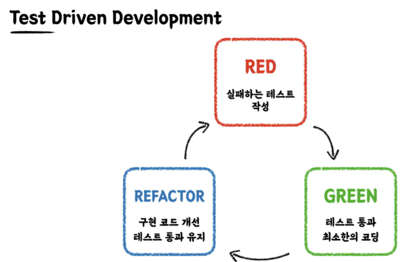
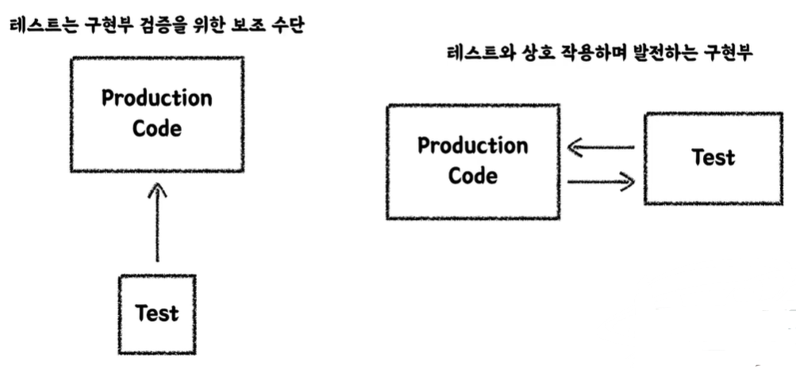

# TDD

​	**TDD**(Test Driven Development) 는 **프로덕션 코드보다 테스트 코드를 먼저 작성하여 테스트가 구현 과정을 주도하도록 하는 방법론**입니다. 아래는 TDD 의 구현과정인 RED, GREEN, REFACTORING 입니다.



1. <span style="color:red">RED</span> : 먼저 실패하는 테스트를 작성합니다. 구현부가 없기 때문에 당연히 실패하게 됩니다.
2. <span style="color:green">GREEN</span> : 빠른 시간 내에 테스트에 통과하도록 구현부를 작성합니다.
3. <span style="color:blue">REFACTOR</span> : 구현 코드를 개선하면서 테스트 통과를 유지합니다.

## 구현 과정

`CafeKiost` 의 `calculateTotalPrice()` 메서드로 TDD 를 구현해보겠습니다.

### RED

먼저 Test case 를 작성합니다.

```java
@Test
void calculateTotalPrice() {
    CafeKiosk cafeKiosk = new CafeKiosk();
    Americano americano = new Americano();
    Latte latte = new Latte();

    cafeKiosk.add(americano);
    cafeKiosk.add(latte);

    int totalPrice = cafeKiosk.calculateTotalPrice();

    assertThat(totalPrice).isEqualTo(8500);
}
```

그리고 컴파일 에러가 나지 않도록 `calculateTotalPrice` 를 선언만 해줍니다.

```java
public class CafeKiost {

    ...
        
    public int calculateTotalPrice() {
    	return 0;
	}
    
}
```

이제 테스트 코드를 실행하면 실행은 되지만 실패가 나옵니다.

### GREEN

`calculateTotalPrice` 메서드가 8500원을 리턴하도록 작성합니다.

```java
public int calculateTotalPrice() {
    return 8500;
}
```

극단적인 예시이긴 하지만, TDD 의 GREEN 의 중요 포인트는 최대한 빠른 시간이기 때문에, 테스트가 통과하도록 최단시간 내에 작성합니다.

### REFACTOR

이제 테스트가 통과하는 걸 유지하면서 `calculateTotalPrice` 의 메서드를 리팩토링해줍니다.

```java
public int calculateTotalPrice() {
    int totalPrice = 0;
    
    for (Beverage beverage : beverages) {
        totalPrice += beverage.getPrice();
    }
    return totalPrice;
}
```

이제 테스트를 다시 돌려봐도 테스트는 통과합니다.

여기서 의미는, **구현부가 아무리 변경되더라도 테스트는 통과하기 때문에 원하는 기능이 정상적으로 작동한다고 볼 수 있습니다.** <u>물론 여러 상황의 테스트를 많이 설정해야 합니다.</u>

이러한 싸이클을 반복적으로 수행하는 기법이 TDD 입니다. 만약 테스트 통과가 보장된다면 구현부를 다음과 같이 `stream` 을 이용해서 변경(리팩토링) 해도 됩니다.

```java
    public int calculateTotalPrice() {
        return beverages.stream().mapToInt(Beverage::getPrice).sum();
    }
```

리팩토링 후 테스트를 실행시키면서 정상 작동하는지 확인합니다.

## TDD 의 장점

### 선 기능 구현, 후 테스트 작성의 문제점

- 테스트 자체의 누락 가능성
- 특정 테스트 케이스(해피 케이스) 만 검증할 가능성
- 잘못된 구현을 다소 늦게 발견할 가능성

### 선 테스트 작성, 후 기능 구현 장점

- 복잡도가 낮은, 테스트 가능한 코드로 구현할 수 있게 합니다.
- 쉽게 발견하기 어려운 엣지(edge) 케이스를 놓치지 않게 해줍니다.
- 구현에 대한 빠른 피드백을 받을 수 있습니다.
- 과감한 리팩토링이 가능해집니다.

예를 들어 아래와 같은 메서드를 먼저 작성한다고 했을 때, TDD 로 구현하게 되면 시간에 따라 예외가 발생하는 테스트를 위해서 <u>"LocalDateTime 을 외부에서 받도록 해야겠다." 라는 생각</u>을 할 수 있게 됩니다.

```java
public Order createOrder(LocalDateTime currentDateTime){

    LocalTime currentTime = currentDateTime.toLocalTime();

    if(currentTime.isBefore(SHOP_OPEN_TIME) || currentTime.isAfter(SHOP_CLOSE_TIME)){
        throw new IllegalStateException("주문 가능 시간이 아닙니다.");
    }

    return new Order(currentDateTime, beverages);
}
```

이처럼 테스트를 위한 구조를 고민하게 되고 적용하게 됩니다. 반대로 기능을 먼저 구현한다면 외부로 테스트하기 힘든 기능을 분리해야겠다는 생각을 하지 못하게 됩니다.

즉 TDD 는 관점을 변화시키는 도구이자 클라이언트 관점에서의 피드백을 주는 테스트 도구입니다.



왼쪽이 기능을 먼저 구현하는 일반적인 개발이라면, 오른쪽이 TDD 입니다. TDD 자체는 Production Code 와 Test Code 가 상호작용을 하면서 발전할 수 있는 방법입니다.