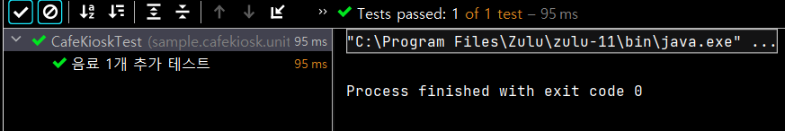

# 테스트는 [ ] 다

테스트는 :memo: [문서] 라고 합니다.

테스트 코드 문서는 프로덕션 기능을 설명할 수 있으며, 다양한 테스트 케이스를 통해 프로덕션 코드를 이해하는 시각과 관점을 보완할 수 있습니다. (TDD 에서 배웠던 것처럼요) 또한 어느 한 사람이 과거에 경험했던 고민의 결과물을 팀 차원으로 승격시켜서 모두의 자산으로 공유할 수 있습니다.

이러한 관점에서 테스트를 작성하는 팁을 알아보도록 하겠습니다.

# DisplayName 을 섬세하게

`@DisplayName` 을 사용해서 `add_auto_test()` 가 어떤 테스트인지 알 수 있도록 해보겠습니다.

```java
    @Test
    @DisplayName("음료 1개 추가 테스트")
    void add_auto_test() {
        CafeKiosk cafeKiosk = new CafeKiosk();
        cafeKiosk.add(new Americano());

        assertThat(cafeKiosk.getBeverages()).hasSize(1);
        assertThat(cafeKiosk.getBeverages().get(0).getName()).isEqualTo("아메리카노");
        
    }
```

결과는 아래와 같이 잘 나옵니다.



하지만 이것만으로 충분할까요? 아래 `@DisplayName` 을 보겠습니다.

```java
    @Test
    @DisplayName("음료 1개 추가하면 주문 목록에 담긴다.")
    void add_auto_test() {
        ...
    }
```

`음료 1개 추가하면 주문 목록에 담긴다.` 라는 문장과 `음료 1개 추가 테스트` 를 봤을 때, 테스트 코드를 처음보는 사람이 어떤 내용에서 더 많은 정보를 얻을 수 있을까요? <u>당연히 전자일 것입니다.</u>

## DisplayName 을 적는 방법

1. 명사의 나열보다 문장으로 적어야 합니다.
   - Ex. `A 이면 B 이다`, `A 이면 B 가 아니고 C 다`
   - `음료 1개 추가 테스트` (:x:) --> "~~테스트"로 끝내지 않아야 합니다.
2. 테스트 행위에 대한 결과까지 기술해야 합니다.
   - `음료를 1개 추가할 수 있다` (:x:) --> `음료를 1개 추가하면 주문 목록에 담긴다`(:o:)
3. **도메인 용어**를 사용하여 한층 추상화된 내용을 담습니다. 메서드 자체의 관점보다 도메인 정책을 관점으로 기술해야 합니다.
   - `특정 시간 이전에 주문을 생성하면 실패한다` (:x:) --> `영업 시작 시간 이전에는 주문을 생성할 수 없다`(:o:)
4. 테스트의 현상을 중점으로 기술하지 않아야 합니다.
   - `특정 시간 이전에 주문을 생성하면 실패한다` (:x:) --> 테스트 현상(실패) 를 중점으로 기술하고 있습니다.

# BDD

BDD 는 **Behavior Driven Development** 의 약자로, TDD 에서 파생된 개발 방법입니다. 함수 단위의 테스트에 집중하기보다, 시나리오에 기반한 테스트케이스 자체에 집중하여 테스트하는 방법론입니다. 개발자가 아닌 사람이 봐도 이해할 수 있을 정도의 추상화 수준(레벨) 이 권장됩니다.

## Given /When / Then

BDD 에서 제시하는 기본 툴입니다.

- Given : 시나리오 진행에 필요한 모든 준비 과정 (객체, 값, 상태 등)
- When : 시나리오 행동 진행
- Then : 시나리오 진행에 대한 결과 명시, 검증

"**어떤 환경에서**(Given) **어떤 행동을 진행했을 때**(When) **어떤 상태 변화가 일어난다**(Then)" 로 표현됩니다. 이는`@DisplayName` 에 명확하게 작성할 수 있습니다.

아래는 BDD 를 사용한 `calculateTotalPrice()` 테스트입니다.

```java
@Test
    @DisplayName("주문목록에 담긴 상품들의 총 금액을 계산할 수 있다.")
    void calculateTotalPrice() {

        // given
        CafeKiosk cafeKiosk = new CafeKiosk();
        Americano americano = new Americano();
        Latte latte = new Latte();

        cafeKiosk.add(americano);
        cafeKiosk.add(latte);

        // when, 보통 1줄인 경우가 많습니다.
        int totalPrice = cafeKiosk.calculateTotalPrice();

        //then
        assertThat(totalPrice).isEqualTo(8500);
    }
```


