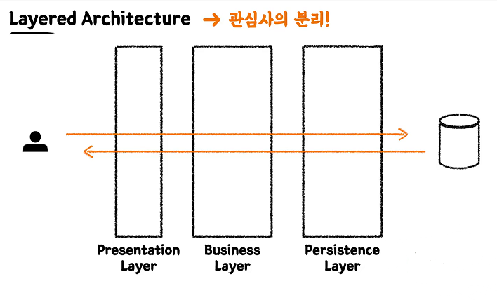
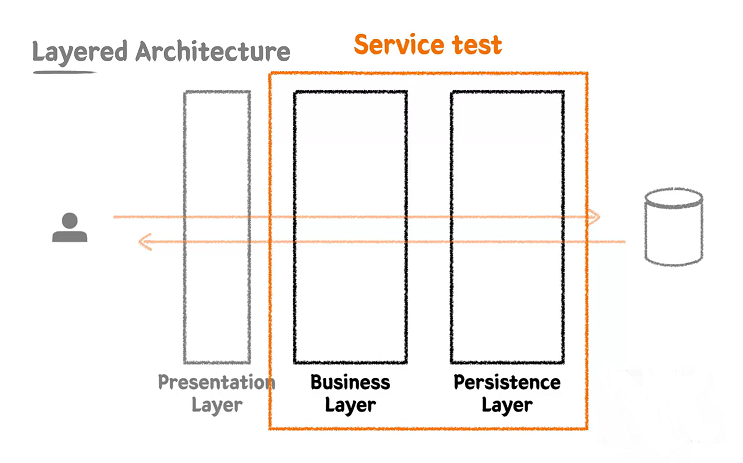

# 레이어드 아키텍처(Layered Architecture) 와 테스트



스프링은 **관심사의 분리**를 위해서 보통 위와 같이 3계층으로 나눠서 구분하는데요. 관심사를 분리해서 책임을 나누고 유지보수를 잘하기 위함입니다.

이전 섹션까지 배운 테스트는 모듈(클래스, 메서드) 을 테스트하는 단위 테스트입니다. 하지만 여러 모듈이 통합되어 동작할 때 어떻게 동작하고 결과가 나올지 예측할 수 없습니다. 이 때 필요한 게 통합 테스트(Integration Test) 입니다.

<u>**통합테스트**는 여러 모듈이 협력하는 기능을 통합적으로 검증하는 테스트</u>입니다. 일반적으로 작은 범위의 단위 테스트만으로는 기능 전체의 신뢰성을 보장할 수 없기 때문에, 풍부한 단위 테스트와 함께 큰 기능 단위를 검증하는 통합 테스트가 필요합니다.


# Persistence Layer 테스트

:heavy_check_mark: 요구사항

- 키오스크 주문을 위한 상품 후보 리스트 조회
- 상품의 판매상태 : 판매중, 판매보류 판매 정지
  - 판매중, 판매보류인 상태의 상품을 화면에 보여줍니다.
- id, 상품번호, 상품 타입, 판매상태, 상품 이름, 가격

## 엔티티 설계

먼저 `Product` 엔티티를 만듭니다.

```java
@Entity
@Getter
@NoArgsConstructor(access = AccessLevel.PROTECTED)
public class Product extends BaseEntity {

    @Id
    @GeneratedValue(strategy = GenerationType.IDENTITY)
    private Long id;

    private String productNumber;

    @Enumerated(EnumType.STRING)
    private ProductType type;

    @Enumerated(EnumType.STRING)
    private ProductSellingStatus sellingStatus;

    private String name;

    private int price;
}
```

`application.yml` 파일에서 다음과 같은 속성으로 data.sql 이  Hibernate 초기화 이후 실행되도록 합니다.

```java
spring:
...
	jpa:
        hibernate:
          ddl-auto: create
        show-sql: true
        properties:
          hibernate:
            format_sql: true
        defer-datasource-initialization: true # (2.5~) Hibernate 초기화 이후 data.sql 실행 (이게 없으면 Hibernate 초기화 이전에 data.sql 가 실행됨)

```

나머지 코드는 https://github.com/wbluke/practical-testing/tree/lesson5-3 에서 확인해주세요.

## 테스트 코드

​	Persistence Layer 에서는 통합 테스트를 위한 `@SpringBootTest` 어노테이션을 사용하지만, 데이터베이스 엑세스만 하는 기능을 확인하기 때문에 단위 테스트의 성격 또한 가지고 있습니다.

> @DataJpaTest : 데이터 엑세스 계층을 테스트하기 위한 어노테이션입니다. 스프링부트테스트보다 가벼워서 속도가 더 빠릅니다.

아래는 `ProductRepository` 의 `findAllBySellingStatusIn()` 를 테스트하기 위한 코드입니다.

```java
//@SpringBootTest
@DataJpaTest
@ActiveProfiles("test")
class ProductRepositoryTest {
    @Autowired
    private ProductRepository productRepository;

    @Test
    @DisplayName("원하는 판매상태를 가진 상품들을 조회한다.")
    void findAllBySellingStatusIn() {
        //given
        Product product1 = Product.builder()
                .productNumber("001")
                .type(HANDMADE)
                .sellingStatus(SELLING)
                .name("아메리카노")
                .price(4000)
                .build();
        Product product2 = Product.builder()
                .productNumber("002")
                .type(HANDMADE)
                .sellingStatus(HOLD)
                .name("카페라떼")
                .price(4500)
                .build();
        Product product3 = Product.builder()
                .productNumber("003")
                .type(HANDMADE)
                .sellingStatus(STOP_SELLING)
                .name("팥빙수")
                .price(7000)
                .build();

        productRepository.saveAll(List.of(product1, product2, product3));

        //when
        List<Product> products = productRepository.findAllBySellingStatusIn(forDisplay());

        //then
        assertThat(products).hasSize(2)
                .extracting("productNumber", "name", "sellingStatus")
                .containsExactlyInAnyOrder(
                        tuple("001", "아메리카노", SELLING),
                        tuple("002", "카페라떼", HOLD)
                );

    }
}
```

`@ActiveProfiles("test")` : `application.yml` 파일의 `profile` 을 `test` 로 사용하기 위해 지정합니다.

`assertThat` 에서 `.hasSize(2)` 로 리스트의 사이즈를 확인한 후 `extracting()` 과 `containsExactlyInAnyOrder()` 로 튜플값을 확인합니다. 리스트를 검증하기 좋습니다.

`contains()` 는 해당 값이 있는지 검증, `containsExactly()` 는 순서까지 정확하게 맞아야 합니다.

# Business Layer 테스트

​	Business Layer 는 말 그대로 비즈니스 로직을 구현하는 역할이며, Persistence Layer 와의 상호작용(Data 를 읽고 쓰는 행위) 을 통해 비즈니스 로직을 전개시킵니다.

​	 Business Layer 테스트는 Persistence Layer 를 배제하지 않고, 통합 테스트 같은 느낌으로 작성이 됩니다.



:heavy_check_mark: 요구사항

- 상품 번호 리스트를 받아 주문 생성하기
- 주문은 주문 상태, 주문 등록 시간을 가집니다.
- 주문의 총 금액을 계산할 수 있어야 합니다.

## 테스트 작성1

​	TDD 기법을 사용한다면, 먼저 컴파일 에러가 나지 않을 정도로만 클래스를 만들고 테스트를 작성합니다.

먼저 **OrderService** 클래스입니다.

```java
@Service
public class OrderService {
    public OrderResponse createOrder(OrderCreateRequest request) {
        return null;
    }
}
```

`createOrder()` 메서드를 호출했을 때 컴파일 에러가 나지 않을 정도만 작성합니다.

```java
@SpringBootTest
class OrderServiceTest {

    @Autowired
    private ProductRepository productRepository;
    @Autowired
    private OrderService orderService;
    

    @Test
    @DisplayName("주문번호 리스트를 받아 주문을 생성한다.")
    void createOrder() {
        //given
        Product product1 = createProduct(HANDMADE, "001", 1000);
        Product product2 = createProduct(HANDMADE, "002", 3000);
        Product product3 = createProduct(HANDMADE, "003", 5000);
        productRepository.saveAll(List.of(product1, product2, product3));

        OrderCreateRequest request = OrderCreateRequest.builder()
                .productNumbers(List.of("001", "002"))
                .build();

        //when
        OrderResponse orderResponse = orderService.createOrder(request);

        //then
        assertThat(orderResponse.getId()).isNotNull();
        assertThat(orderResponse)
                .extracting("registeredDateTime", "totalPrice")
                .contains(registeredDateTime, 4000);
        assertThat(orderResponse.getProducts()).hasSize(2)
                .extracting("productNumber", "price")
                .containsExactlyInAnyOrder(
                        tuple("001", 1000),
                        tuple("002", 3000)
                );

    }
    
    private Product createProduct(ProductType type, String productNumber, int price){
        return Product.builder()
                .productNumber(productNumber)
                .type(type)
                .sellingStatus(SELLING)
                .name("메뉴 이름")
                .price(price)
                .build();
    }
}
```

`orderService.createOrder(request)` 을 하면 주문이 저장되고 `OrderResponse` 가 반환됩니다. 해당 `orderResponse` 가 2개가 맞는지, 튜플은 일치하는지 검증하는 로직을 작성합니다.

이제 `OrderService` 로직을 작성해야 하는데요. 아래는 `OrderService` 의 `createOrder()` 메서드입니다.

```java
public OrderResponse createOrder(OrderCreateRequest request) {

        List<String> productNumbers = request.getProductNumbers();

        //product 를 찾음
        List<Product> products = productRepository.findAllByProductNumberIn(productNumbers);

        //order 생성
        ...

        return null;
    }
```

`productRepository` 에서 `findAllByProductNumberIn()` 메서드를 통해 `"001"`, `"002"` 와 같은 `productNumbers` 를 파라미터로 주고 `List<Product>` 를 반환하도록 만듭니다. **이를 위해서 `findAllByProductNumberIn()` 에 대한 단위 테스트가 진행되어야 합니다.**

아래는 `productRepository` 입니다.

```java
public interface ProductRepository extends JpaRepository<Product, Long> {

    ...

    List<Product> findAllByProductNumberIn(List<String> productNumbers);
}
```

메서드 기능이 추가되었으니 단위 테스트가 필요합니다. `ProductRepositoryTest` 에서 단위 테스트를 진행합니다.

```java
@Test
@DisplayName("상품번호 리스트로 상품을 조회한다.")
void findAllByProductNumberIn() {
    //given
    Product product1 = Product.builder()
            .productNumber("001")
            .type(HANDMADE)
            .sellingStatus(SELLING)
            .name("아메리카노")
            .price(4000)
            .build();
    Product product2 = Product.builder()
            .productNumber("002")
            .type(HANDMADE)
            .sellingStatus(HOLD)
            .name("카페라떼")
            .price(4500)
            .build();
    Product product3 = Product.builder()
            .productNumber("003")
            .type(HANDMADE)
            .sellingStatus(STOP_SELLING)
            .name("팥빙수")
            .price(7000)
            .build();

    productRepository.saveAll(List.of(product1, product2, product3));

    //when
    List<Product> products = productRepository.findAllByProductNumberIn(List.of("001", "002"));

    //then
    assertThat(products).hasSize(2)
            .extracting("productNumber", "name", "sellingStatus")
            .containsExactlyInAnyOrder(
                    tuple("001", "아메리카노", SELLING),
                    tuple("002", "카페라떼", HOLD)
            );

}
```

정상적으로 통과하는 걸 보고 다시 `OrderSevice` 의 `createOrder()` 로 돌아옵니다.

```java
 public OrderResponse createOrder(OrderCreateRequest request) {

        List<String> productNumbers = request.getProductNumbers();

        //product 를 찾음
        List<Product> products = productRepository.findAllByProductNumberIn(productNumbers);

        //order 생성
        Order order = Order.create(products);
        orderRepository.save(order);

        return null;
    }
```

`Order.create(products)` 를 통해 `Order` 를 생성합니다. 해당 메서드는 아래와 같이 `Order` 클래스의 생성 메서드입니다.

```java
public Order(List<Product> products) {
    this.orderStatus = OrderStatus.INIT;
    this.totalPrice = calculateTotalPrice(products);
    this.registeredDateTime = LocalDateTime.now();
    this.orderProducts = products.stream()
            .map(product -> new OrderProduct(this, product))
            .collect(Collectors.toList());
}

private int calculateTotalPrice(List<Product> products) {
    return products.stream().mapToInt(Product::getPrice).sum();
}

public static Order create(List<Product> products) {
    return new Order(products, registeredDateTime);
}
```

**해당 메서드를 만들었으면 다시 단위 테스트를 진행해야 하는데요.** `totalPrice` 값이 정확한지, `OrderStatus` 가 `INIT` 인지를 확인합니다. (생략)

**하지만 `registeredDateTime` 은 확인할 수 있을까요? 현재 상태에서 해당 값은 외부 환경(현재 시간) 에 종속적입니다. 따라서 테스트하기 편하도록 변수로 받아야 합니다.** 아래와 같이 리팩토링합니다.

```java
public Order(List<Product> products, LocalDateTime registeredDateTime) {
    this.orderStatus = OrderStatus.INIT;
    this.totalPrice = calculateTotalPrice(products);
    this.registeredDateTime = registeredDateTime;
    this.orderProducts = products.stream()
            .map(product -> new OrderProduct(this, product))
            .collect(Collectors.toList());
}

private int calculateTotalPrice(List<Product> products) {
    return products.stream().mapToInt(Product::getPrice).sum();
}

public static Order create(List<Product> products, LocalDateTime registeredDateTime) {
    return new Order(products, registeredDateTime);
}
```

 `create()` 메서드도 `LocalDateTime` 을 받아야 하니 `OrderService` 를 수정합니다.

```java
public OrderResponse createOrder(OrderCreateRequest request, LocalDateTime registeredDateTime) {

    List<String> productNumbers = request.getProductNumbers();

    //product 를 찾음
    List<Product> products = productRepository.findAllByProductNumberIn(productNumbers);

    //order 생성
    Order order = Order.create(products, registeredDateTime);
    orderRepository.save(order);

    return null;
}
```

이제 `registeredDateTime` 은 컨트롤러에서 받게 됩니다. 아래는 Order 클래스의 `registeredDateTime` 을 검증하는 테스트입니다.

```java
@Test
@DisplayName("주문 생성 시 주문 등록 시간을 기록한다.")
void registeredDateTime() {
    //given
    LocalDateTime registeredDateTime = LocalDateTime.now();

    List<Product> products = List.of(
            createProduct("001", 1000),
            createProduct("002", 2000)
    );

    //when
    Order order = Order.create(products, registeredDateTime);

    //then
    assertThat(order.getRegisteredDateTime()).isEqualTo(registeredDateTime);

}
```

마지막으로 `createOrder()` 메서드에서 `OrderReponse` 의 `of()` 메서드로 `order` 를 `OrderResponse` 로 변경하여 리턴합니다.

```java
public OrderResponse createOrder(OrderCreateRequest request, LocalDateTime registeredDateTime) {

    List<String> productNumbers = request.getProductNumbers();

    //product 를 찾음
    List<Product> products = productRepository.findAllByProductNumberIn(productNumbers);

    //order 생성
    Order order = Order.create(products, registeredDateTime);
    orderRepository.save(order);

    return OrderResponse.of(order);
}
```

최종적으로 테스트에서 `registeredDateTime` 을 `createOrder` 에 주입하여 검증합니다.

```java
@Test
    @DisplayName("주문번호 리스트를 받아 주문을 생성한다.")
    void createOrder() {
        //given
        Product product1 = createProduct(HANDMADE, "001", 1000);
        Product product2 = createProduct(HANDMADE, "002", 3000);
        Product product3 = createProduct(HANDMADE, "003", 5000);
        productRepository.saveAll(List.of(product1, product2, product3));

        OrderCreateRequest request = OrderCreateRequest.builder()
                .productNumbers(List.of("001", "002"))
                .build();

        LocalDateTime registeredDateTime = LocalDateTime.now();

        //when
        OrderResponse orderResponse = orderService.createOrder(request, registeredDateTime);

        //then
        assertThat(orderResponse.getId()).isNotNull();
        assertThat(orderResponse)
                .extracting("registeredDateTime", "totalPrice")
                .containsExactly(registeredDateTime, 4000);
        assertThat(orderResponse.getProducts()).hasSize(2)
                .extracting("productNumber", "price")
                .containsExactlyInAnyOrder(
                        tuple("001", 1000),
                        tuple("002", 3000)
                );

    }
```

### 중간 정리

복잡해보이지만 아래와 같은 플로우로 진행되었습니다.

TDD 를 위한 테스트 코드(`OrderServiceTest.createOrder()`) 작성 -> `createOrder` 메서드 생성 -> 메서드 생성에 필요한 로직(`findAllByProductNumberIn()`, `Order.create()`) 을 다시 TDD 기법으로 생성 -> TDD 완성

## 테스트 작성2

이제 중복 주문을 주문하는 테스트를 작성해보겠습니다.

```java
@Test
@DisplayName("중복되는 상품번호 리스트로 주문을 생성할 수 있다.")
void createOrderWithDuplicateProductNumbers() {
    //given
    Product product1 = createProduct(HANDMADE, "001", 1000);
    Product product2 = createProduct(HANDMADE, "002", 3000);
    Product product3 = createProduct(HANDMADE, "003", 5000);
    productRepository.saveAll(List.of(product1, product2, product3));

    OrderCreateRequest request = OrderCreateRequest.builder()
            .productNumbers(List.of("001", "001"))
            .build();

    LocalDateTime registeredDateTime = LocalDateTime.now();

    //when
    OrderResponse orderResponse = orderService.createOrder(request, registeredDateTime);

    //then
    assertThat(orderResponse.getId()).isNotNull();
    assertThat(orderResponse)
            .extracting("registeredDateTime", "totalPrice")
            .containsExactly(registeredDateTime, 2000);
    assertThat(orderResponse.getProducts()).hasSize(2)
            .extracting("productNumber", "price")
            .containsExactlyInAnyOrder(
                    tuple("001", 1000),
                    tuple("001", 1000)
            );
}
```

해당 테스트를 돌려보면 총 주문금액이 1000원으로 오류가 나는걸 확인할 수 있습니다. 이는 비즈니스 로직에서 중복을 확인하지 않기 때문인데요. `OrderService` 를 보겠습니다.

```java
public OrderResponse createOrder(OrderCreateRequest request, LocalDateTime registeredDateTime) {

    List<String> productNumbers = request.getProductNumbers();

    //product 를 찾음
    List<Product> products = productRepository.findAllByProductNumberIn(productNumbers);

    //order 생성
    Order order = Order.create(products, registeredDateTime);
    orderRepository.save(order);


    return OrderResponse.of(order);
}
```

 `OrderService` 의 `createOrder()` 메서드는 `findAllByProductNumberIn(productNumbers)` 를 통해 상품을 검색합니다. 이때 IN("001", "001") 이 들어가면 중복이 제거됩니다. 

이를 해결하기 위해 `Map` 을 이용해서 해결할 수 있습니다.

```java
public OrderResponse createOrder(OrderCreateRequest request, LocalDateTime registeredDateTime) {

    List<String> productNumbers = request.getProductNumbers();

    //product 를 찾음
    List<Product> products = productRepository.findAllByProductNumberIn(productNumbers);

    Map<String, Product> productMap = products.stream()
            .collect(Collectors.toMap(Product::getProductNumber, product -> product));

    List<Product> duplicateProducts = productNumbers.stream()
            .map(productMap::get)
            .collect(Collectors.toList());

    //order 생성
    Order order = Order.create(duplicateProducts, registeredDateTime);
    orderRepository.save(order);

    return OrderResponse.of(order);
}
```

`productMap` 은 `findAllByProductNumberIn()` 메서드로 찾은 `product` 의 `productNumber` 와 `product` 자신을 맵에 넣습니다. 그리고 `duplicateProducts` 는 `productNumbers` 를 키값으로 `productMap` 에서 해당 `product` 를 찾습니다. 이제 테스트를 실행시키면 정상 검증이 되는 걸 확인할 수 있습니다.

아래는 리팩토링한 내용입니다.

```java
public OrderResponse createOrder(OrderCreateRequest request, LocalDateTime registeredDateTime) {

    List<String> productNumbers = request.getProductNumbers();

    //product 를 찾음
    List<Product> products = findProductsBy(productNumbers);

    //order 생성
    Order order = Order.create(products, registeredDateTime);
    orderRepository.save(order);

    return OrderResponse.of(order);
}

private List<Product> findProductsBy(List<String> productNumbers) {

    List<Product> products = productRepository.findAllByProductNumberIn(productNumbers);

    Map<String, Product> productMap = products.stream()
            .collect(Collectors.toMap(Product::getProductNumber, product -> product));

    return productNumbers.stream()
            .map(productMap::get)
            .collect(Collectors.toList());
}
```

`products` 를 찾는 과정 자체가 하나의 로직이기 때문에 따로 분리했습니다.

여기서 2개의 테스트 (`createOrder()` 와 `reateOrderWithDuplicateProductNumbers()`) 를 함께 돌리면 오류가 납니다. 이유는 첫번째 테스트에서 저장된 값이 지워지지 않았기 때문입니다. Business Layer Test 에서 해당 값을 지우기 위해 `@AfterEach` 를 사용합니다.

```java
@AfterEach
void tearDown() {
    orderProductRepository.deleteAllInBatch();
    productRepository.deleteAllInBatch();
    orderRepository.deleteAllInBatch();
}
```


## Business Layer Test 에서 @Transactional 을 사용하지 않는 이유

`@Transactional` 을 사용하면 편하게 롤백할 수 있습니다. 또한 서비스 클래스까지 트랜잭션이 전파되어 영속성 컨텍스트를 사용할 수 있습니다. **하지만 마치 `Service` 에 트랜잭션이 적용된 것처럼 작동할 수 있어서, 실제로는 트랜잭션이 적용되지 않았음에도 모른 채 넘어갈 수 있는 부작용이 있습니다.** 따라서 아래와 같이 수동으로 모든 데이터를 삭제해주면 안전합니다.

```java
@AfterEach
void tearDown() {
    orderProductRepository.deleteAllInBatch();
    productRepository.deleteAllInBatch();
    orderRepository.deleteAllInBatch();
    stockRepository.deleteAllInBatch();
}
```

하지만 `@Transactional` 을 사용하는 데 있어서 위와 같은 주의사항을 알고만 있다면 해당 어노테이션을 사용해도 무방합니다.
