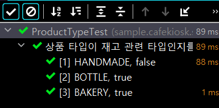
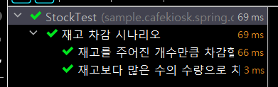

# 한 문단에 한 주제

​	테스트도 문서로서의 기능을 합니다. 글쓰기의 관점으로 봤을 때 테스트가 하나의 문단이라고 봤을 때 하나의 주제만 가지는 게 좋습니다. 

​	예를 들어서 아래와 같이 "분기문" 이 있다면 해당 분기문 자체가 조건을 나눈다는 뜻이니, 주제가 2개 이상 들어갔다는 뜻이겠죠.

```java
@Test
void test(){
	if(A 일 때){
		정상수행
	}else(A 가 아닐 때){
		예외발생
	}
}
```

따라서 위와 같은 코드는 당연히 두 개의 테스트로 분리해야 합니다.


## 완벽하게 제어하기

​	`LocalDateTime.now()` 와 같이 외부 요인은 고정된 값으로 받을 수 있도록 구성하는 것입니다. 아래는 `OrderService` 의 `createOrder()` 메서드입니다.

```java
public OrderResponse createOrder(OrderCreateServiceRequest request, LocalDateTime registeredDateTime) {

    List<String> productNumbers = request.getProductNumbers();

    //product 를 찾음
    List<Product> products = findProductsBy(productNumbers);

    deductStockQuantities(products);

    //order 생성
    Order order = Order.create(products, registeredDateTime);
    orderRepository.save(order);

    return OrderResponse.of(order);
}
```

`LocalDateTime` 은 외부 요인이기 때문에 테스트하기 쉽도록 파라미터로 받습니다.

# 테스트 환경의 독립성을 보장

​	테스트 환경이란 `given` 절에서 테스트를 위한 준비과정입니다. 테스트 환경에서 다른 API 를 호출하며 결합성이 생성되는 경우가 있습니다. 따라서 이러한 부분을 없애서 독립성을 보장해야 합니다.

```java
@Test
@DisplayName("재고가 없는 상품으로 주문을 생성하려는 경우 예외가 발생한다.")
void createOrderWithNoStock() {
    //given
    Product product1 = createProduct(BOTTLE, "001", 1000);
    Product product2 = createProduct(BAKERY, "002", 3000);
    Product product3 = createProduct(HANDMADE, "003", 5000);
    productRepository.saveAll(List.of(product1, product2, product3));

    Stock stock1 = Stock.create("001", 2); //1
    Stock stock2 = Stock.create("002", 2);
    stock1.deductQuantity(1); //2
    stockRepository.saveAll(List.of(stock1, stock2));

    OrderCreateServiceRequest request = OrderCreateServiceRequest.builder()
            .productNumbers(List.of("001", "001", "002", "003"))
            .build();

    LocalDateTime registeredDateTime = LocalDateTime.now();

    //when //then
    assertThatThrownBy(() -> orderService.createOrder(request, registeredDateTime))
            .isInstanceOf(IllegalArgumentException.class)
            .hasMessage("재고가 부족한 상품이 있습니다.");

}
```

`createOrderWithNoStock()` 테스트는 재고가 없는 상품으로 주문을 생성하려는 경우 예외가 발생하는지 체크하는 테스트입니다. **여기에서 테스트 환경의 독립성을 해치는 메서드가 있습니다.**

- 주석 1 : `Stock.create()` 는 팩토리 메서드입니다. 팩토리 메서드는 특정 목적을 가지고 만들어진 메서드로, 비즈니스 환경이 변경되면 내부 생성 로직이 변경될 수 있습니다. 따라서 팩토리 메서드보다는 생성자나 빌더를 통해 객체를 만들어야 합니다.
- 주석 2 : `stock1.deductQuantity(1)` 로 재고 개수를 1개 감소시켜서 조건을 만듭니다. 하지만 이렇게 새로운 메서드가 들어오면 논리구조가 추가되어 맥락이 끊기는데, 이는 **앞서 말한 한 테스트에 한 주제 원칙을 지키지 못하게 합니다.** 또한 **해당 기능에 문제가 생겼을 경우 given 절에서 에러가 발생하게 됩니다.** 예를 들어 `deductQuantity(3)` 이라고 하면 에러가 발생합니다.

# 테스트 간 독립성 보장

​	공유 자원을 사용하는 경우 테스트의 순서에 따라 테스트의 결과가 달라질 수 있습니다. 

```java
class StockTest {

    private static final Stock stock = Stock.create("001", 1);

    @Test
    @DisplayName("재고 수량이 제공된 수량보다 작은지 확인한다.")
    void isQuantityLessThanEx() {
        //given
        int quantity = 2;

        //when
        boolean result = stock.isQuantityLessThan(quantity);

        //then
        assertThat(result).isTrue();
    }

    @Test
    @DisplayName("재고를 주어진 개수만큼 차감할 수 있다.")
    void deductQuantityEx() {
        //given
        int quantity = 1;

        //when
        stock.deductQuantity(quantity);

        //then
        assertThat(stock.getQuantity()).isZero();
    }
}
```

위 코드에서, `isQuantityLessThanEx()` 테스트가 먼저 실행된다면 `deductQuantityEx()` 메서드에 영향을 미치게 됩니다.

# 한 눈에 들어오는 Test Fixture 구성하기

​	Test Fixture 란 테스트를 위해 원하는 상태로 고정시킨 일련의 객체를 의미합니다. BDD 에서 `given` 으로 볼 수 있습니다. 여기서 몇가지 주의사항이 있습니다.

1. `@BeforeEach` 에 `given` 데이터를 않아야 합니다.

   - 여기에 given 데이터를 넣으면 **테스트 메서드별 결합도를 증가**시킵니다. 해당 데이터를 변경했을 때 각 테스트별로 미치는 영향이 다릅니다.
   - **정보가 파편화되어 있어서 테스트 메서드에서 한 눈에 보기 힘듭니다.** 테스트가 문서로서의 역할을 하기 힘들어집니다.
   - 그럼 언제 사용할까요? 다음 두가지 조건을 만족할 때 사용합니다.
     1. 각 테스트 입장에서 봤을 때 아예 몰라도 테스트 내용을 이해하는 데 문제가 없을 때
     2. 수정해도 모든 테스트에 영향을 주지 않을 때

2. data.sql 을 통해 given 데이터를 넣지 않아야 합니다.

   - 위 내용과 마찬가지입니다. **정보의 파편화, 유지보수 등의 문제**가 있습니다.

3. 아래와 같은 생성 메서드 사용 시 주의사항입니다.

   ```java
   private Product createProduct(String productNumber, ProductType type, ProductSellingStatus sellingStatus, String name, int price) {
       return Product.builder()
               .productNumber(productNumber)
               .type(type)
               .sellingStatus(sellingStatus)
               .name(name)
               .price(price)
               .build();
   }
   ```

   - **파라미터는 테스트 케이스에 필요한 것만 남겨야 합니다.** 예를 들어 상품이름이 다 같아도 된다면 상품이름은 파라미터로 넘기지 않습니다.

4. 추상클래스로 생성 메서드를 만들 수 있지만, 복잡성 때문에 사용하지 않습니다.

   - 위에서 서술했듯, 필요한 파라미더로만 생성 메서드를 만든다면 추상클래스 내 메서드가 수십 개 이상이 되기 떄문입니다.
   - **따라서 생성 메서드는 귀찮더라도 각 테스트 클래스별로 만들어줍니다.**

# Text Fixture 클렌징

`deleteAllInBatch()` 에 대한 설명입니다. **테스트 `given` 을 위해 데이터를 생성해서 저장하면 테스트 메서드 종료 시 클렌징이 필요합니다.** 지금까지 Repository 내 데이터 삭제는 `@AfterEach` 에서 `deleteAllInBatch()` 로 했었는데요. 해당 메서드와 `deleteAll()` 의 차이가 뭔지 보겠습니다.

## deleteAllInBatch()

​	먼저 `deleteAllInBatch()` 사용 시 쿼리입니다.

```java
@AfterEach
    void tearDown() {
        orderProductRepository.deleteAllInBatch(); //bulk 쿼리
        productRepository.deleteAllInBatch();
        orderRepository.deleteAllInBatch();
        stockRepository.deleteAllInBatch();
    }
```

```mysql
delete 
from
    order_product
delete 
from
    product

delete 
from
    orders
delete 
from
    stock
```

모든 레코드를 한번에 지우는 벌크성 쿼리문이 나갑니다. **하지만 외래키 제약조건때문에 `orderProductRepository` 를 먼저 지워야만 이후의 `productRepository` 와 `orderRepository` 의 삭제가 정상 작동합니다.**

## deleteAll()

​	이번엔 `deleteAll()` 입니다.

```java
    @AfterEach
    void tearDown() {

//        orderProductRepository.deleteAll(); //없어도 됨
        orderRepository.deleteAll(); // 대신 order 를 지우면서 연관된 orderProduct 를 지움
        productRepository.deleteAll();
        

        stockRepository.deleteAllInBatch();
    }
```

​	`deleteAll()` 메서드는 **select 로 모든 테이블 레코드를 읽은 후 `where id = ?` 를 통해 모든 데이터를 지웁니다. 즉, 성능 상 불리한 점이 있습니다.**

​	하지만 하나씩 지우기 때문에 `orderProductRepository.deleteAll()` 가 없어도 `orderRepository.deleteAll()` 에서 `order` 을 하나씩 지우면서 연관된 `orderProduct` 를 지웁니다. CASCADE 정책때문입니다.

### JpaSimpleRepository 의 deleteAll() 메서드 보기

```java
@Override
	@Transactional
	public void deleteAll() {

		for (T element : findAll()) {
			delete(element);
		}
	}
```

​	위 코드처럼, `findAll()` 로 모두 찾은 후 (`select` 쿼리문), `delete(element)` 로 하나씩 지웁니다. (`delete from xxx where id =?` 쿼리문) 따라서 지워야 할 레코드가 100개라면 쿼리는 101개가 나가게 됩니다.

## 결론

​	테스트를 수행하는 시간도 비용입니다. 아무리 인메모리 DB 라고 해도, 쿼리문이 N+1 개가 나간다면 `deleteAll()` 을 사용할 때 큰 비용이 든다고 할 수 있습니다.

​	사이드 이펙트만 잘 고려한다면 `@Transactional` 을 사용해도 됩니다.

# @ParameterizedTest

​	할당 값을 여러 개로 바꿔서 테스트하고 싶을 때 사용합니다.

```java
@ParameterizedTest
@CsvSource({
        "HANDMADE, false",
        "BOTTLE, true",
        "BAKERY, true"
})
@DisplayName("상품 타입이 재고 관련 타입인지를 체크한다.")
void containsStockType4(ProductType productType, boolean expected) {
    //given
    boolean result = ProductType.containsStockType(productType);

    //when

    //then
    assertThat(result).isEqualTo(expected);

}
```

`@CsvSource` 처럼 `@xxxSource` 어노테이션으로 파라미터로 넣을 값을 줍니다. 그리고 테스트 메서의 파라미터로 사용합니다. 이때 `@Test` 대신 `@ParameterizedTest` 를 사용해야 합니다.

Source 를 주는 방식은 여러가지 있습니다. 아래는 메서드를 소스로 주는 방법입니다.

```java
private static Stream<Arguments> provideProductTypesForCheckingStockType() {
    return Stream.of(
            Arguments.of(ProductType.HANDMADE, false),
            Arguments.of(ProductType.BOTTLE, true),
            Arguments.of(ProductType.BAKERY, true)
    );
}

@ParameterizedTest
@MethodSource("provideProductTypesForCheckingStockType")
@DisplayName("상품 타입이 재고 관련 타입인지를 체크한다.")
void containsStockType5(ProductType productType, boolean expected) {
    //given

    //when
    boolean result = ProductType.containsStockType(productType);

    //then
    assertThat(result).isEqualTo(expected);

}
```

아래와 같이 파라미터 개수 (3개) 만큼 테스트가 실행됩니다.



# @DynamicTest

​	하나의 공유 자원으로 시나리오와 같은 여러 테스트를 수행할 수 있게 합니다. 아래와 같은 형식입니다.

```java
@DisplayName("")
    @TestFactory
    Collection<DynamicTest> dynamicTest(){

        return List.of(
                DynamicTest.dynamicTest("dispalyName", () ->{
					//given
					
					//when
					
					//then
                }),
                DynamicTest.dynamicTest("", () ->{
                	//given
                	
                	//when
                	
                	//then

                })
        );
    }
```

`DynamicTest.dynamicTest()` 메서드를 리스트의 원소로 리턴하면 됩니다.

시나리오가 있을 때에는 단계 단계 쪼개는 것보다 이렇게 한번에 쓰면 가독성이 높아질 수 있습니다. 아래는 재고 차감 시나리오 입니다.

```java
@DisplayName("재고 차감 시나리오")
@TestFactory
Collection<DynamicTest> stockDeductionDynamicTest() {
    // given
    Stock stock = Stock.create("001", 1);

    return List.of(
            DynamicTest.dynamicTest("재고를 주어진 개수만큼 차감할 수 있다.", () -> {
                // given
                int quantity = 1;

                // when
                stock.deductQuantity(quantity);

                // then
                assertThat(stock.getQuantity()).isZero();
            }),
            DynamicTest.dynamicTest("재고보다 많은 수의 수량으로 차감 시도하는 경우 예외가 발생한다.", () -> {
                // given
                int quantity = 1;

                // when // then
                assertThatThrownBy(() -> stock.deductQuantity(quantity))
                        .isInstanceOf(IllegalArgumentException.class)
                        .hasMessage("차감할 재고 수량이 없습니다.");
            })
    );
}
```

결과는 이렇게 나옵니다.



# 테스트 수행도 비용이다. 환경 통합하기

​	기능이 추가되면 전체 테스트를 수행해야 하는데요. 전체 테스트에서는 스프링 부트 실행이 반복됩니다. 즉, 비용이 커진다는 겁니다.

## Business Layer

스프링 부트가 새로 켜지는 경우는 환경이 달라졌을 때 입니다. 예를 들어 아래와 같은 경우 `@ActiveProfiles("test")` 가 추가되어 스프링 부트가 새로 띄워집니다.

```java
@SpringBoot
@ActiveProfiles("test")
class OrderServiceTest{ ... }

@SpringBoot
class ProductServiceTest{ ... }
```

같은 성격의 레이어는 하나의 테스트로 실행해주면 테스트 비용을 줄일 수 있습니다 .이를 위해 `IntegrationTestSupport` 클래스를 만들어주고 상속받습니다.

```java
@ActiveProfiles("test")
@SpringBootTest
public abstract class IntegrationTestSupport {
}

class OrderServiceTest extends IntegrationTestSupport{ ... }

class ProductServiceTest extends IntegrationTestSupport{ ... }
```

이렇게 설정하면 스프링 부트가 한번만 띄워집니다. 물론 `IntegrationTestSupport` 클래스 없이 어노테이션만 맞춰도 되지만 이렇게 하면 공통 로직을 처리하기 쉬워집니다.

또한 `@mockBean` 이 있어도 서버가 새로 뜹니다. 이를 방지하기 위해서 모든 테스트에 Mocking 을 넣거나, 아니면 Mock 용 서버를 새로 생성해서 2개를 띄우면 됩니다.

## Persistence Layer

이번엔 Persistence Layer 의 `@DataJpaTest` 를 보겠습니다. 이거를 Persistence Layer 용 TestSupport 를 만들지, Business Layer 와 함께 사용할지는 선택사항입니다. 

`@DataJpaTest` 를 사용하는 게 특별한 장점이 없다면 그냥 통합테스트를 위해 `@SpringbootTest` 를 사용해도 됩니다. 이때는 `@Transactional` 을 따로 걸어줘야 합니다. `@DataJpaTest` 에는 `@Transactional` 이 있는데, `@SpringbootTest` 에는 없거든요

## Presentation Layer

Presentation Layer 는 `@SpringBootTest` 를 사용하지 않기 때문에 `ControllerTestSupport` 클래스를 따로 만듭니다. 그리고 공통 필드를 넣어줍니다.

```java
@WebMvcTest({OrderController.class, ProductController.class})
public abstract class ControllerTestSupport {

    @Autowired
    protected MockMvc mockMvc;

    @Autowired
    protected ObjectMapper objectMapper;

    @MockBean
    protected OrderService orderService;

    @MockBean
    protected ProductService productService;
}
```

이제 `ControllerTest` 는 아래와 같이 `ControllerTestSupport` 클래스 상속 후 공통 필드를 삭제합니다.

```java
class OrderControllerTest extends ControllerTestSupport {...}

class ProductControllerTest extends ControllerTestSupport {...}
```

# private 메서드는 어떻게 테스트할까

결론적으로, private 메서드는 테스트 할 필요도 없고, 해서도 안됩니다. 만약 private 메서드를 테스트하고 싶은 생각이 강하게 들면 "객체를 분리할 시점인가" 를 생각해야 합니다.

퍼블릭 메서드 (공개 API) 를 가지고 있다는 건 외부에서 봤을 떄 공개 Api 만 알면 되고 내부 기능까지 알 필요는 없다는 뜻입니다. 퍼블릭 메서드를 수행하면서 private 도 함께 검증됩니다.

# 테스트에만 필요한 메서드가 생겼는데, 프로덕션 코드에 필요없다면?

​	`getter` 나 `setter`, 기본 생성자 등이 테스트 코드에서 만 사용되면 어떻게 해야할까요? 결론적으로 만들어도 됩니다. 하지만 보수적으로 접근해야 합니다. 어떠한 객체가 마땅히 가져야 할 메서드이면서 미래에도 계속 사용된다면 사용해도 됩니다.

