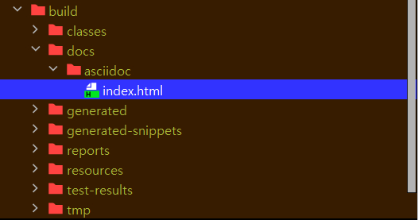
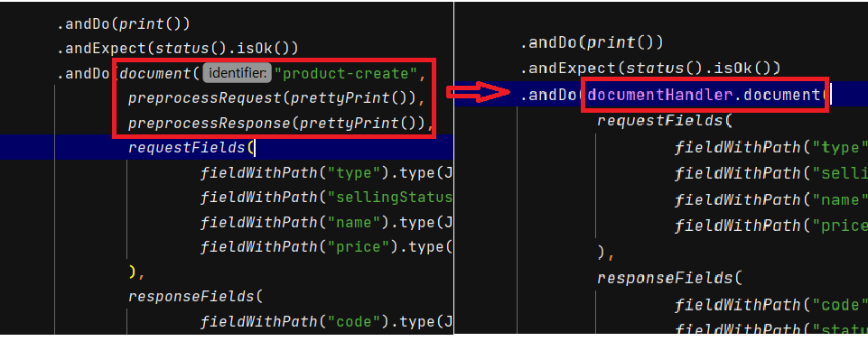
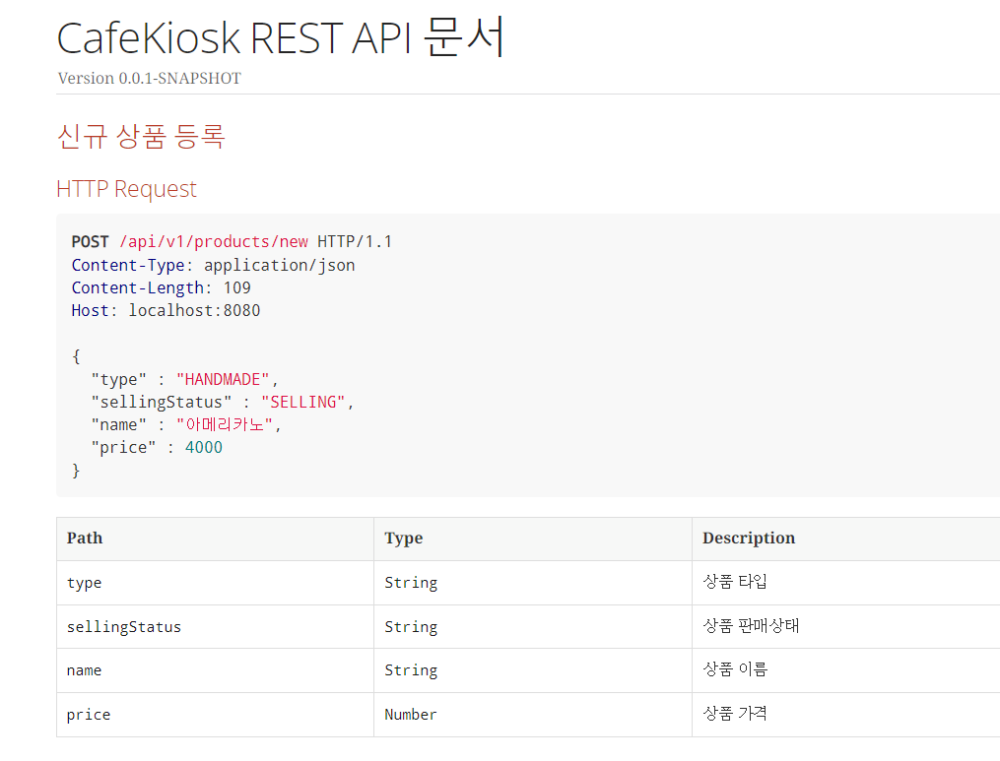
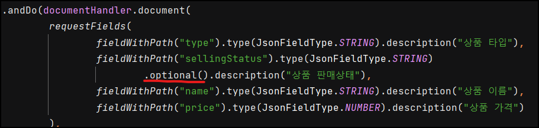
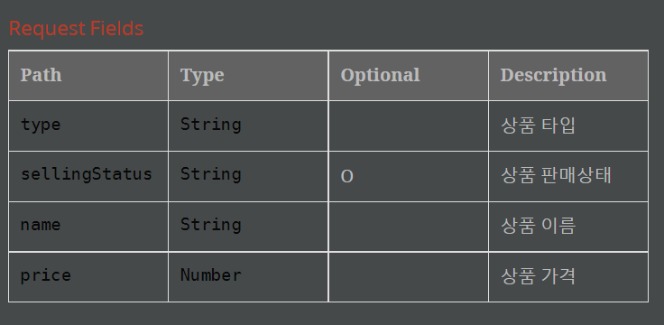
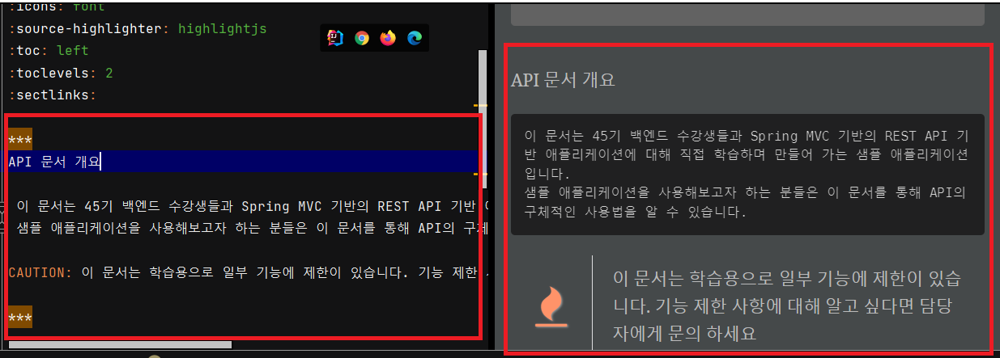
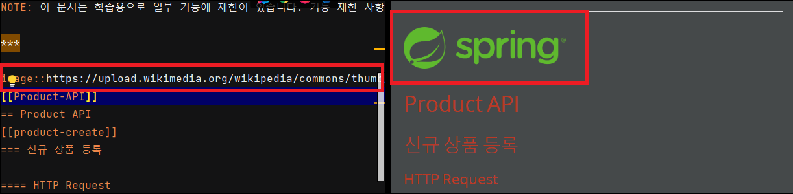

# Spring REST Docs

​	:white_check_mark: 테스트 코드를 통한 API 문서 자동화 도구입니다.

​	:white_check_mark: API 명세를 문서로 만들고 외부에 제공함으로써 협업을 원활하게 합니다.

​	:white_check_mark: 기본적으로 AsciiDoc 을 사용하여 문서를 작성합니다.

## REST Docs VS. Swagger

**REST Docs**

- 장점
  - 테스트를 통과해야 문서가 만들어집니다. (신뢰도가 높습니다.)
  - 프로덕션 코드에 비침투적입니다.
- 단점
  - 코드 양이 많습니다.
  - 설정이 어렵습니다.

**Swagger**

- 장점
  - 적용이 쉽습니다.
  - 문서에서 바로 API 호출을 수행해볼 수 있습니다.
- 단점
  - 프로덕션 코드에 침투적입니다.
  - 테스트와 무관하기 때문에 신뢰도가 떨어질 수 있습니다.

## Rest Docs build.gradle 설정

```java
plugins {
    id 'java'
    id 'org.springframework.boot' version '2.7.13'
    id 'io.spring.dependency-management' version '1.0.15.RELEASE'
    id 'org.asciidoctor.jvm.convert' version '3.3.2' //plugins 추가
}

...

configurations {
    compileOnly {
        extendsFrom annotationProcessor
    }
    asciidoctorExt //configurations 에 추가
}

...

dependencies {
    ...

    // RestDocs
    asciidoctorExt 'org.springframework.restdocs:spring-restdocs-asciidoctor'
    testImplementation 'org.springframework.restdocs:spring-restdocs-mockmvc'

}

tasks.named('test') {
    useJUnitPlatform()
}

ext { // 전역 변수로 저장위치 설정
    snippetsDir = file('build/generated-snippets')
}

test { //테스트가 끝난 결과물을 snippetsDir 에 저장합니다.
    outputs.dir snippetsDir
}

asciidoctor { //문서를 생성하는 asciidoctor 입니다.
    inputs.dir snippetsDir
    configurations 'asciidoctorExt'

    sources { // 특정 파일만 html로 만든다.
        include("**/index.adoc")
    }
    baseDirFollowsSourceFile() // 다른 adoc 파일을 include 할 때 경로를 baseDir로 맞춘다.

    dependsOn test // 작업순서, test가 끝나고 asciidoctor를 실행한다.
}

bootJar { //jar 를 만드는 파일, 문서가 나오면 정적파일로 보기 위해서 static/docs 에 넣어준다.
    dependsOn asciidoctor // 작업순서, asciidoctor가 끝나고 bootJar를 실행한다.
    from("${asciidoctor.outputDir}") {
        into 'static/docs'
    }
}
```

주석 참고하시면 됩니다.

## RestDocsSupport

`ControllerTest` 가 상속받을 추상 클래스입니다.

```java
@ExtendWith({RestDocumentationExtension.class, MockitoExtension.class}) //1
public abstract class RestDocsSupport { 

    protected MockMvc mockMvc; //2

    protected ObjectMapper objectMapper = new ObjectMapper(); //3

    @BeforeEach
    void setUp(RestDocumentationContextProvider provider) { //4

        this.mockMvc = MockMvcBuilders.standaloneSetup(initController()) //5
                .apply(documentationConfiguration(provider)) //6
                .build();
    }

    protected abstract Object initController(); //7
}

```

주석 순서에 따라 설명하겠습니다.

1. RestDocs 를 사용하기 위해 설정해줘야 하는 파일입니다. 강의에서는 ` MockitoExtension.class` 는 없었지만 `@Mock` 어노테이션을 사용하려고 제가 임의로 추가했습니다.
2. mockMvc 를 사용합니다. Spring 을 띄우지 않습니다.
3. objectMapper 도 마찬가지로 주입이 안되기 때문에 인스턴스를 생성합니다.
4. `RestDocumentationContextProvider` 를 주입받습니다. 마찬가지로 restdocs 를 생성하기 위한 클래스입니다.
5. `standaloneSetup()` 메서드의 인자값으로 `initController()` 를 줍니다. 각 컨트롤러테스트마다 필요한 컨트롤러를 주입합니다. `webAppContextSetup()` 도 사용할 수 있는데 해당 메서드는 스프링 부트 자체를 띄웁니다.(`@SpringbootTest`) 해당 내용은 아래에서 설명하겠습니다.
6.  Spring REST Docs 설정을 제공하는데 사용됩니다. 이 설정은 API 문서 생성에 필요한 세부 정보를 포함합니다.
7. 하위 구현 클래스에서 `initController()` 를 구현합니다. 어떤 컨트롤러를 사용할지 지정합니다.

### webAppContextSetup

```java

@ExtendWith({RestDocumentationExtension.class})
@SpringBootTest
public abstract class RestDocsSupport {

@BeforeEach
void setUp(WebApplicationContext webApplicationContext,
            RestDocumentationContextProvider provider) {
    this.mockMvc = MockMvcBuilders.webAppContextSetup(webApplicationContext) //스프링의 컨텍스트, @SpringBootTest 를 넣어줘야 함
            .apply(documentationConfiguration(provider))
            .build();
}
```

`webAppContextSetup()` 메서드를 사용하면 `setUp` 에서 `WebApplicationContext` 를 넣어줘야합니다. 그리고 해당 메서드에서 `webApplicationContext` 를 인자로 받습니다. `WebApplicationContext` 는 스프링의 컨텍스트입니다. `@SpringBootTest` 를 실행하기 때문에 넣어주는 겁니다. **하지만 API 문서작성에 SpringBoot 를 띄울 필요가 없기 때문에 `standaloneSetup()` 메서드로 사용하겠습니다.**

## ProductControllerTest

실제 RestDocs 를 작성하는 컨트롤러 테스트입니다. 스프링을 사용하지 않고 Mock 객체를 사용합니다.

```java
public class ProductControllerTest extends RestDocsSupport {
    
    @Mock ProductService productService;
    
    @Override
    protected Object initController() {
        return new ProductController(productService);
    }

    @Test
    @DisplayName("신규 상품을 등록하는 API")
    void createProduct() throws Exception {
        ProductCreateRequest request = ProductCreateRequest.builder()
                .type(HANDMADE)
                .sellingStatus(SELLING)
                .name("아메리카노")
                .price(4000)
                .build();

        given(productService.createProduct(any(ProductCreateServiceRequest.class)))
                .willReturn(ProductResponse.builder()
                        .id(1L)
                        .type(HANDMADE)
                        .productNumber("001")
                        .sellingStatus(SELLING)
                        .name("아메리카노")
                        .price(4000)
                        .build());

        mockMvc.perform(post("/api/v1/products/new")
                .content(objectMapper.writeValueAsString(request))
                .contentType(MediaType.APPLICATION_JSON)
        )
                .andDo(print())
                .andExpect(status().isOk())
                .andDo(document("product-create",
                        requestFields(
                                fieldWithPath("type").type(JsonFieldType.STRING)
                            .description("상품 타입"),
                                fieldWithPath("sellingStatus").type(JsonFieldType.STRING)
                            .description("상품 판매상태"),
                                fieldWithPath("name").type(JsonFieldType.STRING)
                            .description("상품 이름"),
                                fieldWithPath("price").type(JsonFieldType.NUMBER)
                            .description("상품 가격")
                        ),
                        responseFields(
                                fieldWithPath("code").type(JsonFieldType.NUMBER)
                            .description("코드"),
                                fieldWithPath("status").type(JsonFieldType.STRING)
                            .description("상태"),
                                fieldWithPath("message").type(JsonFieldType.STRING)
                            .description("메세지"),
                                fieldWithPath("data").type(JsonFieldType.OBJECT)
                            .description("응답 데이터"),
                                fieldWithPath("data.id").type(JsonFieldType.NUMBER)
                            .description("상품 ID"),
                                fieldWithPath("data.productNumber").type(JsonFieldType.STRING)
                            .description("상품 번호"),
                                fieldWithPath("data.type").type(JsonFieldType.STRING)
                            .description("상품 타입"),
                                fieldWithPath("data.sellingStatus").type(JsonFieldType.STRING)
                            .description("상품 판매상태"),
                                fieldWithPath("data.name").type(JsonFieldType.STRING)
                            .description("상품 이름"),
                                fieldWithPath("data.price").type(JsonFieldType.NUMBER)
                            .description("상품 가격")
                        )
                ));
    }
}
```

​	기본적으로 성공하는 BDD 와 똑같습니다. `andDo(document(...)` 여기부터 달라집니다.

`andDo(document(...))` 에서 첫번째 파라미터는 식별자 이름입니다. 아무거나 지정해도 됩니다. 두번째 파라미터부터는 `Snippets` 클래스입니다. `requestFields()` 와 `responseFields()` 모두 `Snippets` 입니다. 해당 메서드 안에 `fieldWithPath("파라미터 이름").type("파라미터 타입").description("설명")` 을 넣어줍니다.

## 테스트 실행, adoc 파일 생성

테스트를 실행하면 `build` 디렉토리에 아래와 같이 생깁니다.


아까 `build.gradle` 파일에 `file('build/generated-snippets')` 여기에 저장하라고 설정했었는데요. 잘 저장되었습니다. 디렉토리 이름은 설정한 `product-create` 가 되었습니다. 

이번에는 `adoc` 파일을 작성하겠습니다. 해당 파일은 기본적으로 `src/docs/asciidoc` 에서 작성해야 합니다. 해당 위치에 `index.adoc` 을 생성합니다.


```
ifndef::snippets[]
//경로 지정
:snippets: ../../build/generated-snippets
endif::[]
= CafeKiosk REST API 문서
:doctype: book
:icons: font
:source-highlighter: highlightjs
:toc: left
:toclevels: 2
:sectlinks:

[[product-create]]
=== 신규 상품 등록

==== HTTP Request
include::{snippets}/product-create/http-request.adoc[]
include::{snippets}/product-create/request-fields.adoc[]

==== HTTP Response
include::{snippets}/product-create/http-response.adoc[]
include::{snippets}/product-create/response-fields.adoc[]
```

- `:doctype: book`: Asciidoc 문서의 타입을 'book' 으로 설정합니다. 이는 문서가 여러 장(chapter)으로 구성될 것임을 의미합니다.
- `:icons: font`: 이 설정은 Asciidoc 문서에서 아이콘을 폰트 기반으로 사용하도록 설정합니다. 즉, 아이콘을 표시할 때 이미지 대신 폰트를 사용하게 됩니다.
- `:source-highlighter: highlightjs`: 이 설정은 소스 코드 블록의 문법 하이라이팅에 `highlight.js` 를 사용하도록 설정합니다. `highlight.js` 는 웹에서 소스 코드의 문법을 하이라이팅하는 데 사용되는 JavaScript 라이브러리입니다.
- `:toc: left`: 이 설정은 TOC 가 문서의 왼쪽에 위치하도록 설정합니다.
- `:toclevels: 2`: TOC 레벨을 설정합니다.
- `:sectlinks:`: 이 설정은 섹션 제목을 클릭하면 해당 섹션으로 이동하는 링크가 생성되도록 합니다. 이를 통해 문서 내의 특정 섹션으로 쉽게 이동할 수 있게 됩니다.
- `[[product-create]]`는 Asciidoc 문서 내에서 앵커를 정의하는 방법입니다. `[[product-create]]`라는 앵커를 선언함으로써, 이 위치로 직접 링크를 생성하거나 이동할 수 있게 됩니다. 예를 들어, 이 앵커가 선언된 위치로 바로 이동하려면 문서 내에서 `<<product-create>>`와 같은 형식으로 참조할 수 있습니다.

> 추가적인 속성
>
> - `:sectnums:` : 목차에서 각 섹션에 넘버링합니다.
> - `:toc-title:` : 목차의 제목을 지정할 수 있습니다.
> - `:source-highlighter: prettify` : 문서에 표시되는 소스 코드 하일라이터 중 하나입니다.

빌드를 하면 아래의 디렉토리에서 `index.html` 파일이 생깁니다. (`build.gradle` 에서 지정해뒀던 곳입니다.)



그리고 아래와 같이 문서를 열 수 있습니다.


## PrettyPrint()

​	위 문서를 보면 Json 양식이 보기 불편하게 나오는데요. 이를 해결하기 위해 `PrettyPrint()` 를 사용해보겠습니다.

```java
 mockMvc.perform(post("/api/v1/products/new")
                .content(objectMapper.writeValueAsString(request))
                .contentType(MediaType.APPLICATION_JSON)
        )
                .andDo(print())
                .andExpect(status().isOk())
                .andDo(document("product-create",
                        preprocessRequest(prettyPrint()), //추가
                        preprocessResponse(prettyPrint()), //추가
                        requestFields(...),
                        responseFields(...)
```

해당 파라미터는 아래와 같이 `OperationRequestPreprocessor` 와 `OperationResponsePreprocessor` 입니다.


하지만 이렇게 쓰면 모든 클래스에 중복으로 사용되겠죠. 제가 임의로 추출해서 `RestDocsSupport` 클래스에 적용시켰습니다.

```java
public abstract class RestDocsSupport {

    protected MockMvc mockMvc;

    protected ObjectMapper objectMapper = new ObjectMapper(); 
    
    protected RestDocumentationResultHandler documentHandler //1


    @BeforeEach
    void setUp(RestDocumentationContextProvider provider, TestInfo testInfo) {

        String className = testInfo.getTestClass().orElseThrow().getSimpleName().replace("ControllerTest", ""); //1
        String methodName = testInfo.getTestMethod().orElseThrow().getName(); //2

         documentHandler = document( //3
                className + "-" + methodName,
                preprocessRequest(prettyPrint()),
                preprocessResponse(prettyPrint())
        );

        this.mockMvc = MockMvcBuilders.standaloneSetup(initController())
                .apply(documentationConfiguration(provider))
                .alwaysDo(documentHandler) //4
                .build();
    }

    protected abstract Object initController();
}
```

주석 순서대로 적겠습니다.

1. `RestDocumentationResultHandler` 는 테스트에서 항상 적용시킬 `ResultHandler` 입니다. 구현 클래스에서도 사용할 수 있도록 필드로 선언합니다.
2. `identifier` 로 사용할 `className` 입니다. 예를 들어 `ProductControllerTest` 는 `product` 가 됩니다.
3. `identifier` 로 사용할 `methodName` 입니다. 예를 들어 `create()` 는 `create` 가 됩니다.
4. **공통으로 적용될 로직을 작성합니다. `.andDo(...)` 에서 `identifier`, `OperationRequestPreprocessor`, `OperationResponsePreprocessor` 를 미리 적용합니다.**
   - `"-"` 대신 ` "/"` 이라고 적으면 디렉토리가 계층형 구조를 가지게 됩니다. (`product/create`)
5. 모든 테스트에 `documentHandler` 를 적용시킵니다.

이제 ControllerTest 를 살짝 고치겠습니다.



코드의 중복이 줄어들었습니다. Controller 에서는 부모 클래스의 `documentHandler.document()` 만 호출해서 정의된 공통 로직이외의 `Snippets` 만 적으면 됩니다.

이제 빌드를 해서 실행하면 Json 이 잘 적용된 걸 알 수 있습니다.



## Optional 추가, custom snippet 사용

해당 값이 없어도 되는지 optional 을 테이블에 추가해서 알려주도록 하겠습니다. 이를 위해서는 출력되는 테이블에 Optional 필드를 추가해야 합니다.

test 디렉토리의 `resources/org/springframework/restdocs/templates` 에 `.snippet` 파일을 커스텀으로 추가하면 해당 파일을 읽어서 `adoc` 으로 등록합니다.

아래는 해당 위치의 `request-Fields.snippet` 과 `response-Fields.snippet` 파일입니다.

```
==== Request Fields
|===
|Path|Type|Optional|Description

{{#fields}}

|{{#tableCellContent}}`+{{path}}+`{{/tableCellContent}}
|{{#tableCellContent}}`+{{type}}+`{{/tableCellContent}}
|{{#tableCellContent}}{{#optional}}O{{/optional}}{{/tableCellContent}}
|{{#tableCellContent}}{{description}}{{/tableCellContent}}

{{/fields}}

|===
```

```
==== Response Fields
|===
|Path|Type|Optional|Description

{{#fields}}

|{{#tableCellContent}}`+{{path}}+`{{/tableCellContent}}
|{{#tableCellContent}}`+{{type}}+`{{/tableCellContent}}
|{{#tableCellContent}}{{#optional}}O{{/optional}}{{/tableCellContent}}
|{{#tableCellContent}}{{description}}{{/tableCellContent}}

{{/fields}}

|===
```

중간에 `|{{#tableCellContent}}{{#optional}}O{{/optional}}{{/tableCellContent}}` 이 있습니다. `Optional` 이면 `O` 를 표시한다는 뜻입니다. 

이제 ControllerTest 에 `Optional()` 을 추가합니다.



이제 다시 테스트를 실행해서 `.adoc` 파일을 보면 `Optional` 이 잘 들어와있습니다.



## .adoc 파일 분리 (index.adoc 리팩토링)

이번엔 `index.adoc` 에 대한 리팩토링을 해보겠습니다. 현재 `index.adoc` 상태입니다.

```
ifndef::snippets[]
:snippets: ../../build/generated-snippets
endif::[]
= CafeKiosk REST API 문서
:doctype: book
:icons: font
:source-highlighter: highlightjs
:toc: left
:toclevels: 2
:sectlinks:

[[Product-API]]
== Product API
[[product-create]]
=== 신규 상품 등록

==== HTTP Request
include::{snippets}/product-create/http-request.adoc[]
include::{snippets}/product-create/request-fields.adoc[]

==== HTTP Response
include::{snippets}/product-create/http-response.adoc[]
include::{snippets}/product-create/response-fields.adoc[]

```

지금은 괜찮지만, 모든 API 가 한 문서에 담긴다면 작성도 힘들고, 유지보수도 안될겁니다. 따라서 각 API 별로 따로 파일을 빼주고 해당 파일을 사용하는 방식으로 하겠습니다.

`product-create` 를 뺴서 `product.adoc` 이라는 파일을 만듭니다.


```
[[product-create]]
=== 신규 상품 등록

==== HTTP Request
include::{snippets}/product-create/http-request.adoc[]
include::{snippets}/product-create/request-fields.adoc[]

==== HTTP Response
include::{snippets}/product-create/http-response.adoc[]
include::{snippets}/product-create/response-fields.adoc[]
```

그리고 `index.adoc` 은 아래와 같이 리팩토링합니다. 경로를 통해 `product.adoc[]` 을 찾습니다.

```
= CafeKiosk REST API 문서
:doctype: book
:icons: font
:source-highlighter: highlightjs
:toc: left
:toclevels: 2
//섹션에 대한 링크
:sectlinks:

[[Product-API]]
== Product API
include::api/product/product.adoc[]
```

하지만 http 문서에서는 잘 동작하지 않을건데요. 이는 `build.gradle` 에 아래 옵션을 추가하지 않았기 때문입니다.

```
asciidoctor {
    inputs.dir snippetsDir
    configurations 'asciidoctorExt'

    sources { // 특정 파일만 html로 만든다.
        include("**/index.adoc")
    }
    baseDirFollowsSourceFile() // 다른 adoc 파일을 include 할 때 경로를 baseDir로 맞춘다.

    dependsOn test 
}
```

`baseDirFollowsSourceFile()` 통해 `include` 시 위치 경로를 맞춰줍니다. 그리고 `product.html` 은 필요없으니 생기지 않도록 `sources {include("**/index.adoc")}` 를 선언합니다.

다시 빌드를 하면 리팩토링 이후에도 잘 동작함을 알 수 있습니다.

## 배포

`build.gradle` 에서 설정한 내용대로 호출하면 됩니다. 아래는 `gradle` 파일 일부입니다.

```
bootJar { //jar 를 만드는 파일, 문서가 나오면 정적파일로 보기 위해서 static/docs 에 넣어준다.
    dependsOn asciidoctor 
    from("${asciidoctor.outputDir}") {
        into 'static/docs'
    }
}
```

`jar` 파일의 `docs` 에 접근하면 `index.html` 을 볼 수 있습니다.

터미널에서 실행 후 localhost:8080/docs/index.html 로 접속


# 추가 내용

국비 교육을 진행하면서 추가적으로 공부한 내용입니다.

## ControllerTest 와 RestDocs 함께 작성

Controller 를 테스트하면서 동시에 RestDocs 를 작성할 수도 있습니다. 

```java
@WebMvcTest(MemberController.class)
@MockBean(JpaMetamodelMappingContext.class)   // (1)
@AutoConfigureRestDocs    // (2)
public class MemberControllerRestDocsTest {
    @Autowired
    private MockMvc mockMvc;

    @MockBean
	  // (3) 테스트 대상 Controller 클래스가 의존하는 객체를 Mock Bean 객체로 주입받기

    @Test
    public void postMemberTest() throws Exception {
        // given
        // stubbing

        // when
        ResultActions actions =
                mockMvc.perform(
                     // request 전송
                );

        // then
        actions
                .andExpect(// (response에 대한 기대 값 검증)
                .andDo(document(
                            // API 문서 스펙 정보 추가
                 ));
    }
}
```

1. `@EnableJpaAuditing`을 xxxxxxApplication 클래스에 추가하게 되면 JPA와 관련된 Bean 을 필요로 하기 때문에 `@WebMvcTest` 애너테이션을 사용해서 테스트를 진행할 경우에는 `JpaMetamodelMappingContext` 를 Mock 객체로 주입해 주어야 합니다.
2. Spring Rest Docs에 대한 자동 구성을 위해 `@AutoConfigureRestDocs`를 추가해 줍니다.
3. Controller 클래스가 의존하는 객체(주로 서비스 클래스, Mapper)의 의존성을 제거하기 위해 `@MockBean` 어노테이션을 사용해서 Mock 객체를 주입받습니다.

## adoc Index 박스 문단 사용 및 경고 문구

`index.adoc` 에 다음과 같이 박스 문단과 경고 문구를 추가할 수 있습니다.

```
***
API 문서 개요

 이 문서는 45기 백엔드 수강생들과 Spring MVC 기반의 REST API 기반 애플리케이션에 대해 직접 학습하며 만들어 가는 샘플 애플리케이션입니다.
 샘플 애플리케이션을 사용해보고자 하는 분들은 이 문서를 통해 API의 구체적인 사용법을 알 수 있습니다.

CAUTION: 이 문서는 학습용으로 일부 기능에 제한이 있습니다. 기능 제한 사항에 대해 알고 싶다면 담당자에게 문의 하세요

***
```



`CAUTION` 이외에도 `NOTE:` , `TIP:` , `IMPORTANT:` , `WARNING:` 등을 사용할 수 있습니다.

## 이미지 추가

`image::img url[image name, width, heigth]`  를 지정할 수 있습니다.

예시 : `image::https://upload.wikimedia.org/wikipedia/commons/thumb/4/44/Spring_Framework_Logo_2018.svg/1280px-Spring_Framework_Logo_2018.svg.png[spring-logo, 200, 200]`

