*해당 강의는 SpringBoot 2.x 용 강의로, WebSecurityConfigurerAdapter 를 사용하고 있습니다.*

# 사용자 정의 보안 기능 구현

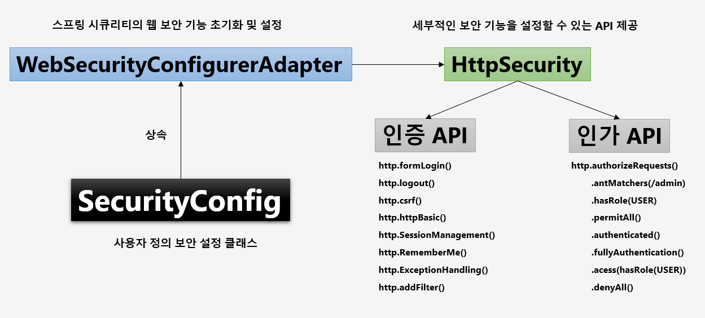

스프링 보안 설정은 `WebSecurityConfigurerAdapter` 를 통해 실행됩니다. 이를 변경하려면 해당 클래스에서 오버라이딩 후 수정해야 합니다.

아래는 간단한 인증/인가 정책 수정입니다.

```java
@Configuration
@EnableWebSecurity // This annotation is required to enable Spring Security.
public class SecurityConfig extends WebSecurityConfigurerAdapter {

    @Override
    protected void configure(HttpSecurity http) throws Exception {
        //인증정책
        http
                .authorizeRequests()
                .anyRequest().authenticated();
        //인가정책
        http
                .formLogin();
    }
}
```

application.properties 에 다음과 같이 사용자를 추가할 수 있습니다.

```properties
spring.security.user.name=user
spring.security.user.password=1111
```

# Form Login 인증

아래는 Form Login 인증 기능의 API 입니다.

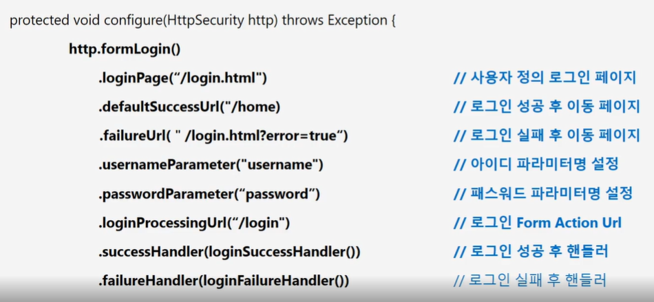

전체적으로 구현하면 아래와 같이 만들 수 있습니다.

```java
@Configuration
@EnableWebSecurity // This annotation is required to enable Spring Security.
public class SecurityConfig extends WebSecurityConfigurerAdapter {

    @Override
    protected void configure(HttpSecurity http) throws Exception {
        //인증정책
        http
                .authorizeRequests()
                .anyRequest().authenticated();
        //인가정책
        http
                .formLogin()
                .loginPage("/loginPage") //로그인 페이지 경로
                .defaultSuccessUrl("/") //로그인 성공 후 리다이렉트 경로
                .failureUrl("/loginPage") //로그인 실패 후 리다이렉트 경로
                .usernameParameter("userId") //아이디 파라미터명 설정 default: username
                .passwordParameter("passwd") //패스워드 파라미터명 설정 default: password
                .loginProcessingUrl("/login_proc") //로그인 Form Action Url default: /login
                .successHandler(new AuthenticationSuccessHandler() { // 로그인 성공 후 핸들러
                    @Override
                    public void onAuthenticationSuccess(HttpServletRequest request, HttpServletResponse response, Authentication authentication) throws IOException, ServletException {
                        System.out.println("authentication" + authentication.getName());
                        response.sendRedirect("/");
                    }
                })
                .failureHandler(new AuthenticationFailureHandler() {
                    @Override
                    public void onAuthenticationFailure(HttpServletRequest request, HttpServletResponse response, AuthenticationException exception) throws IOException, ServletException {
                        System.out.println("exception" + exception.getMessage());
                        response.sendRedirect("/loginPage");
                    }
                })
                .permitAll(); //로그인 페이지는 누구나 접근 가능해야 하기 때문에 permitAll() 설정
    }
}

```

# Form Login 인증 필터 : UsernamePasswordAuthenticationFilter

Form Login 인증 요청이 들어오면 `UsernamePasswordAuthenticationFilter` 가 아래와 같이 동작합니다.

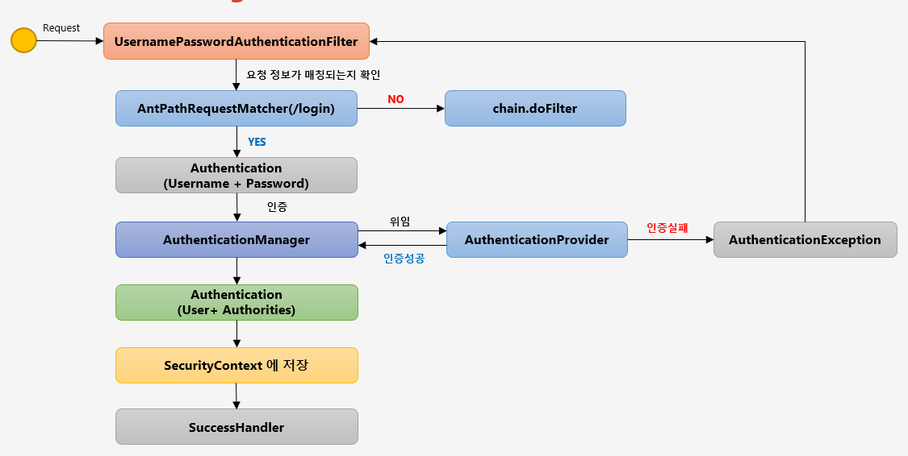

- `AntPathRequestMatcher()` 내의 값은 `SecurityConfig` 의 `http.loginPage("/loginPage")` 설정에 따라 변경가능합니다.
- `AuthenticationManager` 가 필터로부터 `Authentication` 인증 정보를 전달받아서 인증 처리를 합니다. 내부적으로 `AuthenticationProvider` 가 있어서 해당 인증을 위임합니다. 
- 인증에 성공하면 `Authentication` 내에 user, 권한정보 등을 저장해서 다시 `AuthenticationManager` 에게 리턴합니다.
-  `AuthenticationManager` 는 인증된 `Authentication` 를 필터에게 리턴하고, 필터는 해당 객체를 `SecurityContext` 에 저장됩니다. `SecurityContext` 는 인증객체를 저장하는 보관소입니다. 
- 인증 성공 이후 `Successhandler` 가 실행됩니다.

`Authentication` 는 `UsernamePasswordAuthenticationToken` 가 사용됩니다. 그리고 어디서든 `SecurityContextHolder.getContext().getAuthentication()` 을 하면 `Authentication` 을 꺼내쓸 수 있습니다.

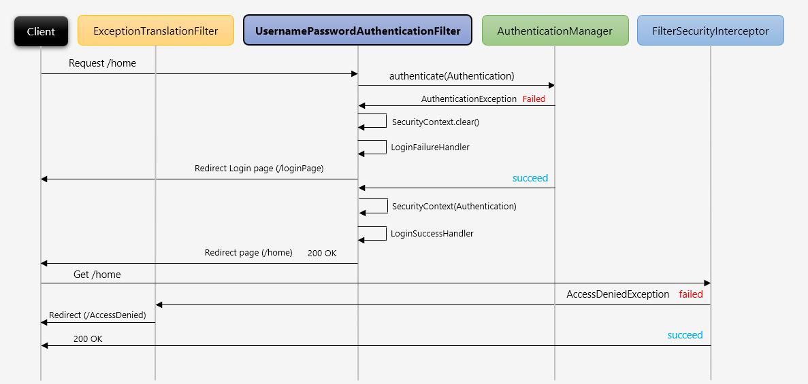

# Logout 처리, LogoutFilter

아래는 Form Login 인증 기능의 로그아웃 API 입니다.

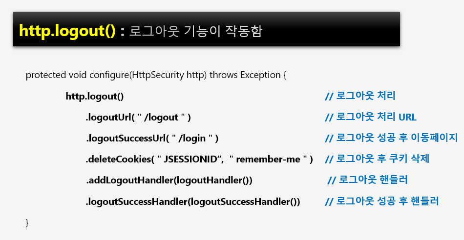

아래와 같이 구현할 수 있습니다.

```java
@Configuration
@EnableWebSecurity
public class SecurityConfig extends WebSecurityConfigurerAdapter {

    @Override
    protected void configure(HttpSecurity http) throws Exception {
        //인증정책
        http
                .authorizeRequests()
                .anyRequest().authenticated();
        //인가정책
        http
                .formLogin();
	   //로그아웃
        http
                .logout()
                .logoutUrl("/logout") //로그아웃 처리 URL default: /logout, 로그아웃 처리는 기본적으로 POST로만 처리됨
                .logoutSuccessUrl("/login") //로그아웃 성공 후 리다이렉트 경로
                .addLogoutHandler(new LogoutHandler() {
                    @Override
                    public void logout(HttpServletRequest request, HttpServletResponse response, Authentication authentication) {
                        request.getSession().invalidate(); //세션 무효화
                    }
                })
                .logoutSuccessHandler(new LogoutSuccessHandler(){
                    @Override
                    public void onLogoutSuccess(HttpServletRequest request, HttpServletResponse response, Authentication authentication) throws IOException, ServletException {
                        response.sendRedirect("/login"); //로그아웃 성공 후 리다이렉트 경로
                    }
                })
                .deleteCookies("remember-me"); //로그아웃 시 서버에서 만든 쿠키 제거
    }
}

```

## LogoutFilter

Form Logout 요청은 기본적으로 POST 입니다. 해당 요청이 들어오면 `LogoutFilter` 가 아래와 같이 동작합니다.

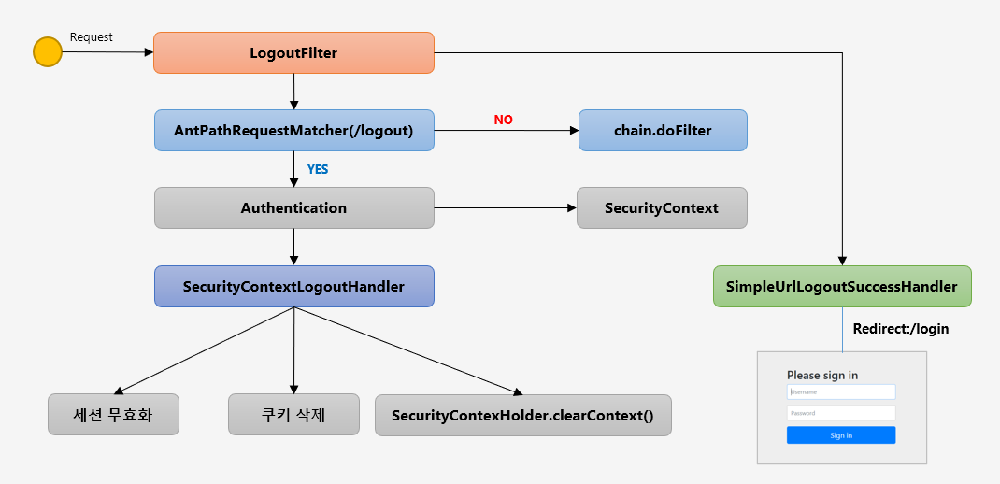

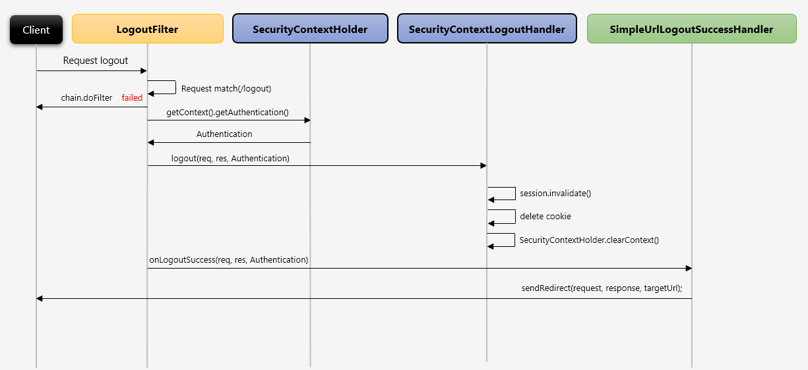

- `LogoutFilter` 가 해당 요청이 `POST: /logout` 인지 확인하고 `SecurityContext` 에서 `Authentication` 을 꺼내옵니다. 그리고 가지고 있는 `LogoutHandler` 로 로그아웃 처리를 합니다. (세션 무효화, 쿠키 삭제, `SecurityContextHolder` 삭제)

# Remember Me 인증

Remember Me 란 1.**세션이 만료되고 웹 브라우저가 종료된 후에도 어플리케이션이 사용자를 기억하는 기능**입니다. RememberMe 쿠키에 대한 Http 요청을 확인한 후 토큰 기반 인증을 사용해 유효성을 검사하고 토큰이 검증되면 사용자는 로그인됩니다.

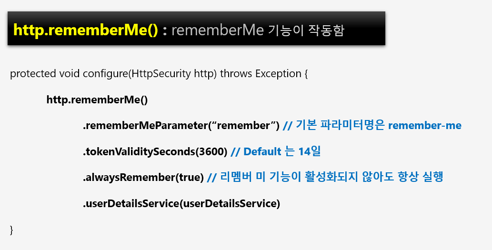

- `userDetailsService` 는 Remember Me 기능 중 시스템에 있는 사용자의 계정을 조회하는 과정에 필요합니다.

```java
@Configuration
@EnableWebSecurity // This annotation is required to enable Spring Security.
public class SecurityConfig extends WebSecurityConfigurerAdapter {

    @Autowired UserDetailsService userDetailsService;

    @Override
    protected void configure(HttpSecurity http) throws Exception {
        ...

        http
                .rememberMe()
                .rememberMeParameter("remember") //기본 파라미터명은 remember-me
                .tokenValiditySeconds(3600) //기본값은 14일
                .userDetailsService(userDetailsService); //remember me 기능이 동작하기 위해서는 UserDetailsService 구현이 필요함

    }
}
```

`userDetailsService` 는 Spring 에서 주입해줍니다.

## 과정

먼저 로그인 시 Remember-Me 를 체크합니다.

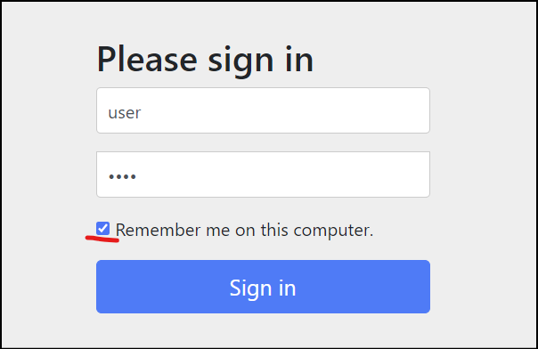

쿠키를 확인해보면 JSESSIONID 외에도 remember-me 가 있습니다.

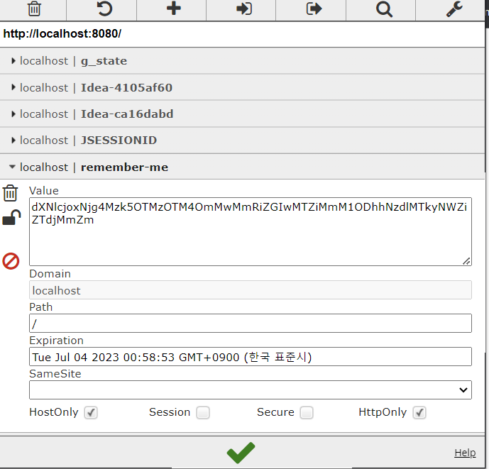

이제 JSESSIONID 가 없어져도 `RequestHeader` 에 remember-me 라는 쿠키가 있다면 해당 값을 디코딩해서 User 계정을 얻고 그 계정을 통해 다시 인증을 시도하고 인증에 성공하면 JSESSIONID 를 반환합니다.

# Remember Me 인증 필터 : RememberMeAuthenticationFilter

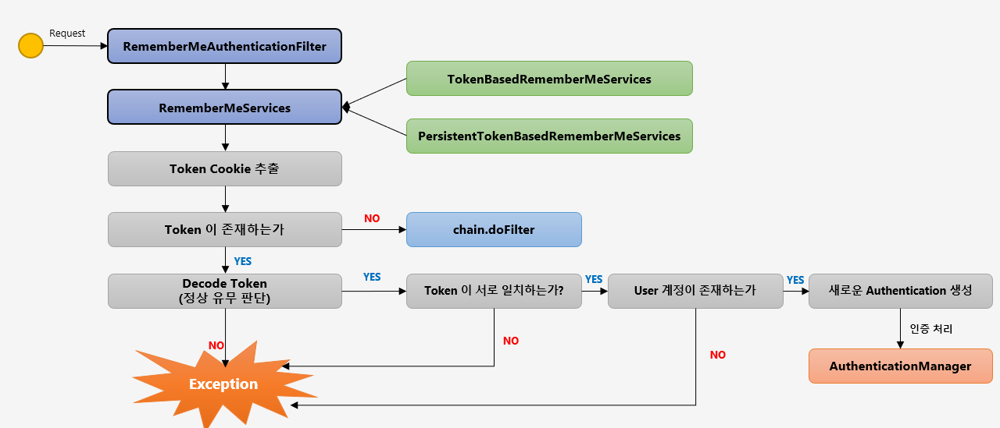

- `RememberMeAuthenticationFilter` 는 `Authentication` 객체가 `null` 일 때만 동작합니다. 세션 만료, 브라우저 종료에 따른 세션이 끊긴 경우 해당 필터가 동작합니다.
- 토큰을 추출하고 확인하는 건 `RememberMeServices` 입니다. 해당 인터페이스는 인메모리에 저장하는 `TokenBasedRememberMeServices` 와 DB 에 저장하는 `PersistentTokenBasedRememberMeServices` 가 있습니다.
- `Remember Me` 토큰이 없다면 그 다음 필터로 이동합니다.
- 정상 토큰인지, 서버에 저장된 토큰과 일치하는지, 토큰의 User 정보로 추출한 DB 의 유저 정보가 존재하는지 등을 판단해서 예외처리를 합니다.

## 과정

먼저 로그인을 하면 `AbstractAuthenticationProcessingFilter` 의 `successfulAuthentication()` 메서드에서 `rememberMeService` 의 `loginSuccess()` 메서드를 호출합니다.

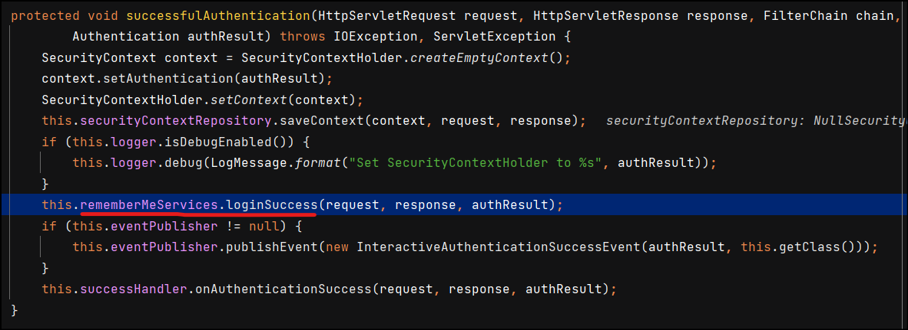

해당 메서드가 `response` 에 쿠키값을 담아서 응답합니다.

이번에 JSESSION 을 삭제하고 리로드하면 `RememberMeAuthenticationFilter` 의 `doFilter` 에서 rememberMe 쿠키값을 통해 사용자 정보를 얻습니다.


- `rememberMeAuth` 는 쿠키로부터 얻은 `Authentication` 입니다.
- 이후 `rememberMeAuth` 를 `SecurityContextHolder` 에 저장하고 `SuccessfulAuthentication()` 을 호출합니다.

# 익명사용자 인증 필터 : AnonymousAuthenticationFilter

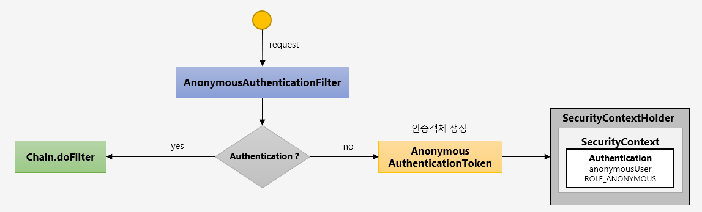

익명사용자 인증 처리 필터는 익명사용자와 인증 사용자를 구분해서 처리하기 위한 용도로 사용됩니다. 화면에서 인증 여부를 구현할 때 `isAnonymous()` 와 `isAuthenticated()` 로 구분해서 사용하면 됩니다. **인증 객체를 생성은 하지만 세션에 저장하지는 않습니다. (일회용)**

## 과정

현재 SecurityConfig 입니다. 모든 페이지에 인증이 필요합니다.

```java
@Configuration
@EnableWebSecurity 
public class SecurityConfig extends WebSecurityConfigurerAdapter {

    @Autowired UserDetailsService userDetailsService;

    @Override
    protected void configure(HttpSecurity http) throws Exception {
        //인증정책
        http
                .authorizeRequests()
                .anyRequest().authenticated();
        //인가정책
        http
                .formLogin();

    }
}
```

이제 `"/"` 으로 들어가보면 `AnonymousAuthenticationFilter` 에서 디버깅이 걸리게 됩니다.

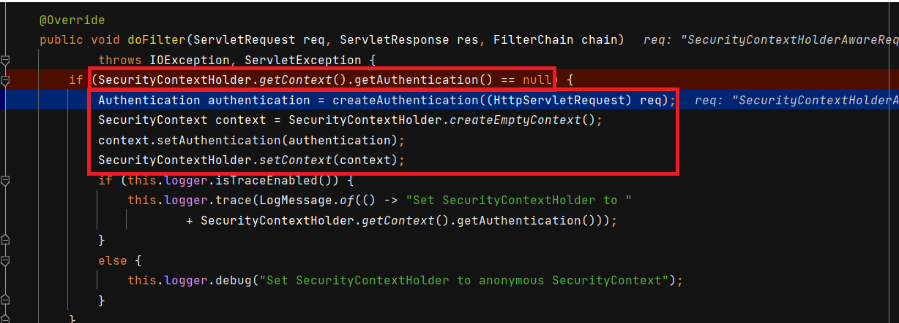

`SecurityContextHolder` 에 있는 `Authentication` 이 `null` 이면, `createAuthentication()` 으로 `Authentication` 객체를 만들어서 넣어줍니다.

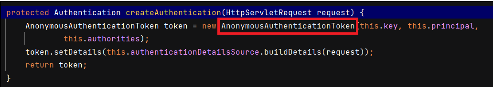

해당 객체는 `AnonymousAuthenticationToken` 입니다.

## 익명 사용자를 사용하는 이유

​	스프링 시큐리티는 익명 사용자, 즉 로그인을 하지 않은 상태의 사용자도 별도의 역할 즉 인증정보, 권한정보를 가지도록 설계되었습니다. 물론 인증정보와 권한정보 자체가 정식 인증을 받은 상태가 아닌 익명 사용자용 인증, 권한 정보라고 볼 수 있습니다.

​	스프링 시큐리티에서 인증받지 않은 상태를 판별하는 기준은 user 객체의 존재 여부가 아닙니다. 즉 `user` 가 `null` 이라 할지라도 `Authentication` 이 `null` 이 아니면 인증 받은 것으로 간주하기도 합니다.

```java
if(SecurityContextHolder.getContext().getAuthentication() == null){

	....

}
```

위와 같은 구문이 스프링 시큐리티 전반에 걸쳐 여러 군데에서 나오고 있습니다. **즉 세션이 만료되거나 무효화 되어서 `SecurityContext` 안에 `Authentication` 객체가 존재하지 않을 경우 어떠한 처리를 하라는 의미**입니다. 위의 구문은 세션이 무효화 되어서 인증이 필요한 상태는 맞지만 익명사용자 즉 "anonymousUser" 는 아닙니다. 

익명사용자는 `Authentication` 이 `null` 이 아니고 문자열의 "`anonymousUser"` 가 저장되어 있는 `principal` 과 `ROLE_ANONYMOUS` 권한 정보를 가지고 있는 객체입니다. 그렇기 때문에 스프링 시큐리티에서는 익명사용자라 할지라도 `Authentication` 객체를 별도로 할당함으로써 인증사용자와 익명사용자를 구분해서 적절한 분기를 타고 있습니다.

​	어떻게 보면 익명사용자 즉 로그인을 하지 않은 사용자는 궁극적으로 user 가 null 인 상태라 가정하고 코드를 작성하는게 당연할 수있습니다. **다만 스프링 시큐리티는 익명사용자가 인증을 받은 것은 아니지만 단순히 `null` 체크 기능을 넘어서 인증 및 인가 영역 전반에 걸쳐 특정한 목적과 사용을 위해서 고안한 설계물**이며 `AnonymousAuthenticationFilter` 가 중심이 되어서 익명사용자용 인증객체와 권한 정보등을 생성하는 처리를 하고 있다고 보면 됩니다.

# 동시 세션 제어, 세션 고정보호, 세션 정책

## 동시 세션 제어 정책

최대 세션 허용 개수를 초과할 때 다음 두가지 정책을 사용할 수 있습니다.

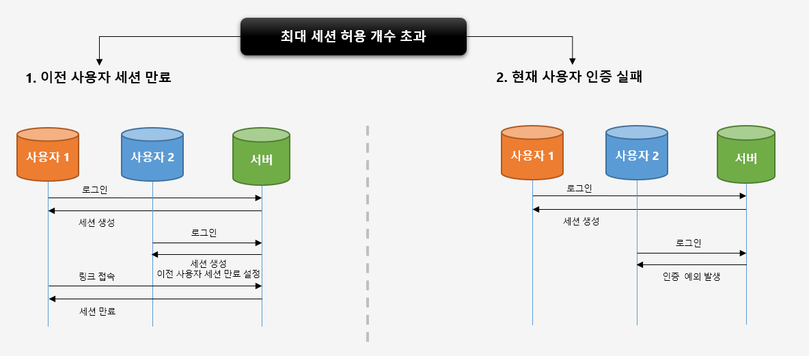

다음은 세션 기능 API 입니다.

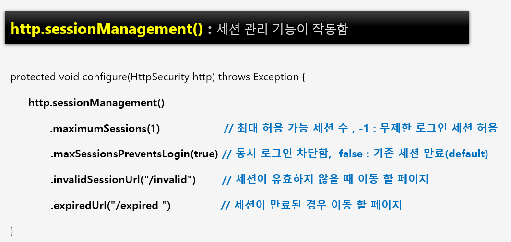

```java
@Override
protected void configure(HttpSecurity http) throws Exception {
    //인증정책
    http
            .authorizeRequests()
            .anyRequest().authenticated();
    //인가정책
    http
            .formLogin();
    http
            .sessionManagement()
            .maximumSessions(1) // 최대 세션수
            .maxSessionsPreventsLogin(true);

}
```

현재는 동시 로그인을 허용하지 않고 있습니다. 한 브라우저에서 로그인 후 다음과 같이 다른 브라우저로 로그인을 시도할 때 오류메세지를 보여줍니다.

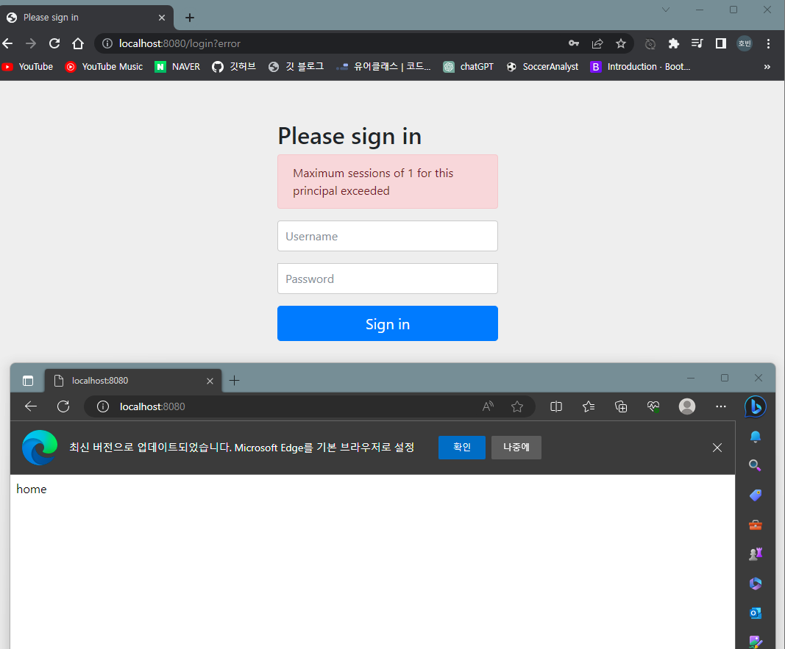

## 세션 고정 보호

아래는 세션 고정 공격의 흐름입니다.

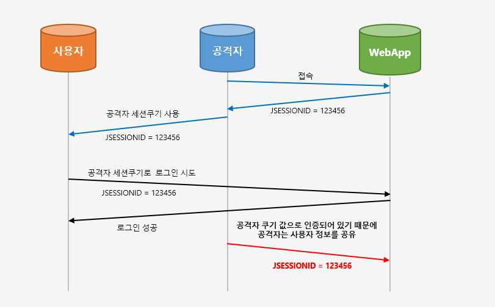

스프링 시큐리티는 이를 방지하기 위해 인증을 시도할 때마다 새로운 세션을 생성하도록 합니다. 아래와 같이 설정합니다.

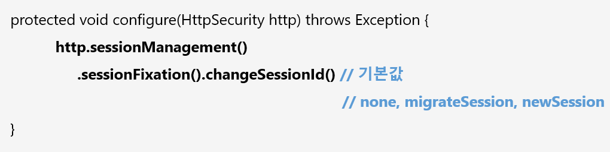

- `changeSessionId` 는 서블릿 3.1 이상, `migrateSession` 은 서블릿 3.1 미만에서 기본값입니다. **해당 정책을 설정하지 않아도 스프링 시큐리티에서 자동으로 설정합니다.**
- `newSession` 은 이전 세션의 속성값들을 사용하지 못하고 새롭게 설정해야 합니다.
- `none` 은 세션을 변경하지 않습니다.

```java
@Override
protected void configure(HttpSecurity http) throws Exception {
    //인증정책
    http
            .authorizeRequests()
            .anyRequest().authenticated();
    //인가정책
    http
            .formLogin();
    http
            .sessionManagement()
            .sessionFixation().none();

}
```

## 세션 정책

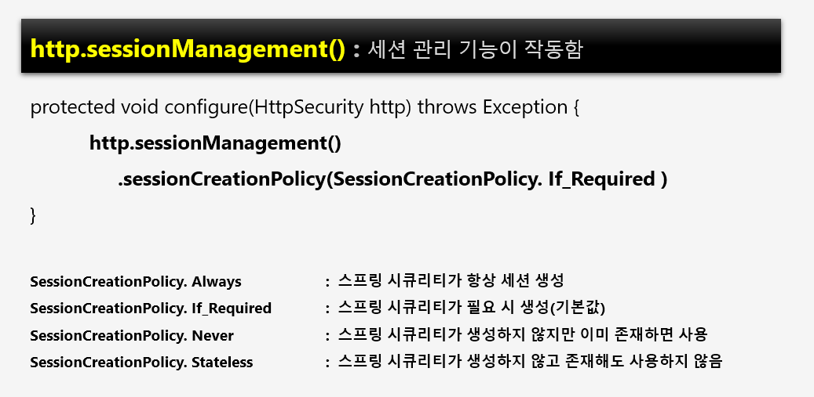

세션을 전혀 사용하지 않는 방법은 JWT 등을 사용할 때 설정합니다.

# 세션 제어 필터 : SessionManagementFilter, ConcurrentSessionFilter

## SessionManagementFilter

해당 필터는 다음과 같은 역할을 합니다.

1. **세션 관리** : 인증 시 사용자의 세션정보를 등록, 조회, 삭제 등의 세션 이력을 관리
2. **동시적 세션 제어** :동일 계정으로 접속이 허용되는 최대 세션수를 제한
3. **세션 고정 보호** : 인증 할 때마다 세션쿠키를 새로 발급하여 공격자의 쿠키 조작을 방지
4. **세션 생성 정책** : `Always`, `If_Required`, `Never`, `Stateless`

## ConcurrentSessionFilter

​	매 요청 마다 현재 사용자의 세션 만료 여부 체크하고 세션이 만료로 설정되었을 경우 즉시 만료 처리하는 필터입니다. `SessionManagementFilter` 와 연계하여 동시적 세션 제어를 합니다.

## 흐름

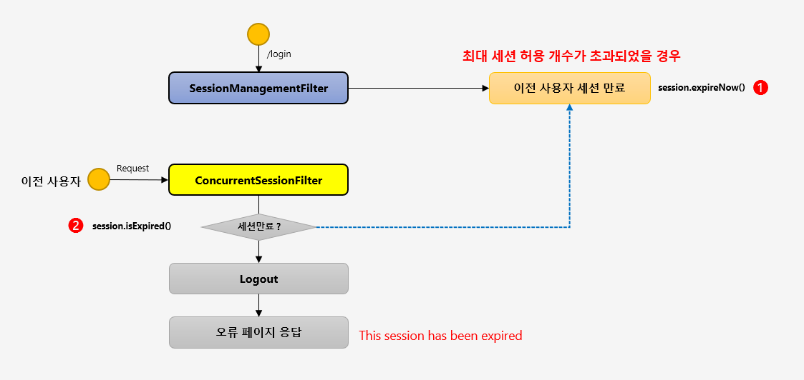

현재 정책이 동시 세션 접속 시 이전 사용자 세션을 만료시키는 정책이라고 가정하겠습니다. 새로운 사용자가 로그인 시도를 하면 `SessionManagementFilter` 는 이전 사용자 세션을 만료시킵니다. 이후 이전 사용자가 로그인 시도를 하면 `ConcurrentSessionFilter` 가 세션 만료 여부를 확인하고 오류 페이지를 응답합니다. 해당 확인은 `SessionManagementFilter` 를 통해 확인합니다.

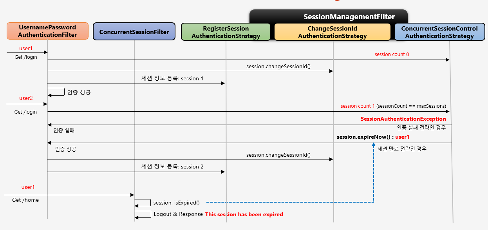

​	위 그림에서 보면, `user1` 이 로그인을 시도하면 `SessionManagementFilter` 에서 세션 개수를 확인 후 (`ConcurrentSessionControlAuthenticationStrategy`) 세션고정보호 정책에 따라 session 을 변경 (`ChangSessionIdAuthenticationStrategy`) 합니다. 그리고 세션 정보를 등록합니다. (`RegisterSessionAuthenticationStrategy`) 

​	이후 `user2` 가 로그인 시도 시 `ConcurrentSessionControlAuthenticationStrategy` 에서 `session` 개수가 초과하면 동시 세션 접속 정책에 따라 이전 세션을 만료시키거나 현재 세션의 인증을 실패시킵니다.  만약 세션 만료 전략인 경우 `user1` 의 세션이 만료됩니다. 이때 `user1` 이 새로운 요청을 하면 `ConcurrenSessionFilter` 에서 이를 처리합니다. (로그아웃 등)

## 코드

1. **`user1` 이 로그인을 시도**하면 먼저 `ConcurrentSessionControlAuthenticationStrategy` 에서 총 세션 개수와 허용되는 세션 개수를 비교해서 그에 따른 처리를 합니다.

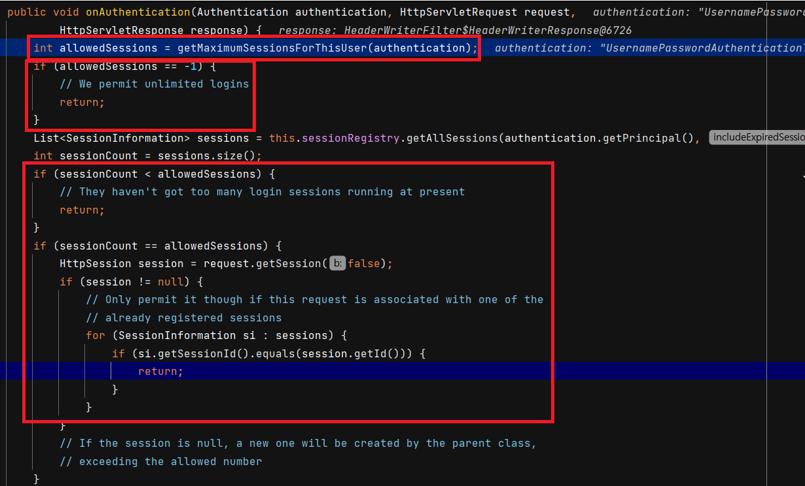

2. 이후 세션 변경 정책에 따라 세션을 변경합니다. (`AbstractSessionFixationProtextionStrategy` 클래스)

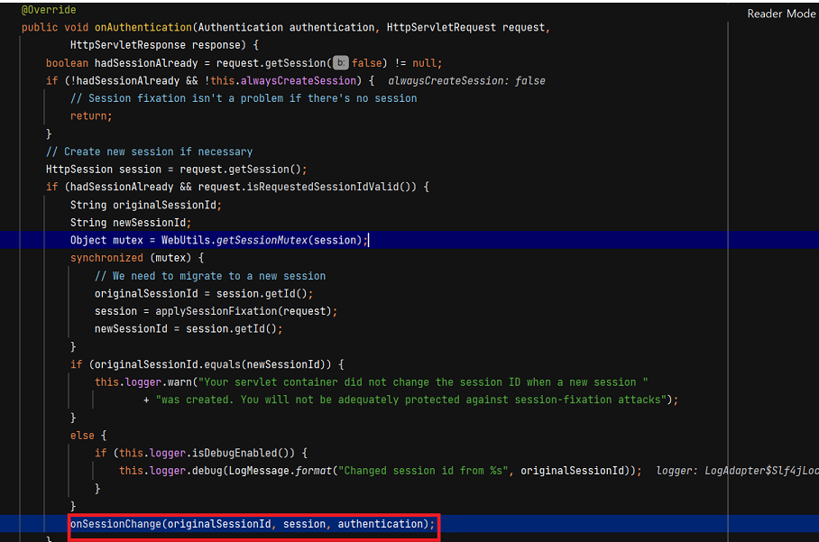

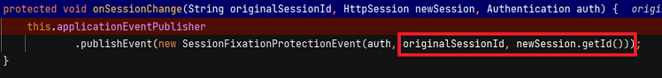

3. 이후 `RegisterSessionAuthenticationStrategy` 에서 등록이 이루어집니다. 실질적인 등록은 `SessionRegistryImpl` 의 `registerNewSession()` 메서드에서 이루어집니다.

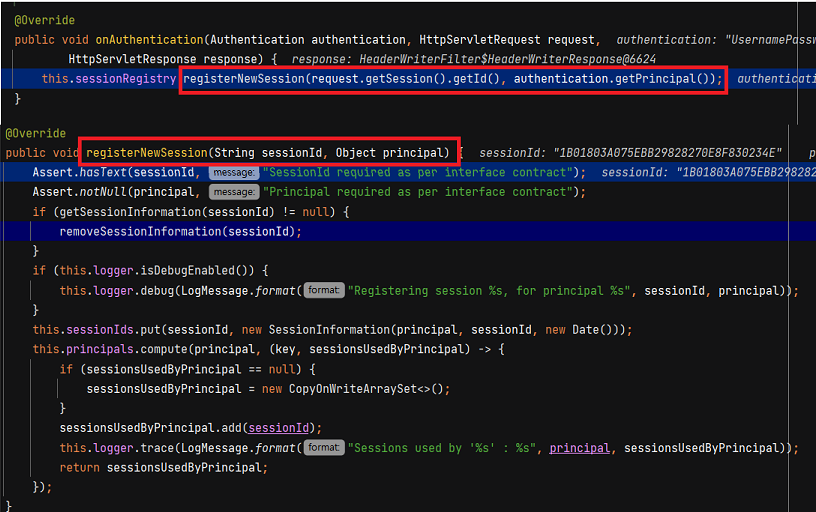

4. 이제 `user2` 가 로그인을 시도하면 `ConcurrentSessionControlAuthenticationStrategy` 에서 개수 초과로 `allowableSessionsExceeded()` 메서드가 실행됩니다.

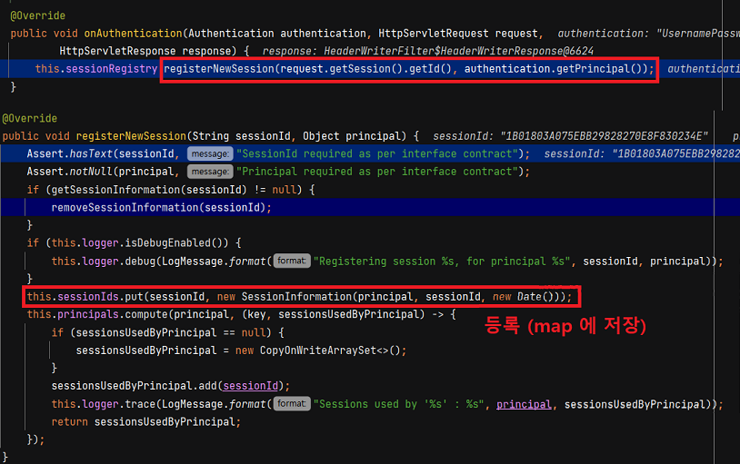

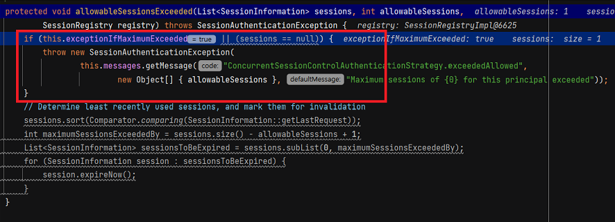

여기서 `exceptionIfMaximumExceeded` 속성은 `SecurityConfig` 에서 준 `.maxSessionsPreventsLogin(true)` 입니다. 해당값이 `true` 이므로 예외를 던지게 됩니다. 그게 아니라면 아래 회색 음영 표시된 로직이 실행됩니다. 해당 로직은 원래 있던 세션을 만료시키는 정책입니다.

5. 이번엔 `.maxSessionsPreventsLogin(false)` 로 설정하고 4번 과정을 다시보겠습니다. 같은 `allowableSessionsExceeded()` 메서드 내입니다.

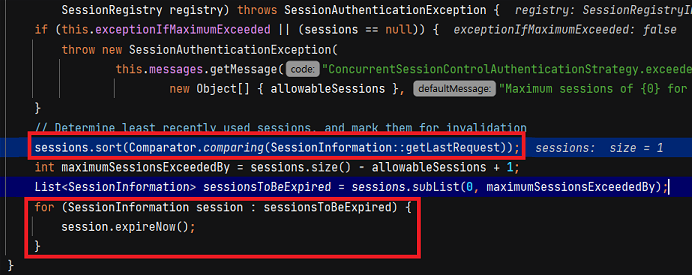

​	세션을 하나씩 순회하면서 제일 오래된 세션을 `.expireNow()` 로 만료시킵니다. 그리고 `user2` 는 2, 3번 과정을 거쳐 세션에 등록됩니다.

6. 이제 `user1` 이 페이지를 방문하면 `ConcurrentSessionFilter` 에서 걸리게 됩니다. 세션이 만료되었으면 로그아웃처리 됩니다.

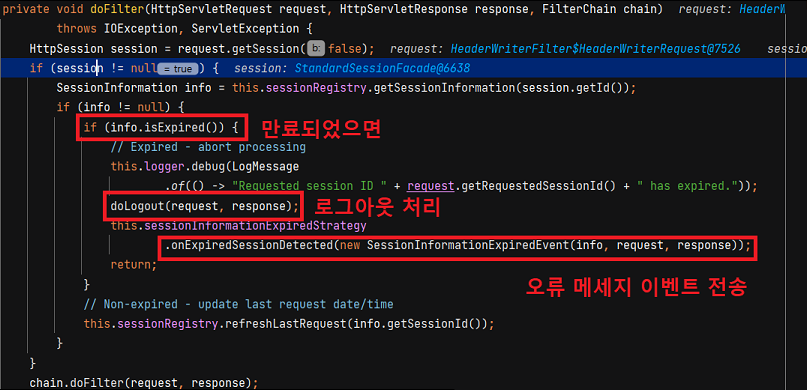

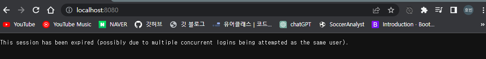

브라우저에 오류 메세지가 나타납니다. 이렇게 되면 `user1` 은 다시 인증받아야 합니다.

# 인가 API - 권한 설정 및 표현식

## 인가 API 분류

인가 API 는 선언적 방식과 동적 방식으로 나눠집니다. 현재 섹션에서는 선언적 방식의 URL 만 확인합니다.

**선언적 방식**

- URL : `http.antMatchers("/users/**").hasRole("USER")`

- Method

  - ```java
    @PreAuthorize("hasRole('USER')")
    public void user(){ 
    	System.out.println("user")
    }
    ```

동적 방식 - DB 연동 프로그래밍

- URL
- Method

## 권한 설정 방법

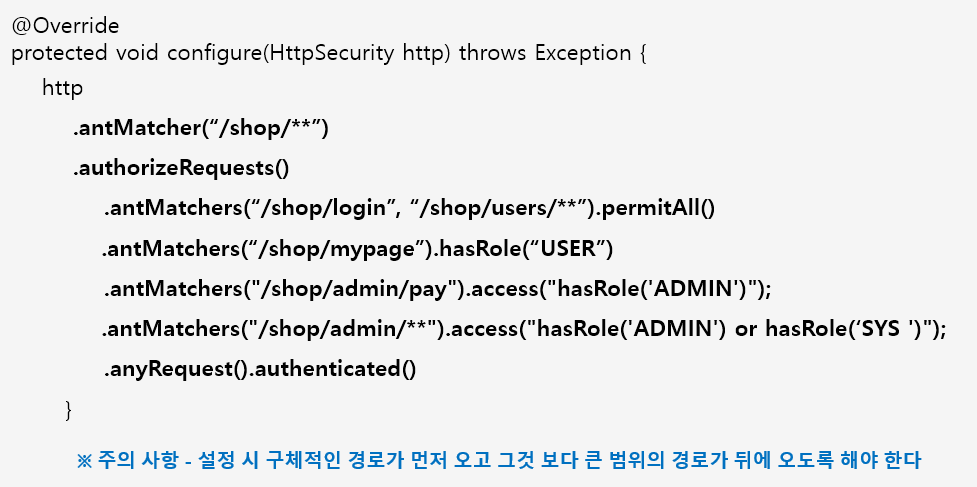

- `/shop/**` : 인증된 사용자
- `/shop/login`, `/shop/users/**` : 모든 사용자
- `/shop/mypage` : USER 권한
- `/shop/admin/pay` : ADMIN 권한
- `/shop/admin/**` : ADMIN 혹은 SYS 권한

설정 시 구체적인 경로가 먼저 나와야 합니다. 예를 들어 `/shop/admin/**` 과 `/shop/admin/pay` 의 순서가 바뀐다면, SYS 권한을 가진 사용자도  `/shop/admin/pay` 에 접근할 수 있습니다.

아래는 인가 API 표현식입니다.

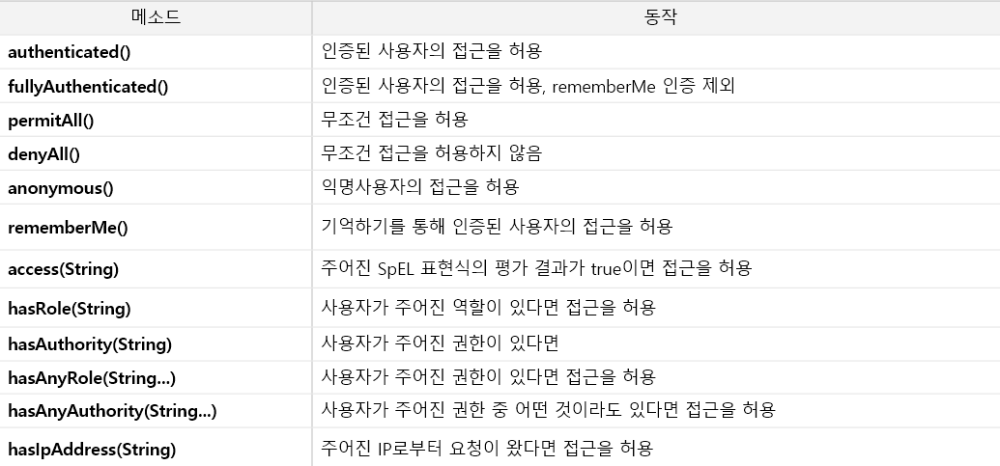

- `fullAuthenticated()` : `rememberMe` 인증을 통해 접근할 수 없습니다. 무조건 ID, PW 를 입력해야 합니다.
- `anonymous()` : 익명 사용자만 접근가능합니다. `USER` 사용자는 익명 사용자가 아니기 때문에 모두 접근을 허용하려면 `permitAll()` 을 해야 합니다.

## 권한 설정 예제

```java
@Override
    protected void configure(HttpSecurity http) throws Exception {
        //인증정책
        http
                .authorizeRequests()
                .antMatchers("/user").hasRole("USER")
                .antMatchers("/admin/pay").hasRole("ADMIN") //1
                .antMatchers("/admin/**").access("hasRole('ADMIN') or hasRole('SYS')") //2
                .anyRequest().authenticated();
        //인가정책
        http
                .formLogin();

    }
```

`/user` 페이지는 USER 만 접근할 수 있고, ADMIN, SYS 는 접근하지 못합니다. `/admin/pay` 는 ADMIN 만 접근할 수 있습니다. 주석에서 1, 2번을 변경한다면 SYS 사용자는 `/admin/pay` 로 접근할 때 `/admin/**` 에서 먼저 인증되면서 접근할 수 있게 됩니다. 따라서 순서가 중요합니다.

# 예외 처리 및 요청 캐시 필터 : ExceptionTranslationFilter, RequestCacheAwareFilter

## ExceptionTranslationFilter

해당 필터는 `AuthenticaitonException` (인증 예외 처리), `AccessDeniedException` (인가 예외 처리) 를 담당합니다. 

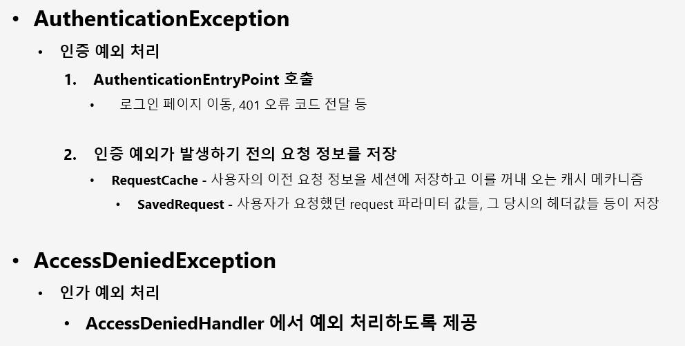

다음은 인증/인가 예외 흐름입니다.

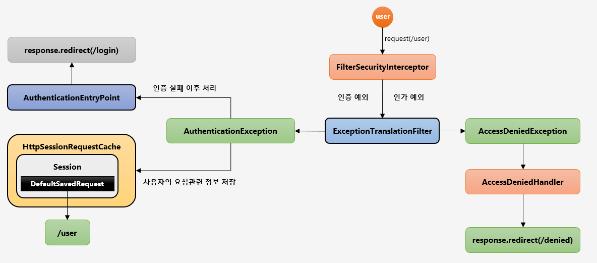

- `FilterSecurityInterceptor` 가 인증, 인가 권한을 체크하고 `ExceptionTranslationFilter` 를 호출합니다.
- 만약 인증 예외이면, `AuthenticationException` 을 호출합니다. 사용자의 요청 관련 정보를 저장한 후 실패 이후 처리를 합니다. 보통 로그인 페이지로 리다이렉트하는데, 로그인을 성공하면 저장된 요청 정보를 통해 접속하려는 페이지로 리다이렉트 해줍니다.
- **익명 사용자의 접속은 엄연히 말하면 인가 예외**입니다. 하지만 `AccessDeniedException` 이 호출되었을 때 사용자가 익명이면 다시 `AuthenticationException` 를 호출합니다.
- 인가 예외는 `AccessDeniedException` 을 호출합니다. 설정된 `AccessDeniedHandler` 를 실행합니다.

## ExceptionTranslationFilter 구현

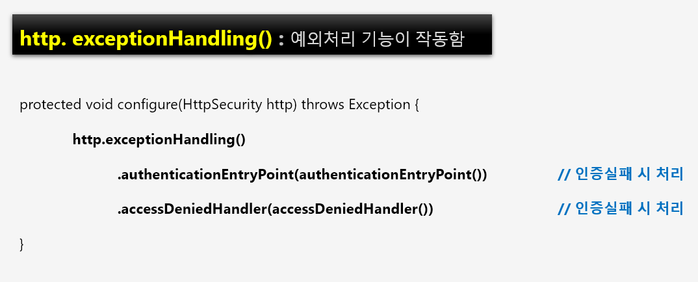

```java
@Override
protected void configure(HttpSecurity http) throws Exception {

    http
            .authorizeRequests()
            .antMatchers("/login").permitAll()
            .antMatchers("/user").hasRole("USER")
            .antMatchers("/admin/pay").hasRole("ADMIN")
            .antMatchers("/admin/**").access("hasRole('ADMIN') or hasRole('SYS')")
            .anyRequest().authenticated();

    http
            .formLogin()
            .successHandler(new AuthenticationSuccessHandler(){
                @Override
                public void onAuthenticationSuccess(HttpServletRequest request, HttpServletResponse response, Authentication authentication) throws IOException, ServletException {
                    RequestCache requestCache = new HttpSessionRequestCache();
                    SavedRequest savedRequest = requestCache.getRequest(request, response);
                    String redirectUrl = savedRequest.getRedirectUrl();
                    response.sendRedirect(redirectUrl);
                }
            });

    http
            .exceptionHandling()
            .authenticationEntryPoint(new AuthenticationEntryPoint(){
                @Override
                public void commence(HttpServletRequest request, HttpServletResponse response, AuthenticationException authException) throws IOException, ServletException {
                    response.sendRedirect("/login");
                }
            })
            .accessDeniedHandler(new AccessDeniedHandler(){
                @Override
                public void handle(HttpServletRequest request, HttpServletResponse response, org.springframework.security.access.AccessDeniedException accessDeniedException) throws IOException, ServletException {
                    response.sendRedirect("/denied");
                }
            });
}
```

- `successHandler()` : 인증 성공 시 `redirectUrl` 로 보냅니다.
- `authenticationEntryPoint()` : 인증 실패 시 `/login` 로 보냅니다. `/login` 은 모든 사용자에게 허가되어 있어야 합니다.
- `accessDeniedHandler()` : 인가 실패 시 `/denied` 로 보냅니다.

## 필터 확인

1. `ExceptionTranslationFilter` 의 `handlerSpringSecurtyExcetion()` 메서드입니다. `exception` 타입에 따라 분기됩니다.

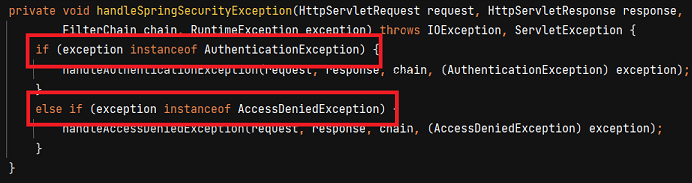

2. `AuthenticationException` 이면 `sendStartAuthentication()` 메서드를 실행합니다. `AccessDeniedException` 이면 `accessDeniedHandler` 의 `handle()` 메서드를 실행합니다. 이때 익명사용자면 다시 `sendStartAuthentication()` 메서드를 실행합니다.

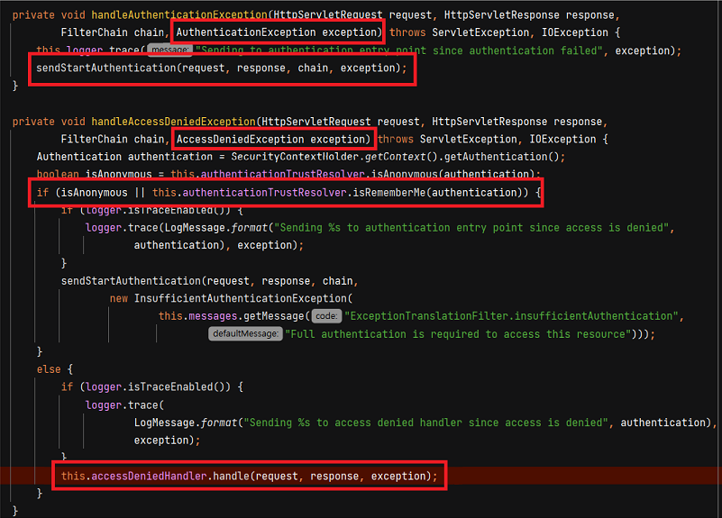

3. `sendStartAuthentication()` 에서는 `SecurityContext` 를 비우고 `requestCache` 와 `authenticationEntryPoint` 를 실행합니다. 앞서 `SecurityConfig` 에서 정의한 익명 메서드가 실행됩니다.

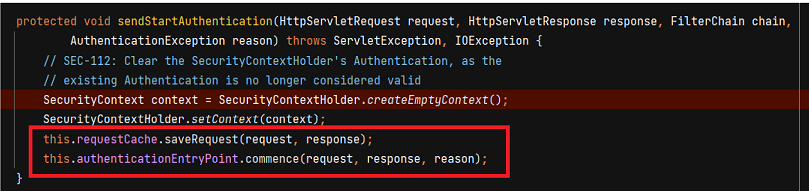

## RequestCacheAwareFilter 필터 확인

해당 필터에서, requestCache 에 값이 있으면 해당 `request` 를 계속 이용하게 합니다.

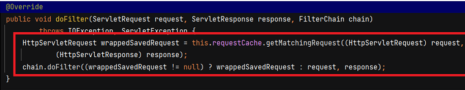

# 사이트 간 요청 위조 - CSRF, CsrfFilter

​	**CSRF (Cross-Site Request Forgery) 공격**은 사용자가 자신의 의지와는 무관하게 공격자가 준비한 행동을 수행하게 만드는 공격 방법입니다. 이 공격은 사용자가 이미 인증을 받은 상태에서 실행되며, 이를 통해 공격자는 사용자의 권한을 도용할 수 있습니다.

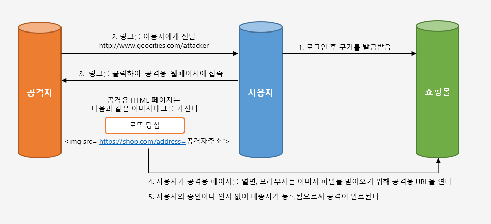

​	예를 들어, 사용자가 웹 서비스에 로그인한 상태에서 악성 웹 사이트를 방문하면, 이 사이트는 사용자가 모르는 사이에 공격을 위한 요청을 해당 웹 서비스(이미지 클릭)로 보낼 수 있습니다. 서버 입장에서는 이 요청이 사용자로부터 직접 온 것처럼 보이므로 해당 요청을 처리하게 되어, 사용자의 정보가 변경되거나 사용자를 대상으로 한 행동이 수행될 수 있습니다.

​	Spring Security 에서는 CSRF 공격을 방지하기 위해 토큰을 생성합니다.

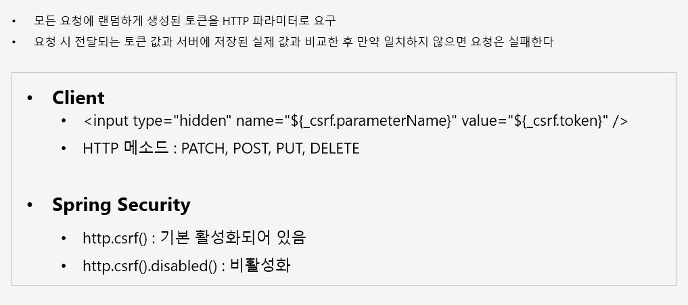

기본적으로 `http.csrf()` 가 활성화되어있습니다.

## CsrfFilter

`CsrfFilter` 의 `doFilterInternal()`  메서드입니다.

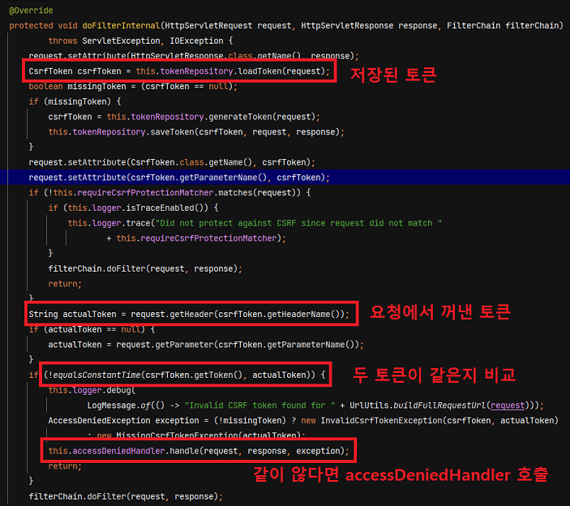
