# 위임 필터 및 필터 빈 초기화

​	`Filter` 는 `DispatcherServlet` 의 앞단에서 일어나는 일로, 서블릿 컨테이너의 통제를 받습니다. 반면 스프링 빈은 스프링 컨테이너에서 주입을 받습니다. 따라서 스프링에서 정의된 빈은 필터로 사용할 수 없는데요. 스프링에서 직접 필터를 등록하고자 하는 요구사항이 늘어나면서 서블릿은 특정한 이름을 가진 스프링 빈을 찾아 그 빈에게 요청을 위임하게 됩니다. 

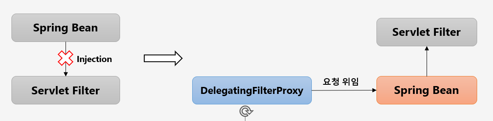

`Servlet` 은 `DelegatingFliterProxy` 로  `springSecurityFilterChain` 이름으로 생성된 빈을 `ApplicationContext` 에서 찾아 요청을 위임합니다. 실제 보안 처리는 직접 하지 않습니다.

## FilterchainProxy

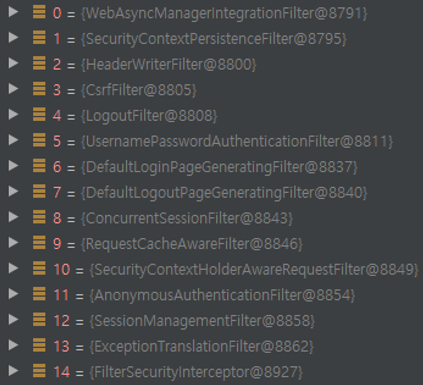

1. `springSecurityFilterChain` 의 이름으로 생성되는 필터 빈입니다.
2. `DelegatingFilterProxy` 으로 부터 요청을 위임 받고 실제 보안 처리를 합니다.
3. 스프링 시큐리티 초기화 시 생성되는 필터들을 관리하고 제어합니다.
   - 스프링 시큐리티가 기본적으로 생성하는 필터
   - 설정 클래스에서 API 추가 시 생성되는 필터
4. **사용자의 요청을 필터 순서대로 호출하여 전달합니다.**
5. 사용자정의 필터를 생성해서 기존의 필터의 전, 후로 추가할 수 있습니다.
   - 필터의 순서를 잘 정의해야 합니다.
6. 마지막 필터까지 인증 및 인가 예외가 발생하지 않으면 보안에 통과된 것입니다.

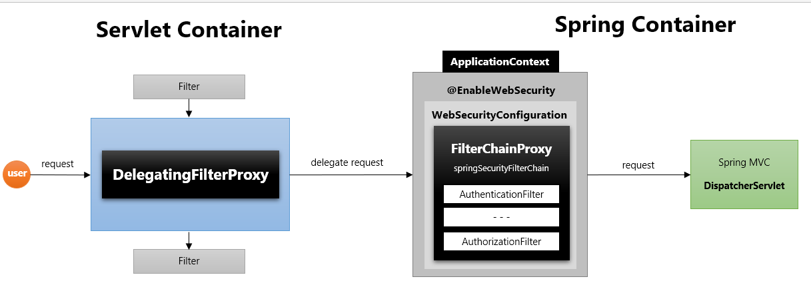

 `DelegatingFilterProxy` 가 등록될 때 `targetBean` 을 `springSecurityFilterChain` 으로 지정하게 됩니다. 해당 이름은 `FilterChainProxy` 의 빈 이름입니다. 이후 사용자의 요청에 대해 각각의 필터들이 처리할 때 `DelegatingFilterProxy` 차례에서 `springSecurityFilterChain`  이름으로 등록된 `FilterChainProxy` 을 호출합니다. 

# 필터 초기화와 다중 보안 설정

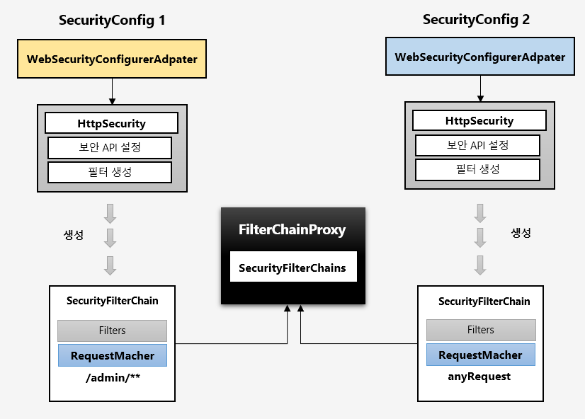

`WebSecurityConfigurerAdapter` 가 2개 이상이라면 각각의 `Filters` 가 생성이 되어서 `FilterChainProxy` 에 등록됩니다.

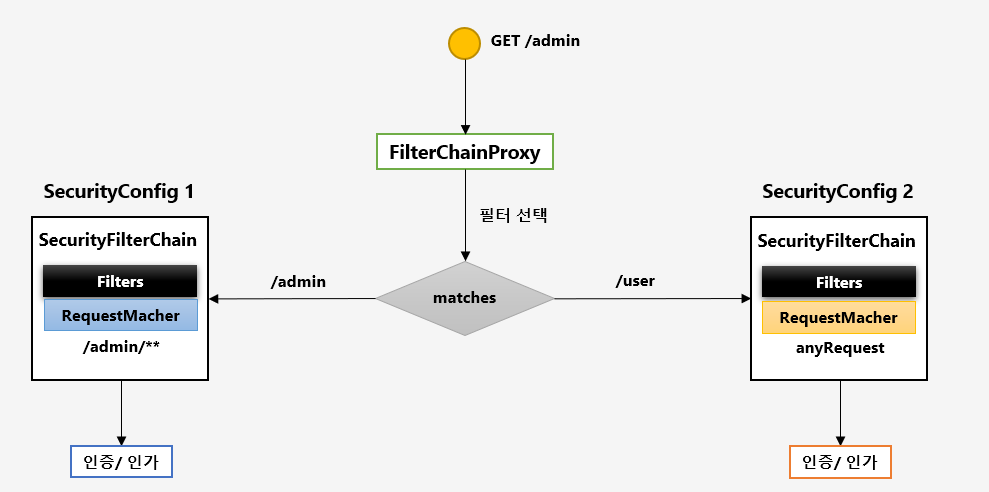

`FilterChainProxy` 가 각 필터들 가지고 있으면서 요청에 따라 `RequestMatcher` 와 매칭되는 필터가 작동하도록 합니다.

## 코드 레벨

다음과 같이 두 개의 `SecurityConfig` 를 설정합니다. `@Order` 를 통해 순서를 지정해줘야 합니다.

```java
@Configuration
@EnableWebSecurity
@Order(0)
public class SecurityConfig extends WebSecurityConfigurerAdapter {

    @Override
    protected void configure(HttpSecurity http) throws Exception {

        http
                .antMatcher("/admin/**")
                .authorizeRequests()
                .anyRequest().authenticated()
                .and()
                .httpBasic();
    }
}

@Configuration
@Order(1)
class SecurityConfig2 extends WebSecurityConfigurerAdapter {

    @Override
    protected void configure(HttpSecurity http) throws Exception {

        http
                .authorizeRequests()
                .anyRequest().permitAll()
                .and()
                .formLogin();
    }
}
```

스프링을 실행시키면서 `WebSecurity` 의 `performBuild()` 메서드를 보겠습니다.

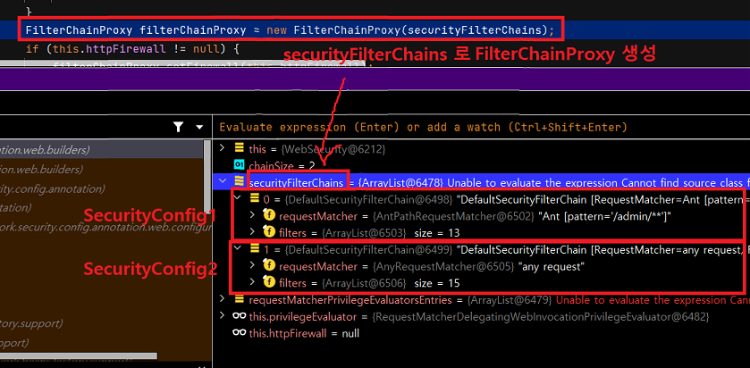

`FilterChainProxy` 를 생성할 때 `SecurityFilterChain` 을 리스트 형태로 넘기고 있습니다. 각각 `requestMatcher` 를 가집니다.


요청이 들어오면 `FilterChainProxy` 에서 `filterChains` 를 순회하면서 맞는 필터를 찾습니다. 이때 `Order` 순서에 따라 순회합니다. 만약 Order 순서가 변경된다면, `/admin/**` 에도 인증 절차 없이 모든 사용자가 접근 가능해지게 됩니다. `SecurityConfig2` 가 먼저 적용되기 때문입니다.

# 인증 개념 이해 - Authentication

​	인증(Authentication) 은 **당신이 누구인지 증명하는 것**입니다.

- 사용자의 인증 정보를 저장하는 토큰 개념입니다.
- **인증 시** `id` 와 `password` 를 담고 인증 검증을 위해 전달되어 사용됩니다.
- **인증 후** 최종 인증 결과 (user 객체, 권한정보) 를 담고 `SecurityContext` 에 저장되어 전역적으로 참조가 가능합니다.
  - `Authentication authentication **=** SecurityContexHolder.getContext().getAuthentication()`

**구조**

1. **principal** : 사용자 아이디 혹은 User 객체를 저장
1. **credentials** : 사용자 비밀번호
1. **authorities** : 인증된 사용자의 권한 목록
1. **details** : 인증 부가 정보
1. **Authenticated :** 인증 여부

## 인증 흐름

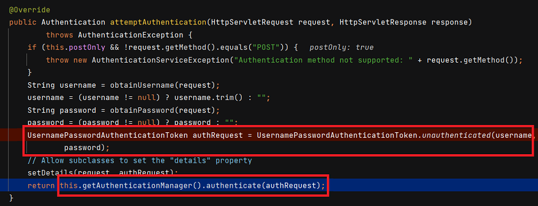

먼저 `UsernamePasswordAuthenticationFilter` 의 `attemptAuthentication()` 메서드에서 비인증된 `UsernamePasswordAuthenticationToken` 을 만들고, 인증은 `ProviderManager` 으로 위임합니다.

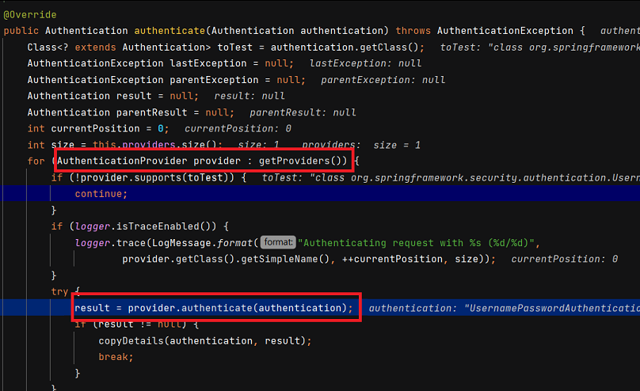

`ProviderManager` 에서는 저장된 provider 의 `authenticate()`  메서드로 인증을 넘깁니다.

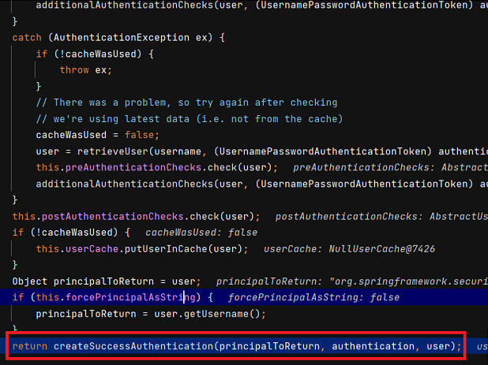

`DaoAuthenticationProvider` 의 `authenticate()`  메서드는 길어서 다 캡처하진 못했는데, 인증이 완료되면 `createSuccessAuthentication()` 메서드를 호출합니다. 해당 메서드는 로직실행 후 부모클래스의 `createSuccessAuthentication()` 를 호출합니다.

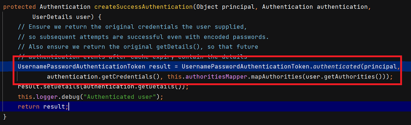

`AbstractUserDetailsAuthenticationProvider` 는 `principal`, `Credential`, `Authorities` 를 통해 `UsernamepasswordAuthenticationToken` 을 만듭니다. 그리고 `setDetails()` 로 부가 정보를 저장합니다.

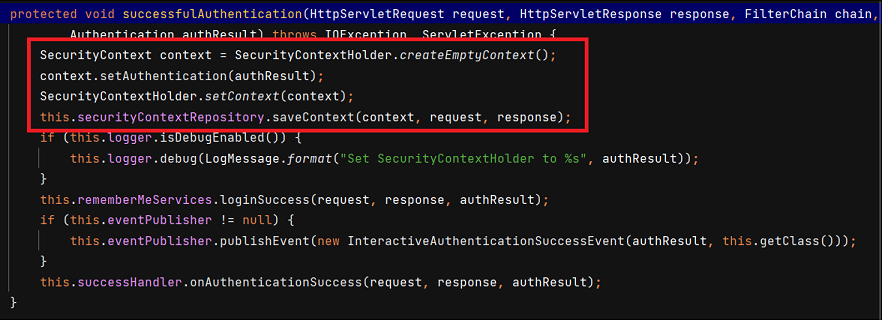

인증이 완료되면 `AbstractAuthenticationProcessingFilter` 의 `successfulAuthentication()` 메서드가 호출되어 SecurityContextHolder 에 해당 정보가 저장되게 됩니다. `SecurityContextHolder.getContext().getAuthentication()` 을 통해 전역적으로 사용할 수 있습니다.

# 인증저장소 - SecurityContextHolder, SecurityContext

## SecurityContext

​	`SecurityContext` 는 `Authentication` 객체가 저장되는 보관소로 필요 시 언제든지 `Authentication` 객체를 꺼내어 쓸 수 있도록 제공되는 클래스입니다. `ThreadLocal` (쓰레드별 고유 저장소) 에 저장되어 아무 곳에서나 참조가 가능하도록 설계되었습니다. 인증이 완료되면 `HttpSession` 에 저장되어 애플리케이션 전반에 걸쳐 전역적인 참조가 가능하게 됩니다.

## SecurityContextHolder

`SecurityContextHolder` 는 `SecurityContext` 객체를 감싸고 있습니다. `SecurityContext` 객체 저장 방식은 아래와 같습니다.

- MODE_THREADLOCAL : 스레드당 `SecurityContext` 객체를 할당, **기본값**
- MODE_INHERITABLETHREADLOCAL : 메인 스레드와 자식 스레드에 관하여 동일한 `SecurityContext` 를 유지
- MODE_GLOBAL : 응용 프로그램에서 `static` 으로 단 하나의 `SecurityContext` 를 저장

`SecurityContextHolder.clearContext()` 로 `SecurityContext` 정보를 초기화할 수 있습니다.

`Authentication` 얻기 : `Authentication authentication = SecurityContextHolder.getContext().*getAuthentication()`

흐름은 아래와 같습니다.

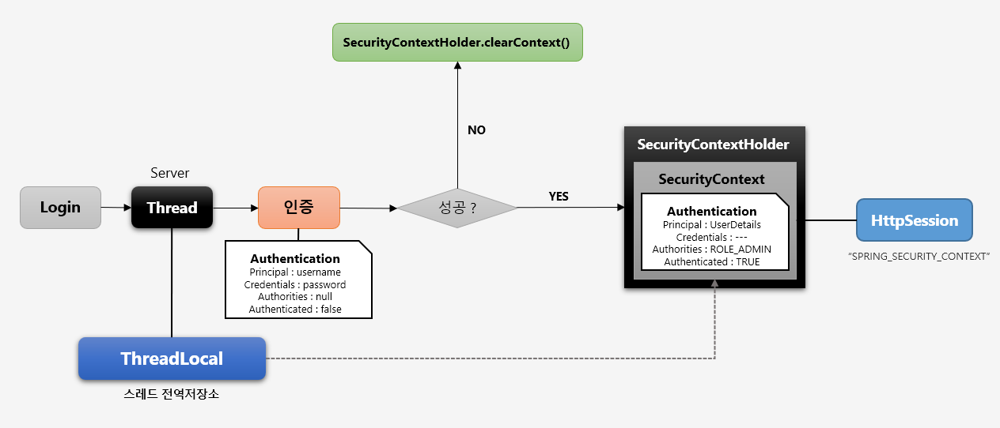

로그인을 시도하면 스레드를 할당받는데, 인증을 시도하면서 `Authentication` 을 할당받습니다. 인증에 성공하게 되면 인증필터가 `SecurityContextHolder` 이 감싸고 있는 `SecurityContext` 에 인증객체(`Authentication`) 를 넣습니다. 그리고 최종적으로 `SecurityContext` 가 `HttpSession` 에 저장됩니다.

## 인증 흐름

아래는 `SecurityContextHolder` 클래스의 `initializeStrategy()` 메서드 입니다.

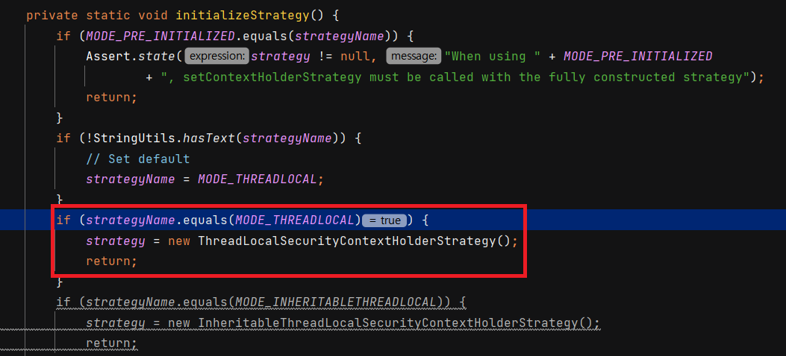

스프링 시큐리티가 초기화되는 과정에서 `SecurityContext` 객체 저장방식을 지정하고 있습니다.

이제 로그인을 시도해보겠습니다. 인증 성공 이후에 인증 필터인 `AbstractAuthenticationProcessingFilter` 의 `successfulAuthentication()` 메서드에서 `SecurityContext` 에 해당 `Authentication` 객체를 저장합니다.

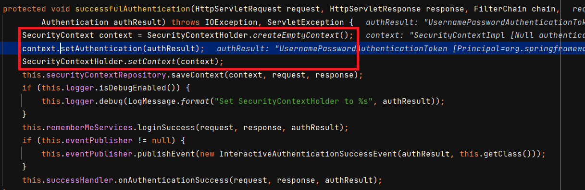

이제 해당 `Authentication` 을 꺼내보겠습니다. `SecurityContextHolder` 에서 꺼내는 방법과 세션에서 꺼내는 방법 두가지가 있습니다.

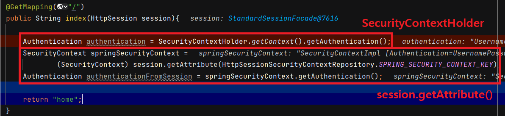

위 코드는 `"/"` 으로 매핑했을 때입니다. 다른 방법으로 `Authentication` 을 받아도 둘 다 같은 인스턴스입니다.

이번엔 자식스레드와 부모스레드 간 `SecurityContext` 를 공유하는지 확인해보겠습니다. 현재 ThreadLocal 에 `SecurityContext` 객체 저장 방식은 `MODE_THREADLOCAL` 입니다. 따라서 부모와 자식 쓰레드 간 `SecurityContext` 거 공유되지 않습니다.

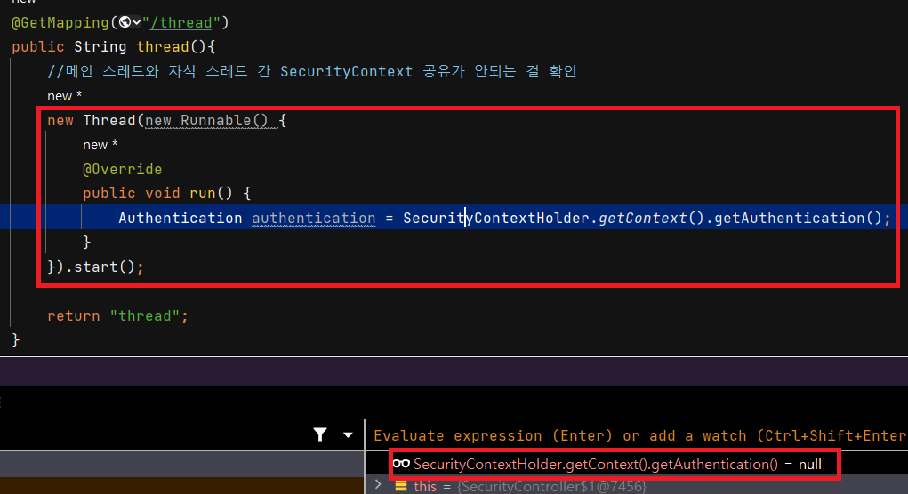

아래 빨간 박스를 보면 자식 스레드의 `Authentication()` 은 `null` 임을 알 수 있습니다.

만약 `SecurityContext` 를 공유하는 방식인 `MODE_INHERITABLETHREADLOCAL` 로 변경하려면 `SecurityConfig` 파일에서 다음과 같이 설정합니다.

```java
@Configuration
@EnableWebSecurity
public class SecurityConfig extends WebSecurityConfigurerAdapter {

    @Override
    protected void configure(HttpSecurity http) throws Exception {

        http
                .authorizeRequests()
                .anyRequest().authenticated()
                .and()
                .formLogin();
		//Strategy 설정
        SecurityContextHolder.setStrategyName(SecurityContextHolder.MODE_INHERITABLETHREADLOCAL);
    }
}

```

` SecurityContextHolder.setStrategyName()` 를 통해 `SecurityContextHolder` 의 스레드 공유 방식을 설정할 수 있습니다.

# 인증 저장소 필터 - SecurityContextPersistenceFilter

*Deprecated 되었으며 `SecurityContextHolderFilter` 를 사용하면 됩니다.*


`SecurityContextPersistenceFilter` 는 `SecurityContext` 객체의 생성, 저장, 조회를 담당하는 필터입니다. 

- 익명사용자 접근 시  -> `AnonymousAuthenticationFilter` 에서 `AnonymousAuthenticationToken` 객체를 `SecurityContext` 에 저장하게 됩니다.
- 인증 시 -> `UsernamePasswordAuthenticationFilter` 에서 인증 성공 후 `SecurityContext` 에 `UsernamePasswordAuthentication` 객체를 `SecurityContext` 에 저장하게 됩니다. 인증이 최종 완료되면 `Session` 에 `SecurityContext` 를 저장합니다.
- 인증된 사용자가 접근 시  -> `Session` 에서 `SecurityContext` 꺼내어 `SecurityContextHolder` 에 저장합니다. `SecurityContext` 안에 `Authentication` 객체가 존재하면 계속 인증을 유지하게 됩니다.
- 최종 응답 시에는 공통적으로 스레드 반환을 위해 `SecurityContextHolder.clearContext()` 를 호출합니다.


위 그림처럼 `SecurityContextPersistenceFilter` 는 세션에 인증정보가 있으면 바로  `SecurityContext` 꺼내어 `SecurityContextHolder` 에 저장하고, 그게 아니면 `SecurityContext` 를 만든 후 저장하게 됩니다.

아래와 같은 흐름으로 동작합니다.

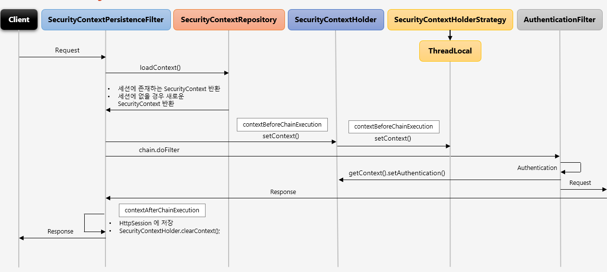

# 인증 흐름 이해 - Authentication Flow

인증처리를 시작하는 시작 단계부터 각각의 인증 단계를 거쳐서 인증이 완료되는 흐름을 살펴보겠습니다.

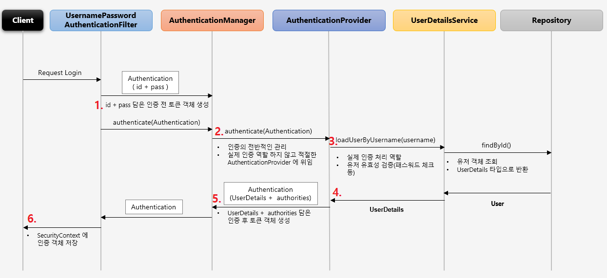

1. `UsernamePasswordAuthenticationFilter` 가 `Authentication` 객체를 생성해서 `AuthenticationManager` 에게 인증을 위임합니다.
2. `AuthenticationManager` 은 인증의 전반적인 관리를 하지만 실제 인증역할은 하지 않습니다. 대신 내부적으로 가지고 있는 `List` 안의 `AuthenticationProvider` 중 현재 인증에 사용되는 `AuthenticationProvider` 를 찾아서 인증을 위임합니다.
3. `AuthenticationProvider` 는 전달받은 `Authentication` 을 통해 `UserDetailsService` 로 유저 객체를 요청합니다.
4. `UserDetailsService` 는 DB 에서 유저 객체를 조회합니다. 이때 예외가 발생하면 인증에 실패하게 되고, 그 예외는 `UsernamePasswordAuthenticationFilter` 가 받아서 처리하게 됩니다. **인증에 성공하면 `UserDetails` 타입으로 반환**합니다.
5. `AuthenticationProvider` 는 ID 가 검증된 `UserDetails` 에서 PW 를 검증합니다. PW 가 일치하지 않으면 `BadCredentialException` 이 발생합니다. 검증이 완료되면 `Authentication` 에 `UserDetails` 와 `authorities` 를 담은 객체를 생성하여 반환합니다.
6. 최종적으로 `UsernamePasswordAuthenticationFilter` 는 `SecurityContext` 에 인증 객체를 저장합니다.

## 인증 흐름

1. 먼저 `UsernamePasswordAuthenticationFilter` 에서 `Authentication` 객체를 만든 뒤 `AuthenticationManager` 로 넘깁니다.

   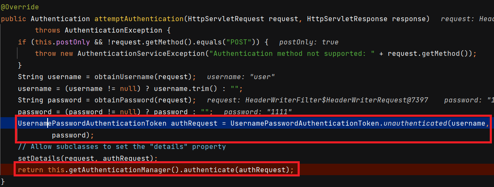

2. `AuthenticationManager` 는 가지고 있는 `Provider` 리스트 중 반환받은 `Authentication` (여기서는 `UsernamePasswordAuthenticationToken`) 을 처리할 수 있는 `Provider` 를 선택해서 인증을 실시합니다.

   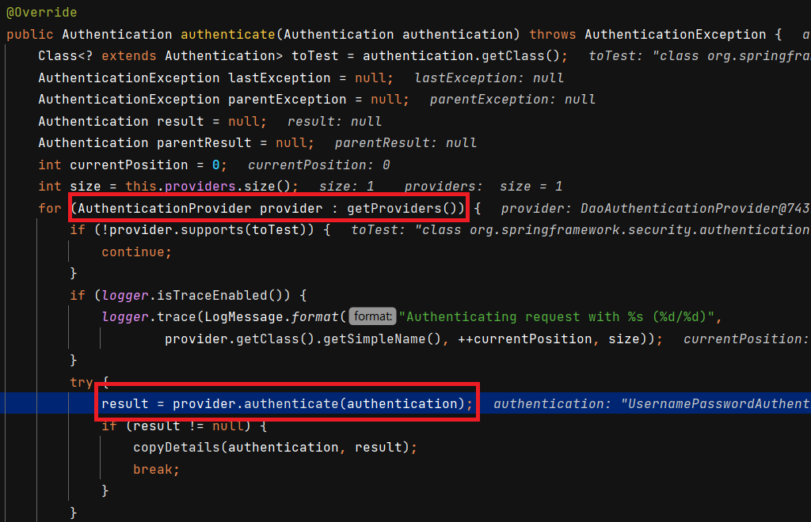

   - 여기서는 `DaoAuthenticationProvider` 가 적용됩니다.

3. `provider.authenticate()` 는 `DaoAuthenticationProvider.retrieveUser()` 를 호출합니다. 

   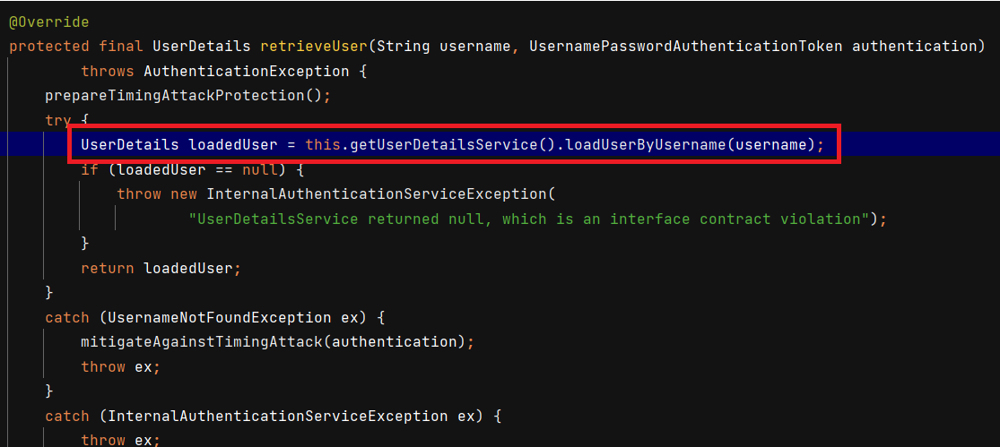

   - `UserDetailsService` 에서 `UserDetails` 를 반환받습니다.

4. `loadedUser` 가 `null` 이 아니면 ID 값은 DB 에 있는 겁니다. 이제 `DaoAuthenticationProvider` 에서 PW 를 검증하겠습니다. `additionalAuthenticationChecks()` 메서드에서 검증합니다.

   

5. 최종적으로 `AbstractAuthenticationProcessingFilter` 의 `successfulAuthentication()` 메서드에서 `SecurityContextHolder` 에 `SecurityContext` 를 담습니다.

   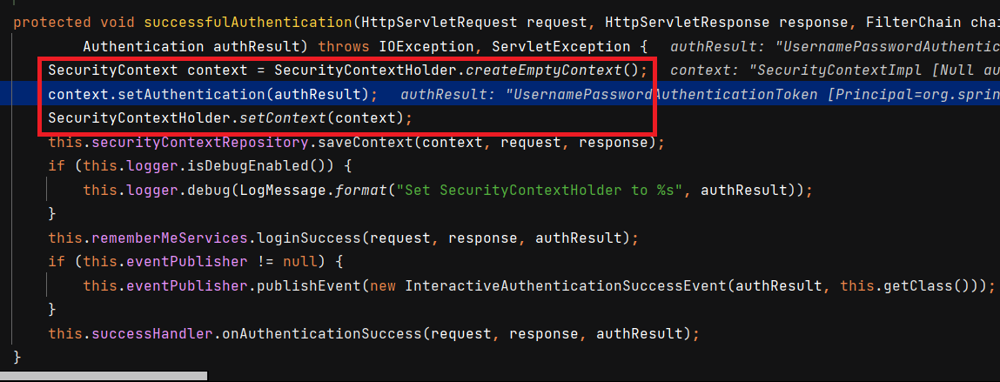

# 인증 관리자 - AuthenticationManager

`AuthenticationManager` 는 인터페이스이며, 구현체인 `ProviderManager` 가 인증에 따라 `Provider` 를 선택합니다.

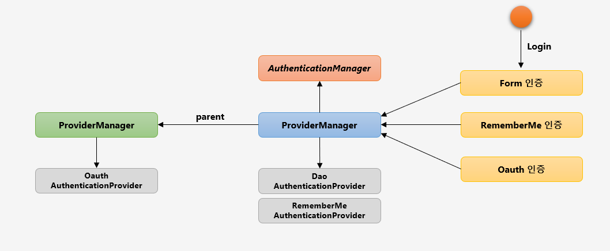

인증 필터인 `AuthenticationFilter` 가 `Authentication` 객체를 생성해서 `ProviderManger` 에게 넘기면, `ProviderManger ` 는 자기가 가지고 있는 `Provider` 리스트를 순회하면서 해당 인증을 처리할 수 있는지 확인합니다. `Form` 인증은 `DaoAuthenticationProvider` 를, `RememberMe` 인증은 `RememberMeAuthenticationProvider` 를 사용합니다. 하지만 해당 `ProviderManager` 가 처리하지 못한다면 `parent` 를 호출해서 처리합니다.

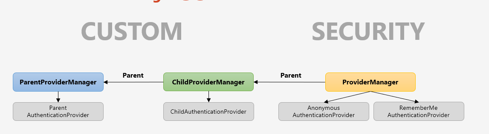

`ProviderManager` 는 위 그림과 같이 Linked 형태로 부모와 자식간의 관계를 형성할 수 있습니다. 자식에서 적절한 `AuthenticationProvider` 를 찾지 못할 경우 계속 부모로 탐색하여 찾는 과정을 반복합니다. `AuthenticationManagerBuilder` 를 사용해서 스프링 시큐리티의 초기화 과정에서 설정한 기본 `Parent` 관계를 변경해야 권한 필터에서 재 인증 시 모든 `AuthenticationProvider` 를 탐색할 수 있습니다.

# 인증 처리자 - AuthenticationProvider

이번엔 인증처리의 핵심적인 역할인 `AuthenticationProvider` 를 보겠습니다.

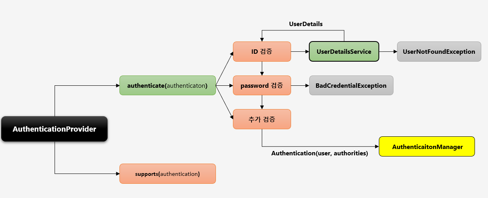

`AuthenticationProvider` 는 ID 검증, PW 검증, 추가 검증을 거친 후 `Authentication` 객체에 `User` 와 권한정보를 넣어서 `AutenticationManager` 에 다시 반환합니다. 만약 ID 검증이 실패하면 `UserNotFoundException`, PW 검증이 실패하면 `BadCredentialException` 이 터집니다.

구체적인 절차는 `Authentication Flow` 의 인증 흐름에서 3, 4번 절차와 같습니다.

# 인증 개념 및 필터 이해 - Authorization, FilterSecurityInterceptor

`Authorization` 은 **무엇이 허가되었는지 증명하는 것**입니다. 스프링은 아래와 같이 `Authentication` 과 `Authorization` 두 영역에 걸쳐 확인합니다.

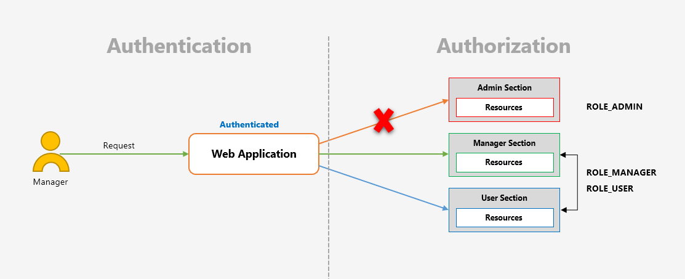

스프링 시큐리티가 지원하는 권한 계층은 **웹계층, 서비스 계층, 도메인 계층**이 있습니다.

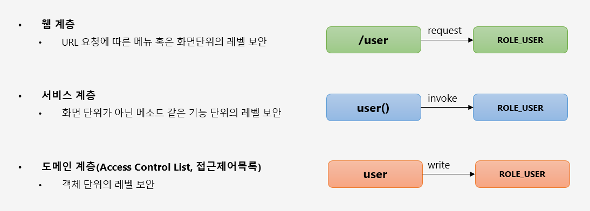

## FilterSecurityInterceptor

​	인가 처리를 하는 마지막에 위치한 필터로써, 인증된 사용자에 대하여 특정 요청의 승인/거부 여부를 최종적으로 결정합니다. **인증객체 없이 보호자원에 접근을 시도할 경우 AuthenticationException 을 발생**시키고, **인증 후 자원에 접근 가능한 권한이 존재하지 않을 경우 AccessDeniedException 을 발생**시킵니다.

​	해당 필터는 세 가지 권한 제어 방식 중 **HTTP 자원의 보안을 처리하는 필터**입니다. 실제적인 권한 처리는 **AccessDecisionManager** 에게 맡깁니다.

## 인증 흐름

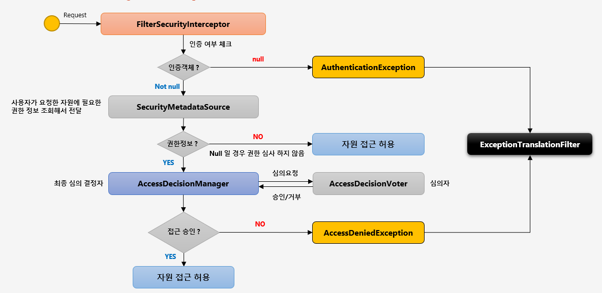

1. 먼저 `FilterSecurityInterceptor` 는 인증 여부를 체크해서 인증 객체가 없다면 `AuthenticationException` 을 발생시킵니다. 
2. `SecurityMetadataSource` 는 요청 url 에 대한 메타정보를 가지고 있습니다. 해당 클래스를 통해 요청이 권한 정보가 필요한지 확인하고, 권한정보가 필요없다면 바로 자원 접근을 허용합니다.
3. 권한정보가 필요하다면 `AccessDecisionManager` 가 `AccessDecisionVoter` 를 통해 심의하고 승인/거부 결과값을 얻습니다.
4. 해당 결과값에 따라 접근을 승인하거나 `AccessDeniedException` 을 터트립니다. 

# 인가 결정 심의자 - AccessDecisionManger, AccessDecisionVoter

*스프링 시큐리디 6 버전부터는 Vote 작업과 관련된 내용이 모두 deprecate 되고 모든 처리는 AuthorizationFilter 에서 진행됩니다.*

## AccessDecisionManger

​	`AccessDecisionManger` 는 인증 정보, 요청정보, 권한정보를 이용해서 사용자의 자원접근을 허용할 것인지 거부할 것인지를 최종 결정하는 주체입니다. 여러 개의 `Voter` 들을 가질 수있으며 **`Voter` 들로부터 접근허용, 거부, 보류에 해당하는 각각의 값을 리턴받고 판단 및 결정**을 합니다. 최종 접근 거부 시 예외가 발생합니다.

​	접근 결정의 유형은 아래와 같습니다.

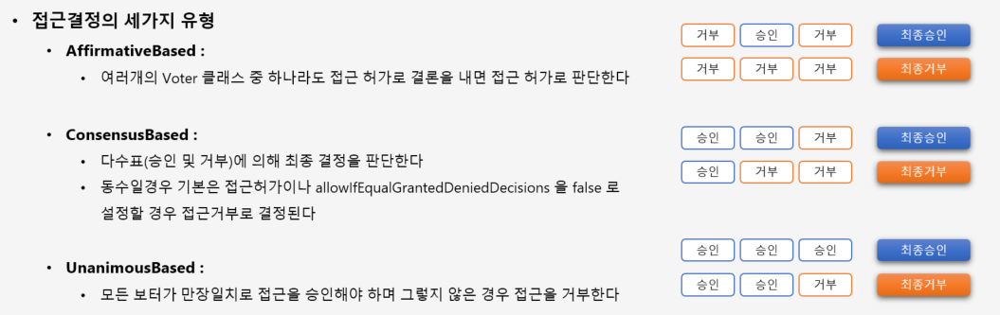

 `AffirmativeBased` 는 `AccessDecisionManger` 가 가진 `Voter` 들 중 하나라도 승인이 나면 최종 승인합니다. `ConsensusBased` 는 다수표에 의해 최종 결정을 판단합니다. `UnanimousBased` 는 모두 승인이 나야 최종 승인합니다.

## AccessDecisionVoter

​	인가 결정을 심사하는 위원입니다. `Voter` 가 권한 부여 과정에서 판단하는 자료는 아래와 같습니다.

- `Authentication` - 인증 정보(`user`)
- `FilterInvocation` – 요청 정보 (`antMatcher("/user")`)
- `ConfigAttributes` - 권한 정보 (`hasRole("USER")`)

그리고 결정 방식은 총 3가지입니다.

- ACCESS_GRANTED : 접근허용(1)
- ACCESS_DENIED : 접근 거부(-1)
- ACCESS_ABSTAIN : 접근 보류(0) *Voter 가 해당 타입의 요청에 대해 결정을 내릴 수 없는 경우*

## 인증 흐름


`FilterSecurityInterceptor` 가 `AccessDecisionManager` 에게 인가 처리를 요청하면 권한 판단 심사 후 접근이 허용되면 ACCESS_GRANTED 를 반환하고, 거부되면 `ExceptionTranslationFilter` 에서 ACCESS_DENIED 를 반환해 예외를 터트립니다.

## 코드 레벨

​	`AccessDecisitionManger` 는 인터페이스로, 구현체는 아래와 같습니다.

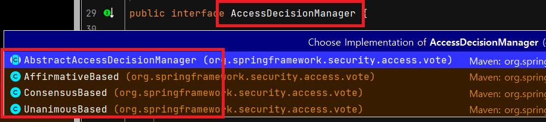

​	이제 로그인을 시도해보겠습니다. `FilterSecurityInterceptor` 의 상위 클래스인 `AbstractSecurityInterceptor` 의 `attemptAuthorization()` 에서 `AccessDecisitionManger` 에게 인가처리 요청을 합니다.

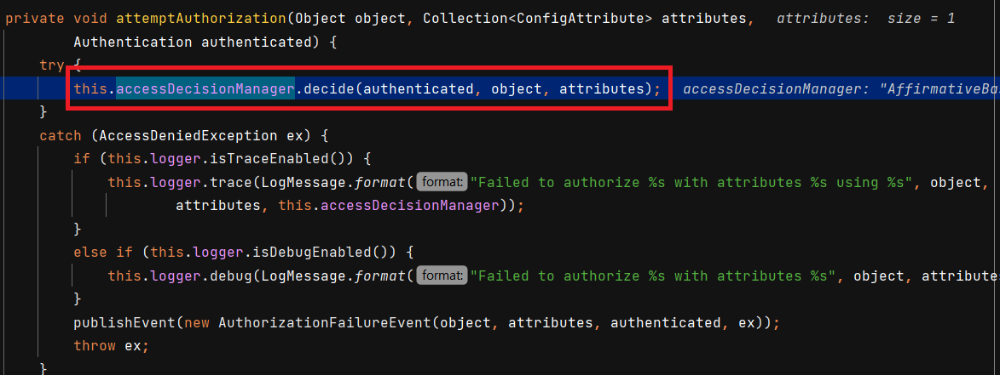

​	기본 `AccessDecisitionManger` 는 `AffirmativeBased` 입니다. `voter` 들을 순회하면서 하나라도 승인이나면 `return` 합니다.

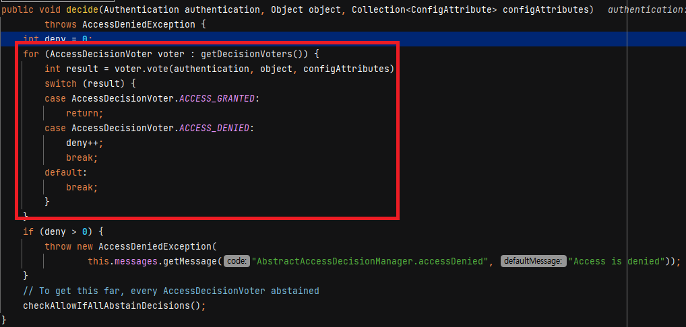

현재는 `Voter` 가 1개밖에 없지만 사용자가 추가할 수 있습니다.

# 스프링 시큐리티 필터 및 아키텍처 정리

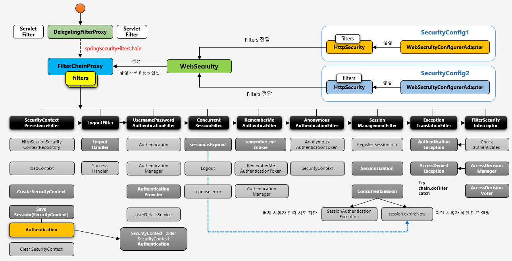

1. `SecurityConfig` 에서 정보를 읽어서 `FIlterChainProxy` 에 `filters` 가 생성됩니다.
2. DelegatingFilterproxy 는 하나의 서블릿 필터로, 인증요청에 대해 springSecurityFilterChain 이라는 스프링 빈을 찾아 위임합니다.
3. `FilterChainProxy` 는 요청을 받으면 필터 순서대로 요청을 처리합니다.

