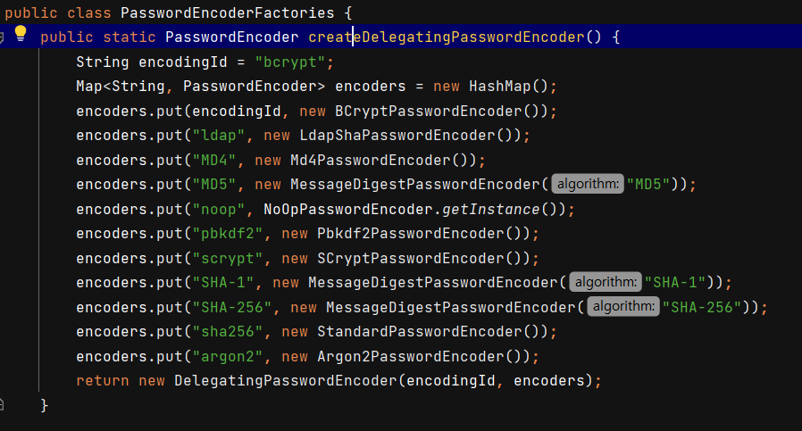
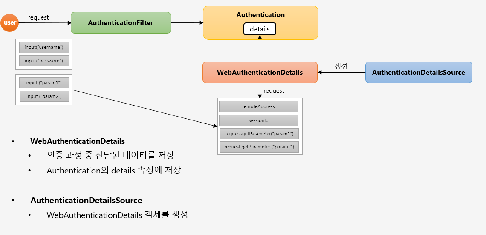
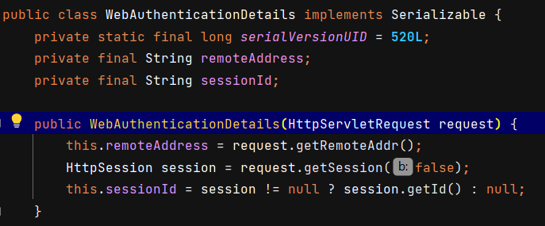

# WebIgnore 설정

​	js / css / image 파일 등 보안 필터를 적용할 필요가 없는 리소스를 설정할 수 있습니다. 다음과 같이 설정할 수 있습니다.

```java
@Configuration
@EnableWebSecurity
public class SecurityConfig extends WebSecurityConfigurerAdapter {

    ...
        
    @Override
    public void configure(WebSecurity web) throws Exception {
        web.ignoring().requestMatchers(PathRequest.toStaticResources().atCommonLocations());
    }
}
```

`web.ignoring()` 을 설정하면 아예 보안필터를 거치지 않습니다. 반면 `antMatchers("/","/users").permitAll()` 이라고 설정하면 모든 접근을 허용하지만 보안필터 자체는 거쳐야 합니다.

# PasswordEncoder

​	비밀번호를 안전하게 암호화하도록 제공합니다. 생성은 `PasswordEncoder passwordEncoder = PasswordEncoderFactories.createDelegatingPasswordEncoder()` 으로 생성합니다.

`PasswordEncoderFactories` 는 아래와 같이 여러가지 다양한 알고리즘을 지원합니다.



암호화 포맷은 `{id}encodedPassword` 가 됩니다. 암호화의 기본 포맷은 bcrypt 입니다. (`{bcrypt}$2a$10$dXJ3SW6G7P50lGmMkkmwe.20cQQubK3.HZWzG3YB1tlRy.fqvM/BG`)

## 코드 레벨

회원가입 등으로 User 를 만들 때 아래와 같이 `passwordEncoder` 로 비밀번호를 암호화시켜줘야 합니다. `passwordEncoder` 는 `SecurityConfig` 에서 빈으로 등록했으니 스프링 컨테이너에서 DI 해줍니다.

```java
@Controller
public class UserController {

	@Autowired
	private UserService userService;

	@Autowired
	private PasswordEncoder passwordEncoder;

	...

	@PostMapping("/users")
	public String createUser(AccountDto accountDto){

		ModelMapper modelMapper = new ModelMapper();
		Account account = modelMapper.map(accountDto, Account.class);
		account.setPassword(passwordEncoder.encode(account.getPassword()));
		userService.createUser(account);


		return "redirect:/";
	}
}

```

`account.setPassword(passwordEncoder.encode(account.getPassword()));` 로 인코딩한 후 `userService.createUser()` 메서드로 저장합니다.

# CustomUserDetailService

`UserDetailsService` 를 직접 구현해서 `Authentication` 에 들어가는 `UserDetails` 를 만들 수 있습니다. 이를 위해 먼저 `UserDetails` 를 구현하는 `AccountContext` 클래스를 직접 만들어줍니다.

```java
public class AccountContext extends User {

    private final Account account;
    public AccountContext(Account account, Collection<? extends GrantedAuthority> authorities) {
        super(account.getUsername(), account.getPassword(), authorities);
        this.account = account;
    }

    public Account getAccount() {
        return account;
    }
}
```

`User` 클래스는 `UserDetails` 를 구현하고 있습니다. `account` 에도 접근할 수 있도록 필드로 선언합니다.

이제 `CustomeUserDetailsService` 를 작성합니다.

```java
@RequiredArgsConstructor
public class CustomeUserDetailsService implements UserDetailsService {

    private final UserRepository userRepository;

    @Override
    public UserDetails loadUserByUsername(String username) throws UsernameNotFoundException {

        Account account = userRepository.findByUsername(username);

        if(account == null){
            throw new UsernameNotFoundException("UsernameNotFoundException");
        }

        List<GrantedAuthority> roles = new ArrayList<>();
        roles.add(new SimpleGrantedAuthority(account.getRole()));

        AccountContext accountContext = new AccountContext(account, roles);

        return accountContext;
    }
}

```

기존에 만들어둔 클래스인 `AccountContext` 를 반환합니다. 이제 인증 객체에 `UserDetails` 에는 `AccountContext` 가 담깁니다.

마지막으로 빈 등록을 합니다.

```java
@Configuration
@EnableWebSecurity
@Slf4j
@RequiredArgsConstructor
public class SecurityConfig extends WebSecurityConfigurerAdapter {


    private final UserDetailsService userDetailsService;

    @Override
    protected void configure(AuthenticationManagerBuilder auth) throws Exception {
        auth.userDetailsService(userDetailsService);
    }
}
```

이제 해당 `CustomeUserDetailsService` 로 인증을 하므로, DB 에서 정보를 조회해서 `Authentication` 을 만듭니다.

# CustomAuthenticationProvider

이번엔 인증을 직접 검증하는 `AuthenticationProvider` 을 구현해보겠습니다.

```java
@RequiredArgsConstructor
public class CustomAuthenticationProvider implements AuthenticationProvider {

    private final UserDetailsService userDetailsService;
    private final PasswordEncoder passwordEncoder;
    @Override
    public Authentication authenticate(Authentication authentication) throws AuthenticationException {

        String username = authentication.getName();
        String password = (String) authentication.getCredentials();

        AccountContext accountContext = (AccountContext) userDetailsService.loadUserByUsername(username);

        if(!passwordEncoder.matches(password, accountContext.getAccount().getPassword())){
            throw new BadCredentialsException("BadCredentialsException");
        }

        UsernamePasswordAuthenticationToken authenticationToken
                = new UsernamePasswordAuthenticationToken(
                        accountContext.getAccount(),
                null,
                        accountContext.getAuthorities()
        );

        return authenticationToken;
    }

    @Override
    public boolean supports(Class<?> authentication) {
        return UsernamePasswordAuthenticationToken.class.isAssignableFrom(authentication);
    }
}

```

`authenticate()` 메서드는 내부에서 검증 작업을 실시합니다. `supports()` 메서드는 어떤 `Authentication` 이 어떤 `Provider` 를 사용하는지 여부를 확인합니다.

이제 SecurityConfig 에서 `AuthenticationManagerBuilder`에 등록해줍니다. `userDetailsService` 는 따로 등록할 필요가 없어지는데, 해당 클래스는 `CustomAuthenticationProvider` 내부에만 있으면 되기 때문입니다.

```java
@Configuration
@EnableWebSecurity
@Slf4j
@RequiredArgsConstructor
public class SecurityConfig extends WebSecurityConfigurerAdapter {


    private final UserDetailsService userDetailsService;

    @Override
    protected void configure(AuthenticationManagerBuilder auth) throws Exception {
//        auth.userDetailsService(userDetailsService); // 아래 로직에서 다 포함
        auth.authenticationProvider(authenticationProvider());
    }

    @Bean
    public AuthenticationProvider authenticationProvider() {
        return new CustomAuthenticationProvider(userDetailsService, passwordEncoder());
    }
    ...
    
}
```

# 로그아웃 및 화면 보안 처리

​	로그아웃은 Form 태그를 이용하여 POST 로 요청할 수도 있지만 <a> 태그를 이용해 GET 으로 요청할 수도 있습니다. GET 으로 요청하면 `LogoutFilter` 는 동작하지 않고, 직접 API 를 작성해야 합니다.

```java
@Controller
public class LoginController {

    @GetMapping("logout")
    public String logout(HttpServletRequest request, HttpServletResponse response) {

        Authentication authentication = SecurityContextHolder.getContext().getAuthentication();

        if(authentication != null){
            new SecurityContextLogoutHandler().logout(request, response, authentication);
        }

        return "redirect:/login";
    }
}

```

`SecurityContextLogoutHandler` 클래스에서 `logout()` 메서드를 통해 인증 정보를 삭제합니다.

# 인증 부가 기능 - WebAuthenticationDetails, AuthenticationDetailSource

인증정보에 대한 부가적인 정보 (파라미터 값 등) 을 저장하는 방법입니다.



`Authentication` 의 `detail` 필드는 `Object` 타입입니다. 여기서 `WebAuthenticationDetails` 가 들어오는데, 해당 클래스는 `AuthenticationDetailsSource` 클래스가 만듭니다. `Request` 정보를 통해서 부가 정보를 넣습니다.

`WebAuthenticationDetails` 클래스를 보겠습니다.



`HttpServletRequest` 를 받아서 기본적으로 `remoteAddress` 와 `sessionId` 를 넣어주고 있습니다.

## Custom 만들기

### 생성

먼저 Custom 으로 `FormWebAuthenticationDetails` 클래스를 만듭니다.

```java
public class FormWebAuthenticationDetails extends WebAuthenticationDetails {

    private String secretKey;
    public FormWebAuthenticationDetails(HttpServletRequest request) {
        super(request);
        secretKey = request.getParameter("secret_key");
    }

    public String getSecretKey() {
        return secretKey;
    }
}
```

그리고 해당 클래스를 생성해주는 `FormAuthenticationDetailsSource` 를 만들고 컴포넌트로 등록합니다.

```java
@Component
public class FormAuthenticationDetailsSource implements AuthenticationDetailsSource<HttpServletRequest, WebAuthenticationDetails> {

    @Override
    public WebAuthenticationDetails buildDetails(HttpServletRequest request) {
        return new FormWebAuthenticationDetails(request);
    }
}
```

이제 설정파일에서 `formLogin()` 에 .`authenticationDetailsSource()` 를 등록합니다.

```java
@Configuration
@EnableWebSecurity
@Slf4j
@RequiredArgsConstructor
public class SecurityConfig extends WebSecurityConfigurerAdapter {


    private final UserDetailsService userDetailsService;
    private final AuthenticationDetailsSource authenticationDetailsSource;

    ...

    @Override
    protected void configure(final HttpSecurity http) throws Exception {
        http
                .authorizeRequests()
                .antMatchers("/","/users").permitAll()
                .antMatchers("/mypage").hasRole("USER")
                .antMatchers("/messages").hasRole("MANAGER")
                .antMatchers("/config").hasRole("ADMIN")
                .anyRequest().authenticated()

        .and()
                .formLogin()
                .loginPage("/login")
                .loginProcessingUrl("/login_proc")
                .authenticationDetailsSource(authenticationDetailsSource) //등록
                .defaultSuccessUrl("/")
                .permitAll()
        ;
    }
}

```

### 사용

예를 들어서, `details.getSecretKey()` 도 함께 `AuthenticationProvider` 에서 검증한다고 해보겠습니다. 이전에 만든 `CustomAuthenticationProvider` 에서 해당 로직을 넣어줍니다.

```java
@RequiredArgsConstructor
public class CustomAuthenticationProvider implements AuthenticationProvider {

    private final UserDetailsService userDetailsService;
    private final PasswordEncoder passwordEncoder;
    @Override
    public Authentication authenticate(Authentication authentication) throws AuthenticationException {

        String username = authentication.getName();
        String password = (String) authentication.getCredentials();

        AccountContext accountContext = (AccountContext) userDetailsService.loadUserByUsername(username);

        if(!passwordEncoder.matches(password, accountContext.getAccount().getPassword())){
            throw new BadCredentialsException("BadCredentialsException");
        }

        FormWebAuthenticationDetails details = (FormWebAuthenticationDetails) authentication.getDetails(); //details 추출
        String secretKey = details.getSecretKey(); //secretKey 추출
        if(!"secret".equals(secretKey)){ //검증 단계
            throw new InsufficientAuthenticationException("InsufficientAuthenticationException");
        }

        UsernamePasswordAuthenticationToken authenticationToken
                = new UsernamePasswordAuthenticationToken(
                        accountContext.getAccount(),
                null,
                        accountContext.getAuthorities()
        );

        return authenticationToken;
    }

    @Override
    public boolean supports(Class<?> authentication) {
        return UsernamePasswordAuthenticationToken.class.isAssignableFrom(authentication);
    }
}
```

`details` 에서 `secretKey` 를 꺼내서 검증하는 로직입니다. 중간 주석을 보면 됩니다.

# CustomAuthenticationSuccessHandler

인증 성공 시 실행되는 `AuthenticationSuccessHandler` 를 만들어보겠습니다.

```java
@Component
public class CustomAuthenticationSuccessHandler extends SimpleUrlAuthenticationSuccessHandler {

    private RequestCache requestCache = new HttpSessionRequestCache();

    private RedirectStrategy redirectStrategy = new DefaultRedirectStrategy();

    @Override
    public void onAuthenticationSuccess(HttpServletRequest request, HttpServletResponse response, Authentication authentication) throws IOException, ServletException {

        setDefaultTargetUrl("/");

        //인증 성공 전 요청 정보
        SavedRequest savedRequest = requestCache.getRequest(request, response);
        if(savedRequest != null){
            //인증 성공 후 이동할 페이지
            String targetUrl = savedRequest.getRedirectUrl();
            redirectStrategy.sendRedirect(request, response, targetUrl);
        }else {
            //인증 성공 전 요청 정보가 없을 경우
            redirectStrategy.sendRedirect(request, response, "/");
        } 
    }
}

```

`SimpleUrlAuthenticationSuccessHandler` 을 상속받습니다. 인증 성공 전 요청 정보가 있다면 해당 요청 URL 로 리다이렉트해줍니다. 해당 클래스는 `@Component` 로 자동 빈 등록을 해주겠습니다.

이제 설정파일에서 `formLogin()` 에 .`successHandler()` 를 등록합니다.

```java
@Configuration
@EnableWebSecurity
@Slf4j
@RequiredArgsConstructor
public class SecurityConfig extends WebSecurityConfigurerAdapter {


    private final UserDetailsService userDetailsService;
    private final AuthenticationDetailsSource authenticationDetailsSource;
    private final AuthenticationSuccessHandler authenticationSuccessHandler;
	
	...

    @Override
    protected void configure(final HttpSecurity http) throws Exception {
        CharacterEncodingFilter filter = new CharacterEncodingFilter();
        http
                .authorizeRequests()
                .antMatchers("/","/users").permitAll()
                .antMatchers("/mypage").hasRole("USER")
                .antMatchers("/messages").hasRole("MANAGER")
                .antMatchers("/config").hasRole("ADMIN")
                .anyRequest().authenticated()

        .and()
                .formLogin()
                .loginPage("/login")
                .loginProcessingUrl("/login_proc")
                .authenticationDetailsSource(authenticationDetailsSource)
                .defaultSuccessUrl("/")
                .successHandler(authenticationSuccessHandler) //추가
                .permitAll() 
        ;
    }
}

```

`formLogin()` 에 메서드 체이닝으로 `.successHandler(authenticationSuccessHandler)` 를 추가해줍니다.

# CustomAuthenticationFailureHandler

이번에는 인증 실패 시 실행되는 `AuthenticationFailureHandler` 를 만들어보겠습니다. 동작 원리는 `CustomAuthenticationSuccessHandler` 와 똑같습니다.

먼저 `CustomAuthenticationFailureHandler` 를 만듭니다. `SimpleUrlAuthenticationFailureHandler` 를 상속받습니다.

```java
@Component
public class CustomAuthenticationFailureHandler extends SimpleUrlAuthenticationFailureHandler {

    @Override
    public void onAuthenticationFailure(HttpServletRequest request, HttpServletResponse response, AuthenticationException exception) throws IOException, ServletException {

        String errorMessage = "Invalid Username or Password";

        if(exception instanceof BadCredentialsException){
            errorMessage = "Invalid Username or Password";
        }else if(exception instanceof InsufficientAuthenticationException){
            errorMessage = "Invalid Secret Key";
        }

        setDefaultFailureUrl("/login?error=true&exception=" + errorMessage);

        super.onAuthenticationFailure(request, response, exception);
    }
}
```

`exception` 에 따라 `errorMessage` 를 다르게 하고, `setDefaultFailureUrl()` 로 Default URL 을 지정합니다. 이 때 query parameter 를 주면서 메세지를 표시할 수 있도록 합니다.

이제 설정 정보에 `.failureHandler(authenticationFailureHandler)` 를 넣습니다. `AuthenticationSuccessHandler` 를 설정할 때와 똑같습니다.

```java
@Override
protected void configure(final HttpSecurity http) throws Exception {
    CharacterEncodingFilter filter = new CharacterEncodingFilter();
    http
            .authorizeRequests()
            .antMatchers("/","/users").permitAll()
            .antMatchers("/mypage").hasRole("USER")
            .antMatchers("/messages").hasRole("MANAGER")
            .antMatchers("/config").hasRole("ADMIN")
            .anyRequest().authenticated()

    .and()
            .formLogin()
            .loginPage("/login")
            .loginProcessingUrl("/login_proc")
            .authenticationDetailsSource(authenticationDetailsSource)
            .defaultSuccessUrl("/")
            .successHandler(authenticationSuccessHandler)
            .failureHandler(authenticationFailureHandler) // 설정
            .permitAll()
    ;
}
```

이제 `Controller` 에서 인증 실패에 대한 핸들러를 작성해보도록 하겠습니다.

```java
@Controller
public class LoginController {

    @GetMapping("/login")
    public String login(@RequestParam(value = "error", required = false) String error,
                        @RequestParam(value = "exception", required = false) String exception,
                        Model model) {

        model.addAttribute("error", error);
        model.addAttribute("exception", exception);

        return "user/login/login";
    }
    ...
}
```

`@RequestParam` 으로 Default URL 로 던진 `error` 와 `exception` 을 받아서 `model` 에 넣어줍니다.

# CustomAccessDeniedHandler

​	자원에 접근하고자 할 때 인가예외를 발생시키는 핸들러입니다.

```java
public class CustomAccessDeniedHandler implements AccessDeniedHandler {

    private String errorPage;

    @Override
    public void handle(HttpServletRequest request, HttpServletResponse response, AccessDeniedException e) throws IOException, ServletException {
        String deniedUrl = errorPage + "?exception=" + e.getMessage();
        response.sendRedirect(deniedUrl);

    }

    public void setErrorPage(String errorPage){
        this.errorPage = errorPage;
    }
}

```

만약 인가 예외가 발생하면 `handle()` 메서드가 실행되기 때문에 해당 메서드만 오버라이딩 해주겠습니다. 해당 메서드는 `deniedUrl` 를 만들어서 리다이렉트합니다.

다음은 설정 정보입니다.

```java
@Configuration
@EnableWebSecurity
@Slf4j
@RequiredArgsConstructor
public class SecurityConfig extends WebSecurityConfigurerAdapter {

	...

    @Override
    protected void configure(final HttpSecurity http) throws Exception {
        CharacterEncodingFilter filter = new CharacterEncodingFilter();
        http
                .authorizeRequests()
                .antMatchers("/","/users").permitAll()
                .antMatchers("/mypage").hasRole("USER")
                .antMatchers("/messages").hasRole("MANAGER")
                .antMatchers("/config").hasRole("ADMIN")
                .anyRequest().authenticated()

        .and()
                .formLogin()
                .loginPage("/login")
                .loginProcessingUrl("/login_proc")
                .defaultSuccessUrl("/")
                .authenticationDetailsSource(authenticationDetailsSource)
                .successHandler(authenticationSuccessHandler)
                .failureHandler(authenticationFailureHandler)
                .permitAll();

        http //추가
                .exceptionHandling()
                .accessDeniedHandler(accessDeniedHandler());
    }

    @Bean //빈등록
    public AccessDeniedHandler accessDeniedHandler(){
        CustomAccessDeniedHandler customAccessDeniedHandler = new CustomAccessDeniedHandler();
        customAccessDeniedHandler.setErrorPage("/denied");
        return customAccessDeniedHandler;

    }
}
```

`AccessDeniedHandler` 에 `ErrorPage` 필드를 설정해줘야 하기 때문에 수동 빈 등록을 했습니다. `.exceptionHandling()` 메서드로 해당 핸들러를 추가해줍니다.

컨트롤러는 아래와 같습니다.

```java
@GetMapping("/denied")
public String accessDenied(@RequestParam(value = "exception", required = false) String exception, Model model){

    Authentication authentication = SecurityContextHolder.getContext().getAuthentication();
    Account account = (Account) authentication.getPrincipal();

    model.addAttribute("username", account.getUsername());
    model.addAttribute("exception", exception);
    return "user/login/denied";
}
```

`/denied` 에 쿼리 파라미터로 `exception` 을 받아서 `Model` 로 반환해줍니다.
