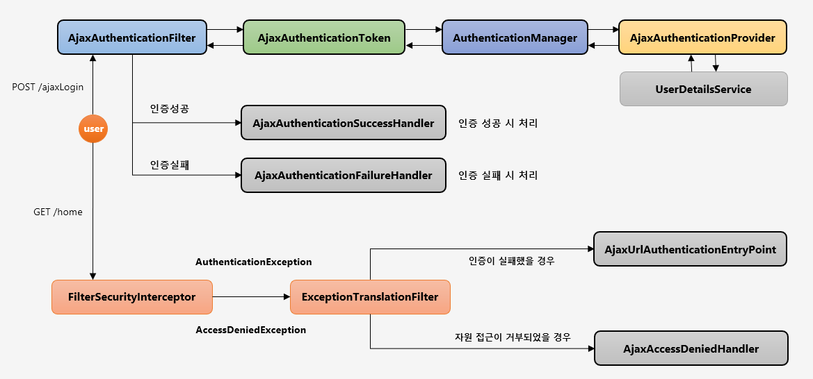
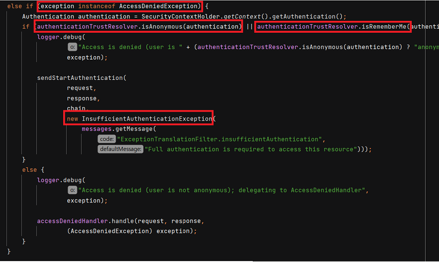
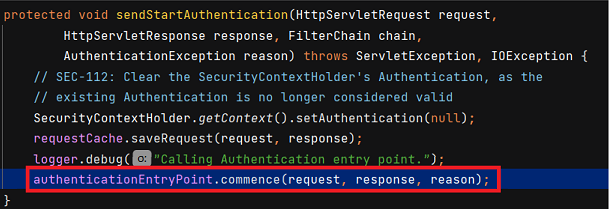
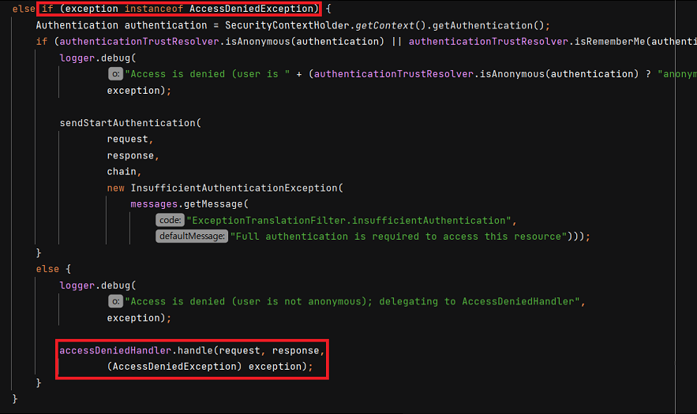

# Ajax 인증 흐름



Ajax 인증은 `AjexAuthenticationFilter` 에서 시작됩니다. Form 인증 방식의 흐름과 크게 다르지 않습니다.

# AjaxAuthenticationFilter

직접 `AjaxAuthenticationFilter` 를 만들기 위해서는 `AbstractAuthenticationProcessingFilter` 를 상속받아야 합니다. 필터의 작동조건은 요청정보와 매칭하고 요청방식이 Ajax 면 필터가 작동되도록 합니다. AjaxAuthenticationToken 을 생성하여 AuthenticationManger 에서 전달하여 인증처리를 합니다.

Filter 를 추가해야 하는데, `http.addFilterBefore(AjaxAuthenticationFilter(), UsernamePasswordAuthenticationFilter.class)` 로 추가를 합니다.

## AjaxLoginProcessingFilter 만들기

```java
public class AjaxLoginProcessingFilter extends AbstractAuthenticationProcessingFilter {

    private ObjectMapper objectMapper = new ObjectMapper();

    public AjaxLoginProcessingFilter() {
        super(new AntPathRequestMatcher("/api/login"));
    }

    @Override
    public Authentication attemptAuthentication(HttpServletRequest request, HttpServletResponse response) throws AuthenticationException, IOException, ServletException {

        if(!isAjax(request)){
            throw new IllegalStateException("Authentication is not supported");
        }

        AccountDto accountDto = objectMapper.readValue(request.getReader(), AccountDto.class);
        if(StringUtils.isEmpty(accountDto.getUsername()) || StringUtils.isEmpty(accountDto.getPassword())){
            throw new IllegalArgumentException("Username or Password is empty");
        }

        AjaxAuthenticationToken ajaxAuthenticationToken = new AjaxAuthenticationToken(accountDto.getUsername(), accountDto.getPassword());

        return getAuthenticationManager().authenticate(ajaxAuthenticationToken);
    }

    private boolean isAjax(HttpServletRequest request) {

        if("XMLHttpRequest".equals(request.getHeader("X-Requested-With"))){
            return true;
        }
    return false;
    }
}
```

`attemptAuthentication` 에서 `isAjax()` 메서드로 Ajax 요청인지 아닌지 확인합니다. 그리고 `AccountDto` 를 만들고 해당 Dto 를 `AjaxAuthenticationToken` 으로 만듭니다. 마지막으로 `getAuthenticationManager().authenticate(ajaxAuthenticationToken);` 으로 가지고 있는 `AuthenticationManager` 에게 인증을 위임합니다.

## AjaxAuthenticationToken 만들기

위에서 사용된 `AjaxAuthenticationToken` 를 만들어보겠습니다.

```java
public class AjaxAuthenticationToken extends AbstractAuthenticationToken {

    private static final long serialVersionUID = SpringSecurityCoreVersion.SERIAL_VERSION_UID;


    private final Object principal;
    private Object credentials;


    public AjaxAuthenticationToken(Object principal, Object credentials) {
        super(null);
        this.principal = principal;
        this.credentials = credentials;
        setAuthenticated(false);
    }


    public AjaxAuthenticationToken(Object principal, Object credentials,
                                               Collection<? extends GrantedAuthority> authorities) {
        super(authorities);
        this.principal = principal;
        this.credentials = credentials;
        super.setAuthenticated(true); // must use super, as we override
    }

    public Object getCredentials() {
        return this.credentials;
    }

    public Object getPrincipal() {
        return this.principal;
    }

    public void setAuthenticated(boolean isAuthenticated) throws IllegalArgumentException {
        if (isAuthenticated) {
            throw new IllegalArgumentException(
                    "Cannot set this token to trusted - use constructor which takes a GrantedAuthority list instead");
        }

        super.setAuthenticated(false);
    }

    @Override
    public void eraseCredentials() {
        super.eraseCredentials();
        credentials = null;
    }

}
```

해당 로직은 `UsernamePasswordAuthenticationToken` 에서 가지고 왔습니다. 해당 토큰도 `AbstractAuthenticationToken` 를 상속받고 있습니다.

## AjaxAuthenticationProvider

이제 `AuthenticationProvider` 를 만들어야 합니다. 현재 `AuthenticationManager` 가 가지고 있는 `Provider` 중 `AjaxAuthenticationToken` 을 처리할 수 있는 `Provider` 가 없기 때문입니다.

`AjaxAuthenticationProvider` 은 이전 챕터에서 만들었던 `FormAuthenticationProvider` 와 유사합니다.

```java
public class AjaxAuthenticationProvider implements AuthenticationProvider {

    @Autowired private UserDetailsService userDetailsService;

    @Autowired private PasswordEncoder passwordEncoder;

    @Override
    @Transactional
    public Authentication authenticate(Authentication authentication) throws AuthenticationException {

        String loginId = authentication.getName();
        String password = (String) authentication.getCredentials();

        AccountContext accountContext = (AccountContext) userDetailsService.loadUserByUsername(loginId);

        if (!passwordEncoder.matches(password, accountContext.getPassword())) {
            throw new BadCredentialsException("Invalid password");
        }

        return new AjaxAuthenticationToken(accountContext.getAccount(), null, accountContext.getAuthorities());
    }

    @Override
    public boolean supports(Class<?> authentication) {
        return authentication.equals(AjaxAuthenticationToken.class);
    }
}

```

`supports` 를 통해 `AjaxAuthenticationToken` 을 처리할 수 있도록 합니다.

## AjaxSecurityConfig

마지막으로 설정 정보를 업데이트하겠습니다.

```java
@Override
protected void configure(AuthenticationManagerBuilder auth) throws Exception {
    auth.authenticationProvider(ajaxAuthenticationProvider());
}

@Bean
public AuthenticationProvider ajaxAuthenticationProvider() {
    return new AjaxAuthenticationProvider();
}

@Override
protected void configure(HttpSecurity http) throws Exception {
    http
            .antMatcher("/api/**")
            .authorizeRequests()
            .antMatchers("/api/messages").hasRole("MANAGER")
            .anyRequest().authenticated()
    .and()
            .addFilterBefore(ajaxLoginProcessingFilter(), UsernamePasswordAuthenticationFilter.class);

    http.csrf().disable();
}

@Bean
public AjaxLoginProcessingFilter ajaxLoginProcessingFilter() throws Exception {
    AjaxLoginProcessingFilter ajaxLoginProcessingFilter = new AjaxLoginProcessingFilter();
    ajaxLoginProcessingFilter.setAuthenticationManager(authenticationManagerBean());
    return ajaxLoginProcessingFilter;
}
```

​	먼저 `AuthenticationManagerBuilder` 에 `AjaxAuthenticationProvider` 를 등록해줍니다.

​	그리고 `addFilterBefore()` 메서드로 `UsernamePasswordAuthenticationFilter` 이전에 `ajaxLoginProcessingFilter` 가 적용되도록 했습니다. `setAuthenticationManager()` 메서드로 `AuthenticationManager` 를 등록해야 합니다. `authenticationManagerBean()` 은 `WebSecurityConfigurerAdapter` 에서 제공합니다.

​	또한 POST 방식으로 보내려면 `csrf` 토큰이 있어야 하는데, ajax 방식으로 해당 토큰을 보내지 않으므로 `http.csrf().disable()` 로 비활성화합니다.

 # 인증 핸들러 - AjaxAuthenticationSuccessHandler, AjaxAuthenticationFailureHandler

이번에는 만들어둔 `AjaxLoginProcessingFilter` 에 `AjaxAuthenticationSuccessHandler` 와 `AjaxAuthenticationFailureHandler` 을 붙이겠습니다.

## AjaxAuthenticationSuccessHandler

```java
public class AjaxAuthenticationSuccessHandler implements AuthenticationSuccessHandler {

    private ObjectMapper objectMapper = new ObjectMapper();

    @Override
    public void onAuthenticationSuccess(HttpServletRequest request, HttpServletResponse response, Authentication authentication) throws IOException, ServletException {

        Account account = (Account)authentication.getPrincipal();

        response.setStatus(HttpStatus.OK.value());
        response.setContentType(MediaType.APPLICATION_JSON_VALUE);

        objectMapper.writeValue(response.getWriter(), account);
    }
}
```

해당 핸들러는 인증 성공 시 처리로직입니다. `response` 에 Status 와 ContentType 을 지정하고 응답값으로 `account` 를 보냅니다.

## AjaxAuthenticationFailureHandler

```java
public class AjaxAuthenticationFailureHandler implements AuthenticationFailureHandler {

    private ObjectMapper objectMapper = new ObjectMapper();

    @Override
    public void onAuthenticationFailure(HttpServletRequest request, HttpServletResponse response, AuthenticationException exception) throws IOException, ServletException {

        String errMsg = "Invalid Username or Password";

        response.setStatus(HttpStatus.UNAUTHORIZED.value());
        response.setContentType(MediaType.APPLICATION_JSON_VALUE);

        if(exception instanceof BadCredentialsException) {
            errMsg = "Invalid Username or Password";
        } else if(exception instanceof DisabledException) {
            errMsg = "Locked";
        } else if(exception instanceof CredentialsExpiredException) {
            errMsg = "Expired password";
        }

        objectMapper.writeValue(response.getWriter(), errMsg);
    }
}
```

해당 핸들러는 인증 실패 시 처리로직입니다. `errMsg` 을 응답값으로 보냅니다.

## AjaxSecurityConfig

```java
@Configuration
@Order(0)
public class AjaxSecurityConfig extends WebSecurityConfigurerAdapter {

    ...

    @Bean
    public AuthenticationSuccessHandler ajaxAuthenticationSuccessHandler(){
        return new AjaxAuthenticationSuccessHandler();
    }

    @Bean
    public AuthenticationFailureHandler ajaxAuthenticationFailureHandler(){
        return new AjaxAuthenticationFailureHandler();
    }


    @Bean
    public AjaxLoginProcessingFilter ajaxLoginProcessingFilter() throws Exception {
        AjaxLoginProcessingFilter ajaxLoginProcessingFilter = new AjaxLoginProcessingFilter();
        ajaxLoginProcessingFilter.setAuthenticationManager(authenticationManagerBean());
        ajaxLoginProcessingFilter.setAuthenticationSuccessHandler(ajaxAuthenticationSuccessHandler());
        ajaxLoginProcessingFilter.setAuthenticationFailureHandler(ajaxAuthenticationFailureHandler());
        return ajaxLoginProcessingFilter;
    }
}
```

이제 만들어둔 핸들러를 수동으로 빈등록한 후에 `ajaxLoginProcessingFilter` 에 추가합니다.

# 인증 예외 처리 - AjaxLoginUrlAuthenticationEntryPoint

`ExcetionTranslationFilter` 는 인증을 받지 않은 사용자에 대해서 다음과 같이 로직을 처리합니다. 아래는 `handleSpringSecurityException()` 메서드 중 일부입니다.



잘 보면 `AccessDeniedException` 이지만 `Anonymous` 혹은 `rememberMe` 일 때 `sendStartAuthentication()` 메서드를 호출하면서 `InsufficientAuthenticationException` 을 보냅니다.

해당 메서드에서는 `Authentication` 을 삭제하고 `ReuqestCache` 에 응답을 저장한 뒤 등록된 `AuthenticationEntryPoint` 의 `commence()` 를 호출합니다.



따라서 `AjaxLoginUrlAuthenticationEntryPoint` 를 만드는건 `AuthenticationEntryPoint` 를 상속받은 클래스에서 `commence()` 메서드를 오버라이딩하는 것입니다.

아래는 `AjaxLoginUrlAuthenticationEntryPoint` 클래스입니다.

```java
public class AjaxLoginAuthenticationEntryPoint implements AuthenticationEntryPoint {

    @Override
    public void commence(HttpServletRequest request, HttpServletResponse response, AuthenticationException authException) throws IOException, ServletException {

        response.sendError(HttpServletResponse.SC_UNAUTHORIZED,"UnAuthorized");

    }
}
```

`response` 에 에러응답을 실어서 보내게 됩니다.

등록은 아래 `AjaxAccessDeniedHandler` 에서 같이 하도록 하겠습니다.

# 인증 예외 처리 - AjaxAccessDeniedHandler

이번엔 `ExcetionTranslationFilter` 에서 인가받지 않은 사용자를 처리할 때 `handleSpringSecurityException()` 메서드의 동작입니다.



`AccessDeiniedException` 이면서 익명 사용자나 rememberMe 가 아닐 때 `AccessDeniedHandler` 의 `handle()` 메서드를 호출합니다. `AccessDeniedHandler` 를 직접 구현할 수 있습니다.

아래는 `AccessDeniedHandler` 클래스입니다.

```java
public class AjaxAccessDeniedHandler implements AccessDeniedHandler {

    @Override
    public void handle(HttpServletRequest request, HttpServletResponse response, AccessDeniedException accessDeniedException) throws IOException, ServletException {

        response.sendError(HttpServletResponse.SC_FORBIDDEN, "Access is denied");
    }
}
```

`response` 에 403 에러를 실어서 보내게 됩니다.

## SecurityConfig 구성

```java
@Override
protected void configure(HttpSecurity http) throws Exception {
    http
            .antMatcher("/api/**")
            .authorizeRequests()
            .antMatchers("/api/messages").hasRole("MANAGER")
            .anyRequest().authenticated()
    .and()
            .addFilterBefore(ajaxLoginProcessingFilter(), UsernamePasswordAuthenticationFilter.class);

    http
            .exceptionHandling()
            .authenticationEntryPoint(new AjaxLoginAuthenticationEntryPoint()) //authenticationEntryPoint 등록
            .accessDeniedHandler(ajaxAccessDeniedHandler()); //accessDeniedHandler 등록

    http.csrf().disable();
}

public AccessDeniedHandler ajaxAccessDeniedHandler() {
    return new AjaxAccessDeniedHandler();
}
```

`AjaxLoginAuthenticationEntryPoint` 와 `AjaxAccessDeniedHandler` 를 동록할 떄는 DI 기능을 사용할 필요가 없으므로 빈으로 등록할 필요는 없습니다.

# Ajax Custom DSLs 구현

DSL 란 도메인 특화 언어로, 특정한 도메인을 적용하는 데 특화된 컴퓨터 언어입니다. Spring Security 의 Custom DSL 를 구현하기 위해서는 `AbstractHttpConfigurer` 를 구현하면 됩니다.

```java
public final class AjaxLoginConfigurer<H extends HttpSecurityBuilder<H>> extends
        AbstractAuthenticationFilterConfigurer<H, AjaxLoginConfigurer<H>, AjaxLoginProcessingFilter> {

    private AuthenticationSuccessHandler successHandler;
    private AuthenticationFailureHandler failureHandler;
    private AuthenticationManager authenticationManager;

    public AjaxLoginConfigurer() {
        super(new AjaxLoginProcessingFilter(), null);
    }

    @Override
    public void init(H http) throws Exception {
        super.init(http);
    }

    @Override
    public void configure(H http) {

        if(authenticationManager == null){
            authenticationManager = http.getSharedObject(AuthenticationManager.class);
        }
        getAuthenticationFilter().setAuthenticationManager(authenticationManager);
        getAuthenticationFilter().setAuthenticationSuccessHandler(successHandler);
        getAuthenticationFilter().setAuthenticationFailureHandler(failureHandler);

        SessionAuthenticationStrategy sessionAuthenticationStrategy = http
                .getSharedObject(SessionAuthenticationStrategy.class);
        if (sessionAuthenticationStrategy != null) {
            getAuthenticationFilter().setSessionAuthenticationStrategy(sessionAuthenticationStrategy);
        }
        RememberMeServices rememberMeServices = http
                .getSharedObject(RememberMeServices.class);
        if (rememberMeServices != null) {
            getAuthenticationFilter().setRememberMeServices(rememberMeServices);
        }
        http.setSharedObject(AjaxLoginProcessingFilter.class,getAuthenticationFilter());
        http.addFilterBefore(getAuthenticationFilter(), UsernamePasswordAuthenticationFilter.class);
    }

    public AjaxLoginConfigurer<H> successHandlerAjax(AuthenticationSuccessHandler successHandler) {
        this.successHandler = successHandler;
        return this;
    }

    public AjaxLoginConfigurer<H> failureHandlerAjax(AuthenticationFailureHandler authenticationFailureHandler) {
        this.failureHandler = authenticationFailureHandler;
        return this;
    }

    public AjaxLoginConfigurer<H> setAuthenticationManager(AuthenticationManager authenticationManager) {
        this.authenticationManager = authenticationManager;
        return this;
    }

    @Override
    protected RequestMatcher createLoginProcessingUrlMatcher(String loginProcessingUrl) {
        return new AntPathRequestMatcher(loginProcessingUrl, "POST");
    }

}
```

그리고 `AjaxSecurityConfig` 에 등록합니다.

```java
@Override
protected void configure(HttpSecurity http) throws Exception {

    http
            .antMatcher("/api/**")
            .authorizeRequests()
            .antMatchers("/api/messages").hasRole("MANAGER")
            .antMatchers("/api/login").permitAll()
            .anyRequest().authenticated()
    .and()
            .exceptionHandling()
            .authenticationEntryPoint(new AjaxLoginAuthenticationEntryPoint())
            .accessDeniedHandler(ajaxAccessDeniedHandler())
    ;
    
    http.csrf().disable();

    customConfigurerAjax(http); //등록
}

private void customConfigurerAjax(HttpSecurity http) throws Exception {
    http
            .apply(new AjaxLoginConfigurer<>())
            .successHandlerAjax(ajaxAuthenticationSuccessHandler())
            .failureHandlerAjax(ajaxAuthenticationFailureHandler())
            .setAuthenticationManager(authenticationManagerBean())
            .loginProcessingUrl("/api/login");
}
```

각각의 핸들러는 `AjaxSecurityConfig` 내에서 구현하면 됩니다. 만약 default 로 설정하려면 `AbstractHttpConfigurer` 에 넣어두면 되겠죠.

 