# DB 를 통한 리소스 및 권한 관리

​	기존의 리소스 및 권한은 다음과 같이 `SecurityConfig` 에 하드코딩으로 작성했었습니다.

```java
@Override
protected void configure(final HttpSecurity http) throws Exception {
    http
            .authorizeRequests()
            .antMatchers("/mypage").hasRole("USER")
            .antMatchers("/messages").hasRole("MANAGER")
            .antMatchers("/config").hasRole("ADMIN")
            .antMatchers("/**").permitAll()
            ...
    }
```

하지만 이렇게 하면 리소스 url 을 동적으로 변경할 수 없고, 해당 리소스에 접근할 수 있는 권한도 자유롭게 변경하지 못합니다. 따라서 DB 에 해당값을 저장한다면 수정하고 생성하며 동적으로 변경할 수 있습니다.

해당 방식의 도메인 관계도와 테이블 관계도는 아래와 같습니다.

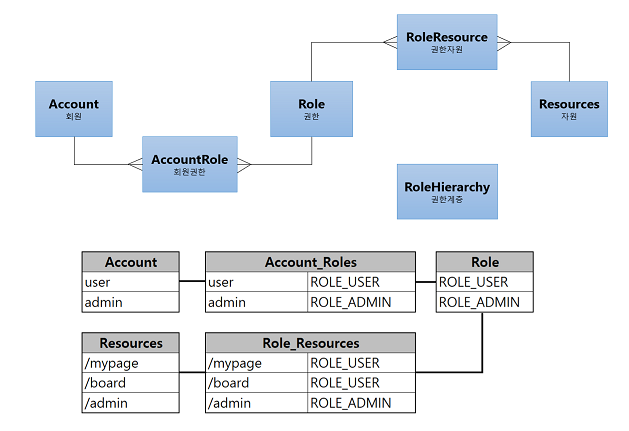

# 인가처리 DB 연동을 위한 아키텍처 이해

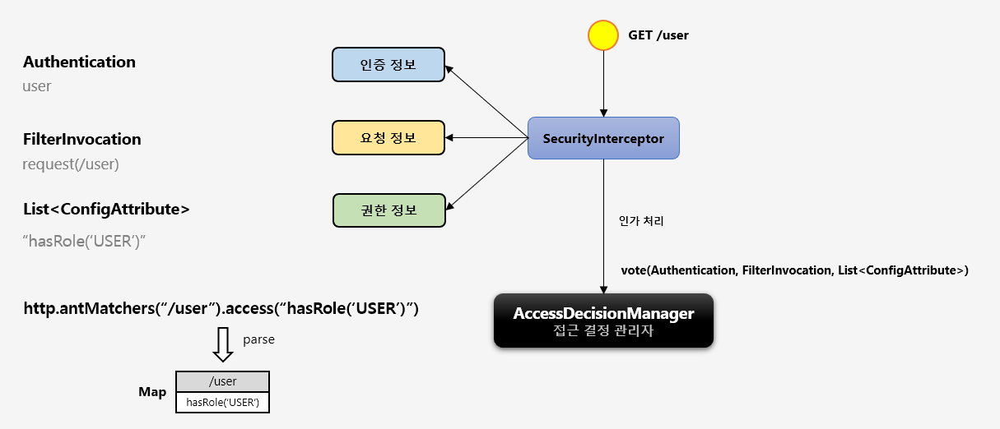

처음 애플리케이션이 시작될 때 스프링은 설정 정보(`SecurityConfig`) 를 읽어서 Map 형태로 url 과 권한정보를 저장합니다. 이후 요청이 들어오면 `SecurityInterceptor` 가 인증정보, 요청정보와 함께 해당 요청정보(url) 에 따른 권한정보를 리스트 형태로 `AccessDeicisionManager` 에게 넘깁니다.

따라서 처음 애플리케이션 시작 시 스프링이 해당 Map 을 어디에 저장되는지 먼저 알아야합니다. 해당정보는 `ExpressionBasedFilterInvocationSecurityMetadataSource` 클래스에서 `processMap()` 메서드가 생성합니다.

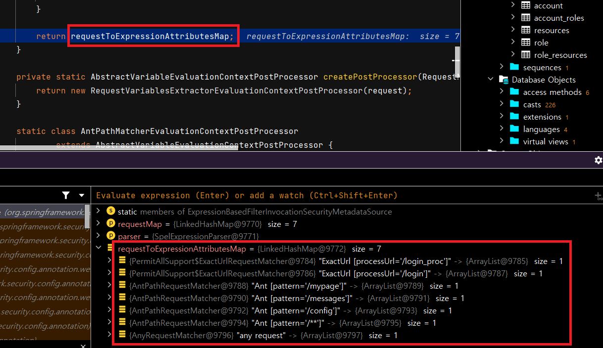

해당 메서드는 설정 정보를 읽어서 지역변수인 `requestToExpressionAttributesMap` 에 저장하고 리턴합니다. 그러면 부모클래스인 `DefaultFilterInvocationSecurityMetadataSource` 의 필드 `requestMap` 에 저장됩니다.

`DefaultFilterInvocationSecurityMetadataSource` 클래스에는 요청 Url 에 따른 권한 정보를 반환하는 `getAttributes()` 메서드가 있습니다.

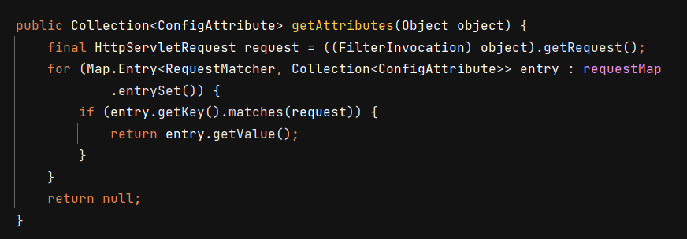

요청 시 `AccessDecisionManager` 를 호출하는 클래스는 `AbstrctSecurityInterceptor` 인데요. `beforeInvocation()` 메서드에서 먼저 다음과 같이 `getAttributes()` 로 `attributes` 를 추출합니다.

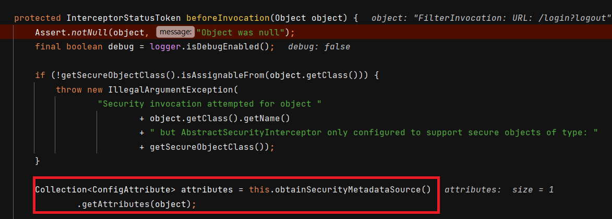

그리고 `Authentication` 을 찾아서 `AccessDecisionManager` 에게 넘겨줍니다. 이때 `object` 는 URL 정보입니다.

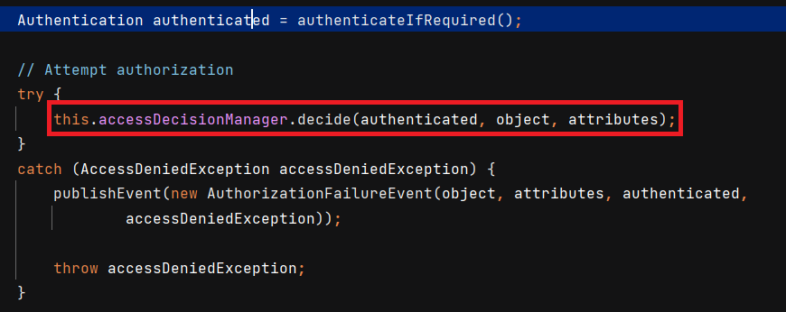

## SecurityMetadataSource 구성

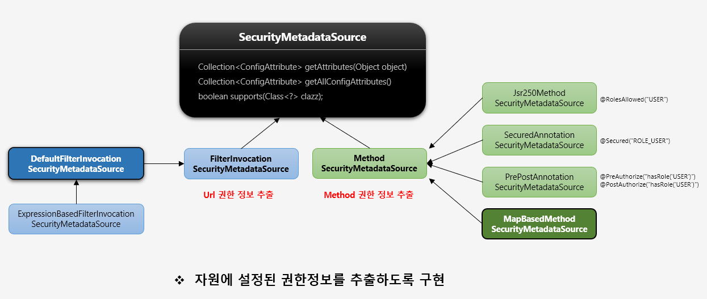

`SecurityMetadataSource` 는 `FilterInvocationSecurityMetadataSource` 와 `MethodSecurityMetadataSource` 를 이용해서 Url 권한 정보와 Method 권한 정보를 추출합니다. DB 와 연동하기 위해서는 해당 클래스들을 커스텀으로 구현해야 합니다.

# FilterInvocationSecurityMetadataSource

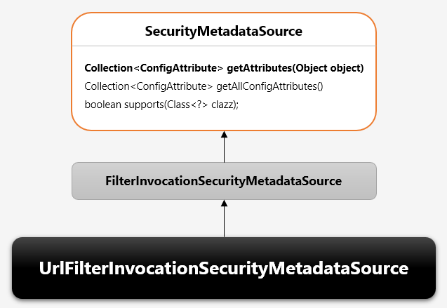

`FilterInvocationSecurityMetadataSource` 는 `SecurityMetadataSource` 인터페이스를 상속받는 인터페이스 입니다. 사용자가 접근하고자 하는 Url 자원에 대한 권한 정보를 추출합니다. 사용자의 매 요청마다 요청정보에 매핑된 권한 정보를 확인합니다. `UrlFilterInvocationSecurityMetadataSource` 는 이제부터 만들 커스텀 클래스입니다.

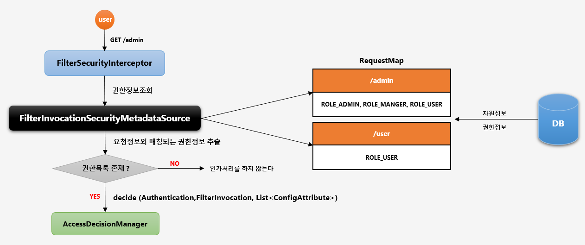

사용자가 `/admin` 으로 접근을 하면 `FilterSecurityInterceptor` 는 `FilterInvocationSecurityMetadataSource` 로 권한정보를 조회합니다. 해당 클래스는 `RequestMap` 필드를 가지고 있고, 해당 필드에는 key-value 값으로 url 과 권한목록이 있습니다. 따라서 **구현해야 할 코드는 DB 에서 RequestMap 을 조회하도록 하는 것**입니다.

아래는 `FilterInvocationSecurityMetadataSource` 의 흐름입니다.


## UrlFilterInvocationSecurityMetadataSource

원래 사용하는 `DefaultFilterInvocationSecurityMetadataSource` 코드를 일부 가져옵니다.

```java
public class UrlFilterInvocationSecurityMetadataSource implements FilterInvocationSecurityMetadataSource {

    private LinkedHashMap<RequestMatcher, List<ConfigAttribute>> requestMap = new LinkedHashMap<>();

    @Override
    public Collection<ConfigAttribute> getAttributes(Object object) throws IllegalArgumentException {

        HttpServletRequest request = ((FilterInvocation) object).getRequest();

        if(requestMap != null){
            for(Map.Entry<RequestMatcher, List<ConfigAttribute>> entry : requestMap.entrySet()){
                RequestMatcher matcher = entry.getKey();
                if(matcher.matches(request)){
                    return entry.getValue();
                }
            }
        }

        return null;
    }

    @Override
    public Collection<ConfigAttribute> getAllConfigAttributes() {
        Set<ConfigAttribute> allAttributes = new HashSet<>();

        for (Map.Entry<RequestMatcher, List<ConfigAttribute>> entry : requestMap
                .entrySet()) {
            allAttributes.addAll(entry.getValue());
        }

        return allAttributes;
    }

    @Override
    public boolean supports(Class<?> clazz) {
        return FilterInvocation.class.isAssignableFrom(clazz);
    }
}
```

`getAttributes()` 메서드 안에 DB 조회 로직을 넣으면 되겠죠. 그거는 나중에 하겠습니다.

## SecurityConfig

이제 `UrlFilterInvocationSecurityMetadataSource` 를 적용시킨 새로운 `SecurityInterceptor` 를 만들고 설정 정보에 등록해줍니다. 아래는 `SecurityConfig` 입니다.

```java
@Bean
public FilterSecurityInterceptor customFilterSecurityInterceptor() throws Exception {
    FilterSecurityInterceptor filterSecurityInterceptor = new FilterSecurityInterceptor();
    filterSecurityInterceptor.setSecurityMetadataSource(urlFilterInvocationSecurityMetadataSource());
    filterSecurityInterceptor.setAccessDecisionManager(affirmativeBased());
    filterSecurityInterceptor.setAuthenticationManager(authenticationManagerBean());
    return filterSecurityInterceptor;
}

private AccessDecisionManager affirmativeBased() {
    return new AffirmativeBased(getAccessDecisionVoters());
}

private List<AccessDecisionVoter<?>> getAccessDecisionVoters() {
    return Arrays.asList(new RoleVoter());
}

@Bean
public FilterInvocationSecurityMetadataSource urlFilterInvocationSecurityMetadataSource() {
    return new UrlFilterInvocationSecurityMetadataSource();
}
```

`FilterSecurityInterceptor` 는 3가지를 등록해줘야 하는데, 그중에서 `SecurityMetadataSource` 에 만든 `urlFilterInvocationSecurityMetadataSource` 를 등록해줍니다. 나머지는 원래 사용하던 거를 등록합니다.

```java
@Override
protected void configure(final HttpSecurity http) throws Exception {
    http
            .authorizeRequests()
            .antMatchers("/mypage").hasRole("USER")
            .antMatchers("/messages").hasRole("MANAGER")
            .antMatchers("/config").hasRole("ADMIN")
            .antMatchers("/**").permitAll()
            .anyRequest().authenticated()
            .and()
            .formLogin()
            .loginPage("/login")
            .loginProcessingUrl("/login_proc")
            .authenticationDetailsSource(formWebAuthenticationDetailsSource)
            .successHandler(formAuthenticationSuccessHandler)
            .failureHandler(formAuthenticationFailureHandler)
            .permitAll()
    .and()
            .exceptionHandling()
//                .authenticationEntryPoint(new AjaxLoginAuthenticationEntryPoint())
            .authenticationEntryPoint(new LoginUrlAuthenticationEntryPoint("/login"))
            .accessDeniedPage("/denied")
            .accessDeniedHandler(accessDeniedHandler())
    .and()
            .addFilterAt(customFilterSecurityInterceptor(), FilterSecurityInterceptor.class); //등록

    http.csrf().disable();

    customConfigurer(http);
}
```

그리고 ` .addFilterAt()` 으로 `FilterSecurityInterceptor` 클래스 대신에 `customFilterSecurityInterceptor()` 가 실행되도록 합니다.

만약 `FilterSecurityInterceptor` 가 2개 이상 등록된다고 하더라도 아래 로직처럼 `FilterSecurityInterceptor` 의 `invoke()` 메서드에서 필터가 한번 이상 적용되었는지 확인 후, 두번 검증을 하지 않습니다.

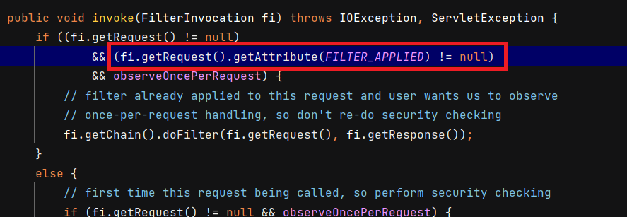

## DB 연동 (UrlResourcesMapFactoryBean)

`UrlResourcesMapFactoryBean` 클래스를 만들어서 DB 로부터 얻은 권한/자원 정보를 `ResurceMap` 을 빈으로 생성하고 `UrlFilterInvocationSecurityMetadataSource` 에 전달합니다.

```java
public class UrlResourcesMapFactoryBean implements FactoryBean<LinkedHashMap<RequestMatcher, List<ConfigAttribute>>> {

    private SecurityResourceService securityResourceService;

    public void setSecurityResourceService(SecurityResourceService securityResourceService) {
        this.securityResourceService = securityResourceService;
    }

    private LinkedHashMap<RequestMatcher, List<ConfigAttribute>> resourcesMap;

    public void init() {
            resourcesMap = securityResourceService.getResourceList();
    }

    @Override
    public LinkedHashMap<RequestMatcher, List<ConfigAttribute>> getObject() {
        if (resourcesMap == null) {
            init();
        }
        return resourcesMap;
    }

    @Override
	public Class<LinkedHashMap> getObjectType() {
        return LinkedHashMap.class;
    }

    @Override
    public boolean isSingleton() {
        return true;
    }
}
```

- `getObject()` : 팩토리빈에서 빈을 생성하는 메서드입니다. `resourcesMap` 이 없으면 `init()` 으로 DB 조회 후 반환합니다.
-  `getObjectType()` : 빈 타입입니다.
- `isSingleton()` : 싱글톤 여부입니다.

*해당 클래스에서는 DB 데이터가 변경되어도 반영되지 않습니다. 해당 부분은 따로 구현해야 합니다.*

## SecurityResourceService

`SecurityResourceService` 는 DB 로부터 권한과 리소스 정보를 조회하는 서비스 클래스입니다.

```java
@Slf4j
public class SecurityResourceService {

    private ResourcesRepository resourcesRepository;

    public SecurityResourceService(ResourcesRepository resourcesRepository) {
        this.resourcesRepository = resourcesRepository;
    }

    public LinkedHashMap<RequestMatcher, List<ConfigAttribute>> getResourceList() {

        LinkedHashMap<RequestMatcher, List<ConfigAttribute>> result = new LinkedHashMap<>();
        List<Resources> resourcesList = resourcesRepository.findAllResources();

        resourcesList.forEach(re ->
                {
                    List<ConfigAttribute> configAttributeList = new ArrayList<>();
                    re.getRoleSet().forEach(ro -> {
                        configAttributeList.add(new SecurityConfig(ro.getRoleName()));
                        result.put(new AntPathRequestMatcher(re.getResourceName()), configAttributeList);
                    });
                }
        );
        return result;
    }
}
```

해당 클래스는 `@Service` 로 등록하거나, 수동으로 빈으로 등록하면 됩니다.

## ResourcesRepository

```java
public interface ResourcesRepository extends JpaRepository<Resources, Long> {

    @Query("select r from Resources r join fetch r.roleSet where r.resourceType = 'url' order by r.orderNum desc")
    List<Resources> findAllResources();
}
```

JPQL 로 구현되었습니다. `order by r.orderNum desc` 로 지정된 순서로 들고 옵니다. 구체적인 url 이 먼저와야하기 때문에 순서가 중요합니다.

## SecurityConfig 수정

이전에 만들어두었던 `urlFilterInvocationSecurityMetadataSource()` 에 `urlResourcesMapFactoryBean().getObject()` 로 넘겨줍니다.

```java
@Bean
public FilterInvocationSecurityMetadataSource urlFilterInvocationSecurityMetadataSource() {
    return new UrlFilterInvocationSecurityMetadataSource(urlResourcesMapFactoryBean().getObject());
}

@Bean
public UrlResourcesMapFactoryBean urlResourcesMapFactoryBean(){
    UrlResourcesMapFactoryBean urlResourcesMapFactoryBean = new UrlResourcesMapFactoryBean();
    urlResourcesMapFactoryBean.setSecurityResourceService(securityResourceService);
    return urlResourcesMapFactoryBean;
}
```

이때 `requestMap` 을 DI 받기 위해서 아래와 같이 `UrlFilterInvocationSecurityMetadataSource` 에 생성자를 만들어줘야 합니다.

```java
@Slf4j
public class UrlFilterInvocationSecurityMetadataSource implements FilterInvocationSecurityMetadataSource {

    private LinkedHashMap<RequestMatcher, List<ConfigAttribute>> requestMap;

    public UrlFilterInvocationSecurityMetadataSource(LinkedHashMap<RequestMatcher, List<ConfigAttribute>> requestMap) {
        this.requestMap = requestMap;
    }
    
    ...
}
```

# 웹 기반 인가처리 실시간 반영하기

`UrlSecurityMetadataSource` (이전의 `UrlFilterInvocationSecurityMetadataSource`) 에서 `reload()` 메서드를 구현합니다. 해당 메서드를 호출하게 되면 `requestMap` 필드를 삭제하고 DB 에서 받은 정보로 새롭게 구성합니다.

```java
public void reload() throws Exception {

    LinkedHashMap<RequestMatcher, List<ConfigAttribute>> reloadedMap = securityResourceService.getResourceList();
    Iterator<Map.Entry<RequestMatcher, List<ConfigAttribute>>> iterator = reloadedMap.entrySet().iterator();
    requestMap.clear();

    while (iterator.hasNext()) {
        Map.Entry<RequestMatcher, List<ConfigAttribute>> entry = iterator.next();

        requestMap.put(entry.getKey(), entry.getValue());
    }
}
```

그리고 `ResourcesController` 에서 리소스를 등록하거나 삭제할 때마다 reload 하도록 구성합니다.

아래는 `ResourcesController` 입니다.

```java
@PostMapping(value="/admin/resources")
public String createResources(ResourcesDto resourcesDto) throws Exception {

    ModelMapper modelMapper = new ModelMapper();
    Role role = roleRepository.findByRoleName(resourcesDto.getRoleName());
    Set<Role> roles = new HashSet<>();
    roles.add(role);
    Resources resources = modelMapper.map(resourcesDto, Resources.class);
    resources.setRoleSet(roles);

    resourcesService.createResources(resources);
    urlSecurityMetadataSource.reload();

    return "redirect:/admin/resources";
}

@GetMapping(value="/admin/resources/delete/{id}")
public String removeResources(@PathVariable String id, Model model) throws Exception {

    Resources resources = resourcesService.getResources(Long.valueOf(id));
    resourcesService.deleteResources(Long.valueOf(id));
    urlSecurityMetadataSource.reload();

    return "redirect:/admin/resources";
}
```

# 인가처리 허용 필터 - PermitAllFilter 구현

PermitAllFilter 는 PermitAll 이 되는 url 자원에 한해 인가처리 심사 없이 바로 접근할 수 있도록 구현된 클래스입니다.

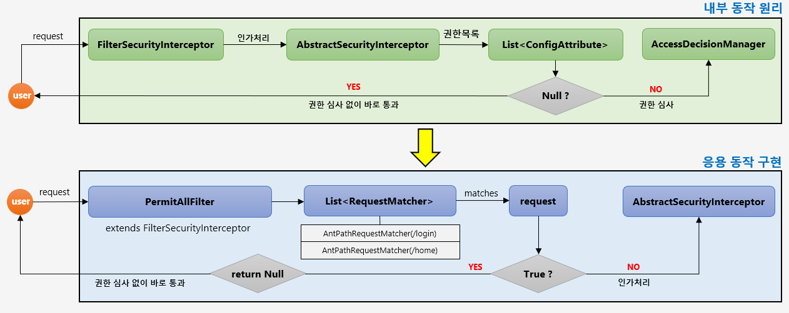

원래는 위 흐름처럼 `AbstractSecurityInterceptor` 가 권한목록을 가지고 권한심사 여부를 판단했다면, `PermitAllFilter` 를 만들어서 해당 필터가 가진 `PermitAll List` 에 리소스 자원이 매칭된다면 `AbstractSecurityInterceptor` 를 거치지 않고 바로 통과하도록 합니다.

## PermitAllFilter

```java
public class PermitAllFilter extends FilterSecurityInterceptor {
    private static final String FILTER_APPLIED = "__spring_security_filterSecurityInterceptor_filterApplied";
    private List<RequestMatcher> permitAllRequestMatcher = new ArrayList<>();
    
    public PermitAllFilter(String... permitAllPattern) {
        createPermitAllPattern(permitAllPattern);
    }

    @Override
    protected InterceptorStatusToken beforeInvocation(Object object) {
        boolean permitAll = false;
        HttpServletRequest request = ((FilterInvocation) object).getRequest();
        for (RequestMatcher requestMatcher : permitAllRequestMatcher) {
            if (requestMatcher.matches(request)) {
                permitAll = true;
                break;
            }
        }
        if (permitAll) return null;
        return super.beforeInvocation(object);
    }

    @Override
    public void invoke(FilterInvocation fi) throws IOException, ServletException {
            InterceptorStatusToken token = beforeInvocation(fi);
    }
    private void createPermitAllPattern(String... permitAllPattern) {
        for (String pattern : permitAllPattern) {
            permitAllRequestMatcher.add(new AntPathRequestMatcher(pattern));
        }
    }
}
```

`PermitAllFilter` 클래스는 `FilterSecurityInterceptor` 기능을 이용하기 위해 먼저 해당 클래스를 상속합니다. 그리고 생성자를 통해 외부에서 `permitAllRequestMatcher` 를 받습니다. 

`beforeInvocation()` 메서드에서 `permitAllRequestMatcher` 와 해당 요청이 일치하면 null 을 리턴해서 검증 작업을 하지 않도록 하고, 그게 아니면 `FilterSecurityInterceptor` 의 `beforeInvocation()` 메서드를 다시 호출합니다.

## SecurityConfig

```java
@Override
protected void configure(final HttpSecurity http) throws Exception {
    http
            .authorizeRequests()
            .anyRequest().authenticated()
            .and()
            .formLogin()
            .loginPage("/login")
            .loginProcessingUrl("/login_proc")
            .authenticationDetailsSource(formWebAuthenticationDetailsSource)
            .successHandler(formAuthenticationSuccessHandler)
            .failureHandler(formAuthenticationFailureHandler)
            .permitAll()
    .and()
            .exceptionHandling()
            .authenticationEntryPoint(new LoginUrlAuthenticationEntryPoint("/login"))
            .accessDeniedPage("/denied")
            .accessDeniedHandler(accessDeniedHandler())
    .and()
            .addFilterAt(permitAllFilter, FilterSecurityInterceptor.class); //필터 등록

    http.csrf().disable();

    customConfigurer(http);
}
@Bean
public PermitAllFilter permitAllFilter() throws Exception {
    PermitAllFilter permitAllFilter = new PermitAllFilter(permitAllResources);
    permitAllFilter.setSecurityMetadataSource(urlFilterInvocationSecurityMetadataSource());
    permitAllFilter.setAccessDecisionManager(affirmativeBased());
    permitAllFilter.setAuthenticationManager(authenticationManagerBean());
    return permitAllFilter;
}
```

`PermitAllFilter` 를 만들고 필요한 정보를 추가합니다. 그리고 `.addFilterAt()` 메서드로 필터를 추가합니다.

# 계층 권한 적용하기 - RoleHierarchy

권한 관계 설정 시 계층적인 관계로 처리할 수 있도록 하는 클래스가 `RoleHierarchy` 클래스입니다.

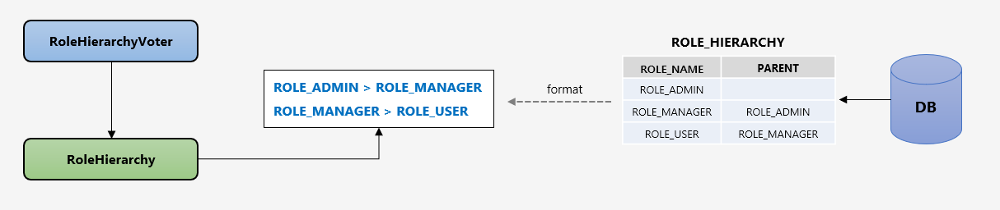

위 그림과 같이 DB 에 ROLE 마다 상위 권한을 지정합니다. `RoleHierarchyVoter` 는 •RoleHierarchy 를 생성자로 받으며 이 클래스에서 설정한 규칙이 적용되어 심사합니다.

## RoleHierarchyServiceImpl

해당 클래스를 통해 스프링의 `RoleHierarchyImpl` 클래스에 "권한 > 권한" 형태로 `String` 값을 넘겨주도록 합니다.

```java
@Service
public class RoleHierarchyServiceImpl implements RoleHierarchyService {

    @Autowired
    private RoleHierarchyRepository roleHierarchyRepository;

    @Transactional
    @Override
    public String findAllHierarchy() {

        List<RoleHierarchy> rolesHierarchy = roleHierarchyRepository.findAll();

        Iterator<RoleHierarchy> itr = rolesHierarchy.iterator();
        StringBuffer concatedRoles = new StringBuffer();
        while (itr.hasNext()) {
            RoleHierarchy model = itr.next();
            if (model.getParentName() != null) {
                concatedRoles.append(model.getParentName().getChildName());
                concatedRoles.append(" > ");
                concatedRoles.append(model.getChildName());
                concatedRoles.append("\n");
            }
        }
        return concatedRoles.toString();

    }
}
```

`findAllHierarchy()` 메서드를 실행하면 `RoleHierarchyRepository` 를 모두 찾아서 "권한 > 권한" 포멧으로 `concatedRoles` 스트링 버퍼를 만듭니다.

## SecurityInitializer

최초 초기화 클래스입니다.

```java
@Component
@Slf4j
public class SecurityInitializer implements ApplicationRunner {

    @Autowired
    private RoleHierarchyService roleHierarchyService;

    @Autowired
    private RoleHierarchyImpl roleHierarchy;

    @Override
    @Transactional
    public void run(ApplicationArguments args) {

        String allHierarchy = roleHierarchyService.findAllHierarchy();
        roleHierarchy.setHierarchy(allHierarchy);
    }
}
```

`RoleHierarchyService` 에서 포메팅된 `allHierarchy` 를 `RoleHierarchyImpl` 에 넣습니다.

## SecurityConfig

```java
private AccessDecisionManager affirmativeBased() {
    return new AffirmativeBased(getAccessDecisionVoters());
}

private List<AccessDecisionVoter<?>> getAccessDecisionVoters() {

    List<AccessDecisionVoter<? extends Object>> accessDecisionVoters = new ArrayList<>();
    accessDecisionVoters.add(roleVoter());
    return accessDecisionVoters;
}

@Bean
public AccessDecisionVoter<? extends Object> roleVoter() {
    return new RoleHierarchyVoter(roleHierarchy());
}

@Bean
public RoleHierarchyImpl roleHierarchy() {

    RoleHierarchyImpl roleHierarchy = new RoleHierarchyImpl();
    return roleHierarchy;

}
```

`AccessDecisionManager` 은 `AffirmativeBased` 로 사용하는데, `DecisionVoter` 로 `RoleHierarchyVoter` 를 줍니다. 해당 Voter 는 `RoleHierarchyImpl` 입니다. 빈 등록 이후 위에서 작성한 초기화 클래스를 통해 계층 구조가 들어가는 겁니다.

# 아이피 접속 제한하기 - CustomIpAddressVoter

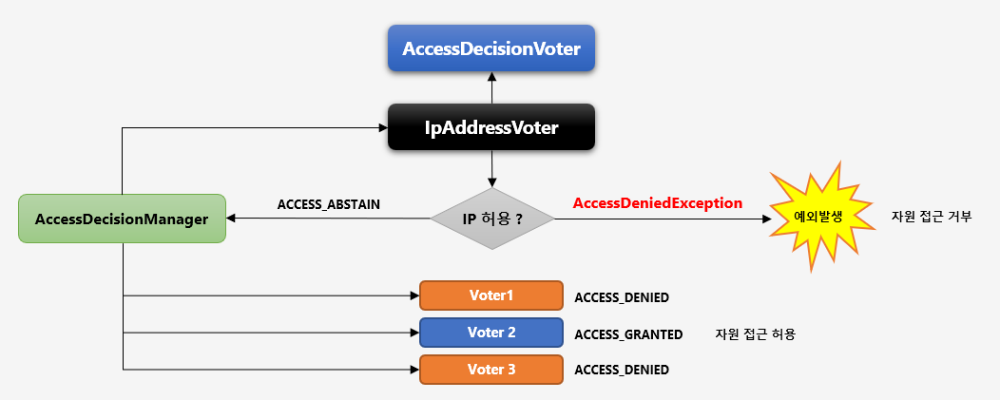

특정한 IP 만 접근이 가능하도록 심의하는 `Voter` 를 추가합니다. `Voter` 중에서 가장 먼저 심사하도록 하여 허용된 IP 일 경우에만 최종 승인 및 거부 결정을 하도록 합니다. 

​	허용된 IP 이면 ACCESS_GRANTED 가 아닌 ACCESS_ABSTAIN 을 리턴해서 추가 심의를 계속 진행하도록 합니다. 만약 ACCESS_GRANTED 를 리턴하면 다른 Voter 들의 허용 여부와 관계없이 허용된 IP 라는 이유만으로 인가가 되기 때문입니다. (`AffirmativeBased` 클래스일 경우)

​	허용된 IP 가 아니면 ACCESS_DENIED 를 리턴하지 않고 즉시 예외 발생하여 최종 자원으로 접근을 거부합니다.

## AccessIp

허용 IP 를 저장하는 엔티티입니다.

```java
@Entity
@Table(name = "ACCESS_IP")
@Data
@EqualsAndHashCode(of = "id")
@NoArgsConstructor
@AllArgsConstructor
@Builder
public class AccessIp implements Serializable {

    @Id
    @GeneratedValue
    @Column(name = "IP_ID", unique = true, nullable = false)
    private Long id;

    @Column(name = "IP_ADDRESS", nullable = false)
    private String ipAddress;

}

```

## IpAddressVoter

`Voter` 클래스입니다.

```java
public class IpAddressVoter implements AccessDecisionVoter<Object> {

    private SecurityResourceService securityResourceService;

    public IpAddressVoter(SecurityResourceService securityResourceService) {
        this.securityResourceService = securityResourceService;
    }

    @Override
    public boolean supports(ConfigAttribute attribute) {
        return (attribute.getAttribute() != null);
    }

    @Override
    public boolean supports(Class<?> clazz) {
        return true;
    }

    @Override
    public int vote(Authentication authentication, Object object, Collection<ConfigAttribute> configList) {

        if (!(authentication.getDetails() instanceof WebAuthenticationDetails)) {
            return ACCESS_DENIED;
        }

        WebAuthenticationDetails details = (WebAuthenticationDetails) authentication.getDetails();
        String address = details.getRemoteAddress();
        List<String> accessIpList = securityResourceService.getAccessIpList();

        int result = ACCESS_DENIED;

        for (String ipAddress : accessIpList) {

            if (address.equals(ipAddress)) {
                return ACCESS_GRANTED;
            }
        }

        if(result == ACCESS_DENIED){
            throw new AccessDeniedException("Invalid ipAddress can not accessed");
        }

        return result;
    }
}
```

`vote()` 메서드가 실제 인가를 처리하는 로직입니다. `securityResourceService.getAccessIpList()` 를 통해 IpList 를 조회하고 `details.getRemoteAddress()` 와 비교해서 있으면 `ACCESS_GRANTED(0)` 을 반환하고, `ACCESS_DENIED` 이면 `AccessDeniedException` 예외를 던집니다.

## SecurityResourceService

`SecurityResourceService` 클래스는 다음 로직을 추가시킵니다.

```java
public List<String> getAccessIpList() {

    return accessIpRepository.findAll().stream()
            .map(AccessIp::getIpAddress).collect(Collectors.toList());
}
```

## SecurityConfig

```java
@Bean
public AccessDecisionManager affirmativeBased() {
    AffirmativeBased accessDecisionManager = new AffirmativeBased(getAccessDecisionVoters());
    return accessDecisionManager;
}

private List<AccessDecisionVoter<?>> getAccessDecisionVoters() {

    IpAddressVoter ipAddressVoter = new IpAddressVoter(securityResourceService);
    List<AccessDecisionVoter<? extends Object>> accessDecisionVoterList = Arrays.asList(ipAddressVoter, roleVoter());
    return accessDecisionVoterList;
}
```

`AccessDecisionManager` 에 `Voter` 를 추가할 때 `ipAddressVoter` 도 추가해줍니다. **이때 `ipAddressVoter` 는 제일 처음와야 합니다.**
