# 개요

​	Method 방식은 서비스 계층의 인가처리 방식으로 화면, 메뉴 단위가 아닌 기능 단위로 인가처리를 합니다. 해당 방식은 메서드 처리 전.후로 보안 검사 수행하여 인가처리를 합니다. AOP 기반으로 동작하며 프록시와 어드바이스로 메서드 인가처리를 수행합니다.

​	보안설정 방식은 어노테이션 권한 설정 방식과 맵 기반 권한 설정 방식이 있습니다. 어노테이션은 `@PreAuthorize(“hasRole(‘USER’)”), @PostAuthorize(“hasRole(‘USER’)”), @Secured(“ROLE_USER”) ` 과 같이 사용할 수 있으며 맵 기반은 외부와 연동하여 메서드 보안 설정을 구현하는 것입니다.

# 어노테이션 권한 설정

`@PreAuthorize`, `@PostAUthorize` 

- SpEL 을 지원하며 `PrePostAnnotationSecurityMetadataSource` 가 담당합니다.
- `@PreAuthorize("hasRole('ROLE_USER’) and (#account.username == principal.username)")`

`@Secured`, `@RolesAllowed`

- SpEL 을 지원하지 않으며 `SecuredAnnotationSecurityMetadataSource`, `Jsr250MethodSecurityMetadataSource` 가 담당합니다.
- `@Secured ("ROLE_USER")`, `@RolesAllowed("ROLE_USER")` 와 같이 사용합니다.

`@EnableGlobalMethodSecurity`

- 해당 어노테이션이 있어야 권한 설정이 가능합니다. 클래스별로 설정할 수도 있고 `Config` 에서 설정할 수도 있습니다.

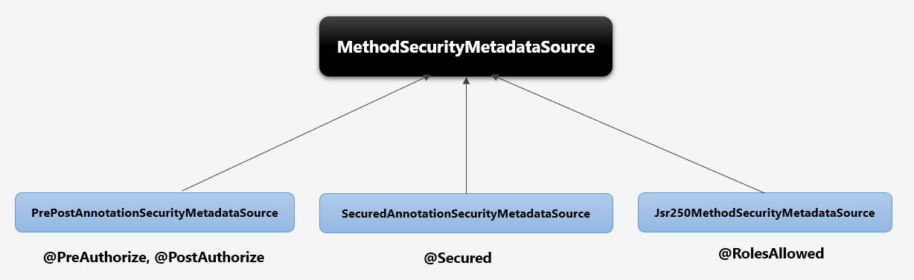

위 그림같이 각각의 클래스가 `MethodSecurityMetatdataSource` 를 구현하고 있으며, 각각의 어노테이션을 담당합니다.

## 코드 레벨

```java
@Controller
@EnableGlobalMethodSecurity(prePostEnabled = true, securedEnabled = true)
public class AopSecurityController {

    @GetMapping("/preAuthorize")
    @PreAuthorize("hasRole('ROLE_USER') and #account.username == principal.username")
    public String preAuthorize(AccountDto account, Model model, Principal principal) {

        model.addAttribute("method", "Success @PreAuthorize");

        return "aop/method";
    }
}
```

`/preAuthorize` 로 리소스를 요청하면 `@PreAuthorize`  에 따라 권한 정보를 체크합니다. 이때 `@EnableGlobalMethodSecurity` 을 선언하고 `prePostEnabled = true, securedEnabled = true` 속성을 줘야 합니다.

해당 속성은 `GlobalMethodSecurityConfiguration` 의 `methodSecurityMetadataSource()` 에서 체크하는데요.

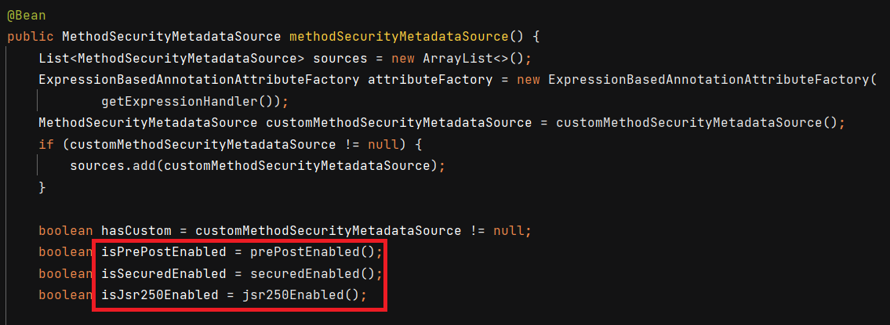

각각의 값은 `boolean` 입니다. 해당 `boolean` 을 리턴하는 메서드들은 `@EnableGlobalMethodSecurity` 가 있는 빈에서 해당 속성값을 읽어들이는 메서드입니다.

초기화 시 Map 에 저장하는 메서드는 `DelegatingMethodSecurityMetadataSource` 의 `getAttributes()` 입니다. `Map<DefaultCacheKey, Collection<ConfigAttribute>> attributeCache` 을 선언하고 그 안에 `cacheKey` 와 `attributes` 를 넣습니다. `cacheKey` 는 타겟 클래스와 메서드이고, `attributes` 는 필요한 권한 정보입니다.

 # Method 방식의 주요 아키텍처

​	아래는 Method 방식의 예시입니다.

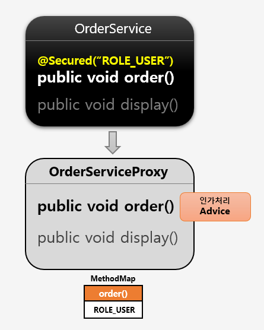

 	스프링 빈 초기화 시 빈 후처리기에 의해 보안이 설정된 메서드가 있으면 프록시 객체로 생성됩니다. 그리고 인가처리 기능을 하는 `Advice` 를 등록합니다.

​	메서드가 호출되면 프록시 객체를 통해 호출되며 Advice 가 등록되어 있다면 Advice 를 작동하게 하여 인가 처리를 진행합니다. 권한 심사를 통과하면 실제 빈의 메서드를 호출합니다.

## 인가 처리를 위한 초기화 과정

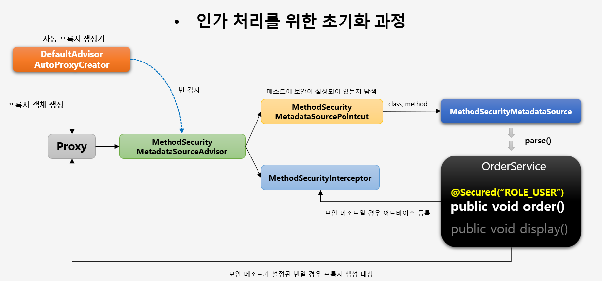

프록시 생성 과정은 위 흐름과 같습니다. 자동 프록시 생성기인 `DefaultAdvisorAutoProxyCreator` 는 `MethodSecurityMetadataSourceAdvisor` 로 빈 검사를 하는데, 해당 `MethodSecurityMetadataSourceAdvisor` 는 `MethodSecurityMetadataSourcePointcut` 을 가지고 있습니다. 해당 포인트컷인 `MethodSecurityMetadataSource` 를 통해 모든 클래스를 탐색하며 메서드 보안 설정이 있는지 보고, 있다면 어드바이스로 등록합니다. 그리고 보안 메서드가 설정된 빈이면 프록시로 생성합니다.

## 인가 처리를 위한 호출 과정

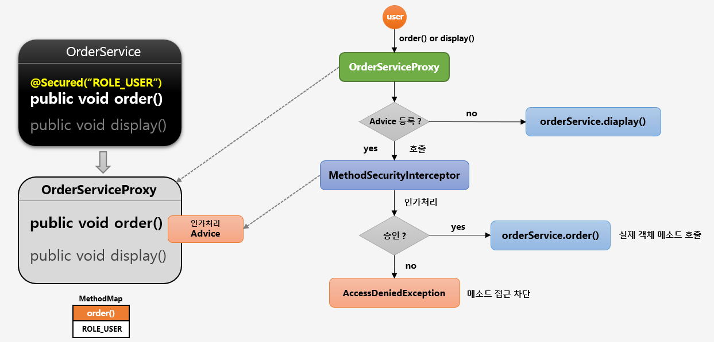

​	위 그림은 user 가 `OrderService` 에서 메서드 보안 설정이 된 `order()` 메서드와 보안 설정이 없는 `display()` 메서드를 호출하는 과정입니다.

​	먼저 `order()` 를 호출하면 `Advice` 에 등록되어 있기 때문에 `MethodSecurityInterceptor` 를 호출해서 인가처리를 합니다. 인가 처리가 통과되면 실제 객체의 `order()` 을 호출해줍니다.

​	반면 `display()` 를 호출하면 `Advice` 에 없기 때문에 바로 실제 객체의 `display()` 를 호출합니다.

# AOP Method 기반 DB 연동

​	클래스를 구현하기 전에 먼저 URL 방식과 Method 방식의 차이를 보겠습니다.

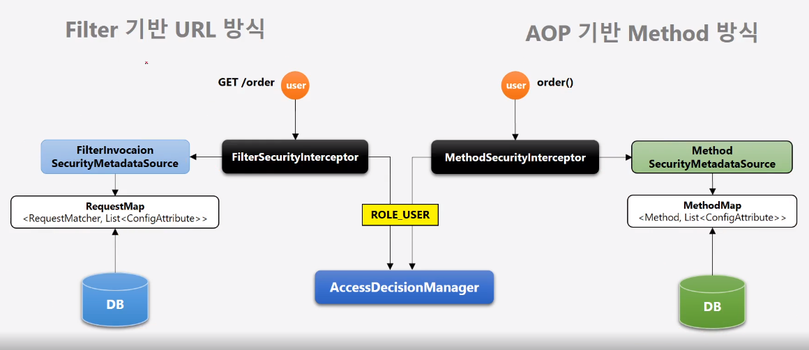

Filter 기반 URL 방식은 `FIlterSecurityInterceptor` 에서 `FilterInvocationSecurityMetadataSource` 를 통해 url 리소스 권한을 확인하고 인가 처리를 합니다. AOP 기반 Method 방식도 처리하는 클래스만 다를 뿐 흐름은 동일합니다.

## MapBasedMethodSecurityMetadataSource

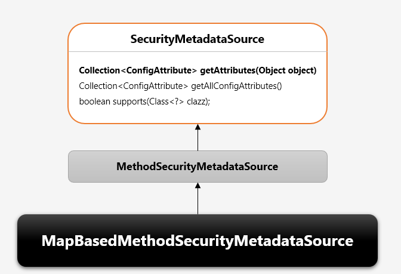

어노테이션 설정 방식이 아닌 맵 기반으로 권한을 설정합니다. 기본적인 구현이 완성되어 있고 DB 로부터 자원과 권한정보를 매핑한 데이터를 전달하면 메소드 방식의 인가처리가 이루어지는 클래스입니다.

흐름은 다음 그림과 같습니다.

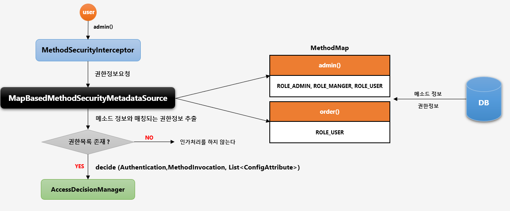

user 가 `admin()` 메서드에 접근하면 `MethodSecurityInterceptor` 가 작동하여 `MapBasedMEthodSecurityMetadataSource` 에 권한정보를 요청합니다. 그래서 메서드 정보와 매칭되는 권한정보가 있다면 인가 처리를 진행하고, 없다면 바로 승인합니다.

## MethodSecurityConfig

```java
@Configuration
@EnableGlobalMethodSecurity(prePostEnabled = true)
public class MethodSecurityConfig extends GlobalMethodSecurityConfiguration {

    @Override
    protected MethodSecurityMetadataSource customMethodSecurityMetadataSource() {
        return new MapBasedMethodSecurityMetadataSource();
    }
}
```

`MethodSecurityConfig` 는 대부분 기능이 구현되어있는 `GlobalMethodSecurityConfiguration` 를 상속하여 사용합니다. 그중에 `customMethodSecurityMetadataSource()` 메서드가 있는데 커스텀으로 만든 `MapBasedMethodSecurityMetadataSource` 를 반환하게 하면 됩니다.

## MethodResourcesMapFactoryBean

DB로부터 얻은 권한/자원 정보 `ResourceMap` 을 빈으로 생성해서 `MapBasedMethodSecurityMetadataSource` 에 전달하는 역할입니다.


```java
@Slf4j
public class MethodResourcesMapFactoryBean implements FactoryBean<LinkedHashMap<String, List<ConfigAttribute>>> {

    private SecurityResourceService securityResourceService;
    private String resourceType;

    public void setResourceType(String resourceType) {
        this.resourceType = resourceType;
    }

    public void setSecurityResourceService(SecurityResourceService securityResourceService) {
        this.securityResourceService = securityResourceService;
    }

    private LinkedHashMap<String, List<ConfigAttribute>> resourcesMap;

    public void init() {
        if ("method".equals(resourceType)) {
            resourcesMap = securityResourceService.getMethodResourceList();
        }else if("pointcut".equals(resourceType)){
            resourcesMap = securityResourceService.getPointcutResourceList();
        }
    }

    public LinkedHashMap<String, List<ConfigAttribute>> getObject() {
        if (resourcesMap == null) {
            init();
        }
        return resourcesMap;
    }

    @SuppressWarnings("rawtypes")
    public Class<LinkedHashMap> getObjectType() {
        return LinkedHashMap.class;
    }

    public boolean isSingleton() {
        return true;
    }
}

```

## SecurityResourceService

`SecurityResourceService` 에서 `getMethodResourceList()`, `getPointcutResourceList()` 메서드를 만들어줍니다. DB 자원을 접근하는 기능입니다.

```java
@Service
public class SecurityResourceService {

    private ResourcesRepository resourcesRepository;
    private AccessIpRepository accessIpRepository;

    public SecurityResourceService(ResourcesRepository resourcesRepository, AccessIpRepository accessIpRepository) {
        this.resourcesRepository = resourcesRepository;
        this.accessIpRepository = accessIpRepository;
    }

	...

    public LinkedHashMap<String, List<ConfigAttribute>> getMethodResourceList() {

        LinkedHashMap<String, List<ConfigAttribute>> result = new LinkedHashMap<>();
        List<Resources> resourcesList = resourcesRepository.findAllMethodResources();
        resourcesList.forEach(re ->
                {
                    List<ConfigAttribute> configAttributeList = new ArrayList<>();
                    re.getRoleSet().forEach(ro -> {
                        configAttributeList.add(new SecurityConfig(ro.getRoleName()));
                    });
                    result.put(re.getResourceName(), configAttributeList);
                }
        );
        return result;
    }

    public LinkedHashMap<String, List<ConfigAttribute>> getPointcutResourceList() {

        LinkedHashMap<String, List<ConfigAttribute>> result = new LinkedHashMap<>();
        List<Resources> resourcesList = resourcesRepository.findAllPointcutResources();
        resourcesList.forEach(re ->
                {
                    List<ConfigAttribute> configAttributeList = new ArrayList<>();
                    re.getRoleSet().forEach(ro -> {
                        configAttributeList.add(new SecurityConfig(ro.getRoleName()));
                    });
                    result.put(re.getResourceName(), configAttributeList);
                }
        );
        return result;
    }
}

```

## MethodSecurityConfig

```java
@Configuration
@EnableGlobalMethodSecurity(prePostEnabled = true)
public class MethodSecurityConfig extends GlobalMethodSecurityConfiguration {

    @Autowired
    private SecurityResourceService securityResourceService;

    @Override
    protected MethodSecurityMetadataSource customMethodSecurityMetadataSource() {
        return mapBasedMethodSecurityMetadataSource();
    }

    @Bean
    public MapBasedMethodSecurityMetadataSource mapBasedMethodSecurityMetadataSource() {
        return new MapBasedMethodSecurityMetadataSource(methodResourcesMapFactoryBean().getObject());
    }

    @Bean
    public MethodResourcesMapFactoryBean methodResourcesMapFactoryBean(){
        MethodResourcesMapFactoryBean methodResourcesMapFactoryBean = new MethodResourcesMapFactoryBean();
        methodResourcesMapFactoryBean.setSecurityResourceService(securityResourceService);
        methodResourcesMapFactoryBean.setResourceType("method");
        return methodResourcesMapFactoryBean;
    }
    
    @Bean
    public CustomMethodSecurityInterceptor customMethodSecurityInterceptor(MapBasedMethodSecurityMetadataSource methodSecurityMetadataSource) {
        CustomMethodSecurityInterceptor customMethodSecurityInterceptor =  new CustomMethodSecurityInterceptor();
        customMethodSecurityInterceptor.setAccessDecisionManager(accessDecisionManager());
        customMethodSecurityInterceptor.setAfterInvocationManager(afterInvocationManager());
        customMethodSecurityInterceptor.setSecurityMetadataSource(methodSecurityMetadataSource);
        RunAsManager runAsManager = runAsManager();
        if (runAsManager != null) {
            customMethodSecurityInterceptor.setRunAsManager(runAsManager);
        }

        return customMethodSecurityInterceptor;
    }
```

`customMethodSecurityMetadataSource` 반환값은 `MapBasedMethodSecurityMetadataSource` 을 빈으로 등록해서 반환합니다. 

## Service 와 Controller

테스트를 위한 서비스와 컨트롤러입니다.

```java
@Service
public class AopMethodService {

    public void methodSecured() {

        System.out.println("methodSecured");
    }
}
```

```java
@Controller
public class AopSecurityController {

    @Autowired
    private AopMethodService aopMethodService;

    @Autowired
    private AopPointcutService aopPointcutService;

    @Autowired
    private AopLiveMethodService aopLiveMethodService ;

    @GetMapping("/preAuthorize")
    //@PreAuthorize("hasRole('ROLE_USER') and #account.username == principal.username")
    public String preAuthorize(AccountDto account, Model model, Principal principal){

        model.addAttribute("method", "Success @PreAuthorize");

        return "aop/method";

    }

    @GetMapping("/methodSecured")
    public String methodSecured(Model model){

        aopMethodService.methodSecured();
        model.addAttribute("method", "Success MethodSecured");

        return "aop/method";
    }
}
```

## 리소스 등록

`AopMethodService` 의 `methodSecured()` 에 접근 권한을 제어하려면 DB 에 다음과 같이 넣습니다.

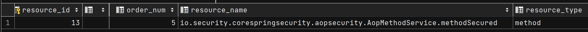

초기화 시 `MapBasedMethodSecurityMetadataSource` 는 해당 값을 파싱해서 `methodMap` 필드에 맵으로 저장합니다.

# AOP ProtectPointcutPostProcessor

`ProtectPointcutPostProcessor` 은 메서드 방식의 인가처리를 위한 자원 및 권한정보 설정 시 자원에 포인트 컷 표현식을 사용할 수 있도록 지원하는 클래스입니다. 빈후처리기로서 스프링 초기화 과정에서 빈들을 검사하여 포인트 컷 표현식과 매칭되는 클래스, 메서드, 권한정보를 `MapBasedMethodSecurityMetadataSource` 에 전달합니다.

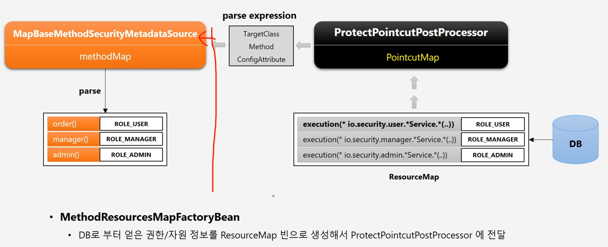

DB 에 저장되어있는 값을 읽어서 `ProtectPointcutPostProcessor` 로 넘겨주면 해당 클래스는 값을 파싱해서 `MapBasedMethodSecurityMetadataSource` 로 넘겨줍니다.

## Config 설정

`Method` 까지 포함한 최종적인 모습입니다.

```java
@Configuration
@EnableGlobalMethodSecurity(prePostEnabled = true)
public class MethodSecurityConfig extends GlobalMethodSecurityConfiguration {

    @Autowired
    private SecurityResourceService securityResourceService;

    @Override
    protected MethodSecurityMetadataSource customMethodSecurityMetadataSource() {
        return mapBasedMethodSecurityMetadataSource();
    }

    @Bean
    public MapBasedMethodSecurityMetadataSource mapBasedMethodSecurityMetadataSource() {
        return new MapBasedMethodSecurityMetadataSource(methodResourcesMapFactoryBean().getObject());
    }

    @Bean
    public MethodResourcesMapFactoryBean methodResourcesMapFactoryBean(){
        MethodResourcesMapFactoryBean methodResourcesMapFactoryBean = new MethodResourcesMapFactoryBean();
        methodResourcesMapFactoryBean.setSecurityResourceService(securityResourceService);
        methodResourcesMapFactoryBean.setResourceType("method");
        return methodResourcesMapFactoryBean;
    }

    @Bean
    @Profile("pointcut")
    public MethodResourcesMapFactoryBean pointcutResourcesMapFactoryBean(){
        MethodResourcesMapFactoryBean methodResourcesMapFactoryBean = new MethodResourcesMapFactoryBean();
        methodResourcesMapFactoryBean.setSecurityResourceService(securityResourceService);
        methodResourcesMapFactoryBean.setResourceType("pointcut");
        return methodResourcesMapFactoryBean;
    }

    @Bean
    @Profile("pointcut")
    public ProtectPointcutPostProcessor protectPointcutPostProcessor(){
        ProtectPointcutPostProcessor protectPointcutPostProcessor = new ProtectPointcutPostProcessor(mapBasedMethodSecurityMetadataSource());
        protectPointcutPostProcessor.setPointcutMap(pointcutResourcesMapFactoryBean().getObject());
        return protectPointcutPostProcessor;
    }

    @Bean
    public CustomMethodSecurityInterceptor customMethodSecurityInterceptor(MapBasedMethodSecurityMetadataSource methodSecurityMetadataSource) {
        CustomMethodSecurityInterceptor customMethodSecurityInterceptor =  new CustomMethodSecurityInterceptor();
        customMethodSecurityInterceptor.setAccessDecisionManager(accessDecisionManager());
        customMethodSecurityInterceptor.setAfterInvocationManager(afterInvocationManager());
        customMethodSecurityInterceptor.setSecurityMetadataSource(methodSecurityMetadataSource);
        RunAsManager runAsManager = runAsManager();
        if (runAsManager != null) {
            customMethodSecurityInterceptor.setRunAsManager(runAsManager);
        }

        return customMethodSecurityInterceptor;
    }

    @Bean
    public AccessDecisionVoter<? extends Object> roleVoter() {

        RoleHierarchyVoter roleHierarchyVoter = new RoleHierarchyVoter(roleHierarchy());
        return roleHierarchyVoter;
    }

    @Bean
    public RoleHierarchyImpl roleHierarchy() {
        RoleHierarchyImpl roleHierarchy = new RoleHierarchyImpl();
        return roleHierarchy;
    }
}
```

`ProtectPointcutPostProcessor` 가 default 클래스라서 new 로 만들지는 못하고, 같은 기능을 하는 `ProtectPointcutPostProcessor` 를 직접 만들고 `CustomMethodSecurityInterceptor` 에 등록합니다.

`MethodResourcesMapFactoryBean` 에서 `resourceType` 이 `"pointcut"` 일 때 `resourcesMap` 이 `securityResourceService.getPointcutResourceList()` 이 되어 빈으로 등록됩니다. 해당 빈은 `protectPointcutPostProcessor.setPointcutMap(pointcutResourcesMapFactoryBean().getObject())` 으로 전달됩니다.

물론 아래와 같이 DB 에 리소스 대상도 있어야 합니다.

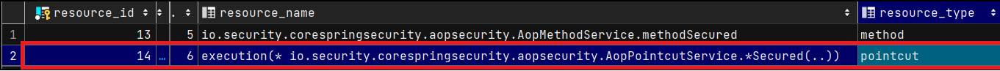

추가적인 구현은 `https://github.com/onjsdnjs/corespringsecurity` 여기 참고해야 할 듯합니다. branch 는 ch05-03a  입니다.
