# 스프링 시큐리티 초기화 과정

​	`SecurityBuilder` 는 빌더 클래스로서 웹 보안을 구성하는 빈 객체와 설정클래스들을 생성하는 역할을 하며 `WebSecurity`, `HttpSecurity` 가 있습니다.

​	`SecurityConfigurer` 는 Http 요청과 관련된 보안처리를 담당하는 필터들을 생성하고 여러 초기화 설정에 관여합니다. `SecurityBuilder` 는 `SecurityConfigurer` 를 포함하고 있으며 인증 및 인가 초기화 작업은 `SecurityConfigurer` 에 의해 진행됩니다.

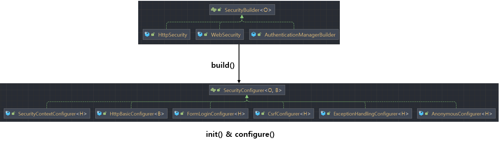

아래 그림과 같이 `AutoConfiguration` 이 `SecurityBuilder` 의 `build()` 를 호출하는데요. 이 때 `SecurityBuilder` 는 내부적으로 `SecurityConfigurer` 를 가지고 있으면서 `build()` 가 실행되는 동안 초기화작업을 진행합니다.

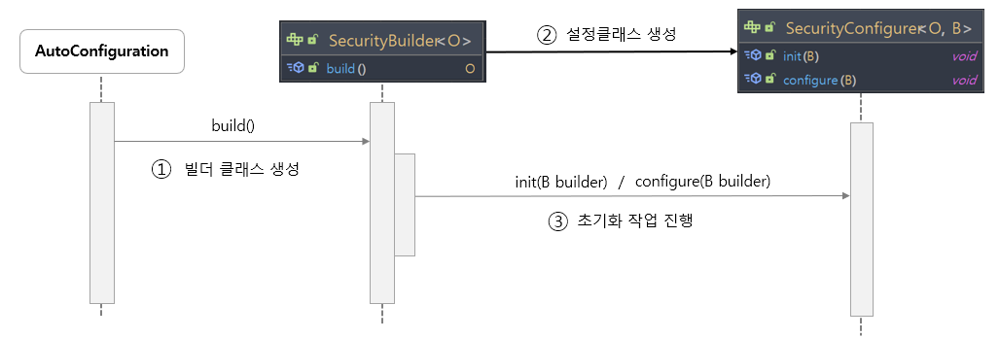

이것을 좀 더 상세히 보겠습니다.

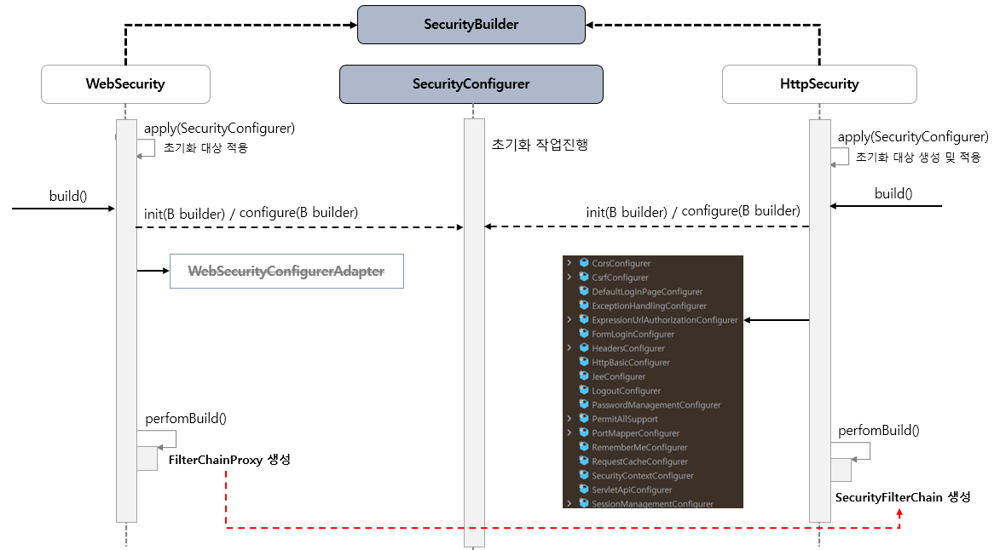

`SecurityBuilder` 는 `WebSecurity` 와 `HttpSecurity` 구현체가 있습니다. 먼저 `apply()` 메서드로 초기화 대상을 적용시킵니다. 그래서 어떤 `Cnofigurer` 를 초기화할지 대상을 정하게 됩니다.

이후 `build()` 메서드가 호출되고, 그 안에서 각각의 `Configurere` 들의 `init()`, `configure()` 메서드가 호출되면서 그 안에서 `Filter` 도 만들고 인증과 인가에 필요한 객체를 만듭니다. 

​	`WebSucurity` 의 최종 반환값은 `FilterChainProxy` 입니다. 그리고 `HttpSecurity` 의 최종 반환값은 `SecurityFilterChain` 입니다.

## WebSecurityConfiguration

해당 Config 파일의 `setFilterChainProxySecurityConfigurer()` 메서드에서 `WebSecurity` 클래스를 만듭니다.


첫 번째 박스에서 `WebSecurity` 를 만드는 것을 볼 수 있고, 두 번째 박스에서는 `SecurityConfigurer` 를 `apply()` 메서드로 적용시키고 있습니다.

## HttpSecurityConfiguration

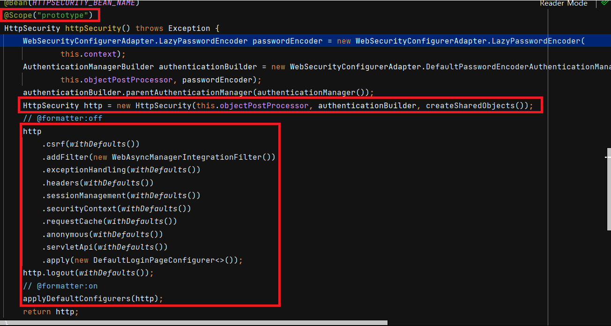

`HttpSecurity` 는 scope 가 prototype 으로, 여러 개를 생성할 수 있습니다. 세 번째 박스를 보면 Default 구현체를 생성하고 적용시키고 있습니다. 

예를 들어 .`csrf()` 메서드를 보면,

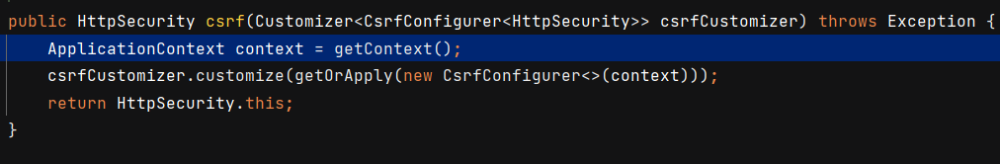

이렇게 되어있는데, `getOrApply()` 메서드로 들어가서 다시 `apply()` 로 들어가면, `AbstractConfiguredSecurityBuilder` 클래스의 `apply()` 메서드를 적용하고 있습니다. 여기에서 `Configurer` 를 추가해줍니다.

아래와 같이 `HttpSecurityConfiguration` 의 `configurers` 필드에 `CsrfConfigurer` 가 추가된 걸 볼 수 있습니다.

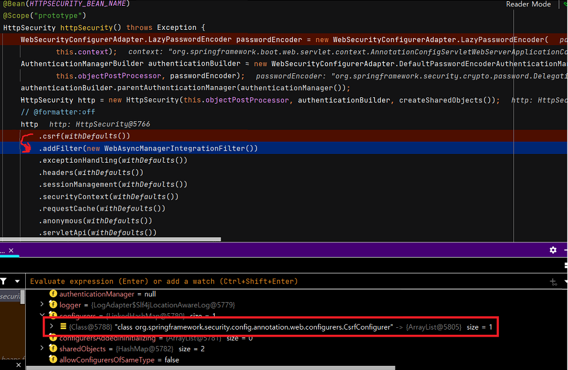

그렇다면 이렇게 구성된 `http` 는 어디서 빈으로 등록될까요? 바로 `SpringBootWebSecurityConfiguration` 클래스입니다.

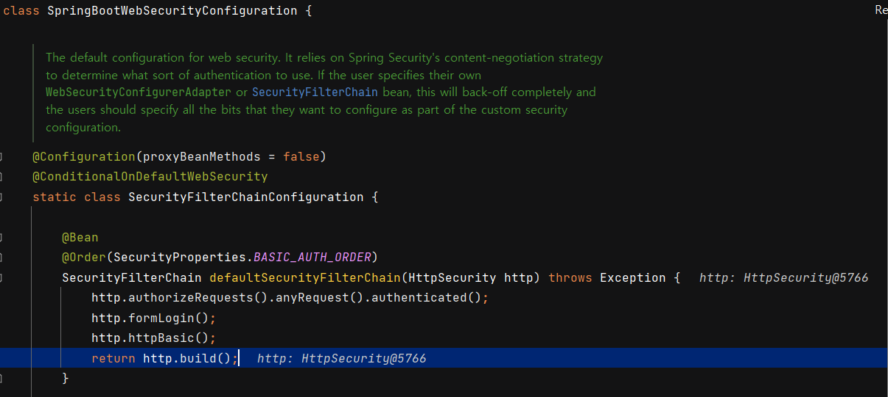

해당 클래스에서 기본적인 `SecurityFilterChain` 을 빈으로 등록합니다.

여기서 `build()` 를 하게 되면 **`AbstractSecurityBuilder`** 의 `build()` 메서드가 사용되는데요. 해당 메서드 내부에서는 `doBuild()` 를 사용합니다.

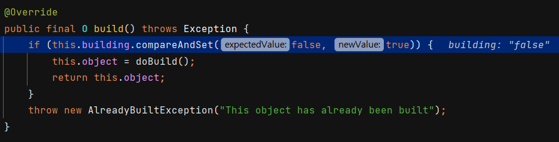

`doBuild()` 내부에서는 `configurers` 를 가지고 여러 가지 초기화 과정이 시작됩니다.

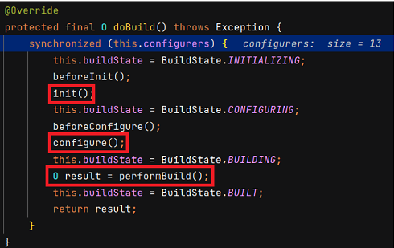

`init()` 메서드에는 각 `configurer` 의 `init()` 메서드를 호출합니다.

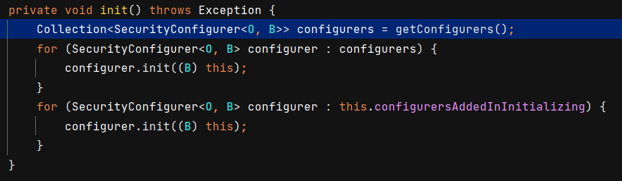

그리고 `configure()` 메서드에서는 각 `configurer` 의 `configure()` 메서드를 호출합니다.


예를 들어, 아래는 `CsrfConfigurer` 의 `configure()` 메서드입니다.

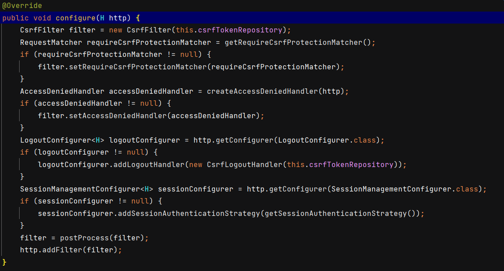

메서드 내부에서 필터, 핸들러 등을 만들고 `addFilter` 를 합니다.

마지막으로 `performBuild()` 는 `HttpSecurity` 에 있고 `DefaultSecurityFilterChain` 을 리턴합니다.

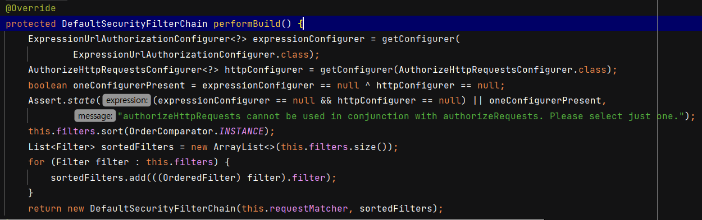

`DefaultSecurityFilterChain` 은 만들어진 필터(`sortedFilters`) 와 `requestMatcher` 를 받고 있습니다. `requestMatcher` 는 `SpringBootWebSecurityConfiguration` 에 있습니다. (`http.authorizeRequests().anyRequest().authenticated();`)

이렇게 만들어진 Filter 들은 `WebSecurity` 로 전달되어 `FilterChainProxy` 를 만드는 데 사용됩니다. `WebSecurity` 에도 `performBuild()` 가 동작하는데, 해당 메서드에서 `FilterChainProxy filterChainProxy = new FilterChainProxy(securityFilterChains);` 형태로 `securityFilterChains` 가 전달됩니다.

## CustomSecurityConfigurer

`CustomSecurityConfigurer` 은 `AbstractHttpConfigurer` 를 상속받아야 합니다. 제네릭 타입은 아래와 같이 만듭니다.

```java
public class CustomSecurityConfigurer extends AbstractHttpConfigurer<CustomSecurityConfigurer, HttpSecurity> {

    private boolean isSecure;

    @Override
    public void init(HttpSecurity builder) throws Exception {
        super.init(builder);
        System.out.println("init method called ... ");
    }

    @Override
    public void configure(HttpSecurity builder) throws Exception {
        super.configure(builder);
        System.out.println("configure method called ... ");
        if(isSecure){
            System.out.println("https is required");
        }else{
            System.out.println("https is optional");
        }
    }

    public CustomSecurityConfigurer setFlag(boolean isSecure){
        this.isSecure = isSecure;
        return this;
    }
}

```

간단하게 `init()` 과 `configure()` 를 구현했습니다. `isSecure` 값은 `Config` 파일에서 줍니다.

### SecurityConfig

```java
@Configuration
public class SecurityConfig {

    @Bean
    public SecurityFilterChain securityFilterChain(HttpSecurity http) throws Exception {
        http
                .authorizeRequests()
                .anyRequest().authenticated()
            .and()
                .formLogin()
            .and()
                .apply(new CustomSecurityConfigurer().setFlag(true));

        return http.build();
    }
}
```

`.setFlag(true)` 를 통해 메서드 체이닝 방식으로 `isSecure` 값을 줍니다. 빌드를 하면 다음과 같이 작동합니다.

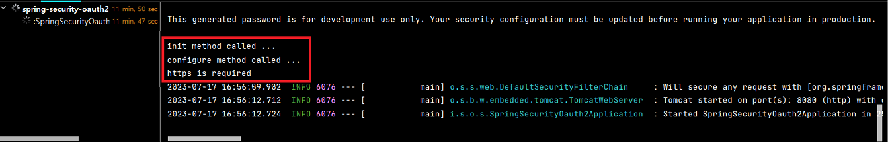

# 자동설정에 의한 초기화 과정 

자동설정에 의해 초기화를 진행하면 아래와 같은 과정으로 진행됩니다.

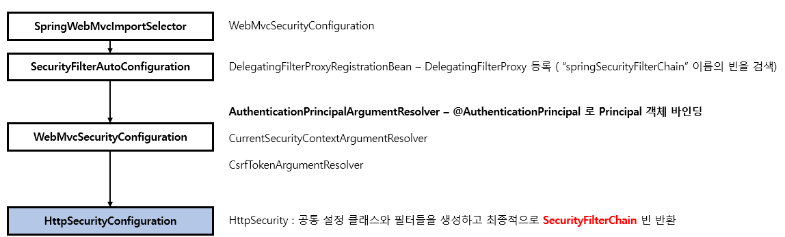

1. 어떤 조건에 따라 빈을 등록하는 로직을 구현하려면 `SpringWebMvcImportSelector` 을 사용합니다.
2. `SecurityFilterAutoConfiguration` 클래스는 `DelegatingFilterProxyRegistrationBean` 클래스를 만듭니다. 그러면 그 빈 클래스가 `DelegatingFilterProxy` 를 등록합니다.
3. 이후 `WebMvcSecurityConfiguration` 은 여러 `ArgumentResolver` 를 생성하는데 이중 `AuthenticationPrincipalArgumentResolver` 는 `@AuthenticationPrincipal` 에 `Principal` 객체를 바인딩합니다.
4. `HttpSecurityConfiguration` 에서는 프로토타입 빈인 `SecurityFilterChain` 빈을 생성합니다. 아래와 같이 각각의 Configurer 가 등록되고 초기화과정을 통해 각각의 필터가 만들어집니다.

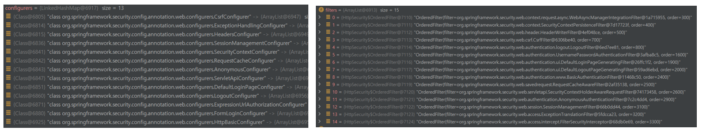

예를 들어서 `UsernamePasswordAuthenticationFilter` 는 `FormLoginConfigurer` 에서 만듭니다.

## SpringBootWebSecurityConfiguration 에 의한 자동설정

아래는 WebSecurity 가 만들어지는 과정입니다.

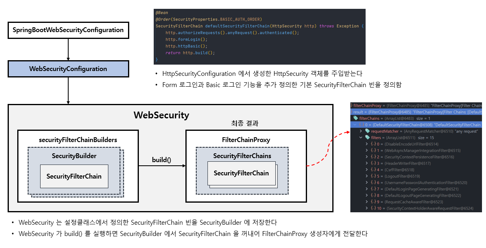

​	`WebSecurity` 에는 `securityFilterChainBuilders` 라는 필드가 있는데, 여러 개의 SecurityBuilder 가 들어갈 수 있습니다. 그리고 `SecurityBuilder` 는 `SecurityFilterChain` 을 가지고 있는데, 그게 바로 빈으로 등록한 `SecurityFilterChain` 입니다.

​	초기화 과정에서 `WebSecurity` 가 `build()` 를 실행하면 `FilterChainProxy` 를 생성합니다. `FilterChainProxy` 는 `SecurityFilterChains` 필드가 있는데, 여러 개의 `SecurityFilterChain` 을 가집니다.

​	최종적으로, `SecurityFilterChain` 빈들은 `FilterchainProxy` 안에 위치하게 됩니다.

## 코드레벨

### SpringWebMvcImportSelector

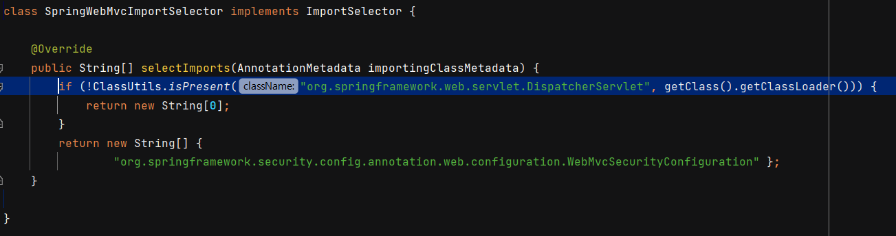

먼저 `selectImports()` 메서드를 통해 `DispatcherServlet` 이 있는지 확인하고 있다면 `~WebMvcSecurityConfiguration` 을 반환합니다.

### SecurityFilterAutoConfiguration

그 다음으로 `SecurityFilterAutoConfiguration` 의 `securityFilterChainRegistration()` 메서드를 보면 `DelegatingFilterProxyRegistrationBean` 을 만들고 있습니다.

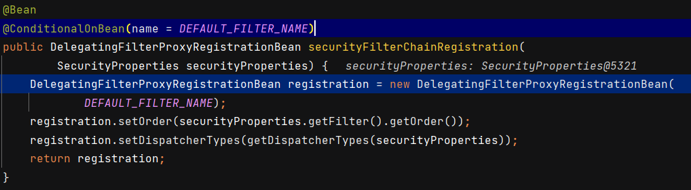

이 때 DEFAULT_FILTER_NAME 은 `springSecurityFilterChain` 입니다.

### WebMvcSecurityConfiguration

그리고 resolver 를 등록시키는 `addArgumentResolvers()` 메서드입니다.

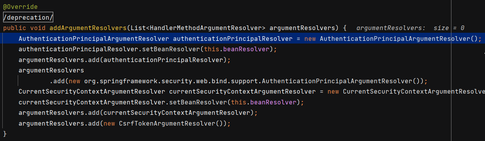

### SpringBootWebSecurityConfiguration

해당 클래스에서 SecurityFilterChain 을 만들고 있습니다.


여기서 참조하는 `HttpSecurity` 는 `HttpSecurityConfiguration` 에서 프로토 타입 빈으로 생성됩니다.

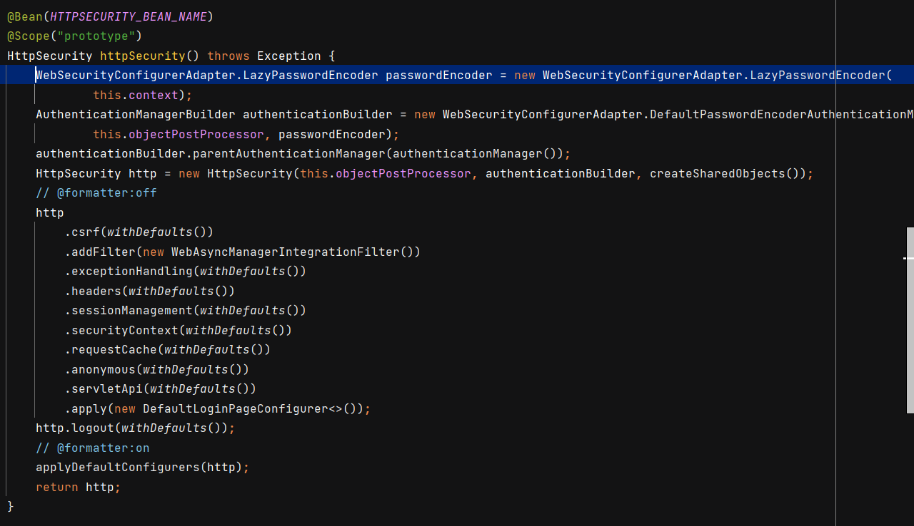

`SpringBootWebSecurityConfiguration` 를 다시보면 `@ConditionalOnDefaultWebSecurity` 라는 어노테이션이 있습니다.

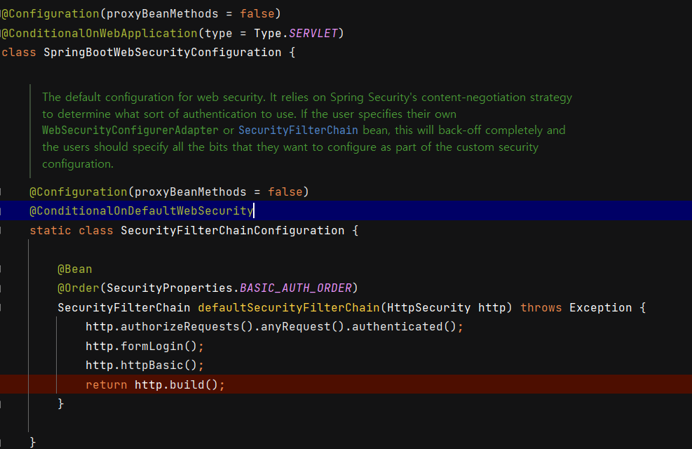

해당 어노테이션은 빈 등록은 어떤 조건일 때 하는지 정해놓는데요.

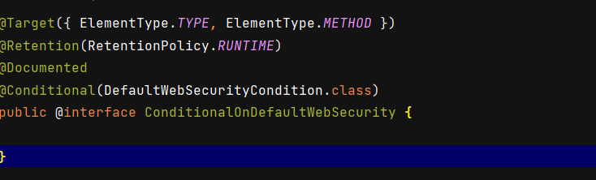

`@Conditional`  조건이 있습니다. `DefaultWebSecurityCondition` 클래스로 들어가보겠습니다.

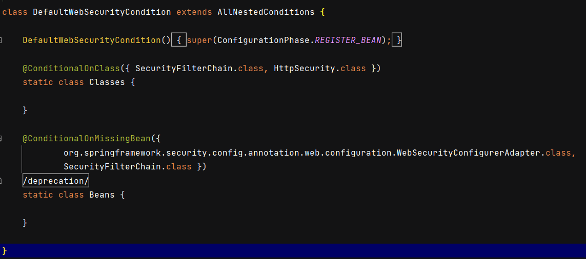

첫번째 조건은 classpath 에 `SecurityFilterChain`, `HttpSecurity` 가 잡혀져있느냐 이고, 두번째는 `WebSecurityConfigurerAdapter`, `SecurityFilterChain` 이 빈으로 등록된 게 없느냐 입니다.

### WebSecurityConfiguration

해당 클래스의 `setFilterChains()` 메서드를 통해 필드값으로 `securityFilterChains` 를 받습니다.

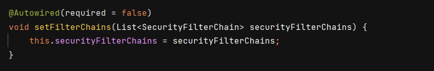

그리고 반환 타입이 Filter 인 `springSecurityFilterChain()` 을 실행합니다.

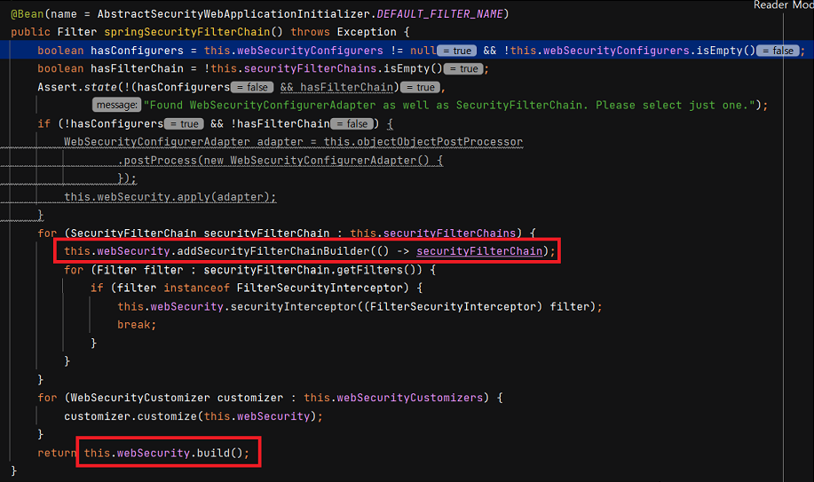

`webSecurity` 에 `FilterChain` 을 주고 `build()` 를 하면 최종적으로 `FilterChainProxy` 가 반환됩니다.

## custom SecurityFilterChain 등록

아래와 같이 `SecurityFilterChain` 을 2개 만들어보겠습니다.

```java
@Configuration
public class SecurityConfig {

    @Bean
    public SecurityFilterChain securityFilterChain1(HttpSecurity http) throws Exception {
        http
                .authorizeRequests()
                .anyRequest().authenticated()
            .and()
                .formLogin()
		;

        return http.build();
    }

    @Bean
    public SecurityFilterChain securityFilterChain2(HttpSecurity http) throws Exception {
        http
                .authorizeRequests()
                .anyRequest().authenticated()
                .and()
                .httpBasic()
		;

        return http.build();
    }
}

```

이렇게 하면 `@ConditionalOnDefaultWebSecurity` 에 의해 `SpringBootWebSecurityConfiguration` 은 거치지 않게 됩니다.

**`SecurityFilterChain` 을 2번 등록하면 프로토 타입 빈이기 때문에 각각 생성되어야 합니다.** 따라서 `HttpSecurityConfiguration` 클래스의 `httpSecurity()` 메서드가 2번 호출되는 것으로 알 수 있습니다.

그리고 `WebSecurityConfiguration` 클래스의 `setFilterChains` 에도 2개의 `SecurityFilterChain` 이 들어오는 것을 볼 수 있습니다.

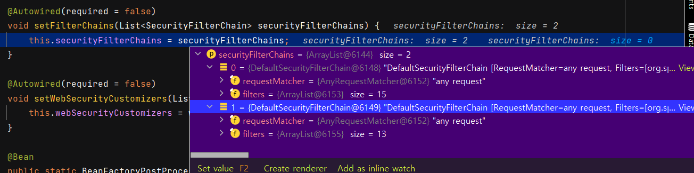

# AuthenticationEntryPoint 이해

`AuthenticationEntryPoint` 는 **인증**실패 시 처리 방법입니다. (인가 x)

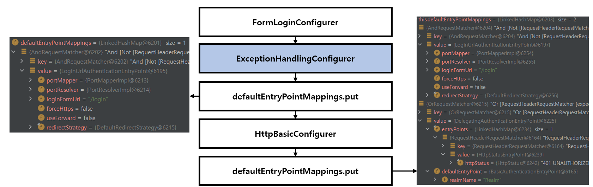

각각의 인증 방법마다 인증 실패 처리 방법이 다를건데요. 그 구성은 각 `Configurer` 가 초기화될 때 생성됩니다. `FormLoginConfigurer` 는 초기화되면서 `ExceptionHandlingConfigurer` 설정 클래스 안에 있는 `DufaultEntryPointMapping` 에 자신의 `EntryPoint` 를 추가합니다. (`LoginUrlAuthenticationEntryPoint`) 그리고 `HttpBasicConfigurer` 도 마찬가지로 자신의 `EntryPoint` 를 추가합니다. (`DelegatingAuthenticationEntryPoint`) 만약 custom EntryPoint 를 만들 게 된다면 default 로 설정된 위 `entryPoint` 는 무시됩니다.

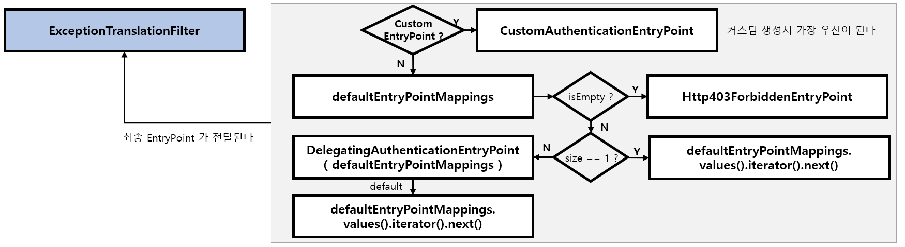

만약 `FormLogin` 과 `HttpBasic` 도 설정하지 않는다면 표에서 보이듯 Http4`0`3ForbiddenEntryPoint 를 호출합니다. 그리고 만약 `EntryPoint` 가 1개 설정되었다면 그거를 사용하고, 2개 이상이면 어떤 인증방식인지에 따라 내부로직을 통해 결정합니다.

## 코드레벨

예를 들어 아래와 같이 `SecurityFilterChain` 에 `FormLogin`, `httpBasic`, `custom EntryPoint` 3개가 있습니다.

```java
@Configuration
public class SecurityConfig {

    @Bean
    public SecurityFilterChain securityFilterChain1(HttpSecurity http) throws Exception {
        http
                .formLogin()
            .and()
                .httpBasic()
            .and()
                .authorizeRequests()
                .anyRequest().authenticated()
            .and()
                .exceptionHandling()
                .authenticationEntryPoint(((request, response, authException) -> {
                    System.out.println("custom entryPoint");
                }))

            ;

        return http.build();
    }
}
```

이 때 인증받지 않은 사용자가 접근할 때 실행되는 EntryPoint 는 custom 입니다.

## EntryPoint 등록

아래 코드는 `AbstractAuthenticationFilterConfigurer` 입니다. `FormLoginConfigurer` 의 부모 클래스입니다.

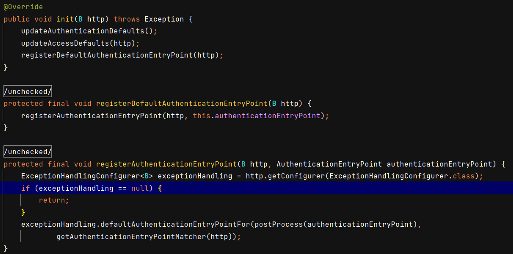

해당 클래스의 init 을 통해 초기화가 진행되는데 이때 `registerDefaultAuthenticationEntryPoint()` 메서드를 통해 `ExceptionHandlingConfigurer` 를 불러와서 자신의 EntryPoint 를 등록시킵니다.

마찬가지로 `HttpBasicConfigurer` 도 `authenticationEntryPoint()` 메서드로 동일한 작업을 거칩니다.

마지막으로 `ExceptionHandlingConfigurer` 는 `configure()` 메서드 실행 시 그렇게 받은 `EntryPoint` 를 `ExceptionTranslationFilter` 로 전달합니다. 해당 필터가 인증 예외 처리를 하기 때문입니다.

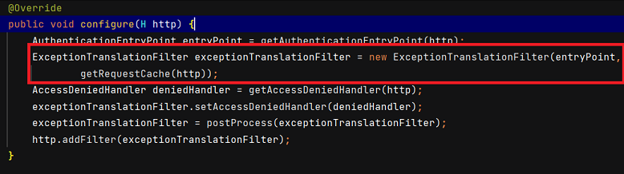

그러면 서비스 중 인증 예외가 발생했을 때 `ExceptionTranslationFilter` 의 `sendStartAuthentication()` 메서드에서 commence 를 통해 예외를 발생시킵니다.

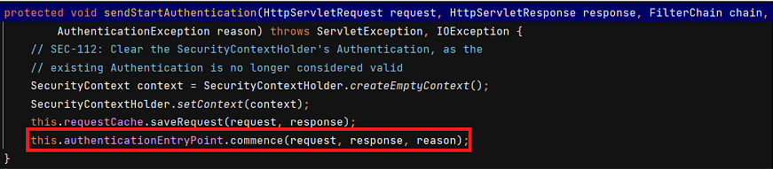

# 시큐리티 인증 및 인가 흐름 요약

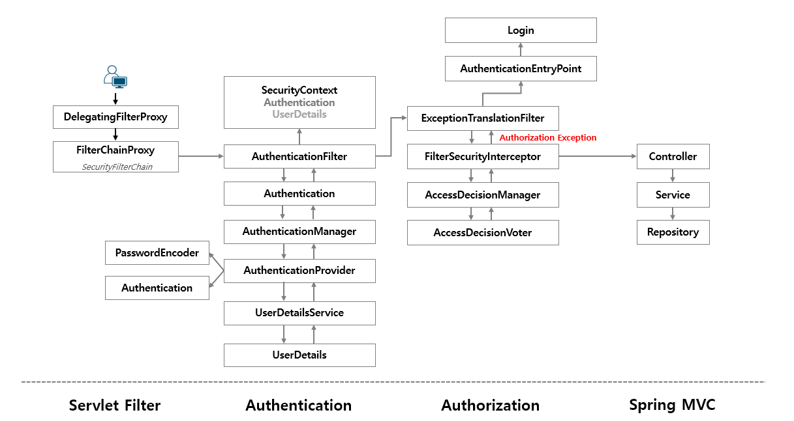

# HttpBasic 인증

HttpBasic 인증 방식은 헤더에 ID, PW 를 인코딩해서 보내는 방식입니다.

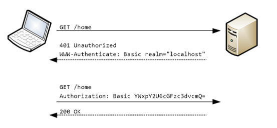

주의사항으로 base-64 인코딩된 값은 쉽게 디코딩할 수 있기 때문에 인증정보가 노출됩니다. 따라서 HTTP Basic 인증은 반드시 HTTPS 와 같이 TLS 기술과 함께 사용해야 합니다.

## HttpBasicConfigurer

HttpBasic 설정 클래스입니다. 필터는 `BasicAuthenticationFilter` 를 사용하며 기본 `AuthenticationEntryPoint` 는 `BasicAuthenticationEntryPoint` 입니다.

## BasicAuthenticationFilter

​	해당 필터 클래스는 `BasicAuthenticationConverter` 를 사용해서 요청 헤더에 기술된 인증정보의 유효성을 체크하며 Base64 인코딩된 ID 와 PW 를 추출합니다. 인증이 성공하면 `Authenticatoin` 이 `SecurityContext` 에 저장되고 인증이 실패하면 Basic 인증을 통해 다시 인증하라는 메시지를 표시하는 `BasicAuthenticationEntryPoint` 가 호출됩니다.

​	인증 이후 세션을 사용하는 경우와 사용하지 않는 경우에 따라 처리되는 흐름에 차이가 있습니다. **세션을 사용하는 경우 매 요청 마다 인증과정을 거치지 않으나 세션을 사용하지 않는 경우 매 요청마다 인증과정을 거쳐야 합니다.**

흐름은 아래와 같습니다.

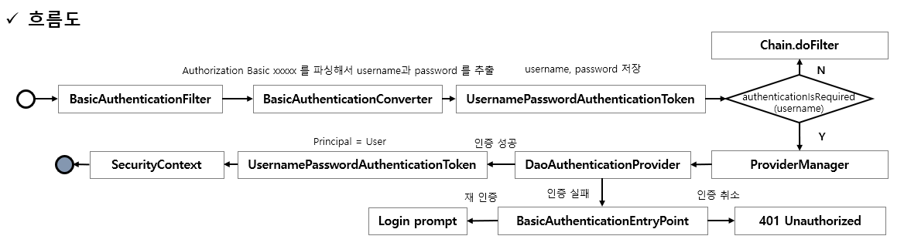

## 코드레벨

### HttpBasicConfigurer

`HttpBasicConfigurer` 클래스의 configure 을 보면 `BasicAuthenticationFilter` 을 만들어서 `authenticationManager` 와 `authenticationEntryPoint` 을 할당해주는 걸 볼 수 있습니다.

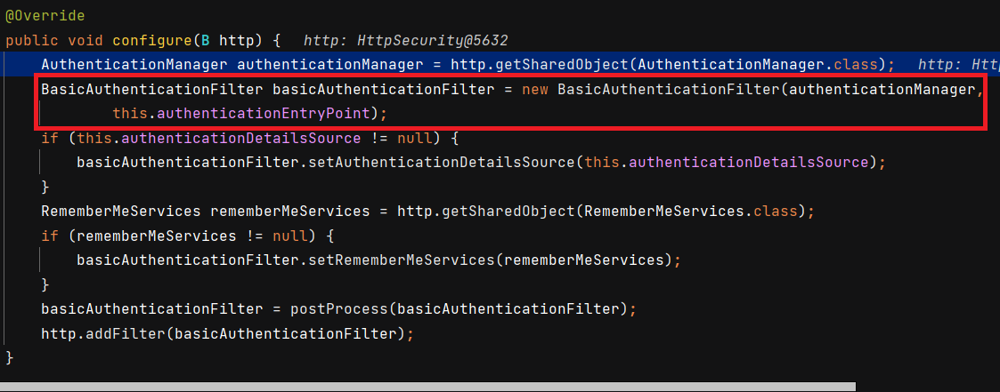

### BasicAuthenticationFilter (헤더가 없을 때)

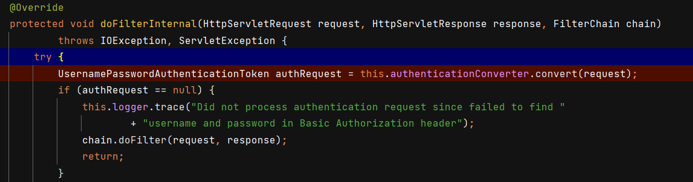

`BasicAuthenticationFilter` 에서 `UsernamePasswordAuthenticationToken` 은 `header` 에서 얻는데, 없다면 그대로 넘어간 뒤 Anonymous 객체가 되기 때문에 이후에 `ExceptionTranslationFilter` 에서 예외를 처리합니다.

### ExceptionTranslationFilter

`ExceptionTranslationFilter` 에서는 예외를 처리하게 됩니다. 그러면 최종적으로 `BasicAuthenticationEntryPoint` 의 `commence()` 를 호출하게 됩니다.

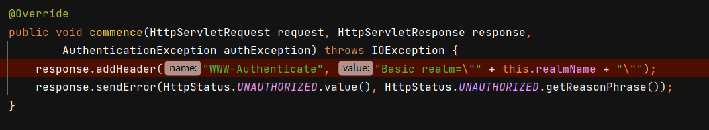

해당 메서드에서는 repsonse 에 `WWW-Authentication` 헤더를 추가해 보냅니다.

### BasicAuthenticationFilter (인증 성공)

먼저 로그인을 시도하면 아래와 같이 header 값이 추가됩니다.

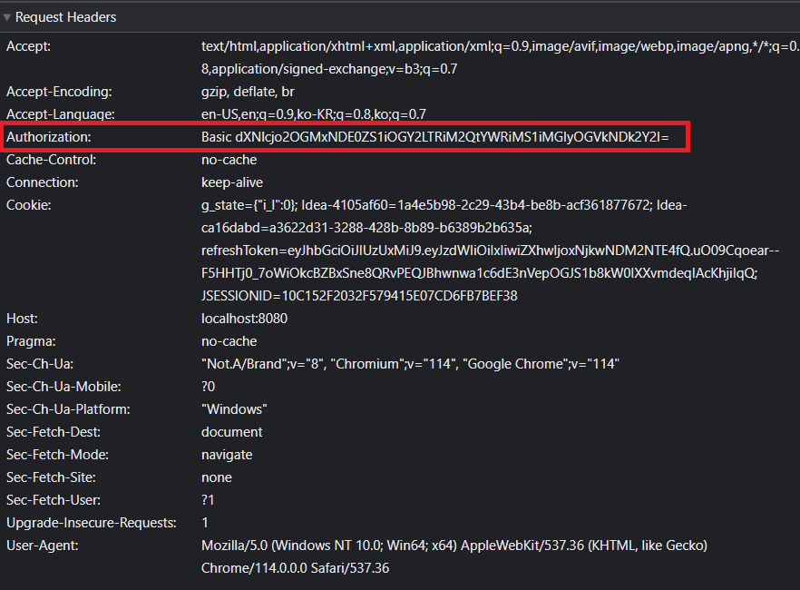

그리고 `BasicAuthenticationFilter` 클래스의 `doFilterInternal()` 에서 인증을 거칩니다.

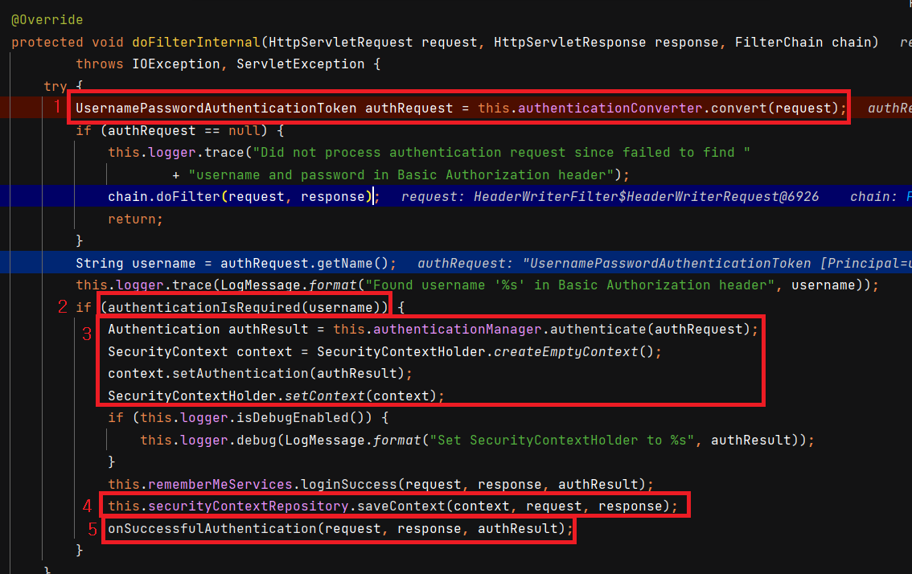

1. `authenticationConverter` 로 request header 에서 `Authorization` 값을 `UsernamePasswordAuthenticationToken` 으로 변경합니다.
2. 인증이 필요한지 확인합니다. `SecurityContextHolder` 에 `Authentication` 값이 있거나 인증받은 객체인지 확인합니다. 세션에 인증값을 저장하면 한번만 로그인하면 해당 필터를 거치지 않습니다.
3. `Authentication` 객체를 `authenticationManager` 를 통해 인증한 후 `SecurityContextHolder` 에 저장합니다.
4. `Authentication` 객체를 `Session` 에 저장합니다.
5. 성공 핸들러를 실행합니다.

### 세션 무효화

만약 아래와 같이 세션을 무효화한다면 `BasicAuthenticationFilter` 에서 계속해서 인증을 실시하게 됩니다.

```java
@Bean
    public SecurityFilterChain securityFilterChain1(HttpSecurity http) throws Exception {
        http
                .httpBasic()
            .and()
                .authorizeRequests()
                .anyRequest().authenticated()
            .and()
                .sessionManagement().sessionCreationPolicy(SessionCreationPolicy.STATELESS);
            ;

        return http.build();
    }
```

`BasicAuthenticationFilter` 의 2번 과정에서 `true` 를 반환하며 인증을 계속 실시합니다.

### CustomAuthenticationEntryPoint 

`CustomAuthenticationEntryPoint` 는 `AuthenticationEntryPoint` 클래스를 상속받고, `commence()` 메서드를 구현합니다.

```java
package io.security.oauth2.springsecurityoauth2;

import org.springframework.http.HttpStatus;
import org.springframework.security.core.AuthenticationException;
import org.springframework.security.web.AuthenticationEntryPoint;

import javax.servlet.ServletException;
import javax.servlet.http.HttpServletRequest;
import javax.servlet.http.HttpServletResponse;
import java.io.IOException;

public class CustomAuthenticationEntryPoint implements AuthenticationEntryPoint{
    
    @Override
    public void commence(HttpServletRequest request, HttpServletResponse response,
                         AuthenticationException authException) throws IOException {
        response.addHeader("WWW-Authenticate", "Basic realm= localhost");
        response.sendError(HttpStatus.UNAUTHORIZED.value(), HttpStatus.UNAUTHORIZED.getReasonPhrase());
    }
}

```

해당 메서드는 `BasicAuthenticationEntryPoint` 를 그대로 구현하고 `Basic realm= localhost` 부분만 변경하였습니다.

그리고 설정 파일에서 해당 entryPoint 를 httpBasic 에 줍니다.

```java
@Configuration
public class SecurityConfig {

    @Bean
    public SecurityFilterChain securityFilterChain1(HttpSecurity http) throws Exception {
        http
                .httpBasic()
                .authenticationEntryPoint(new CustomAuthenticationEntryPoint())
            .and()
                .authorizeRequests()
                .anyRequest().authenticated()
            .and()
                .sessionManagement().sessionCreationPolicy(SessionCreationPolicy.STATELESS);
            ;

        return http.build();
    }
}

```

이제 다시 미인증상태로 리소스를 요청하면 아래와 같이 헤더값이 옵니다.

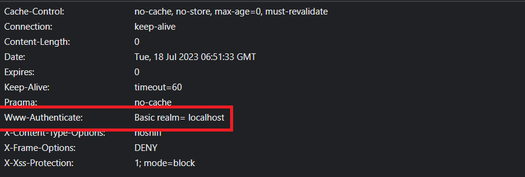

**이때 header name 을 정확히 `WWW-Authenticate` 로 하지않는다면 로그인 페이지로 이동되지 않습니다!**

# CORS

​	CORS (Cross-Origin Resource Sharing) 은 교차 출처 리소스 공유로, HTTP 헤더를 사용하여 한 출처에서 실행 중인 웹 애플리케이션이 다른 출처의 선택한 자원에 접근할 수 있는 권한을 부여하도록 브라우저에 알려주는 체제입니다.

​	출처를 비교하는 로직은 서버에 구현된 스펙이 아닌 브라우저에 구현된 스펙 기준으로 처리되며 브라우저는 클라이언트의 요청 헤더와 서버의 응답헤더를 비교해서 최종 응답을 결정합니다. **두 개의 출처를 비교하는 방법은 URL의 구성요소 중 Protocol, Host, Port 세가지가 동일한지 확인하면 되고 나머지는 달라도 상관없습니다.**

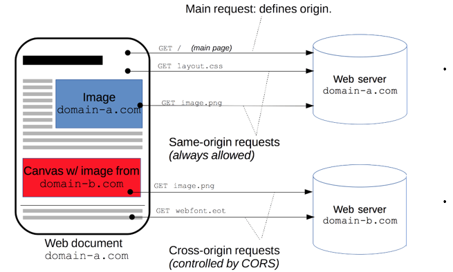

`https://domain-a.com` 의 프론트 엔드 JavaScript 코드가 XMLHttpRequest를 사용하여 `https://domain-b.com/data.json` 을 요청하는 경우 보안 상의 이유로, 브라우저는 스크립트에서 시작한 교차 출처 HTTP 요청을 제한합니다.

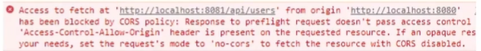

​	XMLHttpRequest와 Fetch API는 동일 출처 정책을 따르기 때문에 이 API를 사용하는 웹 애플리케이션은 자신의 출처와 동일한 리소스만 불러올 수 있으며, 다른 출처의 리소스를 불러오려면 그 출처에서 올바른 CORS 헤더를 포함한 응답을 반환해야 합니다.

## CORS 요청의 종류

### Simple Request

​	Simple Request 는 예비 요청(Prefilght)을 과정 없이 바로 서버에 본 요청을 한 후, 서버가 응답의 헤더에 `Access-Control-Allow-Origin` 과 같은 값을 전송하면 브라우저가 서로 비교 후 CORS 정책 위반여부를 검사하는 방식입니다.

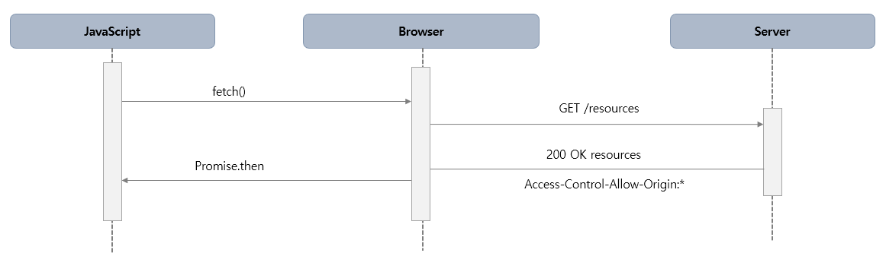

​	**GET, POST, HEAD 중의 한가지 Method 를 사용**해야 하며, 헤더는 Accept, Accept-Language, Content-Language, Content-Type, DPR, Downlink, Save-Data, Viewport-Width Width 만 가능하고 Custom Header 는 허용되지 않습니다. Content-type 은 application/x-www-form-urlencoded, multipart/form-data, text/plain 만 가능합니다.

### **Preflight Request** 

Preflight Request 에서 브라우저는 요청을 한번에 보내지 않고, 예비요청과 본요청으로 나누어 서버에 전달하는데 브라우저가 예비요청을 보내는 것을 Preflight 라고 하며 이 예비요청의 메소드에는 OPTIONS 가 사용됩니다. 예비요청의 역할은 본 요청을 보내기 전에 브라우저 스스로 안전한 요청인지 확인하는 것으로 요청 사양이 Simple Request 에 해당하지 않을 경우 브라우저가 Preflight Request 을 실행합니다.

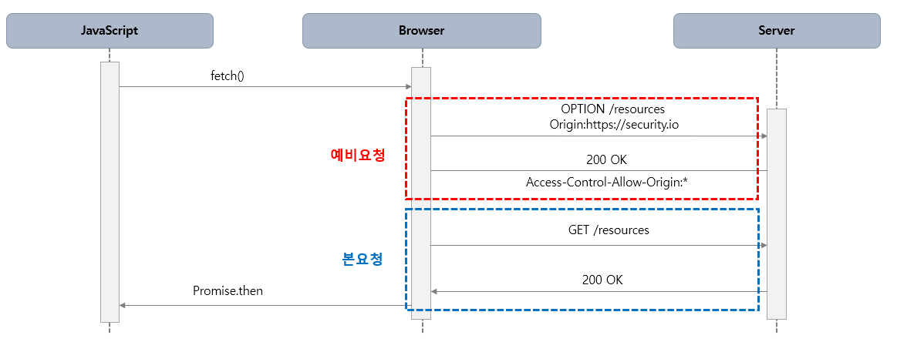

아래 코드가 Preflight Request 입니다. Content-Type 이 text/xml 로, Simple Request 에 해당하지 않으므로 Preflight Request 가 실행됩니다.

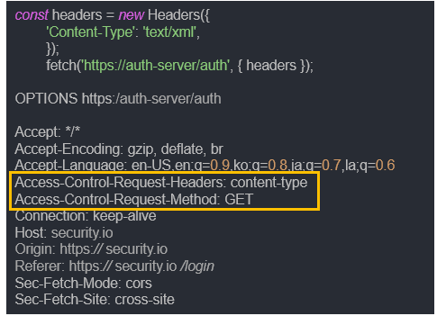

​	브라우저가 보낸 요청을 보면 Origin 에 대한 정보 뿐만 아니라 예비 요청 이후에 전송할 본 요청에 대한 다른 정보들도 함께 포함되어 있는 것을 볼 수 있습니다. 이 예비 요청에서 브라우저는 Access-Control-Request-Headers 를 사용하여 자신이 본 요청에서 Content-Type 헤더를 사용할 것을 알려주거나, Access-Control-Request-Method 를 사용하여 GET 메소드를 사용할 것을 서버에게 미리 알려주고 있습니다.

아래는 그에 따른 서버의 응답 메세지입니다.

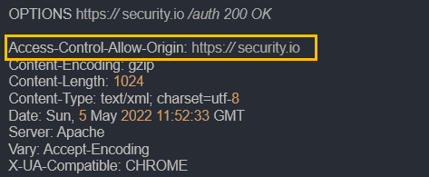

​	서버가 보내준 응답 헤더에 포함된 Access-Control-Allow-Origin: `https://security.io` 의 의미는 해당 URL 외의 다른 출처로 요청할 경우에는 CORS 정책을 위반했다고 판단하고 오류 메시지를 내고 응답을 버리게 된다는 뜻입니다.

아래는 `https://security.io` 과 동일 출처 기준입니다.

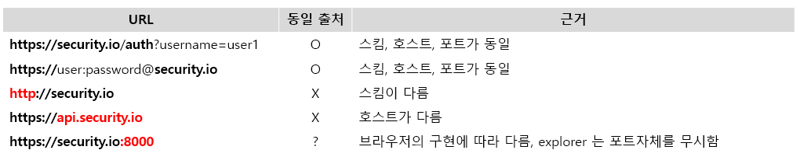

CORS 를 해결하기 위해서는 서버에서 Access-Control-Allow-\* 을 세팅합니다.

- **Access-Control-Allow-Origin** - 헤더에 작성된 출처만 브라우저가 리소스를 접근할 수 있도록 허용합니다.
  - `*`, `https://security.io`
- **Access-Control-Allow-Methods** - preflight request 에 대한 응답으로 실제 요청 중에 사용할 수 있는 메서드를 나타냅니다.
  - 기본값은 GET,POST,HEAD,OPTIONS, *
- **Access-Control-Allow-Headers** - preflight request 에 대한 응답으로 실제 요청 중에 사용할 수 있는 헤더 필드 이름을 나타냅니다.
  - 기본값은 Origin,Accept,X-Requested-With,Content-Type, Access-Control-Request-Method,Access-Control-Request-Headers, Custom Header, *
- **Access-Control-Allow-Credentials** - 실제 요청에 쿠기나 인증 등의 사용자 자격 증명이 포함될 수 있음을 나타냅니다. Client의 credentials:include 일경우 true 가 필수입니다.
- **Access-Control-Max-Age** - preflight 요청 결과를 캐시 할 수 있는 시간을 나타내는 것으로 해당 시간동안은 preflight 요청을 다시 하지 않게 됩니다.

## CorsConfigurer

- Spring Security 필터 체인에 `CorsFilter` 를 추가합니다. 
- `corsFilter` 라는 이름의 Bean 이 제공되면 해당 `CorsFilter` 가 사용됩니다.
- `corsFilter` 라는 이름의 Bean 이 없고 `CorsConfigurationSource` 빈이 정의된 경우 해당 `CorsConfiguration` 이 사용됩니다.
- `CorsConfigurationSource` 빈이 정의되어 있지 않은 경우 Spring MVC가 클래스 경로에 있으면 `HandlerMappingIntrospector` 가 사용됩니다.

## CorsFilter

- CORS 예비 요청을 처리하고 CORS 단순 및 본 요청을 가로채고, 제공된 `CorsConfigurationSource` 를 통해 일치된 정책에 따라 CORS 응답 헤더와 같은 응답을 업데이트하기 위한 필터입니다. 
- Spring MVC Java 구성과 Spring MVC XML 네임스페이스에서 CORS 를 구성하는 대안이라 볼 수 있습니다. ( 예: @CorsOrigin)
- 스프링 웹에 의존하는 응용 프로그램이나 javax.servlet 에서 CORS 검사를 수행해야 하는 보안 제약 조건에 유용한 필터입니다.

## Cors 예제

먼저 모듈을 분리해서 cors-1, cors-2 를 만듭니다. cors-1 은 프론트 역할, cors-2 는 서버 역할입니다.

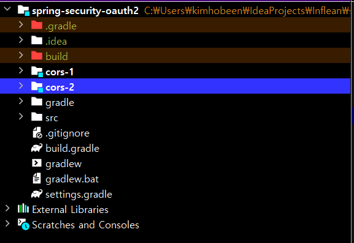

모듈은 Project Structure 에서 새로 만들 수 있습니다.

### cors-1

cors-1 에는 간단한 컨트롤러와 `index.html` 이 있습니다.

```java
@Controller
public class Cors1Controller {
    @GetMapping("/")
    public String index(){
        return "index";
    }
}
```

```html
<!DOCTYPE html>
<html lang="en">
<head>
    <meta charset="UTF-8">
    <title>Title</title>
  <script>
    function corsTest(){
      fetch("http://localhost:8081/api/users", {
        method: "GET",
        headers: {
          "Content-Type": "text/xml",
        }
      }).then(response => {
        response.json().then(data => {
          console.log(data);
        });
      });
    }

  </script>
</head>
<body>
  <button name="corsTest" onclick="corsTest()">CORS Test</button>
</body>
</html>
```

### cors-2

cors-2 는 Controller 와 SecurityConfig 가 있습니다.

```java
@RestController
@RequestMapping("/api")
public class Cors2Controller {

    @GetMapping("/users")
    public User users(){
        return new User("user", 20);
    }
}

public class User {

    private String username;
    private int age;

    public User() {}

    public User(String username, int age) {
        this.username = username;
        this.age = age;
    }

    //getter, setter
}
```

```java
@Configuration
public class SecurityConfig {

    @Bean
    public SecurityFilterChain securityFilterChain(HttpSecurity http) throws Exception {
        http
                .authorizeRequests()
                .anyRequest().authenticated()
            .and()
                .cors().configurationSource(corsConfigurationSource());

        return http.build();
    }

    @Bean
    public CorsConfigurationSource corsConfigurationSource() {

        CorsConfiguration configuration = new CorsConfiguration();
        configuration.addAllowedOrigin("*");
        configuration.addAllowedMethod("*");
        configuration.addAllowedHeader("*");
//        configuration.setAllowCredentials(true);
        configuration.setMaxAge(3600L); //default 는 1800

        UrlBasedCorsConfigurationSource source = new UrlBasedCorsConfigurationSource();
        source.registerCorsConfiguration("/**", configuration);

        return source;
    }
}
```

`http` 에 `CorsConfigurationSource` 을 빈으로 등록해서 적용합니다. 

cors-1 을 실행시키면 8080 포트로 아래와 같이 생깁니다.


버튼을 누르면 아래와 같이 Cors 정책이 적용된 응답을 받습니다.

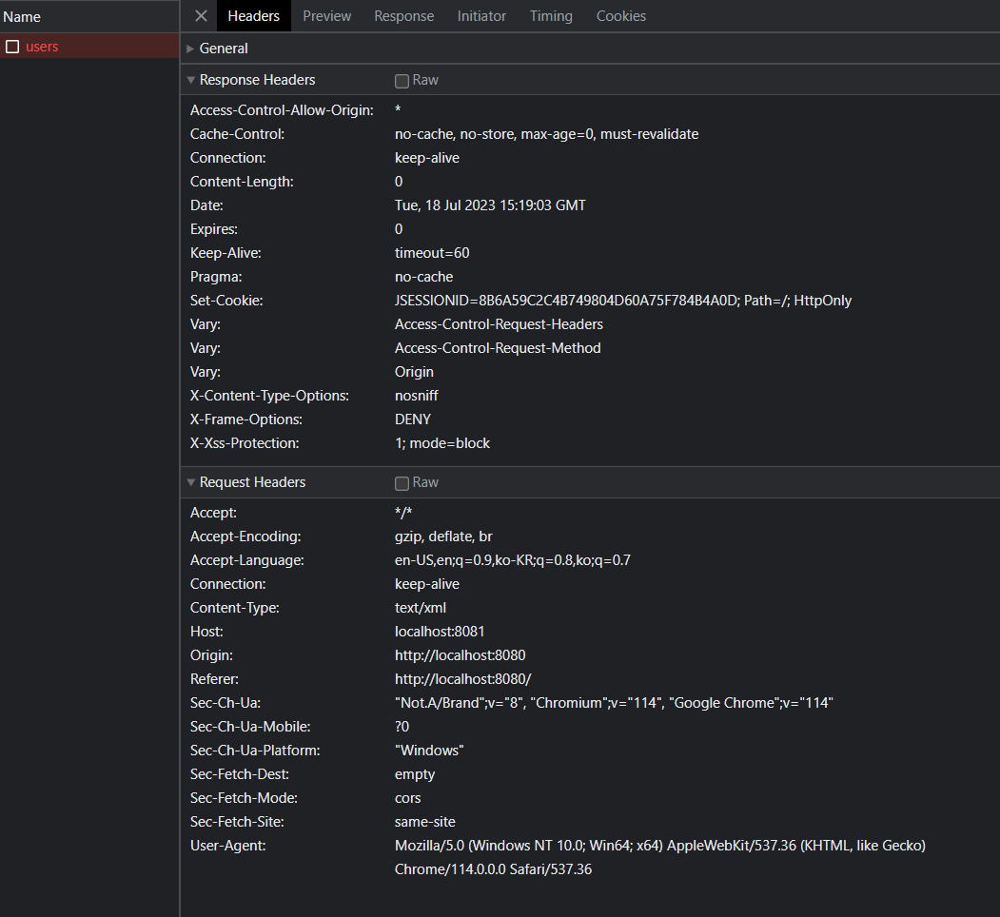

## Cors 흐름

### CorsConfigurer

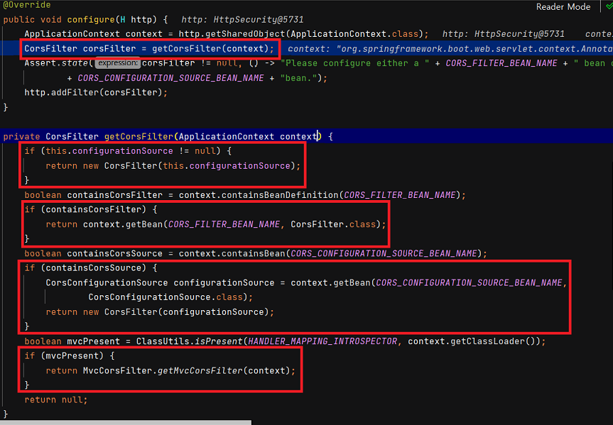

`CorsConfigurer` 클래스의 `configure()` 메서드에서 `getCorsFilter()` 를 통해 `CorsFilter` 를 생성합니다. 이 때 등록된 `configurationSource` 가 있으면 해당 객체로 생성하는데요. 현재 `SecurityConfig` 파일에 등록되어 있습니다. 그게 아니면 빈으로 등록된 `CorsFilter` 를 찾고, 없으면 빈으로 등록된 `CorsConfigurationSource` 를 찾습니다. 마지막으로 `HandlerMappingIntrospector` 가 적용됩니다.

### CorsFilter

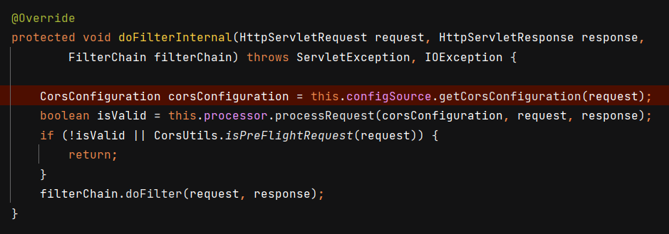

`CorsFilter` 의 doFilter 입니다. 가지고 있는 `CorsConfiguration` 정보로 Cors 정책을 판단하고 유효한지에 따라 그대로 return 을 하든지 다음 필터를 호출합니다.
