# OAuth 2.0 소개

​	OAuth 는 **O**pen + **Auth**orization 의 합성어입니다. OAuth 2.0 인가 프레임워크는 애플리케이션이 사용자 대신하여 사용자의 자원에 대한 제한된 액세스를 얻기 위해 승인 상호 작용을 함으로써 애플리케이션이 자체적으로 액세스 권한을 얻도록 합니다.

## keycloak 설치 및 설정

​	keycloack 은 ID 및 접근 관리를 지원하는 **인가서버 오픈 소스**로 사용자 연합, 강력한 인증, 사용자 관리, 세분화된 권한 부여 등을 제공합니다.

https://www.keycloak.org/ 해당 사이트에서 다운로드를 받고 압축을 해제하면 keycloack 이 설치됩니다. (현재 최신버전은 22.0.1)

keycloack 을 실행하기 위해서는 bin/kc.bat 을 다음과 같은 명령어로 개발 모드를 실행시킵니다.

`./kc.bat start-dev` 

localhost:8080 으로 아래와 같은 화면이 실행됩니다.

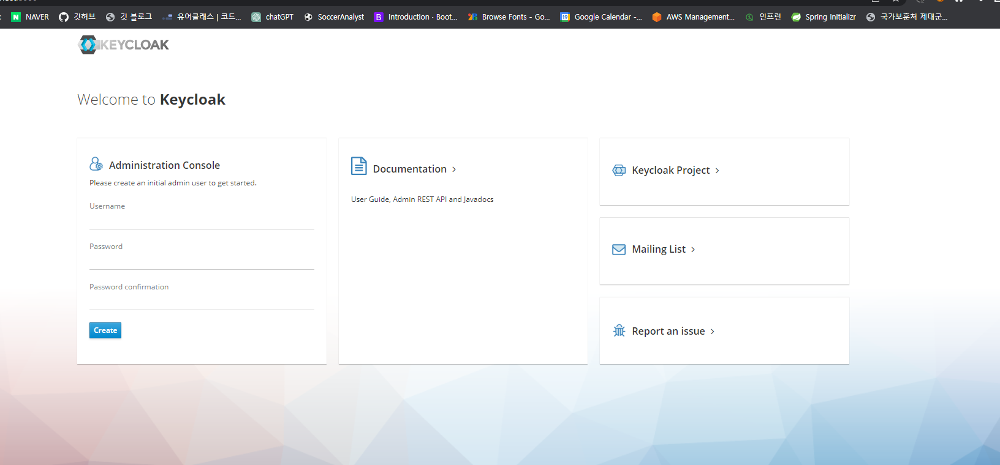

먼저 아이디를 만든 후 Administration Console 로 들어가서 로그인을 합니다.

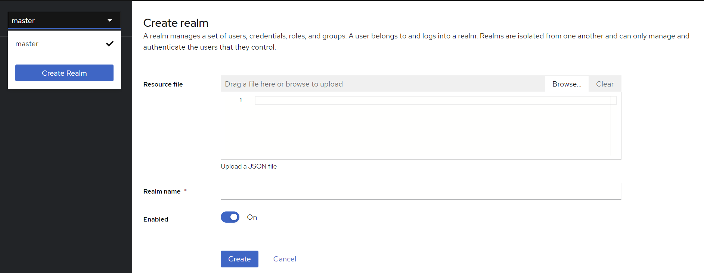

그리고 Create Realm 으로 영역을 만듭니다. 이름은 oauth2 로 하겠습니다.

## Client 생성

Clients 탭으로 들어가서 `Create Client` 버튼을 누릅니다.

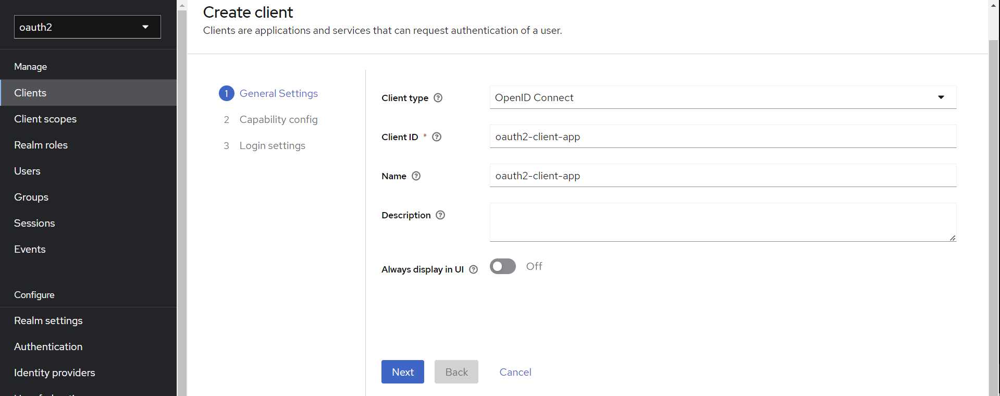

Client type 은 OpenID Connect 로 합니다.

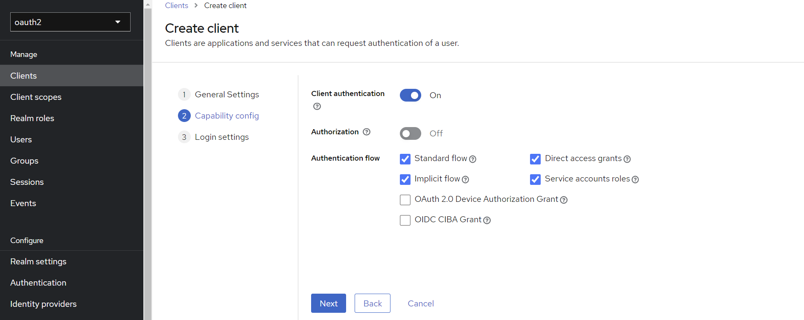

다음 화면에서 위와 같이 체크하고 넘어갑니다.

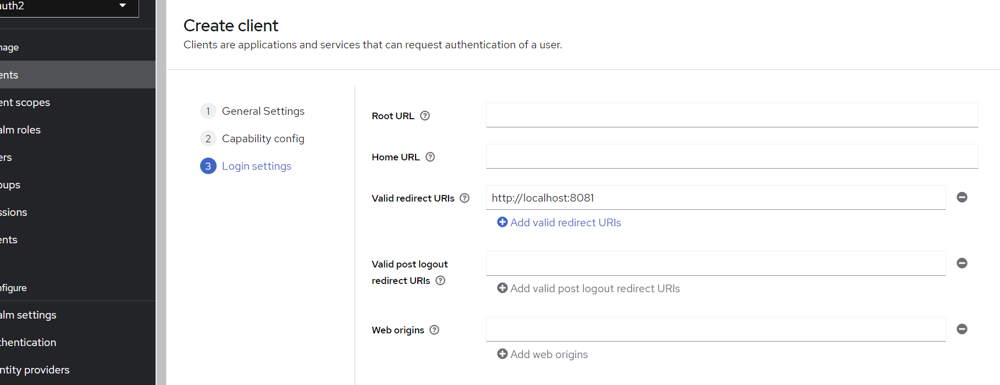

redirect URI 는 8081 포트로 합니다. 8080 포트는 Keycloak 가 사용하기 때문입니다.

## User 생성

Users 탭으로 들어가 `Add user` 버튼을 누릅니다.

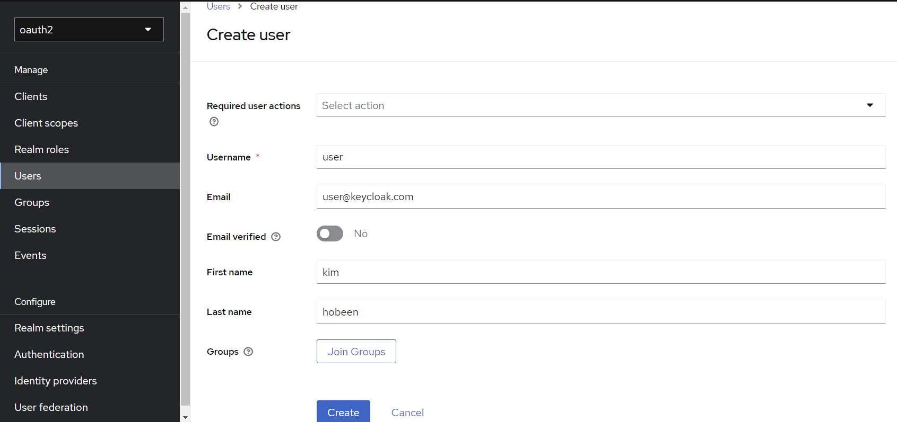

위와 같이 만들고 생성합니다.

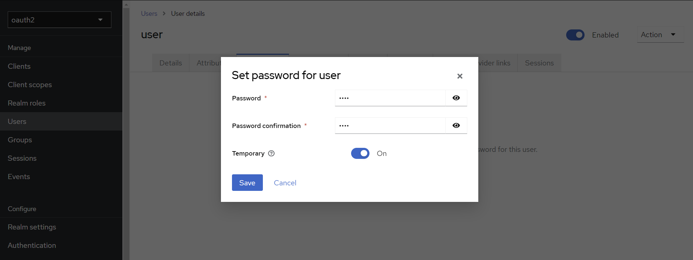

만들면 해당 user 의 콘솔창이 뜨는데, Credentials 탭에서 패스워드를 지정합니다.

# openid scope 추가

keycloak 버전이 올라가면서 openid scope 를 누락시킨 경우 유저 정보 요청 시 403 이 노출됩니다. 따라서 아래와 같이 설정해줍니다.

1. keycloak > 왼쪽 탭 > Client scopes > Create client scope > 'openid' 이름으로 default type 생성

   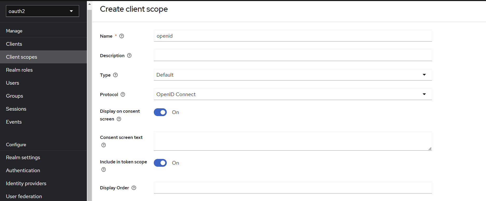

2. keycloak > 왼쪽 탭 > Client > oauth2-client-app > Client scopes > Add client scope > 2번에서 생성한 openid default 값으로 추가

   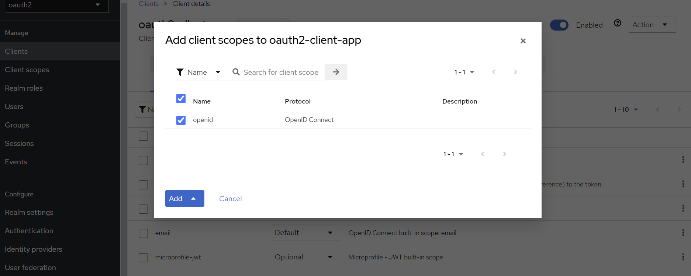

# **OAuth 2.0 Roles**

OAuth 2.0 메커니즘은 다음 네 가지 종류의 역할을 담당하는 주체들에 의해 이루어지는 권한부여 체계입니다.

 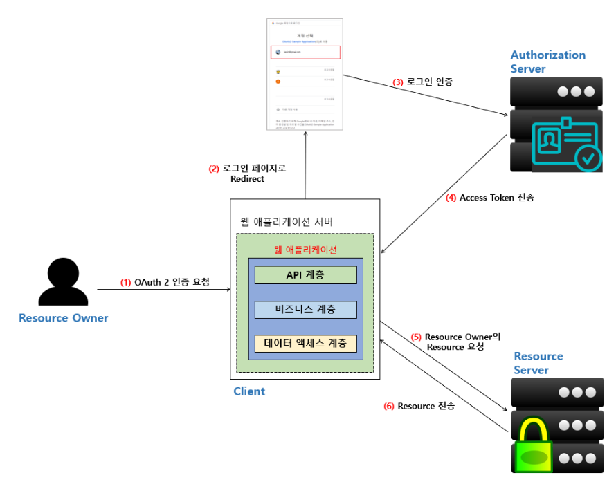

1. **Resource Owner** (자원 소유자)
   - 보호된 자원에 대한 접근 권한을 부여할 수 있는 주체, 사용자로서 계정의 일부에 대한 접근 권한을 부여하는 사람
   - 사용자를 대신하여 작동하려는 모든 클라이언트는 먼저 사용자의 허가를 받아야 합니다.
2. **Resource Server** (보호자원서버)
   - 타사 어플리케이션에서 접근하는 사용자의 자원이 포함된 서버를 의미합니다.
   - 액세스 토큰을 수락 및 검증할 수 있어야 하며 권한 체계에 따라 요청을 승인할 수 있어야 합니다.
3. **Authorization Server** (인가서버)
   - 클라이언트가 사용자 계정에 대한 동의 및 접근을 요청할 때 상호 작용하는 서버로서 클라이언트의 권한 부여 요청을 승인하거나 거부하는 서버
   - 사용자가 클라이언트에게 권한 부여 요청을 승인한 후 access token 을 클라이언트에게 부여하는 역할
4. **Client** (클라이언트)
   - 사용자를 대신하여 권한을 부여받아 사용자의 리소스에 접근하려는 어플리케이션
   - 사용자를 권한 부여 서버로 안내하거나 사용자의 상호 작용 없이 권한 부여 서버로부터 직접 권한을 얻을 수 있습니다.

## postman 을 통한 실습

​	postman 이 클라이언트 서버, keycloak 이 인가 및 리소스 서버입니다.

keycloak 의 왼쪽 탭에서 Realm setting 을 들어가면 아래에 Endpoints 부분에 OpenID Endpoint Configuration 을 클릭하면 다음과 같이 엔드포인트를 얻을 수 있습니다.

클라이언트(postman) 은 먼저 authorization_endpoint 로 자원 소유자를 보내서 인가를 받게 한 후 인가받은 코드를 통해 token_endpoint 에서 access_token 을 발급받습니다. 이후 해당 토큰으로 userinfo_endpoint 에 접근할 수 있습니다.

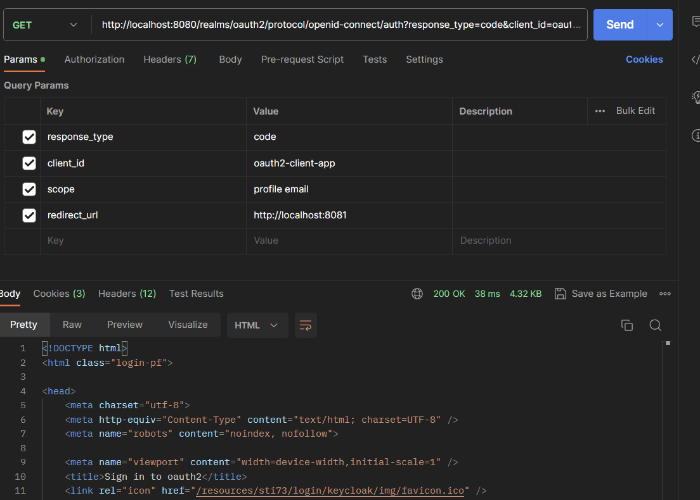

​	먼저 authorization_endpoint 에 접근해야 하는데요. 필요한 parameters 는 위와 같습니다. 해당 url 로 접근하면 로그인 정보가 뜨는데, 위에서 설정한 keycloak 을 세팅하면서 만든 user 정보를 입력합니다. (ID, PW)

​	해당 로그인은 포스트맨으로 하기 어려우니 브라우저로 합니다.

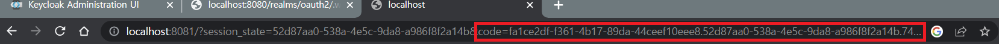

인가를 받으면 다음과 같이 code 를 받을 수 있습니다.

이제 해당 코드를 token_endpoint 로 POST 방식으로 보냅니다. BODY 값은 아래와 같습니다.

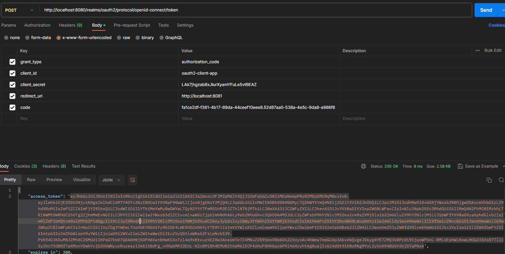

그러면 응답값으로 accessToken 과 만료시간, refreshToken 등이 옵니다.

마지막으로 GET 방식으로 userinfo 로 접근합니다. 이때 accessToken 을 Bearer 방식으로 함께 보내면 됩니다.

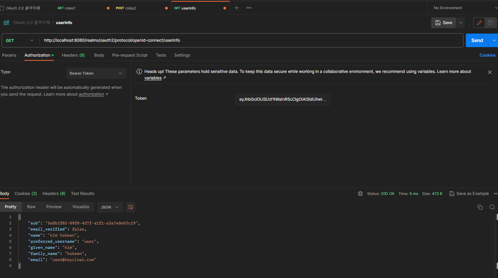

# Oauth 2.0 Client Types

​	클라이언트 타입에는 기밀 클라이언트(Confidential Clients) 와 공개 클라이언트(Public Clients) 가 있습니다.

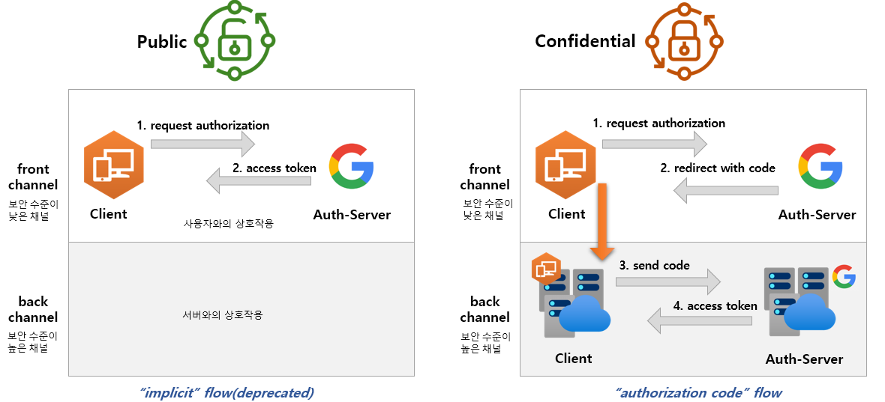

## 공개 클라이언트 (Public Clients)

- 공개 클라이언트는 client_secret 의 기밀을 유지할 수 없으므로 이러한 앱에는 secret 이 사용되지 않습니다. 
- 브라우저(SPA) 에서 실행되는 JavaScript 애플리케이션, Android 또는 iOS 모바일 앱, 데스크톱에서 실행되는 기본 앱뿐만 아니라 IoT/임베디드 장치에서 실행되는 애플리케이션 등이 있습니다.
- Chrome 개발자 콘솔이나 디스어셈블러와 같은 디버깅 도구를 사용하여 바이너리/실행 코드에서 기밀 정보를 추출할 수 있기 때문에 공개로 간주됩니다.
- 서버측이 아닌 리소스 소유자가 사용하는 장치에서 실행되는 모든 클라이언트는 공개 클라이언트로 간주되어야 합니다.

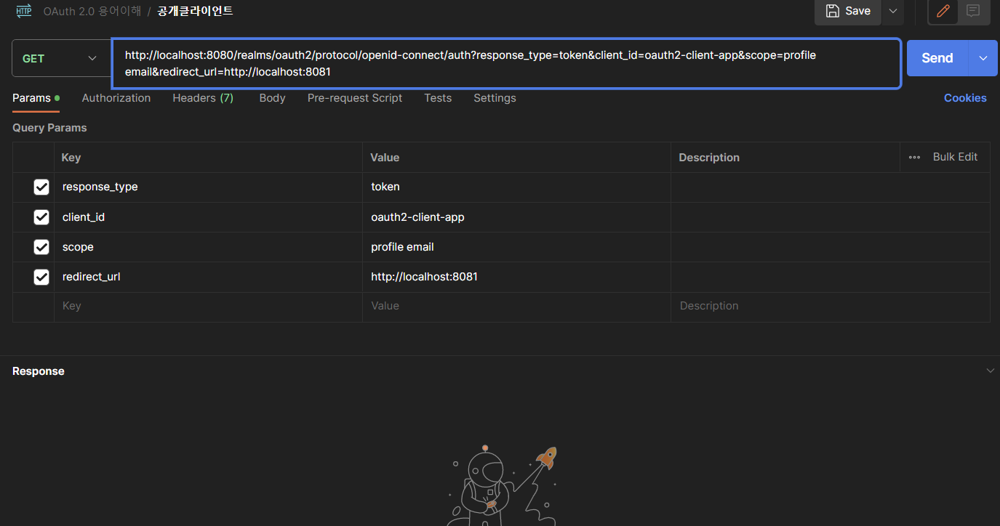

공개 클라이언트는 기밀 클라이언트와 달리 response_type 을 token 으로 해서 accessToken 을 바로 발급받습니다. 

## 기밀 클라이언트 (Confidential Clients)

- 기밀 클라이언트는 client_secret 의 기밀성을 유지할 수 있는 클라이언트를 의미합니다.
- 일반적으로 사용자가 소스 코드에 액세스할 수 없는 서버에서 실행되는 응용 프로그램으로 NET, Java, PHP 및 Node.JS와 같은 서버 측 언어로 작성됩니다.
- 이러한 유형의 애플리케이션은 대부분 웹 서버에서 실행되기 때문에 일반적으로 웹 앱이라고 합니다.

​	처음 그림에서 Confidential 의 1, 2번 과정이 바로 위 챕터인 OAuth 2.0 Roles 에서 봤던 authorization_endpoint 로 code 를 요청하는 과정입니다. 3, 4번 과정은 token_endpoint 로 POST 방식으로 보낸 과정입니다.

# Oauth 2.0 Token Types

​	Token 타입 중 Access Token, Refresh Token, Authorization Code 를 알아보겠습니다.

## 토큰 타입

**Access Token**

- 클라이언트에서 사용자의 **보호된 리소스에 접근하기 위해 사용하는 일종의 자격 증명**으로서 역할을 하며 리소스 소유자가 클라이언트에게 부여한 권한 부여의 표현입니다.
- **일반적으로 JWT(JSON Web Tokens) 형식을 취하지만** 사양에 따라 그럴 필요는 없습니다.
- 토큰에는 해당 액세스 기간, 범위 및 서버에 필요한 기타 정보가 있습니다.
- 타입에는 **식별자 타입 (Identifier Type)** 과 **자체 포함타입 (Self-contained Type)** 이 있다

**Refresh Token**

- 액세스 토큰이 만료된 후 새 액세스 토큰을 얻기 위해 클라이언트 응용 프로그램에서 사용하는 자격 증명입니다.
- 액세스 토큰이 만료되는 경우 클라이언트는 권한 부여 서버로 인증하고 Refresh Token 을 전달합니다.
- 인증 서버는 Refresh Token 의 유효성을 검사하고 새 액세스 토큰을 발급합니다.
- Refresh Token 은 액세스 토큰과 달리 권한 서버 토큰 엔드포인트에만 보내지고 리소스 서버에는 보내지 않습니다.

**Authorization Code**

- 권한 부여 코드 흐름에서 사용되며 이 코드는 **클라이언트가 액세스 토큰과 교환할 임시 코드**입니다.
- 사용자가 클라이언트가 요청하는 정보를 확인하고 인가 서버로부터 리다이렉트 되어 받아옵니다.

## Access Token 유형

**식별자 타입**(Identifier Type)

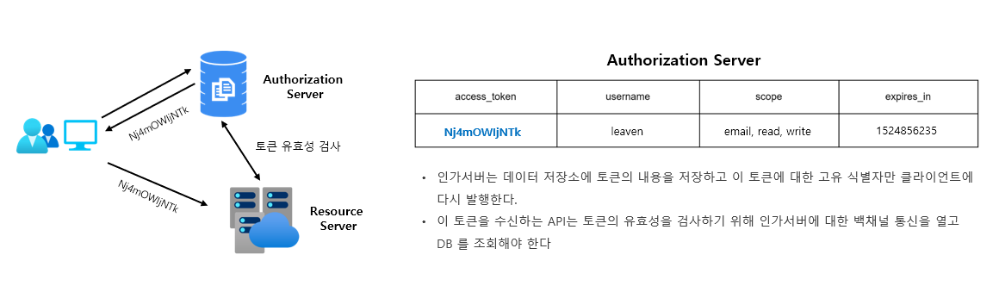

식별자 타입에서 Access Token 은 일종의 난수값으로, 토큰 내부적으로는 어떠한 정보도 담겨져있지 않습니다.

**자체 포함 타입**(Self-Contained Type)

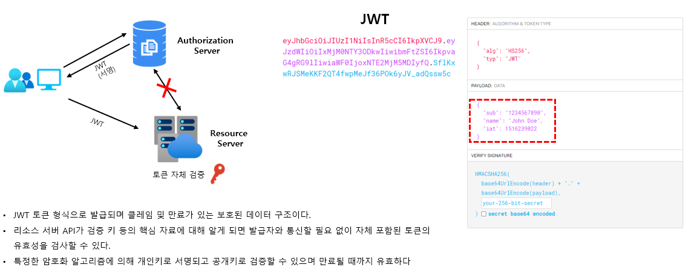

JWT 형식으로 발급되며 클레임 및 만료가 있는 보호된 데이터 구조입니다. 토큰 자체적으로 의미있는 데이터를 가지고 있습니다.