# OAuth 2.0 Grant Type 개요

​	권한부여란 클라이언트가 사용자를 대신해서 사용자의 승인하에 인가서버로부터 권한을 부여받는 것을 의미합니다.

## 권한 부여 유형

1. **Authorization Code Grant Type**
   - 권한 코드 부여 타입, 서버 사이드 어플리케이션(웹 어플리케이션), 보안에 가장 안전한 유형
2. **Implicit Grant Type** **(Deprecated)**
   - 암시적 부여 타입, 공개 클라이언트 어플리케이션 (SPA 기반 자바스크립트 앱, 모바일 앱), 보안에 취약
3. **Resource Owner Password Credentials Grant Type** **(Deprecated)**
   - 리소스 사용자 비밀번호 자격증명 부여 타입, 서버 어플리케이션, 보안에 취약
4. **Client Credentials Grant Type**
   - 클라이언트 자격 증명 권한 부여 타입 , UI or 화면이 없는 서버 어플리케이션
5. **Refresh Token Grant Type**
   - 새로고침 토큰 부여 타입, Authorization Code, Resource Owner Password Type 에서 지원
6. **PKCE-enhanced Authorization Code Grant Type**
   - PKCE 권한 코드 부여 타입 , 서버 사이드 어플리케이션, 공개 클라이언트 어플리케이션
   - Authorization Code Grant Type 보다 보안이 더 강화된 타입

어느 방식을 선택할지는 keycloak 에서 해당 clients 의 Settings 에 보면 선택해놨습니다.

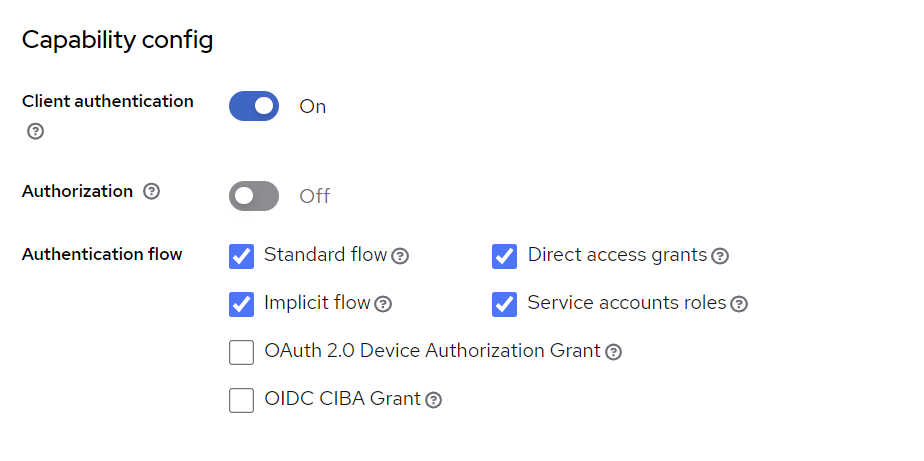

## 권한 부여 흐름 선택 기준

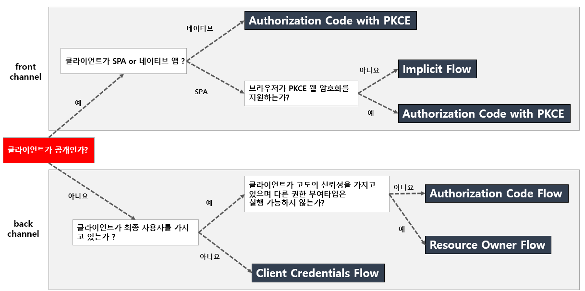

## 매개 변수 용어

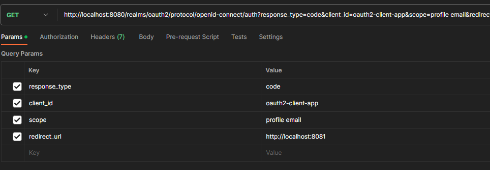

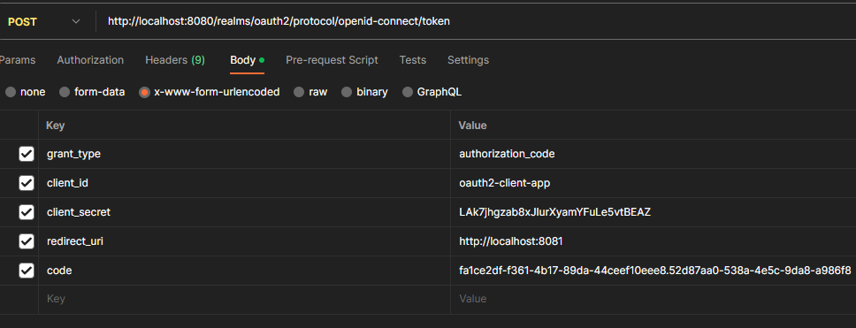

이전 챕터에서 위와 같이 여러 매개 변수를 보냈는데, 각각의 의미를 알아보겠습니다.

1. **client_id**

   - 인가서버에 등록된 클라이언트에 대해 생성된 고유 키

2. **client_secret**

   - 인가서버에 등록된 특정 클라이언트의 client_id 에 대해 생성된 비밀 값

3. **response_type**

   - 애플리케이션이 권한 부여 코드 흐름을 시작하고 있음을 인증 서버에 알려줍니다.
   - code, token, id_token 이 있으며 token, id_token 은 인가 서버가 implicit 권한부여 유형을 지원해야 합니다.
   - 서버가 쿼리 문자열에 인증 코드(code), 토큰(token, id_token) 등을 반환합니다.

4. **grant_type**

   - 권한 부여 타입 지정 - authorization_code, password, client_credentials, refresh_token

5. **redirect_uri**

   - 사용자가 응용 프로그램을 성공적으로 승인하면 권한 부여 서버가 사용자를 다시 응용 프로그램으로 리디렉션합니다.
   - **redirect_uri** 가 초기 권한 부여 요청에 포함된 경우 (response_type 이 code 일 때) 서비스는 토큰 요청에서도 이를 요구해야 합니다.
   - 토큰 요청의 **redirect_uri** 는 인증 코드를 생성할 때 사용된 **redirect_uri** 와 정확히 일치해야 합니다. 그렇지 않으면 서비스는 요청을 거부해야 합니다.

6. **scope**

   - 어플리케이션이 사용자 데이터에 접근하는 것을 제한하기 위해 사용됩니다. – email profile read write..
   - 사용자에 의해 특정 스코프로 제한된 권한 인가권을 발행함으로써 데이터 접근을 제한합니다.

7. **state**

   - 응용 프로그램은 **임의의 문자열을 생성**하고 요청에 포함하고 사용자가 앱을 승인한 후 서버로부터 동일한 값이 반환되는지 확인해야 합니다.

   - 이것은 CSRF 공격 을 방지하는 데 사용됩니다.

     

     - 위와 같이 state 값을 임의로 주면, 인가 서버는 해당 값을 동일하게 반환해야 code 를 신뢰할 수 있게 됩니다.

# Authorization Code Grant Type - 권한 부여 코드 승인 방식

​	6가지 권한부여 방식 중 Authorization Code Grant Type 입니다. 해당 타입은 사용자가 애플리케이션을 승인하면 인가서버는 Redirect URI 로 임시 코드 담아서 애플리케이션으로 다시 리다이렉션하는 방식입니다. <u>애플리케이션은 해당 임시 코드를 인가서버로 전달하고 액세스 토큰으로 교환합니다.</u>

​	애플리케이션이 액세스 토큰을 요청할 때 해당 요청을 클라이언트 암호로 인증할 수 있으므로 공격자가 인증 코드를 가로채서 스스로 사용할 위험이 줄어듭니다. 또한 액세스 토큰이 사용자 또는 브라우저에 표시되지 않고 애플리케이션에 다시 전달하는 가장 안전한 방법이므로 토큰이 다른 사람에게 누출될 위험이 줄어듭니다.

​	권한부여 요청 시 매개변수는 아래와 같습니다.

- response_type=code (필수)
- client_id (필수)
- redirect_uri (선택사항)
- scope (선택사항)
- state (선택사항)

​	액세스토큰 교환 요청 시 매개변수는 아래와 같습니다.

- grant_type=authorization_code (필수)
- code (필수)
- redirect_uri (필수 : 리다이렉션 URL이 초기 승인 요청에 포함된 경우) 
- client_id (필수)
- client_secret (필수)

위에 "매개변수 용어" 부분의 캡처본이 바로 Authorization Code Grant Type 방식입니다.

## 흐름

먼저 인가서버로 Authorization code 를 요청합니다.

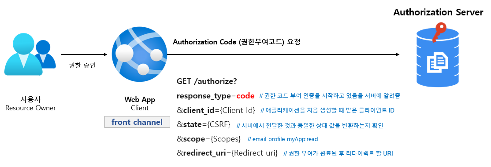

사용자가 인증되어있지 않다면 사용자의 승인 및 동의하에 인가서버가 클라이언트에게 코드를 발급합니다. 

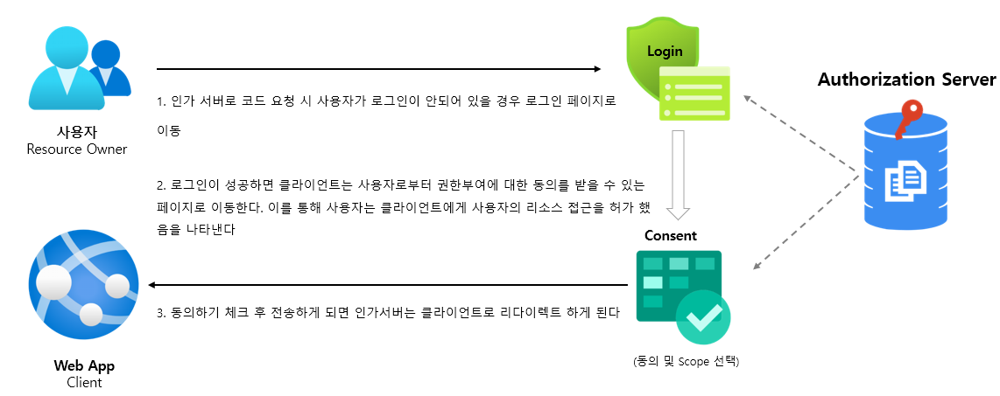

여기까지가 프론트 채널에서 code 를 요청하는 흐름입니다. 

이제 백 채널에서 code 를 통해 토큰을 발급받습니다.

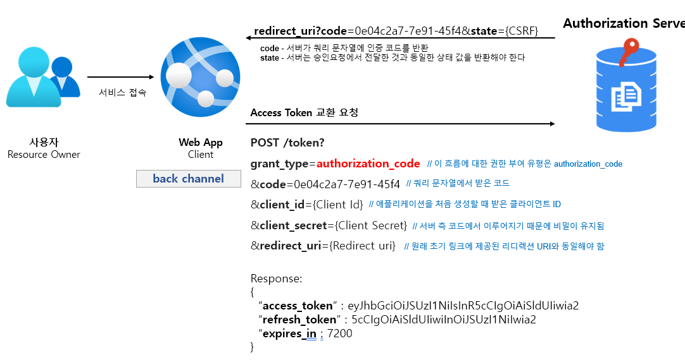

전체적인 흐름은 아래와 같습니다.

1. 자원 소유자가 클라이언트 서비스로 접속을 합니다.
2. 클라이언트는 인가 서버에 권한부여코드를 요청합니다.
3. 인가 서버는 자원소유자에게 로그인 페이지 보여줍니다.
4. 자원소유자는 인가 서버를 통해 로그인을 합니다.
5. 인가 서버는 어느 자원을 허용할지 동의 페이지를 보여줍니다.
6. 자원소유자는 동의 페이지를 통해 scope 를 설정합니다.
7. 인가 서버는 리다이렉트 위치로 권한부여코드를 응답합니다.
8. 클라이언트는 권한부여코드를 통해 Token 을 요청합니다.
9. 인가 서버는 AccessToken 과 RefreshToken 을 클라이언트에게 전달합니다.
10. ~ 13. 클라이언트는 Token 만료 시까지 해당 토큰으로 자원을 사용합니다.

## 실습

먼저 다음과 같이 response_type 을 code 로 해서 아래와 같이 요청합니다. 

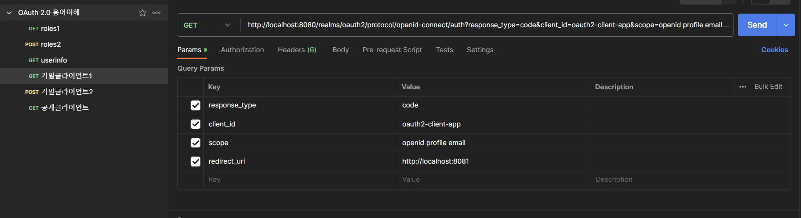

이 때 해당 요청은 로그인이 필요하기 때문에 브라우저에서 진행합니다.

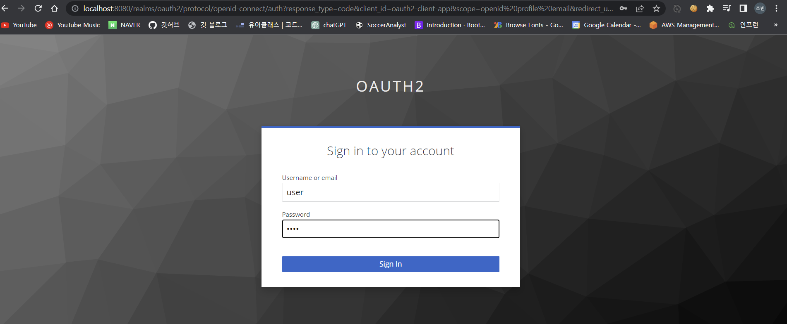

로그인에 성공하면 다음과 같이 url 에 코드가 포함되어서 리다이렉트됩니다.

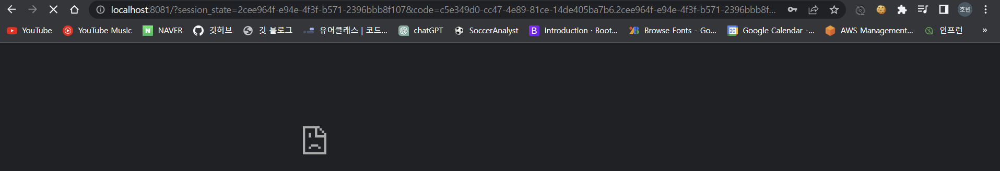

해당 code 를 통해 grant_type 을 authorization_code 로 해서 token 을 요청하면 됩니다. <u>참고로 해당 code 로 한번 token 을 요청하면 code 재사용은 불가능합니다. (1회용)</u>

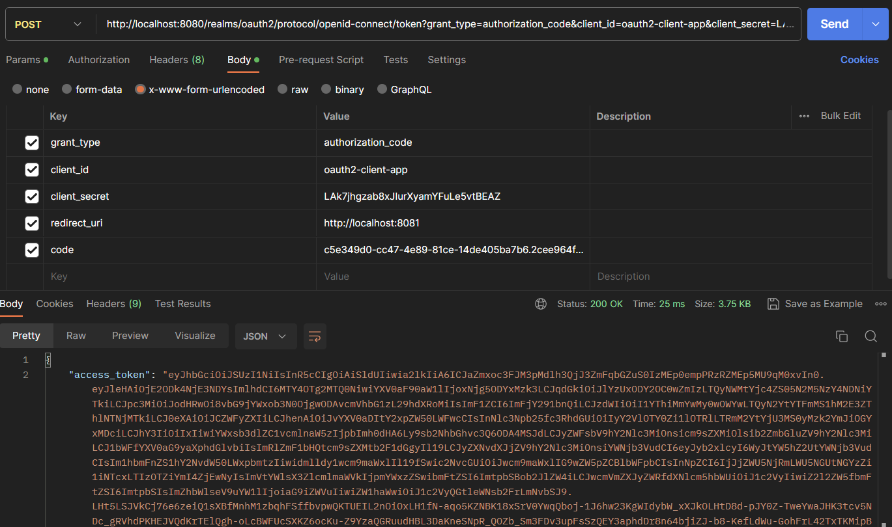

# Implicit Grant Type - 암묵적 승인 방식

​	Implicit Grant Type 방식은 클라이언트에서 Javascript 및 HTML 소스 코드를 다운로드한 후 브라우저는 서비스에 직접 API 요청을 하는 방식입니다. 코드 교환 단계를 건너뛰고 대신 액세스 토큰이 쿼리 문자열 조각으로 클라이언트에 즉시 반환됩니다. 이 유형은 back channel 이 없으므로 refresh token 을 사용하지 못합니다. 따라서 토큰 만료 시 어플리케이션이 새로운 access token을 얻으려면 다시 OAuth 승인 과정을 거쳐야 합니다.

​	권한 부여 승인 요청 시 매개변수는 아래와 같습니다.

- response_type=token (필수), id_token
- client_id (필수)
- redirect_uri (필수)
- scope (선택사항)
- state (선택사항)

## 흐름

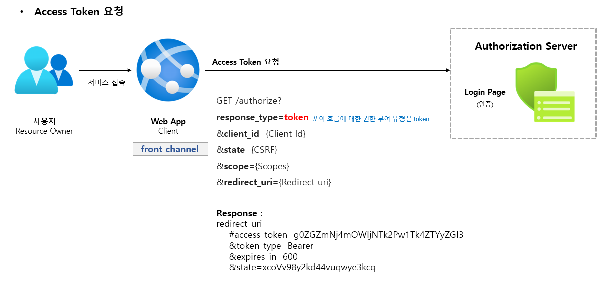

프론트 채널에서 바로 Access Token 을 요청하고, url 로 받습니다.

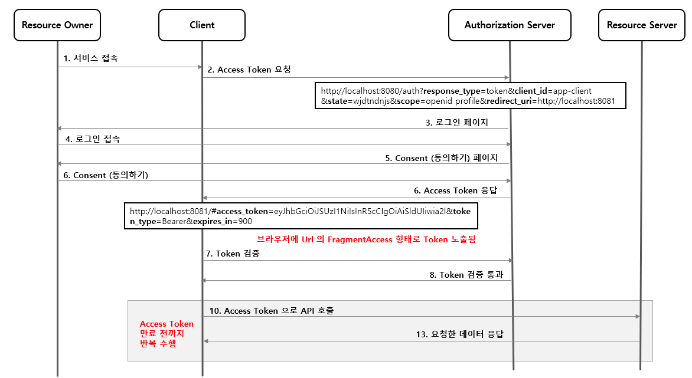

## 실습

​	아래와 같이 파라미터를 설정하고 보냅니다.

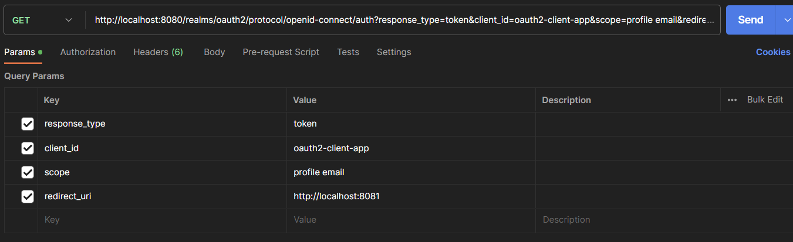

마찬가지로 로그인이 필요하기 때문에 포스트맨으로 하면 힘들고, 브라우저로 진행합니다. 그러면 아래와 같이 응답을 받을 수 있습니다.

`http://localhost:8081/#session_state=2cee964f-xxx&access_token=xxx....&token_type=Bearer&expires_in=900`

FragmentAccess 형태로  access Token, 만료시간, 토큰 타입 등이 있습니다.

# Resource Owner Password Credentials Grant Type

​	패스워드 자격증명 승인 방식입니다. 애플리케이션이 **사용자 이름과 암호를 액세스 토큰으로 교환**할 때 사용됩니다. 타사 어플리케이션이 이 권한을 사용하도록 허용해서는 안되고 고도의 신뢰할 자사 어플리케이션에서만 사용해야 합니다.

​	권한 부여 승인 요청 시 매개변수는 아래와 같습니다.

- grant_type=password (필수)
- username (필수)
- password (필수)
- client_id (필수)
- client_secret (필수)
- scope (선택사항)

## 흐름

토큰 요청의 흐름은 아래와 같습니다. **요청 End Point ㅕ기 는 token_endpoint 입니다.**

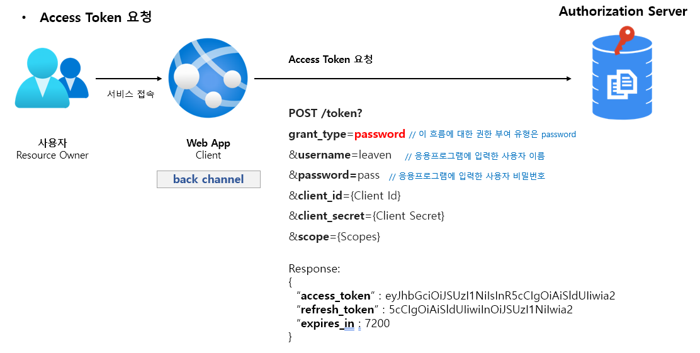

grant_type 을 password 로 해서 username 과 password 를 모두 인가 서버로 넘기면 인가 서버는 응답으로 access Token 과 refresh Token, 만료시간을 응답합니다.

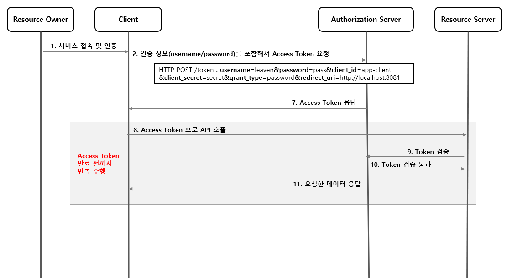

## 실습

​	포스트맨에서 다음과 같이 바로 전송하면 됩니다.

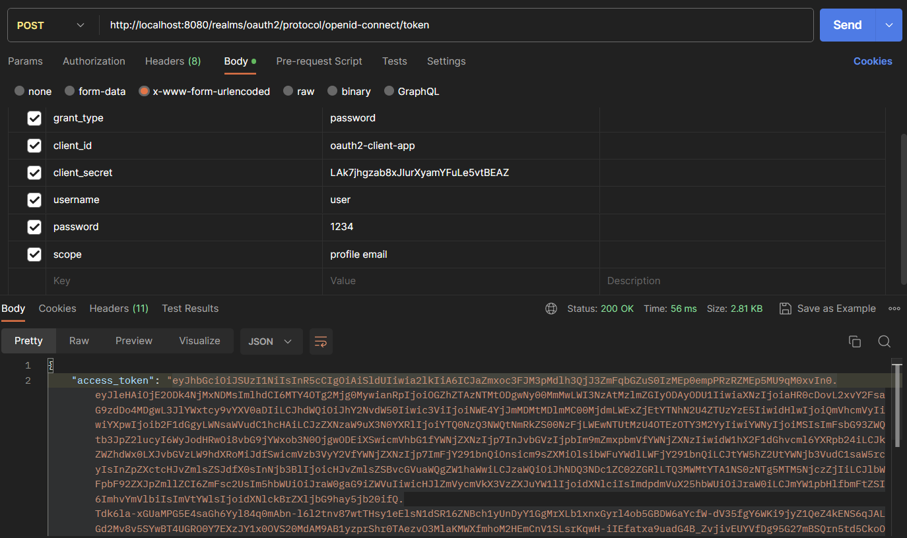

client 의 ID 와 secret, 그리고 user 의 ID 와 PW 가 필요합니다. 응답값으로 바로 토큰이 오는 걸 알 수 있습니다.

# Client Credentials Grant Type - 클라이언트 자격증명 승인 방식

​	해당 승인 방식에서는 **애플리케이션이 리소스 소유자인 동시에 클라이언트의 역할을 합니다.** 즉,  리소스 소유자에게 권한 위임 받아 리소스에 접근하는 것이 아니라 자기 자신이 애플리케이션을 사용할 목적으로 사용하는 것입니다. 서버 대 서버간의 통신에서 사용할 수 있으며 IOT 와 같은 장비 어플리케이션과의 통신을 위한 인증으로도 사용할 수 있습니다.

​	Client Id 와 Client Secret 을 통해 액세스 토큰을 바로 발급 받을 수 있기 때문에 Refresh Token 을 제공하지 않습니다. 또한 Client 정보를 기반으로 하기 때문에 사용자 정보를 제공하지 않습니다.

권한 부여 승인 요청 시 매개변수는 아래와 같습니다.

- grant_type=client_credentials (필수)
- client_id (필수)
- client_secret (필수)
- scope (선택사항)

## 흐름

​	아래와 같이 서버가 자신의 client_id 와 secret 으로 간단하게 토큰을 발급받습니다.

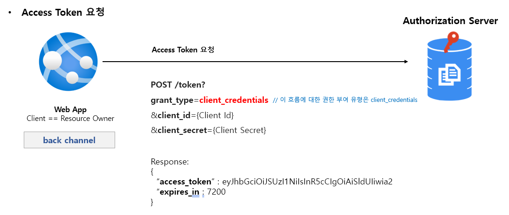

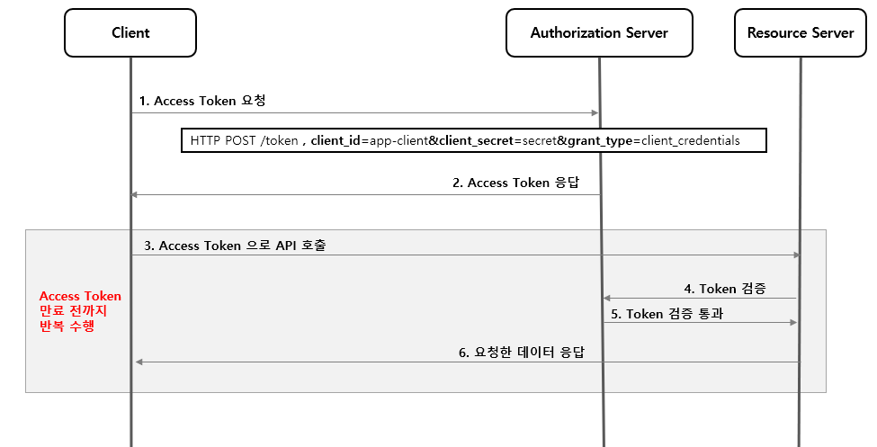

## 실습

​	엔드 포인트는 토큰 발급 엔드 포인트입니다.

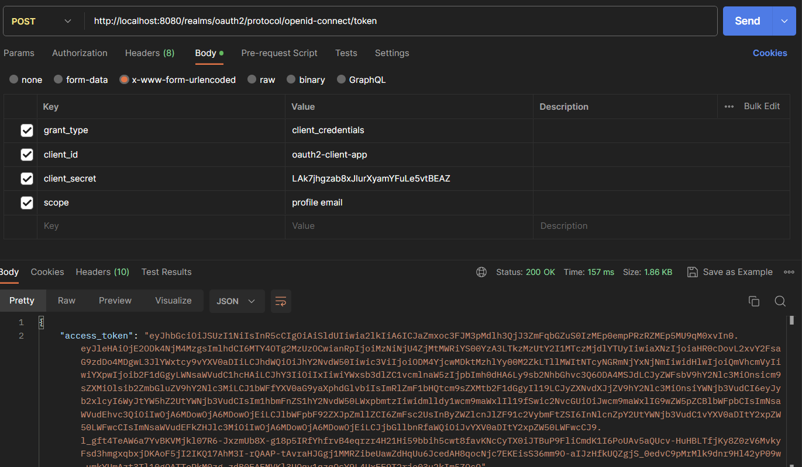

응답값에는 access_token 만 있습니다.

해당 access_token 으로 userinfo 를 요청해보겠습니다.

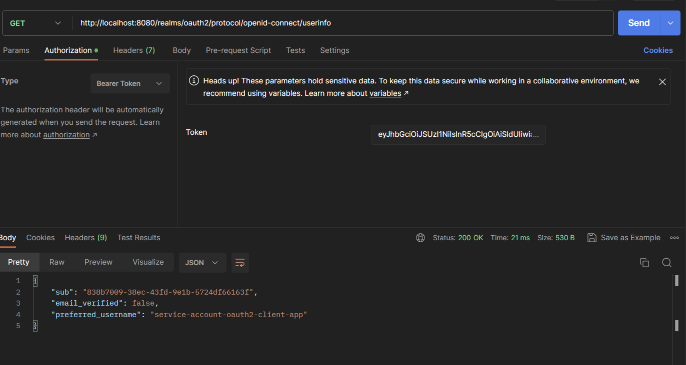

응답값을 보면 userinfo 가 아닌 client 의 아이디만 있습니다. 즉, 이 정보는 user 가 포함되어있지 않은 겁니다. 서버 대 서버 통신이므로 자기 자신만 증명하면 되기 떄문입니다.

# Refresh Token Grant Type - 리프레시 토큰 승인 방식

​	해당 토큰은 액세스 토큰이 발급될 때 함께 제공되는 토큰으로서 액세스 토큰이 만료되더라도 함께 발급받았던 리프레시 토큰이 유효하다면, 인증 과정을 처음부터 반복하지 않아도 액세스 토큰을 재발급 받을 수 있습니다. 한 번 사용된 리프레시 토큰은 폐기되거나 재사용 할 수 있습니다.

권한 부여 승인 요청 시 매개변수는 아래와 같습니다.

- grant_type=refresh_token (필수)
- refresh_token
- client_id (필수)
- client_secret (필수)

## 흐름

​	흐름은 Client Credentials Grant Type 과 비슷한 듯 합니다. 백 채널에서 자체적으로 refresh_token 을 요청해서 토큰을 재발급 받습니다.

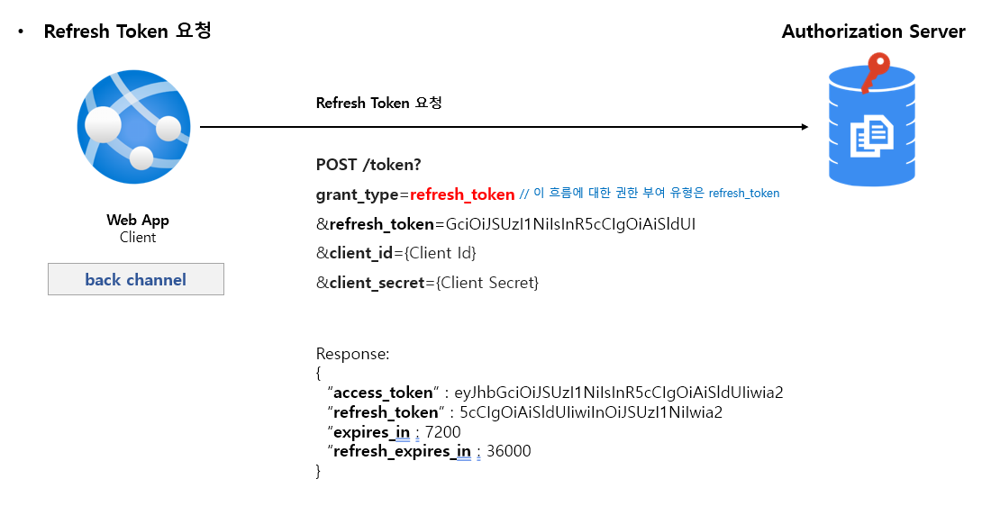

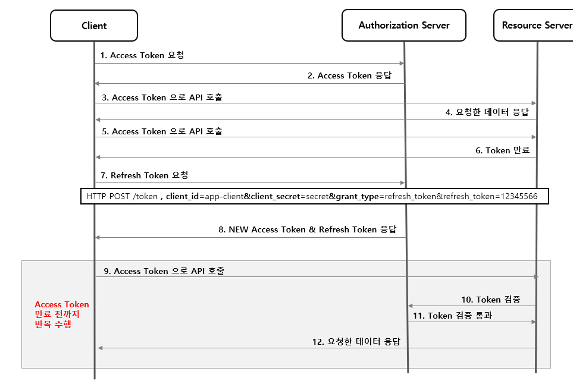

## 실습

​	아래와 같이 요청합니다. 요청 url 은 token endpoint 입니다. refresh Token 은 password grant type 으로 발급받았습니다.

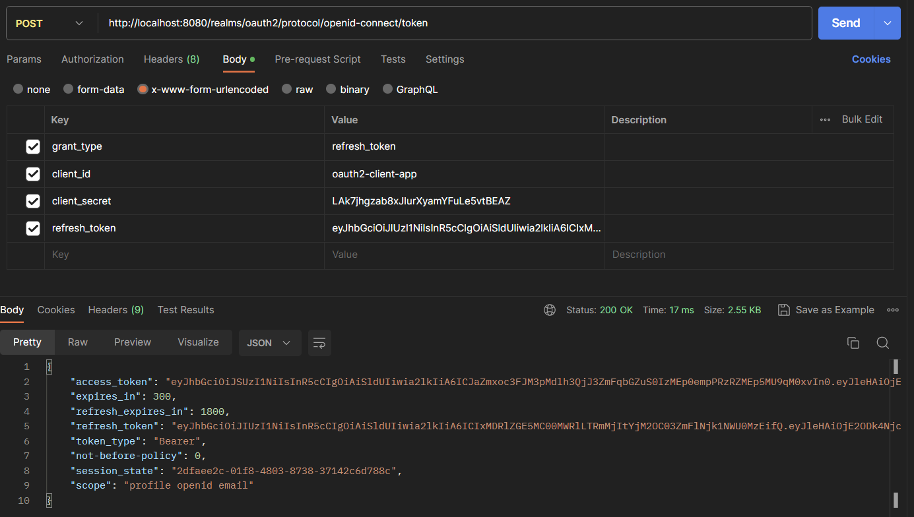

응답값에는 access_token 과 refresh_token 이 있습니다.

# PKCE - enhanced Authorization Code Grant Type

​	PKCE(Proof Key for Code Exchange) 방식은 코드 교환을 위한 증명 키로서 CSRF 및 권한부여코드 삽입 공격을 방지하기 위한 Authorization Code Grant Flow 의 확장버전입니다.

​	권한부여코드 요청시 <u>Code Verifier와 Code Challenge 를 추가</u>하여 만약 Authorization Code Grant Flow 에서 Authrozization Code 가 탈취당했을 때 Access Token을 발급하지 못하도록 차단합니다.

​	PKCE 는 원래 <u>모바일 앱에서 Authorization Code Grant Flow 를 보호하도록 설계되었으며</u> 나중에 단일 페이지 앱에서도 사용하도록 권장되었으며 모든 유형의 OAuth2 클라이언트, 심지어 클라이언트 암호를 사용하는 웹 서버에서 실행되는 앱에도 유용합니다.

## 코드 생성

1. **Code Verifier**
   - 권한부여코드 요청 전에 앱이 원래 생성한 PKCE 요청에 대한 코드 검증기
   - 48 ~ 128 글자수를 가진 무작위 문자열
   - A-Z a-z 0-9 -._~ 의 ASCII 문자들로만 구성됨
2. **Code Challenge**
   - 선택한 Hash 알고리즘으로 **Code Verifier를 Hashing 한 후 Base64 인코딩을 한 값**
     - ex) Base64Encode(Sha256(ASCII(Code Verifier)))
   - 만약 Code Challenge Method 가 plain 이면 Code Verifier 와 동일한 값을 가집니다.
3. **Code Challenge Method**
   - Code Challenge 값을 생성하는 방법을 의미합니다.
   - plain – Code Verifier 가 특정한 알고리즘을 사용하지 않도록 설정합니다.
   - S256 – Code Verifier 해시 알고리즘 사용하도록 설정합니다.

## 처리 흐름

1) 클라이언트는 code_verifier (무작위 문자열) 를 생성하고, code_challenge_method를 사용하여 code_challenge 를 계산합니다. 해당 값은 해시값일 수도 있고 plain 일 수도 있습니다.
2) 클라이언트가 /authorize 에 대한 요청을 작성합니다.
3) 권한 서버가 /authorize 에 대한 표준 OAuth2 요청 유효성 검증을 수행합니다.
4) 권한 서버가 code_challenge 및 code_challenge_method 의 존재를 확인합니다.
5) 권한 서버가 권한 코드에 대한 code_challenge 및 code_challenge_method 를 저장합니다.
6) 권한 서버가 권한 코드 응답을 리턴합니다.
7) 클라이언트가 추가 code_verifier (code challenge method 를 적용하기 전 문자열) 를 포함해 권한 코드를 /token 에 제공합니다.
8) 권한 서버가 /token 에 대한 표준 OAuth2 요청 유효성 검증을 수행합니다.
9) 권한 서버가 제공된 code_verifier 및 저장된 code_challenge_method를 사용하여 고유 code_challenge를 생성합니다.
10) 권한 서버가 생성된 code_challenge를 /authorize에 대한 초기 요청에 제공된 값과 비교합니다.
11) 두 값이 일치하면 액세스 토큰이 발행되고 일치하지 않으면 요청이 거부됩니다.

### code_challenge_method 검증

1. 권한 부여 코드 흐름에 있어 인가서버는 code_verifier를 검증하기 위해 code_challenge_method 을 이미 알고 있어야 합니다.
2. 토큰 교환시 code_challenge_method 가 plain 이면 인가서버는 전달된 code_verifier 와 보관하고 있는 code_challenge 문자열과 단순히 일치하는지 확인만 하면 됩니다.
3. code_challenge_method 가 S256 이면 인가서버는 전달된 code_verifier 를 가져와서 동일한 S256 해시 메소드를 사용하여 변환한 다음 보관된 code_challenge 문자열과 비교해서 일치 여부를 판단합니다.

## 흐름

​	먼저 code 를 요청할 때는 Authorization Code Grant Type 과 매개변수는 같으나 code_challenge 와 code_challenge_method 가 추가됩니다.

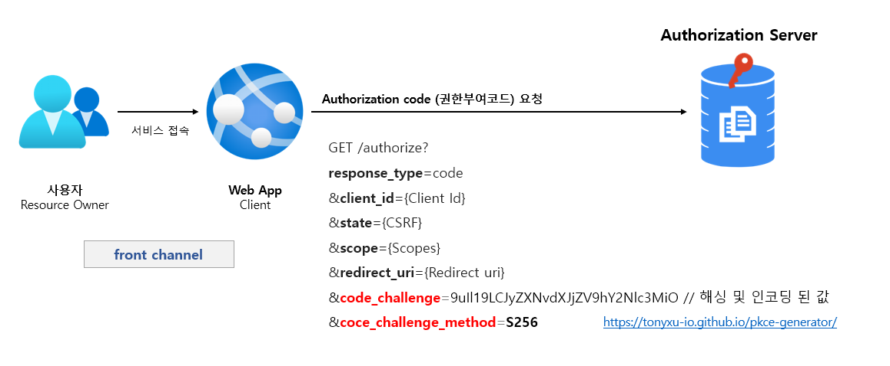

​	두 번째로 Access Token 을 요청할 때는 code_verifier 만 전달합니다. 그러면 인가 서버에서 code_verifier  에 code_challenge_method 를 적용해서 code_challenge 와 같은지 확인합니다.

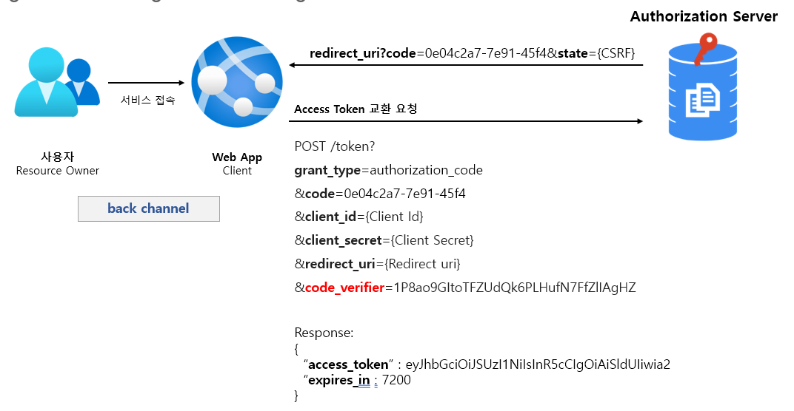

값이 같으면 토큰을 응답값으로 보냅니다.

## 실습

먼저 https://tonyxu-io.github.io/pkce-generator/ 사이트에서 PKCE 를 임의로 만듭니다.

`Generate Code Verifier` 를 누르면 임의의 값을 생성해주고 `Generate Code Challenge` 를 누르면 해당 값을 해시값으로 변경해줍니다.

​	code 요청은 아래와 같습니다.

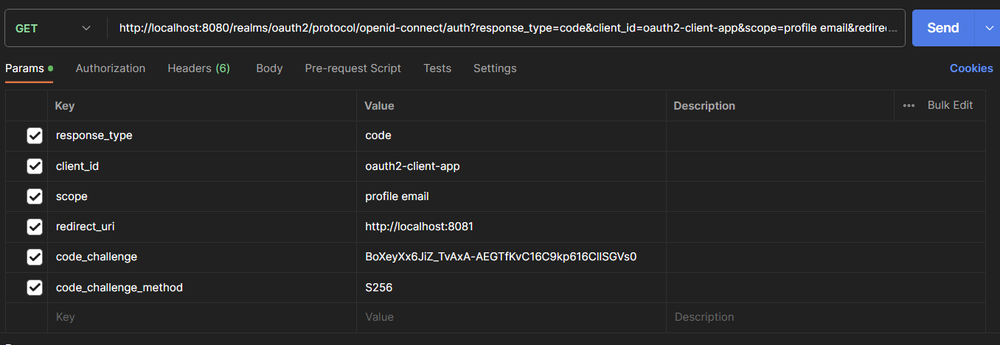

​	해당 url 로 접속하여 로그인을 하면 url 로 code 를 얻을 수 있습니다. 해당 코드와 함께 아래와 같이 `code_verifier` 를 보냅니다.

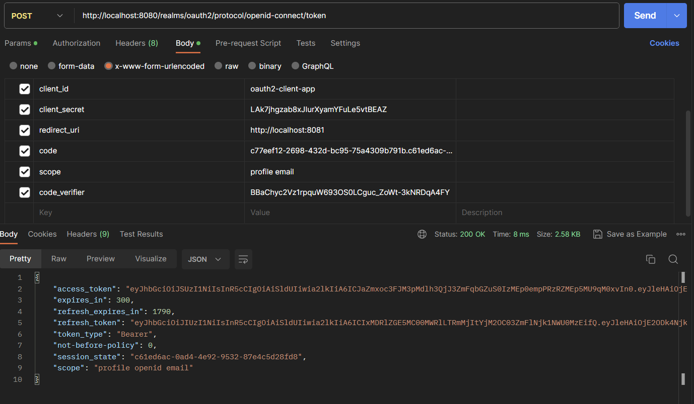

​	검증이 완료되면 토큰을 받을 수 있습니다.

만약 code_verifier 를 통한 검증에 실패한다면 아래와 같이 `"PKCE invalid code verifier"` 라는 에러메세지를 반환합니다.

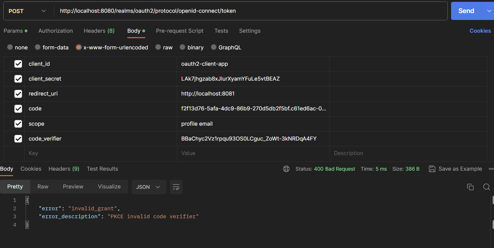