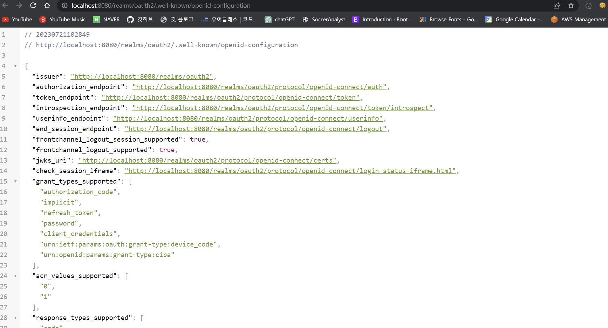
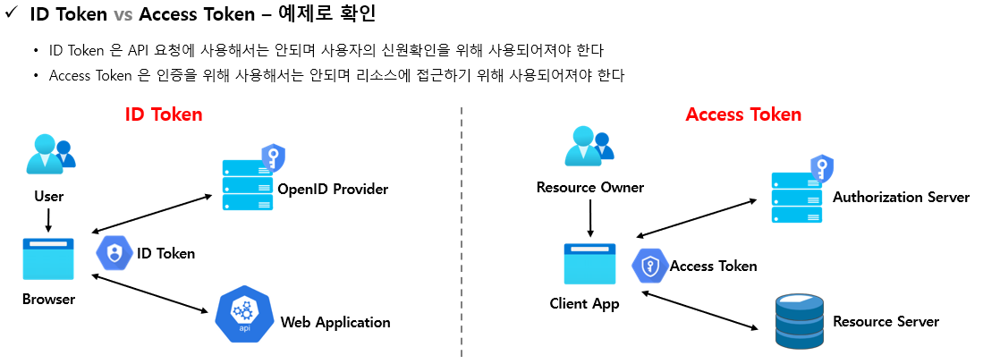
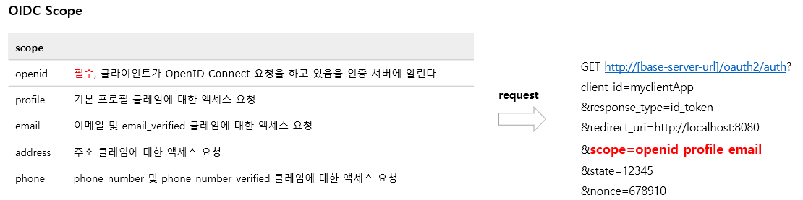
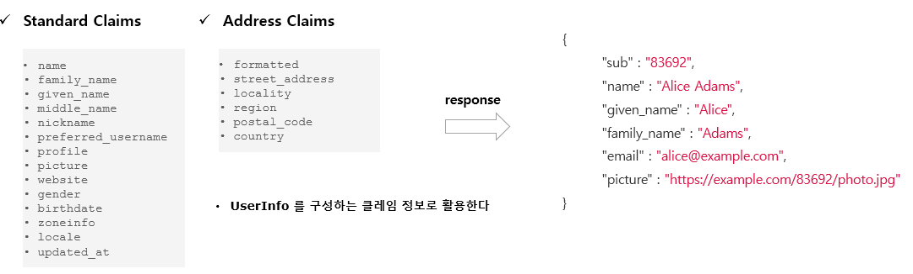
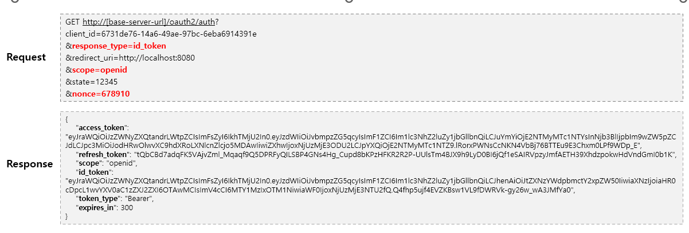
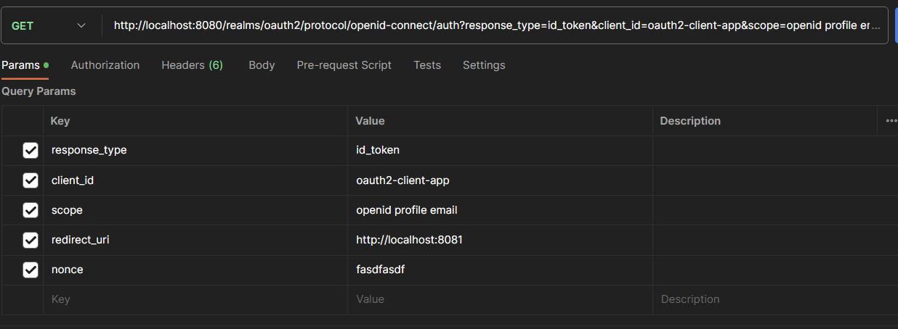
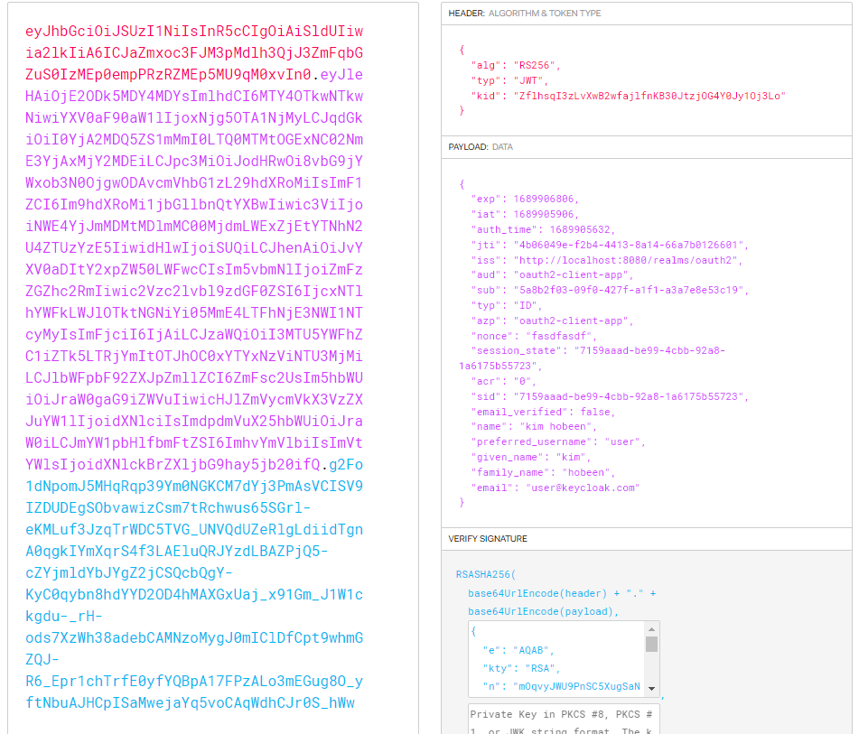
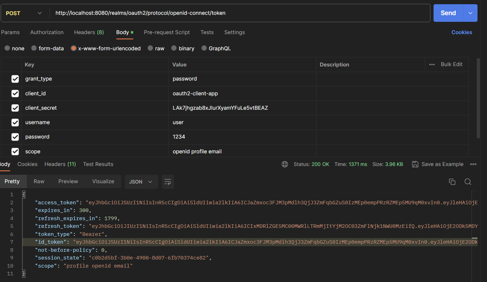
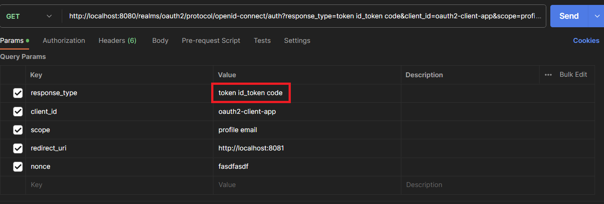

#  Open ID Connect 개요 및 특징

​	OpenID Connect 1.0은 OAuth 2.0 프로토콜 위에 구축된 ID 계층으로 OAuth 2.0을 확장하여 인증 방식을 표준화 한 **OAuth 2.0 기반의 인증 프로토콜**입니다. <u>OAuth 는 인가 프레임워크로, 자원 접근에 대한 권한만 부여할 뿐 인증 절차는 없습니다.</u> 다만 서버에서 인가된 자원을 통해 인증까지 처리할 수 있는 겁니다. 반면 Open ID Connect 는 인증을 할 수 있도록 사용자 정보가 반환됩니다.

​	scope 지정 시 "openid" 를 포함하면 OpenID Connect 사용이 가능하며 인증에 대한 정보는 ID 토큰 (ID Token )이라고 하는 JSON 웹 토큰(JWT) 으로 반환됩니다. OpenID Connect는 클라이언트가 사용자 ID를 확인할 수 있게 하는 보안 토큰인 ID Token 제공합니다.

## OpenID Connect Discovery 1.0 Provider Metadata

​	OpenID Connect 를 사용하기 위해 필요한 모든 엔드 포인트 및 공개 키 위치 정보를 포함 하여 OpenID 공급자의 구성에 대한 클레임 집합을 나타냅니다. 검색 문서 경로는 `[base-server-url]/.well-known/openid-configuration` 입니다.

# ID Token & Scope

​	ID 토큰은 **사용자가 인증 되었음을 증명하는 결과물**로서 <u>OIDC 요청 시 access token 과 함께 클라이언트에게 전달되는 토큰</u>입니다. ID 토큰은 JWT(JSON 웹 토큰)으로 표현되며 헤더, 페이로드 및 서명으로 구성되며 개인 키로 발급자가 서명하는 것으로서 토큰의 출처를 보장하고 변조되지 않았음을 보장합니다. 어플리케이션은 <u>공개 키로 ID 토큰을 검증 및 유효성을 검사하고 만료여부 등 토큰의 클레임을 확인할 수 있습니다.</u> 클라이언트는 클레임 정보에 포함되어 있는 사용자명, 이메일을 활용하여 인증 관리를 할 수 있습니다.

그림에서 보듯, ID 토큰은 신원확인을 위한 인증 토큰으로, Access Token 은 리소스 접근을 위한 인가 토큰으로 사용됩니다. 물론 Access Token 자체가 인증이 되지는 않지만 Access Token 으로 사용자의 정보를 가지고 와서 인증처리를 할 수 있습니다.

OIDC Scope 는 아래와 같이 요청합니다.

그러면 아래와 같은 Claims 를 받을 수 있습니다.

## OIDC 로그인 요청

​	OIDC 상호 작용 행위자는 아래와 같습니다.

1. OpenID Provider
   - 줄여서 OP 라고 하며 OpenID 제공자로서 최종 사용자를 인증하고 인증 결과와 사용자에 대한 정보를 신뢰 당사자에게 제공할 수 있는 Oauth 2.0 서버를 의미합니다.
2. Relying Party
   - 줄여서 RP 라고 하며 신뢰 당사자로서 인증 요청을 처리하기 위해 OP에 의존하는 Oauth 2.0 애플리케이션을 의미합니다.

### 흐름

1. RP는 OP에 권한 부여 요청을 보냅니다.
2. OP는 최종 사용자를 인증하고 권한을 얻습니다.
3. OP는 ID 토큰과 액세스 토큰으로 응답합니다.
4. RP는 Access Token을 사용하여 UserInfo 엔드포인트에 요청을 보낼 수 있습니다.
5. UserInfo 엔드포인트는 최종 사용자에 대한 클레임을 반환합니다.

### 매개변수 요청 및 응답

- 요청 시 openid 범위를 scope 매개 변수에 포함해야 합니다.
- response_type 매개 변수는 id_token 을 포함합니다. (response_type 이 해당 토큰을 지원해야 합니다.)
- 요청은 nonce 매개 변수를 포함해야 합니다. (Implicit Flow 인 경우 필수)
  - 요청에 포함되는 값으로서 결과 id_token 값에 클레임으로 포함되며 이것은 토큰의 재생 공격을 방지하고 요청의 출처를 식별하는 데 사용할 수 있는 임의의 고유 문자열입니다.
  - 해당 nonce 클레임에는 요청에서 전송된 것과 정확히 동일한 값이 포함되어야 합니다. 그렇지 않은 경우 애플리케이션에서 인증을 거부해야 합니다.

아래는 implicit 예시입니다.

## 실습

​	먼저 공개 클라이언트에서 Implicit Grant Type 으로 id_token 을 요청할 때 입니다.

response_type 에 id_token 을 넣고 **nonce 는 임의 값을 필수로 넣습니다.** scope 는 openid 를 포함합니다. (openid 를 포함하지 않아도 id_token 이 응답값으로 오기는 합니다.)

아래와 같이 url 로 응답값이 옵니다.

`http://localhost:8081/#session_state=7159aaad-be99-4cbb-92a8-1a6175b55723&id_token=eyJhbGciOiJSUzI1NiIsInxxxxx`

해당 id_token 을 JWT 변환기에 넣어보겠습니다.

이름, ID, 이메일 등의 정보를 볼 수 있습니다. **물론 Access Token 도 변환을 하면 비슷한 정보가 있지만 Access Token 은 인증이 아닌 인가 목적으로, 다르다는 걸 알아야 합니다.**

이번에는 **password Type** 으로 해보겠습니다.

scope 에 openid 를 포함하면 바로 응답값으로 id_token 을 얻을 수 있습니다. 물론 Access Token 도 함께 옵니다.

재밌는 건 아래와 같이 response_type 에 token, code, id_token 을 함께 얻을 수 있다는 점입니다.

이렇게 하면 한번에 AccessToken, id_token, code 를 얻을 수 있습니다.
