*Section 5 는 소개 영상이라서 제외했습니다.*

# OAuth 2.0 Client 소개

​	OAUth 2.0 Client 은 OAuth 2.0 인가 프레임워크의 역할 중 **인가서버 및 리소스 서버와의 통신을 담당하는 클라이언트의 기능을 필터 기반으로 구현**한 모듈입니다. 간단한 설정만으로 **OAuth 2.0** **인증 및 리소스 접근 권한**, **인가서버 엔드 포인트 통신 등의 구현이 가능**하며 커스터마이징의 **확장이 용이**하니다.

**OAuth 2.0 Login**

- 어플리케이션의 사용자를 외부 OAuth 2.0 Provider 나 OpenID Connect 1.0 Provider 계정으로 로그인할 수 있는 기능을 제공합니다.
- 글로벌 서비스 프로바이더인 “구글 계정으로 로그인”, “깃허브 계정으로 로그인” 기능을 Oauth 2.0 로그인을 구현해 사용할 수 있도록 지원합니다.
- OAuth 2.0 인가 프레임워크의 권한 부여 유형 중 **Authorization Code 방식**을 사용합니다.

​	**OAUth 2.0 Client**

- OAuth 2.0 인가 프레임워크에 정의된 클라이언트 역할을 지원합니다.
- 인가 서버의 권한 부여 유형에 따른 엔드 포인트와 직접 통신할 수 있는 API 를 제공합니다.
  - Client Credentials
  - Resource Owner Password Credentials
  - Refresh Token 
- 리소스 서버의 보호자원 접근에 대한 연동 모듈을 구현 할 수 있습니다.

> Implicit Grant Type 방식은 위험해서 지원하지 않습니다.

# 클라이언트 앱 시작하기

## gradle 설정

`spring-boot-starter-oauth2-client` 를 추가합니다.

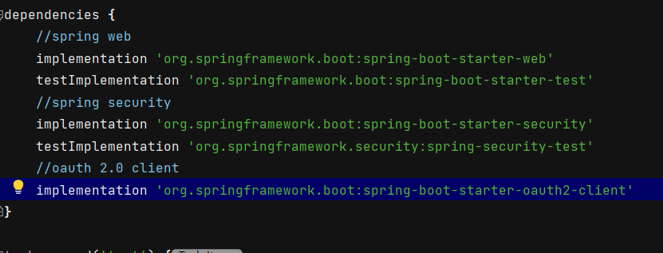

## application.yml

​	클라이언트가 인가서버로 권한 부여 요청을 하거나 토큰 요청을 할 경우 클라이언트 정보 및 엔드포인트 정보를 참조해서 전달하게 됩니다. 이러한 엔드포인트 정보는 `application.yml` 에 추가해서 설정합니다.

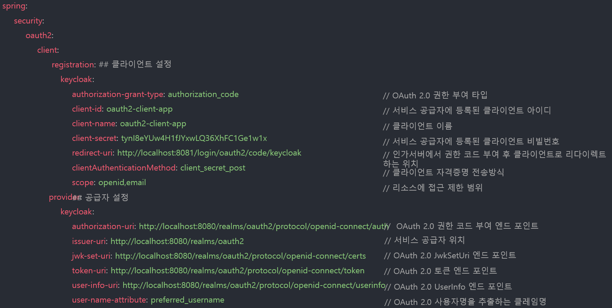

​	초기화가 진행되면 `application.yml` 에 있는 클라이언트 및 엔드포인트 정보가 `OAuth2ClientProperties` 의 각 속성에 바인딩됩니다. (`OAuth2ClientProperties` 의 prefix 는 "spring.security.oauth2.client" 입니다.) `OAuth2ClientProperties` 에 바인딩 되어 있는 속성의 값은 인가서버로 권한부여 요청을 하기 위한 `ClientRegistration` 클래스의 필드에 저장되고 `OAuth2Client` 는 `ClientRegistration` 를 참조해서 권한부여 요청을 위한 매개변수를 구성하고 인가서버와 통신합니다.

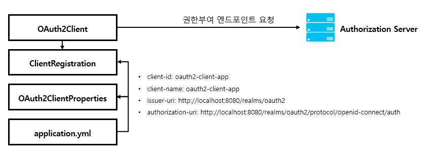

그리고 위에서 작성한 redirect-uri 를 keycloak 에도 추가해줍니다.

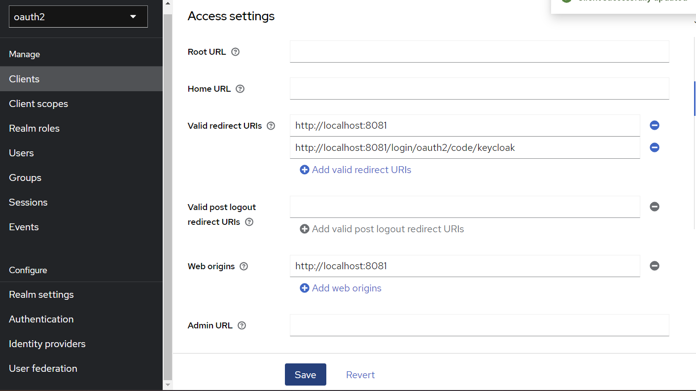

## 실행

이제 어플리케이션을 8081 포트로 실행시키면 다음과 같이 인가 서버로 접근하게 됩니다.

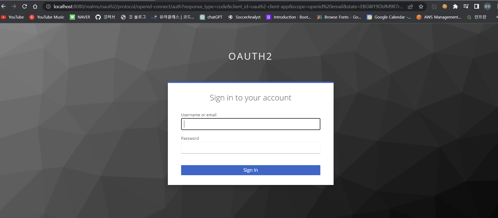

로그인을 하면 인증이 되고 리소스에 접근할 수 있게 됩니다.

# ClientRegistration 이해 및 활용

​	`ClientRegistration` 은 OAuth 2.0 또는 OpenID Connect 1.0 Provider 에서 클라이언트의 등록 정보를 나타냅니다. `ClientRegistration` 은 OpenID Connect Provider 의 설정 엔드포인트나 인가 서버의 메타데이터 엔드포인트를 찾아 초기화할 수 있습니다. 

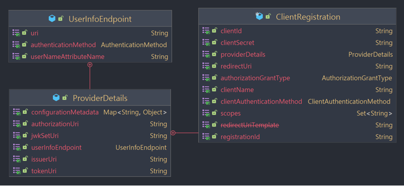

​	`ClientRegistrations` 의 메소드를 사용하면 아래 예제처럼 편리하게 `ClientRegistration` 을 설정할 수 있습니다.

`ClientRegistration clientRegistration = ClientRegistrations.fromIssuerLocation("https://idp.example.com/issuer").build();`

## ClientRegistration

해당 클래스의 필드값을 살펴보겠습니다.

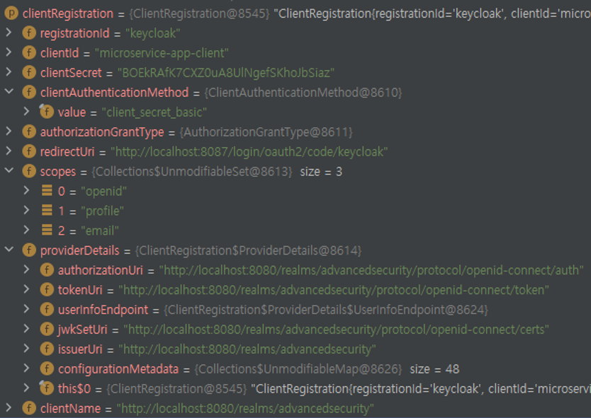

- **registrationId** : ClientRegistration을 식별할 수 있는 유니크한 ID 입니다.
- **clientId** : 클라이언트 식별자입니다.
- **clientSecret** : 클라이언트 secret 입니다.
- **clientAuthenticationMethod** : provider에서 클라이언트를 인증할 때 사용할 메소드로서 basic, post, none (public 클라이언트) 을 지원합니다.
- **authorizationGrantType** : OAuth 2.0 인가 프레임워크는 네 가지 권한 부여 타입을 정의하고 있으며 지원하는 값은 authorization_code, implicit, client_credentials, password 입니다.
- **redirectUriTemplate** : 클라이언트에 등록한 리다이렉트 URL로, 사용자의 인증으로 클라이언트에 접근 권한을 부여하고 나면, 인가 서버가 이 URL로 최종 사용자의 브라우저를 리다이렉트시킵니다.
- **Scopes** : 인가 요청 플로우에서 클라이언트가 요청한 openid, 이메일, 프로필 등의 scope 입니다.
- **clientName** : 클라이언트를 나타내는 이름으로 자동 생성되는 로그인 페이지에서 노출하는 등에 사용합니다.
- **authorizationUri** : 인가 서버의 인가 엔드포인트 URI.
- **tokenUri** : 인가 서버의 토큰 엔드포인트 URI.
- **jwkSetUri** : 인가 서버에서 JSON 웹 키 (JWK) 셋을 가져올 때 사용할 URI. 이 키 셋엔 ID 토큰의 JSON Web Signature (JWS) 를 검증할 때 사용할 암호키가 있으며, UserInfo 응답을 검증할 때도 사용할 수 있습니다.
- **configurationMetadata** : OpenID Provider 설정 정보로서 application.properties 에 spring.security.oauth2.client.provider.[providerId].issuerUri를 설정했을 때만 사용할 수 있습니다.
- **(userInfoEndpoint)uri** : 인증된 최종 사용자의 클레임/속성에 접근할 때 사용하는 UserInfo 엔드포인트 URI.
- **(userInfoEndpoint)authenticationMethod** : UserInfo 엔드포인트로 액세스 토큰을 전송할 때 사용할 인증 메소드. header, form, query 를 지원합니다.
- **userNameAttributeName** : UserInfo 응답에 있는 속성 이름으로, 최종 사용자의 이름이나 식별자에 접근할 때 사용합니다.

## CommonOAuth2Provider

​	글로벌한 인가 서버에 대해 미리 메타정보가 설정되어 있는 클래스입니다.


​	OAuth 2.0 공급자 정보를 제공하는 클래스로서 글로벌 서비스 제공자 일부는 기본으로 제공되어집니다. 하지만 당연히 Client ID 와 Client Secret 는 별도로 `application.properties` 에 작성해야 합니다. Naver 나 Kakao 와 같은 국내 공급자 정보는 위의 모든 항목을 수동으로 작성해서 사용해야 합니다.

​	클라이언트 기준인 Registration 항목과 서비스 제공자 기준인 Provider 항목으로 구분하여 설정합니다. `application.properties` 가 아닌 Java Config 방식으로 `ClientRegistration` 등록을 설정 할 수도 있습니다. 해당 클래스는 `ClientRegistration` 객체를 생성할 수 있는 빌더 클래스를 반환합니다.

## 실행 흐름

인가 서버에서 메타 데이터를 가져오는 과정을 보겠습니다.

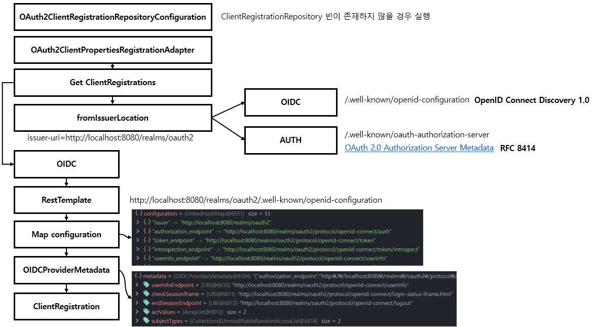

1. 먼저 `OAuth2ClientRegistrationRepositoryConfiguration` 클래스가 실행됩니다. 해당 클래스는 `ClientRegistrationRepository` 빈이 존재하지 않을 경우 실행됩니다.
2. 설정 클래스에서는 `OAuth2ClientPropertiesRegistrationAdapter` 클래스를 통해서 여러 개의 클라이언트 객체 클래스 (ClientRegistrations) 를 가져와서 `fromIssurLocation()` 으로 `issuer-uri` 을 받아서 인가 서버와 연결하고 메타데이터를 가져옵니다.
3. OIDC 방식으로 가져오는 방식과 AUTH 방식을 가져오는 방식이 있습니다. 위 흐름은 OIDC 방식입니다.
4. OIDC 방식으로 RestTemplate 과 통신하게 되면 응답값으로 Map configuration 을 받습니다.
5. Map 으로 되어 있는 객체를 `OIDCProviderMetadata` 클래스를 통해 객체로 변경합니다.
6. 변경된 값들을 `ClientRegistration` 에 넣습니다.

​	만약 `application.yml` 에 특정 값이 없다면 위 값이 기본적으로 들어갑니다. 하지만 `yml` 파일에 값이 있다면 위 값들을 덮어쓰게 됩니다.

## 코드 레벨

### OAuth2ClientRegistrationRepositoryConfiguration

​	애플리케이션을 실행시키면 아래와 같이 `OAuth2ClientRegistrationRepositoryConfiguration` 이 먼저 실행됩니다.

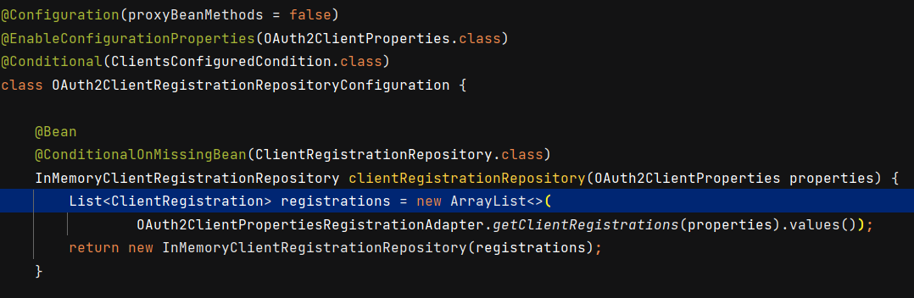

등록 정보 리스트인 `registrations` 은 `OAuth2ClientPropertiesRegistrationAdapter.getClientRegistrations(properties)` 를 통해 얻습니다. `clientRegistrationRepository` 메서드의 `properties` 파라미터는 `yml` 의 설정파일 값들입니다.

### OAuth2ClientPropertiesRegistrationAdapter

`OAuth2ClientPropertiesRegistrationAdapter` 클래스의 `getClientRegistrations()` 메서드입니다. `properties` 에 `registration` 정보를 하나 이상 넣을 수 있기 때문에 for loop 를 돌면서 `clientRegistrations` 리스트에 넣어주고 있습니다.

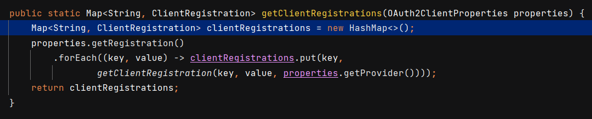

`getClientRegistration()` 메서드에서 먼저 `Builder` 클래스를 만드는 `getBuilderFromIssuerIfPossible()` 메서드를 보겠습니다. 

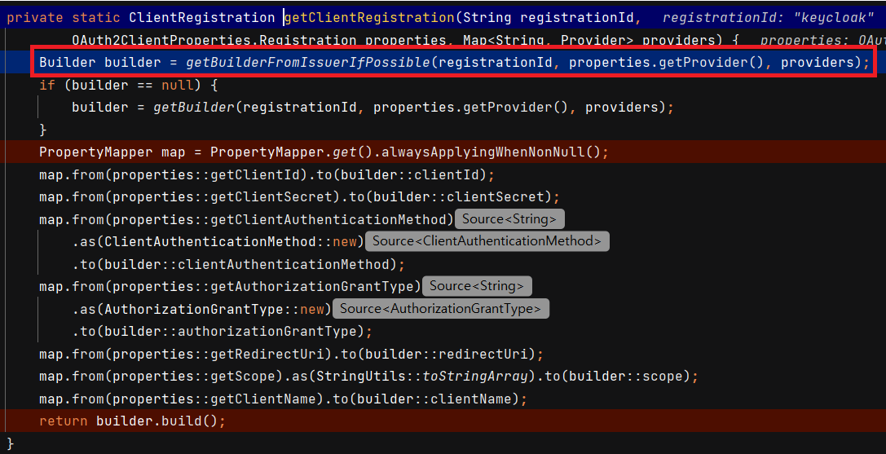

​	해당 메서드는 말그래도 `Issuer` 를 통해 메타 정보를 만들 수 있는 `Builder` 클래스를 만듭니다. 아래에서 `getBuilderFromIssuerIfPossible()` 메서드를 보겠습니다.

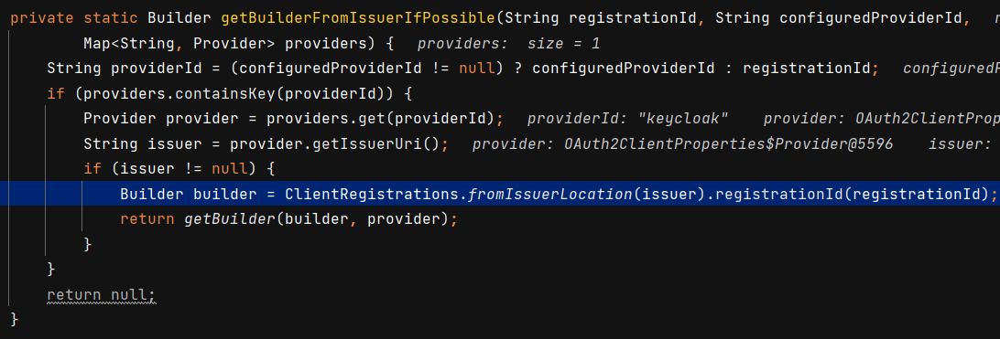

해당 메서드에서 `provider` 는 `yml` 파일에서 설정한 `"keycloak"` 입니다. `providers.get(providerId)` 를 통해 만들어진 `Provider` 클래스는 `issuer-url` 을 가지고 있습니다. 해당 값도 `yml` 파일에서 설정했었죠. 그리고 `ClientRegistrations.fromIssuerLocation(issuer)` 로 메타 데이터를 가져옵니다.

아래는 `ClientRegistrations.fromIssuerLocation(issuer)` 메서드입니다.

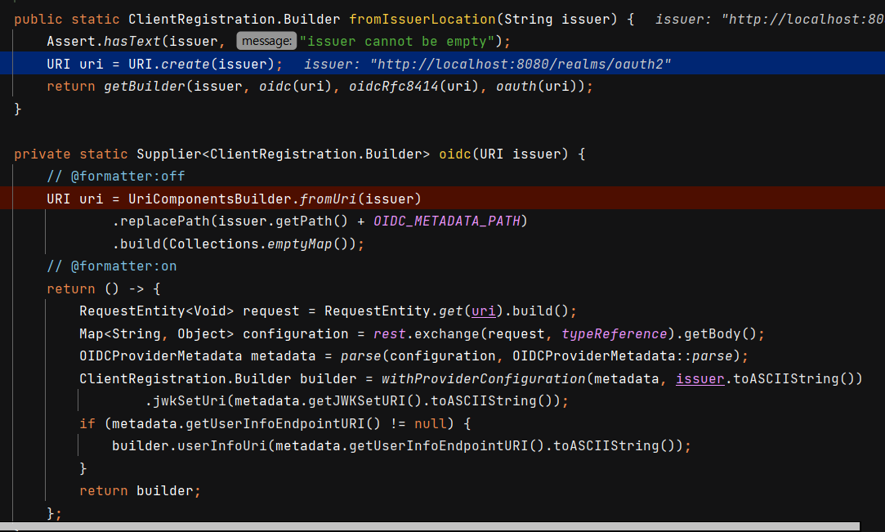

해당 메서드의 리턴값을 보면 ODIC, OAuth 방식을 사용하고 있습니다. 먼저 `oidc()` 가 실행되는데요. `oidc()` 를 보면 issuer 의 Path 에 `OIDC_METADATA_PATH` 를 붙이고 실제 통신을 하고 있습니다. `OIDC_METADATA_PATH` 는 `/.well-known/openid-configuration` 입니다. 즉 `http://localhost:8080/realms/oauth2/.well-known/openid-configuration` 으로 통신하는거죠. 해당 통신은 아래 리소스로 접근합니다.

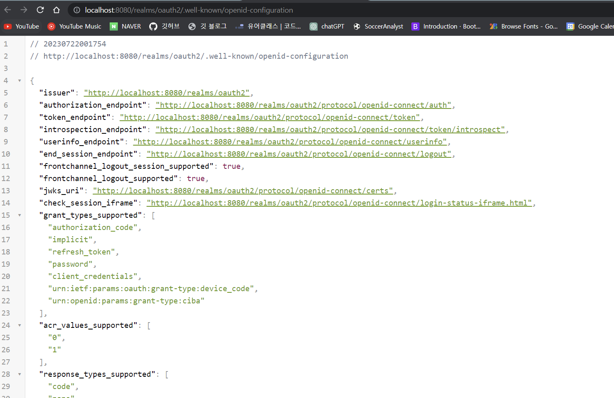

이렇게 아래와 같이 `OIDCProviderMetadata` 클래스 안에 차곡차곡 쌓입니다.


그리고 `metadata` 바로 아래에 `ClientRegistration.Builder` 클래스의 `withProviderConfiguration()` 이 실행되는데요. 아래와 같습니다.

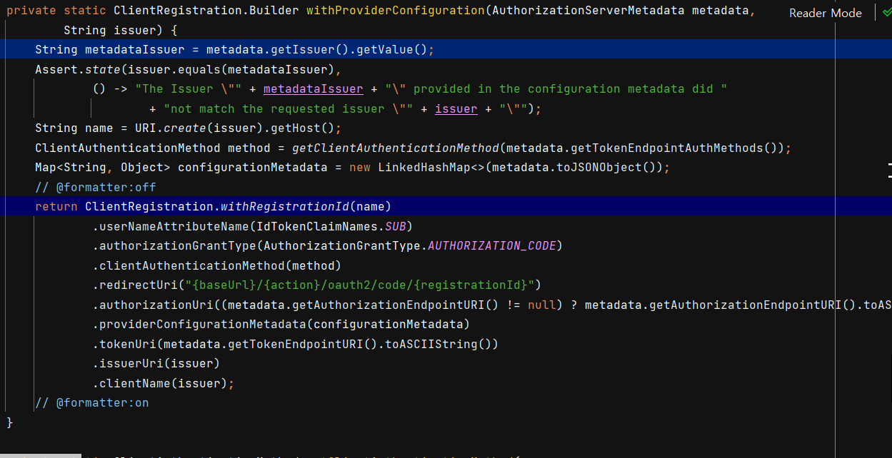

해당 클래스는 `ClientRegistration` 의 `withRegistrationId()` 메서드로 최종적으로 `Builder` 클래스를 만듭니다.

다시 `getBuilderFromIssuerIfPossible()` 메서드로 돌아가겠습니다.

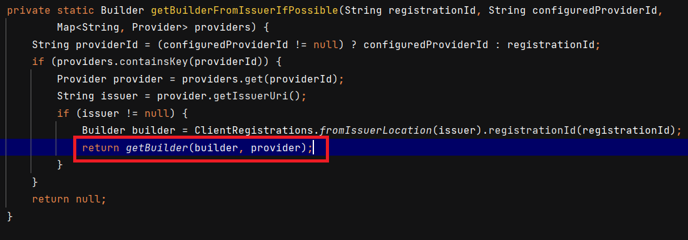

`Builder` 클래스 생성이 끝났지만 `getBuilder()` 메서드로 yml 설정 파일의 정보로 `Builder` 를 덮어씌웁니다. 어쨌든 수동으로 등록된 게 우선이기 때문입니다. `getBuilder()` 메서드는 아래와 같습니다.

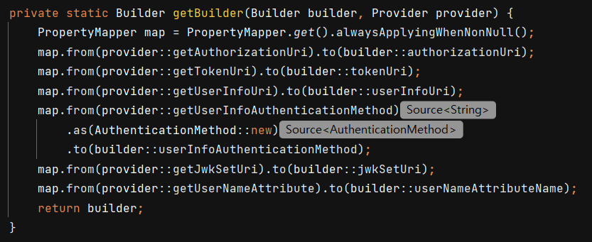

`yml` 정보를 가진 `provider` 에게서 정보를 추출해서 `builder` 에 다시 넣고 있습니다.

마지막으로 다시 `getClientRegistration()` 으로 나오면, `yml` 의 client 값 정보를 매핑해주고 있습니다.

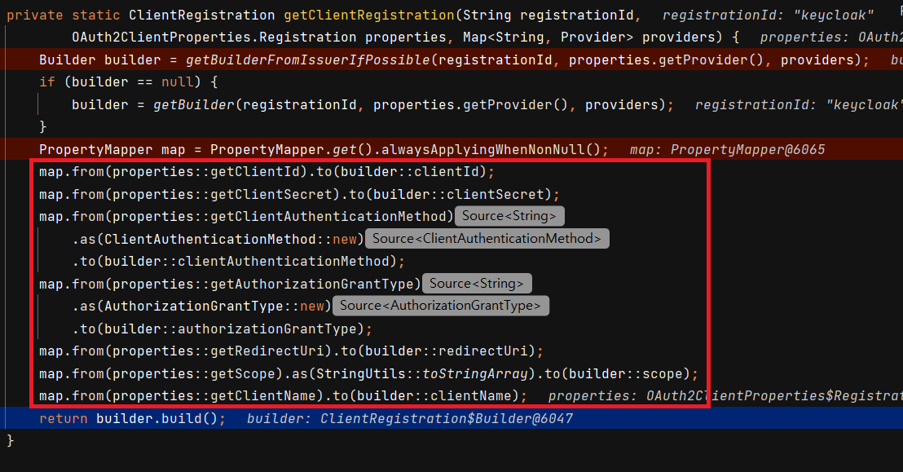

마지막 `builder.build()` 를 통해 `ClientRegistration` 이 만들어집니다.

그러면 아래의 빈이 등록이 되겠죠.

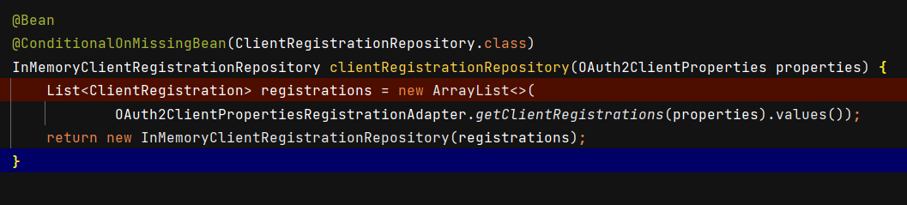

### application.yml 재설정

그러면 이렇게 기본값들을 인가 서버로부터 가져오면 필수적인 요소만 application.yml 에 넣어주면 됩니다. 아래와 같이 변경합니다.

```yml
spring:
  security:
    oauth2:
      client:
        registration:
          keycloak:
            client-id: oauth2-client-app
            client-secret: LAk7jhgzab8xJIurXyamYFuLe5vtBEAZ
            redirect-uri: http://localhost:8081/login/oauth2/code/keycloak
#            client-name: oauth2-client-app
#            scope: openid, email
#            authorization-grant-type: authorization_code
#            client-authentication-method: client_secret_basic
            
        provider:
          keycloak:
            issuer-uri: http://localhost:8080/realms/oauth2
#            authorization-uri: http://localhost:8080/realms/oauth2/protocol/openid-connect/auth
#            token-uri: http://localhost:8080/realms/oauth2/protocol/openid-connect/token
#            user-info-uri: http://localhost:8080/realms/oauth2/protocol/openid-connect/userinfo
#            jwk-set-uri: http://localhost:8080/realms/oauth2/protocol/openid-connect/certs
#            user-name-attribute: preferred_username
```

`client-id`, `client-secret`, `redirect-uri` 과 `issuer-uri` 정도만 필수값입니다. 

## CommonOAuth2Provider 활용

Google 과 같은 정보는 이미 `CommonOAuth2Provider` 에 있기 때문에 `yml` 파일은 아래와 같이 단순하게 작성됩니다.

```yml
spring:
  security:
    oauth2:
      client:
        registration:
          google:
            client-id: oauth2-client-app
            client-secret: LAk7jhgzab8xJIurXyamYFuLe5vtBEAZ
```

이렇게 하면 issuer-uri 가 없기 때문에 `OAuth2ClientPropertiesRegistrationAdapter` 클래스의 `getClientRegistration()` 메서드에서 `builder` 가 null 이 됩니다.

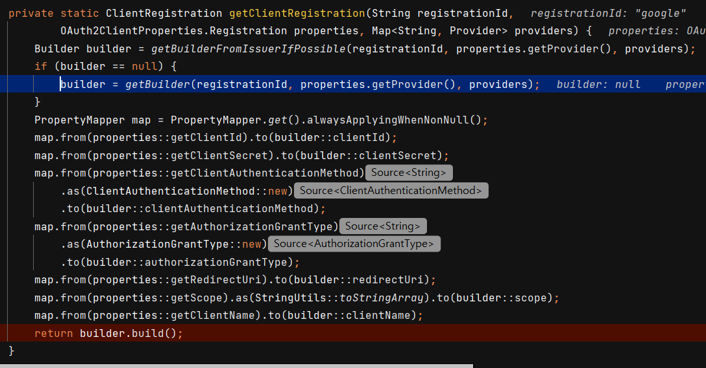

그러면 `if(builder == null)` 분기를 타면서 다른 방식으로 정보를 찾게 됩니다. 아래는 `getBuilder()` 메서드입니다.

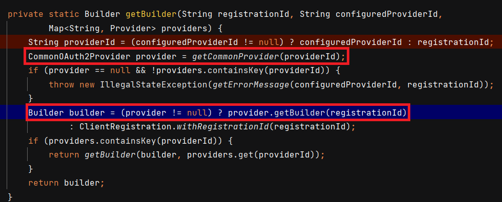

`getCommonProvider()` 로 `CommonOAuthProvider`  enum 인지 확인합니다. 맞다면 해당 provider 의 `getBuilder()` 를 호출합니다.

예를 들어 GOOGLE 이면 아래와 같은 `getBuilder()` 가 호출됩니다.

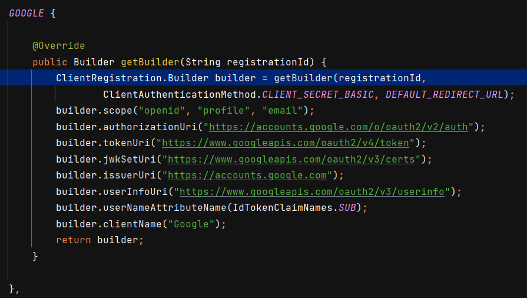

필요한 정보는 여기에 다 있습니다. 해당 정보를 다 담아서 최종적으로 `clientRegistration` 을 만듭니다. 물론 client-id, secret 이 구글에서 발급받은 게 아니기 때문에 런타임 간 승인오류가 발생하기는 합니다.

# ClientRegistrationRepository

​	`ClientRegistrationRepository` 는 OAuth 2.0 & OpenID Connect 1.0 의 `ClientRegistration` 저장소 역할을 합니다. 클라이언트 등록 정보는 궁극적으로 인가 서버가 저장하고 관리하는데 **이 레포지토리는 인가 서버에 일차적으로 저장된 클라이언트 등록 정보의 일부를 검색하는 기능을 제공**합니다. 

​	스프링 부트 2.X 자동 설정은 `spring.security.oauth2.client.registration.[registrationId]` 하위 프로퍼티를 `ClientRegistration` 인스턴스에 바인딩하며, 각 `ClientRegistration` 객체를 `ClientRegistrationRepository` 안에 구성합니다.

​	`ClientRegistrationRepository` 의 디폴트 구현체는 `InMemoryClientRegistrationRepository` 이고 자동 설정을 사용하면 `ClientRegistrationRepository` 도 `ApplicationContext` 내 `@Bean` 으로 등록하므로 필요하다면 아래와 같이 원하는 곳에 의존성을 주입할 수 있습니다.


이렇게 따로 빈으로 등록할 수도 있습니다.

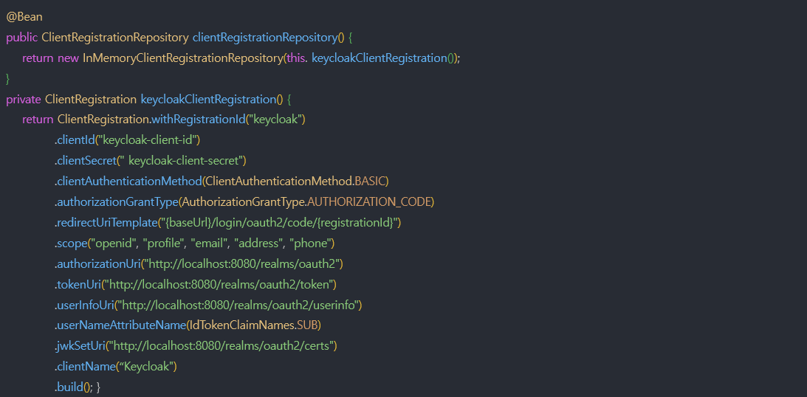

 ## 커스텀 ClientRegistrationRepository 등록

`ClientRegistrationRepository` 와 `ClientRegistration` 을 빈으로 등록해보겠습니다.

```java
@Configuration
public class OAuth2ClientConfig {

    @Bean
    public ClientRegistrationRepository clientRegistrationRepository(){
        return new InMemoryClientRegistrationRepository(keycloakClientRegistration());
    }

    private ClientRegistration keycloakClientRegistration() {

        return ClientRegistrations.fromIssuerLocation("http://localhost:8080/realms/oauth2")
                .registrationId("keycloak")
                .clientId("oauth2-client-app")
                .clientSecret("LAk7jhgzab8xJIurXyamYFuLe5vtBEAZ")
                .redirectUri("http://localhost:8081/login/oauth2/code/keycloak")
                .build();
    }
}
```

`ClientRegistrations.fromIssuerLocation()` 을 통해서 Issuer uri 만 설정하면 자동으로 메타 데이터를 가지고 옵니다. 따라서 필요한 정보인 `clientId`, `clientSecret`, `redirectUri` 정도만 등록해줍니다. 그리고 `clientRegistration` 구분을 위한 `registrationId` 도 등록합니다.

아래와 같이 `Controller` 에서 접근할 수 있습니다.

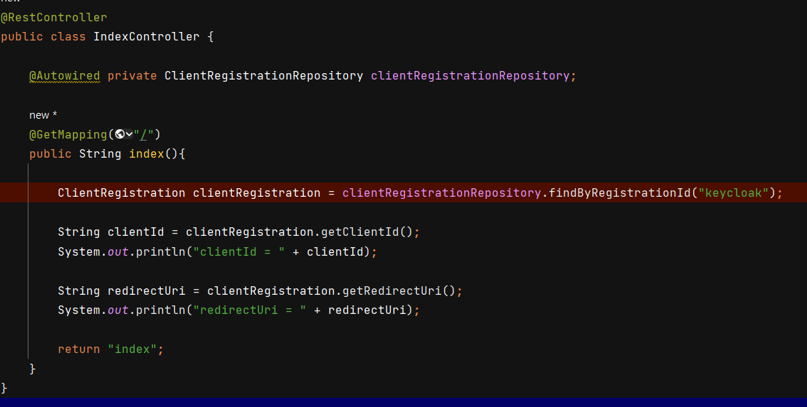

# 자동설정에 의한 초기화 과정 이해

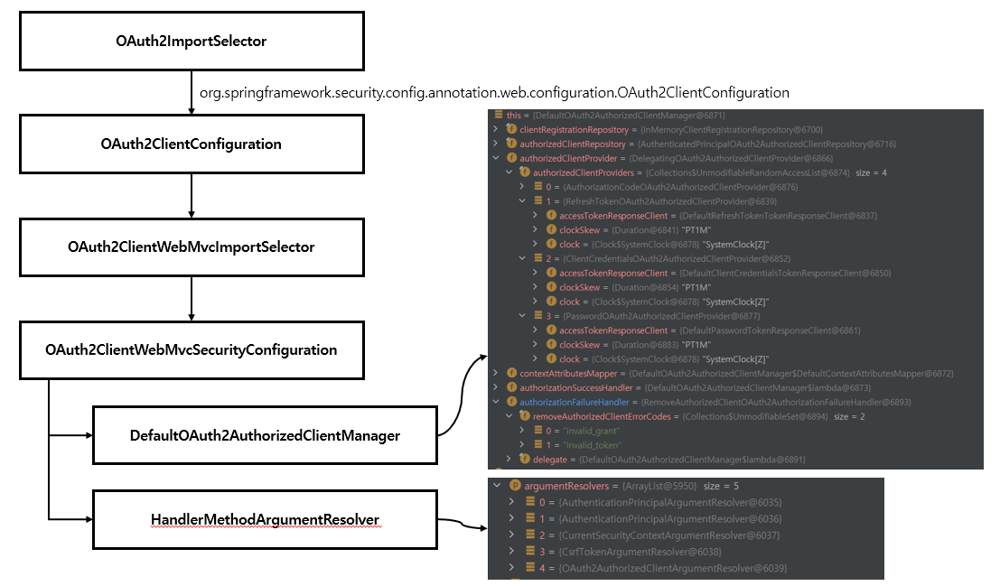

흐름은 위와 같습니다. 먼저 `OAuthImportSelector` 로 `OAuth2ClientAutoConfiguration` 을 등록합니다. 그리고 `OAuth2ClientWebMvcImportSelector` 는 `OAuth2ClientWebMvcSecurityCOnfiguration` 을 등록하는데, MVC 에서 사용할 수 있는 클래스를 가지고 있습니다.

 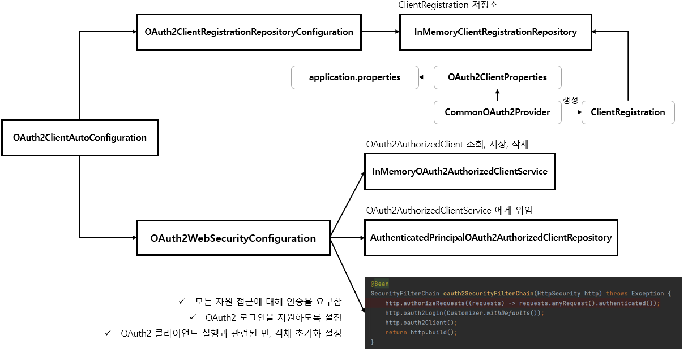

`OAuth2ClientAutoConfiguration` 클래스는 자동구성을 통해 `OAuthClientRegistrationRepositoryConfiguration` 과 `OAuth2WebSecurityConfiguration` 을 만듭니다.


`OAuthClientRegistrationRepositoryConfiguration` 클래스는 이전에 살펴봤고, `OAuth2WebSecurityConfiguration` 에는 `InMemoryOAuth2AuthrizedClientService` 가 있는데, 해당 서비스 클래스로부터 `OAUth2AuthorizedClient` 를 조회할 수 있습니다. 해당 클래스에 유저 이름, accessToken 등 인가 관련 정보가 다 있습니다.

