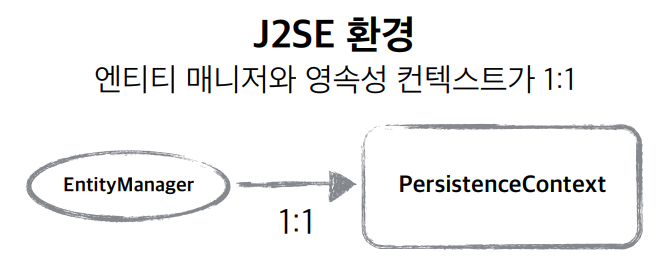
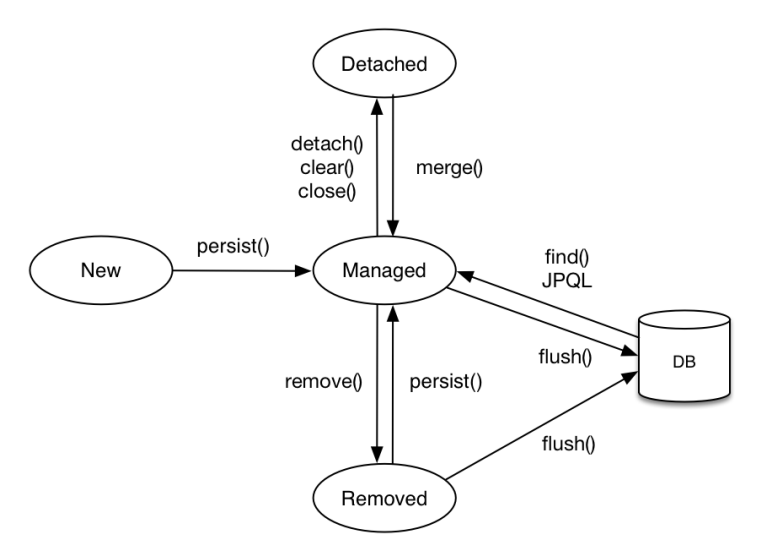
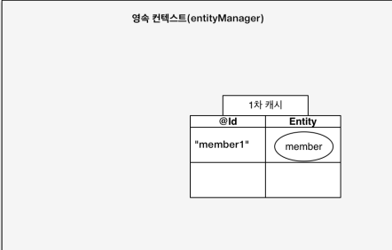
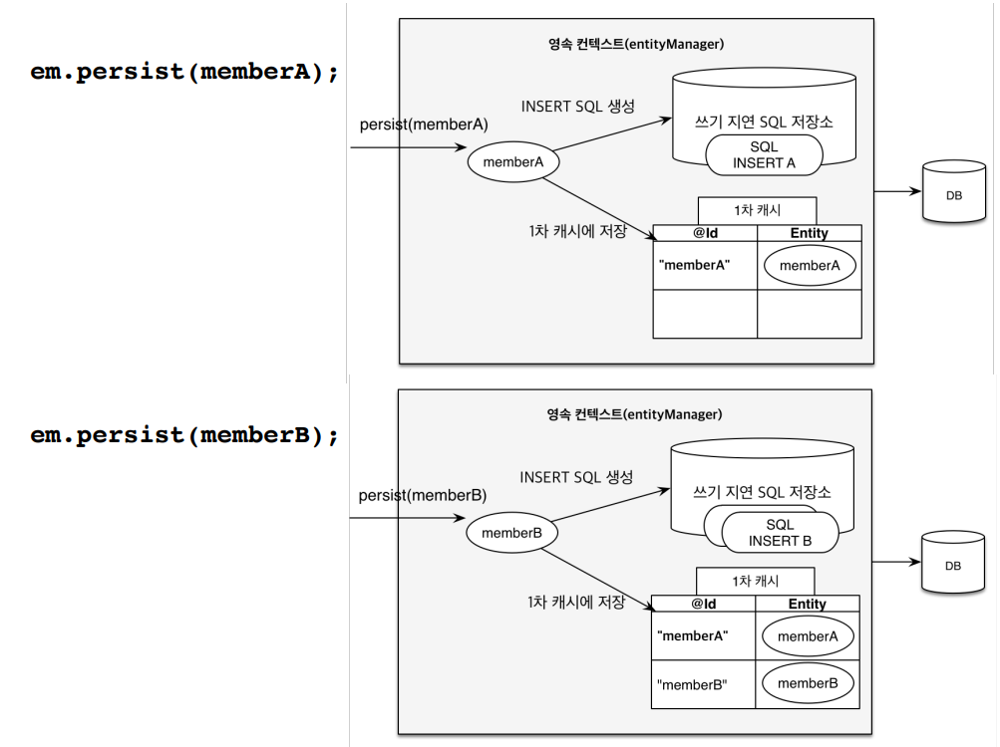
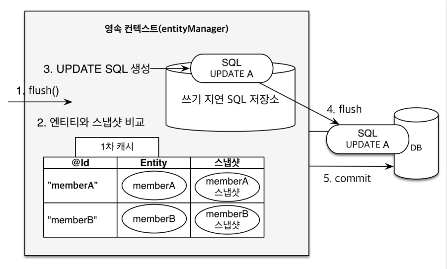

<div class="notice--danger">
    <b>인프런 강의 내용입니다.</b><br/><a href="https://www.inflearn.com/course/ORM-JPA-Basic/dashboard">자바 ORM 표준 JPA 프로그래밍 - 기본편</a>
</div>

# 영속성 컨텍스트

​	영속성 컨텍스트(PersistenceContext) 는 Entity 를 영구 저장하는 환경을 의미하며, 논리적인 개념입니다. entityManager 를 통해 영속성 컨텍스트에 접근할 수 있습니다. 예를 들어 `EntityManager.persist(entity);` 는 Entity 를 db 에 저장하는게 아니라 영속성 컨텍스트에 저장하는 것입니다.

​	entityManager 와 영속성 컨텍스트는 보통 아래와 같이 1:1 로 생성되며 EntityManager 안에 영속성 컨텍스트가 있다고 보면 편합니다.



## Entity Lifecycle



​	Entity 는 비영속(new/transient), 영속(managed), 준영속(detached), 삭제(removed) 라는 4가지 생명주기가 있습니다.

- **비영속**이란 객체를 생성한 상태로, JPA 와 관계없는 상태입니다. 
- **영속**은 entityManager 를 통해 객체를 저장한 상태입니다. 이 때 저장은 영속성 컨텍스트에 저장되는 것이고, DB 에 저장되는 게 아닙니다. 저장은 commit 하는 시점에 됩니다.
- **준영속**은 영속성 컨텍스트에서 분리된 상태입니다. 
- **삭제**는 객체를 삭제한 상태로 DB 에 삭제가 반영되도록 하는 것입니다.

```java
package hellojpa;

...
public class JpaMain {

    public static void main(String[] args){
        EntityManagerFactory emf = Persistence.createEntityManagerFactory("hello");
        EntityManager em = emf.createEntityManager();
        EntityTransaction tx = em.getTransaction();
        tx.begin();
        //실제 코드 작성
        try{
            //비영속
            Member member = new Member();
            member.setId(100L);
            member.setName("HelloJPA");

            //여기서 영속화
            em.persist(member);

            //준영속화
            em.detach(member);
            
            //삭제
            em.remove(member);
            
            //실제 쿼리문을 날리는 부분
            tx.commit();
        }catch (Exception e){
            tx.rollback();
        }finally {
            em.close();
        }
        emf.close();
    }
}
```

# 영속성 컨텍스트의 이점

​	이러한 영속성 컨텍스트는 다음과 같은 이점이 있습니다.

**1차 캐시**

다음 코드를 보겠습니다. member 객체를 만든 후 저장을 하고, 다시 해당 객체를 조회한다면 어떻게 될까요? insert 와 select 쿼리문이 2번 실행될까요?

```java
try{
    Member member = new Member();
    member.setId(101L);
    member.setName("HelloJPA");

    em.persist(member);

    Member findMember = em.find(Member.class, 101L);

    System.out.println("findMember.id = " + findMember.getId());
    System.out.println("findMember.name = " + findMember.getName());

    tx.commit();
    }
```

쿼리문은 insert 만 날라갑니다. 왜냐하면 `em.persist(member);` 를 하는 순간 쿼리문은 날라가지 않지만 **영속성 컨텍스트의 1차 캐시에 아래와 같이 저장**되기 때문입니다.



`Member findMember = em.find(Member.class, 101L);` 를 하면 먼저 1차 캐시를 조회하여 값이 있으면 해당 값을 반환합니다. 따라서 쿼리문을 날릴 필요가 없어집니다.

아래는 **조회**하는 내용입니다.

```java
try{

    Member findMember1 = em.find(Member.class, 101L);
    Member findMember2 = em.find(Member.class, 101L);

    tx.commit();
    }
```

캐시에 없는 `101L` 을 조회하면 db 에 바로 select 문으로 조회하고 1차 캐시에 저장합니다. 이후 `findMember2` 를 조회하면 1차 캐시에서 반환하게 됩니다.

하지만 1차 캐시는 한 트랜잭션 안에서만 공유하기 때문에 큰 성능 상 이점은 없습니다.


**영속 엔티티의 동일성(identity) 보장**

```java
try{
    Member findMember1 = em.find(Member.class, 101L);
    Member findMember2 = em.find(Member.class, 101L);

    System.out.println("result = " + (findMember1 == findMember2)); //true

    tx.commit();
    }
```

​	위와 같이 같은 ID 로 꺼내면 `==` 비교에서 true 를 반환합니다. 이 또한 1차 캐시가 있기 때문에 가능합니다.


**트랜잭션을 지원하는 쓰기 지연(transactional write-behind)**

쓰기 지연은 쿼리문을 바로 날리지 않고 모아놨다가 보내는겁니다. 아래 코드를 보겠습니다.

```java
try{

    Member member1 = new Member(150L, "A");
    Member member2 = new Member(160L, "B");

    em.persist(member1);
    em.persist(member2);
    System.out.println("=========================");
    tx.commit();
    }
```

위 코드를 실행 후 콘솔창을 보면  sql 문이 `"========================="` 보다 아래에 있다는 걸 알 수 있습니다.



**`em.persist(member)`를 호출하면 영속성 컨텍스트에 SQL 문이 생성되어 쓰기 지연 SQL 저장소에 저장됩니다.** 그리고 commit 하는 순간 flush 로 sql 문이 날라가고 commit 됩니다.최적화를 위해 최대한 한번에 모아서 보내는 겁니다.

**변경 감지(Dirty Checking)**

​	변경 감지는 엔티티 수정을 감지하는 것입니다. 아래 코드를 보겠습니다.

```java
try{
    Member findMember = em.find(Member.class, 101L);
    findMember.setName("ZZZZZ");
    System.out.println("=========================");
    tx.commit();
}
```

​	코드에 update 쿼리문이 없어도 데이터 수정이 가능합니다. 콘솔창에서  `"========================="` 이전에 Select 가 등장하고 이후에 update 가 등장합니다.



flush 가 되면 영속성 컨텍스트에서 memberA 의 스냅샷과 실제 memberA 의 모습을 비교합니다. 이 때 변경된 것이 있다면 수정 쿼리문을 보냅니다. 따라서 직접 **em.update(memberA) 나 em.persist(memberA) 와 같은 수정 쿼리문을 보낼 필요가 없습니다.**

# 플러시(flush)

​	**flush** 는 영속성 컨텍스트의 변경 내용을 감지해서 데이터 베이스에 반영하는 메서드입니다. flush 가 호출되면 수정된 엔티티 쓰기 지연 SQL 저장소에 등록된 쿼리문이 DB 에 반영됩니다. **다만, flush 가 발생한다고 db commit 이 발생되는 것은 아닙니다.** 트랜잭션 작업 단위 안에서 커밋 직전에만 모든 SQL 문이 동기화되기만 하면 됩니다.

**영속성 컨텍스트를 플러시하는 방법**

플러시하는 방법은 총 3가지입니다.

- 트랜잭션 커밋 - **플러시 자동 호출**
- em.flush() - **직접 호출**

```java
try{
    Member member = new Member(200L, "member200");
    em.persist(member);
    em.flush();
    System.out.println("===============");
    tx.commit();
}
```

​	위와 같이 flush 를 하면 insert sql 문이 `"==============="` 보다 우선적으로 실행됩니다. flush 를 한다고 1차 캐시가 지워지는 건 아니며 쓰기 지연 SQL 저장소의 쿼리들을 바로 반영시킵니다.

- **JPQL 쿼리 실행** - 플러시 자동 호출

```java
em.persist(memberA);
em.persist(memberB);
em.persist(memberC);
//중간에 JPQL 실행
query = em.createQuery("select m from Member m", Member.class);
List<Member> members= query.getResultList();
```

​	JPQL 쿼리문을 실행시킬 때 플러시가 자동호출 되는 이유는 해당 쿼리문이 실행될 때 반영이 되어야만 정상적인 작동을 할 수 있기 떄문입니다.

**플러시 모드 옵션** 

- FlushModeType.AUTO  : 커밋이나 쿼리를 실행할 때 플러시 (기본값) 
- FlushModeType.COMMIT 커밋할 때만 플러시

`FlushModeType.COMMIT` 은 중간에 JPQL 이 있지만 굳이 플러시 할 필요가 없을 때 사용합니다. 사실 그냥 기본값을 사용하면 됩니다.

# 준영속 상태

​	준영속 상태는 영속에서 준영속 상태가 된 것입니다. em.persist(), em.find() 등으로 1차 캐시에 올라간 상태가 영속 상태이고, **영속 상태의 entity 가 영속성 컨텍스트에서 분리(detached) 된 게 준영속 상태**입니다. **준영속 상태가 되면 영속성 컨텍스트가 제공하는 기능을 사용하지 못합니다.**

​	**준영속 상태로 만드는 방법**에는 아래와 같은 방법이 있습니다.

- `em.detach(entity)` : 특정 엔티티만 준영속 상태로 전환
- `em.clear()` : 영속성 컨텍스트를 완전히 초기화
- em.close() : 영속성 컨텍스트를 종료

```java
try{
    //select 쿼리 날림
    Member member = em.find(Member.class, 101L);
    member.setName("AAAAA");

    //영속성 컨택스트에서 빠짐
    em.detach(member);

    //영속성 컨택스트를 초기화
    em.clear();

    //영속성 컨택스트를 종료
    em.close();

    //update 쿼리 없음
    tx.commit();
}
```

