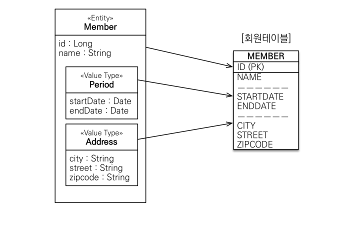
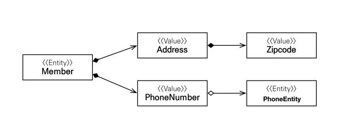

<div class="notice--danger">
    <b>인프런 강의 내용입니다.</b><br/><a href="https://www.inflearn.com/course/ORM-JPA-Basic/dashboard">자바 ORM 표준 JPA 프로그래밍 - 기본편</a>
</div>

# 기본 값 타입

​	JPA 에서 데이터 타입은 **엔티티 타입과 값 타입**으로 분류됩니다. 

**엔티티 타입**

- @Entity 로 정의하는 객체입니다.
- 데이터가 변해도 식별자로 지속해서 추적 가능합니다. 예를 들어 회원 엔티티의 키나 나이값을 변경해도 식별자로 인식 가능하다는 뜻입니다.

**값 타입**

- int, Integer, String 처럼 단순히 값으로 사용하는 자바 기본 타입이나 객체입니다.
- 식별자가 없고 값만 있으므로 변경 시 추적할 수 없습니다.
- **기본값 타입**(Primitive type, Wrapper Class, String), **임베디드 타입**(embedded type, 복합값 타입), **컬렉션 값 타입**(collection value type) 으로 총 3가지가 있습니다.

## 기본값 타입

​	기본값 타입은 String, int, Wrapper 등을 말합니다. 생명주기를 엔티티에 의존하는데요. 예를 들어서 회원을 삭제하면 이름, 나이 필드도 함께 삭제된다는 뜻입니다. 값 타입은 공유되면 안됩니다. 특정 회원의 이름을 변경했는데 다른 회원의 이름이 변경되면 안되겠죠. 자바의 Primitive type, Wrapper Class, String 은 다행히 값이 공유되지 않거나 변경할 수 없어서 해당 문제에 대해 자유롭습니다.

## 임베디드 타입

​	임베디드 타입은 새로운 값 타입을 직접 정의할 수 있습니다. 주로 기본 값 타입을 모아서 만들어서 복합 값 타입이라고도 합니다. 아래 예시를 보겠습니다.

```java
@Entity
public class Member extends BaseEntity{

    @Id
    @GeneratedValue
    private Long id;
    private String username;

    //기간 Period
    private LocalDateTime startDate;
    private LocalDateTime endDate;

    //주소 Address
    private String city;
    private String street;
    private String zipcode;
}
```

​	Member 엔티티에서 startDate, endDate, city, street, zipcode 를 하나하나 나열하기보다는 기간, 주소와 같은 큰 단위로 묶는 게 활용하기가 더 좋습니다. 묶어준다면 아래와 같이 되겠네요. DB 에는 그대로 나눠서 저장됩니다.



​	이렇게 하려면 Period, Address 클래스를 따로 만들어서 임베디드 타입으로 넣어줍니다.

```java
@Entity
public class Member extends BaseEntity{

    @Id
    @GeneratedValue
    private Long id;
    private String username;

    //기간 Period
    @Embedded
    private Period workPeriod;

    //주소
    @Embedded
    private Address homeAddress;
}

@Embeddable
public class Period {

    private LocalDateTime startDate;
    private LocalDateTime endDate;
}

@Embeddable
public class Address {
    private String city;
    private String street;
    private String zipcode;

    public Address(){}

    public Address(String city, String street, String zipcode) {
        this.city = city;
        this.street = street;
        this.zipcode = zipcode;
    }
}
```

​	이렇게 클래스를 따로 만들고 클래스에 @Embeddable 이라고 붙여줍니다. 그리고 값 타입을 사용하는 Member 에서는 @Embedded 라고 붙여줍니다. 둘 중 하나만 해도 상관없고 둘다 해도 상관없습니다. 그리고 **기본 생성자는 필수입니다.** 따라서 Address 와 같이 모든 필드를 사용하는 생성자가 있다면 기본 생성자를 추가로 만들어줘야 합니다.

​	만약에 한 엔티티에서 같은 값 타입을 중복으로 사용되면 어떻게 될까요? 아래처럼 member 가 homeAddress 와 workAddress 를 가지고 있는 경우를 보겠습니다.

```java
package hellojpa.ex;

import javax.persistence.*;
import java.time.LocalDateTime;
import java.util.ArrayList;
import java.util.List;

@Entity
public class Member extends BaseEntity{

    @Id
    @GeneratedValue
    private Long id;
    private String username;

    //기간 Period
    @Embedded
    private Period workPeriod;

    //주소
    @Embedded
    private Address homeAddress;

    //주소
    @Embedded
    private Address workAddress;
}

```

​	집 주소도 정의하고, 직장주소도 정의할 수 있겠죠. 하지만 이렇게 되면 DB 에 저장되는 컬럼명이 중복되기 때문에 **아래와 같이 컬럼명을 따로 지정해줘야 합니다.**

```java
@AttributeOverrides({
        @AttributeOverride(name = "city", column = @Column(name = "WORK_CITY")),
        @AttributeOverride(name = "street", column = @Column(name = "WORK_STREET")),
        @AttributeOverride(name = "zipcode", column = @Column(name = "WORK_ZIPCODE"))
})
@Embedded
private Address workAddress;
```

​	이렇게 하면 workAddress 의 컬럼명은 WORK_CITY, WORK_STREET, WORK_ZIPCODE 가 됩니다.

​	이렇게 임베디드 타입을 사용하면 **재사용성이 높고, 높은 응집도를 가질 수 있습니다.** 또한 Period.isWork() 처럼 **해당 값 타입만 사용하는 의미 있는 메서드를 만들 수도 있죠.**

​	또한 임베디드 타입 안에는 아래 그림처럼 다른 엔티티가 들어갈 수도 있습니다.



​	PhoneNumber 임베디드 타입 안에 PhoneEntity 가 들어갈 수 있습니다. 필드만 매핑해주면 문제없죠.

# 값 타입과 불변 객체

​	임베디드 타입은 주소값으로 저장되기 때문에 같은 값 타입을 여러 엔티티에서 공유하면 위험합니다. 아래 코드처럼요.

```java
package hellojpa;

import hellojpa.ex.*;
import org.hibernate.Hibernate;

import javax.persistence.EntityManager;
import javax.persistence.EntityManagerFactory;
import javax.persistence.EntityTransaction;
import javax.persistence.Persistence;
import java.time.LocalDateTime;
import java.util.List;

public class JpaMain {

    public static void main(String[] args){
        EntityManagerFactory emf = Persistence.createEntityManagerFactory("hello");

        EntityManager em = emf.createEntityManager();

        EntityTransaction tx = em.getTransaction();
        tx.begin();
        try{
            Address address = new Address("city", "street", "10000");

            Member member1 = new Member();
            member1.setUsername("user1");
            member1.setHomeAddress(address);
            em.persist(member1);

            Member member2 = new Member();
            member2.setUsername("user2");
            member2.setHomeAddress(copyAddress);

            em.persist(member2);

            member1.getHomeAddress().setCity("newCity");

            tx.commit();
        }catch (Exception e){
            tx.rollback();
            e.printStackTrace();
        }finally {
            em.close();
        }
        emf.close();
    }
}

```

​	위 코드에서 `member1.getHomeAddress().setCity("newCity");` 을 통해 member1 의 Address 이름을 "newCity"을 변경했습니다. 그러면 member1 의 address 이름만 변경되는 게 아니라 member2 의 address 이름도 함께 변경됩니다. 따라서 **이러한 부작용(side effect)을 방지하기 위해 객체 타입을 아예 수정 불가능한 불변 객체(immutable object) 로 설계하면 됩니다.** 방법은 생성자로만 값을 설정하고 Setter 를 만들지 않는 것입니다.

```java
package hellojpa.ex;

import javax.persistence.Embeddable;

@Embeddable
public class Address {
    private String city;
    private String street;
    private String zipcode;

    public Address(){}

    public Address(String city, String street, String zipcode) {
        this.city = city;
        this.street = street;
        this.zipcode = zipcode;
    }

    public String getCity() {
        return city;
    }

    public String getStreet() {
        return street;
    }

    public String getZipcode() {
        return zipcode;
    }
}

```

​	Intellij 에서 get 메서드에 `For property-based access both setter and getter should be present ` 라는 에러가 뜨면서 빨간줄이 생기는데 무시하고 실행해도 됩니다. setter 를 만들어서 해결할 수도 있는데 그러면 private 으로 setter 를 만들어야겠죠.

​	이렇게 불변 객체로 만들면 공유 참조 문제는 해결할 수 있지만 자신의 임베디드 타입도 수정할 수 없게 됩니다. 따라서 아래 코드처럼 새로운 객체를 만들어서 넣어줘야 합니다.

```java
public class JpaMain {

    public static void main(String[] args){
        EntityManagerFactory emf = Persistence.createEntityManagerFactory("hello");

        EntityManager em = emf.createEntityManager();

        EntityTransaction tx = em.getTransaction();
        tx.begin();
        try{

            Address address = new Address("city", "street", "10000");

            Member member1 = new Member();
            member1.setUsername("user1");
            member1.setHomeAddress(address);
            em.persist(member1);

            //새로운 copyAddress 생성
            Address copyAddress = new Address("newCity", address.getStreet(), address.getZipcode());

            //member1 에 넣어주기
            member1.setHomeAddress(copyAddress);

            em.persist(member1);
            tx.commit();
        }catch (Exception e){
            tx.rollback();
            e.printStackTrace();
        }finally {
            em.close();
        }
        emf.close();
    }
}
```

​	위 코드처럼 새로운 Address 를 만들고 넣어줘야 합니다. 생성자를 좀 더 세분화해서 간편하게 만들 수도 있겠습니다만 따로 구현해보지는 않겠습니다.

​	귀찮기는 하지만 "값 타입" 자체는 앞서 설명했듯 변경 시 추적불가능한 단순한 값이 되어야 합니다. 나이 필드 값에서 20 을 25 로 변경할 때 20 을 사용하여 25 를 만드는 게 아니라 그냥 새로운 25 라는 값을 집어넣듯이 말이죠.

 

# 값 타입의 비교

​	자바 기본문법 내용입니다. primitive Type 이 아니면 주소값으로 비교하기 때문에 `==` 으로 비교할 수 없습니다. 비교에는 동일성 비교와 동등성 비교가 있습니다.

- 동일성(identity) 비교: 인스턴스의 참조 값을 비교, `==` 사용
- 동등성(equivalence) 비교: 인스턴스의 값을 비교, `equals()` 사용

특정인의 Address 를 다른 Address 와 비교하고 싶을 때 당연히 그 안에 있는 모든 값이 같은지 보고 싶은거지, 참조값이 같은지 보려는 건 아니겠죠. 즉, 우리는 동등성 비교를 하고 싶은 겁니다.

```java
Address address1 = new Address("city", "street", "10000");
Address address2 = new Address("city", "street", "10000");

System.out.println(address1.equals(address2)); //false
```

​	위 코드에서는 equals 의 연산값이 false 가 나옵니다. Object 의 equals 는 기본적으로 `==` 연산을 하기 때문입니다. 따라서 Address 에서 따로 equals 를 오버라이딩해서 구현해줘야 합니다. Alt + Insert 를 누르고 `equals() and hashCode()` 로 기본 설정대로 구현합니다.

```java
@Embeddable
public class Address {
    private String city;
    private String street;
    private String zipcode;

    public Address(){}

    public Address(String city, String street, String zipcode) {
        this.city = city;
        this.street = street;
        this.zipcode = zipcode;
    }

    @Override
    public boolean equals(Object o) {
        if (this == o) return true;
        if (o == null || this.getClass() != o.getClass()) return false;
        Address address = (Address) o;
        return Objects.equals(city, address.city) && Objects.equals(street, address.street) && Objects.equals(zipcode, address.zipcode);
    }

    @Override
    public int hashCode() {
        return Objects.hash(city, street, zipcode);
    }
}
```

​	기본 설정대로 하면 이제 `address1.equals(address2)` 결과값이 true 가 나옵니다. hashCode() 를 사용하는 이유는 지금 얘기하는 equals 보단, 나중에 hashMap 과 같은 컬렉션을 사용할 때 효율적으로 사용되기 때문입니다.

​	또한 위에서는 equals 를 비교할 때 값에 직접 접근했는데요. **equals and hashCode 를 만들 때 `Use getters during code generation` 을 체크하는 게 좋습니다. 왜냐하면 프록시 객체일 때는 필드값 접근이 안되기 때문입니다.**

# 값 타입 컬렉션

​	값 타입 컬렉션은 값 타입을 하나 이상 저장할 때 사용하며 컬렉션 프레임워크를 사용합니다. DB 는 컬렉션을 같은 테이블에 저장할 수 없기 때문에 컬렉션을 저장하기 위한 별도의 테이블이 필요합니다.

​	예를 들어, MEMBER 테이블에 FAVORITE_FOOD 와 ADDRESS 를 여러 개 보관한다고 해보겠습니다. 그럼 ERD 는 아래와 같이 됩니다.


​	MEMBER 테이블에 저장되는 게 아니라 별도의 테이블로 형성됩니다. 하지만 컬렉션 값타입 또한 불변 객체처럼 취급되어야 하기 때문에 모든 값이 PK 가 됩니다.

```JAVA
@Entity
public class Member {

    @Id
    @GeneratedValue
    private Long id;
    private String username;

    @Embedded
    private Address homeAddress;

    @ElementCollection
    @CollectionTable(name = "FAVORITE_FOODS", joinColumns = @JoinColumn(name = "MEMBER_ID"))
    @Column(name = "FOOD_NAME") //값타입이 기본 값 타입일 때 지정가능합니다.
    private Set<String> favoriteFoods = new HashSet<>();

    @ElementCollection
    @CollectionTable(name = "ADDRESS", joinColumns = @JoinColumn(name = "MEMBER_ID"))
    private List<Address> addressHistory = new ArrayList<>();
}
```

​	작성할 때는 위와 같이 @ElementCollection 을 사용하여 컬렉션 값 타입임을 명시합니다. 또한 해당 값들이 저장되는 테이블명도 @CollectionTable 으로 지정해줘야 하고 그 속성값으로  joinColumns 를 사용해서 FK 를 지정해줍니다. 값 타입이 기본 값 타입일 때는 @Column(name = "FOOD_NAME") 과 같이 여기서 컬럼명을 지정해줄 수 있습니다.

​	**값타입 컬렉션은 지연로딩전략을 사용합니다.**

```JAVA
public class JpaMain {

    public static void main(String[] args){
        EntityManagerFactory emf = Persistence.createEntityManagerFactory("hello");

        EntityManager em = emf.createEntityManager();

        EntityTransaction tx = em.getTransaction();
        
        tx.begin();
        try{

            Member member = new Member();
            member.setUsername("member1");
            member.setHomeAddress(new Address("homeCity", "street", "10000"));

            member.getFavoriteFoods().add("치킨");
            member.getFavoriteFoods().add("족발");
            member.getFavoriteFoods().add("피자");

            member.getAddressHistory().add(new Address("old1", "street", "10000"));
            member.getAddressHistory().add(new Address("old2", "street", "10000"));

            em.persist(member);

            em.flush();
            em.clear();

            System.out.println("=====================================");
            Member findMember = em.find(Member.class, member.getId()); //MEMBER 만 조회

            List<Address> addressHistory = findMember.getAddressHistory(); //Address 조회
            for (Address address : addressHistory) {
                System.out.println("address.getCity() = " + address.getCity());
            }

            Set<String> favoriteFoods = findMember.getFavoriteFoods(); //FAVORITE_FOODS 조회
            for (String favoriteFood : favoriteFoods) {
                System.out.println("favoriteFood = " + favoriteFood);
            }

            tx.commit();
        }catch (Exception e){
            tx.rollback();
            e.printStackTrace();
        }finally {
            em.close();
        }
        emf.close();
    }
}

```

​	위 코드처럼 지연로딩전략으로, 값타입 컬렉션을 조회할 때 쿼리문을 날립니다.

​	값타입 컬렉션을 수정할 때는 다음과 같이 **기존 값을 삭제하고 새로 만들어줘야 합니다.**

```java
public class JpaMain {

    public static void main(String[] args){
        EntityManagerFactory emf = Persistence.createEntityManagerFactory("hello");

        EntityManager em = emf.createEntityManager();

        EntityTransaction tx = em.getTransaction();
        tx.begin();
        try{


            Member member = new Member();
            member.setUsername("member1");
            member.setHomeAddress(new Address("homeCity", "street", "10000"));

            member.getFavoriteFoods().add("치킨");
            member.getFavoriteFoods().add("족발");
            member.getFavoriteFoods().add("피자");

            member.getAddressHistory().add(new Address("old1", "street", "10000"));
            member.getAddressHistory().add(new Address("old2", "street", "10000"));

            em.persist(member);

            em.flush();
            em.clear();

            System.out.println("=====================================");
            Member findMember = em.find(Member.class, member.getId());

            //치킨 -> 한식
            findMember.getFavoriteFoods().remove("치킨");
            findMember.getFavoriteFoods().add("한식");

            //old1 -> new1
            findMember.getAddressHistory().remove(new Address("old1", "street", "10000"));
            findMember.getAddressHistory().add(new Address("newCity1", "street", "10000"));

            tx.commit();
        }catch (Exception e){
            tx.rollback();
            e.printStackTrace();
        }finally {
            em.close();
        }
        emf.close();
    }
}
```

​	근데 이렇게 하면 쿼리문이 다음과 같이 나가는 걸 볼 수 있습니다. Address 만 보겠습니다.

```mysql
select
    addresshis0_.MEMBER_ID as member_i1_0_0_,
    addresshis0_.city as city2_0_0_,
    addresshis0_.street as street3_0_0_,
    addresshis0_.zipcode as zipcode4_0_0_ 
from
    ADDRESS addresshis0_ 
where
    addresshis0_.MEMBER_ID=?

delete 
    from
        ADDRESS 
    where
        MEMBER_ID=?

insert 
    into
        ADDRESS
        (MEMBER_ID, city, street, zipcode) 
    values
        (?, ?, ?, ?)

 insert 
    into
        ADDRESS
        (MEMBER_ID, city, street, zipcode) 
    values
        (?, ?, ?, ?)
```

​	원하는 건 address old1 을 삭제하고 address newCity1 를 넣는겁니다. 하지만 쿼리문은 member 의 모든 Address 삭제하고 old2 와 newCity1 을 추가하는 쿼리를 넣었습니다. 이렇게 되는 이유는 앞에서 말했던 것처럼 **값타입은 불변이기 때문입니다.** 불변이기 때문에 수정없이 전체를 삭제하고 전체를 다시 넣는거죠.

​	**따라서 실무에서는 상황에 따라서 값 타입 컬렉션 대신에 일대다 관계를 사용하는 게 좋습니다.** 영속성 전이(Cascade) 와 고아 객체 제거를 사용해서 값 타입 컬렉션처럼 사용하는 겁니다. 

​	일대다 관계를 위한 엔티티(AddressEntity) 를 만들고 여기에서 값 타입(Address) 를 사용해보겠습니다.

```java
package hellojpa.ex;

import javax.persistence.*;
import java.time.LocalDateTime;
import java.util.ArrayList;
import java.util.HashSet;
import java.util.List;
import java.util.Set;

@Entity
public class Member {

    @Id
    @GeneratedValue
    private Long id;
    private String username;

    //기간 Period
    @Embedded
    private Period workPeriod;

    //주소
    @Embedded
    private Address homeAddress;

    @ElementCollection
    @CollectionTable(name = "FAVORITE_FOODS", joinColumns = @JoinColumn(name = "MEMBER_ID"))
    @Column(name = "FOOD_NAME")
    private Set<String> favoriteFoods = new HashSet<>();

    @OneToMany(cascade = CascadeType.ALL, orphanRemoval = true) //영속성 전이, 고아 객체 제거를 사용해서 값 타입 컬렉션 처럼 사용
    @JoinColumn(name = "MEMBER_ID")
    private List<AddressEntity> addressHistory = new ArrayList<>(); //엔티티 사용
}

@Entity
public class AddressEntity {

    @Id
    @GeneratedValue
    private  Long id;

    private Address address;

    public AddressEntity() {
    

    public AddressEntity(String city, String street, String zipcode) {
        this.address = new Address(city, street, zipcode);
    }
}

@Embeddable
public class Address {
    private String city;
    private String street;
    private String zipcode;

    public Address(){}

    public Address(String city, String street, String zipcode) {
        this.city = city;
        this.street = street;
        this.zipcode = zipcode;
    }

    @Override
    public boolean equals(Object o) {
        if (this == o) return true;
        if (o == null || this.getClass() != o.getClass()) return false;
        Address address = (Address) o;
        return Objects.equals(city, address.city) && Objects.equals(street, address.street) && Objects.equals(zipcode, address.zipcode);
    }

    @Override
    public int hashCode() {
        return Objects.hash(city, street, zipcode);
    }
}    

```

​	AddressEntity 를 보면 Address 를 값타입으로 사용합니다. 그리고 Member 는 AddressEntity 와 일대다 관계로, 연관관계 주인은 Member 입니다. 이렇게 하면 식별자(id) 를 만들 수 있고 지속해서 값 추적이 가능합니다. 

## 엔티티 타입과 값 타입의 특징

​	엔티티 타입은 식별자가 있고, 생명 주기가 관리되며 공유되는 값입니다. 반면 값 타입은 식별자가 없고 생명 주기를 엔티티에 의존하며, 공유하지 않는 것이 안전합니다. 따라서 불변 객체로 만듭니다.

​	값 타입은 정말 값 타입이라고 판단될 때만 사용해야 하며, 앞서 말했듯이 식별자가 필요하고 지속해서 값을 추적해서 변경해야 한다면 그것은 값 타입이 아닌 엔티티 타입입니다.
