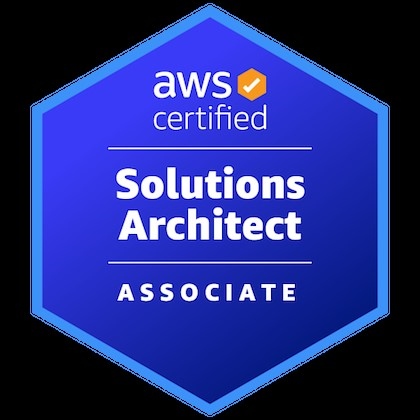
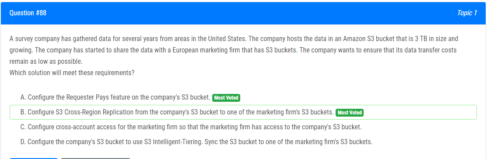
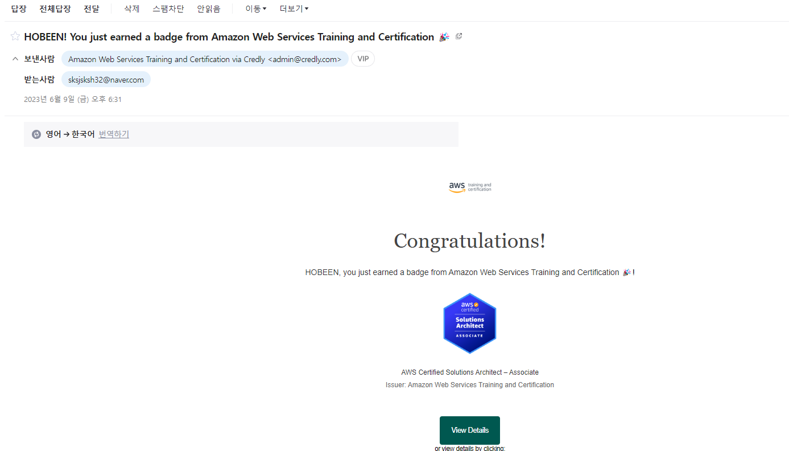
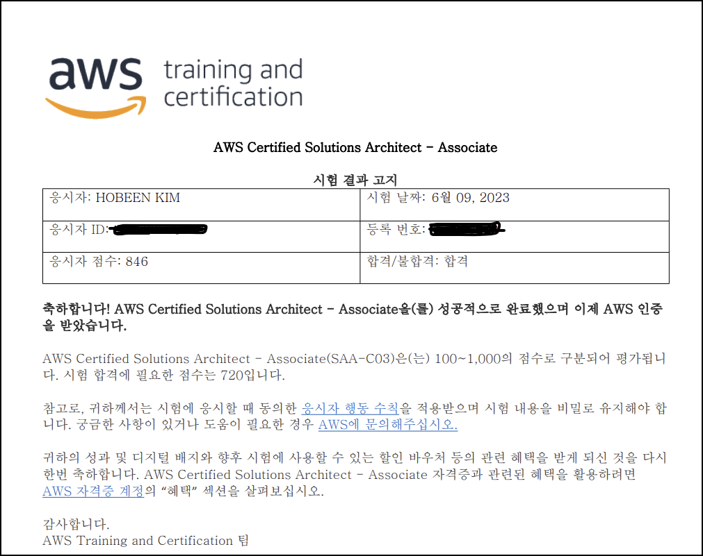

# SAA

​	SAA(Solution Architext Associate) 는 AWS 자격증 중 하나로, AWS 의 전반적인 이해를 목표로 하는 사람들이 많이 취득한다고 합니다.

# 시험 응시 이유

​	저는 백엔드 쪽을 공부하면서 간단하게 혼자 토이프로젝트를 만든 적이 있었는데요. 프론트와 서버 쪽은 빠르게 구현했었는데 배포 쪽에서 막혀서 끙끙 앓았던 경험이 있습니다. 그때는 프로젝트라는 게 처음이었고 어떤 배포 환경을 사용해야 하는지에 대한 지식이 전무했거든요. 처음에는 도메인을 예스닉에서 구매하고, 프론트 쪽을 neflify 를 사용하고 서버 배포는 AWS 에서 하려고 했습니다. 근데 SSL 인증서 등의 문제로 고민하다가 갈아엎고 Route 53, S3, EC2 를 중심으로 어찌어찌 배포했는데요. 인프라 구축에만 3 ~ 4일을 소모하면서 느낀 건 "AWS 라는 미지의 영역이 어렵고 두렵다" 라는 감정이었습니다. 근데 저는 이런 감정이 드는 저 스스로를 한심하게 생각하거든요. 그래서 AWS 따위가 뭐라고 날 한심하게 만드는거지? 라는 생각으로 AWS SAA 를 준비하게 되었습니다.

​	그렇다고 AWS 사용 경험이라곤 3 ~ 4일 정도밖에 안되는 제가 이 자격증을 취득한다고 해서 인프라를 자유자재로 구성할 수는 없겠죠. 대신 AWS 라는 기술, 그리고 배포 환경에 대한 자신감이 생긴 게 긍정적인 결과라고 할 수 있겠네요. 사실 아직 AWS 내에서도 모르는 기술이 많지만요.

# 시험 준비

## Practitioner

​	사실 저는 SAA 를 응시하기 전에 약 2주간 Practitioner 공부를 하고 응시해서 합격했습니다. Pratitioner 은 개념 정도만 물어보는거라 어렵지 않게 공부할 수 있었습니다. 하루에 2시간씩 공부했던 것 같습니다. 지금 드는 생각은 **바로 SAA 를 공부했어도 괜찮았겠다, 입니다.** 

## SAA 준비

​	23.05.12(금) 에 Practitioner 를 합격하고 주말은 다른 공부하면서 쉬다가 **23.05.14(월) 부터 23.06.09 (금) 까지 약 4주 동안 시험 준비를 했습니다.** 공부 시간 자체는 계산해보지 않았는데 강의본 시간이랑 덤프 문제 푸는 시간 등으로 계산해봤을 때 **하루에 평균 5 ~ 6시간 씩 4주 간 공부했더군요.** 초반에는 2시간씩 강의만 듣다가 후반에는 하루에 10시간씩 공부했습니다. 현재하고 있는 KDT 과정이랑 병행해야 해서 잠을 좀 많이 줄였습니다.

​	시험 준비는 크게 **강의, 덤프 문제 풀이**로 나눠볼 수 있습니다.

**강의**

1. Udemy 에서 제일 인기 많은 강의입니다. -> [【한글자막】 AWS Certified Solutions Architect Associate 시험합격!](https://www.udemy.com/course/best-aws-certified-solutions-architect-associate/)

   **약 27시간 분량이고 저는 2번 들었습니다.** 첫번째 들을 때는 개략적인 흐름 파악, 이후에 들은 내용을 바탕으로 덤프 문제를 절반정도 풀어봤습니다. 두번째 들을 때는 덤프 문제에서 약했던 개념을 좀 더 집중적으로 보면서 강의 내용을 정리했습니다. 

   할인을 할 때 구매하라고 하던데 저는 잘 모르고 구매해서 88,000원으로 구매했습니다. 할인 때는 2만원 대에도 구매할 수 있다네요? 잘 알아보시고 구매하면 되겠습니다.

   한글 자막 번역이 조금 부족한 부분도 있습니다. 저는 그래서 중간까지 영어자막 켜놓고 봤는데 모르는 용어가 쏟아지니까 도저히 안되겠어서 한글 자막을 켜서 봤습니다.

2. SAA 는 아니고 Pratitioner 준비할 때 본 인프런 강의입니다. -> [AWS Certified Cloud Practitioner 자격증 준비하기](https://www.inflearn.com/course/aws-%EC%9E%90%EA%B2%A9%EC%A6%9D-%ED%81%B4%EB%9D%BC%EC%9A%B0%EB%93%9C-%EA%B8%B0%EC%B4%88)

   **이 강의는 Practioner 준비할 때 봤고**, 해당 강사님의 강의 목록을 보면 SAA 도 있습니다. Udemy 강의는 영어라서 불편한 점이 있다면 해당 강사님의 SAA 강의도 괜찮을 거라고 생각합니다. 제가 본 건 아니니 추천드리는 건 아닙니다만, Pratitioner 준비할 때 도움은 됐습니다.

**덤프**

1. 덤프 사이트 중 가장 유명한 exampletopics 입니다. -> [ExampleTopics](https://www.examtopics.com/exams/amazon/aws-certified-solutions-architect-associate-saa-c03/)

   ​	**23.06.09 기준으로 1번부터 270 문제가 무료이며, 271번부터 약 280개 가량은 결제가 필요합니다.** 저는 무료 버전만 풀었습니다. 1번부터 260번까지 실제 시험처럼 65문제씩 끊어서 풀었구요. **틀린 문제는 따로 정리해서 어떤 개념때문에 틀렸는지 간단하게 정리**했습니다. 보통 65문제 풀면 48문제 정도가 커트라인인데요. 문제별 배점이 달라서 확실치는 않습니다. 저는 46 ~ 50문제 사이에서 왔다갔다해서 굉장히 불안했는데 실제 시험에서는 덤프 문제도 10문제 정도 나왔던 것 같고, 비슷한 개념으로 꽤 많이 나와서 **덤프를 "이해" 할 수 있다면 시험은 쉽게 합격할 수 있을 거라고 봅니다.** 하지만 답만 외워서는 당연히 안되겠죠? 

   ​	문제를 풀면서 답 보기 버튼을 눌렀을 때 나오는 답은 보통 정답이 아니며 사람들이 선택한 "Most Voted" 가 정답입니다. 근데 종종 "Most Voted" 가 여러개인 상황이 있는데요. **비율이 월등히 높은 쪽이 있다면 따라가야 하지면 반반이라면 스스로 생각해서 최적의 답을 도출해야 합니다.**

2. Udemy 에서 연습 시험 문제입니다. -> [Practice Exams \| AWS Certified Solutions Architect Associate](https://www.udemy.com/course/practice-exams-aws-certified-solutions-architect-associate/)

   ​	**총 6개 분량의 시험이 있으며 덤프 일부가 섞인 자체 제작 문제인 것 같습니다. (추측)** 가격은 할인해서 22,000원에 구매했습니다. 덤프 문제와 마찬가지로 하루에 1개씩 풀었고 어려워서 한번 더 풀어봤습니다. **풀고 난 이후는 덤프 문제랑 마찬가지로 따로 정리했습니다. 맞은 문제도 개념 상 잘 모르고 맞춘거면 정리해뒀구요.** 문제풀이와 정리까지 하면 4시간은 쓴 것 같습니다. **난이도는 덤프 문제보다 1.3배 어려운 것 같습니다.** 점수가 100% 기준으로 52% ~ 67% 를 왔다갔다 했고, 한번도 이걸로 합격해본 적이 없습니다. **개인적으로는 이것보다 차라리 덤프 사이트를 결제하면 더 나을 거 같습니다.**

3. AWS Skill Builder 연습 시험 문제입니다. -> [AWS Skill Builder](https://aws.amazon.com/ko/training/digital/)

   ​	AWS 사이트에서 교육을 위해 제공하는 강의 및 연습 시험이 있습니다. 10문제는 무료로 가능하고 **실제 시험과 같은 환경에서 풀 수 있는 연습 시험은 29달러 구독을 해야 합니다.** 강의는 안봤습니다. 저는 29달러 아끼려다가 150달러를 다시 쓰는 상황을 방지하고 싶기 때문에 시험 치기 전날에 '이 결과가 내일 결과다!' 라는 생각으로 풀어봤습니다. 결과는 14개 정도 틀려서 약 800점 정도 점수를 얻었네요. **문제 자체는 Udemy 보다는 훨씬 쉽고, 한글이라 그런지 덤프보다도 쉬웠습니다.** 그래서 풀다가 '이렇게 쉬워도 되나' 했는데 14개나 틀렸었네요.

**공부 순서**

​	지극히 개인적인 공부 순서이며, 과거 기록일 뿐이지 합격자의 정답 선택지가 아닙니다. 본인 공부 스타일은 본인이 제일 잘 알겁니다.

1. 1, 2주차는 Udemy 강의 1회독 (2시간 x 14일)

2. 3주차부터 하루에 예제 문제를 하루에 하나씩 풀고 정리 (4시간) -> 예제 문제는 Udemy 6개, exampletopics 4개, AWS Skill Builder 1개로 총 13개 분량이었습니다.

3. 3, 4주차에 Udemy 강의 다시 보면서 정리 (3시간 x 14일, 정리하면서 보느라 시간이 1.5배 걸렸습니다.)

4. 시험 날 아침 : 강의 정리본, 오답노트 훑어보기

   

# 시험 & 합격 후기

​	시험은 부산 앤아버 학원에서 오프라인에서 봤습니다. 온라인에서 보기 위해 세팅하는 귀찮음이 더 컸거든요. 06시에 기상해서 부산 서면에 0740분쯤에 도착하고 스타벅스에 앉아서 1시간반 가량 정리본과 오답노트를 복습하고 갔습니다.

​	신분증은 여권과 신용카드 챙겨갔습니다. 메인 신분증 + 신용카드면 됩니다.

​	위 문제는 덤프 문제인데요. **실제 시험에서 "그대로"  나왔습니다.** 그런데 exampletopics 사이트에서도 반반인 문제고, 댓글창도 박터지게 싸우고 있었죠. 저도 그때는 뭐가 정답인지 확신할 수 없었는데요. 웃긴건 A, B 가 반반인데 저는 실제 시험 때 C 를 선택했다는 겁니다. 금붕어인걸까요. **회사의 전송 비용을 줄이려면 Requester Pays 가 맞고, 전송 비용 자체를 줄이는 건 CRR 이 맞는데 답이 대체 뭘까요.** 이걸로 멘탈이 흔들렸다기보다는 답이 뭔지 영영 미궁 속으로 빠져버리는 게 스트레스네요.

​	어쨋든 **시험 자체는 AWS Skill Builder 와 난이도가 비슷했습니다.** 결과도 비슷하게 나왔구요. **근데 보통 바로 결과가 나오고, 저번 Practitioner 시험에서도 결과가 바로 나왔는데 이번에는 바로 안나오더군요.** 저번 Practitioner 시험 관련 메일을 다시 찾아보니까 당일 18시 30분에 합격했으니 배지 등록하라는 메일이 왔었거든요? 그래서 이번에도 합격하면 이메일이 오겠지 하고 점심먹고부터 메일을 기다리는데, 솔직히 심적으로 약간 부담돼서 3시부터 그냥 잤습니다. 근데 계속 AWS 합격하는 꿈 꾸고 떨어지는 꿈 꾸고 깨고 해서 오히려 안자는 편이 나았을 것 같습니다.

​	이메일 자체는 18시 31분에 왔습니다. 1분 늦었네요. 자동 발송일텐데 어디서 오차가 생긴걸까요?

​	AWS 시험센터에서 해당 결과를 출력할 수 있습니다. 846점으로 꽤 준수한 성적으로 통과했네요. ~~통과야 감사하지만 제가 그정도로 높은 수준은 아닌거 같은데요.~~ 자격증을 취득을 목표로 공부할 때 효율적인 공부 수준은 턱걸이로 합격하는 게 극한의 효율일 수도 있는데요. 그래서 정보처리기사 필기를 볼 때는 점수가 너무 높아서 효율적으로 시간을 투자하지 못했다는 생각이 들었었습니다. 하지만 AWS 시험에서 요구하는 지식이 실무에서 사용하는 것과 유사하다고 하니 점수가 높으면 높을 수록 개인적으로 좋겠죠.

​	SAP 는 만약 AWS 인프라를 제가 관리해야 하는 회사에 취업하게 된다면 도전할 듯 합니다. 취준생에게는 SAA 까지가 적당하다고 생각합니다. 합격 보상으로 제가 좋아하는 영한님 강의 들으러 가야겠습니다. 근 2주간 다른 공부는 하나도 못했거든요.

​	SAA 응시하시는 분들 모두 파이팅하시고 모두 합격하길 응원합니다!!

