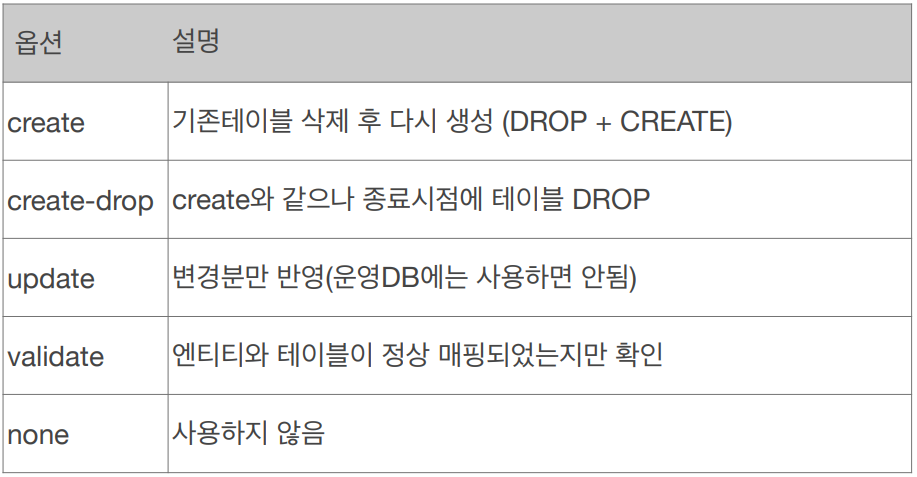
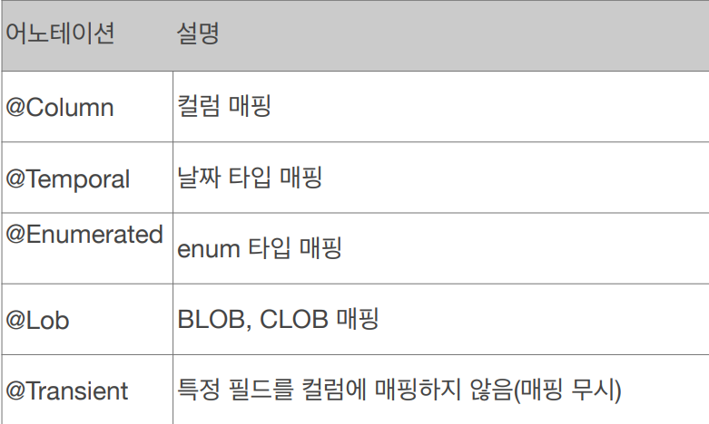
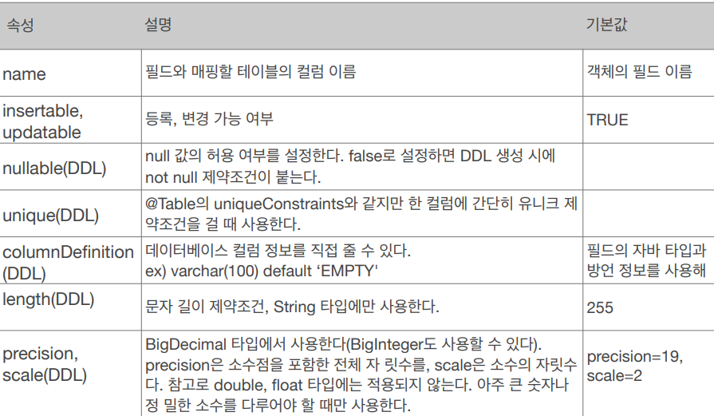
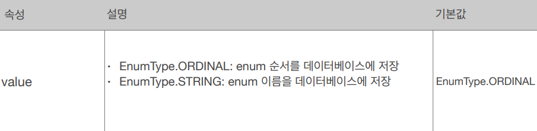
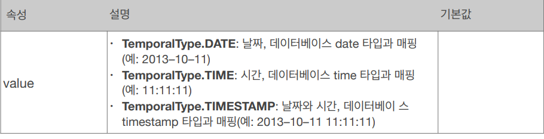
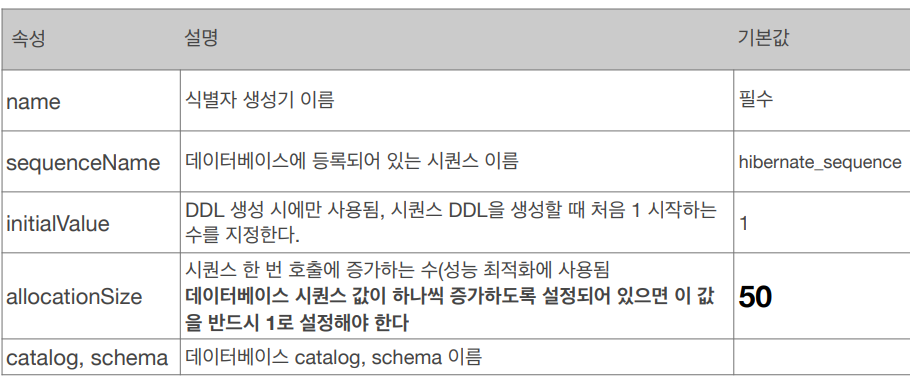
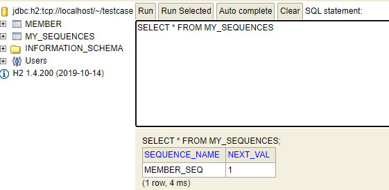
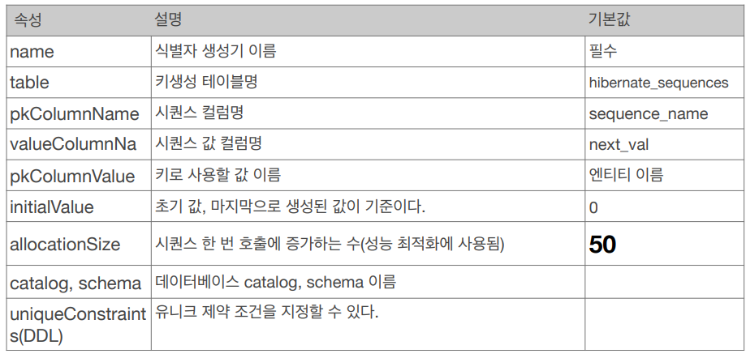
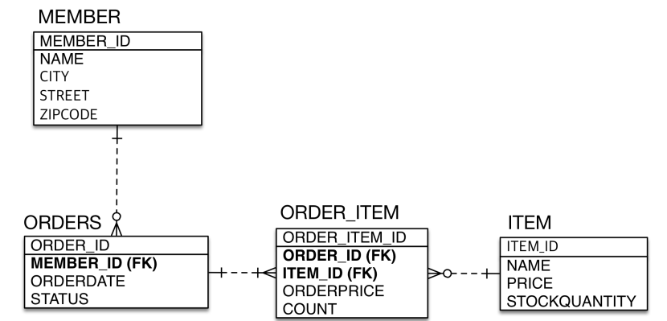
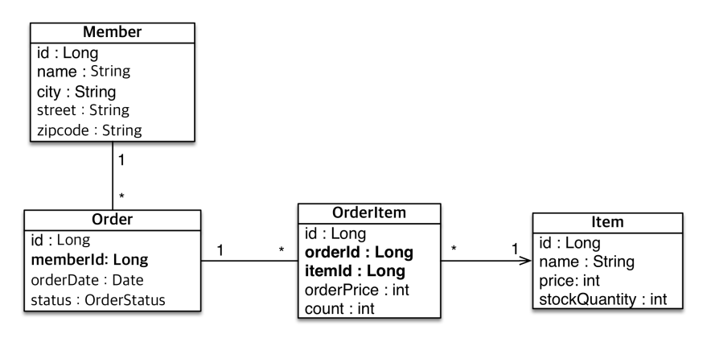

<div class="notice--danger">
    <b>인프런 강의 내용입니다.</b><br/><a href="https://www.inflearn.com/course/ORM-JPA-Basic/dashboard">자바 ORM 표준 JPA 프로그래밍 - 기본편</a>
</div>

# 객체와 테이블 매핑

​	JPA 를 사용해서 테이블과 매핑할 클래스는 @Entity 어노테이션을 필수로 붙여줘야 합니다. 그리고 몇가지 규칙이 있는데요. 일단 기본 생성자는 필수입니다. JPA 를 구성하는 라이브러리들이 객체를 통해 동적으로 구성하기 때문입니다.또한 final, enum, interface, inner 클래스 등은 사용할 수 없습니다.

```java
package hellojpa;

import javax.persistence.*;

@Entity
@Table(name="mbr") //보통 사용하지 않음
public class Member {
    @Id
    private Long id;
    private String name;

    public Member() {}

    public Member(Long id, String name) {
        this.id = id;
        this.name = name;
    }

   	//getter, setter ...
}
```

@Table(name="name") 로 매핑되는 테이블 이름을 변경할 수 있습니다. 하지만 같은 클래스 이름이 없으면 가급적 기본값을 사용합니다.

# 데이터베이스 스키마 자동 생성

​	클래스를 읽어서 데이터베이스에 맞는 적절한 DDL 을 생성할 수 있습니다. 이는 **운영 환경에서는 절대 사용해서는 안되고 개발 환경에서만 사용해야 합니다.** 

persistence.xml 의 해당 property 를 변경해서 적용할 수 있습니다.

```xml
<property name="hibernate.hbm2ddl.auto" value="create" />
```



​	create, create-drop 은 기존 테이블을 DROP 명령어로 드랍시킨 뒤 CREATE 로 생성합니다. 즉, **JPA 가 직접 클래스를 읽고 적절한 SQL 을 만들어서 날리는 겁니다.**

​	update 는 변경사항이 "추가"될 때만 ALTER DDL 로 반영됩니다. 필드가 없어지는 등의 변경사항은 반영되지 않습니다. 따라서 자칫 괜찮다고 생각할 수 있지만, ALTER 구문도 DB 에 어떤 영향을 줄지 모릅니다. 그리고 db 가 크면 락이 몇분간 걸리는 문제도 있습니다.


# 필드와 컬럼 매핑

​	필드에 붙는 어노테이션입니다.



**@Column** 에는 다음과 같은 속성이 따라올 수 있습니다.



아래와 같이 사용할 수 있습니다.

```java
Entity
@Table(uniqueConstraints = {@UniqueConstraint(
        name = "NAME_AGE_UNIQUE",
        columnNames = {"NAME", "AGE"}
)})
public class Member {
    @Id
    private Long id;
    @Column(name = "name", nullable = false, unique = true, columnDefinition = "varchar(100) default ‘EMPTY'")
    private String username;
    private Integer age;
    @Enumerated(EnumType.STRING)
    private RoleType roleType;
    @Temporal(TemporalType.TIMESTAMP) //db 에서는 보통 날짜, 시간, 날짜+시간 으로 구분함
    private Date createdDate;
    @Temporal(TemporalType.TIMESTAMP)
    private Date lastModifiedDate;
    @Lob //varchar 를 넘는 큰 컨텐츠
    private String description;
    @Transient //db 에 영향을 주지 않음
    private int temp;


    public Member() {
    }
}
```

이 때 @Column 의 Unique 속성은 Insert 가 다르게 되기 때문에 보통 클래스에서 `uniqueConstraints` 속성을 사용합니다. 

**@Enumerated**



​	자바 enum 타입을 매핑할 때 사용합니다. 주의사항으로 **ORDINAL** 으로는 사용하지 않아야 합니다. enum 을 추가하면서 순서가 중간에 변경될 수도 있기 때문입니다.

**@Temporal**



​	날짜 타입(java.util.Date, java.util.Calendar)을 매핑할 때 사용합니다. 하지만 LocalDate, LocalDateTime을 사용할 때는 생략 가능하기 때문에 잘 사용되지 않습니다.

**@Lob**

​	데이터베이스 BLOB, CLOB 타입과 매핑됩니다. @Lob에는 지정할 수 있는 속성이 없습니다. **매핑하는 필드 타입이 문자면 CLOB 으로 매핑되고 나머지는 BLOB 으로 매핑됩니다**.

- CLOB: String, char[], java.sql.CLOB 
- BLOB: byte[], java.sql. BLOB 

# 기본 키(PK) 매핑

​	테이블의 기본 키를 매핑하는 방법은 **직접 할당과 자동 생성(@GeneratedValue)** 이 있습니다.

**직접 할당**은 직접 로직을 통해 겹치지 않게 기본키를 생성하면 됩니다. 

## **자동생성**

**AUTO**

​	GeneratedValue 의 기본값입니다. SQL Dialect 에 따라 자동 지정됩니다.

**IDENTITY**

​	IDENTITY 전략은 주로 MySQL, PostgreSQL, SQL Server, DB2에서 사용합니다. mysql 의 auto_increment 와 같습니다.

```java
@Entity
public class Member {
    @Id
    @GeneratedValue(strategy = GenerationType.IDENTITY)
    private String id;

    public Member() {
    }
}
```

​	id 값은 DB 에 쿼리문이 날라갔을 때 할당됩니다. 하지만 이렇게 되면 영속성 컨텍스트에서 사용할 수 없습니다. 왜냐하면 쿼리문을 날리기 전에 1차 캐시에 저장될 때, id 값을 기준으로 저장되기 때문입니다. **따라서 IDENTITY 만 예외로 em.persist 를 한 시점에 바로 insert 쿼리문을 날리고 내부적으로 리턴값을 들고와서 1차 캐시로 넣습니다.** 성능 상의 차이는 크게 없다고 합니다.

**SEQUENCE**

​	오라클에서 주로 사용하는 전략입니다. SEQUENCE 는 유일한 값을 순서대로 생성하는 특별한 데이터베이스 오브젝트입니다.

```java
@Entity
@SequenceGenerator(
    name = "MEMBER_SEQ_GENERATOR",
    sequenceName = "MEMBER_SEQ", //매핑할 데이터베이스 시퀀스 이름
    initialValue = 1, allocationSize = 1) 
public class Member {
    @Id
    @GeneratedValue(strategy = GenerationType.SEQUENCE, generator = "MEMBER_SEQ_GENERATOR")
    private String id;
	private String name;
    
    public Member() {
    }
}
```

**@SequenceGenrator** 속성입니다.



​	persist 를 하면 sequence 에서 **call next value for MEMBER_SEQ 쿼리가 넘어가고 해당 id 값을 DB 내 MEMBER_SEQ_GENERATOR 테이블에서 받아서 영속성 컨텍스트에 저장됩니다.** IDENTITY 와 다르게 아직 DB insert Query 는 날라가지 않습니다.

​	allocationSize 가 50 이면 미리 id 값을 50개를 영속성 컨텍스트에 저장하고 사용합니다. 해당 시점에 DB 의 MEMBER_SEQ 값 51 이 되어있습니다. 따라서 50개를 사용하기 전까지 call next value 쿼리를 보내지 않습니다.

> H2 DB 에서 allocationSize 를 50 으로 두고 `persist()` 를 2번 이상하게 되면 (ex. 5개) `call next value for member_seq` 가 2번 호출되게 됩니다. H2 DB에서는 최초 call next value 호출에 1을 return 하고, 그 이후부터 50 씩 더하기 때문입니다. 만약 1개만 `persist()` 를 하면 `call next value for member_seq` 는 1번만 호출됩니다.

**TABLE 전략**

​	TABLE 전략은 키 생성 전용 테이블을 하나 만들어서 **데이터베이스 시퀀스를 흉내내는 전략**입니다. 장점은 모든 데이터베이스에 적용 가능하다는 거지만, 테이블을 하나 더 만든다는 점에서 성능 상에 불이익이 있습니다.

```java
@Entity
@TableGenerator(
    name = "MEMBER_SEQ_GENERATOR",
    table = "MY_SEQUENCES",
    pkColumnValue = "MEMBER_SEQ", allocationSize = 1)
public class Member {
    @Id
    @GeneratedValue(strategy = GenerationType.TABLE,
    generator = "MEMBER_SEQ_GENERATOR")
    private Long id;
   	private String name;
    
    ...
}
```



​	위 사진과 같이 저장될 때마다 NEXT_VAL++ 가 됩니다.

**@TableGenerator** 속성입니다.



## 권장하는 식별자 전략

기본 키 제약 조건은 null 이 아니어야 하며 유일해야 하고, 변하면 안됩니다. 따라서 미래까지 이 조건을 만족하는 자연키는 찾기는 어렵고, **대리키(대체키)를 사용해야 합니다.** 권장되는 방법은 Long형 + 대체키 + 키 생성전략 사용하는 것입니다.

# 실전 예제 - 1. 요구사항 분석과 기본 매핑

​	먼저 요구사항입니다. 

- 회원과 주문의 관계: 회원은 여러 번 주문할 수 있습니다. (1:N)
- 주문과 상품의 관계: 주문할 때 여러 상품을 선택할 수 있습니다. 반대로 같은 상품도 여러 번 주문될 수 있습니다. (N:N)

​	테이블 설계는 아래와 같이 되겠습니다.



하지만 이 테이블을 엔티티 설계로 바꾸면 어떻게 될까요? 그대로 옮기면 아래와 같이 됩니다.



이 설계는 객체 설계를 테이블 설계에 맞춘 방식입니다. PK 를 보면 id 값을 그대로 가져왔죠. 따라서 객체 그래프 탐색이 불가능해지고 참조가 없으므로 UML도 잘못되었습니다. **JPA 를 사용하는 목적이 사라진 겁니다.**

이제 계속해서 해당 설계를 발전시켜보겠습니다.