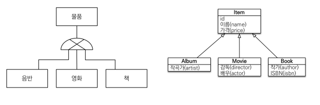
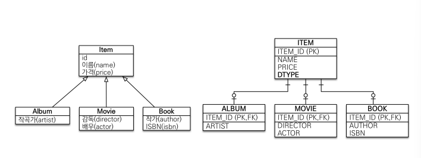
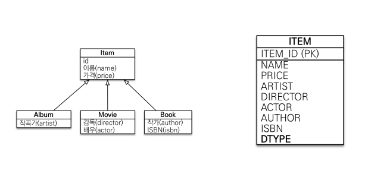
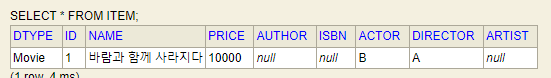
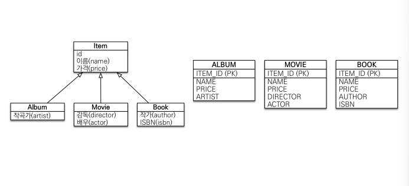
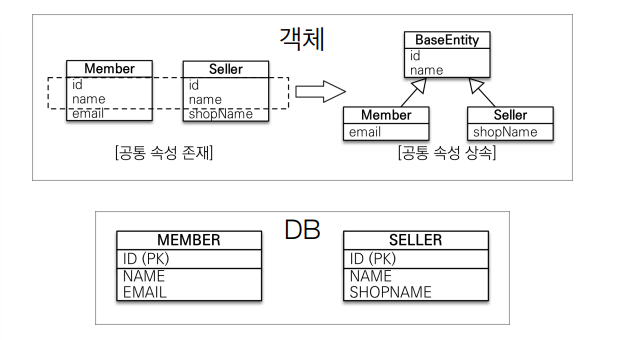
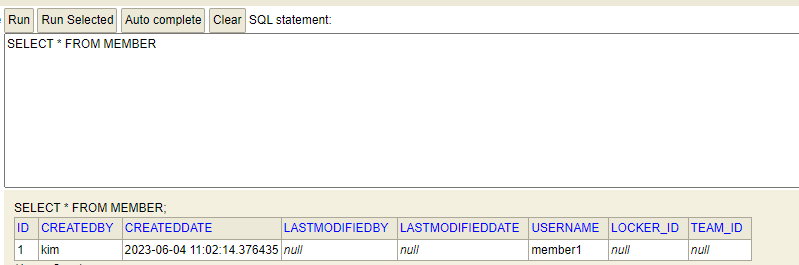
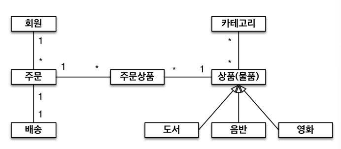
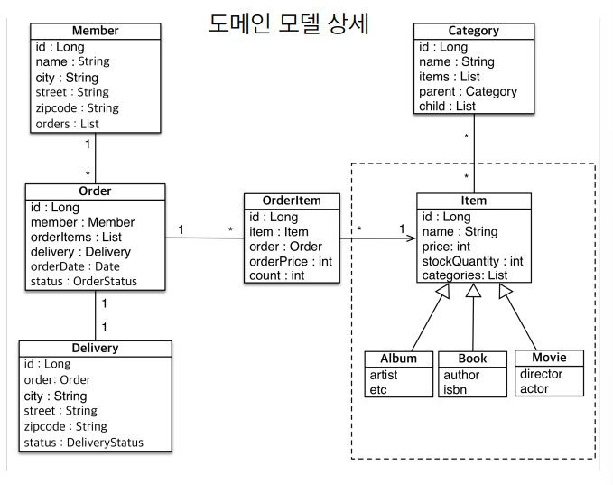

<div class="notice--danger">
    <b>인프런 강의 내용입니다.</b><br/><a href="https://www.inflearn.com/course/ORM-JPA-Basic/dashboard">자바 ORM 표준 JPA 프로그래밍 - 기본편</a>
</div>
# 상속관계 매핑

​	관계형 데이터베이스는 상속 관계가 없습니다. 하지만 슈퍼타입 서브타입 관계라는 모델링 기법이 객체 상속과 유사합니다. 상속관계 매핑은 객체의 상속과 구조와 DB의 슈퍼타입 서브타입 관계를 매핑하는 것입니다.



​	상속관계 매핑은 **조인 전략, 단일 테이블 전략, 구현 클래스별 테이블 전략**이 있습니다.

## 조인 전략



​	조인전략은 각각의 테이블과 부모 테이블을 FK 를 통해 조인하는 방법입니다. 테이블 정규화가 가장 잘 된 방법이며 외래 키 참조 무결성 제약조건을 활용할 수 있습니다. 또한 저장공간을 효율적으로 사용합니다. **조인 전략이 정석이라고 생각해야 합니다.** 아래 나오는 단점들도 큰 문제는 없습니다.

​	반면, 조회 시 조인을 많이 사용하기 때문에 성능이 저하되고, 조회 쿼리가 복잡해집니다. 또한 데이터 저장시 INSERT SQL 을 2번 호출하는 문제가 있습니다.

```java
@Entity
@Inheritance(strategy = InheritanceType.JOINED)
@DiscriminatorColumn //DTYPE 을 넣어줍니다. 엔티티명이 들어갑니다.
public class Item {

    @Id
    @GeneratedValue
    private Long id;
    private String name;
    private int price;
}

@Entity
public class Album extends Item{

    private String artist;
}

@Entity
@DiscriminatorValue("B")
public class Book extends Item{

    private String author;
    private String isbn;
}

@Entity
public class Movie extends Item{
    private String director;
    private String actor;
}
```

- `@Inheritance` : 상속관계 전략을 결정합니다. 속성으로 `strategy = InheritanceType.JOINED` 를 넣습니다.
- `@DiscriminatorColumn` : DTYPE 을 넣어줍니다. 레코드값으로 엔티티명이 들어갑니다. 레코드별로 어떤 테이블의 값인지 구분하기 위해 DTYPE 을 넣어주는 게 좋습니다.
- `@DiscriminatorValue("B")` : DTYPE 에 들어갈 레코드값을 임의로 지정합니다. 기본 값은 테이블명("BOOK")입니다.

​	다음과 같이 저장 및 조회 시 조인으로 조회합니다.

```mysql
Hibernate: 
    /* insert hellojpa.ex.Movie
        */ insert 
        into
            Item
            (name, price, DTYPE, id) 
        values
            (?, ?, 'Movie', ?)
Hibernate: 
    /* insert hellojpa.ex.Movie
        */ insert 
        into
            Movie
            (actor, director, id) 
        values
            (?, ?, ?)
Hibernate: 
    select
        movie0_.id as id2_2_0_,
        movie0_1_.name as name3_2_0_,
        movie0_1_.price as price4_2_0_,
        movie0_.actor as actor1_6_0_,
        movie0_.director as director2_6_0_ 
    from
        Movie movie0_ 
    inner join
        Item movie0_1_ 
            on movie0_.id=movie0_1_.id 
    where
        movie0_.id=?
```


## 단일 테이블 전략



​	모든 필드를 단일 테이블에 넣고, DTYPE 을 통해 구분합니다. 전략을 따로 선택하지 않는다면 단일 테이블 전략이 선택됩니다. 조인이 필요 없으므로 일반적으로 조회 성능이 빠르고 조회 쿼리가 단순합니다.

​	하지만 자식 Entity 가 매핑한 컬럼은 모두 Null 을 허용해야 하며, 테이블 자체가 커져서 상황에 따라 조회 성능이 오히려 느려질 수 있습니다.

​	아래와 같이 작성합니다.

```java
@Entity
@Inheritance(strategy = InheritanceType.SINGLE_TABLE)
public class Item {

    @Id
    @GeneratedValue
    private Long id;
    private String name;
    private int price;
}

@Entity
public class Album extends Item{

    private String artist;
}

@Entity
public class Movie extends Item{

    private String director;
    private String actor;
}

@Entity
public class Book extends Item{

    private String author;
    private String isbn;
}
```

- `@Inheritance` : 상속관계 전략을 결정합니다. 속성으로 `strategy = InheritanceType.SINGLE_TABLE` 를 넣습니다.
- `@DiscriminatorColumn` : 싱글 테이블에서는 DTYPE 이 무조건 들어가야 구분되기 때문에 해당 어노테이션을 넣어주지 않아도 자동으로 DTYPE 이 들어갑니다.
- `@DiscriminatorValue` : 넣을 수 있지만 따로 넣지는 않았습니다.

​	아래와 같이 하나의 테이블에 다 들어가게 됩니다.



## 구현 클래스별 테이블 전략



​	개별 테이블 3개만 만드는 전략입니다. 서브 타입을 명확하게 구분해서 처리할 때 효과적이며 not null 제약조건 사용할 수 있습니다. 하지만 **이 전략은 데이터베이스 설계자와 ORM 전문가 둘 다 추천하지 않습니다.** 여러 자식 테이블을 함께 조회할 때 성능이 느리며(UNION SQL 필요) 자식 테이블을 통합해서 쿼리하기가 어렵습니다.

```java
@Entity
@Inheritance(strategy = InheritanceType.TABLE_PER_CLASS)
public abstract class Item {

    @Id
    @GeneratedValue
    private Long id;
    private String name;
    private int price;
}

@Entity
public class Album extends Item{

    private String artist;
}

@Entity
public class Movie extends Item{

    private String director;
    private String actor;
}

@Entity
public class Book extends Item{

    private String author;
    private String isbn;
}
```

- **Item 클래스 :** 추상타입이 되어야 합니다. 그렇지 않으면 Item 테이블이 또 만들어지게 됩니다.
- `@Inheritance` : 상속관계 전략을 결정합니다. 속성으로 `strategy = InheritanceType.TABLE_PER_CLASS` 를 넣습니다.
- `@DiscriminatorColumn` :  DTYPE 은 사용되지 않습니다.

​	이제 아래와 같이 조회 및 저장을 해보겠습니다. 이때 부모 클래스를 통해 찾아보겠습니다.

```java
public static void main(String[] args){
    EntityManagerFactory emf = Persistence.createEntityManagerFactory("hello");

    EntityManager em = emf.createEntityManager();

    EntityTransaction tx = em.getTransaction();
    tx.begin();
    try{

        Movie movie = new Movie();
        movie.setDirector("A");
        movie.setActor("B");
        movie.setName("바람과 함께 사라지다");
        movie.setPrice(10000);

        em.persist(movie);

        em.flush();
        em.clear();

        Item findMovie = em.find(Item.class, movie.getId()); //부모 타입으로 검색
        System.out.println("findMovie = " + findMovie);

        tx.commit();
    }catch (Exception e){
        tx.rollback();
    }finally {
        em.close();
    }
    emf.close();
}
```

`Item findMovie = em.find(Item.class, movie.getId());` 을 수행하기 위해 아래와 같이 UNION 을 사용한 SQL 문이 날라갑니다. movie 의 id 가 어느 테이블에 있는지 모르니 모두 조회해봐야 하기 때문이빈다.

```mysql
select
    item0_.id as id1_2_0_,
    item0_.name as name2_2_0_,
    item0_.price as price3_2_0_,
    item0_.author as author1_1_0_,
    item0_.isbn as isbn2_1_0_,
    item0_.actor as actor1_6_0_,
    item0_.director as director2_6_0_,
    item0_.artist as artist1_0_0_,
    item0_.clazz_ as clazz_0_ 
from
    ( select
        id,
        name,
        price,
        author,
        isbn,
        null as actor,
        null as director,
        null as artist,
        1 as clazz_ 
    from
        Book 
    union
    all select
        id,
        name,
        price,
        null as author,
        null as isbn,
        actor,
        director,
        null as artist,
        2 as clazz_ 
    from
        Movie 
    union
    all select
        id,
        name,
        price,
        null as author,
        null as isbn,
        null as actor,
        null as director,
        artist,
        3 as clazz_ 
    from
        Album 
) item0_ 
where
item0_.id=?
```


# @MappedSuperclass - 매핑 정보 상속



​	`@MappedSuperclass` 는 필드값이 계속 반복되어 사용되면서 공통 속성을 두고 싶을 때 사용합니다. DB 에서는 적용할 수 없습니다.

​	예를 들어 DB 가 누가 생성, 수정했고 언제 수정되었는지 정보를 모든 테이블에 넣어야 한다고 가정하겠습니다. 다음과 같은 추상 클래스를 만들고 모든 Entity 가 상속하게 합니다. 추상 클래스가 아니어도 되지만 **직접 생성해서 사용할 일이 없으므로 추상 클래스가 권장됩니다.**

```java
@MappedSuperclass
public class BaseEntity {

    private String createdBy;
    private LocalDateTime createdDate;
    private String lastModifiedBy;
    private LocalDateTime lastModifiedDate;

	//getter, setter
	
}

@Entity
public class Member extends BaseEntity{
    ...
}
```

​	BaseEntity 에 `@MappedSuperclass` 를 붙여서 매핑 정보를 제공할 수 있게 합니다. 이제 상속받은 모든 Entity 가 해당 필드를 사용할 수 있게 됩니다.



​	`@MappedSuperclass` 는 엔티티가 아니기 때문에 앞에서 설명한 상속관계 매핑은 아닙니다. 부모 클래스를 상속 받는 자식 클래스에 매핑 정보만 제공하는 역할 입니다. 조회 및 검색(em.find(BaseEntity))이 불가능 합니다. 주로 등록일, 수정일, 등록자, 수정자 같은 전체 엔티티에서 공통 으로 적용하는 정보를 모을 때 사용합니다.

> @Entity 클래스는 엔티티나 @MappedSuperclass로 지정한 클래스만 상속 가능합니다.


# 실전 예제 4. 상속 관계 매핑



​	요구사항은 상품(Item) 과 도서, 음반, 영화를 상속관계 매핑을 하는 것과 모든 데이터에 등록일과 수정일을 넣는 것입니다. 다음과 같이 객체를 설계할 수 있습니다.



​	이 때 상속관계 매핑 전략을 `SINGLE_TABLE` 로 사용해보겠습니다.

```java
@Entity
@Inheritance(strategy = InheritanceType.SINGLE_TABLE)
public abstract class Item extends BaseEntity{
...
}

@MappedSuperclass
public abstract class BaseEntity {

    private String createdBy;
    private LocalDateTime createdDate;
    private String lastModifiedBy;
    private LocalDateTime lastModifiedDate;
}

@Entity
public class Album extends Item {

    private String artist;
    private String etc;
}

@Entity
public class Book extends Item {

    private String author;
    private String isbn;
}

@Entity
public class Movie extends Item{

    private String director;
    private String actor;
    
}
```

​	상속관계 매핑의 부모 클래스(Item) 는 Album, Book, Movie 가 상속합니다. 또한 Item 은 BaseEntity 를 상속받고 있으므로 자식 클래스들도 BaseEntity 가 적용됩니다. 테이블은 다음과 같이 설계 됩니다.


