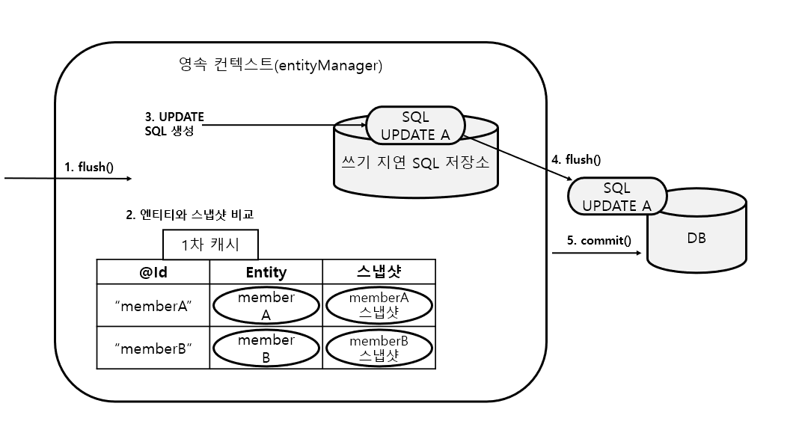

# merge 와 변경감지

​	JPA 에서 DB 테이블을 수정하기 위해서 merge 와 변경감지 방법을 사용할 수 있습니다. 이 중 merge 는 준영속 상태의 엔티티를 받아서 그 정보로 새로운 영속 상태의 엔티티를 만들어 저장하는 방식이며, 변경감지는 영속 상태의 엔티티를 변경하는 방식입니다.

## 병합 : merge

​	병합은 준영속 상태의 엔티티를 다시 영속 상태로 변경하여 저장하게 합니다. 이 때 준영속 상태뿐만 아니라 비영속 상태의 엔티티도 저장할 수 있는데, 이때는 식별자가 없으므로 새로운 값으로 저장됩니다.

```java
public class JpaMain {

    static EntityManagerFactory emf = Persistence.createEntityManagerFactory("hello");

    public static void main(String[] args){

        Member member = createMember("memberA", "회원1"); // 1
        
        member.setUsername("회원명변경"); // 2
        
        mergeMember(member); // 3
    }
    
    static Member createMember(String id, String username) {

        EntityManager em = emf.createEntityManager();
        EntityTransaction tx = em.getTransaction();
        tx.begin();

        Member member = new Member();
        member.setId(id);
        member.setUsername(username);
        
        em.persist(member);
        tx.commit();
        
        em.close();
        
        return member;
    }
    
    static void mergeMember(Member member){
        EntityManager em = emf.createEntityManager();
        EntityTransaction tx = em.getTransaction();
        tx.begin();
        
        Member mergeMember = em.merge(member);
        
        tx.commit();
        
        System.out.println("member = " + member.getUsername());
        System.out.println("mergeMember = " + mergeMember.getUsername());
        
        System.out.println("em.contains(member) = " + em.contains(member));
        System.out.println("em.contains(mergeMember) = " + em.contains(mergeMember));
        
        em.close();
    }
}
```

1. `createMember` 를 통해 `member` 가 테이블에 저장됩니다. 이후 `em.close()` 로 `member` 는 준영속 상태가 됩니다.
2. `member.setUsername("회원명변경");` 를 통해 회원 이름을 변경했지만 수정 사항이 DB 에 반영되지 않습니다.
3. `mergeMember(member);` 에서 `em.merge(member);` 를 실행하면 엔티티의 식별자 값(id) 으로 1차 캐시를 조회하고, 엔티티가 없으면 DB 에서 엔티티를 조회해서 1차 캐시에 저장합니다. 그리고 조회한 영속 엔티티(`mergeMember`) 에 `member` 엔티티 값을 채워넣습니다.

​	병합이 간편한 것 같지만 병합을 사용하면 모든 속성이 변경됩니다. **병합시 값이 없으면 null 로 업데이트 할 위험도 있습니다. 병합은 모든 필드를 교체하기 때문입니다.** **이는 DTO 를 통해 원하는 값만 받아서 member 를 만든 후 병합을 하면, 기존 값이 없어지는 문제점이 발생합니다.**

​	따라서 아래의 변경감지를 사용하는 게 좋습니다.

## 변경감지(dirty checking)

​	변경감지(dirty checking) 는 영속 상태의 엔티티의 값을 변경했을 때 변경한 값을 JPA 가 감지해서 자동으로 update 하는 방법입니다.

```java
public class JpaMain {

    static EntityManagerFactory emf = Persistence.createEntityManagerFactory("hello");

    public static void main(String[] args){

        EntityManager em = emf.createEntityManager();
        EntityTransaction tx = em.getTransaction();
        tx.begin();

        Member member = new Member();
        member.setUsername("회원1");
        
        em.persist(member); // 1
        
        member.setUsername("회원1수정"); // 2
        
        tx.commit();
        em.close();
    }
}
```

​	위 코드를 보면 1 에서 `member` 를 영속 상태로 만든 후 2 에서 `member.setUsername("회원1수정");` 로 이름을 변경합니다. 이후 별다른 저장 로직없이 `tx.commit();` 으로 커밋을 하면 `member` 의 이름은 "회원1수정" 으로 변경됩니다.



JPA 는 영속성 컨텍스트를 보관할 때, 최초 상태를 복사해서 저장해두는데, 이를 스냅샷이라고 합니다. 그리고 플러시 시점에서 스냅샷과 엔티티를 비교해서 변경된 지점을 찾습니다.

1. 트랜잭션을 커밋하면 엔티티 매니저 내부에서 먼저 `flush()` 가 호출됩니다.
2. 엔티티와 스냅샷을 비교해서 변경된 엔티티를 찾습니다.
3. 변경된 엔티티가 있으면 수정 쿼리를 생성해서 `쓰기 지연 SQL 저장소`로 보냅니다.
4. `쓰기 지연 저장소` 의 SQL 을 DB 에 보냅니다.
5. DB 트랜잭션을 커밋합니다.

변경 감지는 영속성 컨텍스트가 관리하는 영속 상태의 엔티티에만 적용됩니다. 이렇게 생성된 UPDATE SQL 문의 형태는 아래와 같습니다.

```mysql
UPDATE MEMBER
SET
	NAME = ?,
	AGE = ?,
	GRADE =?,
	...
WHERE
	id =?
```

NAME 만 변경했으므로 `UPDATE MEMBER SET  NAME = ? WHERE id =?` 으로 나갈 것 같지만 JPA 의 기본 전략은 모든 필드를 업데이트하는 것입니다. 이는 다음과 같은 장점이 있습니다.

- 모든 필드를 사용하면 수정 쿼리가 항상 같기 때문에 애플리케이션 로딩 시점에 수정 쿼리를 미리 생성해두고 재사용할 수 있습니다.
- DB 에 동일한 쿼리를 보내면 DB 는 이전에 한번 파싱된 쿼리를 재사용할 수 있습니다.

**만약 필드가 많거나 저장되는 내용이 너무 크면 수정된 데이터만 사용해서 동적으로 UPDATE SQL 을 생성하는 전략을 선택하면 됩니다.**

```java
@Entity
@org.hibernate.annotations.DynamicUpdate
public class Member{...}
```

`@org.hibernate.annotations.DynamicUpdate` 은 하이버네이트 확장 기능으로, 수정된 데이터만 사용해서 동적으로 UPDATE SQL 을 생성합니다.

> @DynamicInsert 도 있는데, 데이터를 저장할 때 데이터가 존재하는(null 이 아닌) 필드만으로 INSERT SQL 을 동적으로 생성하는 어노테이션입니다.

대략 컬럼이 30개 이상이 되면 기본 방법인 정적 수정 쿼리보다 `@DynamicUpdate` 를 사용한 동적 수정 쿼리가 빠릅니다. 물론 가장 정확한 방법은 직접 테스트해보는 것입니다. 하지만 한 테이블에 컬럼이 30개 이상 된다면 테이블 설계 상 책임이 적절히 분리되지 않았을 가능성이 높습니다.


# merge 와 dirty checking

​	실무에서는 보통 업데이트 기능이 매우 제한적입니다. 그런데 병합은 모든 필드를 변경해버리고, 데이터 가 없으면 null 로 업데이트 해버립니다. 병합을 사용하면서 이 문제를 해결하려면, 변경 폼 화면에서 모든 데 이터를 항상 유지해야 합니다. 실무에서는 보통 변경가능한 데이터만 노출하기 때문에, 병합을 사용하는 것이 오히려 번거롭습니다.

​	**따라서 엔티티를 변경할 때는 거의 모든 경우에 변경 감지를 사용하는 게 좋습니다.**

​	**merge 는 업데이트에서 사용한다기보다는, 엔티티가 영속 상태에서 벗어났을 때, 다시 영속상태로 복귀시키기 위해서 사용합니다.**