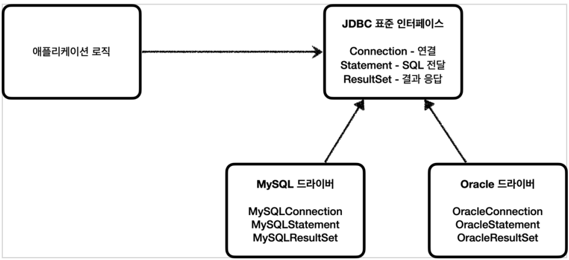
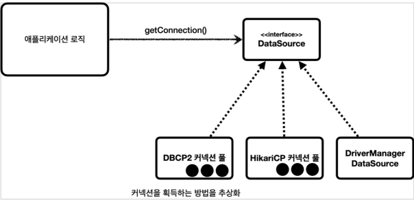
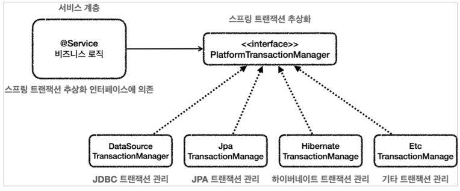
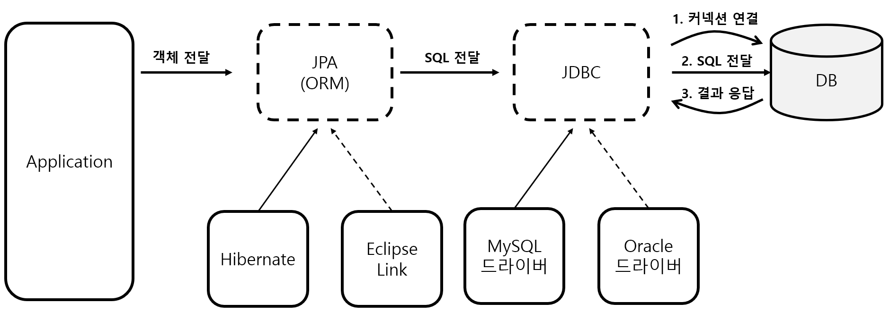
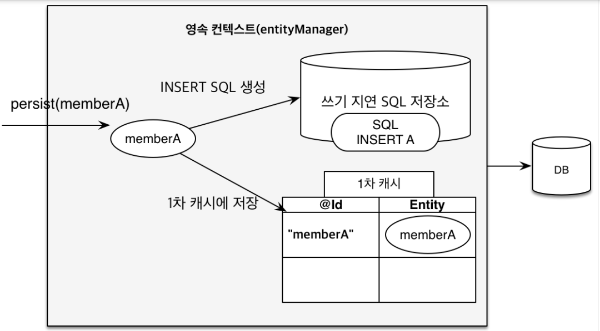
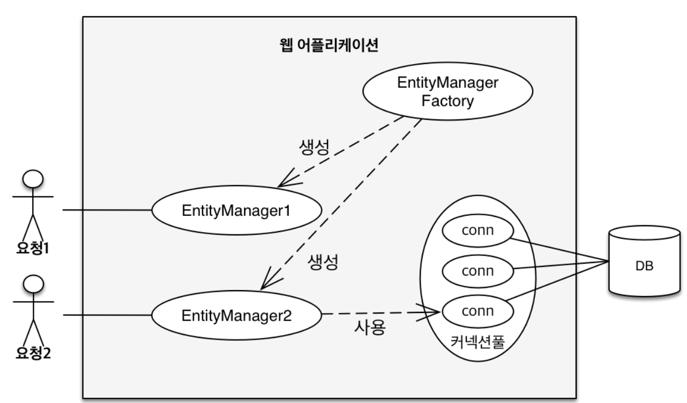
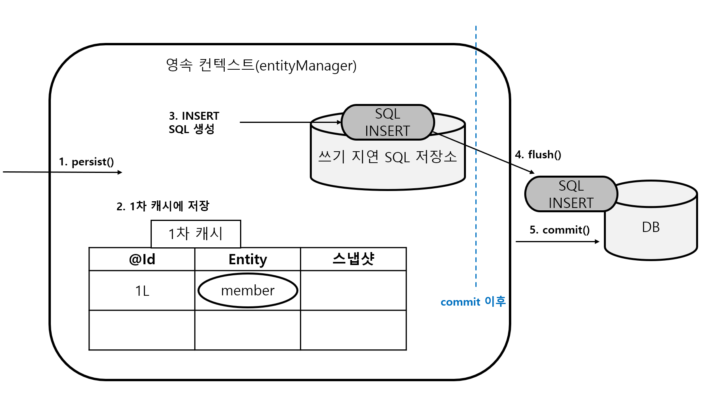

# JDBC

​	JDBC(Java Database Connectivity)는 자바에서 데이터베이스에 접속할 수 있도록 하는 자바 API 입니다. 애플리케이션이 DB 를 사용하기 위해서는 **1. 커넥션 연결, 2. SQL 전달, 3. 결과 응답**이라는 순서로 사용합니다. 하지만 각각의 DB 마다 커넥션을 연결하는 방법, SQL을 전달하는 방법, 그리고 결과를 응답 받는 방법이 모두 다르기 때문에 자바는 **JDBC 라는 표준 인터페이스를 만들어서 제공합니다.**



## MemberRepository(예시)

```java
@Slf4j
public class MemberRepository {
    
    public static final String URL = "jdbc:h2:tcp://localhost/~/test";
    public static final String USERNAME = "sa";
    public static final String PASSWORD = "";
    
    //회원 저장 메서드
    public Member save(Member member) throws SQLException {
        String sql = "insert into member(member_id, money) values(?, ?)";
        Connection con = null;
        PreparedStatement pstmt = null;
        
        try {
            con = getConnection();
            pstmt = con.prepareStatement(sql);
            pstmt.setString(1, member.getMemberId());
            pstmt.setInt(2, member.getMoney());
            pstmt.executeUpdate();
            return member;
        } catch (SQLException e) {
        	log.error("db error", e);
        	throw e;
        } finally {
        	close(con, pstmt, null); //모든 커넥션 close (연 순서의 역순으로 닫아야 합니다.)
        }
    }
    //회원 조회 메서드
    public Member findById(String memberId) throws SQLException {
        String sql = "select * from member where member_id = ?";
        Connection con = null;
        PreparedStatement pstmt = null;
        ResultSet rs = null;
        
        try {
            con = getConnection();
            pstmt = con.prepareStatement(sql);
            pstmt.setString(1, memberId);
            rs = pstmt.executeQuery();
            
            if (rs.next()) {
            Member member = new Member();
            member.setMemberId(rs.getString("member_id"));
            member.setMoney(rs.getInt("money"));
                
            return member;
            } else {
                throw new NoSuchElementException("member not found memberId=" + memberId);
            }
        } catch (SQLException e) {
        	log.error("db error", e);
        	throw e;
        } finally {
        	close(con, pstmt, rs);
        }
    }
    
    private void close(Connection con, Statement stmt, ResultSet rs) {
        if (rs != null) {
            try {
            	rs.close();
            } catch (SQLException e) {
            	log.info("error", e);
            }
        }
        if (stmt != null) {
            try {
            	stmt.close();
            } catch (SQLException e) {
            	log.info("error", e);
            }
        }
        if (con != null) {
            try {
            	con.close();
            } catch (SQLException e) {
            	log.info("error", e);
            }
        }
	}
    private Connection getConnection() {
        
        try {
        	Connection connection = DriverManager.getConnection(URL, USERNAME, PASSWORD);
            return connection;
        } catch (SQLException e) {
            throw new IllegalStateException(e);
        }
    }
}
```

위 로직이 복잡해보이지만, 간단한 `save`, `findById` 메서드를 JDBC 로 표현한 것입니다. Connection, PreparedStatement, ResultSet 이 앞서 얘기한  **1. 커넥션 연결, 2. SQL 전달, 3. 결과 응답** 입니다. 아래 그림과 같은 흐름입니다.

1. JDBC 드라이버 로딩
2. Connection 객체 생성
3. Statement 객체 생성
4. Query 실행 (`pstmt.executeQuery();`)
5. ResultSet 객체로부터 데이터 조회
6. ResultSet 객체 Close
7. Statement 객체 Close
8. Connection 객체 Close

`getConnection()` 메서드에서 `DriverManager` 는 URL 을 통해 어느 드라이버에 연결할지 결정합니다. 모든 드라이버를 순회하면서 `jdbc:h2~` 이라는 URL 을 처리하는 드라이버를 찾습니다. H2 드라이버가 해당 URL 을 처리할 수 있으므로 `DriverManager` 는 H2 DB 드라이버를 사용하게 됩니다.

## JDBC 에서 사용하는 추상화

​	JDBC 는 여러 기술을 적용하기 위해 다양한 추상화된 기술들을 제공하는데요. 몇가지만 간단하게 살펴보겠습니다.

### 커넥션 풀(DataSource)

​	`DataSource` 는 커넥션을 얻는 방법을 추상화한 것입니다. 현재 **스프링부트 기본 커넥션풀은 HikariCP 입니다.**



**트랙잭션 관리(PlatformTransactionManager)**

​	`PlatformTransactionManager` 는 트랙잭션을 얻는 방법을 추상화한 기술입니다.



# JPA

​	JPA(Java Persistence API) 는 ORM 접근 기술입니다. 



JDBC 와의 관계는 위 그림과 같습니다. JPA 는 내부적으로 DB 와 커넥션하기 위해 JDBC 를 사용합니다. 현재 SpringBoot 는 `Hibernate` 를 JPA 기본 구현체로 채택하고 있습니다.

JPA 는 객체를 받으면 어떤 SQL 으로 변경할지 정보를 알아야 합니다. 


하지만 Spring Boot에서 JPA(Hibernate)를 사용할 때, 대부분의 경우 데이터베이스 별로 `dialect`를 명시적으로 설정할 필요가 없습니다. 왜냐하면 **Spring Boot가 `DataSource`의 메타데이터를 사용하여 적절한 Hibernate `Dialect`를 자동으로 선택하기 때문입니다.**

## EntityManager 와 PersistenceContext

​	영속성 컨텍스트(PersistenceContext) 는 Entity 를 영구 저장하는 환경을 의미하며, 논리적인 개념입니다. `EntityManager` 를 통해 영속성 컨텍스트에 접근할 수 있습니다. 예를 들어 `EntityManager.persist(entity);` 는 Entity 를 DB 에 저장하는게 아니라 영속성 컨텍스트에 저장하는 것입니다. 엔티티 매니저와 영속성 컨텍스트는 보통 1:1로 생성됩니다.



이러한 `EntityManger` 는 하나의 `EntityManagerFactory` 를 통해 생성됩니다.



## 트랜잭션

​	`em.persist(member)` 로 1차 캐시에 `member` 를 넣고 쓰기 지연 저장소에 저장을 하려면 먼저 트랜잭션을 시작해야 합니다. 트랜잭션은 `em.getTransaction()` 으로 얻을 수 있습니다.

​	얻은 트랜잭션은 반드시 데이터를 변경하기 전에 `begin()` 으로 시작해야 하며 `commit()` 또는 `rollback()` 으로 끝내야 합니다.

## JPA 를 이용한 회원 저장 및 조회

간단하게 `CommandLineRunner` 을 빈으로 등록해서 출력결과만 확인하겠습니다.

```java
@Configuration
public class JpaBasicConfig {
    private EntityManager em;
    private EntityTransaction tx;

    @Bean
    public CommandLineRunner testJpaBasicRunner(EntityManagerFactory emf) {
        this.em = emf.createEntityManager();
        this.tx = em.getTransaction();

        return args -> {
            save();
        };
    }

    private void save() {
        tx.begin(); //트랜잭션 시작
        
        Member member = new Member("hgd@gmail.com");
        em.persist(member); //저장
        
        Member findMember = em.find(Member.class, 1L); //조회
        System.out.println("findMember.getEmail() = " + findMember.getEmail()); //hgd@gmail.com

        System.out.println("member == findMember : " + (member == findMember)); //?
        
        tx.commit(); //커밋
    }
}
```

`EntityManager` 와 `EntityTransaction` 은 클래스의 필드로 관리되고 있습니다. `save()` 는 트랜잭션을 시작하고 새로운 `Member` 를 1차 캐시에 넣은 뒤 커밋을 합니다.



위 그림처럼 `persist()` 이후 1차 캐시에는 `Member` 가 저장되고 쓰기 지연 SQL 저장소에는 `INSERT INTO MEMBER(EMAIL) VALUES ('hgd@gmail');` 과 같이 저장됩니다. 그리고 `commit()` 시점에 `flush()` 와 함께 커밋이 됩니다.

이 때 1차 캐시에 Id 는 넘기지 않았는데 어떻게 알 수 있을까요? 그건 기본키 매핑전략에 따라 다른데요. DB 에 insert 쿼리를 미리 보내거나, Id 로 할당할 수 있는 값을 DB 로부터 받아서 1차 캐시에 저장하게 됩니다.

> 기본 키 매핑에 관한 포스팅입니다. [[spring jpa] jpa 기본편 section 4. entity mapping](https://hobeen-kim.github.io/springjpa/Spring-JPA-JPA-%EA%B8%B0%EB%B3%B8%ED%8E%B8-Section-4.-Entity-Mapping/#%EA%B8%B0%EB%B3%B8-%ED%82%A4pk-%EB%A7%A4%ED%95%91)

`flush()` 는 커밋시점이 아니어도 호출할 수 있습니다. **`flush()` 를 중간에 호출하게 되면 쓰기 지연 SQL 저장소에 있는 모든 쿼리문이 DB 로 보내지게 됩니다. 이 때 1차 캐시는 그대로 남아있습니다.** 예를 들어서 **JPQL 쿼리를 실행되는 경우**, 해당 쿼리가 데이터베이스에서 실제로 실행되기 때문에 그전에 변경사항 동기화를 위해 자동적으로 쿼리문 이전에 `flush()` 가 실행됩니다.

`System.out.println("member == findMember : " + (member == findMember));` 의 값은 `true` 입니다. **동일한 `EntityManager` 에서는 같은 ID 에 대해서 동일한 엔티티 인스턴스를반환합니다.** 이러한 동작 방식은 JPA의 **'Identity Scope'** 라는 개념을 구현한 것입니다. 이 개념은 같은 ID의 엔티티에 대해서는 같은 `EntityManager` 내에서 항상 같은 인스턴스를 반환하도록 보장합니다. 이로 인해 애플리케이션 로직을 간단하게 작성할 수 있으며, 불필요한 데이터베이스 접근을 줄여 성능을 향상시킬 수 있습니다.

그렇다면 아래 로직은 어떨까요?

```java
@Configuration
public class JpaBasicConfig {

    @Bean
    public CommandLineRunner testJpaBasicRunner(EntityManagerFactory emf) {

        return args -> {
            Member member1 = findMember1(emf);
            Member member2 = findMember1(emf);

            System.out.println("member1 == member2 : " + (member1 == member2)); //?

        };
    }
    private Member findMember1(EntityManagerFactory emf){
        EntityManager em = emf.createEntityManager();
        EntityTransaction tx = em.getTransaction();
        tx.begin();
        
        em.persist(new Member("member1"));
        Member findMember = em.find(Member.class, 1L);
        
        tx.commit();
        em.close();

        return findMember;
    }
}
```

결론적으로, 동일한 `EntityManager` 가 아니기 때문에 `System.out.println("member1 == member2 : " + (member1 == member2));` 은 `false` 를 출력합니다.

비슷한 예시인데 아래 코드를 보겠습니다.

```java
@Configuration
public class JpaBasicConfig {
    private EntityManager em;
    private EntityTransaction tx;

    @Bean
    public CommandLineRunner testJpaBasicRunner(EntityManagerFactory emf) {
        this.em = emf.createEntityManager();
        this.tx = em.getTransaction();

        return args -> {
            save();
        };
    }

    private void save() {
        tx.begin(); //트랜잭션 시작
        
        Member member = new Member("hgd@gmail.com");
        em.persist(member); //저장
        tx.commit(); //커밋
        
        tx.begin(); //트랜잭션 다시 시작
        Member findMember = em.find(Member.class, 1L); //조회
        System.out.println("findMember.getEmail() = " + findMember.getEmail()); //hgd@gmail.com

        System.out.println("member == findMember : " + (member == findMember)); //?
        
        tx.commit(); //커밋
    }
}
```

위 코드는 트랜잭션을 커밋하고 다시 시작하는 코드입니다. 하지만 `member == findMember` 는 `true` 인데요. 그 이유는 영속성 컨텍스트가 닫히지 않았기 때문입니다.

그렇다면 아래처럼 `em.clear()` 를 호출하면 어떻게 될까요?

```java
...
private void save() {
    tx.begin(); //트랜잭션 시작

    Member member = new Member("hgd@gmail.com");
    em.persist(member); //저장
    tx.commit(); //커밋

	em.clear();

    tx.begin(); //트랜잭션 다시 시작
    Member findMember = em.find(Member.class, 1L); //조회
    System.out.println("findMember.getEmail() = " + findMember.getEmail()); //hgd@gmail.com

    System.out.println("member == findMember : " + (member == findMember)); //?

    tx.commit(); //커밋
}
```

영속성 컨텍스트는 영속 상태의 엔티티만 관리하고 동일성을 보장합니다. 따라서 `em.clear();` 시점에 `member` 의 영속성이 끝났으므로 `member == findMember` 는 false 가 나옵니다.

그렇다면 em.clear()  이후에도 동일성을 보장하기 위해서는 어떻게 해야 할까요?

```java
private void save(){
    tx.begin();
    Member member = new Member("test1@test.com", "member1", "010-1111-1234");
    em.persist(member);
    tx.commit();

    em.clear();

    tx.begin();
    Member merge = em.merge(member); //merge 를 통해 준영속 상태를 영속 상태로 전환
    Member findMember = em.find(Member.class, 1L);
    System.out.println("member == findMember? " + (merge == findMember));

    tx.commit();
}
```

위에서 보는 것처럼 `merge()` 로 준영속상태의 `member` 를 다시 영속상태로 전환합니다. `merge == findMember2` 는 `true` 입니다. 주의해야 할 건 `member == findMember` 가 아니라는 점입니다.

`em.merge()` 를 호출하면 `select m from Member m where m.id = ?` 쿼리문이 나갑니다. `member` 의 `id` 는 설정을 한 적이 없는데 어디서 설정된걸까요? **바로 `em.persist(member);` 에서 `member` 를 받아서 해당 객체에 `id` 를 주입합니다.**

## JPA 를 이용한 회원 수정 및 삭제

```java
@Configuration
public class JpaBasicConfig {
    private EntityManager em;
    private EntityTransaction tx;

    @Bean
    public CommandLineRunner testJpaBasicRunner(EntityManagerFactory emFactory) {
        this.em = emFactory.createEntityManager();
        this.tx = em.getTransaction();

        return args -> {
             update();
			delete();
        };
    }

    private void update() {
       tx.begin();
       em.persist(new Member("hgd1@gmail.com"));
       tx.commit();


       tx.begin();
       Member findMember = em.find(Member.class, 1L);
       findMember.setEmail("hgd1@yahoo.co.kr");
       tx.commit();
    }
    
    private void delete(){
        tx.begin();
        Member findMember = em.find(Member.class, 1L);
        em.remove(findMember);
        tx.commit();
    }
}
```

회원 수정은 `dirty checking` 방식으로 이루어집니다. 자세한 내용은 아래 포스팅을 확인해주세요.

[[Spring JPA\] merge 와 변경감지](https://hobeen-kim.github.io/springjpa/Spring-JPA-merge-%EC%99%80-%EB%B3%80%EA%B2%BD%EA%B0%90%EC%A7%80/#%EB%B3%80%EA%B2%BD%EA%B0%90%EC%A7%80dirty-checking)

결론적으로, 1차 캐시의 값이 변경되면서 UPDATE 쿼리문이 자동으로 생성됩니다. 따라서 따로 `em.update()` 와 같은 메서드가 없이 자동으로 변경이 됩니다.

## 엔티티와 테이블 간 매핑

예제 코드로 간단하게 설명만 하겠습니다.

```java
@NoArgsConstructor
@Getter @Setter
@Entity
@Table(name = "Member") 
public class Member {
    @Id
    @GeneratedValue(strategy = GenerationType.IDENTITY)
    private Long memberId;

    @Column(nullable = false, updatable = false, unique = true)
    private String email;

    @Column(length = 100, nullable = false)
    private String name;

    @Column(length = 13, nullable = false, unique = true)
    private String phone;

    @Column(nullable = false)
    private LocalDateTime createdAt = LocalDateTime.now(); 

    @Column(nullable = false, name = "LAST_MODIFIED_AT")
    private LocalDateTime modifiedAt = LocalDateTime.now();
    
    @Enumerated(EnumType.STRING)
    private Authority authority = Authority.USER;

    @Transient
    private String age;

    public Member(String email) {
        this.email = email;
    }

    public Member(String email, String name, String phone) {
        this.email = email;
        this.name = name;
        this.phone = phone;
    }
}
```

**@Column**

- `nullable` : 열에 `null` 값을 허용할지 여부를 지정합니다. 디폴트 값은 `true`입니다.
- `updatable` :  열 데이터를 수정할 수 있는지 여부를 지정합니다. 디폴트 값은 `true`입니다.
- `unique` : 하나의 열에 unique 유니크 제약 조건을 설정합니다. 디폴트 값은 `false`입니다.
- `length` : 열의 길이를 설정합니다. 디폴트 값은 255 입니다.

**@Transient** : 테이블과 매핑을 하지 않는 필드입니다. 임시 데이터를 저장하기 위해 사용됩니다.

**@Enumerated** : enum 타입을 매핑할 때 사용하는 어노테이션입니다.

> `nullable = false` 일때, DB 에서 null 을 허용해도 JPA 에서부터 막습니다. 그렇다면 중간에 DB 제약조건을 바꾸면 거기에 맞춰서 바꿔줘야 하는데, 오류나기 쉬운 속성인 듯 합니다.
