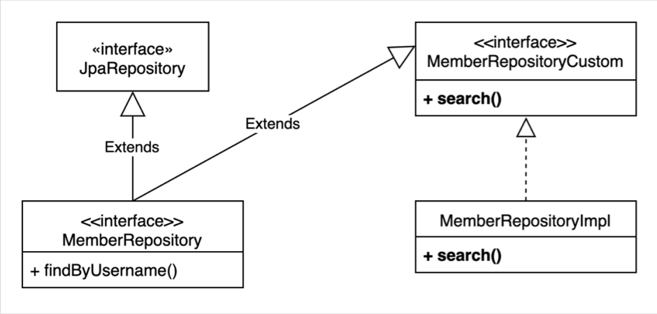
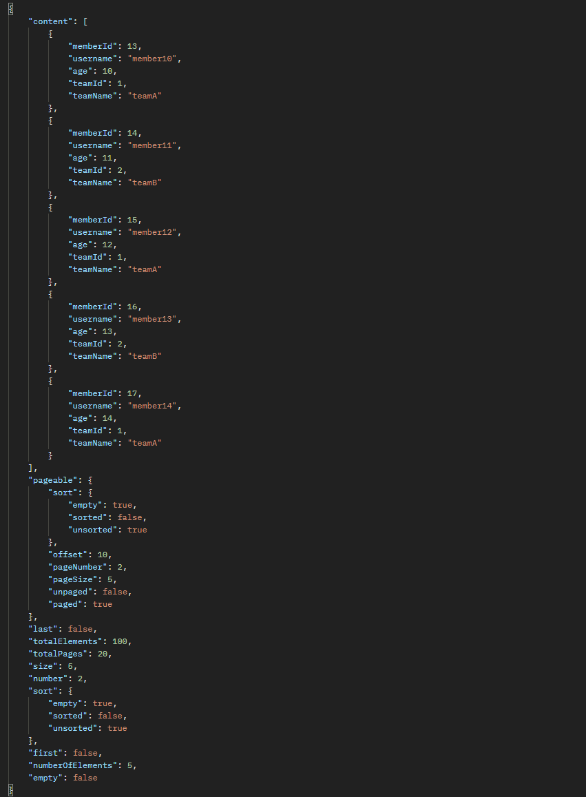

# 사용자 정의 리포지토리

먼저 JPA 리포지토리를 만듭니다.

```java
public interface MemberRepository extends JpaRepository<Member, Long> {

    List<Member> findByUsername(String username);
}
```

사용자 정의 리포지토리는 아래와 같은 구조로 만들어야 합니다.



먼저 `MemberRepositoryCustom` 인터페이스를 만들고, 구현하고 싶은 메서드를 생성합니다.

```java
public interface MemberRepositoryCustom {

    List<MemberTeamDto> search(MemberSearchCondition condition);
}
```

그리고 `MemberRepositoryImpl` 클래스를 만들어서 해당 메서드를 구현합니다. 구현 클래스의 명명 규칙은 반드시 `JPA repository 명` + `Impl` 입니다.

```java
public class MemberRepositoryImpl implements MemberRepositoryCustom {

    private final JPAQueryFactory queryFactory;

    public MemberRepositoryImpl(EntityManager em) {
        this.queryFactory = new JPAQueryFactory(em);
    }

    @Override
    public List<MemberTeamDto> search(MemberSearchCondition condition){
        return queryFactory
                .select(new QMemberTeamDto(
                        member.id,
                        member.username,
                        member.age,
                        team.id,
                        team.name))
                .from(member)
                .leftJoin(member.team, team)
                .where(
                        usernameEq(condition.getUsername()),
                        teamNameEq(condition.getTeamName()),
                        ageGoe(condition.getAgeGoe()),
                        ageLoe(condition.getAgeLoe()))
                .fetch();
    }

    private BooleanExpression usernameEq(String username) {
        return hasText(username) ? member.username.eq(username) : null;
    }

    private BooleanExpression teamNameEq(String teamName) {
        return hasText(teamName) ? team.name.eq(teamName) : null;
    }

    private BooleanExpression ageGoe(Integer ageGoe) {
        return ageGoe != null ? member.age.goe(ageGoe) : null;
    }

    private BooleanExpression ageLoe(Integer ageLoe) {
        return ageLoe != null ? member.age.loe(ageLoe) : null;
    }
}

```

마지막으로 `MemberRepository` 와 `MemberRepositoryCustom` 을 연결합니다.

```java
public interface MemberRepository extends JpaRepository<Member, Long>, MemberRepositoryCustom {

    List<Member> findByUsername(String username);
}
```

이제 `memberRepository.search(...)` 으로 사용할 수 있습니다.

# 스프링 데이터 페이징 활용

## Querydsl 페이징 연동

`MemberRepositoryCustom` 에 아래와 같이 페이징하는 메서드 2개를 추가하겠습니다. 두번째 메서드는 카운트 쿼리를 별도로 분리할 예정입니다.

```java
public interface MemberRepositoryCustom {

    List<MemberTeamDto> search(MemberSearchCondition condition);

    Page<MemberTeamDto> searchPageSimple(MemberSearchCondition condition, Pageable pageable);

    Page<MemberTeamDto> searchPageComplex(MemberSearchCondition condition, Pageable pageable);
}
```

먼저 전체 카운트도 함께 조회하는 단순한 방법입니다.

```java
 @Override
public Page<MemberTeamDto> searchPageSimple(MemberSearchCondition condition, Pageable pageable) {
    QueryResults<MemberTeamDto> results = queryFactory
            .select(new QMemberTeamDto(
                    member.id,
                    member.username,
                    member.age,
                    team.id,
                    team.name))
            .from(member)
            .leftJoin(member.team, team)
            .where(
                    usernameEq(condition.getUsername()),
                    teamNameEq(condition.getTeamName()),
                    ageGoe(condition.getAgeGoe()),
                    ageLoe(condition.getAgeLoe()))
            .offset(pageable.getOffset()) //offset
            .limit(pageable.getPageSize()) //limit
            .fetchResults();

    List<MemberTeamDto> content = results.getResults();
    long total = results.getTotal();

    return new PageImpl<>(content, pageable, total);
}
```

받은 `Pageable` 을 통해 `offset` (시작 위치) 와 `limit` (사이즈) 를 꺼내서 쿼리로 넘깁니다. `fetchResults()` 통해 받으면 `QueryResults` 로 받을 수 있습니다. `PageImpl<>(content, pageable, total)` 를 리턴해줍니다.

하지만 카운트 쿼리가 복잡하다면 아래와 같이 분리해서 써줍니다.

```java
 @Override
public Page<MemberTeamDto> searchPageComplex(MemberSearchCondition condition, Pageable pageable) {
    List<MemberTeamDto> content = queryFactory
            .select(new QMemberTeamDto(
                    member.id,
                    member.username,
                    member.age,
                    team.id,
                    team.name))
            .from(member)
            .leftJoin(member.team, team)
            .where(
                    usernameEq(condition.getUsername()),
                    teamNameEq(condition.getTeamName()),
                    ageGoe(condition.getAgeGoe()),
                    ageLoe(condition.getAgeLoe()))
            .offset(pageable.getOffset())
            .limit(pageable.getPageSize())
            .fetch();

    long total = queryFactory
            .select(member)
            .from(member)
            .leftJoin(member.team, team)
            .where(
                    usernameEq(condition.getUsername()),
                    teamNameEq(condition.getTeamName()),
                    ageGoe(condition.getAgeGoe()),
                    ageLoe(condition.getAgeLoe()))
            .fetchCount();


    return new PageImpl<>(content, pageable, total);
}
```

반환값은 같지만, `fetch()` 를 통해 `List<MemberTeamDto>` 를 조회하고, `count` 는 따로 조회합니다.

## CountQuery 최적화

`count` 쿼리가 생략 가능한 경우 생략해서 처리합니다. 다음 두 가지 경우에 생략할 수 있습니다.

- 페이지 시작이면서 컨텐츠 사이즈가 페이지 사이즈보다 작을 때
- 마지막 페이지 일 때 (`offset` + 컨텐츠 사이즈를 더해서 전체 사이즈 구함, 더 정확히는 마지막 페이지 이면서 컨텐츠 사이즈가 페이지 사이즈보다 작을 때)

이러한 기능은 스프링 데이터 라이브러리가 제공하고 있습니다.

```java
@Override
public Page<MemberTeamDto> searchPageComplex(MemberSearchCondition condition, Pageable pageable) {
    List<MemberTeamDto> content = queryFactory
            .select(new QMemberTeamDto(
                    member.id,
                    member.username,
                    member.age,
                    team.id,
                    team.name))
            .from(member)
            .leftJoin(member.team, team)
            .where(
                    usernameEq(condition.getUsername()),
                    teamNameEq(condition.getTeamName()),
                    ageGoe(condition.getAgeGoe()),
                    ageLoe(condition.getAgeLoe()))
            .offset(pageable.getOffset())
            .limit(pageable.getPageSize())
            .fetch();

    JPAQuery<Member> countQuery = queryFactory
            .select(member)
            .from(member)
            .leftJoin(member.team, team)
            .where(
                    usernameEq(condition.getUsername()),
                    teamNameEq(condition.getTeamName()),
                    ageGoe(condition.getAgeGoe()),
                    ageLoe(condition.getAgeLoe()));


    return PageableExecutionUtils.getPage(content, pageable, countQuery::fetchCount);
}
```

`PageableExecutionUtils` 을 사용하면, 해당 2가지 조건이 아닐 때만 `fetchCount` 메서드를 실행합니다.

## 컨트롤러로 확인

컨트롤러에 API 를 추가해 확인해보겠습니다.

```java
@RestController
@RequiredArgsConstructor
public class MemberController {

    private final MemberJpaRepository memberJpaRepository;
    private final MemberRepository memberRepository;


    @GetMapping("/v1/members")
    public List<MemberTeamDto> searchMemberV1(MemberSearchCondition condition){
        return memberJpaRepository.search(condition);
    }

    @GetMapping("/v2/members")
    public Page<MemberTeamDto> searchMemberV2(MemberSearchCondition condition, Pageable pageable){
        return memberRepository.searchPageSimple(condition, pageable);
    }

    @GetMapping("/v3/members")
    public Page<MemberTeamDto> searchMemberV3(MemberSearchCondition condition, Pageable pageable){
        return memberRepository.searchPageComplex(condition, pageable);
    }
}

```

`http://localhost:8080/v2/members?size=5&page=2` 와 같이 호출하면 아래처럼 나옵니다.



만약 `http://localhost:8080/v3/members?size=110&page=0` 과 같이 `searchMemberV3` 에 전체 size 를 넘는 값을 보내면 count 쿼리문이 나가지 않는 걸 볼 수 있습니다.