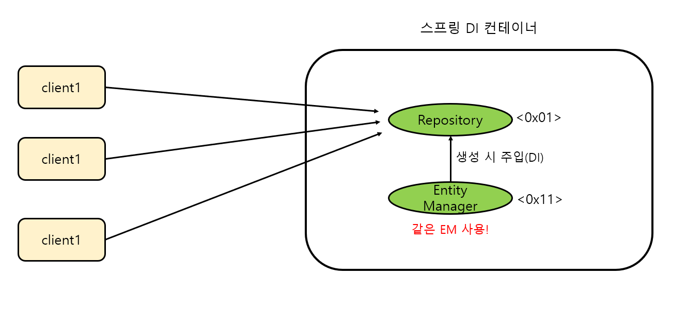

# 쓰레드별 EntityManager 는 같을까?

​	스프링 빈은 모두 싱글톤으로 관리됩니다. 이는 저장소 역할인 `Repository` 도 같습니다. 이때 JPA 에서 Repository 는 `EntityManager` 를 주입받아서 사용하는데요. 이 `EntityManager` 도 스프링 빈 생성 시 DI 로 주입받게 됩니다. <u>그렇다면 모든 쓰레드가 필드 레벨의 같은 `EntityManager` 를 사용하게 되는 건데, **동시성 문제**가 아래와 같이 발생하지 않을까요?</u>



# 프록시 객체를 통한 해결

​	스프링 프레임워크는 이러한 문제를 해결하기 위해, 여기에 실제 EntityManager 를 주입하는 것이 아니라, 사실은 **실제 EntityManager를 연결해주는 EntityManager 프록시 객체를 주입**해둡니다. 이 프록시 객체는 실제 EntityManager의 레퍼(wrapper)로 작동하며, 이 프록시는 ThreadLocal 기반의 현재 트랜잭션 컨텍스트에 대한 참조를 통해 실제 EntityManager 인스턴스에 접근합니다. 

​	그리고 **이 EntityManager를 호출하면, 현재 데이터베이스 트랜잭션과 관련된 실제 EntityManager 를 호출**해줍니다. 따라서 개발자는 동시성 이슈에 대한 걱정없이 EntityManger 를 사용할 수 있습니다.

# EntityManager 생성 확인

## SharedEntityManagerCreator

`SharedEntityManagerCreator` 클래스에서 프록시 객체의 생성과 실제 `EntityManager` 생성을 위한 메서드를 관리합니다.

```java
public abstract class SharedEntityManagerCreator {

	...
        
    public static EntityManager createSharedEntityManager(EntityManagerFactory emf, @Nullable Map<?, ?> properties,
                boolean synchronizedWithTransaction, Class<?>... entityManagerInterfaces) {

        ClassLoader cl = null;
        if (emf instanceof EntityManagerFactoryInfo) {
            cl = ((EntityManagerFactoryInfo) emf).getBeanClassLoader();
        }
        Class<?>[] ifcs = new Class<?>[entityManagerInterfaces.length + 1];
        System.arraycopy(entityManagerInterfaces, 0, ifcs, 0, entityManagerInterfaces.length);
        ifcs[entityManagerInterfaces.length] = EntityManagerProxy.class;
        return (EntityManager) Proxy.newProxyInstance(
                (cl != null ? cl : SharedEntityManagerCreator.class.getClassLoader()),
                ifcs, new SharedEntityManagerInvocationHandler(emf, properties, synchronizedWithTransaction));
    }
    
	@Override
    @Nullable
    public Object invoke(Object proxy, Method method, Object[] args) throws Throwable {
        
        ... 
        EntityManager target = EntityManagerFactoryUtils.doGetTransactionalEntityManager(
                this.targetFactory, this.properties, this.synchronizedWithTransaction);

        switch (method.getName()) {
            case "getTargetEntityManager":
                // Handle EntityManagerProxy interface.
                if (target == null) {
                    throw new IllegalStateException("No transactional EntityManager available");
                }
                return target;
            case "unwrap":
                Class<?> targetClass = (Class<?>) args[0];
                if (targetClass == null) {
                    return (target != null ? target : proxy);
                }
                // We need a transactional target now.
                if (target == null) {
                    throw new IllegalStateException("No transactional EntityManager available");
                }
                // Still perform unwrap call on target EntityManager.
                break;
        }

        ...
    }

    
```

1. `createSharedEntityManager` 메서드는 `(EntityManager) Proxy.newProxyInstance(...)`  로 프록시 객체를 만들어서 리턴합니다. 최초 `EntityManager` 주입 시 해당 프록시 객체의 `EntityManager` 가 주입됩니다.
2. `invoke` 메서드를 호출해서 `EntityManager target = EntityManagerFactoryUtils.doGetTransactionalEntityManager(...)` 를 통해 실제 `EntityManager` 를 만듭니다. 그리고 method 이름에 따라서 `switch (method.getName())` 를 통해 해당 `target` 을 리턴합니다.

## EntityManagerFactoryUtils

​	실제 `EntityManager`를 만드는 클래스입니다.

```java
public abstract class EntityManagerFactoryUtils {
	...

@Nullable
	public static EntityManager doGetTransactionalEntityManager(
			EntityManagerFactory emf, @Nullable Map<?, ?> properties, boolean synchronizedWithTransaction)
			throws PersistenceException {

		Assert.notNull(emf, "No EntityManagerFactory specified");

		EntityManagerHolder emHolder =
				(EntityManagerHolder) TransactionSynchronizationManager.getResource(emf); //1
        
        //emHolder 가 있으면...
		if (emHolder != null) {
            	...
				//해당 emHolder 에서 EntityManger 를 꺼내서 반환합니다.
				return emHolder.getEntityManager();
			}
			...
		}
		//emHolder 가 없으면...
    
		EntityManager em = null; //새로운 EntityManager 선언

		if (em == null) { //emf.createEntityManager() 를 통해 EntityManager 만들기
			em = (!CollectionUtils.isEmpty(properties) ? emf.createEntityManager(properties) : emf.createEntityManager());
		}

		try {
            //EntityManagerHolder 만들기
			emHolder = new EntityManagerHolder(em);
            
            //현재 트랜잭션과 동기화할거라면
			if (synchronizedWithTransaction) {
				Object transactionData = prepareTransaction(em, emf);
				TransactionSynchronizationManager.registerSynchronization(
						new TransactionalEntityManagerSynchronization(emHolder, emf, transactionData, true));
				emHolder.setSynchronizedWithTransaction(true);
			}
            //현재 트랜잭션과 동기화하지 않는다면
			else {
				TransactionSynchronizationManager.registerSynchronization(
						new TransactionScopedEntityManagerSynchronization(emHolder, emf));
			}
			TransactionSynchronizationManager.bindResource(emf, emHolder);
		}
		catch (RuntimeException ex) {
			//EntityManager 를 만드는 데 실패하면 닫습니다.
			closeEntityManager(em);
			throw ex;
		}

    	//EntityManager 를 리턴합니다.
		return em;
	}
	...
}

```

주석을 참고하면 됩니다. `TransactionSynchronizationManager` 는  현재 스레드에 바인딩된 리소스를 관리합니다. JPA의 경우, 이 리소스는 `EntityManager`가 됩니다. `EntityManager`는 `EntityManagerHolder` 객체에 포함되어 `TransactionSynchronizationManager`에 의해 현재 스레드에 바인딩됩니다.

`TransactionSynchronizationManager`의 `getResource(Object key)` 메서드를 사용하여 현재 스레드에 바인딩된 `EntityManagerHolder`를 검색할 수 있습니다. 이 메서드는 주어진 키에 바인딩된 리소스를 반환합니다. JPA의 경우, 이 키는 일반적으로 `EntityManagerFactory` 인스턴스입니다.

## EntityManager 주입 및 실행

즉 최초 빈 등록 시 `SharedEntityManagerCreator.createSharedEntityManager(...)` 를 통해 프록시 객체가 만들어져서 주입되어 싱글톤 객체로 관리됩니다. 이후 해당 프록시 객체의 메서드를 호출하면 `SharedEntityManagerCreator.invoke()` 가 호출되어 새로운 `EntityManager` 를 만들어서 동작하게 됩니다.
