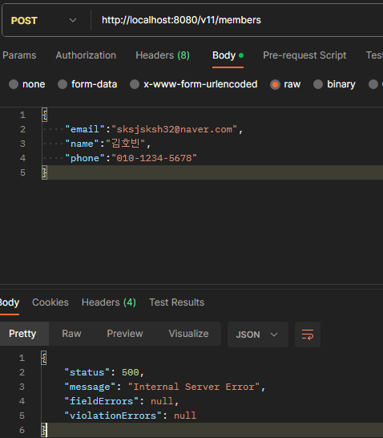
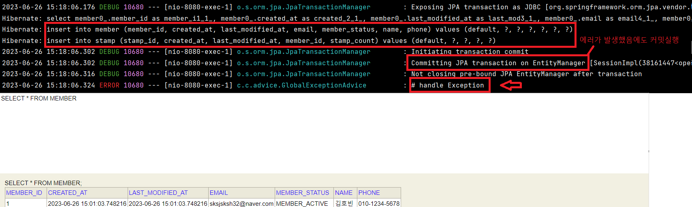
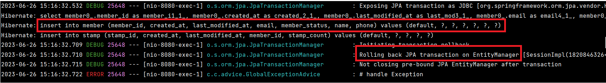

# @Transactional 롤백 상황

스프링의 `@Transactional` 이 선언되어 사용하는 메서드는 **`Unchecked Exception` 발생 시 롤백**이 됩니다. 따라서 `checked Exception` 은 발생이 해도 롤백이 되지 않습니다. 다시 말하지만 <u>모든 예외 상황에서 롤백이 되는 것이 아닙니다.</u>

​	Spring 에서 체크 예외에 대한 롤백을 기본적으로 수행하지 않는 이유는, <u>체크 예외가 비즈니스 로직의 일부로 간주되고, 프로그램을 계속 실행할 수 있도록 처리되어야 하는 예외로 가정</u>하기 때문입니다. **이러한 예외는 롤백보다는 복구 전략을 구현하는 것이 더 적합합니다.**

​	반면  자바에서 <u>런타임 예외는 개발자의 프로그래밍 오류를 나타내며, 이러한 오류는 프로그램을 정상적으로 계속 실행시킬 수 없는 심각한 문제로 생각</u>합니다. 따라서 이러한 예외가 발생하면, Spring은 자동으로 트랜잭션을 롤백하도록 설계되어 있습니다.

# 문제 해결 방법

​	그러나 필요에 따라 Spring 의 트랜잭션 관리자를 설정하여 체크 예외가 발생할 경우에도 롤백을 수행하도록 변경할 수 있습니다. 이를 위해서는 **`Checked Exception` 을 `unChecked Exception` 으로 변경하는 방법**으로 해결할 수도 있습니다. 그렇지 않다면 **`@Transactional` 어노테이션에 `rollbackFor` 속성을 사용하여 롤백이 필요한 체크 예외를 지정해야 합니다.**


# @Transactional 확인

언제 롤백이 되는지는 `Transational` 어노테이션의 주석에서 확인할 수 있습니다.

```java
@Target({ElementType.TYPE, ElementType.METHOD})
@Retention(RetentionPolicy.RUNTIME)
@Inherited
@Documented
public @interface Transactional {

	/**
	 * Defines zero (0) or more exception {@linkplain Class classes}, which must be
	 * subclasses of {@link Throwable}, indicating which exception types must cause
	 * a transaction rollback.
	 * <p>By default, a transaction will be rolled back on {@link RuntimeException}
	 * and {@link Error} but not on checked exceptions (business exceptions). See
	 * {@link org.springframework.transaction.interceptor.DefaultTransactionAttribute#rollbackOn(Throwable)}
	 * for a detailed explanation.
	 * <p>This is the preferred way to construct a rollback rule (in contrast to
	 * {@link #rollbackForClassName}), matching the exception type, its subclasses,
	 * and its nested classes. See the {@linkplain Transactional class-level javadocs}
	 * for further details on rollback rule semantics and warnings regarding possible
	 * unintentional matches.
	 * @see #rollbackForClassName
	 * @see org.springframework.transaction.interceptor.RollbackRuleAttribute#RollbackRuleAttribute(Class)
	 * @see org.springframework.transaction.interceptor.DefaultTransactionAttribute#rollbackOn(Throwable)
	 */
	Class<? extends Throwable>[] rollbackFor() default {};

}
```

`By default, a transaction will be rolled back on {@link RuntimeException} and {@link Error} but not on checked exceptions (business exceptions)` 라고 되어있습니다. 롤백은 `RuntimeException` 와 `Error` 에서 발생합니다.

## 롤백이 안되는 checked 예외 상황 예시

`Memberservice` 의 `createMember()` 메서드를 강제로 `checked Exception` 이 발생하도록 해보겠습니다.

먼저 <u>저장 후 예외를 발생</u>시키는 `MemberRepositoryImpl` 클래스입니다. `saveWithException` 메서드가 있습니다.

```java
@RequiredArgsConstructor
public class MemberRepositoryImpl implements MemberRepositoryCustom{

    private final EntityManager em;

    @Override
    public Member saveWithException(Member member) throws Exception {
        em.persist(member);
        throw new Exception("예외");
    }
}
```

해당 메서드를 사용하는 `MemberService` 클래스입니다. <u>Exception 예외를 처리하지 않고 외부로 던집니다.</u>

```java
    public Member createMember(Member member) throws Exception {

        Member savedMember = memberRepository.saveWithException(member);

        return savedMember;
    }
```

아래와 같이 요청을 보내면 500 에러를 받습니다.



하지만 저장된 값과 로직을 보면 **예외가 발생했음에도 COMMIT 이 수행되고 제대로 저장되었습니다**. `insert` 가 나가는 것과 DB 에 정상적으로 저장된 걸 확인할 수 있습니다.



> commit 을 보는 logging 설정
>
> ```yml
> logging:         # (1) 로그 레벨 설정
>   level:
>     org:
>       springframework:
>         orm:
>           jpa: DEBUG
> ```

# 롤백이 안되는 checked 예외 상황 해결

## checked 예외를 Unchecked 예외로 변경

그렇다면 checked 예외는 어떻게 해결해야 할까요? 간단합니다. **해당 트랜잭션 내에서 checked 예외를 Unchecked 예외로 변경하거나 예외상황을 해결합니다.**

아래는 `MemberService` 에서 해당 예외를 처리해주는 방법입니다.

```java
public Member createMember(Member member) {

        Member savedMember = null;
        try {
            savedMember = memberRepository.saveWithException(member);
        } catch (Exception e) {
            throw new BusinessLogicException(ExceptionCode.NOT_IMPLEMENTATION);
        }

        return savedMember;
    }
```

트랜잭션 내에서 `BusinessLogicException`(`RuntimeExeption`) 이 터지면서 롤백이 됩니다.

## checked 예외도 롤백이 되도록 변경

`@Transactional` 코드 내에서 본 것처럼 `rollbackFor` 이라는 속성으로 롤백이 되는 예외를 지정할 수 있습니다. 아래는 <u>모든 `Exception` 을 롤백하는 코드입니다.</u>

```java
@Transactional(rollbackFor = {Exception.class})
public Member createMember(Member member) throws Exception {

    Member savedMember = memberRepository.saveWithException(member);

    return savedMember;
}
```

해당 코드를 실행하면 `Exception` 에서도 롤백이 되는 걸 확인할 수 있습니다.



### rollbackFor 사용 시 주의사항

`rollbackFor` 속성을 명시하지 않을 경우 암묵적으로 다음 코드처럼 롤백정책이 수행됩니다.

**default 정책** : `@Transactional(rollbackFor = {RuntimeException.class, Error.class})`

하지만 모든 예외에 대해서 전부 트랜잭션을 롤백하고 싶으면 `@Transaction(rollbackFor = Exception.class)` 를 걸면 되는데 <u>이렇게 하면 기본적인 롤백 정책을 무시하고 `Exception.class` 에만 롤백됩니다.</u> **따라서 `Error` 일 때 롤백되지 않는 상황이 발생합니다.** 

따라서 기본 정책을 포함하면서 `Exception` 까지 포함하려면 `@Transactional(rollbackFor = {Exception.class, Error.class})` 라고 정의해야 합니다.