# 1. 문제 상황

팀 프로젝트의 요구사항 중 리워드 적립이 있었습니다. 리워드 적립은 비디오를 구매할 때, 비디오에 있는 문제를 풀 때 지급하게 됩니다. 그리고 구매자가 해당 비디오를 환불한다면 비디오에서 얻은 리워드를 다시 취소처리해야 하기 때문에 리워드 엔티티에는 아래와 같이 video, question 과 연관관계가 설정되어있었습니다.

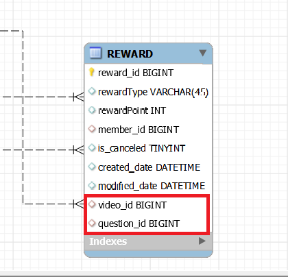

video 만 저장할까 생각도 했지만 문제를 중복으로 풀 수 있기 때문에 어떤 문제를 통해 리워드를 적립했는지도 함께 저장하여 리워드는 중복 적립이 되지 않도록 했습니다. 리워드 엔티티는 아래와 같이 생성됩니다.

1. video 구매 시 -> video_id 할당, reward_type 을 VIDEO 로 설정
2. question 을 풀면? -> video_id  할당(question 은 video 와 다대일 관계), question_id 할당, reward_type 을 QUESTION 으로 설정

이 당시만 해도 큰 문제가 없었는데요. 요구사항이 추가되면서 아래와 같은 문제가 생기게 됩니다.

:white_check_mark: 추가된 요구 사항 : 사용자가 댓글을 많이 작성하게 유도하도록 **댓글(reply) 을 달아도 리워드를 지급!**

<u>간단하게 해결하면 REWARD 에 reply_id 값을 할당하고 연관관계를 맺으면 됩니다.</u> 이 요구사항이 소위 '찐막' 이라면요. 하지만 애플리케이션은 사용자 요구에 따라 계속 확장되고 발전해나가니까 이렇게 쉽게 끝내면 안된다는 생각이 들었습니다.

만약에 출석 체크 리워드를 지급해야 한다면 어떻게 해야 할까요. 출석 테이블을 만들고 최초 출석 시 Reward 를 지급하든, 출석 테이블 없이 출석할 때마다 Reward 테이블에서 해당 날짜 출석이 있는지 확인하든 해야겠네요. 저는 전자의 방식이 더 용이하다고 생각합니다만 중요한건 Reward 의 필드가 또 하나 늘어나야한다는거죠. 이런 식으로 리워드 지급 방법이 10가지, 20가지가 된다면? 다음과 같은 문제가 발생한다고 생각했습니다.

1. 타입에 따라 하나의 필드만 채워지고 나머지는 모두 null 을 넣어야 함
2. 테이블 자체가 지나치게 커지고 관리가 힘들어짐

특히 FK 에 Null 값이 안들어갔으면 좋겠는데요. NULL 값을 허용하게 되면 필요한 데이터가 누락되었는지, 아니면 그 데이터가 실제로 없는지 구별하기 어려울 수 있습니다. 무결성 문제죠.

그리고 DB 는 객체 지향 언어는 아니지만, 기능을 추가할 때마다 필드값을 수정해줘야 한다는 점은 OCP 관점에서 맞지 않다고 생각했습니다. DB 와 JAVA 를 연결해주는 JPA 를 사용한다고 하면 OCP 일수도 있겠네요. 

어쨋든 저의 목표는 아래와 같았습니다.

1. 데이터 무결성 문제가 발생하지 않도록 null 값 최소화
2. 수정과 확장이 용이한 테이블 설계

해결 방향은 JPA 상속 관계 매핑을 중심으로 생각해보았습니다. [관련 제 블로그 글입니다.](https://hobeen-kim.github.io/inflearn/Spring-JPA-JPA-%EA%B8%B0%EB%B3%B8%ED%8E%B8-Section-7.-%EA%B3%A0%EA%B8%89-%EB%A7%A4%ED%95%91/) 물론 테이블 설계 자체가 선행되고 나서 JPA 엔티티를 테이블에 맞게 맞춰가는 것이지만 해당 파트를 공부하면서 DB 설계에 대한 인사이트를 얻었다고 생각해주시면 될 것 같습니다.

> *추가*
>
> 지금 생각해보니 초기 설계의 question 에 대한 Reward  적립은 제 3 정규형을 만족하지 못한다고 생각했습니다. question 으로 Reward 를 적립하면 `reward_id`, `video_id`, `question_id` 가 들어가게 되는데, 각각 A -> B, B -> C 가 성립하기 때문입니다. (video 와 question 은 일대다 관계) 이는 이행적 종속에 해당합니다. 하지만 이상현상이 없었던 이유는 모두 PK 로 사용되기 때문에 삭제, 수정할 일이 없기 때문입니다. 삽입 이상은 필드값으로 null 을 넣는 건데 이 부분은 null 을 허용한다고 생각을 했으니까요.
>
> 이 부분은 초기 설계가 잘못되었다기보다는 `question_id` 를 넣을 때는 `video_id` 를 넣지 않는 방향으로 했으면 더 맞지 않았을까 싶습니다.
>
> [정규화에 관련된 제 블로그 글입니다.](https://hobeen-kim.github.io/db/%EB%8D%B0%EC%9D%B4%ED%84%B0%EB%B2%A0%EC%9D%B4%EC%8A%A4-%EA%B0%9C%EB%A1%A0%EA%B3%BC-%EC%8B%A4%EC%8A%B5-Ch7.-%EC%A0%95%EA%B7%9C%ED%99%94/#%EC%A0%9C-3-%EC%A0%95%EA%B7%9C%ED%98%95)

# 2. 해결 1 : 조인 전략

첫 번째 해결방법은 조인전략을 사용하는 것입니다. 조인전략은 각각의 테이블과 부모 테이블을 FK 를 통해 조인하는 방법입니다. 테이블 정규화가 가장 잘 된 방법이며 외래 키 참조 무결성 제약조건을 활용할 수 있습니다. 또한 저장공간을 효율적으로 사용합니다.

## DB 설계

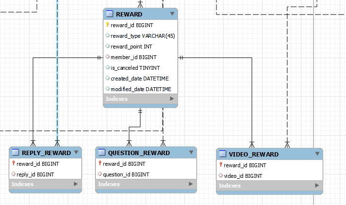

각각의 Reward 의 `reward_type` 으로 어떤 Reward 테이블인지 구분합니다. 그리고 하위의 Reward 테이블들은 `reward_id` 를 PK, FK 로 가지고 있습니다. 

여기서 출석체크를 했을 때 REWARD 기능이 추가된다고 해보겠습니다.

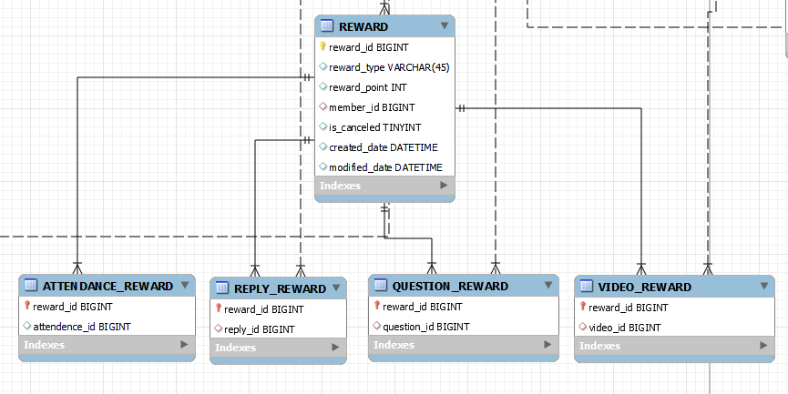

이렇게 `ATTENDANCE_REWARD` 테이블을 추가하면 됩니다. 그리고 `reward_type` 을 추가해주면 되겠죠. 

## JPA 엔티티 설계

이러한 조인 전략은 JPA 에서 아래와 같이 작성할 수 있습니다. (개략적으로 작성했습니다.)

```java
@Entity
@Inheritance(strategy = InheritanceType.JOINED)
@DiscriminatorColumn(name = "rewardType")
public class Reward extends BaseEntity {

    @Id
    @GeneratedValue(strategy = GenerationType.IDENTITY)
    private Long rewardId;

	private Integer rewardPoint;

    @ManyToOne(fetch = FetchType.LAZY)
   	@JoinColumn(name = "member_id", nullable = false)
	private Member member;
		
    private boolean isCanceled;
}

@Entity
public class ReplyReward extends Reward {

    @ManyToOne(fetch = FetchType.LAZY)
   	@JoinColumn(name = "reply_id")
		private Reply reply;
}

@Entity
public class QuestionReward extends Reward {

    @ManyToOne(fetch = FetchType.LAZY)
   	@JoinColumn(name = "question_id")
    private Question question;
}

@Entity
public class VideoReward extends Reward {

    @ManyToOne(fetch = FetchType.LAZY)
   	@JoinColumn(name = "video_id")
    private Video video;
}
```

핵심 어노테이션은 `@Inheritance(strategy = InheritanceType.JOINED)` 과 `@DiscriminatorColumn(name = "rewardType")` 입니다. 그러면 하위 클래스명으로 `reward_type` 필드가 채워지게 됩니다.

## 문제 해결...? 하지만...

이제 문제가 해결되었는지 보겠습니다.

1. 데이터 무결성 문제가 발생하지 않도록 null 값 최소화 :point_right: 매우 잘 해결되었습니다!
2. 수정과 확장이 용이한 테이블 설계 :point_right: 상속 관계... 이거 OCP 에 최고인 거 같습니다!

하지만 당연히 몇 가지 문제가 있었습니다.

### 그래서 쿼리문은 간단하나?

하나를 저장을 해도 테이블 2개에 저장해야 하기 때문에 쿼리문이 2번 나갑니다.

```mysql
insert into 
reward (reward_id, created_date, modified_date, is_canceled, member_id, reward_point, reward_type) 
values (1L, '2023-09-20T19:28:37.136+0900', '2023-09-20T19:28:37.136+0900', false, 2, 10, 'VIDEO');

insert into 
video_reward (video_id, reward_id) values (1, 1);
```

그리고 조회를 할 때는 기본적으로 join 이 됩니다. 아래는 `rewardRepository.findById(1L);` 의 쿼리문입니다.

```mysql
select *
from reward r
left join question_reward qr on r.reward_id=qr.reward_id 
left join reply_reward rr on r.reward_id=rr.reward_id 
left join video_reward vr on r.reward_id=vr.reward_id 
where reward0_.reward_id=1;
```

어차피 하나씩 대응하니 table 컬럼 수 자체가 늘어날 일은 없긴 합니다만 간단한 조회도 `left join` 을 하기 때문에 성능에 악영향이 있겠다고 생각했습니다. 이 정도는 감수할만하다고 생각했습니다.

### 주객 전도가 되어버린 쿼리문

이렇게 설계를 하려고 했던 처음의 목적을 생각해보면 video 를 환불했을 때 관련된 리워드를 모두 취소처리해야 했기 때문이었습니다. 그래서 video 와의 연관관계가 필요했고, 그게 아니면 굳이 연관관계도 복잡하게 고민할 필요가 없었겠죠. 물론 다른 이유도 있지만 처음 고민했던 주된 이유는 취소처리때문이었습니다.

하지만 특정 주문을 취소했을 때 주문 번호로 비디오를 찾고, 비디오에 해당하는 리워드를 전부 삭제해줘야 합니다. 여기서 엄청난 left join 문이 필요하다는 걸 깨달았습니다.

- `reward` 와 `video_reward` -> `video_reward` 와 `video` -> `video` 와 `order_video` -> `order_video` 의 `order_id` 로 찾음
- `reward` 와 `question_reward` -> `question_reward` 와 `video` -> `video` 와 `order_video` -> `order_video`  의 `order_id` 로 찾음 의 `order_id` 로 찾음
- `reward` 와 `reply_reward` -> `reply_reward` 와 `video` -> `video` 와 `order_video` -> `order_video`  의 `order_id` 로 찾음

다른 조회문은 괜찮았지만 이렇게 주문 취소 시가 가장 문제였습니다. 그래서 다른 방법도 찾아보고자 했습니다.

# 3. 해결 2 : 조인 전략, 공통 필드를 곁들인

문제는 order 삭제 시 하위 테이블이 각각의 연관관계를 설정하고 있다보니 그렇다고 생각했습니다. 그래서 상위 테이블인 REWARD 에서 공통된 연관관계인 `video_id` 값을 가지면 어떨까 생각했습니다.

## DB 설계

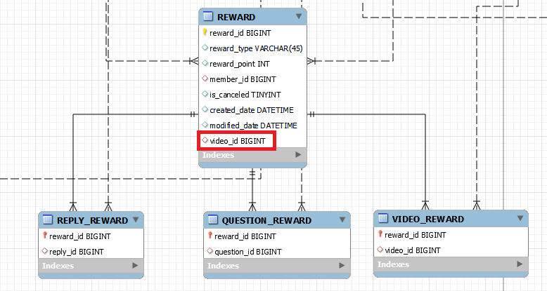

이렇게 되면 쿼리는 (비교적) 간단해집니다.

```mysql
delete r 
	from reward r
	join video v on r.video_id = v.video_id
	join order_video ov on v.video_id = ov.video_id
	where ov.order_id = :order_id
		and r.member_id = :member_id
```

## 그러나 다시 문제 상황으로 회귀

하지만 이렇게 하면 다시 문제 상황으로 복귀하게 됩니다.

1. `video_id` 가 필요없는 Reward 가 생기면? -> **확장 가능하고자 조인 전략을 사용하는데 확장이 불가능해지는 문제**
2. Reward 의 `video_id` 와 하위 테이블의 `video_id` 은 항상 일치한다고 보장할 수 있는가? -> **무결성 문제**

# 4. 해결 3 : 단일 테이블 전략과 서브타입 테이블 전략

이쯤 돼서 테이블 설계부터 잘못되었나 생각이 들었습니다. 나름 괜찮은 설계처럼 보여서 거기에 너무 얽매이고 있다는 느낌도 들었구요. 다른 테이블 전략도 따져보기 시작했습니다.

## 단일 테이블 전략

단일 테이블 전략은 처음 설계했던 방식입니다. 모든 필드를 단일 테이블에 넣고, DTYPE 을 통해 구분합니다. 조인이 필요 없으므로 일반적으로 조회 성능이 빠르고 조회 쿼리가 단순합니다.

 하지만 자식 Entity 가 매핑한 컬럼은 모두 Null 을 허용해야 하며, 테이블 자체가 커져서 상황에 따라 조회 성능이 오히려 느려질 수 있습니다.

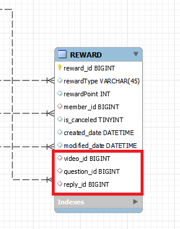

JPA 엔티티는 아래와 같이 작성합니다.

```
@Entity
@Inheritance(strategy = InheritanceType.SINGLE_TABLE)
@DiscriminatorColumn(name = "rewardType")
public class Reward extends BaseEntity {

    @Id
    @GeneratedValue(strategy = GenerationType.IDENTITY)
    private Long rewardId;

	private Integer rewardPoint;

    @ManyToOne(fetch = FetchType.LAZY)
   	@JoinColumn(name = "member_id", nullable = false)
	private Member member;
		
    private boolean isCanceled;
}

@Entity
public class ReplyReward extends Reward {

    @ManyToOne(fetch = FetchType.LAZY)
   	@JoinColumn(name = "reply_id")
	private Reply reply;
}

@Entity
public class QuestionReward extends Reward {

    @ManyToOne(fetch = FetchType.LAZY)
   	@JoinColumn(name = "question_id")
    private Question question;
}

@Entity
public class VideoReward extends Reward {

    @ManyToOne(fetch = FetchType.LAZY)
   	@JoinColumn(name = "video_id")
    private Video video;
}
```

`@Inheritance` 로 상속관계 전략을 결정합니다. 속성으로 `strategy = InheritanceType.SINGLE_TABLE` 를 넣습니다.

하지만 **처음 목표 중 하나가 필드값으로 null 을 넣지 말자는 거였으니 이 전략은 고민만 하고 포기**했습니다.

## 서브타입 테이블 전략

멘토님께서 추천해주신 방법이 이것과 비슷했습니다. 다만 멘토님은 굳이 상속을 사용하면서 하나로 묶을 필요가 있냐고 말씀하셨었는데요. Reward 의 공통 속성을 정의하기 위해서는 상속이 필요한건 맞지 않을까 생각했습니다. 조회문을 작성할 때도 한번에 가져오려면 상속이 더 쉽구요.

이 전략은 서브 타입을 명확하게 구분해서 처리할 때 효과적이며 not null 제약조건 사용할 수 있습니다. 하지만 여러 자식 테이블을 함께 조회할 때 성능이 느리며(UNION SQL 필요) 자식 테이블을 통합해서 쿼리하기가 어렵습니다.

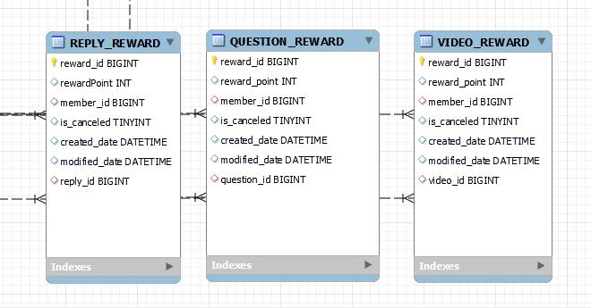

JPA 설계는 아래와 같이 됩니다.

```java
@Entity
@Inheritance(strategy = InheritanceType.TABLE_PER_CLASS)
public class Reward extends BaseEntity {

    @Id
    @GeneratedValue(strategy = GenerationType.IDENTITY)
    private Long rewardId;

	private Integer rewardPoint;

    @ManyToOne(fetch = FetchType.LAZY)
   	@JoinColumn(name = "member_id", nullable = false)
	private Member member;
		
    private boolean isCanceled;
}

@Entity
public class ReplyReward extends Reward {

    @ManyToOne(fetch = FetchType.LAZY)
   	@JoinColumn(name = "reply_id")
	private Reply reply;
}

@Entity
public class QuestionReward extends Reward {

    @ManyToOne(fetch = FetchType.LAZY)
   	@JoinColumn(name = "question_id")
    private Question question;
}

@Entity
public class VideoReward extends Reward {

    @ManyToOne(fetch = FetchType.LAZY)
   	@JoinColumn(name = "video_id")
    private Video video;
}
```

- `@Inheritance` : 상속관계 전략을 결정합니다. 속성으로 `strategy = InheritanceType.TABLE_PER_CLASS` 를 넣습니다.
- `@DiscriminatorColumn` : DTYPE 은 사용되지 않습니다.

이 전략은 더 좋지 않다고 생각하는 게, Reward 로 조회하려면 UNION 을 사용합니다. 제가 조인 전략을 사용하지 않기로 한 이유가 Reward 취소 처리 시 left join 이 많다는 점이었는데, 서브타입 테이블 전략은 오히려 더 자주 요청되는 select 쿼리문에서 성능이 부족해집니다. 따라서 이 전략도 채택하지 않기로 했습니다. Reward 취소 처리보다 Reward 조회가 훨씬 더 빈번하게 일어날테니까요.

# 그래서 최종 해결책은?

프로젝트 기간 중 2 ~ 3일은 핵심 비즈니스도 아닌 Reward 테이블 DB 설계에 꽁꽁 묶여있었습니다... :cry: 하지만 확장 가능한 것보다 10배 더 중요한 게 기간 내에 기능을 개발하는 것이니까요. 개발 시간의 1/10 (2~3일) 을 여기에 사용한 시점에서야 확장 가능한 설계로 얻는 장기적인 이점보다 고민하는 시간적 비용이 더 커졌다고 판단되었습니다. 그래서 숨을 좀 돌리고 현재까지 상황을 돌아봤습니다.

해결 1, 2, 3 을 적었지만 해결3 은 판단만 한거였구요. 제가 직접 수행한 건 '문제 상황 직면' -> '해결 1 로 구조 변경' -> '해결 2 로 구조 변경' -> '**해결 1 : 조인전략 돌아와서 고민 중**' 인 상황입니다. 다시 현재 상황을 판단해볼게요.

1. 초기 목표는 달성되었는가?  :point_right: **조인전략**으로 달성
2. 추가적인 문제는? :point_right: 주문 취소 시 해당되는 **reward 를 취소처리해야 하는데 성능이 나쁠 것으로 예상** 

그래서 다른 AWS 계정을 하나 더 만들고 현재 배포용 db 와 똑같은 t3.micro 로 테스트용 DB 를 만들고 직접 여러 쿼리문으로 취소 처리하면서 성능을 확인하기로 했습니다. 테스트용 DB 는 아래와 같이 구성했습니다.

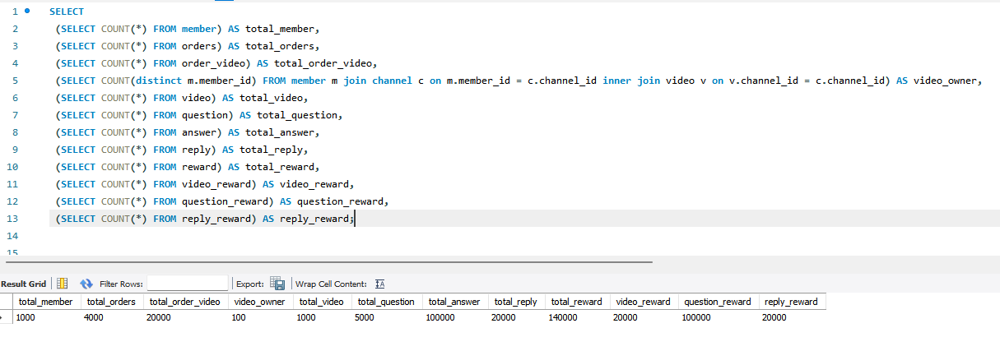

1. 1000명의 사용자가 있다고 가정하고 그 중 100명이 10개씩 video 를 올림
   - member 1000명, video 1000개
2. video 별로 5개씩 question 생성
   - question 5000개
3. 각각의 사용자는 video 를 랜덤하게 5개씩 4번 주문 -> 총 20개 주문
   - order 레코드 4000개, order_video 레코드 20000개, video_reward 레코드 20000개
4. 사용자는 video 에 댓글 생성, video 의 문제 5개를 모두 풀고 리워드 적립
   - reply_reward 20000개, question_reward 100000개
5. 총 리워드 데이터 **14만개**

## 쿼리문 비교

그리고 비교하려는 쿼리문은 아래와 같습니다. DB 에서 직접 실행하지 않고 애플리케이션에서 비교하는 이유는 다음과 같습니다.

1. 쿼리문 요청이 나눠지는 API 가 있음. 쿼리문이 짧고 간단할수록 상대적으로 여러 쿼리문이 나가게 만들었기 때문에 해당 시간도 염두에 두어야 한다고 생각함.
2. 실제로 데이터를 받고 JPA 에서 상속관계까지 포함해서 객체로 만드는 과정까지의 시간을 확인하고 싶음

각각의 시간은 repository 에 걸린 `RepositoryLoggingAop` 으로 재려고 합니다.

```java
@Aspect
@Component
@Slf4j
public class RepositoryLoggingAop {

    private final WarmupState warmupState;

    public RepositoryLoggingAop(WarmupState warmupState) {
        this.warmupState = warmupState;
    }

    @Pointcut("execution(* org.springframework.data.jpa.repository.JpaRepository.*(..)) " +
            "|| execution(* com.server.domain.*.repository..*RepositoryImpl.*(..))" +
            "|| execution(* com.server.domain.*.repository..*Repository.*(..))" +
            "&& !execution(* com.server.domain.*.repository..*RepositoryCustom.*(..))")
    public void repositoryLogging() {}

    @Around("repositoryLogging()")
    public Object logging(ProceedingJoinPoint joinPoint) throws Throwable {

        String classMethod = joinPoint.getSignature().toShortString();
        Object[] args = joinPoint.getArgs();

        long startTime = System.currentTimeMillis();

        Object result = joinPoint.proceed();

        long endTime = System.currentTimeMillis();

        long duration = endTime - startTime;

        if(warmupState.isWarmupCompleted()){
            log.info("REPOSITORY : {} duration: {} ms \"{}\"", classMethod, duration, Arrays.toString(args));
        }

        return result;
    }
}
```

**방법은 랜덤한 order-id 15개를 조회해서 평균 DB 접근 시간을 계산**하려고 합니다. 각 DB 호출마다 ` System.currentTimeMillis()` 으로 시간을 측정했으며 캐시 문제를 없애기 위해 아래 3개의 방법을 순회하면서 총 15번 (개별 5번) 실행하고 평균을 측정했습니다.

그리고 호출 전에는 15개에 포함되지 않는 orderId 로 각 메서드를 초기화해주고 JIT 지연문제를 없앴습니다.

호출을 하면 아래와 같이 로깅이 찍힙니다. 아래의 경우는 총 438ms 가 걸렸으며 각 호출별로 시간도 있습니다.

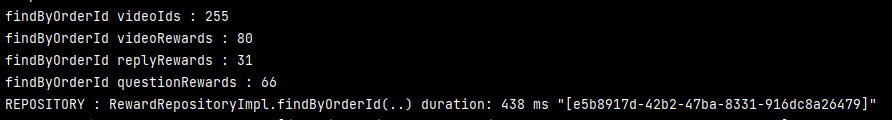

### 짧게 여러 번 보내기

*실제로는 각 호출마다 ` System.currentTimeMillis()` 이 있다고 생각하시면 됩니다.*

```java
@Override
public List<Reward> findByOrderId(Long memberId, String orderId) {

    List<Long> videoIds = queryFactory.select(orderVideo.video.videoId)
            .from(orderVideo)
            .where(orderVideo.order.orderId.eq(orderId)
                    .and(orderVideo.orderStatus.eq(OrderStatus.COMPLETED)))
            .fetch();

	List<VideoReward> videoRewards = queryFactory.selectFrom(videoReward)
            .where(videoReward.video.videoId.in(videoIds)
                    .and(videoReward.member.memberId.eq(memberId)))
            .fetch();

    List<ReplyReward> replyRewards = queryFactory.selectFrom(replyReward)
            .where(replyReward.video.videoId.in(videoIds)
                    .and(replyReward.member.memberId.eq(memberId)))
            .fetch();
    
    List<QuestionReward> questionRewards = queryFactory.selectFrom(questionReward)
            .join(questionReward.question, question)
            .where(question.video.videoId.in(videoIds)
                    .and(questionReward.member.memberId.eq(memberId)))
            .fetch();

    List<Reward> rewards = new ArrayList<>();
    rewards.addAll(replyRewards);
    rewards.addAll(questionRewards);
    rewards.addAll(videoRewards);

    return rewards;
}
```

`videoIds` 를 가져온 뒤 각각의 하위 테이블의 리워드를 조회합니다. join 문이 없거나 제일 간단합니다. DB 에 부하는 적겠지만 **쿼리문을 4번이나 보내기 때문에 API 호출 시간이 많이 걸릴 것 같습니다.**

아래의 총 걸린시간은 `findByOrderId` 메서드가 실행된 시간으로, 개별 쿼리문 실행시간의 합보다 클 수 있습니다.

|      | videoId 찾기 | videoRewards 찾기 | replyRewards 찾기 | questionRewards 찾기 | 총 걸린시간 |
| ---- | ------------ | ----------------- | ----------------- | -------------------- | ----------- |
| 1    | 28 ms        | 13 ms             | 15 ms             | 16 ms                | 72 ms       |
| 2    | 24 ms        | 13 ms             | 15 ms             | 17 ms                | 70 ms       |
| 3    | 23 ms        | 13 ms             | 16 ms             | 17 ms                | 70 ms       |
| 4    | 26 ms        | 16 ms             | 14 ms             | 15 ms                | 71 ms       |
| 5    | 33 ms        | 18 ms             | 17 ms             | 27 ms                | 96 ms       |
| 평균 | **26.8  ms** | **14.6 ms**       | **15.4 ms**       | **18.4 ms**          | **75.8 ms** |

아래는 생성되는 쿼리문입니다. 총 4개 중에 다 비슷하기 때문에 `videoRewards` 만 보겠습니다.

```mysql
select
        r.reward_id,
        r.created_date,
        r.modified_date,
        r.is_canceled,
        r.member_id,
        r.reward_point,
        vr.video_id
    from
        video_reward vr 
    inner join reward r on vr.reward_id=r.reward_id 
    where
        vr.video_id in (1359, 1938, 1648, 2037, 1726)
        and r.member_id = 1845
```

코드 상에서는 REWARD 와 VIDEO_REWARD 의 조인을 명시하지 않았지만 조인 전략을 사용했기 때문에 `reward_id` 로 조인이 이루어지는 모습입니다. 다만 **Reward 에서 하위 테이블로 찾아갈 때는 `left Join` 이었다면 여기서는 하위 테이블에서 Reward 로 올라가기 때문에 `inner join`** 입니다.

아래는 해당 퀴리문의 실행계획입니다.

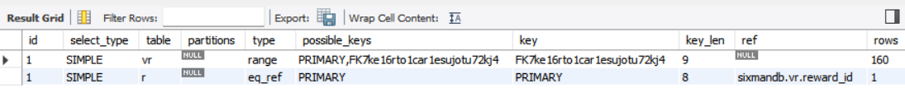

중요한 건 type 으로,  테이블의 데이터를 어떻게 찾을지에 관한 정보입니다. REWARD 의 `reward_id` 로 하나의 VIDEO_REWARD 를 찾기 때문에 type 이 **eq_ref** 로 고유 인덱스나 기본 키를 사용하여 단 1건의 데이터를 조회합니다. VIDEO_REWARD 의 `video_id` 컬럼 또한 FK 이기 때문에 range 스캔으로 성능이 좋습니다.

### 서브 쿼리문 없이 2번에 나눠서 보내기

```java
    public List<Reward> findByOrderIdTwice(Long memberId, String orderId) {

        List<Long> videoIds = queryFactory.select(orderVideo.video.videoId)
                .from(orderVideo)
                .where(orderVideo.order.orderId.eq(orderId)
                        .and(orderVideo.orderStatus.eq(OrderStatus.COMPLETED)))
                .fetch();

        List<Reward> rewards = queryFactory
                .selectFrom(reward)
                .leftJoin(videoReward).on(reward.rewardId.eq(videoReward.rewardId))
                .leftJoin(replyReward).on(reward.rewardId.eq(replyReward.rewardId))
                .leftJoin(questionReward).on(reward.rewardId.eq(questionReward.rewardId))
                .leftJoin(questionReward.question, question)
                .where(reward.member.memberId.eq(memberId)
                        .and(
                                videoReward.video.videoId.in(videoIds)
                                        .or(question.video.videoId.in(videoIds))
                                        .or(replyReward.video.videoId.in(videoIds))
                        )
                ).fetch();

        return rewards;
    }
```

여기서는 `videoIds` 만 조회하고 나머지는 모두 `left join` 하여 하나의 테이블을 만든 뒤 그 `videoIds` 로 조회합니다.

|      | videoId 찾기 | reward 찾기 | 총 걸린 시간 |
| ---- | ------------ | ----------- | ------------ |
| 1    | 22 ms        | 20 ms       | 43 ms        |
| 2    | 26 ms        | 18 ms       | 45 ms        |
| 3    | 27 ms        | 17 ms       | 46 ms        |
| 4    | 27 ms        | 32 ms       | 59 ms        |
| 5    | 23 ms        | 24 ms       | 47 ms        |
| 평균 | **25 ms**    | **22.2 ms** | **48 ms**    |

사실 videoIds 를 찾는 쿼리문을 따로 분리해주고, 한방 쿼리는 아니지만 하나의 테이블에 서브쿼리없이 보내기때문에 제일 괜찮을 거라고 판단한 쿼리문입니다. `reward 찾기` 쿼리문만 보겠습니다.

```mysql
SELECT 
    r.reward_id, 
    r.created_date, 
    r.modified_date, 
    r.is_canceled, 
    r.member_id, 
    r.reward_point,
    qr.question_id, 
    rr.video_id AS reply_video_id,
    vr.video_id AS video_video_id, 
    r.reward_type
FROM 
    reward r
LEFT OUTER JOIN question_reward qr ON r.reward_id = qr.reward_id
LEFT OUTER JOIN reply_reward rr ON r.reward_id = rr.reward_id
LEFT OUTER JOIN video_reward vr ON r.reward_id = vr.reward_id
LEFT OUTER JOIN question q ON qr.question_id = q.question_id
WHERE
    r.member_id = 2211 
AND 
   (
       vr.video_id IN (1608, 2300, 2107, 1837, 1669) 
    OR q.video_id IN (1608, 2300, 2107, 1837, 1669) 
    OR rr.video_id IN (1608, 2300, 2107, 1837, 1669)
   )
```

`Left Join` 이 많다고 해도 레코드 개수가 뻥튀기되거나 하지 않습니다. 그래서 시간이 생각보다 많이 걸리지 않은 것 같습니다. 실행 계획을 보겠습니다.

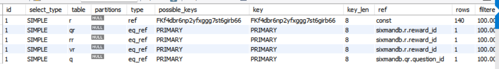

PK, FK 등 인덱스로 타기 때문에 실행계획도 `eq_ref` 로 문제없습니다.

그런데 사실 JPA 로 직접 나가는 쿼리문은 left join 이 같은 게 두번씩 나가는데요. 하위 테이블을 사용하기 위해 명시적으로 `left join` 한 부분과 JPA 에서 `@Inheritance(strategy = InheritanceType.JOINED)` 을 인식하고 작성하는 `left join` 이 겹치는 것 같았습니다. 그래서 이 부분은 해결해보고 안되면 JPQL 로 작성하는 것도 괜찮을 듯 합니다. (아직 해결 못했습니다.)

### 서브 쿼리문을 포함하여 한번에 보내기

```java
public List<Reward> findByOrderIdOnce(Long memberId, String orderId) {

    JPAQuery<Long> videoIdsWhere = queryFactory.select(orderVideo.video.videoId)
            .from(orderVideo)
            .where(orderVideo.order.orderId.eq(orderId)
                    .and(orderVideo.orderStatus.eq(OrderStatus.COMPLETED)));

    List<Reward> rewards = queryFactory
            .selectFrom(reward)
            .leftJoin(videoReward).on(reward.rewardId.eq(videoReward.rewardId))
            .leftJoin(replyReward).on(reward.rewardId.eq(replyReward.rewardId))
            .leftJoin(questionReward).on(reward.rewardId.eq(questionReward.rewardId))
            .leftJoin(questionReward.question, question)
            .where(reward.member.memberId.eq(memberId)
                    .and(
                            videoReward.video.videoId.in(videoIdsWhere)
                                    .or(question.video.videoId.in(videoIdsWhere))
                                    .or(replyReward.video.videoId.in(videoIdsWhere))
                    )
            ).fetch();

    return rewards;
}

```

솔직히 여기는 좀 느릴 줄 알았는데요. 예상 외로 측정 시간은 빨랐습니다.


|      | 서브쿼리를 이용한 한방 쿼리 | 총 걸린 시간 |
| ---- | --------------------------- | ------------ |
| 1    | 31 ms                       | 31 ms        |
| 2    | 45 ms                       | 46 ms        |
| 3    | 34 ms                       | 34 ms        |
| 4    | 32 ms                       | 32 ms        |
| 5    | 33 ms                       | 33 ms        |
| 평균 | **35 ms**                   | **35.2 ms**  |

3개 중 가장 빨랐는데요. 결국은 쿼리문 자체가 보기보다 복잡하지 않아서 API 호출 시간이 가장 큰 영향을 끼쳤다고 봅니다. 쿼리문은 2번과 비슷해서 따로 보지는 않고 실행계획만 보겠습니다.

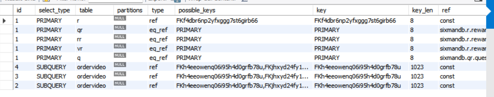

인덱스를 통해 조회가 잘 되는 것 같습니다.

### 최종 결과

|           | 여러 번 짧은 쿼리 (1번) | 두방 쿼리 (2번) | 한방 쿼리 (3번) |
| --------- | ----------------------- | --------------- | --------------- |
| 시간 평균 | **75.8 ms**             | **48 ms**       | **35.2 ms**     |

큰 문제가 없다면 **3번째 방법**이 어떨까 생각했는데요. 그 이유는,

1. 1번은 네트워크 접근이 너무 잦고 2, 3번보다 1.5배 ~ 2배 느림. 물론 가독성은 제일 좋을지도.
2. 2, 3번의 코드 가독성은 큰 차이가 없음. 그러면 더 빠른 3번으로 채택하는 게 좋을 것 같음

# 마무리

Reward 14만개는 데이터가 적다고 생각하진 않았는데 데이터가 적어서 그런지, 쿼리문이 간단해서 그런지 사실 세 방법 모두 큰 차이가 없었습니다.

JPQL 로 변경하는 건 쉬우니까 나중에 한번 해보겠습니다. 현재 사용하는 데는 큰 문제 없으니까요. 그리고 Reward 분석한다고 DB 에 값을 채워넣었는데 다른 쿼리문도 비교해봐야겠습니다.

사실 이렇게 보면 다른 전략도 결국 다 비슷비슷하겠구나 느꼈습니다. 하지만 저는 어디엔가 있을 완벽한 설계를 찾고 싶은 갈망이 있습니다. 언젠가 이 테이블의 더 나은 설계를 찾을 수는 있겠죠.

