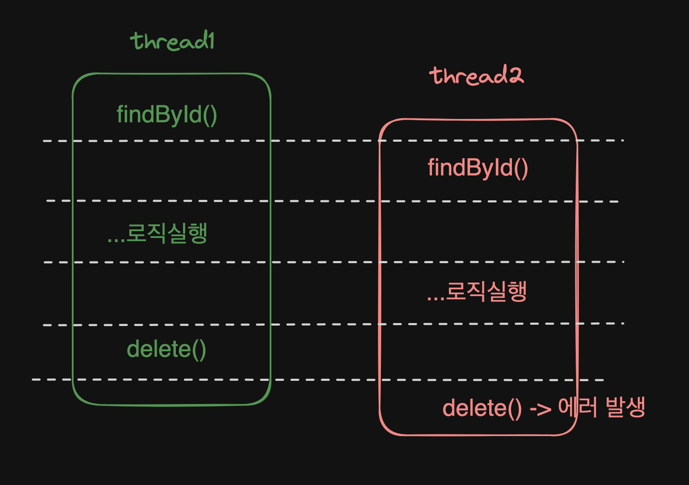

# 0. 문제 상황

사이드 프로젝트를 할 때의 문제였습니다. JPA 에서 특정 엔티티를 삭제하는 요청이 동시에 발생했을 때 첫번째 요청은 삭제가 제대로 되고 두번째 요청은 에러를 뱉었습니다.

예를 들어서, 아래 메서드가 2번 호출되었을 때입니다.

```java
@Transactional
fun deleteData(id: Long) {

    val data = testRepository.findById(id).orElseThrow { throw IllegalArgumentException("해당 데이터가 없습니다.") }

    Thread.sleep(5000)

    testRepository.delete(data)
}
```

그러면 아래와 같은 에러가 발생합니다.

`StaleObjectStateException: Row was updated or deleted by another transaction`

하지만 데이터는 정상적으로 삭제됩니다. 첫번째 요청은 데이터를 정상적으로 삭제하고, 두번째는 에러가 발생했습니다.

원하는 동작은 첫번쨰 요청이 정상적으로 삭제하고, 두번째 요청은 "해당 데이터가 없습니다." 라는 비즈니스 에러로 반환되는 것입니다.

## 0.1 에러 원인

간단하게 추론할 수 있는건 이미 삭제된 엔티티에 대해서 또 삭제를 하기 때문이라고 추측할 수 있습니다. 아래와 같이요.



thread1 에서 delete() 가 되어서  thread2 에서는 에러가 발생합니다.

하지만 delete() 는 `delete from test_data where id=?` 라는 sql 문이 보내지는데요. 해당 sql문 where 조건에 해당되는 row 가 없더라도 정상실행되는 sql 문입니다.

좀 더 JPA 의 delete 메서드를 확인할 필요가 있습니다.

### 0.0.1 JPA 의 delete()

이래저래 에러 로그를 찾아보면 `ModelMutationHelper` 클래스를 들어가게 됩니다. 그리고 `identifiedResultsCheck()` 메서드에서 **영향을 받기로 예상된 row 수와 실제 영향받은 row 수를 비교해서 일치하지 않으면 exception 을 던집니다.**

엔티티가 이미 있었고, 영향 받기로 예상되는 row 수는 1개이지만 실제 sql 문으로 리턴된 row 수는 0 이므로 (이미 이전 스레드에서 삭제했으므로) exception 이 던져진겁니다.

### 0.0.2 update (dirty checking)

업데이트도 마찬가지입니다. thread1 이 delete 를 하고, 그 후에 동시에 thread2 가 update 를 한다면 thread2 는 마찬가지로 StaleObjectStateException 을 받게 됩니다.

비슷하지만, update 가 동시에 된다면 에러가 없습니다. 왜냐하면 업데이트된 row 가 1 로 정상적으로 반환되기 때문입니다.

# 1. 해결방법

처음 문제가 발생했을 때는  Lock 으로 해결했는데  try-catch 가 더 나을거라는 생각이 듭니다.

## 1.1 Lock

`@Lock` 어노테이션은 JPA(Java Persistence API)에서 데이터베이스 엔티티를 조회할 때 **잠금(Locking)** 메커니즘을 설정하는 데 사용됩니다. 이 어노테이션은 주로 **동시성 문제를 방지**하고 데이터 일관성을 유지하기 위해 사용됩니다.

### 1.1.1 Lock 으로 해결

findById 를 아래와 같이 override 해서 수정합니다.

```java
interface TestRepository: JpaRepository<TestData, Long> {

    @Lock(LockModeType.PESSIMISTIC_WRITE)
    override fun findById(id: Long): Optional<TestData>
}
```

`@Lock(LockModeType.PESSIMISTIC_WRITE)` 을 사용하면 해당 row 는 다른 트랜잭션이 읽기도 불가능해집니다.

### 1.1.2 Lock 종류

1. **`LockModeType.READ` (낙관적 읽기 잠금)**:
   - 데이터를 읽을 때 **낙관적 잠금**을 적용합니다.
   - 다른 트랜잭션이 해당 데이터를 수정하지 못하게 하며, 보통 버전 관리를 통해 충돌을 감지합니다.
2. **`LockModeType.WRITE` (낙관적 쓰기 잠금)**:
   - 데이터를 수정할 때 **낙관적 잠금**을 적용합니다.
   - READ보다 강력하며, 변경 작업에 대한 잠금을 설정합니다.
3. **`LockModeType.OPTIMISTIC` (낙관적 잠금)**:
   - 기본적으로 데이터 충돌 가능성을 감지하고, 데이터 수정 시 충돌이 발생하면 예외를 발생시킵니다.
4. **`LockModeType.OPTIMISTIC_FORCE_INCREMENT`**:
   - 낙관적 잠금이지만, 엔티티의 버전 번호를 강제로 증가시킵니다.
5. **`LockModeType.PESSIMISTIC_READ` (비관적 읽기 잠금)**:
   - 데이터를 읽는 동안 다른 트랜잭션이 해당 데이터를 수정하지 못하도록 잠급니다.
6. **`LockModeType.PESSIMISTIC_WRITE` (비관적 쓰기 잠금)**:
   - 데이터를 수정하는 동안 다른 트랜잭션이 해당 데이터에 접근하지 못하도록 잠급니다.
7. **`LockModeType.PESSIMISTIC_FORCE_INCREMENT`**:
   - 비관적 잠금을 걸면서도 버전 번호를 강제로 증가시킵니다.
8. **`LockModeType.NONE`**:
   - 잠금을 적용하지 않습니다. (기본값)

### 1.1.3 문제점

데이터에 Lock 이 걸려서 다른 곳에서 해당 데이터를 읽을 때 (목록을 읽어오거나) 대기 시간이 발생합니다. 성능 상 안좋아질 수 있습니다.

## 1.2 nativeQuery 혹은 JPQL

### 1.2.1 Repository 에 메서드 추가

Repository 에 아래와 같이 JPQL 메서드를 추가합니다.

```java
interface TestRepository: JpaRepository<TestData, Long> {

    @Query("delete from TestData t where t.id = :id")
    @Modifying
    fun deleteByIdJPQL(id: Long)
}
```

@Query, @Modifying 어노테이션으로 사용합니다.  JPQL 은 1차 캐시를 거치지 않고 바로 쓰기지연저장소로 sql 문이 반영되기 때문에 정상적으로 작동합니다.

참고로 JPQL 이나  nativeQuery 를 사용할 때는 메서드명으로 그렇게 사용된다고 표시하는 편입니다. 영속성 컨텍스트와 DB 가 달라질 수 있기 때문입니다.

### 1.2.2 문제점

실제로는 오류가 발생해야 하는데 발생하지 않을 수 있습니다. 예를 들어서 삭제와 업데이트가 동시에 발생할 때, 업데이트에서 동시성 문제가 발생했다고 가정하겠습니다.

이때  JPQL 로 "update test_data set t.data = :data where id = :id" 라고 업데이트문을 날리면 영향받는 데이터가 없더라도 정상적으로 수행됩니다.

그러면 사용자는 업데이트가 정상적으로 이루어졌다고 생각하지만 이전에 데이터가 삭제되었기 때문에 업데이트는 되지 않았습니다.

## 1.3 그냥 try catch 쓰기

어차피 첫번째 요청에서 삭제가 되었으니 try catch 로 StaleObjectStateException 을 잡아서 비즈니스 에러로 다시 던질 수도 있습니다. 코드나 방법이 깔끔하지는 않습니다. 그리고 예상되는 곳에 모두 try catch 를 해야하는 문제도 있구요.

ControllerAdvice 에서 잡을 수도 있는데 StaleObjectStateException 라는 에러가 Controller 레벨까지 전파되어야하나라는 생각이 듭니다.

혹은 Service 어노테이션을 대상으로 AOP 를 적용해도 될 것 같구요.

# 2. 결론

원래는 1번으로 해결했는데, 3번이 그나마 제일 나은 것 같습니다. 어쨌든 '예상되는 모든 에러는 비즈니스 에러로 관리한다' 가 포인트입니다.

만약 재고관리, 주문 같이 한번에 한명만 접근해야 하는 문제라면 Lock 을 걸어야겠죠.

예를 들어 재고가 100개 있고 동시성을 확보하려면 재고 테이블에LockModeType.PESSIMISTIC_READ 혹은 LockModeType.PESSIMISTIC_WRITE 를 사용할 것 같습니다.

그리고 재고와 아이템을 다른 테이블로 두고, 사용자는 재고 테이블을 조회하지 않도록 하면 될 것 같은데, 이 부분은 커머스 도메인에서 어떻게 하는지 봐야할것 같긴 합니다.