이번 포스팅은 [쉽게 설명하는 aws 기초 강좌](https://www.youtube.com/playlist?list=PLfth0bK2MgIan-SzGpHIbfnCnjj583K2m) 를 보면서 필요한 내용을 정리하였습니다.

AWS 로 대충 서비스 배포까지 해보았지만 AWS 는 언제나 미지의 영역, 두려움의 영역으로 남아있기 때문에 그런 생각을 없애기 위해서 AWS 자격증을 따고자 마음먹었습니다. 아무래도 목표가 명확하면 공부 의지도 더 생기니까요. 일단 2주 가량 공부하고 AWS Cloud Practitioner 을 먼저 취득하고, 지금 하고 있는 코드스테이츠 과정이 끝나기 전에 associate 단계의 Solutions Architect 와 Developer 를 목표로 공부하려고 합니다.

일단 AWS 기초 강좌를 들으면서 개략적인 개념을 이해해본 뒤 본격적으로 공부하려고 합니다.

원래 정리하지 않으려고 했는데요. 제가 또 이런거 정리안하면 가슴이 답답하고 잠도 안오고 새벽에 깨는 성격이라서요. (물론 그렇다고 잘 정리하는 건 아닙니다.) 기억할 필요가 있고, 생각 안날거 같은 건 개략적으로 정리하면서 개념 공부를 하겠습니다.

# EC2(Elastic Compute Cloud)

EC2 는 AWS 에서 제공하는 가상 컴퓨팅 서비스로, 인스턴스를 통해 원하는 만큼의 가상 서버를 구축할 수 있습니다.

# 생성

1. EC2 페이지에서 인스턴스를 클릭한 뒤 오른쪽 위 주황색의 인스턴스 시작 버튼을 누릅니다.

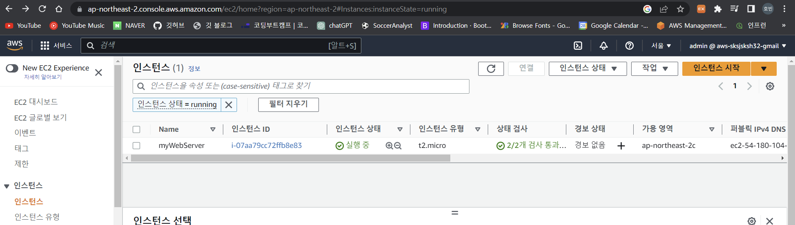

- 인스턴스는 1달에 (750hr/인스턴스 개수)  시간만큼 무료입니다. 즉, 인스턴스가 1개면 750시간 무료(한달 내내 무료), 2개면 325시간 무료(약 15일)입니다. 2개 이상 만들면 추가요금이 있겠습니다.

2. 이름을 임의로 지정하고 VM 을 선택합니다. 선택되어있는 default 값인 Amazon Linux 2023 AMI 를 선택하겠습니다.

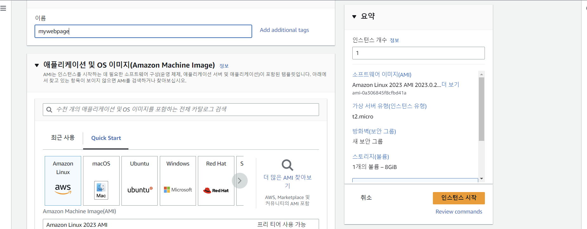

3. 인스턴스 유형은 t2.micro (freetier 무료), 키페어는 새 키페어 생성으로 만들겠습니다. 키페어를 통해 ec2 서버에 접속할 수 있습니다.

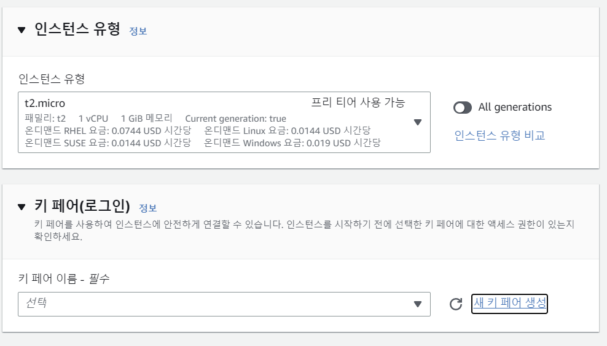

4. 키페어 이름을 임의로 지정하고 생성하겠습니다. 키페어는 다운로드하여 안전한 폴더에 보관합니다.

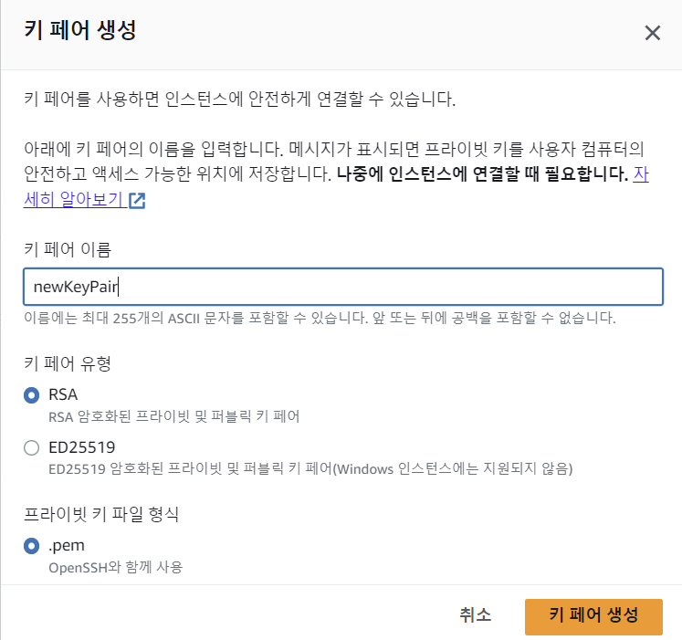

5. 보안그룹을 생성합니다. 보안 그룹이란 가상의 방화벽이라고 생각하면 편합니다.

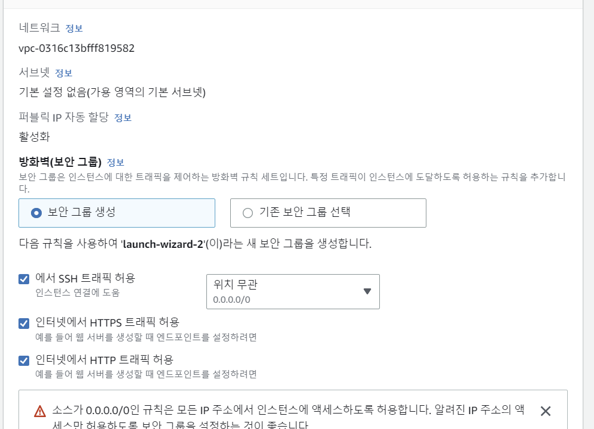

6. 스토리지 구성은 default 값으로 놓고 인스턴스 시작을 눌러주세요. 인스턴스가 생성된 것을 확인할 수 있습니다.

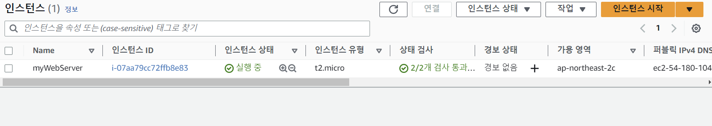

# 웹페이지 구축

인스턴스 내에서 콘솔창을 열고 웹페이지를 간단하게 만들 수 있습니다.

1. 인스턴스를 클릭하면 다음과 같이 나오는데요. 여기서 오른쪽 위 '연결' 을 클릭합니다. 그러면' 인스턴스에 연결' 이라고 나오는데, default 값으로 주황색 연결 버튼을 다시 눌러주세요

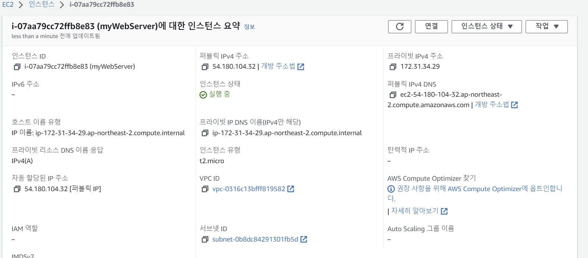

2. 콘솔창이 뜨게 되는데 http 웹서버 구축에 필요한 httpd 를 설치하고 시작합니다.

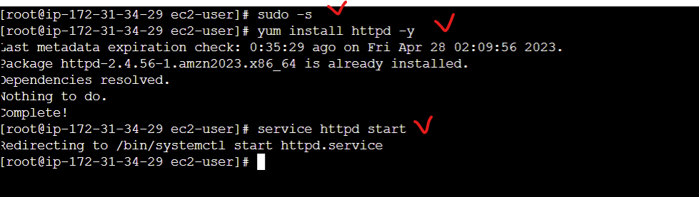

- `sudo -s` : root 권한 받아오기
- `yum install httpd -y` : httpd 패키지 설치
- `service httpd start` : httpd 시작

3. 자신의 퍼블릭 IP 주소로 연결하면 다음과 같이 웹페이지가 구축된 걸 볼 수 있습니다. 퍼블릭 IP 주소는 위에 1번 항목 캡처사진을 보면 볼 수 있습니다.

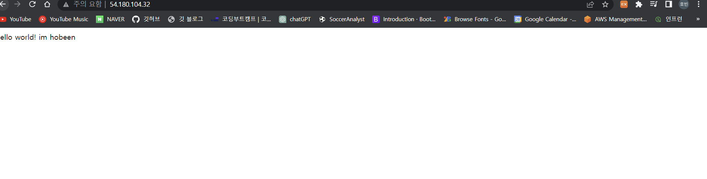

4. 저는 index.html 을 만들어서 구성했습니다. index.html 은 home directory 에서 다음 명령어로 만듭니다.
   - `nano /var/www/html/index.html`
   - 해당 nano 파일에 'hello world!'  를 입력한 후 ctrl + O -> Y -> enter 순으로 입력합니다. (저장됨)
   - 퍼블릭 IP 주소를 새로고침하면 index.html 파일이 렌더링 됩니다.

# 인스턴스 유형과 크기

**유형**(type)

AWS 는 각 인스턴스의 사용 목적에 따라 타입을 구분하여 선택할 수 있습니다.

- 범용 : M, T, A, MAC

  - 균형 있는 컴퓨팅, 메모리 및 네트워킹 리소스를 제공하며, 다양한 여러 워크로드에 사용 가능
  - 웹 서버 및 코드 리포지토리와 같이 이러한 리소스를 동등한 비율로 사용하는 애플리케이션에 적합
  - **FreeTier 가 선택할 수 있는 T 타입도 여기에 속합니다.**

- 컴퓨팅 최적화 : C 

  - 성능 프로세서를 활용하는 컴퓨팅 집약적인 애플리케이션에 적합

- 메모리 최적화 : R, X, z

  -  메모리에서 대규모 데이터 세트를 처리하는 워크로드를 위한 빠른 성능을 제공

- 가속화된 컴퓨팅 : P, Trn, G, F

  - 하드웨어 액셀러레이터 또는 코프로세서를 사용하여 부동 소수점 수 계산이나 그래픽 처리, 데이터 패턴 일치 등의 기능을 CPU에서 실행되는 소프트웨어보다 훨씬 효율적으로 수행 가능

- 스토리지 최적화 : H, I, D

  - 컬 스토리지에서 매우 큰 데이터 세트에 대해 많은 순차적 읽기 및 쓰기 액세스를 요구하는 워크로드를 위해 설계

  

**크기**

인스턴스의 cpu 갯수, 메모리 크기, 성능 등으로 사이즈가 결정됩니다.

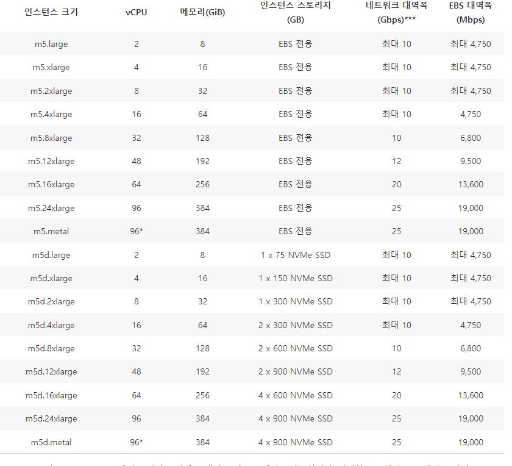

위 사진에서 보이는 것처럼 `.`뒤의 사이즈가 커질 수록 메모리,cpu 가 2배씩 증가합니다.


- 인스턴스는 다음과 같이 표기됩니다. (m 유형의 5번째 세대, AMD 기반의 cpu 사용, xlarge 크기)


# EBS(Elastic Block Store)

EBS 는 EC2 인스턴스에 사용할 영구 블록 스토리지볼륨을 제공합니다. 즉, 가상의 하드드라이브 입니다.

**특징**

- EC2 가 종료되어도 스토리지는 유지됩니다. 

- EBS 와 인스턴스는 네트워크로 연결되어 있으며 물리적으로 분리 형태입니다. 따라서 상황에 맞게 EC2 를 변경하는 것도 가능합니다.

- 하나의 EBS 는 하나의 EC2 에 장착 가능합니다. (단, EBS Multi Attach 기능을 사용할 때는 여러 EC2 에 장착할 수 있습니다.)

- 반대로 EC2 는 여러 EBS 를 가질 수 있습니다.

- 루트 볼륨으로 사용 시 EC2 가 종료되면 같이 삭제됩니다.

- EC2 와 같은 AZ 에 존재해야 합니다.

- 다음은 EBS 타입입니다.

  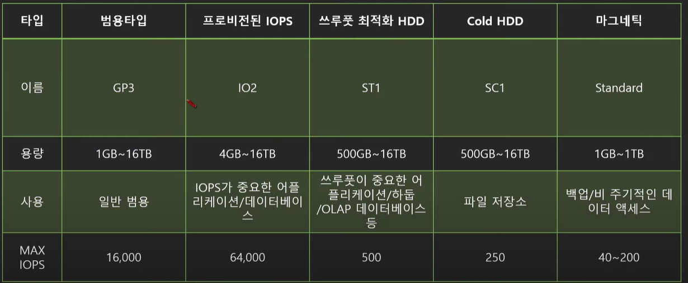

**EBS SnapShot**

- 특정 시간의 EBS 상태 저장본입니다.

- 필요 시 스냅샷을 통해 특정 시간의 EBS 를 복구할 수 있습니다.

- S3 에 보관되며, 증분식으로 저장됩니다. (변화한 부분만 저장)

  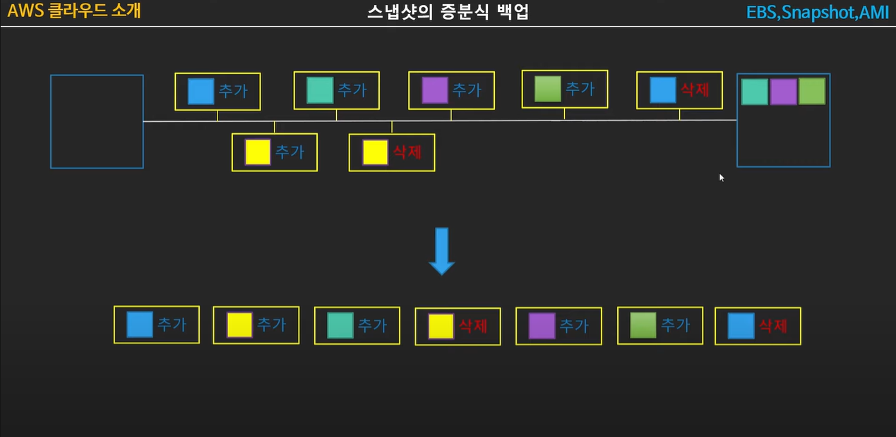


# AMI

AMI 는 EC2 인스턴스를 실행하기 위해 필요한 정보를 모은 단위입니다. 여기서 정보란 OS, 아키텍처 타입(32-bit or 64-bit), 저장공간 용량 등을 말합니다.

AMI 를 사용해 EC2 를 복제하거나 다른 리전 -> 계정으로 전달이 가능합니다. 스냅샷을 기반으로 AMI 구성이 가능합니다.

**구성**

- 1개 이상의 EBS 스냅샷
- 인스턴스 저장의 경우 루트 볼륨에 대한 텔플릿(OS, Application Server, Application 등)
- 사용 권한(어떤 계정이 사용할 수 있는지)
- 블록 디바이스 맵핑(EBS 가 무슨 용량으로 몇개 붙는지)


## EC2 생성 후 AMI 를 통해 복제하기

인스턴스가 생성되었다고 가정하겠습니다. 

- httpd 패키지가 설치되어있음
- index.html 파일을 생성하고 'hello world!' 출력

1. 인스턴스 이름에서 우클릭 후 '이미지 및 템플릿' -> '이미지 생성' 클릭

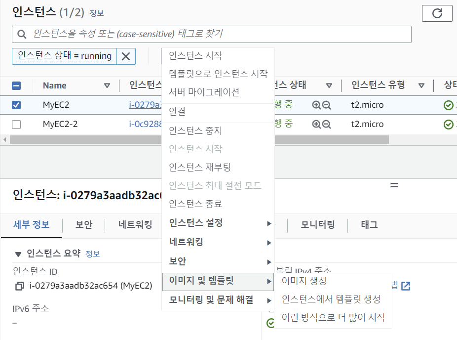

2. 이미지 이름을 임의로 생성하고 이미지 생성 버튼을 클릭합니다.

3. 다음과 같이 이미지 > AMI 탭에서 생성된 이미지 확인이 가능합니다. 해당 이미지가 바로 SnapShot 을 통한 복제본입니다.

   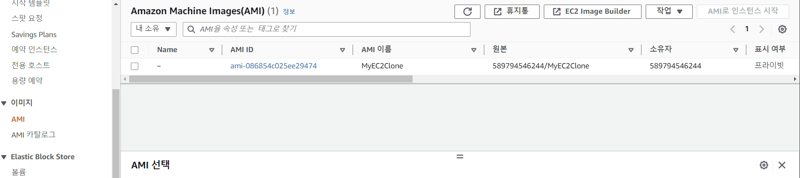

4. 해당 AMI ID 를 누르고 AMI 로 인스턴스 시작을 누릅니다.

   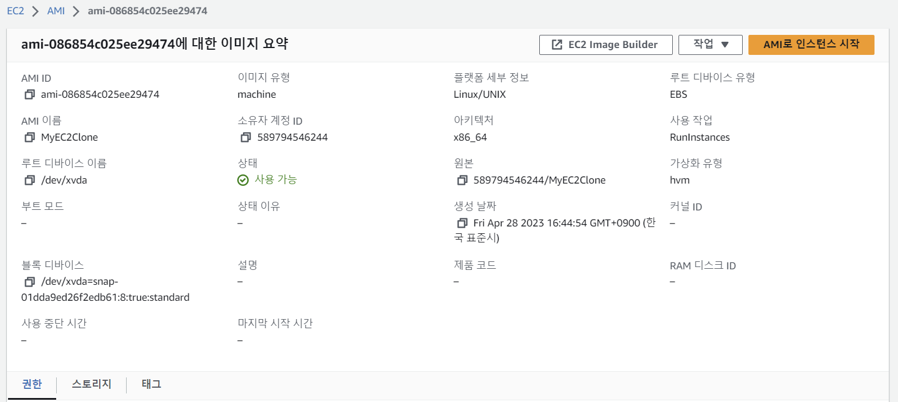

5. 인스턴스를 원본 인스턴스와 같이 생성합니다. 이름은 MyEC2-2 라고 하겠습니다.

   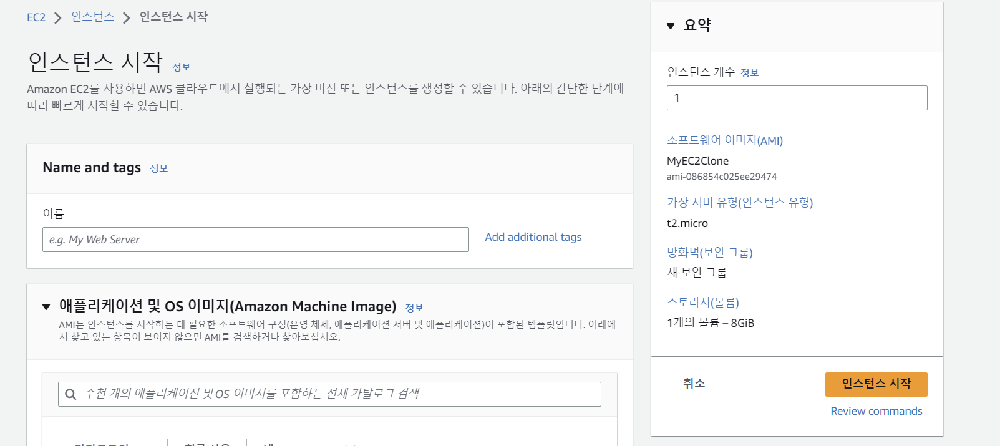

6. 다음과 같이 인스턴스가 생성된 것을 볼 수 있습니다.

   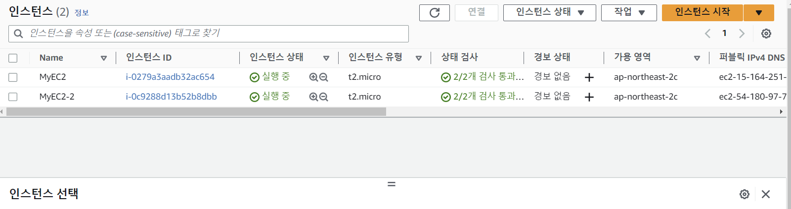

7. MyEC2-2 에 들어가서 연결을 하고, httpd 설치 없이 바로 `service httpd start` 를 실행해보면 잘 실행되는 걸 알 수 있습니다. 또한 index.html 파일도 있습니다.

   - 즉, httpd 를 설치하지 않고, index.html 파일을 만들지 않아도 복제를 통해 이미 만들어져있습니다.

   - 이러한 기능을 통해 로드밸런싱, 오토스케일링 등 많은 인스턴스를 사용할 때 잘 만들어놓은 인스턴스를 복제하여 계속 쓸 수 있습니다.

   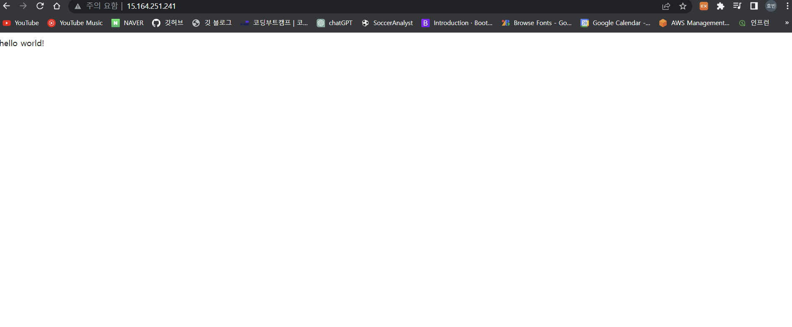


# EC2 Life Cycle

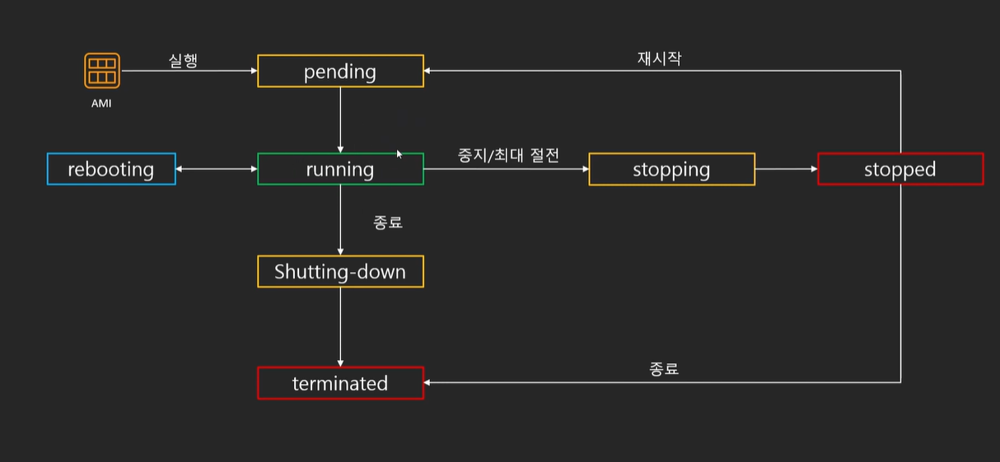

1. 중지
   - 중지 중에는 인스턴스 요금 미청구, 단 EBS, 다른 구성요소 (Elastic IP 등) 은 청구
   - 중지 후 재시작 시 퍼블릭 IP 변경
   - EBS 를 사용하는 인스턴스만 중지 가능(인스턴스 내에 저장하는 인스턴스는 중지 불가)
2. 재부팅
   - 재부팅 시 퍼블릭 IP 변경 없음
3. 최대 절전 모드
   - 메모리에 있는 내용을 하드디스크에 보관해서 다시 running 모드로 실행할 때 실행되고 있는 파일을 계속 쓸 수 있음

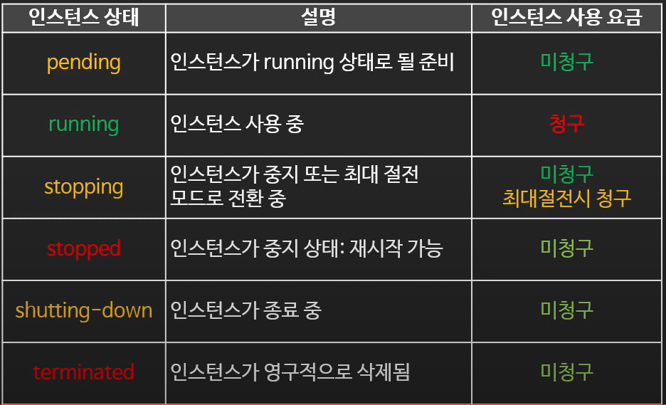


# EC2 Auto Scaling

AutoScaling 은 용량을 늘리는 Scaling 을 자동화시켜주는 기능입니다. EC2 AutoScaling 은 정확한 수의 인스턴스를 보유하도록 보장해주며, 다양한 스케일링 정책을 적용할 수 있습니다. (CPU 부하에 따라 인스턴스 크기를 늘리는 등) 또한 AZ 에 인스턴스가 골고루 분산될 수 있도록 합니다.

**AutoScaling 구성**

1. EC2 콘솔에서 시작탬플릿을 클릭하고 'create launch template' 버튼을 클릭합니다.

   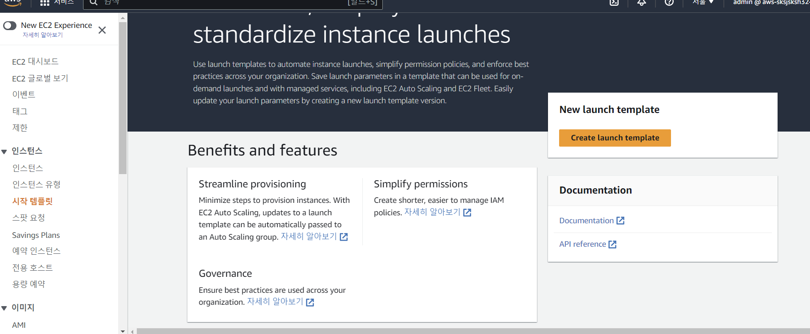

2. 먼저 임의의 이름과 설명을 입력합니다. `EC2 Auto Scaling에 사용할 수 있는 템플릿을 설정하는 데 도움이 되는 지침 제공` 체크 박스는 선택해야 합니다.

   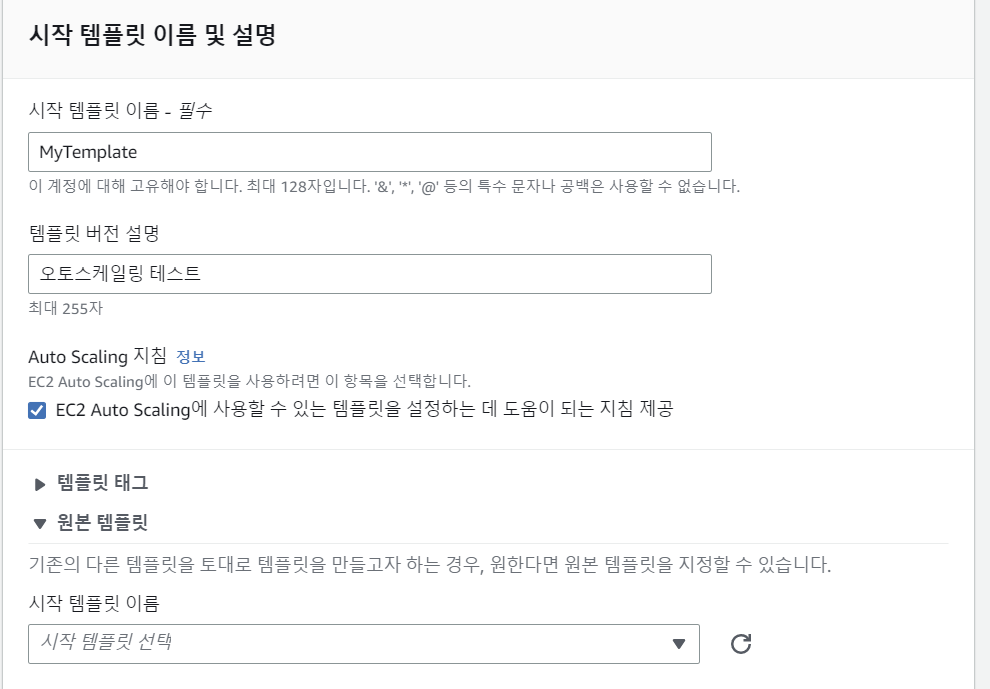

   

3. 시작 템플릿 콘텐츠에서 Linux 2 AMI 를 선택합니다. 저는 강의를 따라가기 위해 Linux 2023 AMI 대신 선택했으나 차이는 없을 것 같습니다.

   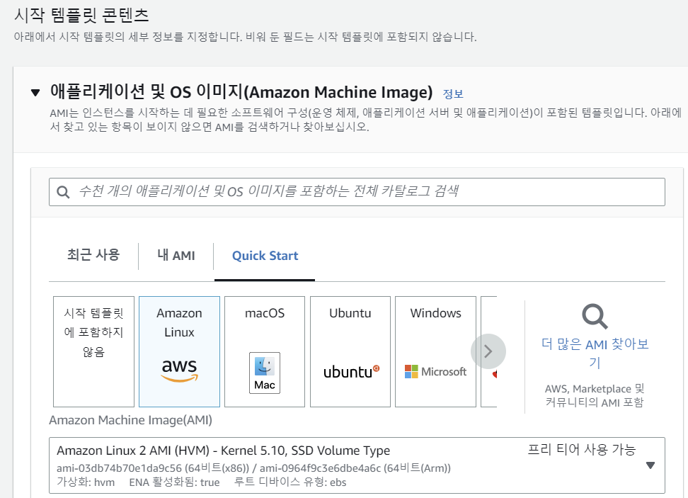

4. 인스턴스 유형은 t2.micro 로 설정하고 여기서는 키페어 설정은 하지 않겠습니다.

   

5. 네트워크 설정에서 보안그룹은 선택하지 않았습니다. 고급 네트워크 설정에서 퍼블릭 IP 자동할당 활성화, 종료 시 삭제 '예' 로 했고, 보안그룹은 default 로 했습니다. 이렇게 템플릿을 생성합니다.

   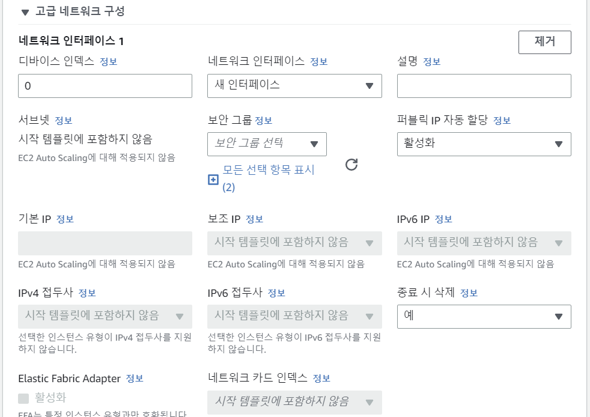

6. 이제 AutoScaling 구성입니다. 왼쪽 사이드바의 AutoScaling 그룹을 선택하고 'Auto Scaling 그룹 생성' 버튼을 누릅니다.

   

7. 임의의 이름과 함께 방금 만들어두었던 Template 을 넣습니다.

   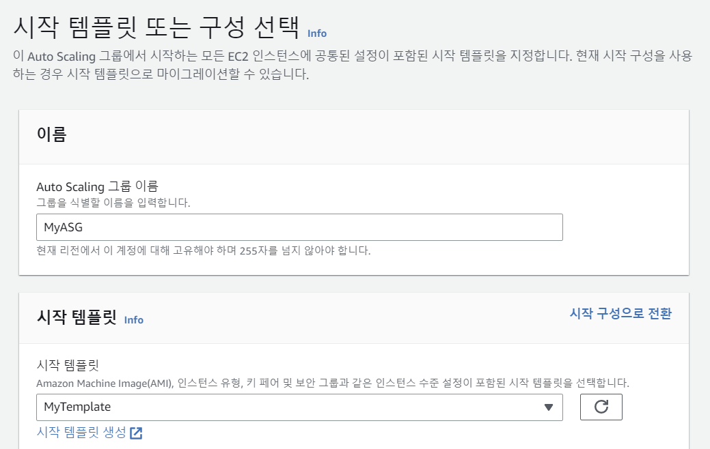

8. 2단계에서 VPC 는 그대로 두고, AZ 는 모든 영역을 선택해줍니다.

   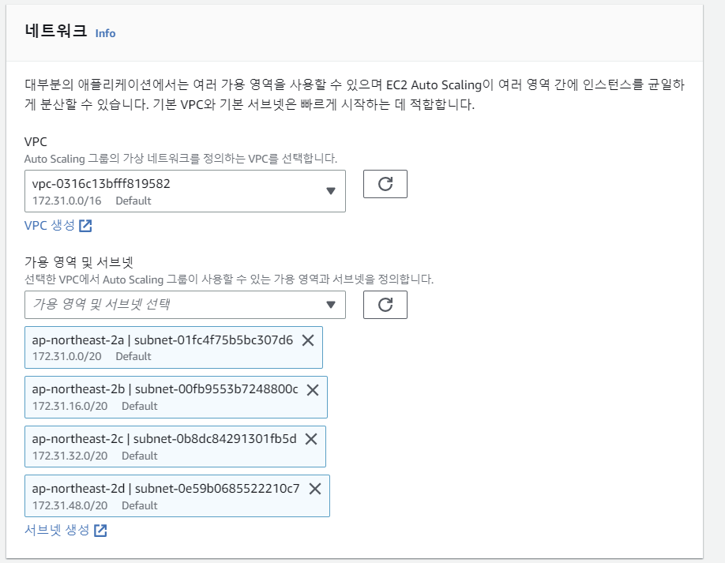

9. 3단계에서, 현재 로드밸런서가 없으므로 선택하지 않고 나머지는 default 값으로 두겠습니다.

   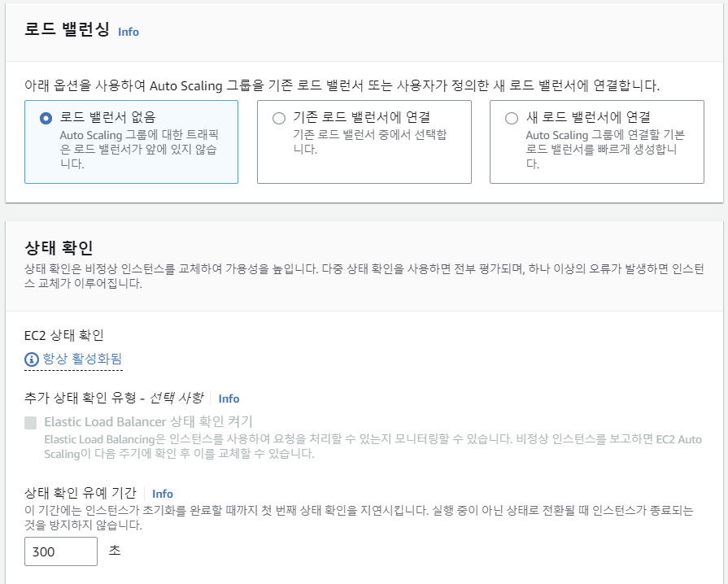

10. 4단계에서 autoScaling 의 용량과 크기 조정 정책을 선택합니다. 일단 크기 조정 정책은 설정안하는 걸로 하겠습니다.

    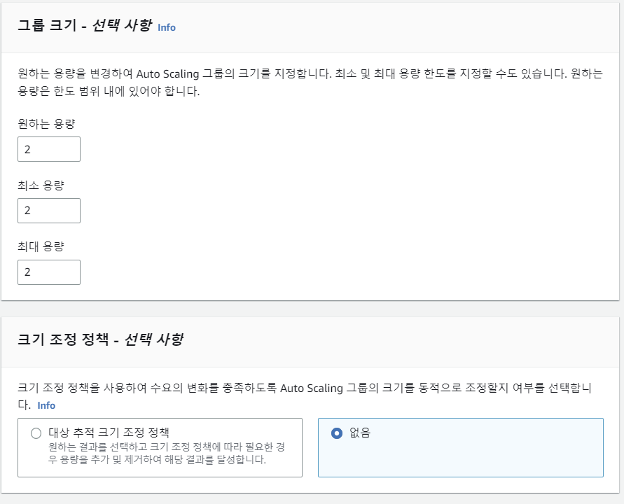

11. 5단계 알림은 스킵하겠습니다. 6단계에서 태그를 추가하면 인스턴스가 올라갈 때 태그가 자동으로 추가되게 됩니다.

    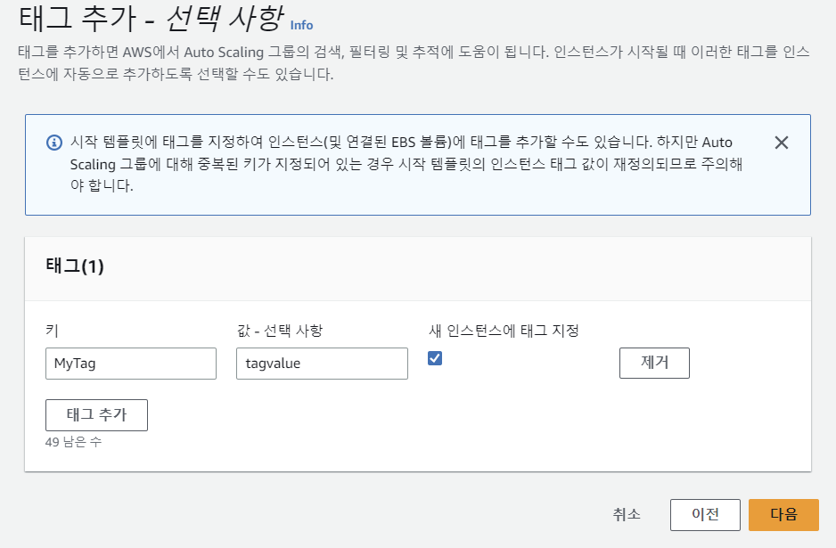

12. AutoScaling 을 생성하고 눌러보면 다음과 같이 '인스턴스 관리 탭'에서 생성된 인스턴스를 볼 수 있습니다. 최소 2개 인스턴스를 확보한다고 설정했으니 2개가 일단 생성되었습니다.

    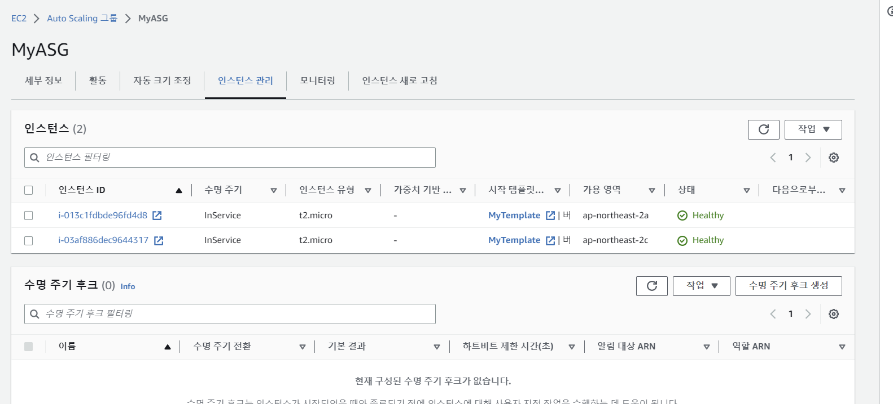

13. 다시 EC2 인스턴스로 돌아가보면, 방금 봤던 인스턴스가 등록된 걸 확인할 수 있습니다.

    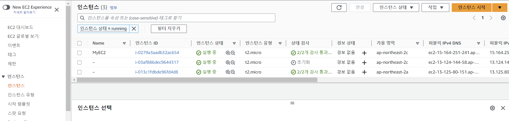

**AutoScaling 확인**

만약에 2개의 인스턴스 중 1개를 종료한다면 AutoScaling 에서 최소 인스턴스 개수를 맞추기 위해서 1개를 자동 생성할 것입니다. 1개를 종료해보겠습니다.

다음과 같이 AutoScaling 그룹에서 인스턴스 상태가 Unhealthy 로 감지됩니다.

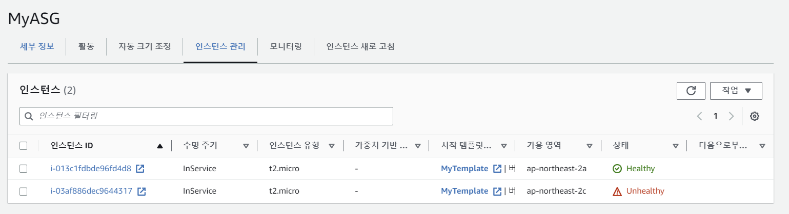

이렇게 되면 MyASG Autoscaling 그룹이 자동으로 인스턴스를 생성합니다. 다음 활동 탭에서 볼 수 있습니다.


인스턴스가 만들어졌습니다. Name 이 미부여된 인스턴스가 AutoScaling 으로 만들어진 인스턴스입니다.

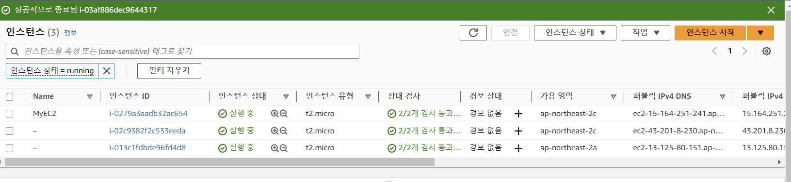

**AutoScaling 인스턴스 개수 변경**

아래와 같이 편집을 누른 후 원하는 용량, 최소 용량을 1개로 변경해줍니다.

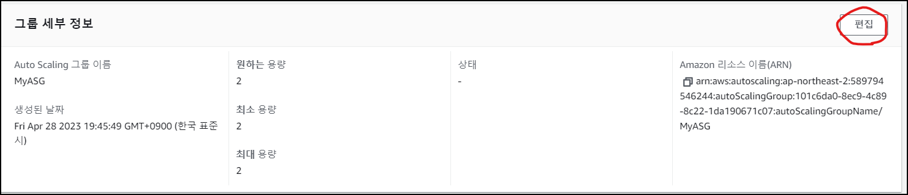

- 수정을 하면 인스턴스가 1개 줄어들게 됩니다.
- 원하는 용량이 무조건 맞춰지지는 않습니다. 인스턴스가 부족할 수도 있구요.

***\* 실습이 끝난 후 autoScaling 개수를 0 으로 설정해줍니다 (요금 관련)***


# ELB(Elastic Load Balancing)

ELB 는 어플리케이션의 부하를 줄여주기 위해 들어오는 트래픽을 여러 인스턴스 대상으로 자동 분산시켜주는 서비스입니다. 

**특징**

-  Health Check : 직접 트래픽을 발생시켜 Instance 가 살아있는지 체크
-  AutoScaling 과 연동 가능
- 여러 AZ 에 분산 가능
- 지속적으로 IP 주소가 바뀌며 IP 고정 불가능 -> **따라서 항상 도메인 기반으로 사용**

**종류**

- ALB(Application Load Balancer) : 트래픽을 모니터링하여 라우팅 가능
- NLB(Network Load Balancer) : TCP 기반으로 빠른 트래픽 분산, Elastic IP 할당 가능
- CLB(Classic  Load Balancer) : 예전 기술
- GLB(Gateway Load Banlancer) : 트래픽을 먼저 확인하는 LB

**대상그룹**

ALB 가 라우팅할 대상의 집합을 말합니다. Instance, IP, Lambda 혹은 다른 ALB 까지 대상그룹으로 지정이 가능합니다.

다음과 같이 도메인에 따라 대상 그룹으로 라우팅을 가능하게 합니다.

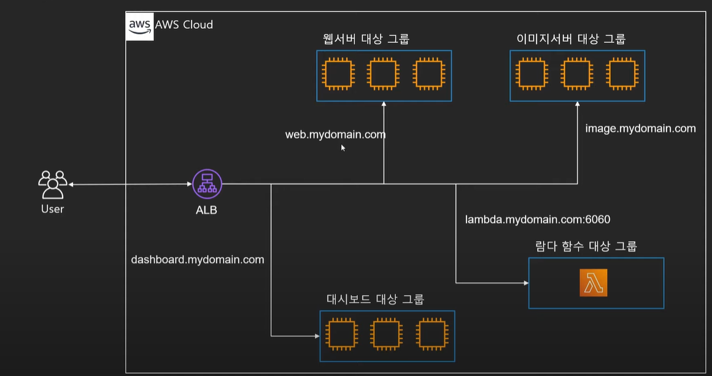

## ELB 만들기1 : 템플릿 & Auto Scaling Group 편집

1. 먼저 템플릿을 수정합니다. MyTemplate 에 들어가서 템플릿 수정 버튼을 클릭합니다.

   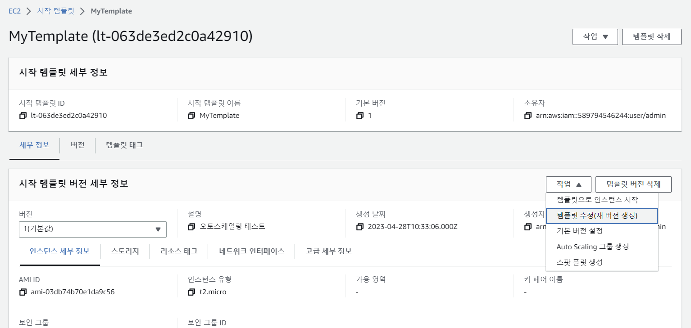

2. 고급 세부 정보에서 다음과 같이 넣어준 후 템플릿 생성을 합니다. (버전이 2 로 나옵니다.)

   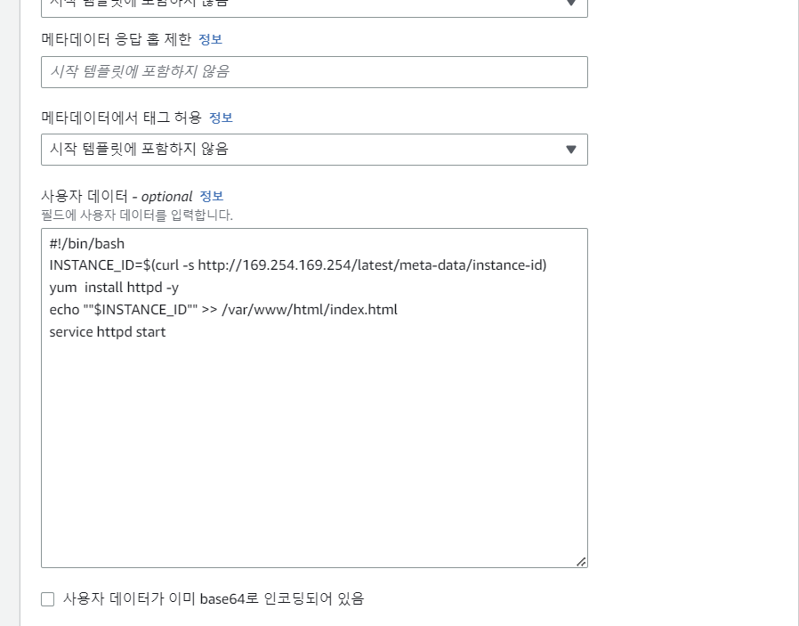

   - ```
     #!/bin/bash
     INSTANCE_ID=$(curl -s http://169.254.169.254/latest/meta-data/instance-id)
     yum install httpd -y
     echo ""$INSTANCE_ID"" >> /var/www/html/index.html
     service httpd start
     ```

   - 해당 인스턴스의 서버가 시작되면 수행할 명령입니다. httpd 를 설치하고 `index.html` 에 instance 의 id 값을 넣어준 후 `service httpd start` 로 실행합니다.

3. 다시 'Auto Scaling 그룹'에서 만들어 둔 MyASG 를 들어가면 세부 정보 탭에서 시작 템플릿을 편집할 수 있습니다.

   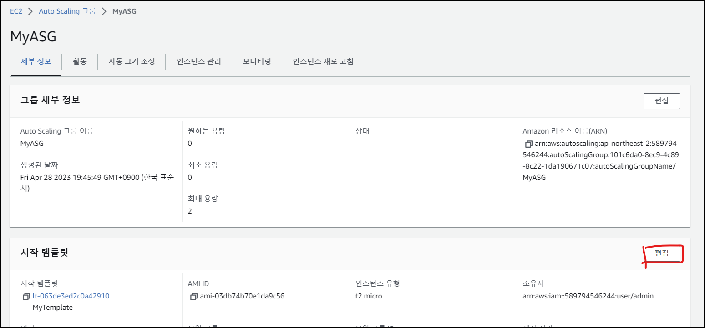

4. 편집 창에서 버전을 Lastest(2) 로 변경하고 주황색 업데이트 버튼을 누릅니다.

   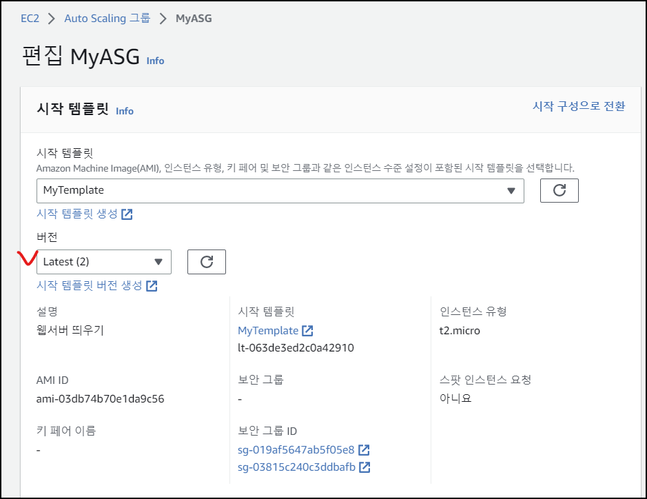

5. AutoScaling 그룹의 그룹 세부정보를 편집하여 줄여둔 그룹 크기를 다시 2 로 늘려줍니다.

   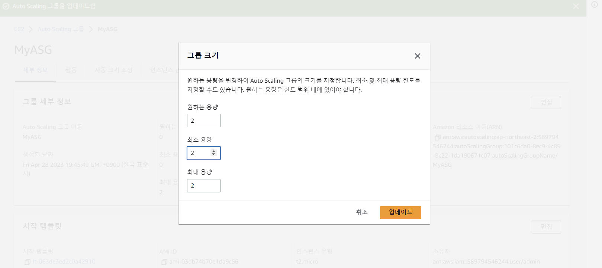

   - 인스턴스 2개가 자동으로 생성됩니다.
   - 이전 AutoScaling 에서는 빈 인스턴스가 생성되었다면, 지금은 설정해둔 것처럼 index.html 에 instance 의 Id 가 들어가게 됩니다.

6. 다음과 같이 instance 의 ip 로 접속하면 설정한대로 instance 의 id 값이 index 에 나타납니다. 나머지 1개도 똑같습니다.

   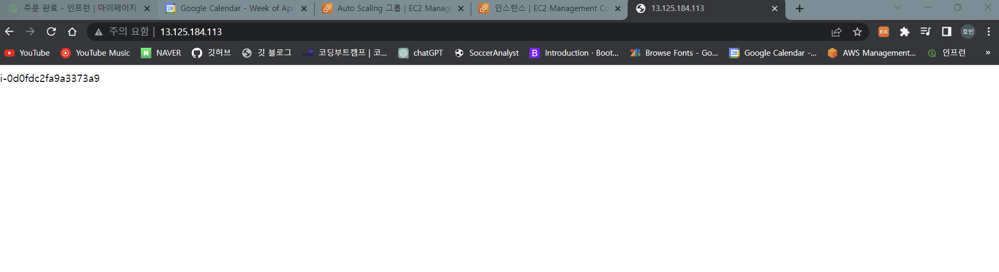

## ELB 만들기2 : 대상그룹 만들기

<u>***\* 아래 사진은 설정을 잘못 눌러서 예전 UI 로 되었습니다. 하지만 내용은 똑같습니다.***</u>

1. 로드 밸런싱의 대상 그룹 페이지에서 '대상 그룹 생성' 을 누릅니다.

   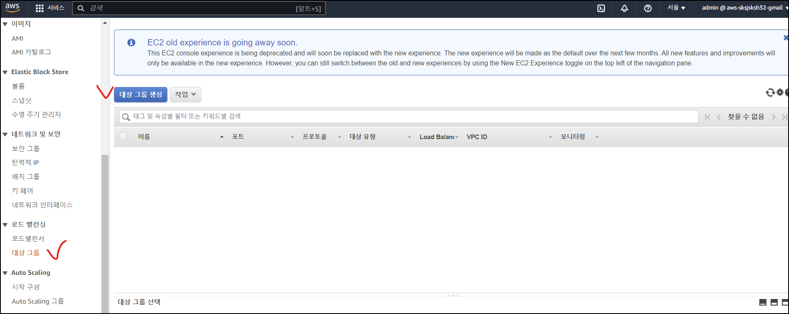

2. 다음과 같이 입력 후 생성버튼을 누릅니다.

   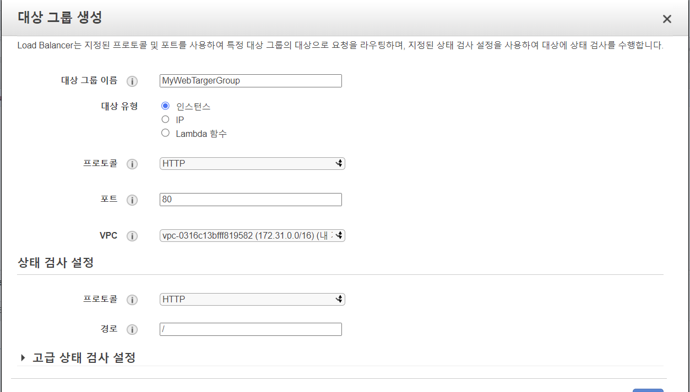

   - 동영상 강의에서는 여기서 인스턴스를 추가하던데, 업데이트되었나봅니다. 다음 단계에서 대상 인스턴스를 등록하겠습니다.

3. 대상 그룹이 생성되었다면 해당 그룹의 이름을 누르고 아래의 대상 > 편집 버튼을 누릅니다.

   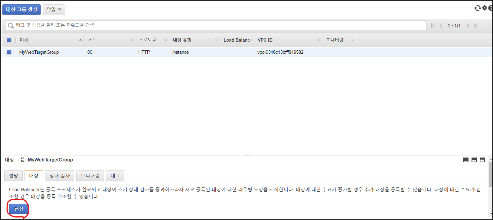

4. 다음과 같이 등록할 인스턴스를 체크한 뒤 '등록된 항목에 추가' 를 누릅니다. 그리고 '저장' 버튼을 눌러 등록합니다.

   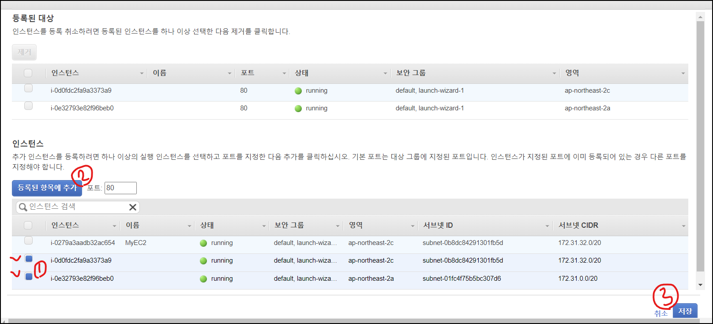

## ELB 만들기3 : ELB-ALB 만들기

<u>***\* 아래 사진은 설정을 잘못 눌러서 예전 UI 로 되었습니다. 하지만 내용은 똑같습니다.***</u>

1. 로드 밸런서 페이지에서 '로드밸런서 생성' 버튼을 누릅니다. 이후 나오는 페이지에서 ELB 유형은 Application Load Balancer 를 선택합니다.

   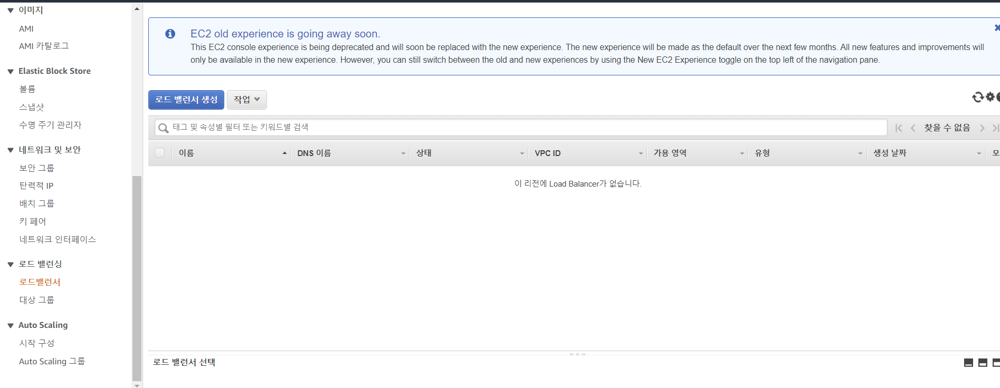

2. 1단계입니다. 이름 설정 외 모두 default 값입니다. AZ 는 4개 모두 선택했습니다.

   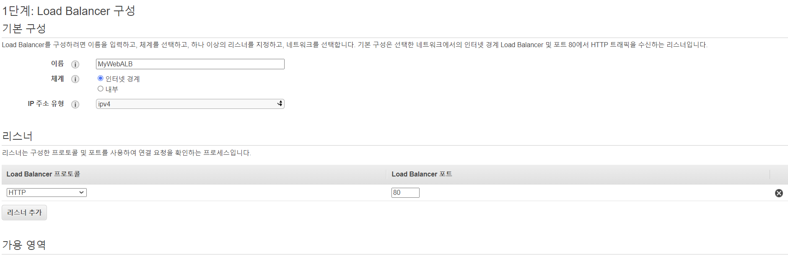

   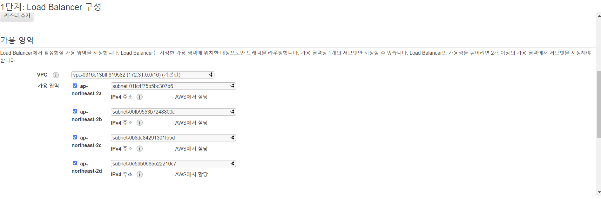

3. 2단계는 현재 HTTPS 를 사용하지 않으므로 건너뜁니다.

4. 3단계에서 보안그룹은 사용하던 값을 계속 사용하겠습니다.

   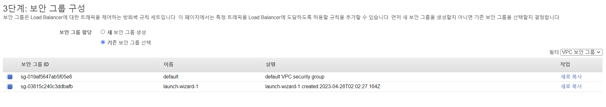

5. 4단계에서 대상그룹은 '기존대상그룹' 으로 선택합니다. 대상그룹이 'MyWebTargetGroup' 1개밖에 없으므로 자동선택됩니다. 

   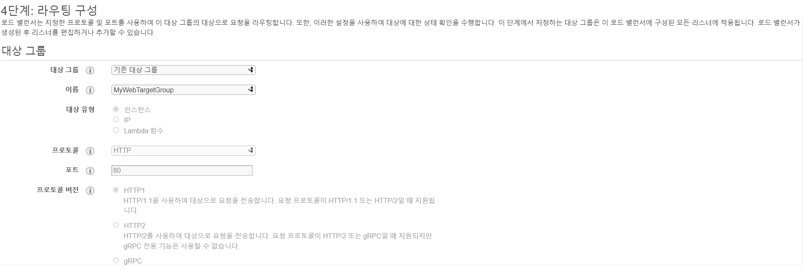

6. 5, 6단계에서는 설정할 게 없습니다. 생성 후 LoadBalancer 가 프로비저닝 중 -> 활성 으로 변경되면 다음 단계를 진행합니다.

## ELB 확인

만들어진 load balancer 를 클릭하면 다음과 같이 DNS name 을 볼 수 있습니다.


해당 DNS name 으로 접속해보겠습니다. 여러 번 새로고침을 하면 다음과 같은 페이지가 반복됩니다.


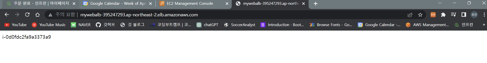

EC2 인스턴스 2개가 반복되면서 호출되는 것을 알 수 있습니다. 즉, load balancer 가 두 인스턴스를 번갈아가면서 호출하고 있습니다.

## ELB 와 Auto Scaling 연결

1. Auto Scaling Group 에서 만들어진 그룹의 세부정보 탭을 들어갑니다. 로드 밸런싱 메뉴에서 편집을 누릅니다.

   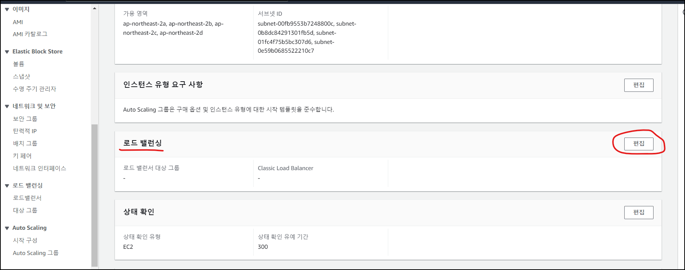

2. 다음과 같이 첫번째 체크박스를 누른 뒤 Load Balancer 를 선택해주고 업데이트를 누릅니다.

   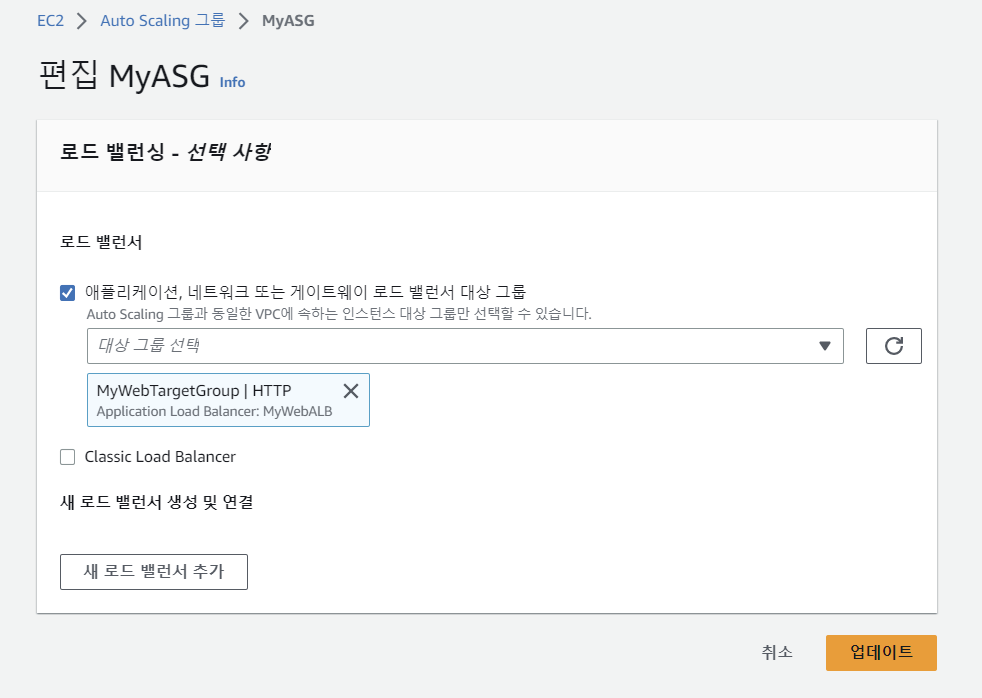

이제부터 Auto Scaling Group 에서 생성되는 인스턴스는 모두 target Group 에 들어가게 됩니다. 원하는 용량을 3개로 늘려서 테스트해봅시다. 다음과 같이 인스턴스가 3개 연결되는 것을 확인할 수 있습니다. (제일 위에꺼는 아닙니다.)

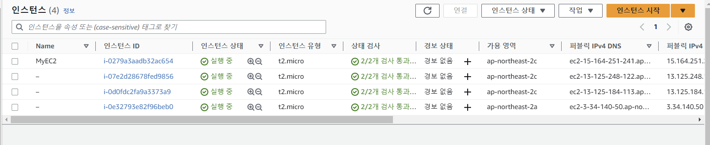

DNS 로 호출해보면 다음 인스턴스도 추가되었음을 알 수 있습니다.

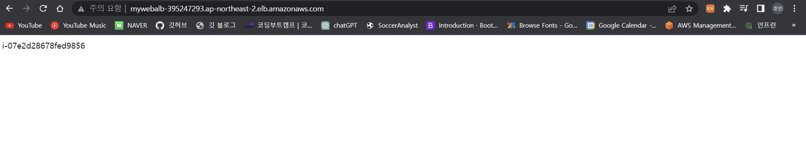

## 문제 상황 (EC2 내 서버가 죽었을 때)

다음과 같은 문제 상황이 있습니다.

1. 인스턴스 3개 중 1개의 EC2 내 서버가 다운되었습니다.
2. 하지만 EC2 자체는 활성화되어있으므로  Auto Scaling 에서는 정상적으로 보입니다.
3. 따라서 Load Balancer 에 연결된 인스턴스 3개 중 1개는 다운된 서버로 연결됩니다.

위와 같은 상황일 때 어떻게 되는지 한번 살펴보겠습니다.

1. 먼저 3개의 인스턴스 중 서버 1개를 stop 하겠습니다.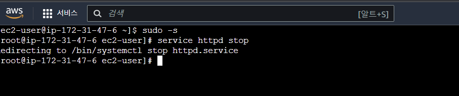

   - 이렇게 해도 EC2 인스턴스 자체가 중지되는 게 아니므로 Auto Scaling 은 정상작동합니다.

2. 하지만 Load Balancer DNS 로 연결하면 이제 2개의 인스턴스만 번갈아가며 호출합니다.

   - 원래 강의에서는 1개가 503 에러가 떳었는데요. 1년반된 강의라 AWS 가 변경되었나봅니다.

   - 다음과 같이 Target Group 에서 해당 인스턴스를 'unhealty' 상태로 감지합니다.

     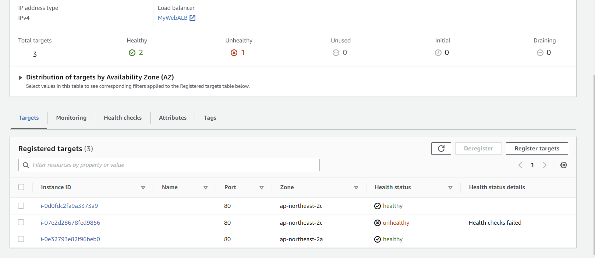

3. 하지만 원하는 인스턴스 개수는 3개이므로 Auto Scaling 으로 들어가서 MyASG 를 클릭한 후 '세부정보' > '상태확인' 으로 들어가서 편집 버튼을 누릅니다.

   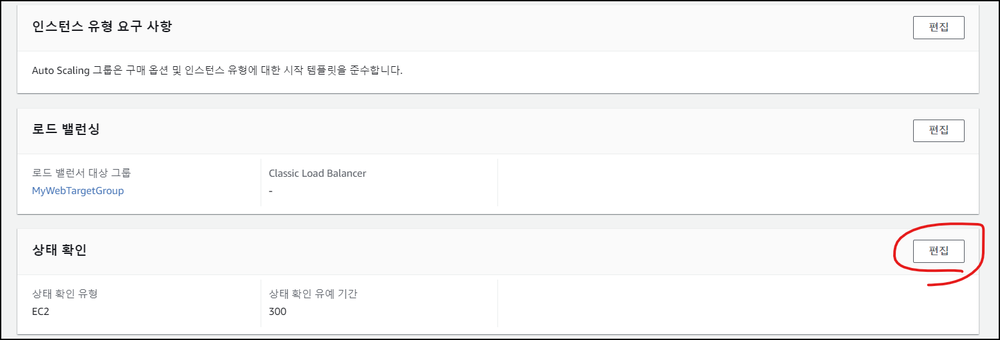

4. ELB 에도 체크를 해서 ELB 상태가 'unhealthy' 라면 인스턴스를 새로 구성하도록 만듭니다.

   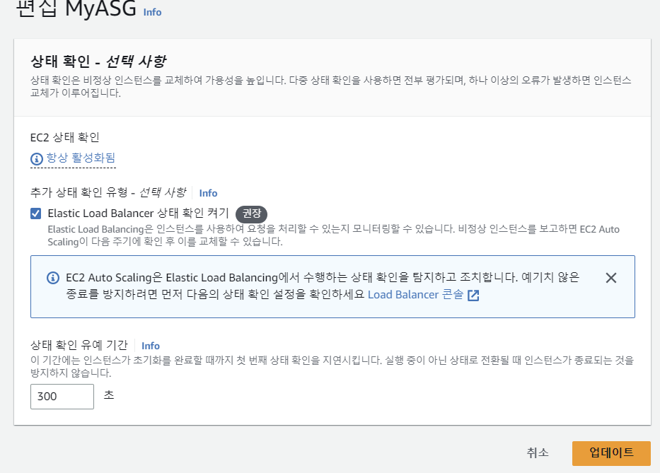

5. 다음과 같이 AutoScaling 에서도 'unhealthy' 가 뜨게 됩니다. (시간을 좀 기다리셔야 합니다.)

   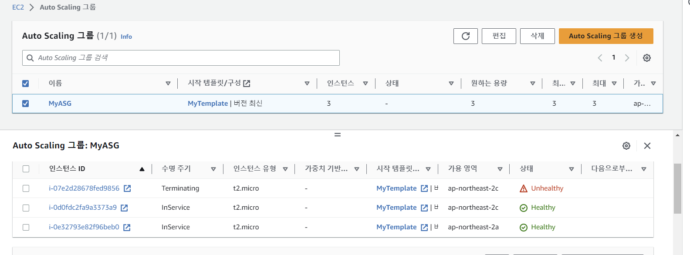

   - 추가로 설명하자면, healthy 체크는 다음과 같이 Target Group 에서 합니다. 30초 간격으로 2 연속 상태 검사에 실패 했을 때 unhealthy 상태로 변경합니다.
   - 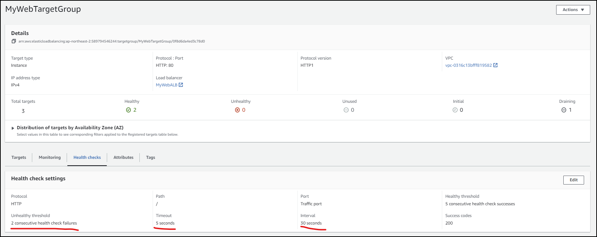

6. 시간이 좀 더 지나면, 다음과 같이 Auto Scaling Groups > ASG 의 인스턴스를 확인해보면 추가된 것을 확인할 수 있습니다. 저는 성격이 급해서 계속 새로고침했는데, 느긋하게 기다리는 걸 추천합니다.

   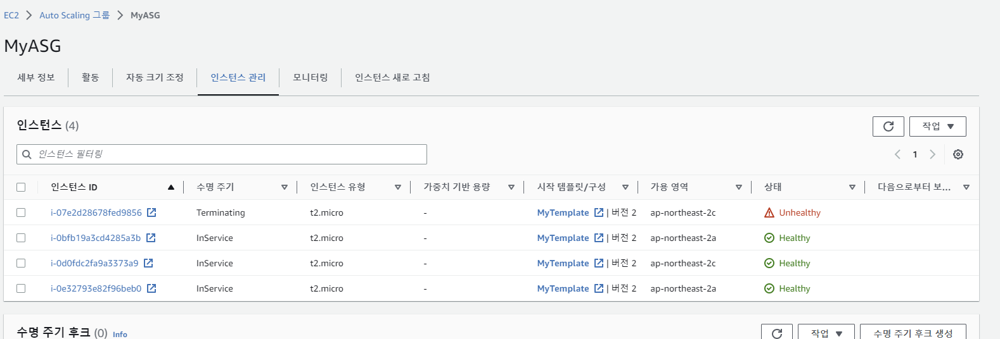

7. 다음과 같은 인스턴스가 로드 밸런서에 추가되었습니다. DNS name 으로 잘 됩니다.

   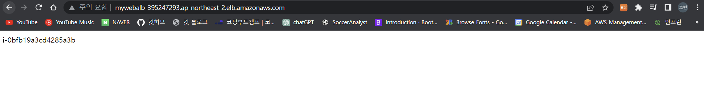


# EFS (Elastic File System)

EFS 는 탄력적인 serverless 파일 스토리지를 제공합니다. 스토리지 용량 및 성능을 프로비저닝하거나 관리하지 않고도 파일 데이터를 공유할 수 있습니다.

EFS 는 EC2 , Lambda 같은 여러 컴퓨팅 인스턴스가 동시에 액세스할 수 있습니다. 반면 EBS 는 1개의 인스턴스에서만 엑세스 할 수 있다는 차이가 있습니다. 또한 EBS 는 미리 크기를 정해야 하지만 EFS 는 탄력적입니다.

**특징**

- NFS 기반의 공유 스토리지 서비스로 용량이 탄력적입니다.
- Linux Only 입니다. (FSx 는 EFS 의 윈도우 버전)
- 몇 천개의 동시 접속 유지가 가능합니다.
- 데이터는 여러 AZ 에 나누어 분산 저장됩니다.
- 쓰기 후 읽기(Read After Write) 일관성 : 한 인스턴스에서 쓰자마자 다른 인스턴스에서 바로 읽을 수 있습니다.
- Private Service 로 AWS 외부에서 접속이 불가능합니다.
- 각 AZ 에 Mount Target 을 두고 각각의 AZ 에서 해당 Mount Target 으로 접근해서 EFS 에 접근하게 됩니다.
  - 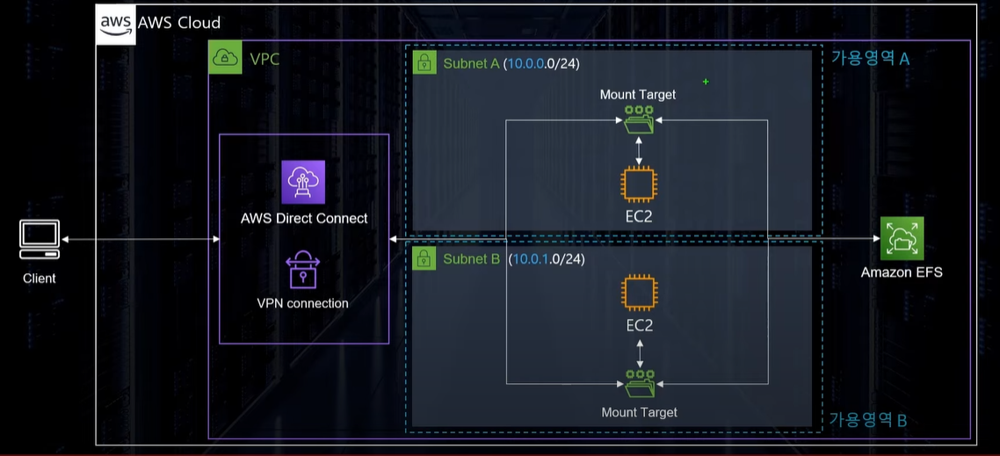
  - 위 그림과 같이 각 AZ 안에 Mount Target 이 있고, EC2 는 이 Mount Target 에 접근하므로써 EFS 에 접근하게 됩니다.
  - 또한 Client 는 AWS Direct Connect 나 VPN connection 이 있어야만 EFS 와 연결될 수 있습니다.

**EFS 모드**

- EFS performance 모드(성능 모드)
  - **General Purpose**(가장 보편적, 대부분 사용)
  - Max IO (높은 IOPS 필요 시)

- EFS Throughput 모드(처리량 모드)
  - **Elastic Throughput** : 탄력적인 Throughput 을 제공
  - Bursting Throughput : 낮은 ThroughPut 일 때 크레딧을 모아서 높은 Throughtput 일 때 사용
  - Provisioned Throughtput : 미리 지정한 만큼의 Throughput 을 미리 확보해두고 사용

**EFS 스토리지 클래스**

- **EFS Standard** : 3개 이상의 AZ 에 보관 (가장 많이 사용)
- EFS Standard-IA : 3개 이상의 AZ 에 보관, 조금 저렴한 대신 데이터를 가져올 떄 비용 발생
- EFS One Zone : 하나의 AZ 에 보관 -> 저장된 가용영역의 상황에 영향을 받을 수 있음

## EFS 만들기

다음과 같이 EFS 를 구성해보겠습니다.

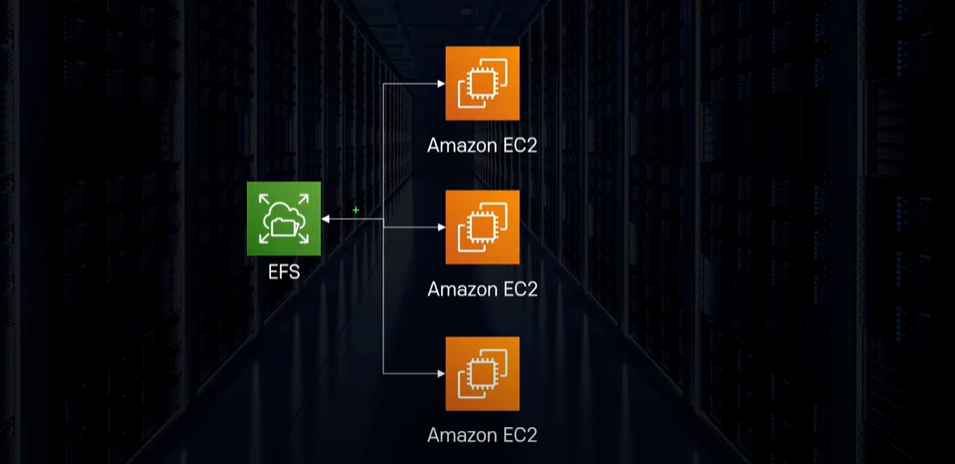

1. 먼저 보안그룹을 생성합니다. 다음과 같이 인바운드 규칙에 모든 TCP 를 넣습니다. 이름은 임의로 설정해주세요.

   

2. EFS 페이지에 들어가서 파일 시스템 생성 버튼을 클릭합니다.

   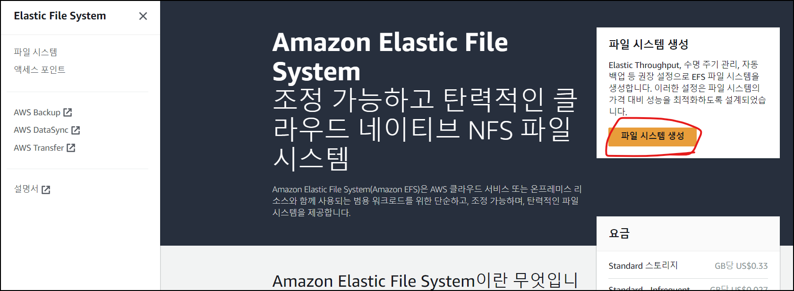

3. 다음과 같이 EFS 를 설정하고 생성해줍니다.

   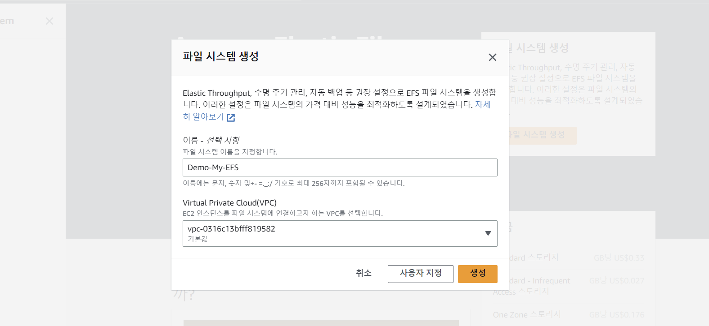

   - 스토리지 클래스는 자동으로 Standard 로 만들어집니다.
   - Performance Mode 는 자동으로 General Purpose 로 설정됩니다.
   - Throughput Mode 는 자동으로 Elastic Throughput 으로 설정됩니다.
   - 설정을 변경하려면 사용자 지정을 누르면 됩니다.

4. 생성된 EFS 를 눌러보면 네트워크 탭에서 다음과 같이 각 AZ 의 Mount Target 을 확인할 수 있습니다. 

   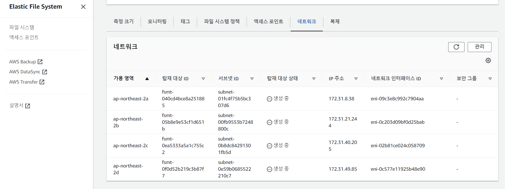

   - '탑재 대상 상태' 가 사용 가능으로 변경되면 '보안 그룹' 에 default 보안 그룹이 들어갑니다.
   - 이 그룹을 생성했던 'Demo-EFS-SG'  으로 변경해주겠습니다. 사진 속 우상단의 관리탭을 눌러주세요.

5. 여기서 보안 그룹을 만들어두었던 그룹으로 변경한 뒤 '저장'을 누르겠습니다.

   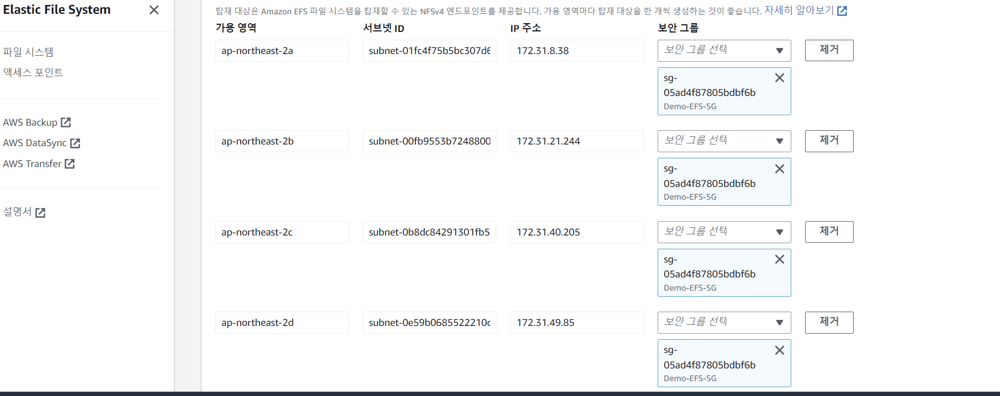

   - 이제 EFS 를 사용할 준비가 완료되었습니다.

6. 이제부터 EC2 를 만듭니다. 보안그룹은 만들었던 'Demo-EFS-SG' 를 사용하고, 인스턴스 개수는 3개를 만들겠습니다. (**실습 이후 바로 삭제해야 합니다.**)

   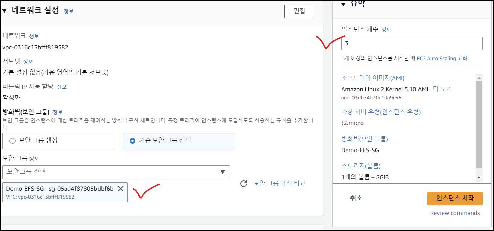

   - 이름은 임의로 설정해주세요 (Demo-EC2-EFS 등)
   - Amazon Linux 2 AMD 사용, t2.micro 인스턴스 사용, 키페어 없음 설정

7. 고급 세부 정보에서 다음과 같이 입력합니다. (사진은 짤렸습니다.)

   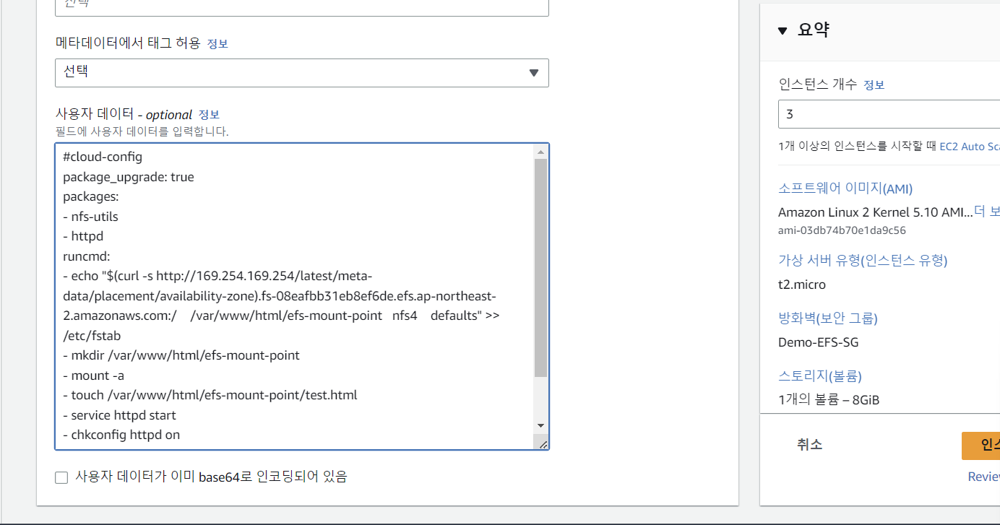

   - ```yml
     #cloud-config
     package_upgrade: true
     packages:
     - nfs-utils
     - httpd
     runcmd:
     - echo "$(curl -s http://169.254.169.254/latest/meta-data/placement/availability-zone).[efs-id].efs.ap-northeast-2.amazonaws.com:/    /var/www/html/efs-mount-point   nfs4    defaults" >> /etc/fstab
     - mkdir /var/www/html/efs-mount-point
     - mount -a
     - touch /var/www/html/efs-mount-point/test.html
     - service httpd start
     - chkconfig httpd on
     - mkdir /var/www/html/efs-mount-point/sampledir
     - chown ec2-user /var/www/html/efs-mount-point/sampledir
     - chmod -R o+r /var/www/html/efs-mount-point/sampledir
     ```

   - 여기서 중간에 있는 `[efs-id]` 는 만든 efs 의 id 로 변경해줘야 합니다.

     1. nfs-utils, httpd 패키지 설치 (`packages`)
     2. EC2 가 위치한 AZ 의 Mount Point 를 검색한 후 검색한 주소를 default 로 mount 할 수 있도록 설정 (`echo`)
     3. `efs-mount-point` dir 를 만든 후 해당 mount point 에 mount (`mount -a`)
     4. httpd 시작, `sampledir` 을 만든 후 권한 설정
     5. **각각의 EC2 에 있는 `sampledir` 가 EFS 를 바라보고 있음**

   - EFS 콘솔에서 확인할 수 있습니다.

     

   - 다 완료되었으면 인스턴스 시작을 눌러줍니다.

## EFS 확인

3개의 인스턴스 중 특정 인스턴스에서 EFS 에 파일을 저장한다면, 다른 두 인스턴스에서도 해당 파일을 읽을 수 있는지 확인해보겠습니다.

1. 3개의 EC2 중 아무 인스턴스에 들어가서 `/var/www/html/efs-mount-point/sampledir` 에 index.html 파일을 만들어주겠습니다.

   

2. 이후 해당 인스턴스의 경로로 들어갑니다. EC2 의 ip 가 `3.35.8.207` 이므로 `http://3.35.8.207/efs-mount-point/sampledir/index.html` 으로 들어가봅니다.

   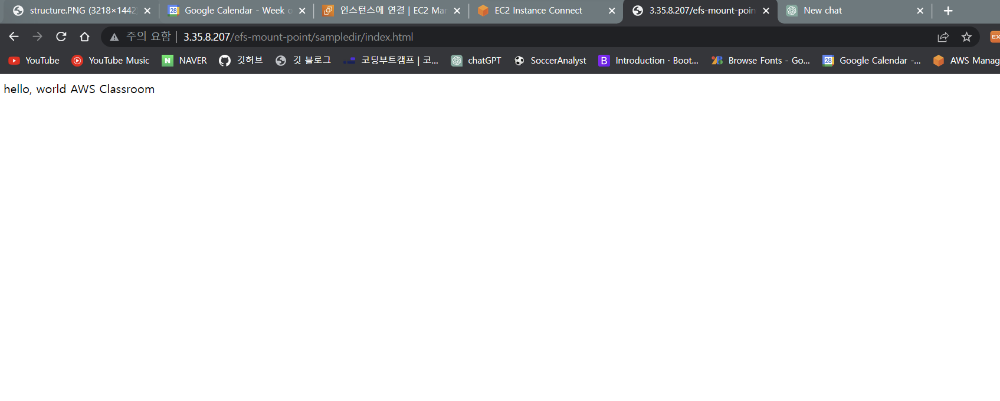

3. `sampledir` 은 EFS 를 가리키므로, 하나의 인스턴스에 저장하면 다른 인스턴스에도 공유되어야 합니다. 즉, 다른 IP 로 호출하더라도 같은 페이지를 렌더링해야 합니다.

   - 두번째 인스턴스 : `http://13.209.40.60/efs-mount-point/sampledir/index.html`

     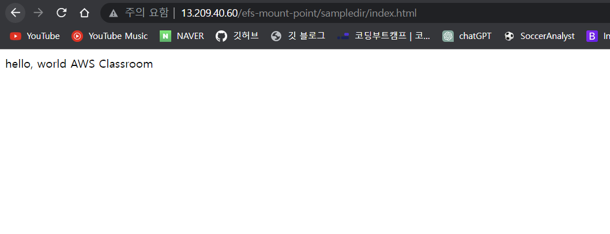

   - 세번째 인스턴스 : `http://13.209.68.168/efs-mount-point/sampledir/index.html`

     

   - 모두 잘 동작하는 걸 확인할 수 있습니다.

<u>**확인이 완료되었으면 EFS 와 EC2 를 모두 종료해줍시다.**</u>

\* EC2 종료 확인 후 EFS 를 종료해야합니다.
