포스팅 내용은 [쉽게 설명하는 aws 기초 강좌](https://www.youtube.com/playlist?list=PLfth0bK2MgIan-SzGpHIbfnCnjj583K2m) 를 보면서 필요한 내용을 정리하였습니다.

# VPC(Virtual Private Could)

VPC 는 사용자의 AWS 계정 전용 가상 네트워크입니다. VPC 는 AWS 클라우드에서 다른 가상 네트워크와 논리적으로 분리되어 있습니다. EC2 인스턴스, RDS, Lambda 와 같은 AWS 리소스를 VPC 에서 실행할 수 있습니다. 즉, VPC 는 **가상으로 존재하는 데이터센터**라고 할 수 있습니다.

간단하게 VPC 를 그려보면 다음과 같습니다.
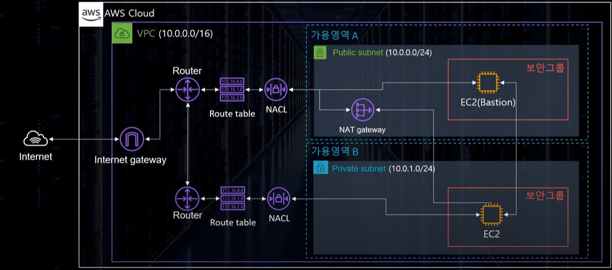

## VPC 구성요소

### Subnet

서브넷은 public, private 으로 구분됩니다.

**Public Subnet** : 외부에서 인터넷을 통해 연결할 수 있는 서브넷

- Internet Gateway(IGW) 를 통해 외부 인터넷과 연결되어 있습니다.
- 안에 위치한 인스턴스에 public IP 부여가 가능합니다.
- 웹서버, 어플리케이션 서버 등 유저에게 노출되어야 하는 인프라에 사용합니다.

**Private Subnet** : 외부에서 인터넷을 통해 연결할 수 없는 서브넷

- 외부 인터넷으로의 경로가 없습니다.
- public IP 부여가 불가능합니다.
- DB, Logic Server 등 외부에 노출 될 필요가 없는 인프라에 사용합니다.

**서브넷의 특징**은 아래와 같습니다.

- VPC 에 할당된 IP 를 더 작은 단위로 분할한 개념
- **하나의 서브넷은 하나의 AZ 안에 위치** (하나의 AZ 안에는 여러 Subnet 이 있을 수 있습니다.)
- CIDR block range 로 IP 주소 지정
- AWS 의 서브넷 IP 개수는 사용가능 IP 숫자에서 5개를 제외하고 계산
  - 예를 들어 10.0.0.0/24 라면 (총 256개 중 251개 사용 가능)
  - 10.0.0.0 : network address
  - 10.0.0.1 : VPC Router
  - 10.0.0.2 : DNS Server
  - 10.0.0.3 : 미래 사용을 위해 남겨 둠
  - 10.0.0.255 : network broadcast address (단, broadcast 는 지원하지 않음)

### Route Table

트래픽이 어디로 가야할지 알려주는 역할입니다.

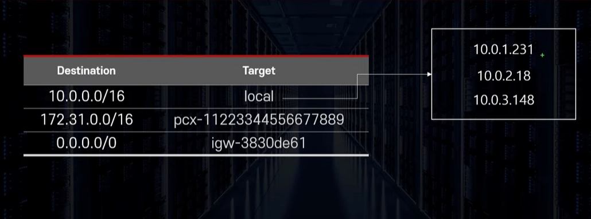

다음과 같이 IP 주소가 주어질 때 route table 을 참고하여 어디로 갈지 확인합니다. 위 예제에서는 local 로 트래픽을 보내게 됩니다.

### Internet Gateway

VPC 가 외부의 인터넷과 통신할 수 있도록 경로를 만들어주는 리소스입니다. 기본적으로 확장성과 고가용성이 확보되어 있습니다.

IPv4 와 IPv6 를 지원하며, IPv4 의 경우 NAT 역할을 수행합니다.

Route Table 에서 경로를 설정한 후에 접근이 가능합니다.

### Security Group

NACL(Network Access Control List) 와 함께 방화벽의 역할을 하는 서비스입니다.

Security Group 은 Port 를 허용 하는 기능을 가집니다. 기본적으로 모든 포트는 비활성화되어 있으며 선택적으로 트래픽이 지나갈 수 있는 Port 와 Source 설정이 가능합니다. 단, Deny 는 불가능합니다. Deny 는 NACL 로 설정 가능합니다.

SG 는 인스턴스 단위로, 하나의 인스턴스에 하나 이상의 SG 설정이 가능합니다. 설정된 인스턴스는 설정한 모든 SG 의 룰을 적용받습니다. (기본 5개, 최대 16개 설정 가)

**SG 는 Stateful 입니다.** 다음 그림을 보겠습니다.

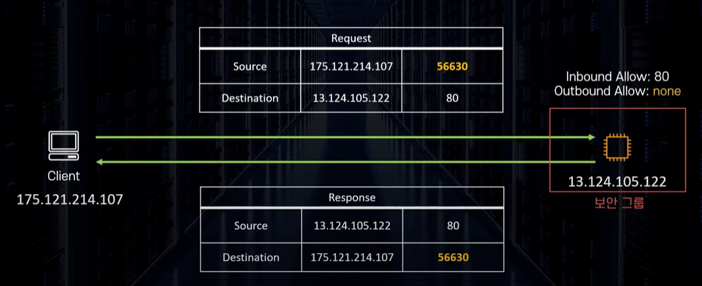

- Client 에서 server 로 56630 임시 포트(Ephemeral Port) 로 Server 의 80 포트로 http 요청을 보냅니다.
- Server 는 80 포트로 요청을 받습니다. 다시 http 응답을 보내야 하는데 outbound 가 설정되어있지 않습니다.
- 하지만 Server 는 방금 받은 요청이라는 것을 기억하기 때문에 (Stateful) Client 의 56630 임시 포트로 http 응답을 보냅니다.
- *추가로, NACL 은 stateless 상태입니다.*

### NACL (Network Access Control List)

'나클' 이라고 불린다고 합니다. 서브넷 단위로 보안그룹처럼 방화벽 역할을 담당합니다.

포트 및 아이피를 직접 Deny 가 가능하여 외부 공격을 받는 상황 등 특정 ip 를 블록하고 싶을 때 사용할 수 있습니다. 

**NACL 의 규칙 순서**입니다. 그림으로 설명하겠습니다.

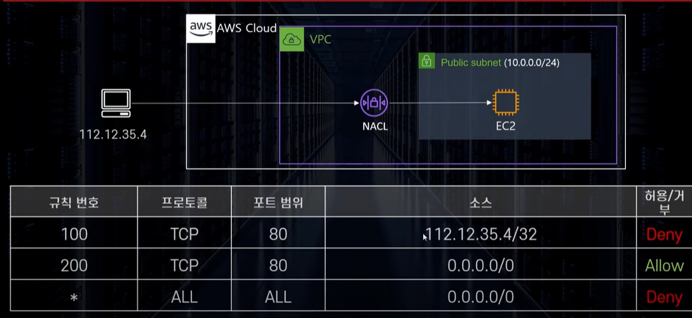

- 112.12.35.4 는 Deny 하고, 다른 80 포트는 모두 열어둔다고 가정하겠습니다.

- 규칙 번호가 낮은 순서대로 체크하므로 112.12.35.4 는 100번 규칙에서 걸려서 Deny 되게 됩니다.

- 나머지 HTTP 요청(80 포트) 는 200번 규칙으로 Allow 됩니다.

- 만약 다음과 같이 규칙 번호 100번과 200번이 서로 변경된다면, 모든 HTTP 요청이 먼저 Allow 되므로 112.12.35.4 또한 규칙 100번을 먼저 적용받게 되어 Allow 됩니다. 한번 규칙을 적용받으면 다음 규칙으로 넘어가지 않습니다. **따라서 규칙번호 순서가 중요하다고 볼 수 있겠습니다.**

  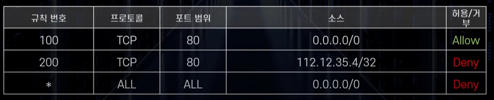

- **AWS 에서는 규칙번호를 100 단위로 메기게 권장합니다.** 그 이유는 규칙과 규칙 사이에 다른 규칙이 들어가야 할 경우도 생기기 때문입니다.

**SG 와 NACL 비교**

둘은 모두 가상의 방화벽으로 역할은 비슷하지만 범위와 상태가 다릅니다.

- SG : 인스턴스 단위로 적용하며 Port 의 허용만 가능합니다. Stateful 입니다.
- NACL : 서브넷 단위로 적용하며 Port 의 허용과 Deny 모두 가능합니다. Stateless 입니다.

### NAT Gateway

NAT Gateway는 VPC 의 Private Subnet 에 있는 인스턴스에서 인터넷에 쉽게 연결할 수 있도록 지원하는 서비스입니다. 즉, Private 인스턴스가 외부의 인터넷과 통신하기 위한 통로입니다. 

NAT Gateway 는 모두 서브넷 단위로 Public Subnet 에 있어야 합니다. 다음 그림과 같습니다.
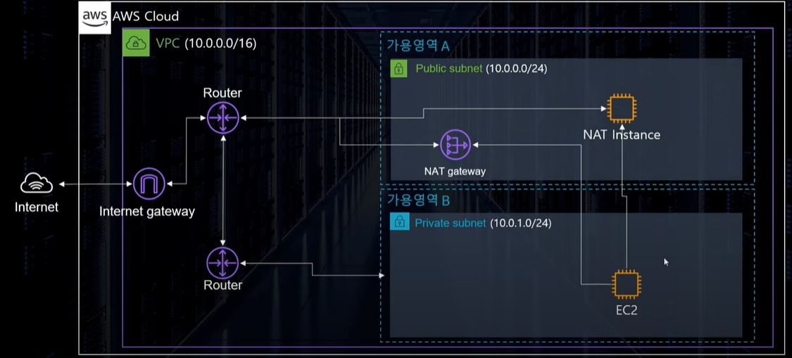

- NAT Gateway (혹은 NAT instance) 가 Private subnet 의 EC2 의 외부연결을 대신해줍니다.
- 위 그림에는 NAT gateway 와 private subnet 의 EC2 와 직접 연결했지만, 실제로는 Router 를 통해 연결된다고 생각하면 됩니다.

### Bastion Host

Bastion Host 는 외부에서 사설 네트크에 접근할 수 있도록 경로를 확보해주는 서버입니다. 즉, Private 인스턴스에 접근하기 위한 EC2 인스턴스입니다. 

**Public subnet 에 위치해야 합니다.** 다음과 같이 표현할 수 있습니다.

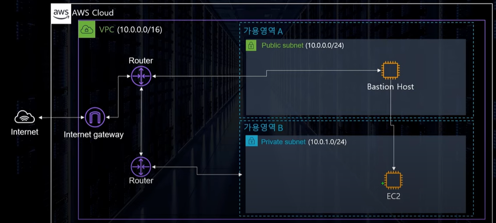

- EC2 인스턴스에 접근하기 위해 Bastion Host 로 접근합니다. (그림은 직접 연결되어있지만, 실제로는 Router 를 통해서 돌아서 연결됩니다.)

하지만 여러가지 권한적인 문제가 많아서 Session Manager 로 Private Subnet 의 EC2 로 접근하도록 권장됩니다. (강의 의견입니다.)

# VPC  생성

커스텀 VPC 생성 시 만들어지는 리소스는 routing Table, NACL, SG 입니다. 서브넷 생성 시에는 모두 기본 routing table 로 자동 연동됩니다.

또한 VPC 에는 단 하나의 Internet Gateway 만 생성가능하며 생성 후 직접 VPC 에 연동해야 합니다.

보안 그룹은 VPC 단위이며, 가장 작은 서브넷 단위는 /28(11개, 16개 - 5개 입니다.

생성은 다음과 같이 진행합니다.

- 직접 커스텀 VPC 생성(10.0.0.0/16)
- 서브넷 3개 생성 : Public, Private, DB(private)
- 각 서브넷에 각각 Routing Table 연동
- Public Subnet 에 IGW 로 경로 구성
- Public Subnet 에 EC2 provision
- Private Subnet 에 EC2 provision (Bastion Host 사용)
- DB Subnet 에 DB 생성 (NAT Gateway 사용)

## VPC 생성

1. VPC 콘솔로 접속하여 VPC 생성 버튼을 클릭합니다.

   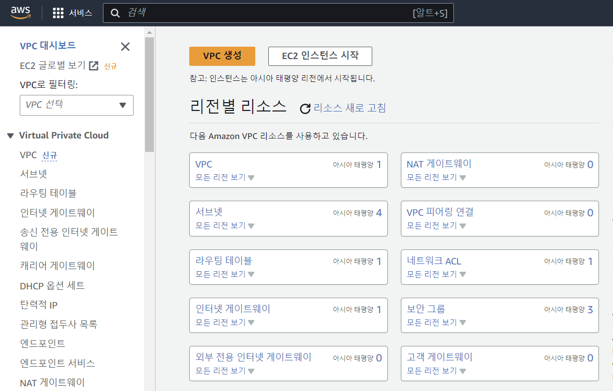

   - VPC 는 기본적으로 모든 region 에 하나씩 만들어집니다. 지금 만드는 것은 추가적인 VPC 입니다.

2. VPC 설정은 다음과 같이 하겠습니다. (설명은 사진 아래)

   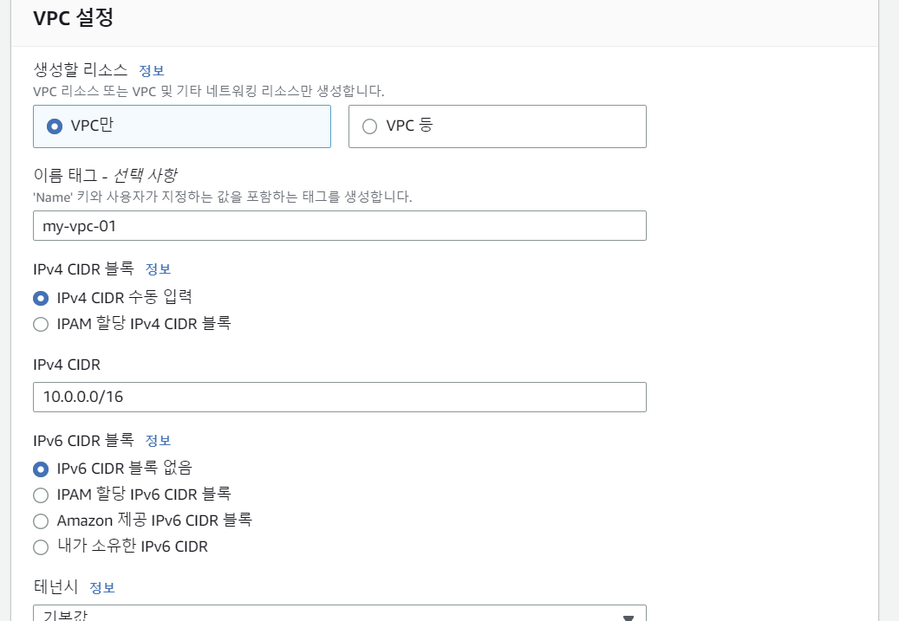

   - 'VPC 등'을 선택하면 subnet, routing table, 네트워크 연결까지 자동으로 구성해줍니다. 하지만 학습목적이니 'VPC 만' 을 선택합니다.
   - IPv4 는 10.0.0.0/16 으로 하고 IPv6 CIDR 블록은 없음으로 합니다.
   - 생성해줍니다.

3. 다음과 같이 VPC 콘솔에서 자동으로 만들어지는 NACL, routing table, SG 을 확인할 수 있습니다.

   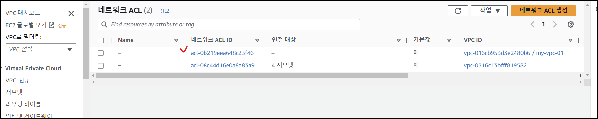

   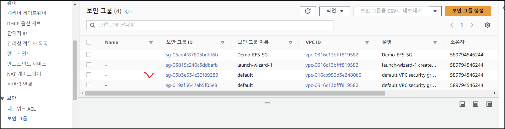

   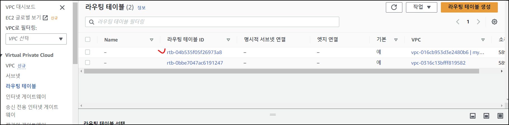

## 서브넷 생성

1. VPC 콘솔에서 서브넷 페이지로 들어갑니다. 이후 서브넷 생성 버튼을 클릭합니다.

   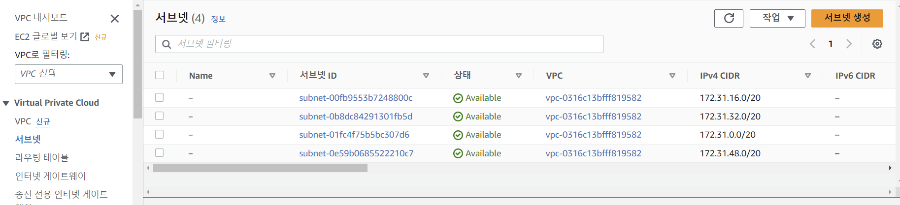

2. 서브넷 VPC ID 는 방금 만들어 둔 ID 로 설정합니다.

   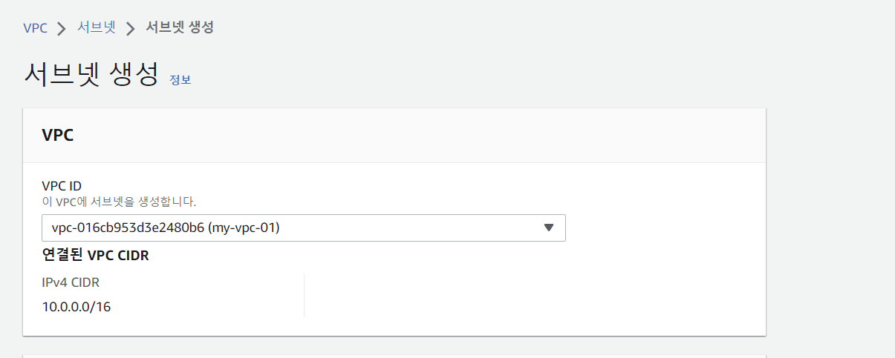

3. 서브넷 이름은 임의로 'my-public-subnet' 으로 하고, AZ 는 a 로 하겠습니다. IPv4 CIDR 블록은 10.0.0.0/24 로 합니다. 다음 subnet 은 10.0.1.0/24 가 될겁니다. 

   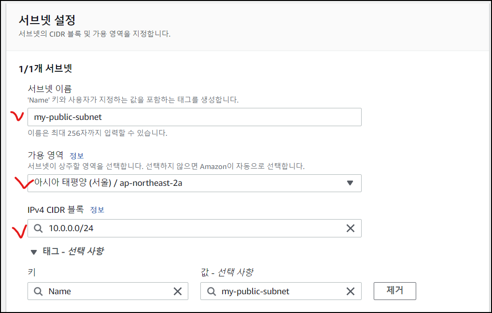

   - 이후 서브넷 생성 버튼을 클릭합니다. 아래와 같이 서브넷이 정상 구성된 것을 확인할 수 있습니다.

     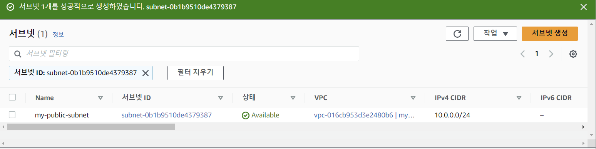

4. 같은 방법으로 이름은 'my-private-subnet', AZ 는 c, IPv4 CIDR 블록은 '10.0.1.0/24' 로 서브넷을 만듭니다.

   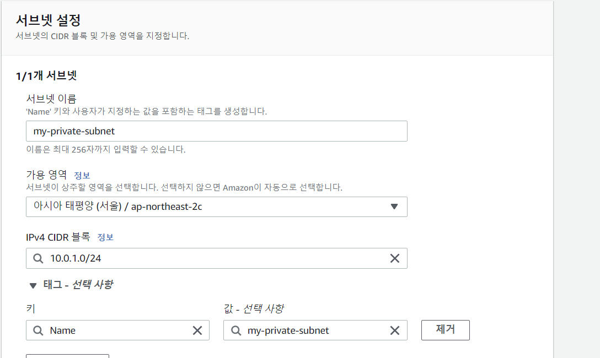

5. 같은 방법으로 이름은 'my-db-subnet', AZ 는 d, IPv4 CIDR 블록은 '10.0.2.0/24' 로 서브넷을 만듭니다.

   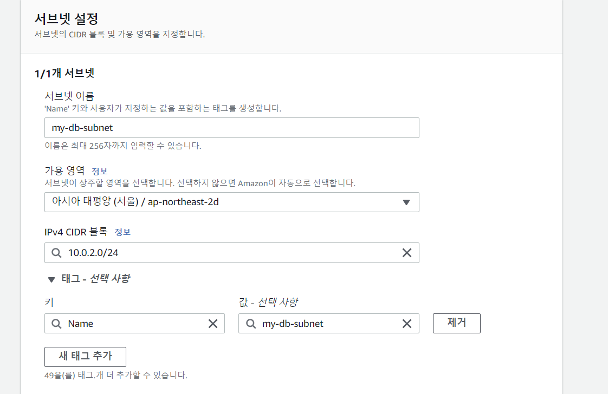

6. 서브넷 3개를 생성하게 되면 AWS 에서는 자동으로 NACL 과 Routing Table 을 연결시켜줍니다. 먼저 NACL 을 확인해보겠습니다.

   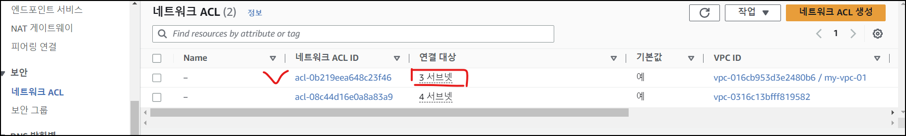

   - 원래는 서브넷에 없었는데, NACL 에 방금 만든 서브넷이 연결 대상으로 설정되었습니다.

7. 다음은 Routing Table 을 확인해보겠습니다.

   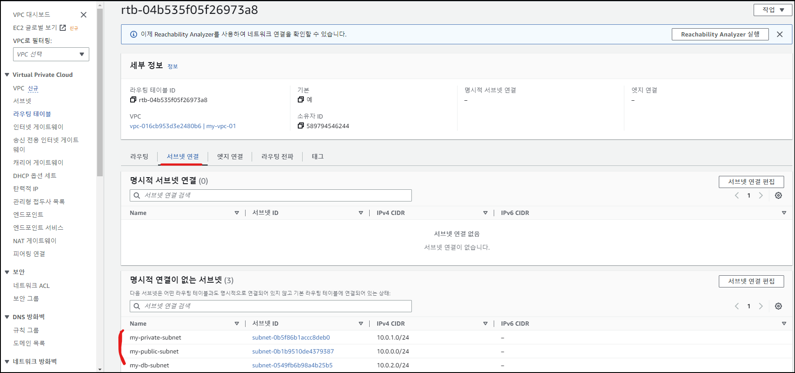

   - 다음과 같이 서브넷 연결 탭에서 서브넷 3개를 확인할 수 있습니다.
   - 하짐나 해당 Routing Table 은 명시적 연결이 없는 서브넷으로, 명시적 서브넷 연결로 이어줘야 합니다.

## Routing Table 생성

위에서 1개의 Routing Table 에 서브넷 3개가 연결된 것을 확인할 수 있습니다. 해당 routing table 은 private-subnet 에 할당하고, 나머지 2개를 만들어보겠습니다.

1. 먼저 만들어진 routing table 의 이름을 'my-private-subnet-rt' 로 변경합니다.

   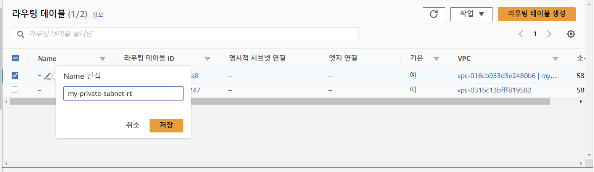

2. 해당 routing table 에서 서브넷 연결 탭에서 명시적 서브넷 연결 -> '서브넷 연결 편집' 을 누릅니다.

   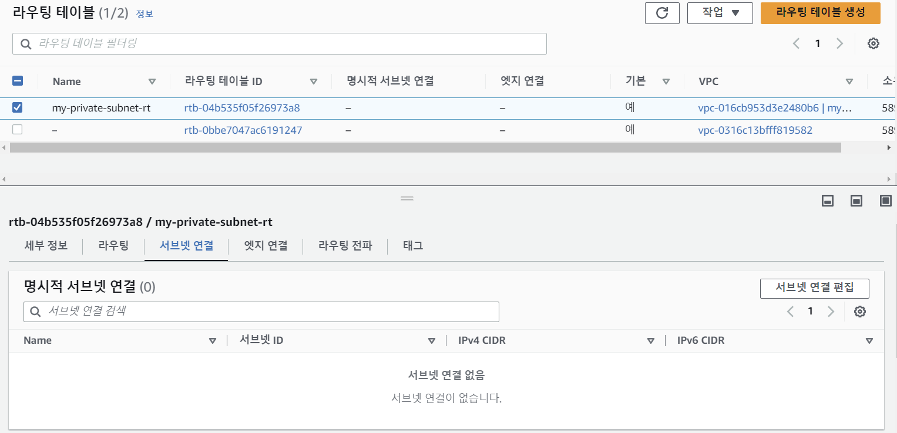

3. 해당 routing table 은 private subnet 에 주기로 했으므로 'my-private-subnet' 을 체크하고 연결 저장 버튼을 누릅니다.

   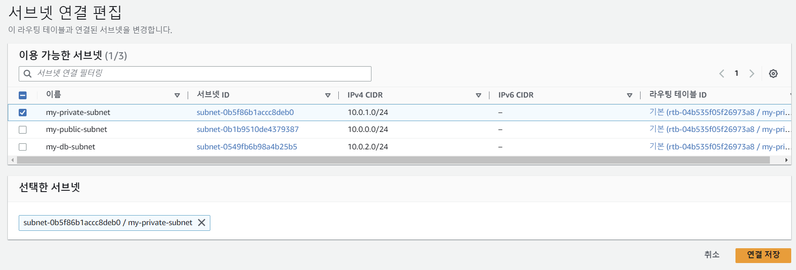

4. 이제 다시 routing table 페이지에서 라우팅 테이블 생성 버튼을 누릅니다. 그리고 'my-public-subnet-rt', 'my-db-subnet-rt' 를 만듭니다.

   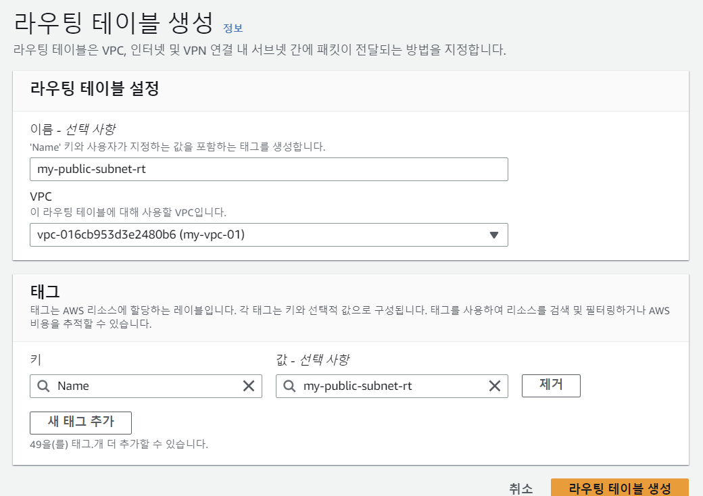

   - 위와 같이 2개의 라우팅 테이블('my-public-subnet-rt', 'my-db-subnet-rt') 을 만듭니다.
   - VPC 는 'my-vpc-01' 입니다.

5. 3번과 같이 각 routing table 에 명시적 서브넷 연결로 각각의 서브넷을 연결해줍니다.

## IGW (Internet Gateway) 생성 및 subnet 과 연결

인터넷과 연결될 수 있는 서브넷이라고 한다면 IGW 가 있어야 합니다. 따라서 IGW 를 만들어주겠습니다.

1. 인터넷 게이트웨이 페이지에서 인터넷 게이트웨이 생성 버튼을 누릅니다.

   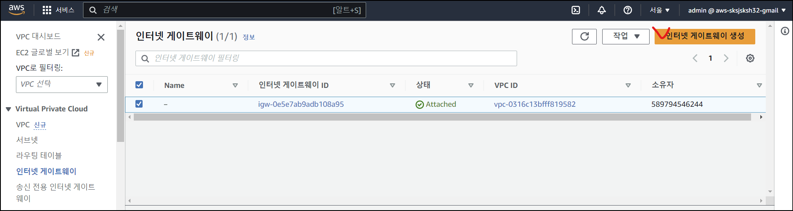

2. 이름을 임의로 적고 인터넷 게이트웨이 생 버튼을 누릅니다.

   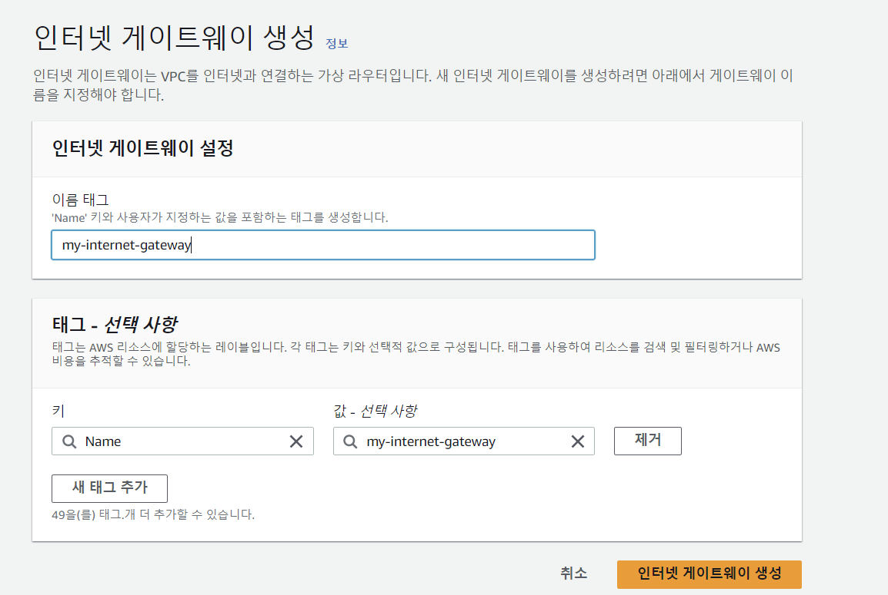

3. 그러면 이렇게 IGW 가 만들어지게 되는데, 우상단의 작업 버튼을 눌러서 'VCP 에 연결' 을 클릭합니다.

   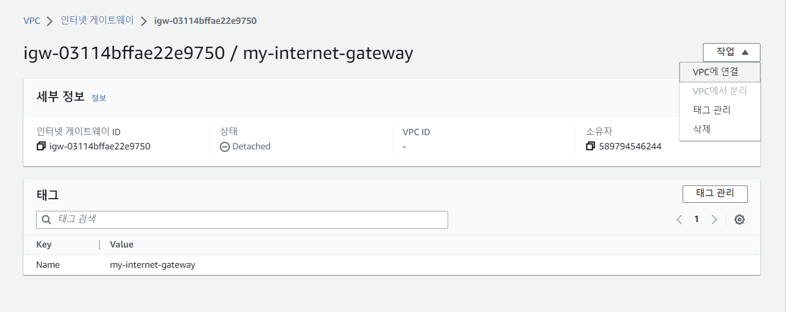

4. VPC 중 my-vpc-01 을 선택한 후 인터넷 게이트웨이 연결을 클릭합니다.

   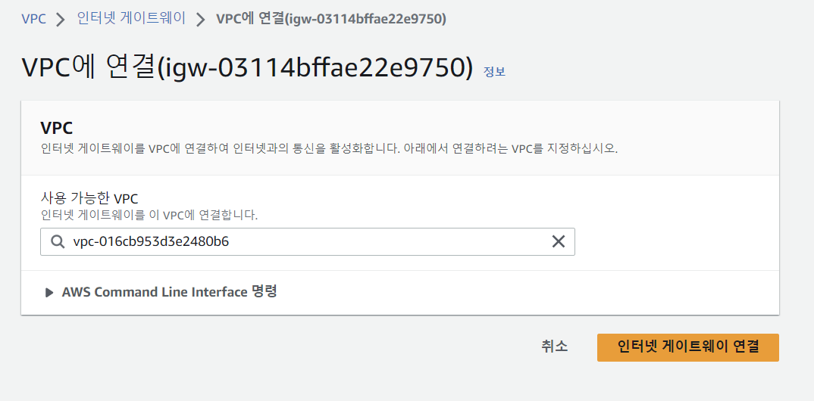

   - 여기서 기존에 처음 자동생성되었던 VPC 가 안뜨는데요. 그 이유는 VPC 당 1개의 IGW 를 가질 수 있는데, 자동생성된 VPC 는 이미 IGW 가 있기 떄문입니다.

5. 이제 public subnet 으로 IGW 를 연결하기 위해서 IGW 와 public subnet 의 routing table 과 연결하겠습니다. routing table 페이지에서 연결하고자 하는 routing table('my-public-subnet-rt') 을 클릭합니다. 라우팅 탭에서 라우팅 편집을 클릭합니다.

   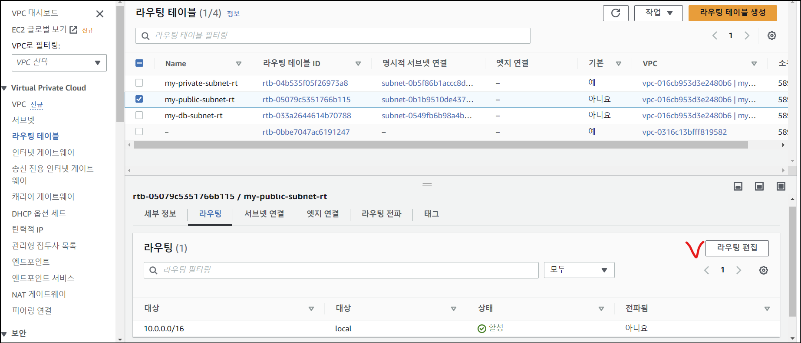

6. 다음과 같이 대상 ip 는 '0.0.0.0/16' 을 입력하고 연결 대상으로 인터넷 게이트웨이를 누릅니다.

   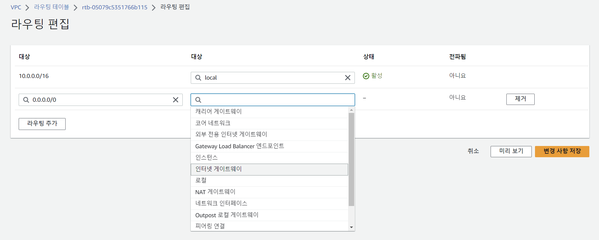

   - 다음과 같이 연결할 수 있는 IGW 목록이 뜹니다. 원하는 IGW 을 클릭하고 변경사항 저장 버튼을 누릅니다.

     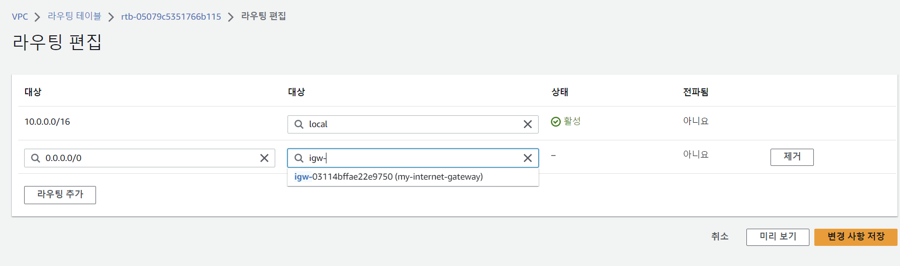

   - 이제 이 public subnet 에서는 IGW 로 가는 경로가 추가되었습니다.

IGW 까지 최종적으로 만들면 VPC 의 Resource map 에서 다음과 같이 확인할 수 있습니다. 

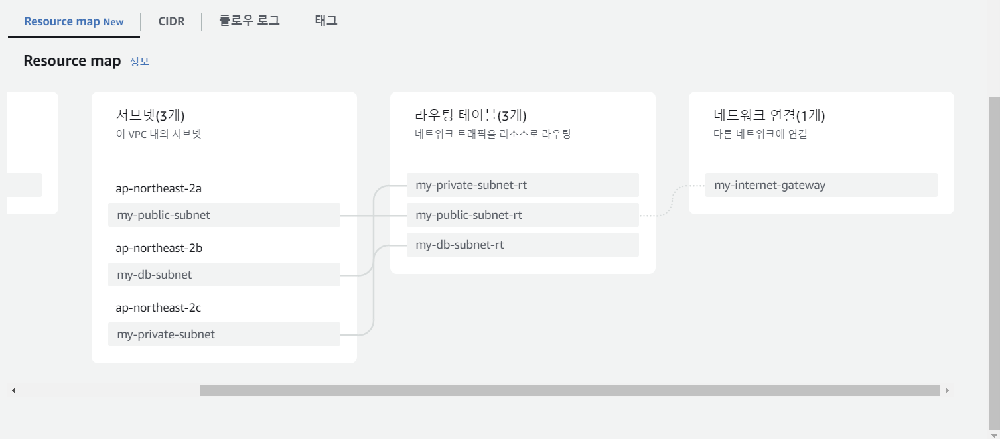

## EC2 를 생성하여 연결확인

Public subnet 에 들어가는 EC2 를 만들어서 IGW 가 잘 작동하는지 확인해보겠습니다.

1. VPC 콘솔의 subnet 페이지에서 해당 subnet 내에 EC2 를 만들 때 퍼블릭 IP 를 자동할당할 수 있도록 서브넷 페이지에서 해당 서브넷 세부정보를 편집합니다. 

   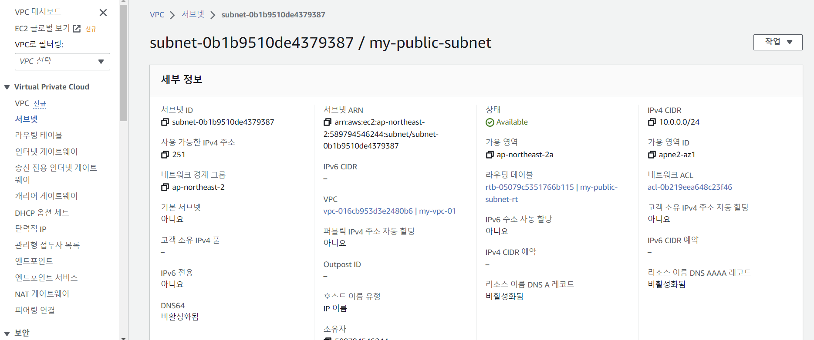

   - 작업 버튼을 누르고 서브넷 설정 편집 버튼을 누릅니다.
   - '퍼블릭 IPv4 주소 자동 할당 활성화' 를 체크하여 활성화 합니다.

2. 이제 EC2 콘솔에서 인스턴스를 만들어줍니다. AMI 는 Linux 2023, 인스턴스 유형 t2.micro, 키페어 없음으로 설정합니다.

3. 네트워크 설정은 아래와 같이 진행합니다.

   

   - 네트워크 설정에서 '편집' 을 눌러서 편집 상태로 변경합니다.
   - VPC 는 만들어놓은 'my-vpc-01' 을 선택합니다.
   - 서브넷은 'my-public-subnet' 을 넣습니다.
   - 퍼블릭 IP 자동 할당은 1번에서 한 것처럼 '활성화' 가 되어있습니다.
   - SG 는 default 로 설정하겠습니다.
   - 인스턴스 시작 버튼을 눌러 생성하겠습니다.

4. 인스턴스를 만들었지만 SG 설정때문에 접속할 수 없습니다. 먼저 SG 를 보겠습니다.

   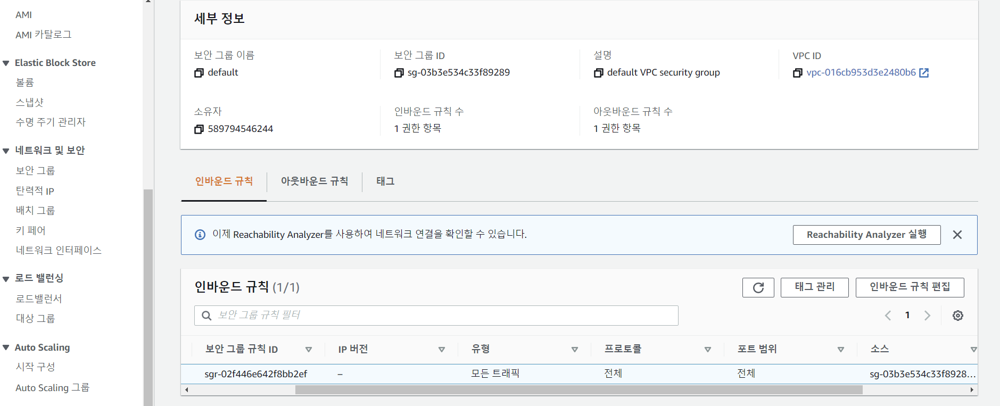

   - 해당 SG 규칙을 보면 모든 트래픽을 허용하지만, 소스가 있는 걸 확인할 수 있습니다. 따라서 해당 인바운드 규칙을 삭제하고 다음과 같이 구성하겠습니다.

5. 해당 default SG 의 인바운드 규칙을 다음과 같이 수정합니다.

   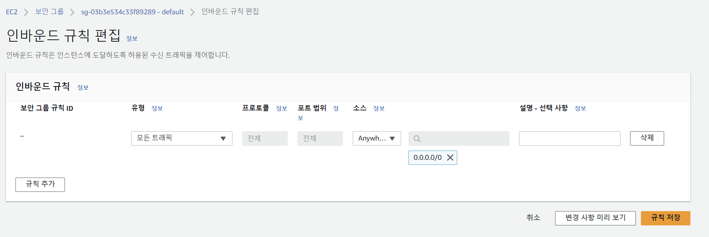

6. 이제 다음과 같이 EC2 콘솔을 띄워서 확인해보겠습니다. EC2 콘솔은 EC2 인스턴스에서 연결 버튼을 누르면 됩니다.

   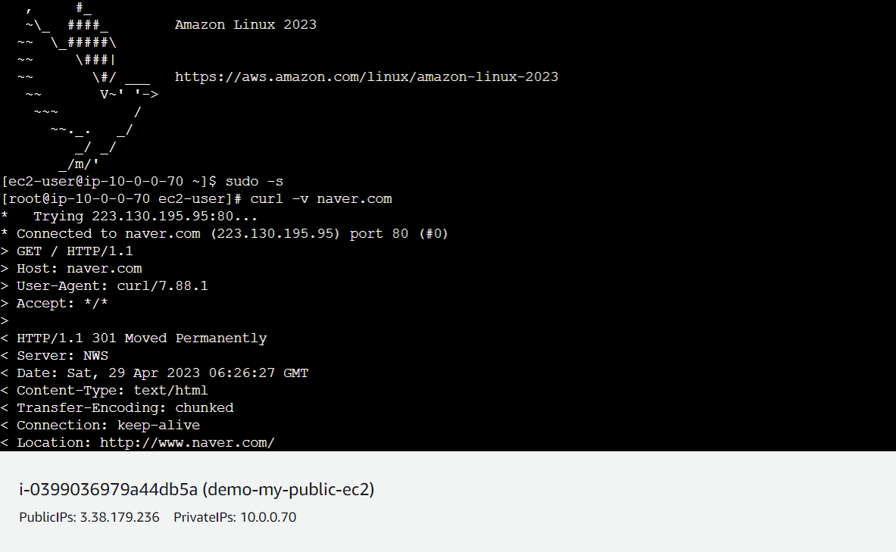

   - `curl -v naver.com` 을 통해 확인 결과 외부와 통신이 잘 되는 것을 확인할 수 있습니다.

## Private EC2, DB EC2 생성

이제 private, DB 의 EC2 를 만들어보겠습니다. 위 Public EC2 생성과 비슷하지만 약간의 차이는 있습니다.

**Private instance**

1. 이름은 `demo-my-private-ec2` 로 하고, AMI 는 Linux 2023, 인스턴스 유형 t2.micro 로 하고 이번에는 키페어를 만들어줍니다.

2. 네트워크 설정은 아래와 같이 합니다.

   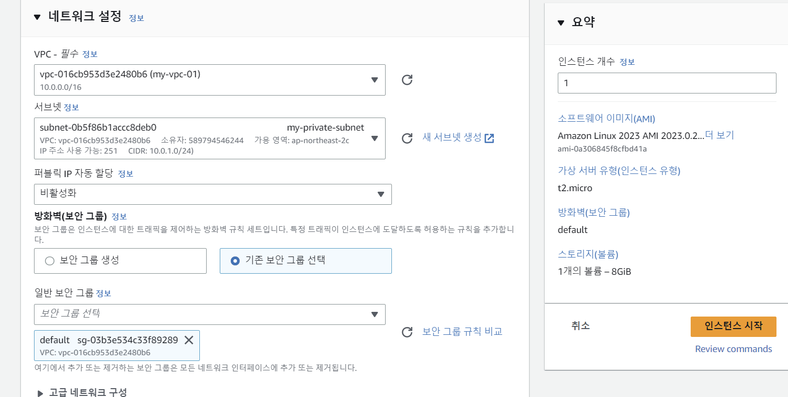

   - VPC 는 만들어둔 VPC, 서브넷은 'my-private-subnet' 으로 합니다.
   - 퍼블릭 IP 는 필요없으므로 비활성화 합니다.
   - SG 는 default 로 하겠습니다.

3. 해당 Private instance 는 콘솔로 연결되지 않으며, public IP 가 할당되었다 해도 연결되지 않습니다. 따라서 해당 instance 에 접근하기 위해 Bastion Host 를 사용해보겠습니다. 먼저 Public instance 에 접속해서 private keypair 를 넣어줍니다.

   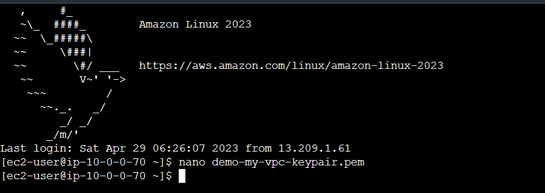

   - demo-my-vpc-keypair.pem 을 만들어주고 pc 에 있는 keypair 를 그대로 복사 붙여넣기 합니다.

4. 다음과 같이 파일이 정상적으로 생성된 것을 확인 후 접속을 합니다.

   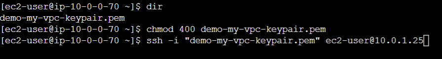

   - `chmod 400 demo-my-vpc-keypair.pem` : 해당 파일의 Read 권한을 부여합니다.
   - `ssh -i - "demo-my-vpc-keypair.pem" ec2-user@10.0.1.25` : 키페어를 통해 private  intance 로 들어갑니다. 이때 ec2-user 뒤에 ip 는 private instance 의 '프라이빗 IP 주소'입니다.
   - 접속이 잘 되는 것을 확인할 수 있습니다.

**db instance**

1. db instance 도 private instance 와 같이 만들어줍니다. 이름은 `demo-my-db-ec2` 로 하고, AMI 는 Linux 2023, 인스턴스 유형 t3.nano 로 하고 키페어는 private 인스턴스에 사용한 키페어를 같이 사용하겠습니다.

   - 원래 db subnet 은 D 영역이었는데 t2.micro 가 지원되지 않는다고 해서 B 영역으로 변경했습니다. 하지만 계속 같은 현상으로 제일 요금이 적은 t3.nano 로 만들고 바로 삭제하겠습니다.

2. 네트워크 설정은 다음과 같습니다.

   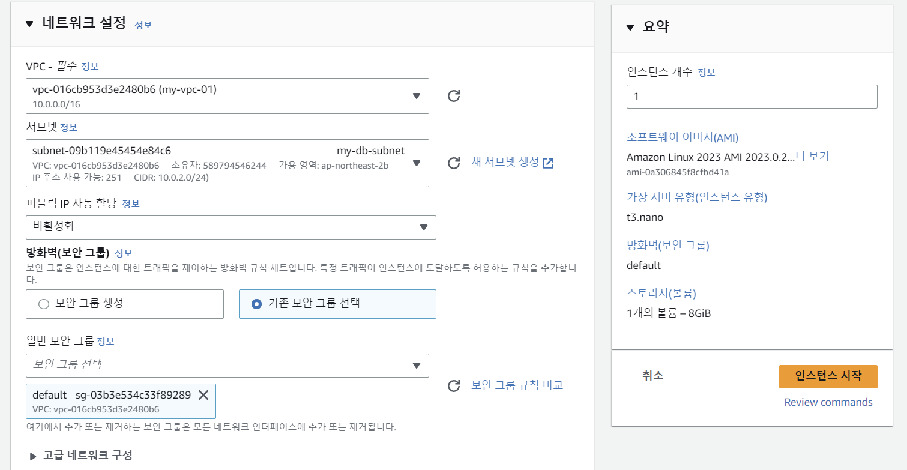

   - VPC, 서브넷은 만들어놓았던 걸로 선택합니다.
   - 퍼블릭 IP 자동 할당은 비활성화, SG 는 기존 보안 그룹(default) 를 선택합니다.
   - 인스턴스 시작 버튼을 눌러줍니다.

3. 이제 Public Instance 로 들어가서 private 에 접속했던 것처럼 db 에 접속하겠습니다.

   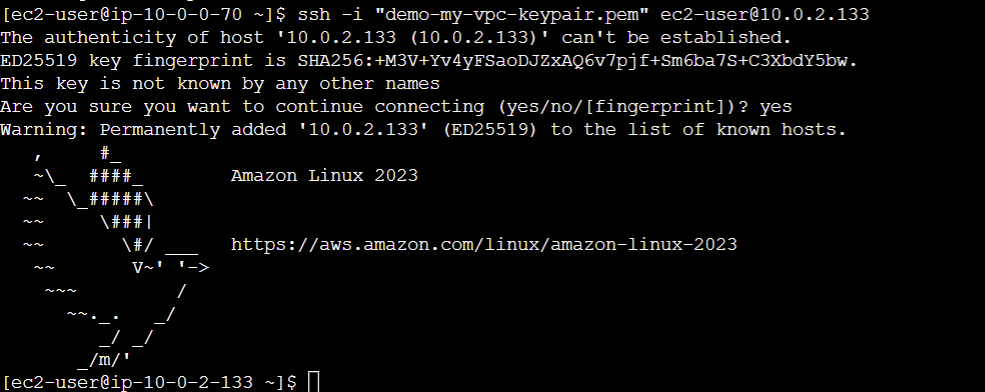

   - `ssh -i "demo-my-vpc-keypair.pem" ec2-user@10.0.2.133` 으로 접속합니다. 이 때 ec2-user@ 뒤의 ip 는 db instance 의 private ip 입니다.

4. 이제 DB instance 에 db 를 설치해줘야 합니다. 하지만 외부와 연결되어있지 않기 때문에 `yum install ~` 명령어를 사용할 수 없습니다. 따라서 먼저 NAT 게이트웨이를 생해주겠습니다. VPC 콘솔에서 NAT 게이트웨이 페이지로 이동합니다. 그리고 우상단의 'NAT 게이트웨이 생성' 버튼을 클릭합니다.

   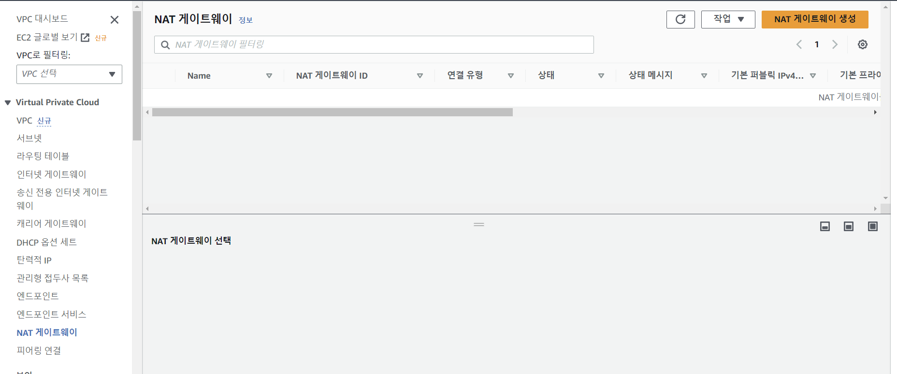

5. 다음과 같이 작성합니다. (설명은 아래 참고)

   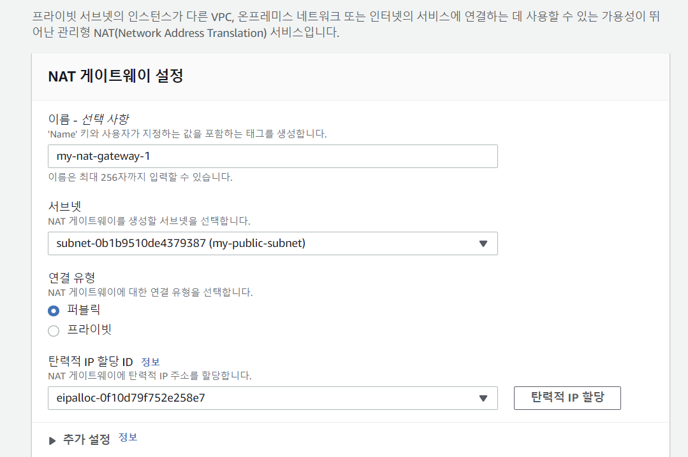

   - NAT Gateway 설명을 할 때 말했던 것처럼 NAT Gateway 는 public subnet 에만 들어갈 수 있습니다. 따라서 subnet 은 'my-public-subnet' 을 선택합니다.
   - 탄력적 IP 가 필요하므로 없다면 '탄력적 IP 할당' 버튼을 누릅니다.
   - 완료되었다면 'NAT 게이트웨이 생성' 버튼을 눌러 생성합니다.

6. 이제 private subnet 과 db subnet 에서 외부로 가는 경로는 NAT gateway 를 거치도록 수정해야 합니다. 먼저 routing table 페이지에서 db routing table 의 라우팅 편집 버튼을 클릭합니다.

   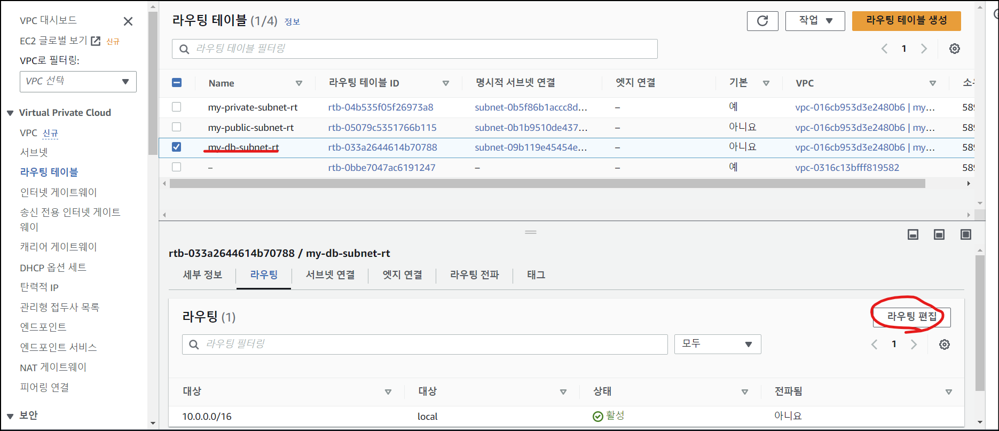

7. 대상을 0.0.0.0/0 으로 모든 외부 연결은 NAT gateway 를 통과한다고 설정하겠습니다.

   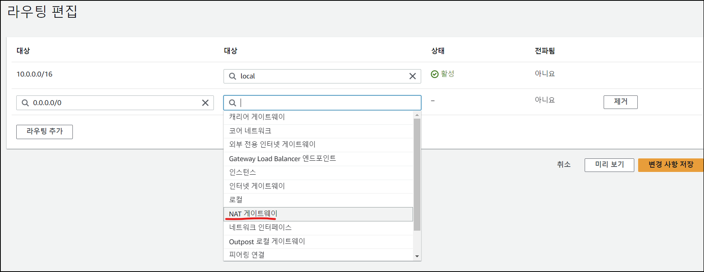

   - 만들어진 NAT 게이트웨이를 선택해줍니다.

8. private routing table 도 똑같이 NAT 게이트웨이를 선택합니다.

9. 이제 db instance 에 접근해보겠습니다. 먼저 public instance 로 db instance 에 연결해준 뒤 다음 명령어를 통해 설치해보겠습니다. db instance 는 NAT gateway 를 통해 외부에서 패키지 다운로드가 가능합니다.

   - `sudo -s` : 패키지 다운을 위해 권한 부여
   - `yum list | grep mysql` : 다운로드 받을 수 있는 패키지 확인
     - Linux 2023 에는 mysql 이 아닌 mariadb 를 다운로드 받아야 되는 걸까요? 일단 강의에서 나온 mysql 패키지가 없어서 아래 나오는 명령어는 건너 뛰었습니다. 만약 검색된 패키지를 다운로드 받으려면 아래와 같이 하면 됩니다.
   - `yum install mysql` : mysql 패키지 다운로드

# 마치며

지금까지 만든 내용은 다음과 같은 아키텍처를 구현했다고 생각하면 됩니다.

- public subnet 에서 IGW 연결 후 presentation 영역 처리 및 NAT gateway 로 private, db instance 연결
- private subnet 에서 private instance 로 데이터 처리 로직 구현(만들지는 않았지만요)
- db subnet 에서 db instance 로 저장소 구현(mysql)

