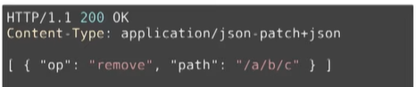
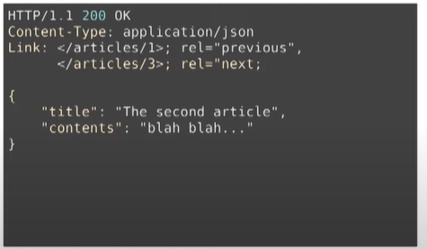
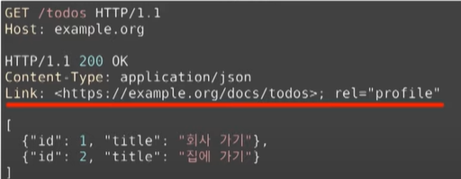
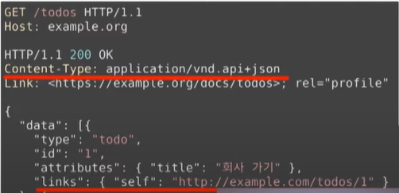
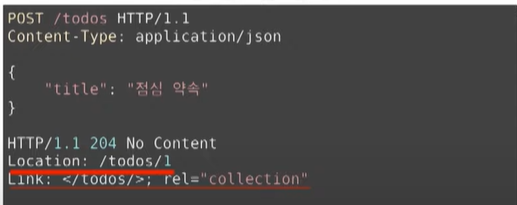

# 시작하기 전에

REST API 를 정리해봐야겠다고 생각이 든 건 우연히 "그런 REST API로 괜찮은가" 를 보고 나서 였습니다. (아래쪽에 설명 및 링크 있습니다.)

먼저 제가 REST API 에 관해 아는 건,

1. 데이터를 통신하기 위해 보내는 json 형식의 어떠한 것
2. uri 를 보기 쉽게 만들어야 함
3. GET, PUT, DELETE, POST 등의 HTTP method 사용

등등... 너무 개략적으로 알고, (공부를 더 한 현 상황에서) 틀린 내용도 있었습니다. 물론 지금부터 서술할 내용도 깊거나 대단한 건 아니지만 기초적인 개념은 바로 잡는다는 생각으로 포스팅했습니다.

# REST API 란

## API( Application Programming Interface)

API 는 소프트웨어 간 지정된 형식으로 요청, 명령을 받을 수 있는 수단입니다.

예를 들어 클라이언트와 서버가 통신을 할 때 요청과 응답을 줘야 하는데, 그 형식이 API 라고 할 수 있습니다. API 는 웹에만 국한되지 않고 모든 프로그램 간의 상호 작용에 사용됩니다.


## RESTful(REpresentational State Transfer0ful) API

REST API 는 이러한 API 를 어떻게 구성할지 정의된 아키텍처 스타일로( 프로토콜이나 표준이 아님), 웹상에서 사용되는 여러 리소스를 HTTP URI로 표현하고, 해당 리소스에 대한 행위를 HTTP Method(POST, GET, PUT, DELETE, PATCH) 로 정의하는 방식을 말합니다.

구성요소는 다음과 같습니다.

1. 자원(Resource) : HTTP URI
2. 자원에 대한 행위(Verb) : HTTP Method
3. 자원에 대한 행위의 내용 (Representations) : HTTP Message Pay Load

## REST 의 특징

[[Network] REST란? REST API란? RESTful이란?](https://gmlwjd9405.github.io/2018/09/21/rest-and-restful.html) 이 곳에서 일부 인용했습니다. 다 이해되는 건 아니지만 생각날 때마다 읽어보겠습니다.

1. **Server-Client(서버-클라이언트 구조)**
   - 자원이 있는 쪽이 Server, 자원을 요청하는 쪽이 Client가 됩니다.
     - REST Server: API를 제공하고 비즈니스 로직 처리 및 저장을 책임집니다.
     - Client: 사용자 인증이나 context(세션, 로그인 정보) 등을 직접 관리하고 책임집니다..
   - 따라서 서로 간 의존성이 줄어듭니다.
2. **Stateless(무상태)**
   - HTTP 프로토콜은 Stateless Protocol이므로 REST 역시 무상태성을 갖습니다.
   - Client의 context를 Server에 저장하지 않습니다.
     - 즉, 세션과 쿠키와 같은 context 정보를 신경쓰지 않아도 되므로 구현이 단순해집니다.
   - Server는 각각의 요청을 완전히 별개의 것으로 인식하고 처리합니다.
     - 각 API 서버는 Client의 요청만을 단순 처리합니다. 즉, 이전 요청이 다음 요청의 처리에 연관되어서는 안된다.
     - 물론 이전 요청이 DB를 수정하여 DB에 의해 바뀌는 것은 허용됩니다.
     - Server의 처리 방식에 일관성을 부여하고 부담이 줄어들며, 서비스의 자유도가 높아집니다.
3. **Cacheable(캐시 처리 가능)**
   - 웹 표준 HTTP 프로토콜을 그대로 사용하므로 웹에서 사용하는 기존의 인프라를 그대로 활용할 수 있습니다. 즉, HTTP가 가진 가장 강력한 특징 중 하나인 캐싱 기능을 적용할 수 있다.
   - HTTP 프로토콜 표준에서 사용하는 Last-Modified 태그나 E-Tag를 이용하면 캐싱 구현이 가능합니다.
   - 대량의 요청을 효율적으로 처리하기 위해 캐시가 요구됩니다. 캐시 사용을 통해 응답시간이 빨라지고 REST Server 트랜잭션이 발생하지 않기 때문에 전체 응답시간, 성능, 서버의 자원 이용률을 향상시킬 수 있습니다.
4. **Layered System(계층화)**
   - Client는 REST API Server만 호출합니다.
   - REST Server는 다중 계층으로 구성될 수 있습니다.
     - API Server는 순수 비즈니스 로직을 수행하고 그 앞단에 보안, 로드밸런싱, 암호화, 사용자 인증 등을 추가하여 구조상의 유연성을 줄 수 있습니다.
     - 또한 로드밸런싱, 공유 캐시 등을 통해 확장성과 보안성을 향상시킬 수 있습니다.
   - PROXY, 게이트웨이 같은 네트워크 기반의 중간 매체를 사용할 수 있습니다.
5. **Code-On-Demand(optional)**
   - Server로부터 스크립트를 받아서 Client에서 실행합니다. 반드시 충족할 필요는 없습니다.
6. **Uniform Interface(인터페이스 일관성)**
   - URI로 지정한 Resource에 대한 조작을 통일되고 한정적인 인터페이스로 수행합니다.
   - HTTP 표준 프로토콜에 따르는 모든 플랫폼에서 사용이 가능합니다.
     - 특정 언어나 기술에 종속되지 않습니다.

# REST API 설계

## **설계 방법**

REST API 의 설계 방법은 다음과 같습니다.

1. URI 에는 동사를 사용하지 않는다.
   - Bad : GET `/createmovie`
   - Good : GET `/movies`
2. 마지막에 슬래시 (/)를 포함하지 않는다.
   - Bad : GET `/movies/inception/`
   - Good : GET `/movies/inception`
3. 언더바 대신 하이폰을 사용한다.
   - Bad : GET `/movies/inception/test_customer`
   - Good : GET `/movies/inception/test-customer`
4. 파일확장자는 URI에 포함하지 않는다.
   - Bad : GET `/movies/inception/poster.jpg`
   - Good : GET `/movies/inception/poster`
5. 행위를 포함하지 않는다.
   - Bad : DELETE `/movies/inception/delete-movie`
   - Good : DELETE `/movies/inception`

## **설계 예시**

| CRUD            | HTTP verbs | Route       |
| --------------- | ---------- | ----------- |
| movie 목록 조회 | GET        | /movies     |
| 특정 movie 조희 | GET        | /movies/:id |
| movie 생성      | POST       | /movies     |
| movie 수정      | PUT        | /movies:id  |
| movie 삭제      | DELETE     | /movies:id  |


[MS_RESTAPI GUIDANCE](https://github.com/microsoft/api-guidelines/blob/vNext/Guidelines.md)

ms 에서 발표한 restAPI 가이드입니다. `7. Consistency fundamentals` 부터 보면 될 듯합니다.

아래와 같은 API 가 정석이라고 합니다.

```
https://api.contoso.com/v1.0/people/7011042402/inbox
```

읽어보면 이런 내용도 있는데요.

> **7.4.1. POST**
>
> POST operations SHOULD support the Location response header to specify the location of any created resource that was not explicitly named, via the Location header.
>
> As an example, imagine a service that allows creation of hosted servers, which will be named by the service:
>
> ```
> POST http://api.contoso.com/account1/servers
> ```
>
> The response would be something like:
>
> ```
> 201 Created
> Location: http://api.contoso.com/account1/servers/server321
> ```
>
> Where "server321" is the service-allocated server name.

Inflean Dowon Lee 님의 REST API 개발에서 공부한 내용이네요!

다음과 같은 내용 있습니다. (표준 형식)

> ### 9.3. Collection URL patterns
>
> Collections are located directly under the service root when they are top level, or as a segment under another resource when scoped to that resource.
>
> For example:
>
> ```
> GET https://api.contoso.com/v1.0/people
> ```
>
> Whenever possible, services MUST support the "/" pattern. For example:
>
> ```
> GET https://{serviceRoot}/{collection}/{id}
> ```


# 그런 REST API 로 괜찮은가

추가적인 이론 내용입니다. 유튜브 영상을 보고 적었습니다. [Day1, 2-2. 그런 REST API로 괜찮은가](https://youtu.be/RP_f5dMoHFc) - naver d2

사실 이 내용은 몰라도 되는 내용이긴 하지만 제가 REST API 을 공부하게 만든 동기부여 영상이기도 하고, 흥미롭기도 해서 조금만 정리해봤습니다.

> "REST API 를 위한 최고의 버저닝 전략은 버저닝을 안하는 것" - Roy T. Fielding

## 잘 지켜지지 않는 원칙

uniform interface (인터페이스 일관성) 중 다음 제약조건을 잘 만족하지 못합니다.

	1. self-descriptive messages
	1. hypermedia as the engine of application state (HATEOAS)

**self-descriptive messages**

"메시지는 스스로 설명해야 한다" 는 조건입니다.



- 다음과 같은 메시지가 self-descriptive 를 만족하는 메세지입니다.
- 여기서 잘 안지켜지는 건 json-patch+json 과 같은 미디어타입으로, json 을 해석가능하게 해야 합니다.
  - op 가 의미하는 건 뭐다... path 가 의미하는 건 뭐다...
  - 보통 `Content-Type : application/json` 까지만 정의하고, 해당 json 을 온전히 해석하는 미디어 타입을 설정해놓지 않아서 self-descriptive 가 만족되지 못합니다.

**HATEOAS**

애플리케이션의 상태는 Hyperlink 를 이용해 전이되어야 한다는 조건입니다.

애플리케이션 전이란 링크를 통해서 저장한 데이터를 읽기, 수정, 삭제 등을 하는 것입니다. html  은 문서 내에 a 태그를 통해서 전이 가능한 링크가 나오기 때문에 HATEOAS 를 만족한다고 볼 수 있습니다.

```html
<body>
	<a href="/test">test 페이지 이동</a>
</body>
```

<center><i>a 태그를 통해서 링크가 나와있고 해당 상태로 전이가 가능하다</i></center>

JSON 으로는 다음과 같이 HATEOAS 를 만족시킬 수 있습니다.




## 왜 이런 원칙을 지켜야 하나?

서버와 클라이언트가 각각 독립적으로 진화하기 위해 REST 가 필요합니다. 다시 말해 REST 를 만족하는 어플리케이션은 서버의 기능이 변경되어도 클라이언트를 업데이트할 필요가 없어집니다.

WEB 은 REST 를 잘 지키고 있습니다. 예를 들어 웹 브라우저를 업데이트한다고 해서 웹 어플리케이션을 업데이트할 필요는 없죠. 웹은 이렇게 상호운용성을 위해서 많은 노력을 했다고 합니다.

HTML(WEB) 과 JSON 을 비교해보면 HTML 은 a 태그를 통해 **Hyperlink** 를 구현해서 다음 상태로 전이될 수 있고, HTML 명세로 **Self-desciptive** 를 정의하고 있습니다.(HTML 의 모든 태그 정리) 하지만 JSON 은 그렇지 않습니다.

다음은 두 원칙이 독립적 진화에 어떻게 도움이 되는지 입니다.

**Self-descriptive** : 확장 가능한 커뮤니케이션 

- 서버나 클라이언트가 변경되더라도 오고가는 메시지는self-descriptive 하므로 언제나 해석이 가능합니다.

**HATEOAS** : 어플리케이션 상태 전이의 late binding

- 어디서 어디로 전이 가능한지 미리 결정되지 않는다. 어떤 상태로 전이가 완료되고 나서야 그 다음 전이될 수 있는 상태가 결정됩니다.
- 쉽게 말해, **링크는 동적으로 변화될 수 있습니다.**


## 어떻게 원칙적인 REST API 를 만들까?


1. **Self-dscriptive**

- Media-Type : 미디어 타입을 정의하여 미디어 타입 문서를 작성한 후 IANA 에 미디어 타입을 등록하고 문서를 미디어 타입의 명세로 등록합니다.

- Profile : json 의 의미를 정의한 명세를 Link 헤더에 profile relation 으로 해당 명세를 링크합니다.

  

2. **HATEOAS**
   - JSON 본문에 `"link" : url` 을 넣습니다. 기존 API 를 많이 고쳐야 하는 단점이 있습니다.



- Link, Location 등의 헤더로 링크를 표현할 수도 있습니다. (Location 은 위에 ms guidance 에도 있는 내용입니다.)



# 마치며

정작 포스팅을 끝마치고 나보니 유튜브 내용이 REST API 정리보다 많습니다... ㅎㅎ

하지만 유튜브 내용을 정말 흥미롭게 보다보니 내용 정리하는 것도 재밌었습니다. 물론 아직도 "REST API 를 정의해봐라!" 라고 하면 말문이 막히는 수준이지만요.

배운 걸 적용하려보니 제가 지금까지 사용했던 REST API (라고 일컫던 것) 은 원칙을 대부분 지키지 않았더군요. 일단 `/createField` 처럼 동사가 들어가는 경우도 많았구요. 내일은 해당부분을 리팩토링을 해봐야겠습니다.

## Ref.

[[네트워크] REST API란? REST, RESTful이란?](https://khj93.tistory.com/entry/%EB%84%A4%ED%8A%B8%EC%9B%8C%ED%81%AC-REST-API%EB%9E%80-REST-RESTful%EC%9D%B4%EB%9E%80)

[[Network] REST란? REST API란? RESTful이란?](https://gmlwjd9405.github.io/2018/09/21/rest-and-restful.html) 

