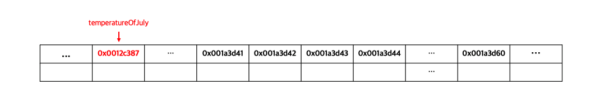
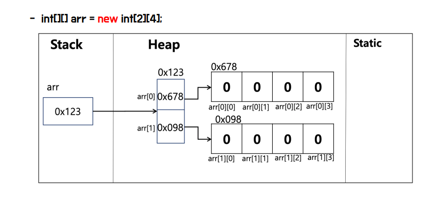

# 배열

**배열이란, 동일한 타입의 값들을 하나의 묶음으로 묶은 자료 구조를 의미합니다.** 즉, 각 값들이 같은 의미를 지니면서 서로 연관성이 있을 때, 이들을 하나의 덩어리로 묶을 수 있으며, 이렇게 묶인 값들의 집합을 배열이라고 합니다.

배열은 다음과 같이 저장됩니다.


`double[] temperatureOfJuly = { 27.4, 30.1, ..., 31.8 };` 로 선언 시 temperatureOfJuly 의 주소값에는 배열의 첫번째 요소의 주소값을 가리킵니다.

> **int[] vs List<int>**
>
> the main differences between `int[]` and `List<int>` are that arrays have a fixed size while lists are dynamically resizable, and lists provide additional methods and functionality for manipulating the collection.

## 배열의 선언, 저장, 접근

**배열 선언**

배열 선언은 다음과 같이 합니다.

`double[] temperatureOfJuly`

선언이 되면 주소값이 할당됩니다.



**배열 초기화**

`temperatureOfJuly = new double[31];`

double 형의 공간 31개를 확보하고, `temperatureOfJuly` 의 주소값에 배열의 첫번째 요소의 주소값이 할당됩니다.


**배열이 선언되면** 

다음 문장은 같은 문장입니다. 배열 선언과 초기화 시 `new double[]` 생략 가능합니다.

`double[] temperatureOfJuly = new double[]{ 27.4, 30.1, 31.1, 32.4, ..., 31.8 };`

`double[] temperatureOfJuly = { 27.4, 30.1, 31.1, 32.4, ..., 31.8 };`

다음과 같이 주소값이 할당되고 저장됩니다.

1. 참조 변수 `temperatureOfJuly`가 선언됩니다.
2. 배열이 생성되고 중괄호(`{}`) 내의 값으로 배열 요소들의 값이 초기화됩니다.
3. 생성된 배열의 첫 번째 요소의 주소값이 참조 변수 `temperatureOfJuly`에 할당됩니다.

**배열 값 접근**

`temperatureOfJuly[0]` 등과 같이 [i] 에 인덱스를 넣어서 배열값에 접근합니다.

**배열의 길이**

배열의 길이는 String 과 다르게 `length` 를 사용합니다.

`temperatureOfJuly.length`  


## 2차원 배열

2차원 배열은 다음과 같이 선언할 수 있습니다.

```java
int[][] kcal;
kcal = new int[31][3];

//한줄로 작성
int[][] kcal = new int[31][3];
```

예제 코드가 실행되면 다음과 같은 2차원 배열이 만들어집니다. 

```java
{
	{ 0, 0, 0 },
	{ 0, 0, 0 },
	{ 0, 0, 0 },

	...

	{ 0, 0, 0 }
}
```

내부 배열은 int 형의 기본값인 0 을 3개씩 저장하고, 외부 배열의 각 요소는 내부 배열의 주소값을 저장하고 있습니다.

다음 그림과 같습니다. (참고용이며 위 내용과 다릅니다.)



## 가변 배열

2차원 이상의 다차원 배열에서는 1차원보다는 자유로운 형태로 배열을 만들 수 있습니다. 즉, 배열이 2차원 이상일 때, **마지막 차수에 해당하는 배열의 길이를 고정하지 않아도 되며**, 이러한 배열을 **가변 배열**이라고 합니다.

다음과 같이 선언하고 초기화합니다.

`int[][] ages = new int[5][];`

다음과 같이 내부배열을 생성합니다.

```java
int[][] ages = new int[5][];

ages[0] = new int[5];
ages[1] = new int[6];
ages[2] = new int[7];
ages[3] = new int[8];  
ages[4] = new int[9];

System.out.println("Arrays.toString(ages[0]) = " + Arrays.toString(ages[0]));
System.out.println("Arrays.toString(ages[1]) = " + Arrays.toString(ages[1]));
System.out.println("Arrays.toString(ages[2]) = " + Arrays.toString(ages[2]));
System.out.println("Arrays.toString(ages[3]) = " + Arrays.toString(ages[3]));
System.out.println("Arrays.toString(ages[4]) = " + Arrays.toString(ages[4]));

// 결과
// Arrays.toString(ages[0]) = [0, 0, 0, 0, 0]
// Arrays.toString(ages[1]) = [0, 0, 0, 0, 0, 0]
// Arrays.toString(ages[2]) = [0, 0, 0, 0, 0, 0, 0]
// Arrays.toString(ages[3]) = [0, 0, 0, 0, 0, 0, 0, 0]
// Arrays.toString(ages[4]) = [0, 0, 0, 0, 0, 0, 0, 0, 0]
```

가변 배열도 생성과 동시에 초기화가 가능합니다.

```java
int[][] ages = {
	{ 30, 32, 39, 59, 23 },
	{ 31, 41, 52, 56, 72, 13 },
	{ 45, 32, 84, 23, 13, 42, 55 },
	{ 23, 41, 62, 64, 23, 51, 67, 98 },
	{ 13, 14, 17, 84, 52, 37, 68, 66, 33 }
};

System.out.println("Arrays.toString(ages[0]) = " + Arrays.toString(ages[0]));
System.out.println("Arrays.toString(ages[1]) = " + Arrays.toString(ages[1]));
System.out.println("Arrays.toString(ages[2]) = " + Arrays.toString(ages[2]));
System.out.println("Arrays.toString(ages[3]) = " + Arrays.toString(ages[3]));
System.out.println("Arrays.toString(ages[4]) = " + Arrays.toString(ages[4]));

// 결과
// Arrays.toString(ages[0]) = [30, 32, 39, 59, 23]
// Arrays.toString(ages[1]) = [31, 41, 52, 56, 72, 13]
// Arrays.toString(ages[2]) = [45, 32, 84, 23, 13, 42, 55]
// Arrays.toString(ages[3]) = [23, 41, 62, 64, 23, 51, 67, 98]
// Arrays.toString(ages[4]) = [13, 14, 17, 84, 52, 37, 68, 66, 33]
```


# 배열 탐색

다음과 같이 for, while, enhanced for loop 를 통해 배열값에 접근 가능합니다.

```java
int[] scores = { 100, 90, 85, 95, 100 };

//----for loop----
int sum = 0;

for (int i = 0; i < scores.length; i++) {
	sum += scores[i];
}
System.out.println(sum); // 470

//----while loop----
int sum = 0;
int i = 0;

while (i < scores.length) {
	sum += scores[i++];
}
System.out.println(sum); // 470

//----enhanced for loop----
int sum = 0;

for (int score: scores) {
	sum += score;
}
System.out.println(sum); // 470

```

