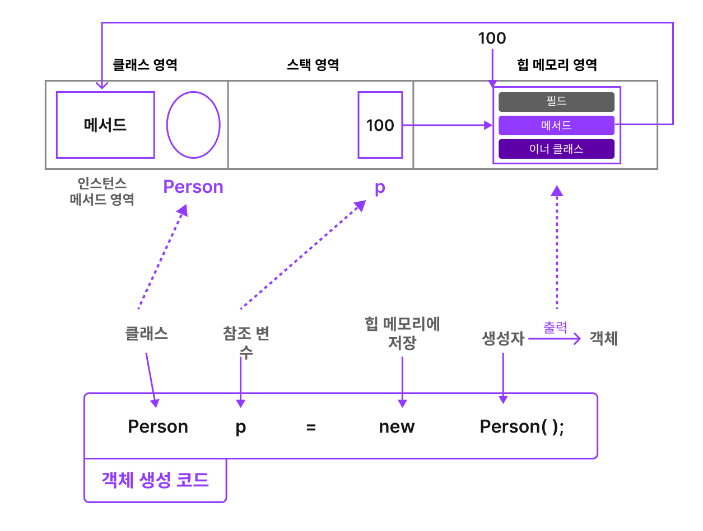
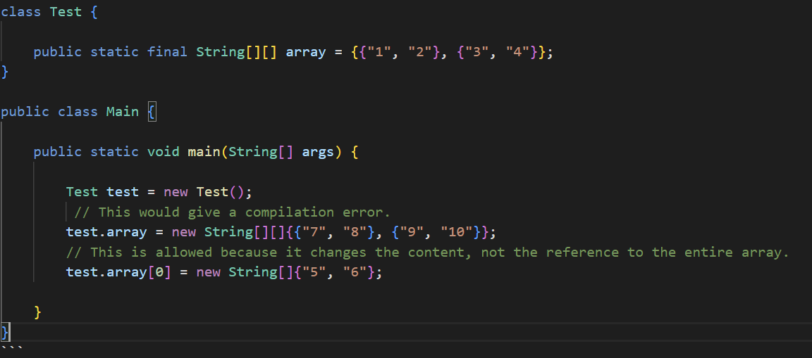

# 객체지향 프로그래밍

객체지향 프로그래밍(OOP, Object Oriented Programming)은 세계는 이러한 객체들로 구성되어 있으며, 발생하는 모든 사건들은 이 객체들 간의 상호작용을 통해 발생한다는 전제로부터 출발합니다.

OOP 는 데이터와 코드로 이루어진 객체라는 개념에 기초하고 있으며, 데이터는 필드라는 형식으로, 코드는 메서드라는 형식으로 표현됩니다.

# 클래스

클래스는 객체를 생성하는 하나의 틀입니다. 즉, 객체 그 자체가 아니라 단지 객체를 생성하는 데 사용되는 하나의 틀입니다.

이렇게 **클래스를 통해 생성된 객체**를 우리는 해당 클래스의 **인스턴스(instance)**라 부릅니다. 또한 클래스로부터 객체를 만드는 과정을 우리는 **인스턴스화(instantiate)**라 지칭합니다.

실 객체와 인스턴스는 같은 말이라 차이를 두는 것에 큰 의미는 없으며, 따라서 이 두 용어를 혼용하여 사용할 수 있습니다.

그럼에도, 조금 엄격하게 두 용어를 구분해 보자면, **객체는 모든 인스턴스를 포괄하는 넓은 의미**를 가지고 있는 반면, **인스턴스는 해당 객체가 어떤 클래스로부터 생성된 것인지를 강조**한다는 데 그 차이가 있다고 할 수 있습니다.

**클래스의 구성요소**

클래스의 구성요소는 크게 네가지로, **필드(field)**, **메서드(method)**, **생성자(constructor)**, 그리고 **이너 클래스(inner class)**입니다.

```java
public class ExampleClass {
	int x = 10; // (1)필드
	void printX() {...} // (2)메서드
	ExampleClass {...} // (3)생성자
	class ExampleClass2 {...} // (4)이너 클래스
} 
```

(1) **필드** - 클래스의 속성을 나타내는 변수입니다. 자동차로 예를 들면 모델명, 컬러, 바퀴의 수 등이 포함될 수 있습니다.

(2) **메서드** - 클래스의 기능을 나타내는 함수입니다. 자동차를 예로 들면 시동하기, 가속하기, 정지하기 등이 포함될 수 있습니다.

(3) **생성자** - 클래스의 객체를 생성하는 역할을 합니다. 뒤의 내용에서 좀 더 자세히 학습하도록 합니다.

(4) **이너 클래스** - 클래스 내부의 클래스를 의미합니다.

# 객체

클래스는 개별 객체(인스턴스)를 만들기 위한 설계도이며, 클래스를 통해 만들어진 객체가 실제로 사용할 수 있는 실체입니다.

체는 크게 **속성**과 **기능**이라는 두 가지 구성요소로 이뤄져 있습니다.

속성과 기능은 각각 **필드**와 **메서드**로 정의되는데, 일반적으로 하나의 객체는 다양한 속성과 기능의 집합으로 이뤄져 있습니다. 그리고 이러한 속성과 기능은 이너클래스와 함께 객체의 **멤버(member)**라 부릅니다.

**객체의 생성**

객체의 생성은 다음과 같이 **`new` 키워드**를 사용하여 다음과 같이 실제 객체를 생성할 수 있습니다. 

```java
class CarTest {
	public static void main(String[] args) {

	Car bmw = new Car(); // Car 클래스를 기반으로 생성된 bmw 인스턴스
	Car tesla = new Car(); // Car 클래스를 기반으로 생성된 tesla 인스턴스
	Car audi = new Car(); // Car 클래스를 기반으로 생성된 audi 인스턴스
}
```

**생성 과정(메모리)**

`Car bmw = new Car();`

1. 특정 클래스가 선언되면 해당 인스턴스를 참조하기 위한 참조변수가 선언됩니다. bmw 는 해당 참조변수를 가리킵니다.
2. new 키워드는 생성된 객체를 힙메모리에 들어가도록 합니다.
3. 생성된 객체 Car() 은 실제 데이터로, 힙 메모리에 저장이 되고 bmw 는 해당 힙메모리 주소를 가르키게 됩니다.



**객체 활용**

```java
public class Car {
	public String model;
	public String color;
	
	public Car(String model, String color){
		this.model = model;
		this.color = color;
	}
	
	 void power() { // 메서드 선언
        System.out.println("시동을 걸었습니다.");
    }

    void accelerate() {
        System.out.println("더 빠르게!");
    }

    void stop(){
        System.out.println("멈춰!!");
}

public class CarTest {
    public static void main(String[] args) {
        Car tesla = new Car("Model 3", "빨강"); // 객체 생성. 

        System.out.println("내 차의 모델은 " + tesla.model + "이고 " + "색은 " + tesla.color + "입니다."); // 필드 호출
        tesla.power(); // 메서드 호출
        tesla.accelerate();
        tesla.stop();
    }
}
```

필드 활용 : [클래스 변수명.필드이름] 으로 사용합니다. (`tesla.model`)

메서드 활용 : [클래스 변수명.메서드이름] 으로 사용합니다. (`tesla.power()`)

# 필드

필드는 클래스에 포함된 변수입니다.

변수는 크게 **클래스 변수(cv, class variable)**, **인스턴스 변수(iv, instance variable)**, 그리고 **지역 변수(lv, local variable)**라는 세 가지로 구분될 수 있습니다.

```java
class Example { // => 클래스 영역
	int instanceVariable; // 인스턴스 변수
	static int classVariable; // 클래스 변수(static 변수, 공유변수)

	void method() { // => 메서드 영역
		int localVariable = 0; // 지역 변수. {}블록 안에서만 유효
	}
}
```

**인스턴스 변수**는 개별 인스턴스마다 고유한 속성을 가지는 변수입니다. `new 생성자()`를 통해 인스턴스가 생성될 때 만들어집니다.

**클래스 변수**는 독립적인 저장 공간을 가지는 인스턴스 변수와 다르게 공통된 저장공간을 공유합니다. 따라서 클래스 변수는 인스턴스 변수와 달리 인스턴스를 따로 생성하지 않고도 언제라도 `[클래스명.클래스변수명]` 을 통해 사용 가능합니다.

**지역변수**는 메서드 내에 선언되며 메서드 내(`{} 블록`)에서만 사용가능한 변수입니다.

이중 필드는 **인스턴스 변수와 클래스 변수**를 말합니다. 필드는 어떠한 데이터를 저장하기 위한 역할을 담당하며 클래스 내부의 생성자와 메소드 밖에 정의가 됩니다.

## 필드의 특징

필드의 경우 다른 지역변수들과 다르게 초기화를 하지 않아도 기본값이 자동으로 초기화 된다는 특징을 가지고 있습니다. String의 경우 null, int의 경우 0으로 초기화 됩니다.

필드 선언은 다음과 같이 합니다.

```java
[access_modifier] [static] [final] type name [= initial value] ;
```

필드를 선언할 때는 접근 제어자(access_modifier), static 여부, final 여부, 필드의 타입, 필드의 이름을 정해줘야 합니다. (해당 내용은 아래에 있습니다. 접근 제어자는 method 에서 확인해주세요.)

필드 선언은 중괄호 블록 어디서든 존재할 수 있습니다. 생성자 선언과 메소드 선언의 앞, 뒤 어디서든 필드 선언이 가능합니다. 하지만 생성자와 메소드 중괄호 블록 내부에서는 선언될 수 없으며, 생성자와 메소드 중괄호 내부에 선언된 것은 모두 로컬 변수로 필드라고 하지 않습니다.

다음은 필드의 초기값입니다.

|   분류   |            데이터 타입             | 초기값 |
| :------: | :--------------------------------: | :----: |
| 정수타입 |                byte                |   0    |
|   char   |          \u0000(빈 공백)           |        |
|  short   |                 0                  |        |
|   int    |                 0                  |        |
|   long   |                 oL                 |        |
| 실수타입 |               float                |  0.0F  |
|  double  |                0.0                 |        |
| 논리타입 |              boolean               | false  |
| 참조타입 | 배열클래스 (String 포함)인터페이스 |  null  |


## static

`static`은 클래스의 멤버(필드, 메서드, 이너 클래스)에 사용하는 키워드입니다. `static` 키워드가 붙어있는 멤버를 우리는 **‘정적 멤버(static member)’**라고 부르고 `static`이 붙어있지 않은 인스턴스 변수와 구분합니다.

다음과 같은 특징 2가지를 가집니다.

1. static field 는 객체 간 공유 변수의 성질이 있습니다. 
2. static method 의 경우 인스턴스 변수 또는 인스턴스 메서드를 사용할 수 없습니다.

다음은 static 사용 예시입니다.

```java
class Car {

    public String instanceVariable = "instance";
    public static String staticVariable = "static";

    public void instanceMethod() {
        System.out.println(this.instanceVariable);
        System.out.println(staticVariable);
    }

    public static void staticMethod() {
        //System.out.println(instanceVariable); -> error because static methods can't access instance variables
        System.out.println(staticVariable);

    }

}

public class Main {

    public static void main(String[] args) {

        Car car1 = new Car();
        Car car2 = new Car();

        car1.staticVariable = "i'm a static variable";
        car2.instanceVariable = "i'm an instance variable";

        System.out.println(car1.staticVariable);
        System.out.println(car2.staticVariable);
        System.out.println(Car.staticVariable);

        System.out.println(car1.instanceVariable);
        System.out.println(car2.instanceVariable);
        //System.out.println(Car.instanceVariable); -> error because instance variables can't be called from the class


        car1.instanceMethod();
        car2.instanceMethod();

        car1.staticMethod();
        car2.staticMethod();
        Car.staticMethod();
        //Car.instanceMethod(); -> error because static methods can't be called from the class

    }
}
```

1. static method 안에는 instance  field  가 들어갈 수 없습니다. `staticMethod()` 참고
2. instance variable 은 클래스로부터 얻을 수 없습니다. 인스턴스에서만 얻을 수 있습니다. `Car.instanceVariable` 참고
3. instance method 는 클래스로부터 얻을 수 없습니다. 인스턴스에서만 얻을 수 있습니다. `instanceMethod()` 참고

## final

final 키워드는 변하지 않는 값입니다. 즉, 한번 선언되면 클래스나 인스턴스 내에서 계속 그 값을 유지합니다. final 은 static 과 사용된다면 변하지 않는 공통된 값으로서 constant 역할을 수행하게 됩니다. 다음과 같이 사용할 수 있습니다.

**static 키워드가 없을 때**

static 이 없다면 개별 instance 마다 각각의 value 를 가지게 되며, 처음 선언할 때 주입받게 됩니다. 따라서 final 필드를 주입받는 생성자가 없다면 컴파일 에러가 나게 됩니다.

```java
public class Customer {

    final String field1 = "Fixed Value";

}
```

**static 키워드가 있을 때**

static 키워드가 있다면 상수와 같이 취급되며 클래스 내에서 다음과 같이 반드시 초기화되어야 합니다.

```java
//선언부에서 함께 초기화
class MyClass {
    public static final String MESSAGE = "Hello, World!";
}

//static initializer block 에서 초기화
class MyClass {
    public static final String MESSAGE;

    static {
        MESSAGE = "Hello, World!";
    }
}

//다음과 같이 생성자 주입으로 초기화하지 못합니다. (컴파일 에러)
class MyClass {
    public static final String MESSAGE;

    public MyClass(MESSAGE){
    	this.MESSAGE = MESSAGE;
	}
}
```

static final 은 생성자 주입으로 선언하지 못합니다.

## Array 가 final 일 때

array 와 같이 참조값이 다른 참조값을 가리키고 있는 경우 새로운 array 로 변경하는 건 불가능하지만 array 내부 배열의 값은 변경가능합니다. 

예시입니다. (리터럴이 계속 에러로 블로그에 안올려져서 이미지로 대체했습니다.)



- main 메서드의 첫번째 test.array 와 같이 array 에 다른 배열을 넣는 것은 컴파일 에러가 납니다.
- 하지만 test.array 안의 배열 하나를 변경하는 건 정상적으로 작동합니다. 왜냐하면 array 의 참조값을 변경하는 게 아니라 array 내부 배열은 `{"1", "2"}` 의 참조값을 변경하는 것이기 때문입니다.

# 메서드

메서드는 **“특정 작업을 수행하는 일련의 명령문들의 집합"**을 의미하며, 앞서 본 것처럼 클래스의 기능에 해당하는 내용들을 담당합니다.

메서드는 다시 크게 머리에 해당하는 **메서드 시그니처(method signature)**와 몸통에 해당하는 **메서드 바디(method body)**로 구분할 수 있습니다.

```java
접근제어자 반환타입 메서드명(매개 변수) { // 메서드 시그니처
	메서드 내용 // 메서드 바디
}
```


## Access Modifier (접근 제어자)

access Modifier 는 어떤 클래스가 주어진 클래스와 필드, 생성자, 메서드에 접근할 수 있는지 지정합니다. 

**public Access Modifier**

public Access Modifier 는 모든 코드들이 클래스, 필드, 메서드, 생성자에 접근할 수 있습니다.


**private Access Modifier**

private 으로 선언되면 같은 클래스 내에서만 접근할 수 있습니다. 해당 값은 외부 클래스나, 자식 클래스(subclass) 에서 접근 불가능합니다. 클래스 자체는 private 으로 설정할 수 없는데, 그 이유는 클래스를 private 으로 설정하면 클래스를 사용하지 않겠다는 것과 같은 의미이기 때문입니다.

```java
public class Clock {
    private long time = 0;
}
```

다음과 같이 Constructor 에도 private 을 사용할 수 있습니다. 이 때는 클래스 내부에서만 해당 constructor 를 사용한다는 의미입니다.

```java
public class Clock {

    private long time = 0;

    //해당 constructor 는 아래의 생성자에서 사용됨
    private Clock(long time) {
        this.time = time;
    }

    public Clock(long time, long timeOffset) {
        this(time);
        this.time += timeOffset;
    }

    public static Clock newClock() {
        return new Clock(System.currentTimeMillis());
    }

}
```


**default Access Modifier**

default Access Modifier 는 어떠한 Access Modifier 도 선언하지 않음으로써 선언됩니다. 이 값은 해당 클래스나 동일 패키지 내의 클래스에서 접근할 수 있습니다. 따라서 이 Access Modifier 는 package Access Modifier 라고도 불립니다.

Subclass (자식 클래스) 도 superclass(부모 클래스) 와 같은 패키지에 있는게 아니면 default Access Modifier 에 접근할 수 없습니다. 

```java
public class Clock {
    long time = 0;
}

//Clock 과 동일한 패키지라고 가정
public class ClockReader {
    Clock clock = new Clock();

    public long readClock{
        return clock.time;
    }
}
```


**protected Access Modifier**

protected Access Modifier 은 default Access Modifier 와 같은 접근 제어를 하지만, subclass 에서도 접근할 수 있는 차이점이 있습니다. 

```java
//package A
public class Clock {
    protected long time = 0;    // time in milliseconds
}

//another package
public class SmartClock() extends Clock{

    public long getTimeInSeconds() {
        return this.time / 1000;
    }
}
```


## parameter (매개변수)

파라미터는 메서드가 값을 받을 수 있게 하여 해당 값으로 동작하도록 합니다. 

```java
public void writeText(String text1, String text2) {
    System.out.print(text1);
    System.out.print(text2);
}
```

**Parameters vs. Variables**

parameter 는 변수와 비슷합니다. 값을 읽을 수 있고 변경할 수도 있습니다. 다음과 같습니다.

```java
public MyClass{

    public void writeText(String text1, String text2) {
        System.out.print(text1);    // read value of text1 parameter.
        System.out.print(text2);    // read value of text2 parameter.

        text1 = "new value 1";      // change value of text1
        text2 = "new value 2";      // change value of text2
    }
}
```

> 주의 : parameter 의 값을 메서드 내부에서 변경가능하지만, 코드에 혼동을 주기 때문에 조심해야 합니다. 로컬 변수를 설정하여 parameter 를 받고, 해당 로컬 변수를 조작하는 게 낫습니다. 그리고 parameter 는 손대지 않은 채로 놔둡니다.

**Final Parameter**

parameter 도 variable 처럼 Final 키워드를 설정할 수 있습니다. 즉, 만약 parameter 가 특정 object 의 참조값이면, 그 참조값은 변경할 수 없지만 object 내부의 값들은 값들은 변경 가능합니다. 아래와 같습니다.

```java
public void writeText(final String text1, final Car car1) {
	//text1 변경 불가능, compilation error
	text1 = "another text"; --> compilation error
    //car1 변경 불가능, compoliation error
    car1 = new Car(); --> compilation error
    //car1 내부는 변경 가능
    car1.model = "another model"

}
```

## Local variables

메서드 안에 지역변수를 선언할 수 있습니다. 해당 지역변수는 오직 메서드 안에서만 접근 가능합니다. 다음과 같이 사용할 수 있습니다.

```java
public void writeText() {
    int localVariable1 = 1;
    int localVariable2 = 2;

    System.out.println( localVariable1 + localVariable2 );
}
```

지역변수 또한 final 선언이 가능합니다.


## 메서드 오버로딩(Method Overroading)

**메서드 오버로딩**이란 **하나의 클래스 안에 같은 이름의 메서드를 여러 개 정의하는 것**을 의미합니다. 

즉,  **같은 이름의 메서드명**을 써줘야 하고, **매개변수의 개수나 타입이 다르게 정의되어야** 합니다. 다음과 같습니다.

```java
public class Overloading {
    public static void main(String[] args) {
        Shape s = new Shape(); // 객체 생성
 
        s.area(); // 메서드 호출
        s.area(5);
        s.area(10,10);
        s.area(6.0, 12.0);
    }
}

class Shape {
    public void area() { // 메서드 오버로딩. 같은 이름의 메서드 4개.
        System.out.println("넓이");
    }
    public void area(int r) {
        System.out.println("원 넓이 = " + 3.14 * r * r);
    }

    public void area(int w, int l) {
        System.out.println("직사각형 넓이 = " + w * l);
    }

    public void area(double b, double h) {
        System.out.println("삼각형 넓이 = " + 0.5 * b * h);
    }
}

//출력값
넓이
원 넓이 = 78.5
직사각형 넓이 = 100
삼각형 넓이 = 36.0
```

오버로딩의 장점은 **하나의 메서드로 여러 경우의 수를 해결할 수 있다**는 것입니다.
