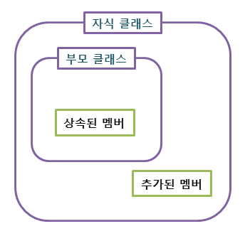

<div class="notice--danger">
   four fundamental OOP concepts : Inheritance, Encapsulation, Polymorphism, Abstraction
</div>

# 상속(Inheritance)

상속은 기존의 클래스를 사용하여 새로운 클래스를 작성하는 자바 문법 요소입니다.상속을 하는 superclass 와 상속을 받는 subclass 가 있습니다.

 

보통 상속을 설명할 때, 다음과 같이 superclass 로 Person, subclass 로 Programmer, Dancer 와 같은 직업으로 예를 들 수 있습니다.

```java
class Person {
    String name;
    int age;

    void learn(){
        System.out.println("공부를 합니다.");
    };
    void walk(){
        System.out.println("걷습니다.");
    };
    void eat(){
        System.out.println("밥을 먹습니다.");
    };
}

class Programmer extends Person { // Person 클래스로부터 상속. extends 키워드 사용 
    String companyName;

    void coding(){
        System.out.println("코딩을 합니다.");
    };
}

class Dancer extends Person { // Person 클래스로부터 상속
    String groupName;

    void dancing(){
		    System.out.println("춤을 춥니다.");
		};
}
```

이러한 상속은 코드 중복을 피하고, 비슷한 속성은 비슷하게 만들기 위해 사용됩니다.


## 포함(composite)

포함 관계는 클래스의 필드로 다른 클래스 타입의 참조변수를 선언하는 것입니다.

```java
class Car {
	String name;
	int price;
	Company comany;
	
	...
}

class Company {
	String companyName;
	String discountPolicy;
}
```

예시를 만들어보긴 했는데요. Car 클래스가 Company 클래스를 포함하고 있습니다.

**상속(inheritance) vs 포함(composite)**

inheritance 는 IS-A 관계이고 composite 는 HAS-A 관계입니다. 상속(확장) 된다는 것은 서로 간에 `is` 로 표현할 수 있습니다.(programmer is person). 포함된다는 것은 상위 클래스가 하위 클래스를 가지고 있다는 것입니다. (Car has Company, 각각의 자동차마다 고유의 회사가 있죠.)


## 메서드 오버라이딩(Method Overriding)

**메서드 오버라이딩(Method Overriding)**은 **상위 클래스로부터 상속받은 메서드와 동일한 이름의 메서드를 재정의하는 것**을 의미합니다.

```java
public class Main {
    public static void main(String[] args) {
        Bike bike = new Bike();
 
        bike.run();
        
    }
}

class Vehicle {
    void run() {
        System.out.println("Vehicle is running");
    }
}

class Bike extends Vehicle {
    void run() {
        super.run() //사용하지 않아도 된다.
        System.out.println("Bike is running");
    }
}
/* 
output
Vehicle is running
Bike is running
*/
```

오버라이딩을 위해선 다음 조건을 만족해야 합니다.

	1. 메서드의 선언부(메서드 이름, 매개 변수, 반환 타입)가 상위클래스의 그것과 완전히 일치해야 한다.
	1. 접근 제어자의 범위가 상위 클래스의 메서드보다 같거나 넓어야 한다.
	1. 예외는 상위 클래스의 메서드보다 많이 선언할 수 없다.


## super 키워드와 super()

super 는 superclass 를 호출하는 키워드입니다.

위의 예제를 변경해서 사용해보겠습니다.

```java
public class Main {
    public static void main(String[] args) {
        Bike bike = new Bike();
 
        bike.run();
        
    }
}

class Vehicle {
	int price = 100;
	
	Vehicle(){
        System.out.println("Vehicle is created");
	};

    void run() {
        System.out.println("Vehicle is running");
    }
}

class Bike extends Vehicle {

	int price = 1000;
	
	Bike(){
		System.out.println("Bike is created")
	}
	
    //이게 없어도 
    void run() {
        super.run()
        System.out.println("Bike is running");
    }
    
    void getPrice(){
        System.out.println("superclass price = " + super.price);
        System.out.println("subclass price = " + this.price);
    }
}
/* 
output
Vehicle is created
Bike is created
Vehicle is running
Bike is running
superclass price is : 100
subclass price is : 1000
*/
```

- 다음과 같이 super 를 통해서 생성자, 필드, 매서드 등을 overriding 합니다.
- 생성자 Bike() 를 호출했을 때 super 생성자가 없다면 기본적으로 superclass 의 default 생성자를 호출하게 됩니다. (`Super()`)
  - 따라서 `super()` 호출 결과인 `Vehicle is created` 가 먼저 호출되고, `Vehicle is created` 가 호출됩니다.
- `run()` 메서드로 `super.run()` 을 호출하고 `this.run()` 을 호출합니다.
- `getPrice()` 메서드로 `super.price` 를 호출하고 이후 `this.price` 를 호출합니다.


## Object 클래스

object 클래스는 모든 클래스가 상속을 받아 사용합니다. 즉, 클래스 상속도의 최상위에 Object 클래스가 있습니다. class 를 만들 때 `extends` 를 사용하지 않는다면 Default 로 `extends Object` 가 들어가게 됩니다.

Object 는 다음과 같은 기본 기능들을 제공합니다.

| 메서드명           | 반환 타입 | 주요 내용                                                    |
| ------------------ | --------- | ------------------------------------------------------------ |
| toString()         | String    | 객체 정보를 문자열로 출력                                    |
| equals(Object obj) | boolean   | 등가 비교 연산(==)과 동일하게 스택 메모리값을 비교           |
| hashCode()         | int       | 객체의 위치정보 관련. Hashtable 또는 HashMap에서 동일 객체여부 판단 |
| wait()             | void      | 현재 스레드 일시정지                                         |
| notify()           | void      | 일시정지 중인 스레드 재동작                                  |


# 캡슐화(Encapsulation)

**캡슐화**란 **특정 객체 안에 관련된 속성과 기능을 하나의 캡슐(capsule)로 만들어 데이터를 외부로부터 보호하는 것**을 말합니다.

이렇게 캡슐화를 해야 하는 이유는 크게 두 가지로 첫째는 **데이터 보호의 목적**이고, 둘째로 **내부적으로만 사용되는 데이터에 대한 불필요한 외부 노출을 방지**하기 위함입니다.

이러한 Encapsulation 은 Access modifier, package, getter/setter 로 구현할 수 있습니다.

**To achieve Encapsulation** 

- 변수를 private 으로 선언
- 변수 수정 및 읽기를 위한 public getter/setter 선

**Access modifier**

접근 제어자는 이전 포스팅에 설명해놨습니다. [[codestates\] 클래스, 객체, 필드, 메서드](https://hobeen-kim.github.io/til-codestates/codestates-클래스,-객체,-필드,-메서드/) 

접근 제어자를 통해서 어느 패키지, 어느 클래스에서 접근 가능한 멤버인지 설정할 수 있습니다.

**Package**

패키지는 **특정한 목적을 공유하는 클래스와 인터페이스의 묶음**입니다. 

위 Access modifier 중 default access modifier 를 사용할 수 있는 단위입니다.

## Getter, Setter

getter 와 setter 는 access modifier 로 접근이 제한되어 캡슐화의 목적이 달성되면서도 값을 읽기 및 수정을 필요로 할 때 사용됩니다.

**setter** 는 외부에서 메서드에 접근하여 조건에 맞을 경우 데이터 값을 변경할 수 있게 합니다.

getter 는 외부에서 해당 메서드로 데이터를 읽는 데 사용합니다. 경우에 따라 객체 외부에서 필드 값을 사용하기에 부적절한 경우가 발생할 수 있는데 이런 경우에 그 값을 가공한 이후에 외부로 전달하는 역할을 하게 됩니다.

***setter와 getter 메서드를 활용하면 데이터를 효과적으로 보호하면서도 의도하는 값으로 값을 변경하여 캡슐화를 보다 효과적으로 달성할 수 있습니다.***

## 캡슐화 정리

캡슐화는 외부로의 노출, 수정 등을 방지하기 위해 access modifier 를 통해 보호하는 것이며 getter, setter 를 통해 값에 접근할 수 있도록 하는입니다.


# 마치며

extends(inheritance), private/getter/setter(encapsulation) 은 자주 사용했었는데, 이러한 개별적인 기능이 inheritance 나 encapsulation 을 구현하는 것이다, 라는 건 제대로 알지 못했습니다.

또한 subclass 에서 constructor를 만들 때 superclass 의 constructor 가 필요하다는 것도 오늘 알았구요.

역시 자바 기본이 부족하다는 걸 여실히 깨닫는 하루였습니다... ㅎㅎ