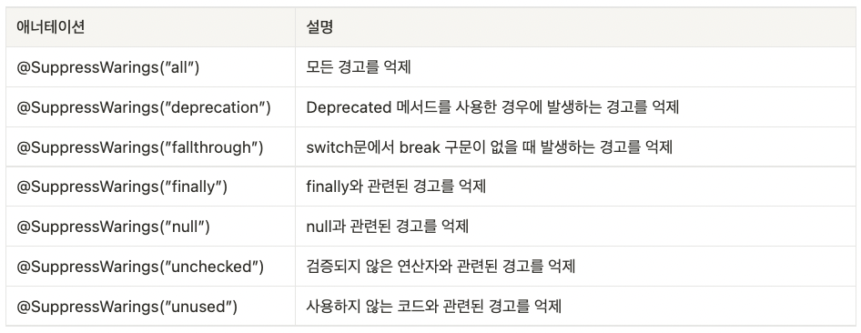
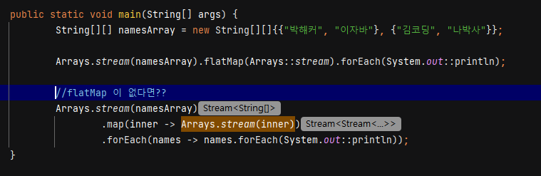

# 어노테이션

어노테이션은 **소스 코드가 컴파일되거나 실행될 때 컴파일러 및 다른 프로그램에게 필요한 정보를 전달해 주는 문법 요소**입니다.

JDK에서 기본적으로 제공하는 애너테이션은 아래의 두 가지로 구분됩니다.

- **표준 애너테이션** : JDK에 내장된 일반적인 애너테이션입니다.
- **메타 애너테이션** : 다른 애너테이션을 정의할 때 사용하는 애너테이션입니다.

표준 애너테이션은 앞서 살펴본 `@Override`와 같이 다른 문법 요소에 붙여서 사용하는 일반적인 애너테이션을 의미하며, 메타 애너테이션은 애너테이션을 직접 정의해서 사용할 때 사용하는 애너테이션입니다.

## 표준 애너테이션

**@Override**

`@Override`는 메서드 앞에만 붙일 수 있는 애너테이션으로, 선언한 메서드가 상위 클래스의 메서드를 오버라이딩하거나 추상 메서드를 구현하는 메서드라는 것을 컴파일러에게 알려주는 역할을 수행합니다.

**@Deprecated**

`@Deprecated`는 기존에 사용하던 기술이 다른 기술로 대체되어 기존 기술을 적용한 코드를 더 이상 사용하지 않도록 유도하는 경우에 사용합니다.

**@SuppressWarnings**

`@SuppressWarnings` 어노테이션은 컴파일 경고 메시지가 나타나지 않도록 합니다. 아래와 같이 `@SuppressWarnings` 뒤에 괄호를 붙이고 그 안에 억제하고자 하는 경고메시지를 지정해 줄 수 있습니다.

 

**@FunctionalInterface**

`@FunctionalInterface` 어노테이션은 함수형 인터페이스를 선언할 때, 컴파일러가 함수형 인터페이스의 선언이 바르게 선언되었는지 확인하도록 합니다. 만약 바르게 선언되지 않은 경우, 에러를 발생시킵니다.

## 메타 어노테이션

**메타 어노테이션(meta-annotation)**은 **어노테이션정의하는 데에 사용되는 어노테이션**으로, 어노테이션적용 대상 및 유지 기간을 지정하는 데에 사용됩니다.

**@Target**

`@Target` 어노테이션은 이름 그대로 어노테이션적용할 **“대상"**을 지정하는 데 사용됩니다. 아래와 같이 `@Target` 어노테이션을 사용하여 지정할 수 있는 대상의 타입이 있습니다.

| 대상 타입       | 적용 범위                        |
| --------------- | -------------------------------- |
| ANNOTATION_TYPE | 애너테이션                       |
| CONSTRUCTOR     | 생성자                           |
| FIELD           | 필드(멤버변수, 열거형 상수)      |
| LOCAL_VARIABLE  | 지역변수                         |
| METHOD          | 메서드                           |
| PACKAGE         | 패키지                           |
| PARAMETER       | 매개변수                         |
| TYPE            | 타입(클래스, 인터페이스, 열거형) |
| TYPE_PARAMETER  | 타입 매개변수                    |
| TYPE_USE        | 타입이 사용되는 모든 대상        |

예를 들어 @Target(Element.Method) 로 하면 메서드에 적용되는 어노테이션입니다.

**@Documented**

`@Documented` 어노테이션은 어노테이션에 대한 정보가 **javadoc으로 작성한 문서에 포함되도록 하는 어노테이션 설정**입니다.

자바에서 제공하는 표준 어노테이션과 메타 어노테이션 중 `@Override`와 `@SuppressWarnings`를 제외하고는 모두 `@Documented`가 적용되어 있습니다.

**@Inherited**

`@Inherited` 어노테이션은 이름에서도 알 수 있듯이 **하위 클래스가 어노테이션을 상속**받도록 합니다. `@Inherited` 어노테이션을 상위 클래스에 붙이면, **하위 클래스도 상위 클래스에 붙은 어노테이션들이 동일하게 적용**됩니다.

```java
@Inherited // @SuperAnnotation이 하위 클래스까지 적용
@interface SuperAnnotation{ }

@SuperAnnotation
class Super { }

class Sub extends Super{ } // Sub에 애너테이션이 붙은 것으로 인식
```

**@Retention**

`@Retention` 어노테이션도 이름 그대로 특정 **어노테이션의 지속 시간**을 결정하는 데 사용합니다. 어노테이션과 관련한 유지 정책(retention policy)의 종류에는 다음의 **세 가지**가 있습니다.

| 유지 정책 | 설명                                            |
| --------- | ----------------------------------------------- |
| SOURCE    | 소스 파일에 존재, 클래스파일에는 존재하지 않음  |
| CLASS     | 클래스 파일에 존재, 실행 시에 사용 불가, 기본값 |
| RUNTIME   | 클래스 파일에 존재, 실행 시에 사용가능          |

@override 를 보겠습니다.

```java
@Target(ElementType.METHOD)
@Retention(RetentionPolicy.SOURCE) 
//오버라이딩이 제대로 되었는지 컴파일러가 확인하는 용도 
//클래스 파일에 남길 필요 없이 컴파일 시에만 확인하고 사라짐
public @interface Override(){ }
```

위의 예제에서 `Override` 어테이션은 컴파일러가 사용하면 끝나기 때문에, 실행 시에는 더 이상 사용되지 않음을 의미합니다.


**@Repeatable**

`@Repeatable` 어노테이션은 **어노테이션을 여러 번 붙일 수 있도록 허용**한다는 의미가 있습니다.

사용자 타입의 어노테이션`Work`를 정의하고, `@Repeatable` 어노테이션을 사용하여 이것을 여러 번 사용할 수 있도록 하였습니다.

```java
@Repeatable(Works.class) // Work 애너테이션을 여러 번 반복해서 쓸 수 있게 한다.  
@interface Work{  
    String value();  
}
```

이제 아래와 같이 Work 어노테이션을 여러 번 사용할 수 있습니다.

```java
@Work("코드 업데이트")  
@Work("메서드 오버라이딩")  
class Main{  
	... 생략 ...
}
```

`@Repeatable` 어노테이션은 일반적인 어노테이션과 달리 같은 이름의 어노테이션이 여러 번 적용될 수 있기 때문에, 이 어노테이션들을 하나로 묶어주는 어노테이션도 별도로 작성해야 합니다. 아래와 같습니다.

```java
@interface Works {  // 여러 개의 Work애너테이션을 담을 컨테이너 애너테이션 Works
    Work[] value(); 
}

@Repeatable(Works.class) // 컨테이너 애너테이션 지정 
@interface Work {
	String value();
}
```


# lambda

람다 함수는 다음과 같이 메서드 타입, 이름을 생략할 수 있습니다. 따라서 람다함수를 종종 이름이 없는 함수, 즉 **익명 함수(anonymous function)**라 부르기도 합니다.

다음과 같이 사용할 수 있습니다.

```java
int sum(int num1, int num2) {
	return num1 + num2;
}
//축약 1
(int num1, int num2) -> { // 반환타입과 메서드명 제거 + 화살표 추가
	return num1 + num2;
}

//실행문이 1개 일 때 대괄호 축약 가능
(int num1, int num2) -> num1 + num2

//매개변수 타입을 함수형 인터페이스를 통해 유추할 수 있는 경우, 매개변수의 타입을 생략
(num1, num2) -> num1 + num2
```


**함수형 인터페이스**

람다식은 이름이 없는 익명 객체입니다. 익명 객체는 익명 클래스를 통해 만들 수 있는데, **익명 클래스**란 **객체의 선언과 생성을 동시에 하여 오직 하나의 객체를 생성하고, 단 한 번만 사용되는 일회용 클래스**입니다.

이러한 익명 클래스를 만들어주기 위해 자바의 **함수형 인터페이스(Functional Interface)** 를 사용합니다.

다음과 같습니다.

```java
@FunctionalInterface
public interface MyFunctionalInterface {
    int accept(int x, int y);
}

public class MyFunctionalInterfaceExample {

    public static void main(String[] args) throws Exception {

        MyFunctionalInterface example;

        example = (x, y) -> {
            int result = x + y;
            return result;
        };
        int result1 = example.accept(2, 5);
        System.out.println(result1);
        

        example = (x, y) -> { return x + y; };
        int result2 = example.accept(2, 5);
        System.out.println(result2);
       

        example = (x, y) ->  x + y;
        //return문만 있으면, 중괄호 {}와 return문 생략 가능
        int result3 = example.accept(2, 5);
        System.out.println(result3);
       

        example = (x, y) -> sum(x, y);
        //return문만 있으면, 중괄호 {}와 return문 생략 가능
        int result4 = example.accept(2, 5);
        System.out.println(result4);
 
    }

    public static int sum(int x, int y){
        return x + y;
    }
}
/*
출력값
7
7
7
7
*/
```


## 메서드 레퍼런스

메서드 참조는 람다식에서 **불필요한 매개변수를 제거**할 때 주로 사용합니다. 다음과 같이 사용할 수 있습니다.

```
(left, right) -> Math.max(left, right)
// 클래스이름::메서드이름
Math :: max // 메서드 참조
```


**정적 메서드와 인스턴스 메서드 참조**

`클래스 :: 메서드` : 정적 메서드를 참조할 때는 클래스 이름 뒤에 `::` 기호를 붙이고 정적 메서드 이름을 기술하면 됩니다. 

`참조 변수 :: 메서드` : 인스턴스 메서드의 경우에는 먼저 객체를 생성한 다음 참조 변수 뒤에 `::`기호를 붙이고 인스턴스 메서드 이름을 기술하면 됩니다. 

**생성자 참조**

메서드 참조는 생성자 참조도 포함합니다. 생성자를 참조한다는 것은 객체 생성을 의미합니다. 단순히 메서드 호출로 구성된 람다식을 메서드 참조로 대치할 수 있듯이, 단순히 객체를 생성하고 리턴하도록 구성된 람다식은 생성자 참조로 대치할 수 있습니다.

```java
(a,b) -> new 클래스(a,b)
//생성자 참조 문법
클래스 :: new
```


# 스트림

스트림(Stream) 은 **배열 및 컬렉션의 저장 요소를 하나씩 참조해서 람다식으로 처리할 수 있도록 하는 반복자**입니다.

다음과 같은 특징을 가집니다.

1. 스트림 처리 과정은 생성, 중간 연산, 최종 연산 세 단계의 파이프라인으로 구성될 수 있습니다.
2. 스트림은 원본 데이터 소스를 변경하지 않습니다(read-only).
3. 스트림은 일회용입니다(onetime-only).
4. 스트림은 내부 반복자입니다.

## 스트림 생성

**배열 스트림 생성**

- `Arrays.stream()`, `Stream.of()` : 배열을 데이터 소스로 스트림을 생성합니다.

  ```java
  public static void main(String[] args) {
             String[] arr = new String[]{"김코딩", "이자바", "박해커"};
     
             Arrays.stream(arr).forEach(System.out::println);
             Stream.of(arr).forEach(System.out::println);
         }
     }
  ```

- IntStream 은 추가적인 기능을 제공합니다. (sum, average 등)

  ```java
  public class StreamCreator {
  
      public static void main(String[] args) {
  
          // int형 배열로 스트림 생성
          int[] intArr = {1,2,3,4,5,6,7};
          IntStream intStream = Arrays.stream(intArr);
  
          // 숫자와 관련된 경우 intStream을 사용하는 것을 권장
          System.out.println("sum=" + intStream.sum());
          
          intStream = Arrays.stream(intArr);
          System.out.println("average=" + intStream.average());
  
      }
  }
  ```


**컬렉션 스트림 생성**

컬렉션 타입(List, Set 등)의 경우, 컬렉션의 최상위 클래스인 `Collection`에 정의된 `stream()` 메서드를 사용하여 스트림을 생성할 수 있습니다. 따라서 **`Collection`으로부터 확장된 하위클래스 `List`와 `Set`을 구현한 컬렉션 클래스들은 모두 `stream()` 메서드를 사용하여 스트림을 생성**할 수 있습니다.

아래처럼 생성합니다.

```java
import java.util.Arrays;
import java.util.List;
import java.util.stream.Stream;

public class StreamCreator {

    public static void main(String[] args) {
				// 요소들을 리스트
        List<Integer> list = Arrays.asList(1, 2, 3, 4, 5, 6, 7);
        Stream<Integer> stream = list.stream();

        stream.forEach(System.out::print);
    }
}

//출력값
1234567
```


**임의의 수 스트림 생성**

난수를 생성하는 자바의 기본 내장 클래스 `Random` 클래스 안에는 해당 타입의 난수들을 반환하는 스트림을 생성하는 메서드들이 정의되어 있습니다.

```java
import java.util.Random;
import java.util.stream.IntStream;

public class StreamCreator {

    public static void main(String[] args) {

        IntStream ints1 = new Random().ints(5);
        IntStream ints2 = new Random().ints().limit(5); 
        ints1.forEach(System.out::println);
        ints2.forEach(System.out::println);
    }
}
```

`IntStream`과 `LongStream`에 정의된 `range()` 나 `rangeClosed()` 메서드를 사용하면 다음과 같이 특정 범위의 정수값을 스트림으로 생성해서 반환하는 것도 가능합니다.

```java
import java.util.stream.IntStream;

public class StreamCreator {

    public static void main(String[] args) {

        //특정 범위의 정수
        IntStream intStream = IntStream.rangeClosed(1, 10);
        intStream.forEach(System.out::println);
    }
}

/*
출력값
12345678910
*/
```


## 스트림 중간 연산

### **필터링(`filter()` , `distinct()` )**

- **`distinct()`** : Stream의 요소들에 중복된 데이터가 존재하는 경우, **중복을 제거**하기 위해 사용합니다.
- **`filter()`**: Stream에서 **조건에 맞는 데이터만을 정제**하여 더 작은 컬렉션을 만들어냅니다. filter() 메서드에는 매개값으로 조건(Predicate)을 주고, 조건이 참이 되는 요소만 필터링합니다. 여기서 **조건은 람다식을 사용하여 정의**할 수 있습니다.

다음과 같이 사용합니다.

```java
 public static void main(String[] args) throws Exception {

        List<String> names = Arrays.asList("김코딩", "이자바", "박해커", "김코딩", "박해커");

        names.stream()
                .distinct() //중복 제거
                .forEach(System.out::println);
        System.out.println();

        names.stream()
                .filter(element -> element.startsWith("김")) // 김씨 성을 가진 요소만 필터링
                .forEach(System.out::println);
        System.out.println();

        names.stream()
                .distinct() //중복제거
                .filter(element -> element.startsWith("김")) // 김씨 성을 가진 요소만 필터링
                .forEach(System.out::println);
    }
```

### 매핑(`map()`)

매핑은 스트림 내 요소들에서 **원하는 필드만 추출하거나 특정 형태로 변환**할 때 사용하는 중간 연산자입니다. 

```java
import java.util.Arrays;
import java.util.List;

public class IntermediateOperationExample {
    public static void main(String[] args) {
        List<String> names = Arrays.asList("kimcoding", "javalee", "hackerna", "luckyguy");
        names.stream()
                .map(element -> element.toUpperCase()) // 요소들을 하나씩 대문자로 변환
                .forEach(element->System.out.println(element));
        
        List<Integer> list = Arrays.asList(1, 3, 6, 9);
        // 각 요소에 3을 곱한 값을 반환
        list.stream().map(number -> number * 3).forEach(System.out::println);
    }
}

/*
KIMCODING
JAVALEE
HACKERNA
LUCKYGUY
3
9
18
27
*/
```

**flatMap()**

 flatMap 은 중첩 구조를 제거하고 단일 컬렉션(`Stream<String>`)으로 만들어주는 역할을 합니다.



- 만약 flatMap 이 없다면 중첩 구조를 풀기 위해 아래처럼 번거롭게 반복해서 Stream 을 생성해야 합니다.

### 정렬(`sorted()`)

`sorted()` 메서드는 이름처럼 **정렬할 때 사용**하는 중간 연산자입니다.

```java
public class IntermediateOperationExample {
    public static void main(String[] args) {
        // 동물들의 이름을 모아둔 리스트 
        List<String> animals = Arrays.asList("Tiger", "Lion", "Monkey", "Duck", "Horse", "Cow");
				
        // 인자값 없는 sort() 호출
        animals.stream().sorted().forEach(System.out::println);
        //역순 정렬
        // 인자값에 Comparator 인터페이스에 규정된 메서드 사용
        animals.stream().sorted(Comparator.reverseOrder()).forEach(System.out::println);
    }
}
```

### 기타

- **`skip()`** - 스트림의 일부 요소들을 건너뜁니다.

  ```java
  public static void main(String[] args) {
      
          // 1~10 범위의 정수로 구성된 스트림 생성
          IntStream intStream = IntStream.rangeClosed(1, 10);
  
          // 앞의 5개의 숫자를 건너뛰고 숫자 6부터 출력
          intStream.skip(5).forEach(System.out::println);
      }
  ```

- **`limit()`** - 스트림의 일부를 자릅니다.

  ```java
  public class IntermediateOperationExample {
      public static void main(String[] args) {
  
          // 1~10 범위의 정수로 구성된 스트림 생성
          IntStream intStream = IntStream.rangeClosed(1, 10);
  
          // 앞에서부터 5개의 숫자만 출력
          intStream.limit(5).forEach(System.out::println);
      }
  }
  ```

- **`peek()`** - `forEach()`와 마찬가지로, **요소들을 순회하며 특정 작업을 수행**합니다. `forEach()`와의 핵심적인 차이는 중간 연산자인지의 여부입니다. `peek()`는 중간 연산자이기 때문에 여러 번 연결하여 사용할 수 있지만, `forEach()`는 최종 연산자이기 때문에 마지막에 단 한 번만 사용할 수 있습니다. 이러한 `peek()`의 특성 때문에 주로 코드의 에러를 찾기 위한 디버깅(debugging) 용도로 종종 활용됩니다.

  ```java
  public static void main(String[] args) {
  
      // 요소들을 사용하여 IntStream 생성
      IntStream intStream3 = IntStream.of(1, 2, 2, 3, 3, 4, 5, 5, 7, 7, 7, 8);
  
      // 짝수만 필터링하여 합계 구하기
      int sum = intStream3.filter(element -> element % 2 == 0)
              .peek(System.out::println)
              .sum();
  
      System.out.println("합계 = " + sum);
  }
  ```


## 스트림 최종 연산

### 기본 집계(`sum()` , `count()` , `average()`, `max()` , `min()`)

```java
import java.util.Arrays;

public class TerminalOperationExample {
    public static void main(String[] args) {
        // int형 배열 생성
        int[] intArray = {1,2,3,4,5};

        // 카운팅
        long count = Arrays.stream(intArray).count();
        System.out.println("intArr의 전체 요소 개수 " + count);

        // 합계
        long sum = Arrays.stream(intArray).sum();
        System.out.println("intArr의 전체 요소 합 " + sum);

        // 평균
        double average = Arrays.stream(intArray).average().getAsDouble();
        System.out.println("전체 요소의 평균값 " + average);

        // 최대값
        int max = Arrays.stream(intArray).max().getAsInt();
        System.out.println("최대값 " + max);

        // 최소값
        int min = Arrays.stream(intArray).min().getAsInt();
        System.out.println("최소값 " + min);

        // 배열의 첫 번째 요소 
        int first = Arrays.stream(intArray).findFirst().getAsInt();
        System.out.println("배열의 첫 번째 요소 " + first);
    }
}
```

위에서 보듯, sum(), count() 는 long 타입, average() 는 OptionalDouble, max(), min(), findFirst()은 OptionalInt 로 반환됩니다.


### 매칭(`allMatch()`, `anyMatch()`, `noneMatch()` )

`match()` 메서드를 사용하면 **조건식 람다 `Predicate`를 매개변수로 넘겨 스트림의 각 데이터 요소가 특정한 조건을 충족하는지 않는지 검사하여, 그 결과를 `boolean` 값으로 반환**합니다. 

**`match() 메서드`**는 크게 다음의 3가지 종류가 있습니다.

- `allMatch()` - 모든 요소가 조건을 만족하는지 여부를 판단합니다.
- `noneMatch()` - 모든 요소가 조건을 만족하지 않는지 여부를 판단합니다.
- `anyMatch()` - 하나라도 조건을 만족하는 요소가 있는지 여부를 판단합니다.

```java
import java.util.Arrays;

public class TerminalOperationExample {
    public static void main(String[] args) throws Exception {
        // int형 배열 생성
        int[] intArray = {2,4,6};

        // allMatch()
        boolean result = Arrays.stream(intArray).allMatch(element-> element % 2 == 0);
        System.out.println("요소 모두 2의 배수인가요? " + result);

        // anyMatch()
        result = Arrays.stream(intArray).anyMatch(element-> element % 3 == 0);
        System.out.println("요소 중 하나라도 3의 배수가 있나요? " + result);

        // noneMatch()
        result = Arrays.stream(intArray).noneMatch(element -> element % 3 == 0);
        System.out.println("요소 중 3의 배수가 하나도 없나요? " + result);
    }

}

// 출력값
요소 모두 2의 배수인가요? true
요소 중 하나라도 3의 배수가 있나요? true
요소 중 3의 배수가 하나도 없나요? false
```

### 요소 소모(`reduce()`)

`educe()` 최종 연산자는 **스트림의 요소를 줄여나가면서 연산을 수행하고 최종적인 결과를 반환**합니다.

사실 스트림의 최종 연산은 모두 요소를 소모하여 연산을 수행하지만, `reduce()` 메서드의 경우에는 먼저 첫 번째와 두 번째 요소를 가지고 연산을 수행하고, 그 결과와 다음 세 번째 요소를 가지고 또다시 연산을 수행하는 식으로 연산이 끝날 때까지 반복합니다.

```java
public class TerminalOperationExample {
    public static void main(String[] args) throws Exception {
        int[] intArray = {1,2,3,4,5};

        // sum()
        long sum = Arrays.stream(intArray).sum();
        System.out.println("intArray 전체 요소 합: " + sum);

        // 초기값이 없는 reduce()
        int sum1 = Arrays.stream(intArray)
                .map(element -> element * 2)
	                .reduce((a , b) -> a + b)
                .getAsInt();
        System.out.println("초기값이 없는 reduce(): " + sum1);

        // 초기값이 있는 reduce()
        int sum2= Arrays.stream(intArray)
                .map(element -> element * 2)
                .reduce(5, (a ,b) -> a + b);
        System.out.println("초기값이 있는 reduce(): " + sum2);
    }
}

/*
출력값
intArray 전체 요소 합: 15
초기값이 없는 reduce(): 30
초기값이 있는 reduce(): 35
*/
```


### 요소 수집(`collect()`)

`collect()` 메서드는 **`Collector` 인터페이스 타입의 인자**를 받아서 처리할 수 있는데, 직접 구현하거나 미리 제공된 것들을 사용할 수 있습니다. 참고로, 빈번하게 사용되는 기능들은 `Collectors` 클래스에서 제공하고 있습니다.

```java
import java.util.Arrays;
import java.util.List;
import java.util.Map;
import java.util.stream.Collectors;

public class TerminalOperationExample {

    public static void main(String[] args) {
        // Student 객체로 구성된 배열 리스트 생성 
        List<Student> totalList = Arrays.asList(
                new Student("김코딩", 100, Student.Gender.Male),
                new Student("박해커", 80, Student.Gender.Male),
                new Student("이자바", 90, Student.Gender.Female),
                new Student("나미녀", 60, Student.Gender.Female)
        );
        
        // 스트림 연산 결과를 Map으로 반환
        Map<String, Integer> maleMap = totalList.stream()
                .filter(s -> s.getGender() == Student.Gender.Male)
                .collect(Collectors.toMap(
                        student -> student.getName(), // Key
                        student -> student.getScore() // Value
                ));

        // 출력
        System.out.println(maleMap);
        
        // 스트림 연산 결과를 List으로 반환
        List<String> list = totalList.stream()
                        .filter(s -> s.getGender() == Student.Gender.Male)
                        .map(Student::getName)
                        .collect(Collectors.toList());

        // 출력
        System.out.println(list);
    }
}

class Student {
    public enum Gender {Male, Female};
    private String name;
    private int score;
    private Gender gender;

    public Student(String name, int score, Gender gender) {
        this.name = name;
        this.score = score;
        this.gender = gender;
    }

    public String getName() {
        return name;
    }

    public int getScore() {
        return score;
    }

    public Gender getGender() {
        return gender;
    }
}

/*
출력값
{김코딩=100, 박해커=80}
[김코딩, 박해커]
*/
```

