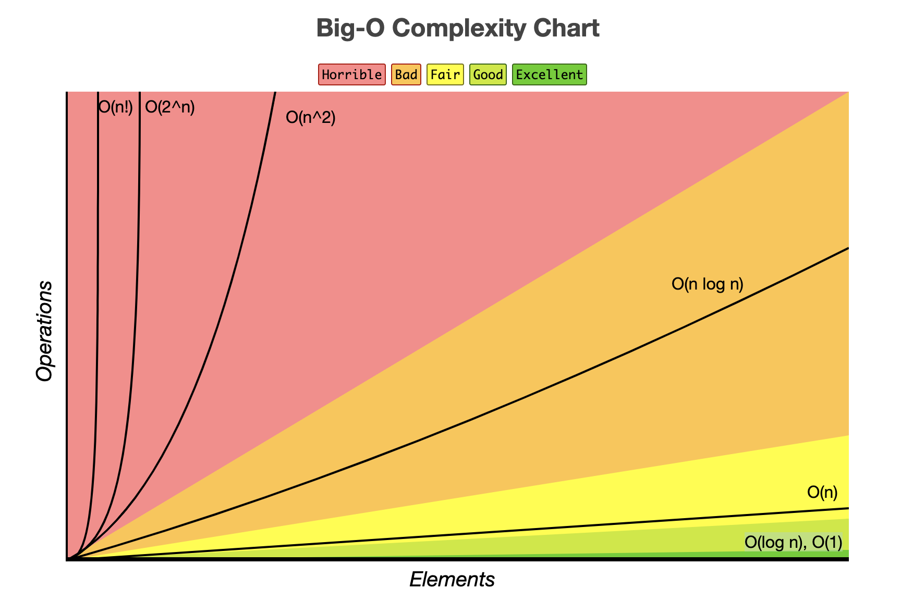

# 시간복잡도

<div class="notice--danger">
    <a href="https://hobeen-kim.github.io/cs/자료구조-Ch-3.-알고리즘의-성능/">[자료구조] ch3. 알고리즘의 성능
</a>
    <br/>
    <b> 
위 링크는 '쉽게 배우는 자료구조 with 자바 (문병로)' 내용 중 일부입니다. 시간 복잡도는 해당 포스팅에 없는 내용만 적었습니다.</b>
</div>

​	시간 복잡도의 3가지 표현방법(Big-O, Big-Ω, Big-θ) 중 Big-O 표기법이 가장 자주 사용됩니다. 빅오 표기법은 최악의 경우를 고려하므로, 프로그램이 실행되는 과정에서 소요되는 최악의 시간까지 고려할 수 있기 때문입니다. 

시간복잡도의 일반적인 수행시간 비교는 다음과 같습니다.
$$
O(1) < O(log N) < O(N) < O(N^2) < O(C^n) < O(N!)
$$



# Greedy

​	Greedy Algorithm(탐욕 알고리즘)은 말 그대로 선택의 순간마다 당장 눈앞에 보이는 최적의 상황만을 쫓아 최종적인 해답에 도달하는 방법입니다. Greedy 는 다음 2가지 조건을 만족해야 합니다.

- 탐욕적 선택 속성(Greedy Choice Property) : 앞의 선택이 이후의 선택에 영향을 주지 않습니다.
- 최적 부분 구조(Optimal Substructure) : 문제에 대한 최종 해결 방법은 부분 문제에 대한 최적 문제 해결 방법으로 구성됩니다.

​	예를 들어 1760원을 동전으로 거슬러준다고 하겠습니다. 이 경우 가장 적은 수의 동전으로 거슬러주려면 어떻게 해야 할까요? 먼저 500원짜리부터 채워나갈 것입니다. 500원 3개를 선택한다면 이제 260원에 대한 거스름돈을 계산해야 합니다. 최종적으로 500원 3개, 100원 2개, 50원 1개, 10원 1개가 될 것입니다.


## Coin Change Algorithm

​	하지만 위 상황처럼 각 동전이 배수의 관계가 아닐 수도 있습니다. 예를 들어 1, 4, 5, 6 달러 동전이 있다고 가정하고, 14달러를 거슬러주는 상황을 보겠습니다. 위에서 살펴본 Greedy 로는 다음과 같이 됩니다.

6달러 2개 -> 5달러 x -> 4달러 x -> 1달러 2개 : 총 4개

​	위의 경우에서처럼 최소 개수는 4개일까요? 아닙니다. 5달러 2개, 4달러 1개으로 3개이 더 최소입니다. 이처럼 Greedy 와 비슷한 문제라도 Greedy 의 2가지 조건을 만족하지 않는다면 최적의 해를 보장할 수 없습니다. 

​	그렇다면 해당 문제는 어떻게 풀까요? 여기에 어울리는 알고리즘인 Coin Change (동전 교환) 알고리즘이 있습니다.

|      | 0    | 1    | 2    | 3    | 4    | 5    | 6    | 7    | 8    | 9    | 10   | 11   | 12   | 13   | 14   |
| ---- | ---- | ---- | ---- | ---- | ---- | ---- | ---- | ---- | ---- | ---- | ---- | ---- | ---- | ---- | ---- |
| arr  | 0    |      |      |      |      |      |      |      |      |      |      |      |      |      |      |

​	위의 표는 `int[] arr = new[14 + 1];` 을 선언한 배열을 나타낸 것입니다. 여기서 `arr[i]` 의 값은 i 금액을 거슬러주는데 사용된 최소 동전의 개수입니다. 예를 들어 arr[1] = 1 이면, 1달러를 거슬러주는데 사용된 최소 동전 개수는 1개라는 뜻입니다. 

이제 경우를 4가지로 나누어서 생각해보겠습니다. 경우를 나누는 이유는 차근차근 올라가야만 이해할 수 있기 때문입니다.

### 동전을 1가지만 사용할 때(1달러)

|      | 0    | 1    | 2    | 3    | 4    | 5    | 6    | 7    | 8    | 9    | 10   | 11   | 12   | 13   | 14   |
| ---- | ---- | ---- | ---- | ---- | ---- | ---- | ---- | ---- | ---- | ---- | ---- | ---- | ---- | ---- | ---- |
| arr1 | 0    | 1    | 2    | 3    | 4    | 5    | 6    | 7    | 8    | 9    | 10   | 11   | 12   | 13   | 14   |

동전을 1가지만 사용했을 때는 i 달러를 거슬러주기 위해서 i 개를 사용해야 합니다.

### 동전을 2가지 사용할 때(1, 4달러)

|        | 0    | 1    | 2    | 3    | 4    | 5    | 6    | 7    | 8    | 9    | 10   | 11   | 12   | 13   | 14   |
| ------ | ---- | ---- | ---- | ---- | ---- | ---- | ---- | ---- | ---- | ---- | ---- | ---- | ---- | ---- | ---- |
| arr1   | 0    | 1    | 2    | 3    | 4    | 5    | 6    | 7    | 8    | 9    | 10   | 11   | 12   | 13   | 14   |
| arr1,4 | 0    |      |      |      |      |      |      |      |      |      |      |      |      |      |      |

​	arr1,4 라는 변수명은 못만들지만, 이해하기 쉽게 적었습니다. arr1 은 1달러만 사용할 때, arr1,4 는 1, 4달러를 사용할 때 입니다.

먼저 3달러를 거슬러줄 때까지는 arr1 과 똑같습니다. 4달러 자체를 못쓰니깐요.

|        | 0    | 1    | 2    | 3    | 4    | 5    | 6    | 7    | 8    | 9    | 10   | 11   | 12   | 13   | 14   |
| ------ | ---- | ---- | ---- | ---- | ---- | ---- | ---- | ---- | ---- | ---- | ---- | ---- | ---- | ---- | ---- |
| arr1   | 0    | 1    | 2    | 3    | 4    | 5    | 6    | 7    | 8    | 9    | 10   | 11   | 12   | 13   | 14   |
| arr1,4 | 0    | 1    | 2    | 3    | 1    |      |      |      |      |      |      |      |      |      |      |

​	이제 4달러 이상부터는 '비교' 를 해야 합니다. arr1[4] 는 4 지만, arr1,4[4] 는 1입니다. 4달러 동전 1개로 가능하니까요. 그렇게 7 까지는 4달러 1개 + 1달러 n 개로 증가합니다.

​	이렇게 증가한다는 걸 다르게 표현하면 `i 달러의 최소 동전 개수 = i - 4 달러의 최소 동전 개수 + 1` 입니다. 즉, 4달러의 최소 동전 개수는 `0달러의 최소 동전 개수 + 1 개` 라는 거죠

사실 글로 이해하기 어렵기 때문에 직접해봐야 합니다. 다 채우면 아래와 같이 됩니다.

|        | 0    | 1    | 2    | 3    | 4    | 5    | 6    | 7    | 8    | 9    | 10   | 11   | 12   | 13   | 14   |
| ------ | ---- | ---- | ---- | ---- | ---- | ---- | ---- | ---- | ---- | ---- | ---- | ---- | ---- | ---- | ---- |
| arr1   | 0    | 1    | 2    | 3    | 4    | 5    | 6    | 7    | 8    | 9    | 10   | 11   | 12   | 13   | 14   |
| arr1,4 | 0    | 1    | 2    | 3    | 1    | 2    | 3    | 4    | 2    | 3    | 4    | 5    | 3    | 4    | 5    |

### 동전을 3가지 사용할 때

이제 5달러도 있을 때를 보겠습니다.

|          | 0    | 1    | 2    | 3    | 4    | 5    | 6    | 7    | 8    | 9    | 10   | 11   | 12   | 13   | 14   |
| -------- | ---- | ---- | ---- | ---- | ---- | ---- | ---- | ---- | ---- | ---- | ---- | ---- | ---- | ---- | ---- |
| arr1     | 0    | 1    | 2    | 3    | 4    | 5    | 6    | 7    | 8    | 9    | 10   | 11   | 12   | 13   | 14   |
| arr1,4   | 0    | 1    | 2    | 3    | 1    | 2    | 3    | 4    | 2    | 3    | 4    | 5    | 3    | 4    | 5    |
| arr1,4,5 | 0    | 1    | 2    | 3    | 1    | 1    | 2    | 3    | 2    | 2    | 2    | 3    | 3    | 3    | 3    |

​	arr1,4,5[8] 을 보겠습니다. arr1,4 에서 설명한대로 하면 `arr1,4,5[8] = arr1,4,5[3] + 1` 로, 4가 되어야 합니다. 이 경우는 1달러 3개 + 5달러 1개로 총 4개입니다. 하지만 4달러 2개로 하는게 더 최소입니다. 즉 arr1,4,5[8] 은 `arr1,4[8]` 과 `arr1,4,5[3] + 1` 의 값 중 최소값을 선택하는 겁입니다.

### 동전을 4가지 사용할 때

이제 6달러도 있을 때를 보겠습니다.

|            | 0    | 1    | 2    | 3    | 4    | 5    | 6    | 7    | 8    | 9    | 10   | 11   | 12   | 13   | 14   |
| ---------- | ---- | ---- | ---- | ---- | ---- | ---- | ---- | ---- | ---- | ---- | ---- | ---- | ---- | ---- | ---- |
| arr1       | 0    | 1    | 2    | 3    | 4    | 5    | 6    | 7    | 8    | 9    | 10   | 11   | 12   | 13   | 14   |
| arr1,4     | 0    | 1    | 2    | 3    | 1    | 2    | 3    | 4    | 2    | 3    | 4    | 5    | 3    | 4    | 5    |
| arr1,4,5   | 0    | 1    | 2    | 3    | 1    | 1    | 2    | 3    | 2    | 2    | 2    | 3    | 3    | 3    | 3    |
| arr1,4,5,6 | 0    | 1    | 2    | 3    | 1    | 1    | 1    | 2    | 2    | 2    | 2    | 2    | 2    | 3    | 3    |

​	마지막으로 arr1,4,5,6[14] 를 보겠습니다. arr1,4,5,6[14] 는 `arr1,4,5,6[8] + 1` 과 `arr1,4,5[14]` 값 중 최소값으로 3 입니다.

### 구현

이제 해당 알고리즘을 구현해보겠습니다.

```java
public int count(int[] coins, int change) {
    //coins = {1, 4, 5, 6}
    //change = 14
    int[] dp = new int[change + 1];
    dp[0] = 1;
    for(int i = 0; i <= change; i++){
        dp[i] = Integer.MAX_VALUE;
    }

    for(int coin : coins){
        for(int i = coin; i <= change; i++){
            dp[i] += Math.min(dp[i], dp[i - coin] + 1);
        }
    }

    return dp[change];
}
```

- `int[] dp = new int[change + 1];` : dp 의 i 번째 값은 i 달러를 만들 때의 최소동전 개수입니다. 위의 예시에서 int[] arr1,4,5,6 이라고 볼 수 있습니다. 개수는 dp[change] 까지 있어야 하므로 1을 더해줍니다.
- dp 의 첫번째 값은 1, 나머지는 Integer.MAX_VALUE 로 넣습니다. 아니면 적당히 큰 값으로 넣어도 됩니다. dp 의 값과 비교해서 최소값을 넣어야 하기 때문입니다. 0 으로 초기화를 하면 `Math.min(dp[i], dp[i - coin]);` 이 항상 0 이겠죠.
- `for(int coin : coins)` : coin 을 하나씩 돌면서 dp 를 초기화합니다. coin = 1 일 때 arr1 이 만들어집니다. coin = 4 일 때 arr1,4 가 만들어집니다. 최종적으로 coin = 6 일 때 arr1,4,5,6 이 만들어집니다.
- `return dp[change];` 최종적으로 원하는 값입니다.

## Coin Change Algorithm 경우의 수 모두 구하기

​	이제는 최적의 해가 아닌, 모든 경우의 수의 개수를 구해보겠습니다. **1, 4, 5, 6달러 동전이 있을 때 14달러를 거슬러주기 위한 경우의 수는 몇 개인지 구하는 것**입니다. 마찬가지로 동전을 1개 사용할 때부터 보겠습니다. 

### 동전을 1가지만 사용할 때

|      | 0    | 1    | 2    | 3    | 4    | 5    | 6    | 7    | 8    | 9    | 10   | 11   | 12   | 13   | 14   |
| ---- | ---- | ---- | ---- | ---- | ---- | ---- | ---- | ---- | ---- | ---- | ---- | ---- | ---- | ---- | ---- |
| arr1 | 1    | 1    | 1    | 1    | 1    | 1    | 1    | 1    | 1    | 1    | 1    | 1    | 1    | 1    | 1    |

​	동전을 1달러만 사용한다면 모든 돈에 대해 1달러의 조합으로만 거슬러줄 수 있습니다. 따라서 경우의 수는 모두 1가지입니다. arr[0] 은 1 로 초기화한 것입니다. 0달러를 거슬러주는 경우도 1가지니까요.(아예 주지 않는 경우)

### 동전을 2가지 사용할 때

|        | 0    | 1    | 2    | 3    | 4    | 5    | 6    | 7    | 8    | 9    | 10   | 11   | 12   | 13   | 14   |
| ------ | ---- | ---- | ---- | ---- | ---- | ---- | ---- | ---- | ---- | ---- | ---- | ---- | ---- | ---- | ---- |
| arr1   | 1    | 1    | 1    | 1    | 1    | 1    | 1    | 1    | 1    | 1    | 1    | 1    | 1    | 1    | 1    |
| arr1,4 | 1    | 1    | 1    | 1    | 2    | 2    | 2    | 2    | 3    | 3    | 3    | 3    | 4    | 4    | 4    |

동전이 1, 4달러가 있다면 위와 같습니다. 3달러까지는 모두 경우의 수가 1로 똑같습니다. 4달러부터는 4달러 1개 or 1달러 4개로 경우의 수가 2가지입니다.

​	여기서 규칙을 발견해야 하는데요. 바로 arr1,4 에서 i 달러를 거슬러주기 위한 경우의 수는 arr1[i] + arr1,4[i-4] 라는 것입니다. 4달러를 예로 들어보면, arr1[4] = 1 처럼 1달러짜리 4개로 줄 수도 있구요. arr1,4[i-4] 처럼 0달러를 주는 경우에 4달러만 추가로 주면 되는 경우도 있습니다.

​	다시 8달러를 예로 들어보겠습니다. `arr1,4[8] = arr1[8] + arr1,4[8-4]` 입니다. 즉 arr1[8] 처럼 모두 1달러로 주는 경우와 arr1,4[4] 처럼 4달러를 주는 경우에서 4달러만 추가로 주는 경우입니다.

- arr1[8] : 1달러 + 1달러 + ... + 1달러 = 8달러
- arr1,4[4] 
  - arr1,4[4]의 경우의 수 첫 번째 : 4달러 1장 -> 여기서 4달러만 더하면 됨
  - arr1,4[4]의 경우의 수 두 번째 : 1달러 4장 -> 여기서 4달러만 더하면 됨

이렇게 해서 총 3가지 경우입니다.

### 최종적인 모습

|            | 0    | 1    | 2    | 3    | 4    | 5    | 6    | 7    | 8    | 9    | 10   | 11   | 12   | 13   | 14   |
| ---------- | ---- | ---- | ---- | ---- | ---- | ---- | ---- | ---- | ---- | ---- | ---- | ---- | ---- | ---- | ---- |
| arr1       | 1    | 1    | 1    | 1    | 1    | 1    | 1    | 1    | 1    | 1    | 1    | 1    | 1    | 1    | 1    |
| arr1,4     | 1    | 1    | 1    | 1    | 2    | 2    | 2    | 2    | 3    | 3    | 3    | 3    | 4    | 4    | 4    |
| arr1,4,5   | 1    | 1    | 1    | 1    | 2    | 3    | 3    | 3    | 4    | 5    | 6    | 6    | 7    | 8    | 9    |
| arr1,4,5,6 | 1    | 1    | 1    | 1    | 2    | 3    | 4    | 4    | 5    | 6    | 8    | 9    | 11   | 12   | 14   |

최종적으로 arr1,4,5,6[14] 가 14달러를 만들 수 있는 모든 경우의 수의 개수입니다.

### 구현

```java
public int count(int[] coins, int change) {
    //coins = {1, 4, 5, 6}
    //change = 14
    int[] dp = new int[change + 1];
    dp[0] = 1;

    for(int coin : coins){
        for(int i = coin; i <= change; i++){
            dp[i] += dp[i - coin];
        }
    }

    return dp[change];
}
```

