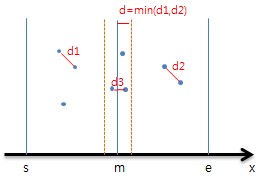
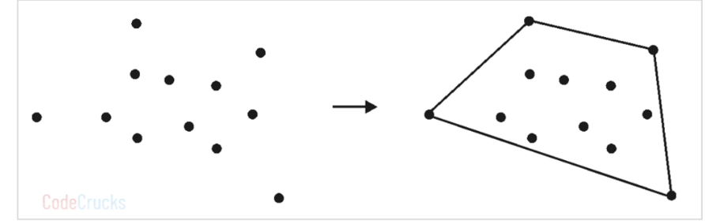
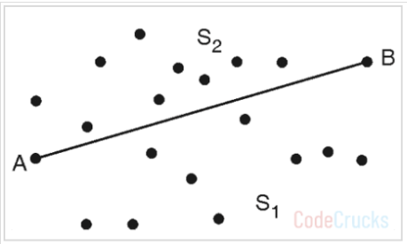
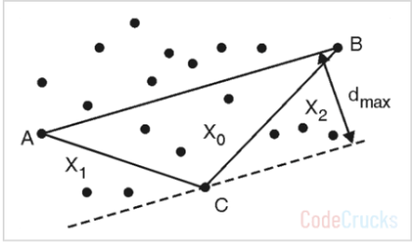
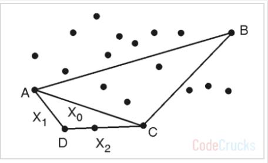
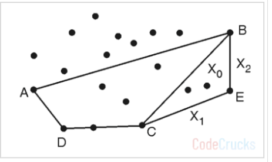
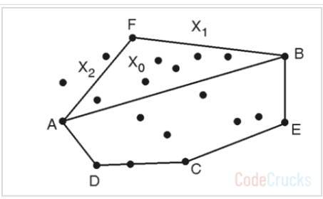
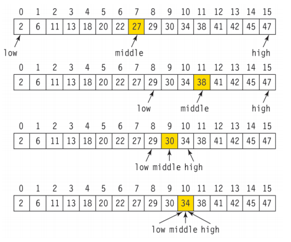

# Brute Force Algorithm (BFA, 완전 탐색 알고리즘)

​	BFA 는 무차별 대입 방법을 나타내는 알고리즘입니다. 따라서 순수하게 모든 경우의 수를 다 대입하여 문제를 해결하는 방법입니다. 따라서 공간복잡도와 시간복잡도의 요소를 고려하지 않습니다. 다음과 같은 경우에 사용됩니다.

- 프로세스 속도를 높이는 데 사용할 수 있는 다른 알고리즘이 없을 때
- 문제를 해결하는 여러 솔루션이 있고 각 솔루션을 확인해야 할 때

BFA 는 데이터의 크기가 커질수록 상당히 비효율적입니다. BFA 는 **순차 검색**, **문열 매칭**, **선택 정렬**, **버블 정렬** 등에 사용됩니다.

## Closet-Pair Problems

​	최근접 점의 쌍 찾기는 BFA 로 풀 수도 있지만 O(n^2) 으로 시간복잡도가 큽니다. 따라서 효율적인 방법은 **분할 정복**을 사용하는 것입니다. n 개의 점을 1/2 로 분할하여 각각의 부분문제에서 최근점 점의 쌍을 찾고, 2개의 부분해 중에서 가장 짧은 거리를 가진 점의 쌍을 찾습니다. 하지만 다음과 같은 경우가 있습니다.


절반으로 나눴을 때 나눠진 두 점 사이가 더 가까운 경우입니다. 따라서 해당 영역도 체크해줘야 합니다.

다음과 같은 배열이 있다고 생각해보겠습니다. (y 좌표는 무시)

| 0    | 1    | 2    | 3    | 4    | 5    | 6    | 7    | 8    | 9    |
| ---- | ---- | ---- | ---- | ---- | ---- | ---- | ---- | ---- | ---- |
| 1    | 13   | 17   | 25   | 27   | 28   | 30   | 37   | 45   | 56   |

이 배열을 중간에서 나눠서 각각의 최근접 점의 쌍을 찾은 후 좌우측 점을 비교해주겠습니다.

| 0    | 1    | 2    | 3    | 4    | 나누기 | 5    | 6    | 7    | 8    | 9    |
| ---- | ---- | ---- | ---- | ---- | ------ | ---- | ---- | ---- | ---- | ---- |
| 1    | 13   | 17   | 25   | 27   | <----> | 28   | 30   | 37   | 45   | 56   |

​	이렇게 해서 좌측 배열의 최근접 점의 쌍을 찾고, 우측 배열의 최근접 점의 쌍을 찾아서 더 거리가 짧은 최근접 점의 쌍을 반환하면 됩니다. 하지만 여기서 위에서 봤던 문제를 생각해봐야겠습니다. 좌측의 최근접 점의 쌍이나 우측의 최근접 점의 쌍보다 나누어진 점의 쌍이 더 가까울 수 있거든요. 

​	예를 들어서 우측 최근접 점의 쌍의 거리는 3, 4 인덱스의 2 고, 좌측은 5, 6 인덱스의 2 이지만 4, 5 인덱스의 거리는 1 입니다. 따라서 좌측의 최근점 점의 쌍, 우측의 최근점 점의 쌍, 나누어진 점 중 최근점 점의 쌍으로 총 3개를 비교해서 반환해야 합니다. 수도 코드로 작성하면 아래와 같습니다.

```
ClosestPair(S[1...n]):

	if(S.length <= 3)
		/* 최근점 점의 쌍을 구하는 로직*/
		
	S1 <- S[1...n/2];
	S2 <- S[n/2 + 1...n];
	
	CP1 <- ClosestPair(S1);
	CP2 <- ClosestPair(S2);
	
	d = min(dist(CP1), dist(CP2));
	
	new S3[]
	int j <- 0
	
	for i <- 0 to S.length
		if(|S[i] - n/2| < d)
			S3[j++] <- S[i]
			
    return min(CP1, CP2, ClosestPair(S3));
```

한번 분석해보겠습니다. 코드와 주석을 달겠습니다.

```
if(S.length <= 3)
		/* 최근점 점의 쌍을 구하는 로직*/
```

- S 의 크기가 3 이하이면 더 이상 나눌 수 없으니 최근접 점의 쌍을 리턴해줍니다.

```
S1 <- S[1...n/2];
S2 <- S[n/2 + 1...n];

CP1 <- ClosestPair(S1);
CP2 <- ClosestPair(S2);

d = min(dist(CP1), dist(CP2));
```

- 그게 아니라면 S 배열을 반으로 나눈 후 각각의 최근접 점의 쌍을 구해줍니다.
- 그리고 d 를 선언하여 각 최근접 점의 쌍 중 최소거리를 할당합니다.

```
new S3[]
int j <- 0

for i <- 0 to S.length
    if(|S[i] - n/2| < d)
        S3[j++] <- S[i]
```

- S3 를 선언한 후 중앙값에서의 거리가 d 보다 작은 점들을 모두 저장합니다.

```
return min(CP1, CP2, ClosestPair(S3));
```

- CP1, CP2, ClosestPair(S3) 중 가장 작은 값을 리턴합니다.

## Convex Hull using Divide and Conquer

> 아래 내용은 해당 사이트를 요약한 내용입니다. 필요한 부분만 발번역한거니 웬만하면 해당 사이트를 보는 걸 추천합니다... ㅎㅎ [Convex Hull using Divide and Conquer](https://codecrucks.com/convex-hull-using-divide-and-conquer/)

​	Convex hull 은 주어진 점들을 모두 포함하는 가장 작은 크기의 도형입니다. Convex polygon 은 각 꼭지점 각도가 항상 180도를 넘지 않는 다각형입니다. 그렇지 않다면 concave polygon 입니다. Complex polygons 은 선분이 교차하는 다각형입니다. 

*(a)Concave polygon (b) Convex polygon (c) Complex polygon*

​	점의 집합이 주어졌을 때 Convex polygon 을 찾는 문제가 바로 convex hull problem 입니다. 아래 그림과 같습니다.


### Brute Force Approach

​	Brute Force 접근법은 모든 선분의 경우를 수를 따지는 것입니다. 임의의 선분 AB 를 선택하는 경우의 수는 n(n-1)/2 입니다. 그리고 두 점을 제외한 모든 점이 한쪽에 몰아서 위치하는지 비교하는 경우는 n-2 입니다. 그래서 총 수행은 n(n-1)(n-2)/2 가 됩니다. 시간 복잡도는 O(n^3) 입니다.

### Divide and Conquer Approach

​	다음과 같은 집합에서 Convex Hull 을 찾는 과정을 분할 정복 접근법으로 해보겠습니다. Solution = 결과집합, X = 점의 집합 입니다. 점은 각각 x, y 값을 갖습니다.


1. 점의 집합을 x 값으로 정렬합니다. 동일할 경우 y 값으로 정렬합니다. 

2. 양 끝점을 잇는 선분 AB 와 BA 를 결과값으로 저장합니다. 방향성이 있는 건 아니지만 AB 기준으로 좌우측을 비교해주기 때문에 선분을 2개 저장합니다.
   

   - Solution = {AB, BA} 입니다.

3. AB 의 우측에 있는 영역인 S1 에서 가장 먼 점 C 를 찾습니다. 가장 멀다는 것은 C 와 직교할 때의 거리입니다. 그리고 각각의 AC, BC 로 나누어지는 점의 집합을 각각 X0, X1, X2 라고 합니다.
   

   - Solution = Solution - { AB } ∪ {AC, CB} 로, {BA, AC, CB} 입니다.
   - 이번에는 X1, X2 집합에 대해서만 신경쓰면 되기 때문에 아까와는 다르게 선분 당 1개씩만 저장해줍니다.

4. 이제 AC 선분을 기준으로 3번 작업을 반복합니다.
   

   - Solution = Solution - { AC } ∪ {AD, DC} 로, {BA, CB, AD, DC} 입니다.
   - 각각 AD, DC 선분에 대한 3번 작업을 해야하지만 X1, X2 의 집합이 공집합이므로 return 합니다.

5. CB 선분에 대해서도 3번~4번 작업을 반복해줍니다.
   

   - Solution = Solution - {CB} ∪ {BE, CE} 로, {BA, AD, DC, BE, CE} 입니다.

6. BA 선분에 대해서도 같은 작업을 반복합니다.
   

   - Solution = Solution - {BA} ∪ {BF, FA} 로, {BF, FA, AD, DC, BE, CE} 입니다.

   

이제 의사코드로 구현해보겠습니다. 제가 보기 편한대로 작성했습니다.

```
convexHull(Point[] P):  // P is a set of input Point class with x, y field

    P <- Sort By x and y
    Point[] Solution
    X1 ← Set of points right to the line AB  
    X2 ← Set of points right to the line BA 
    Solution.add(AB, BA) 

    FindHull(Solution, X1, A, B)
    FindHull(Solution, X2, B, A)
    
    return Solution


findHull(Solution, P, A, B):

    if isEmpty(P) then
        return
    else
        C ← Orthogonally farthest point from AB
        Solution.remove(AB)
        Solution.add(AC, CB)
        Point[] X0, X1, X2 <- points of each sides
      
        findHull(X1, A, C)
        findHull(X2, C, B)
```

- 결국 마지막에 findHull 메서드를 호출하며 재귀함수 형태로 진행됩니다.

​	시간 복잡도를 분석해보겠습니다. 먼저 x 로 정렬하는 시간 복잡도는 O(nlogn) 입니다. 그리고 최좌측, 최우측 점을 찾는 시간 복잡도는 O(1) 입니다.  n/2 씩 나눠졌을 때 각 선분에서 가장 먼 점을 각각 찾아야 합니다. 해당 작업은 각각 (n-2)/2 번 수행되므로 총 n-2 번 수행됩니다. 이 때 나눠진 각각의 선분에 대해 다시 가장 먼 점을 찾아야 합니다. 그러면 4개의 선분에서 먼 4개의 점을 찾으므로 (n-4)/2 번 수행됩니다. 따라서 최악의 경우에는 O(n^2)번 수행되는데, 이 경우는 모든 점에 선분이 연결된 형태입니다. 하지만 theta 나 omega 는 이진트리와 같은 형태가 되어 O(nlogn) 입니다.

> 그레이엄 스캔으로 푸는 방법은 정렬되어 있는 경우 O(n), 그렇지 않은 경우 O(nlogn) 의 시간복잡도를 가집니다. [볼록 껍질 그레이엄 스캔 (Convex Hull)](https://rebro.kr/14#recentEntries)

아래는 프로그래머스 문제인데 해당 알고리즘과 비슷해보여서 들고 왔습니다. 아직 풀어보지는 않았습니다.

[IU 와 콘의 보드게임](https://school.programmers.co.kr/learn/courses/30/lessons/1841)


# 이진 탐색 알고리즘(BSA, Binary Search Algorithm)

​	BSA 는 데이터가 정렬된 상태에서 절반씩 범위를 나눠 분할 정복기법으로 특정한 값을 찾아내는 알고리즘입니다. 먼저 중간값과 찾을 값을 비교한 뒤 찾을 값이 속한 집합에서 다시 분할정복을 실시합니다. 따라서 정렬되어 있다면 시간복잡도는 O(logn) 입니다. 시간복잡도는 작지만 데이터를 정렬하는 로직의 시간복잡도가 O(nlogn) 이므로 데이터의 양이 적다면 효율이 높지 않습니다.

아래는 이진 탐색으로 34 를 찾는 과정입니다.




