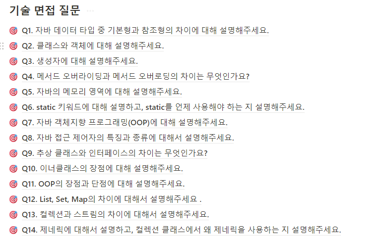

내일은 코드스테이츠 과정 중 기술 면접 시간인데요. 제가 국가취업지원제도 상담을 가야 해서 일정은 진행 못하게 됐습니다. 그래서 원래는 오늘 각 질문마다 3~4줄 씩 적으려고 했는데, 그것보다는 포스팅해야겠다고 전부터 마음먹은 primitive 와 Wrapper Class 에 대해서 얘기해보려고 합니다.


<center><i>질문 리스트입니다. 숙고가 필요한 질문도 있습니다.</i></center>

# Primitive Type

primitive type 은 자바 언어에 속한 기본적인 데이터 타입입니다. primitive type 은 더 복잡한 데이터 구조를 만들기 위한 근간이 됩니다. 즉, 모든 데이터의 기초란거죠. 총 8가지 타입이 있습니다.

- `boolean`: true, false. 1 bit.
- `byte`: from -128 to 127, 1byte.
- `short`: from -32,768 to 32,767, 2byte.
- `int`:  from -2,147,483,648 to 2,147,483,647, 4byte. 
  - 코딩테스트 시 무심코 int 로 선언했다가 값이 넘어가서 overflow 가 되는 경우가 왕왕 있습니다...
- `long` : from -9,223,372,036,854,775,808 to 9,223,372,036,854,775,807, 8byte.
- `float`: 4byte 부동소수점 (부호 1bit, 지수부 8bit, 가수부 23bit) / **2^23 인 8388608 이 최대 수입니다.**
- `double`: 8byte 부동소수점 (부호 1bit, 지수부 11bit, 가수부 52bit)
- `char`: 16-bit Unicode character. / ascii code 뿐만 아니라 unicode 까지 표현가능합니다.

**Primitive 특징**

밋밋한 primitive 에도... 특징이 있습니다.

1. default 값이 있습니다. 변수 선언 후 할당하지 않으면 기본값이 할당됩니다.
   - boolean (false)
   - byte, short, int, long, float, double 과 같은 numeric type (0)
   - char (\u0000) -> null 이 아닙니다. `char c = null` 이라고 하면 오류가 납니다.
2. 객체나 클래스가 아니기 때문에 메서드, 상속 등을 가지지 않습니다.

**Primitive 와 대되는 Wrapper 클래스**

아래에 설명할 거지만, Wrapper 클래스는 primitive type 을 객체화한 것으로, 각각의 primitive type 은 대응되는 Wrapper 가 있습니다.

| primitive type (기본형) | wrapper class (래퍼 클래스) |
| ----------------------- | --------------------------- |
| boolean                 | Boolean                     |
| char                    | Character                   |
| byte                    | Byte                        |
| short                   | Short                       |
| int                     | Integer                     |
| long                    | Long                        |
| float                   | Float                       |
| double                  | Double                      |

왜 int 와 char 만 단순히 대문자로 바뀌는 게 아닐까요? I 와 C 는 대소문자 구분이 잘 안돼서 그러는 거일까요?

-> 찾아본 결과 해당 이유도 맞구요. 다른 이유도 있는데요. Java 에서 class name 은 명사(noun) 가 되어야 하는데 Int, Char 라는 명사는 없다는 겁니다.

물론 Short 와 Long 등과 같은 경우도 명사가 아니지만, primitive types 와 연관되고 알아보기 쉽게 하기 위해 그렇게 했다고 합니다. 뭐, 애초에 Int, Char 라는 단어도 없고, 있다고 하더라도 연관되지 않으니까요.(char : 숯)

# Wrapper Class

wrapper class 는 primitive type 을 객체화한 클래스입니다. 'Class' 가 들어가는 것처럼 Wrapper Class 는 클래스이며 사용하는 방법이 primitve type 과 비슷하면서도 다릅니다. primitive type 이 있는데 Wrapper Class 를 사용하는 이유가 있겠죠.

1. OOP 적용 : Primitive Type 은 객체가 아닙니다. 따라서 Wrapper class 를 활용해서 primitive value 를 객체로 활용하고, collections, data structures, API 등에 적용할 수 있습니다.

2. **Null 값** : 제가 제일 큰 차이라고 생각하는 부분입니다. Wrapper Class 는 null 값을 가질 수 있고, 이에 따라 값이 없음을 나타낼 수 있습니다.

3. Utility 메서드 : Wrapper Class 는 primitive types 에 대한 메서드를 제공합니다. 예를 들어 `Integer.parseInt()`, `Integer.compare()` 등이 있습니다. 이런 건 primitive type 으로 못하죠.

4. 상수 : Wrapper Class 는 유용한 상수들을 제공하는데요. 예를 들어서 `Integer.MAX_VALUE`  는 int 의 최대값입니다.(2,147,483,647)  `Double.NaN` 는 Not a Number 값을 의미합니다.

   - `Chracter.UnicodeBlock` 이라는 재밌는 메서드도 있습니다. 해당 값이 unicode 중 어느 블록에 속하는지 확인하는 겁니다.

   - ```java
     char ch = 'ㅁ';
             Character.UnicodeBlock block = Character.UnicodeBlock.of(ch);
             System.out.println(block);
     
             if (block == Character.UnicodeBlock.HANGUL_COMPATIBILITY_JAMO) {
                 System.out.println("This is a hangul character.");
             } else {
                 System.out.println("This is not a hangul character.");
             }
     ```

     - `System.out.println(block);` 값은 `HANGUL_COMPATIBILITY_JAMO` 입니다.
     - `System.out.println("This is a hangul character.");` 해당 문구가 출력됩니다.
     - 즉, `ㅁ` 은 `UnicodeBlock` 에서 `HANGUL_COMPATIBILITY_JAMO` 이라는 겁니다.


## Boxing, UnBoxing, AutoBoxing

Wrapper 클래스는 산술 연산을 위해 정의된 클래스가 아니므로, 인스턴스에 저장된 값을 변경할 수 없습니다. 따라서 계산을 위해서 wrapper class 를 primitive 로 변경하는 unBoxing 과 반대인 Boxing 과정이 있어야 합니다.


다음은 Boxing 및 unBoxing 메서드입니다.

| primitive Type | WrapperClass | Boxing                     | UnBoxing         |
| -------------- | ------------ | -------------------------- | ---------------- |
| byte           | Byte         | Byte.valueOf(byte b)       | B.byteValue()    |
| short          | Short        | Short.valueOf(short s)     | S.shortValue()   |
| int            | Integer      | Integer.valueOf(int i)     | I.intValue()     |
| long           | Long         | Long.valueOf(long l)       | L.longValue()    |
| float          | Float        | Float.valueOf(float f)     | F.floatValue()   |
| double         | Double       | Double.valueOf(double d)   | D.doubleValue()  |
| char           | Character    | Character.valueOf(char c)  | C.charValue()    |
| boolean        | Boolean      | Boolean.valueOf(boolean b) | B.booleanValue() |

규칙만 알면 쉽습니다. Boxing 은 `valueOf()`, UnBoxing 은 `[primitive]Value()` 입니다.

**AutoBoxing**

하지만 연산을 하기 위해서 계속해서 Boxing 과 UnBoxing 을 하기는 여간 귀찮은 일이 아니죠. 따라서 JDK 1.5 부터 자동으로 Boxing, UnBoxing 이 됩니다.

```java
Integer a = Integer.ValueOf(3);  // wrapper class
int b = 3;  // primitive type

Integer c = b;  // boxing
int d = a;  // unboxing
```

- c 는 int -> Integer 입니다. AutoBoxing(boxing) 입니다.
- d 는 Integer -> int 입니다. AutoBoxing(unboxing) 입니다.

## Wrapper 클래스 간 비교

그건 또 아닙니다. 앞서 Wrapper Class 는 객체라고 했습니다. 객체라면 참조변수를 가지겠죠? 

일단 그 전에 primitive type 의 비교를 보겠습니다.

```java
int a = 1000;
int b = 1000;

System.out.println(a == b);

char c = 'a';
char d = 'a';

System.out.println(c == d);
```

두 출력 모두 true 입니다. primitive 는 그 값 자체로 변수가 할당되므로 당연한 결과죠.

그렇다면 다음과 같을 때 true 를 출력할까요 false 를 출력할까요?

```java
Integer i = 10;
Integer j = 10;

System.out.println(i == j);
```

정답은? 놀랍게도 true 입니다. 자동형변환이 일어난 것일까요? 아니면 java 가 마법을 부린걸까요?

답은 jvm 에 있습니다. jvm 은 -128 부터 127 까지의 integer 값은 cache 로 저장해서 사용합니다. 따라서 해당범위 내에서 같은 값이면 새로 만들지 않고 기존값을 사용합니다. 

해당범위를 벗어나면 false 가 출력됩니다.

```java
Integer i = 1000;
Integer j = 1000;

System.out.println(i == j); //false
```

하지만 wrapper class 안의 primitive 값을 비교하고 싶을 수도 있겠죠. 그러면 이렇게 바꾸면 됩니다.

```java
System.out.println(i.intValue() == j.intValue()); //true
System.out.println(i.compareTo(j) == 0); //true
System.out.println(i.equals(j)); //true
```

- compareTo 는 값이 같으면 0, 크면 1, 작으면 -1 을 return 합니다.


## 수행시간 차이

wrapper 클래스를 통한 연산과 Primitive 연산 수행시간 차이가 유의미한지 궁금해졌습니다. 왜냐하면 String 과 StringBuilder 는 상당히 큰 차이가 있었거든요.

아래는 int 와 Integer, char 와 Character 수행시간 비교입니다.

```java
//int vs Integer
long start = System.currentTimeMillis();
Integer a = 0;
for(int i = 0; i < 100_000_000; i++) {
    a += Integer.valueOf(i);
}
long end = System.currentTimeMillis();
System.out.println(end - start);

start = System.currentTimeMillis();
int b = 0;
for(int i = 0; i < 100_000_000; i++) {
    b += i;
}
end = System.currentTimeMillis();
System.out.println(end - start);

//char vs Character
start = System.currentTimeMillis();
Character c = '0';
for(int i = 0; i < 100_000_000; i++) {
    c = (char) (c + Character.valueOf('0')); 
}
end = System.currentTimeMillis();
System.out.println(end - start);

start = System.currentTimeMillis();
char d = '0';
for(int i = 0; i < 100_000_000; i++) {
    d += '0';
}
end = System.currentTimeMillis();
System.out.println(end - start);
```

Integer(547) vs int(35) / Character(299) vs char(61) 로 primitive type 이 5~15배 정도 빠르네요. 하지만 둘 다 1억번 수행하는 데 1초도 안걸립니다.

Wrapper Class 의 반복연산이 필요하면 차라리 아래처럼 int 로 변경한 후 반복연산 이후 Integer 로 바꾸는 게 낫겠네요. 36milliseconds 걸렸습니다.

```java
start = System.currentTimeMillis();
Integer a1 = 0;
int a11 = a.intValue();
for(int i = 0; i < 100_000_000; i++) {
    a11 += i;
}
end = System.currentTimeMillis();
a1 = Integer.valueOf(a11);
System.out.println(end - start);
```


# 제네릭에는 왜 wrapper class 만 사용할까요?

음... 제네릭에서 T 는 클래스니까 primitive type 은 들어올 수 없다라고 할 수도 있겠는데요. 좀 더 깊게 알아보겠습니다. 사실 이 부분은 제네릭에 더 가깝겠네요.

1. **Type erasure**: Java의 제네릭은 Type erasure 라는 기법을 사용합니다. 이는 런타임에 타입 정보를 제거한다는 것을 의미합니다. 이는 JVM이 런타임 동안 제네릭 클래스나 메소드에 사용된 실제 타입에 대한 지식이 없음을 의미합니다. 기본 타입이 객체가 아니고 공통 상위 클래스가 없기 때문에, 타입 소거 프로세스에서 참조 타입과 동일한 방식으로 처리할 수 없습니다.
   - 타입 소거는 Ref. 를 참조해주세요. JVM 이 T 를 Object 혹은 공통 상위 클래스로 치환해야 하는데, primitive 는 공통 상위 클래스가 없기 때문입니다.
2. **박싱 및 언박싱**: 제네릭에서 primitive type 을 직접 사용할 수 있도록 허용한다면, Java 언어는 기본 타입과 해당 래퍼 클래스 간의 boxing 및 unboxing 작업을 처리하기 위해 추가 구문이나 규칙이 필요할 것입니다. 이렇게 하면 언어의 복잡성이 증가하고 성능 문제가 발생할 수 있습니다.

사실 위에건 ChatGPT 의 도움을 좀 받았구요. 타입 안전성에 관해서도 말하던데 관련없는 듯 합니다. ORACLE 의 JAVA docs 에 들어가도 자세히 안나오네요.

제 생각을 적자면, 모든 T 에 대해 필드, 메서드의 타입을 정하는건데 primitive 타입을 지정하게 되면 그 수용범위가 많이 한정된다는 거죠. 그리고 primitive 와 reference 는 결정적으로 값의 저장방식에 차이가 있으니, T 에 primitive 가 들어간다고 해서 해당 클래스의 필드값의 저장공간이 뒤죽박죽되면 안되겠죠...


# 마치며

원래 이렇게 깊게 생각할 건 아니었는데 말입니다. ㅎㅎ 다음에는 generic 을 깊게 파보는 것도 좋을 듯 합니다. 아니면 면접 질문 14번에 대해서 생각해보는 것도 좋구요.

# Ref.

[Wrapper 클래스](http://www.tcpschool.com/java/java_api_wrapper)

[[Java] Generic Type erasure란 무엇일까?](https://devlog-wjdrbs96.tistory.com/263)