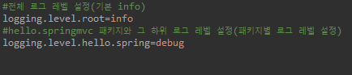
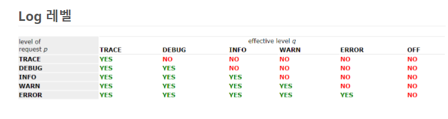
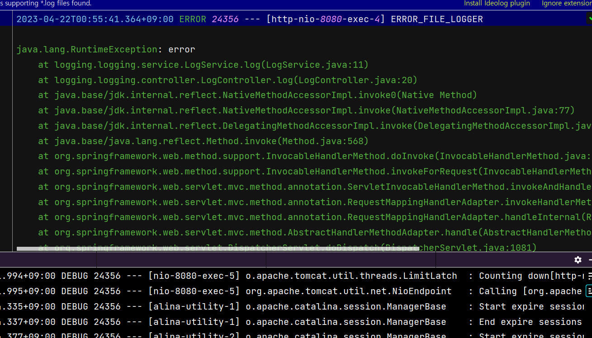
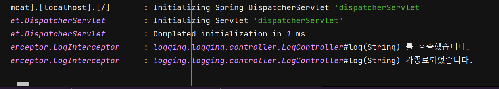
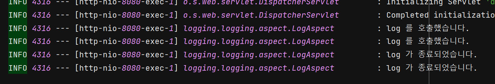

# 로그

로깅(logging)은 어플리케이션이 작동하면서 이벤트나 생성된 메세지를 기록하는 과정입니다. 이러한 메세지는 어플리케이션의 수행과정을 볼 수 있는 warning, information, error 혹은 다른 진단 데이터 등을 말합니다. 로그를 남기는 것은 개발에 있어서 필수적인 요소입니다. 로그는 어플리케이션의 동작을 모니더링하고 에러를 식별해주며, 디버깅을 쉽게 할 수 있도록 합니다. 

## 로깅의 목적

1. Error Detection : 로깅은 개발자가 에러나 예외를 쉽게 식별할 수 있게 합니다.
2. Debugging : 로그 파일은 개발자가 어플리케이션의 이슈를 식별하고 풀 수 있도록 하는 정보를 제공합니다.
3. Performance Monitoring : 로깅은 실행 시간, 자원 소모 등을 체크하면서 어플리케이션의 performance 를 추적할 수 있습니다.
4. Compliance and Auditing : 일부 산업에서는 규제 준수를 위해 로깅이 필요할 수 있으며, 애플리케이션 이벤트와 작업의 감사 추적을 제공합니다.

로깅의 목적은 일반적으로 위 내용과 같으며, 다음과 같이 요약할 수 있습니다.

- 서비스 동작 상태 파악
- 장애 파악 & 알림

위 사항은 개발자로서 제공해야 하는 최소한의 로그의 목적입니다.


## 로그를 적는 방법(SLF4J, logback)

SLF4J는 로깅 Facade(퍼사드) 로, 로깅에 대한 추상 레이어를 제공하는 interface의 모음입니다. 여러 로깅 라이브러리를 하나의 통일된 방식으로 사용할 수 있는 방법을 제공합니다.

이중 logback 또한 SLF4J 를 이용하여 로그를 남기게 됩니다.

이렇게 application은 SLF4J를 이용하여, 로깅 라이브러리가 어떤 것이든 같은 방법으로 로그를 남길 수 있게 되며, 나중에 더 좋은 라이브러리가 생겨 교체하더라도, application의 코드를 변경할 필요가 없다는 장점이 있습니다.

springboot-starter 는 logback 라이브러리를 추가하게 되며 스프링부트는 기본적으로 LogBack을 사용합니다.

**로그 선언**

로그는 다음과 같이 선언하며, Lombok 의 @Slf4j 를 사용하면 Logger 객체 생성과정을 생략할 수 있습니다.

```java
import org.slf4j.Logger;
import org.slf4j.LoggerFactory;

@Slf4j //Lombook
public class LogTest {
	// 두개의 방법중 하나를 선택하여 사용
	private final Logger log = LogFactory.getLogger(getClass());
	private final Logger log2 = LogFactory.getLogger(LogTest.class);
}
```

 **로그 레벨 설정**

application.properties 파일에서 전체 혹은 특정 패키지의 로그레벨을 설정할 수 있다.





<center><i>log level, 아래로 갈수록 치명적이다</i></center>

**로그 호출**

다음과 같이 로그레벨을 지정하여 호출할 수 있다. 이 덕분에 운영서버에서 출력할 로그를 관리할 수 있습니다.

```java
log.trace("trace log={}", name);
 log.debug("debug log={}", name);
 log.info(" info log={}", name);
 log.warn(" warn log={}", name);
 log.error("error log={}", name);
```

*로그의 레벨별로 출력을 하기때문에 시스템에 설정된 로그보다 레벨이 낮은 로그는 출력되지않습니다.

> 괄호를 사용하지 않고 문자 더하기 연산으로 출력을 한다면 괄호 안의 문자 더하기 연산을 수행하고 로그 레벨을 확인하기 때문에 만일 로그레벨이 debug이상이라면 연산만 수행하고 로그를 출력하지않습니다.(불필요한 연산 발생)
>
> 그렇기에 괄호를 사용한 로그 출력을 사용해야 합니다. 


# 어떤 로그를 남길까?

**""어떤 로그는 남기고 어떤 로그는 필요없다" 라는 건 정의되어있지 않습니다.** 개발자가 필요에 따라, 그리고 클라이언트의 요구사항에 따라 로깅 범위는 달라질 수 있습니다.

따라서 자신이 왜 로그를 남기는지에 대해 생각을 해야 합니다. 만약 혼자 사용하는 프로그램을 만들었는데 시스템이 너무 간단해 오류가 없고, 있다고 하더라도 로직을 한번 봐서 오류를 확인할 수 있다면 로그가 필요있을까요? 반대로 무조건 로그를 남겨야 한다는 생각에 모든 메서드 호출, API 요청마다 의미없는 로그를 남길 필요가 있을까요?

따라서 시스템을 유지, 관리하기 위해 어떤 로그가 필요할지 고민한 다음 로그 요구사항을 도출해내고, 로깅을 해야 합니다.

먼저 로그레벨에 대한 고민입니다.

- TRACE: 개발과 복잡한 이슈를 해결하기 위한 매우 세밀한 진단 정보
- DEBUG: 개발이나 특정 문제 진단에 유용한 작은 단위의 정보
- INFO: 어플리케이션 동작과 상태에 대한 일반적이고 개략적인 정보
- WARN: 처리되지 않으면 이슈가 될 수 있는 잠재적인 문제 상황
- ERROR: 어플리케이션이 오작동하거나 실패하는 심각한 문제

해당 내용을 염두에 두고 다음과 같이 로그 레벨을 임의로 나눌 수 있습니다.

**로그 요구사항**

- DEBUG: 개발자가 확인해야 하는 정보
- INFO : 서비스 동작 상태
- ERROR : 오류 발생 (즉시 알림 필요)
- WARN, TRACE : 해당 로그 레벨이 필요할 때 설정하고 사용합니다.

## INFO 로깅

ERROR 레벨은 명확하니 생략하고, INFO 레벨부터 알아보겠습니다. INFO 레벨은 ERROR 에 비해 좀 더 모호합니다. 여러 가지 목적으로 사용하기 때문인데 그 중 가장 중요한 목적은 다음과 같습니다.

1. 서비스 시나리오
2. 요구사항

login, signup, DB 변경과 같은  사용자의 actions 이 될 수도 있겠으며 특정 API 호출 여부 등도 있겠습니다. 즉,  **명확한 의도**가 있는 로그들이 모두 INFO 레벨입니다.

다음과 같은 **의도적인** Exception 이 있다고 가정하겠습니다.

```java
try{
	User user = repository.findById(userId);
	log.info("User is {} status (userId: {})", user.getName(), userId);
	return user.getName();
}catch (NonexistentUserException e) {
    log.info("User is not exist (userId: {})", userId);
    return UserStatus.NOT_REGISTERED;
}
```

사용자가 존재하지 않기 경우 사용자 서비스에서는 NonexistentUserException 을 발생합니다. NonexistentUserException은 이미 findById 함수를 사용할 때부터 의도적으로 UserStatus.NOT_REGISTERED 상태를 반환하기 위해 사용합니다.

Exception이 발생하는 경우 무의식적으로 ERROR 레벨을 사용하기보다는, 시나리오 상 의도된 Exception이라면 INFO 레벨을 사용할 수 있습니다. Exception을 오류라고 생각하면 그럴 수도 있지만 Exception은 ‘예외’이기 때문에 **의도한 경우에는** INFO로 적는 것이 더 좋다고 생각합니다.


# 로깅하기

먼저 dependencies 에 다음과 같이 추가합니다.

```java
//logback
implementation 'org.slf4j:slf4j-api'
implementation 'ch.qos.logback:logback-classic'
```


## 로그 설정파일 만들기

다음과 같이 로그에 대한 설정을 파일로 만들어서 정리할 수 있습니다. (예시)
logback-spring.xml이라는 파일을 만들어 resource 디렉토리에 넣으면 됩니다.

```xml
<?xml version="1.0" encoding="UTF-8"?>
<configuration>
    <include resource="org/springframework/boot/logging/logback/base.xml"/>

    <property name="home" value="logs"/>

    <appender name="DEFAULT_FILE_APPENDER" class="ch.qos.logback.core.rolling.RollingFileAppender">
        <rollingPolicy class="ch.qos.logback.core.rolling.SizeAndTimeBasedRollingPolicy">
            <fileNamePattern>${home}/access-%d{yyyy-MM-dd}.%i.log</fileNamePattern>
            <maxFileSize>15mb</maxFileSize>
            <maxHistory>30</maxHistory>
        </rollingPolicy>
        <encoder>
            <charset>utf8</charset>
            <pattern>${FILE_LOG_PATTERN}</pattern>
        </encoder>
    </appender>

    <appender name="ERROR_FILE_APPENDER" class="ch.qos.logback.core.rolling.RollingFileAppender">
        <rollingPolicy class="ch.qos.logback.core.rolling.SizeAndTimeBasedRollingPolicy">
            <fileNamePattern>${home}/error-%d{yyyy-MM-dd}.%i.log</fileNamePattern>
            <maxFileSize>15mb</maxFileSize>
            <maxHistory>30</maxHistory>
        </rollingPolicy>
        <encoder>
            <charset>utf8</charset>
            <pattern>${FILE_LOG_PATTERN}</pattern>
        </encoder>
    </appender>

    <root level="DEBUG">
        <appender-ref ref="DEFAULT_FILE_APPENDER"/>
    </root>

    <logger name="ERROR_FILE_LOGGER" level="ERROR" additivity="true">
        <appender-ref ref="ERROR_FILE_APPENDER"/>
    </logger>
</configuration>
```

DEBUG 이하의 로그는 DEFAULT_FILE_APPENDER 에 기록됩니다. ERROR 인 로그는 ERROR_FILE_APPENDER 에 기록됩니다. 이 때 @Slf4j 의 topic 은 "ERROR_FILE_LOGGER" 입니다.

또한 각각의 어펜더에서는 [RollingFileAppender](https://logging.apache.org/log4j/1.2/apidocs/org/apache/log4j/RollingFileAppender.html)를 사용하여 최대 용량은 15mb, 최대 보관 일수는 30일로 설정해놓고

로그의 패턴은 우리에게 익숙한 스프링부트의 기본 설정 로그 패턴을 사용합니다. 해당패턴은 스프링부트의 default 값으로 등록되어 있습니다.

해당 파일은 root 폴더의 logs 파일에 저장됩니다. 

## 로그 적용하기

### 기본 예제

로깅을 확인하기 위해 간단하게 만들었습니다.

**LogController**

```java
package logging.logging.controller;

import logging.logging.service.LogService;
import lombok.RequiredArgsConstructor;
import org.springframework.web.bind.annotation.GetMapping;
import org.springframework.web.bind.annotation.PathVariable;
import org.springframework.web.bind.annotation.RequestMapping;
import org.springframework.web.bind.annotation.RestController;

@RestController
@RequiredArgsConstructor
@RequestMapping
public class LogController {

    private final LogService logService;

    @GetMapping("/log/{name}")
    public String log(@PathVariable String name) {

        return logService.log(name);
    }
}
```

**LogService** ("/log/error" 일 때 RuntimeException 반환)

```java
package logging.logging.service;

import org.springframework.stereotype.Service;

@Service
public class LogService {
    public String log(String name) {

        if(name.equals("error")) {
            throw new RuntimeException("error");
        }
        return name;
    }
}
```


### GlobalExceptionHandler 로 로그 남기기

`@ControllerAdvice` 를 통해 예외 발생 시 처리하고 로그를 남길 수 있습니다. 

```java
//slf4j 에 topic 을 지정해서 해당 log 기록과 로그 설정 파일의 <logger> 와 연결시킵니다.
@Slf4j(topic = "ERROR_FILE_LOGGER")
@RestControllerAdvice
public class GlobalExceptionHandler {
    
    @ExceptionHandler(ExpiredJwtException.class)
    protected ResponseEntity<ErrorResponse> handleExpiredJwtException(ExpiredJwtException e) {
        log.error("ExpiredJwtException", e);
        final ErrorResponse response = ErrorResponse.of(ErrorCode.INVALID_INPUT_VALUE, e.getBindingResult());
        return new ResponseEntity<>(response, HttpStatus.BAD_REQUEST);
    }
    (중간 생략...)

    @ExceptionHandler(Exception.class)
    protected ResponseEntity<ErrorResponse> handleException(Exception e) {
        log.error("Exception", e);
        final ErrorResponse response = ErrorResponse.of(ErrorCode.INTERNAL_SERVER_ERROR);
        return new ResponseEntity<>(response, HttpStatus.INTERNAL_SERVER_ERROR);
    }
}
```

에러 발생 시 `error-2023-04-22.0.log` 파일에 다음과 같이 남습니다. (RuntimeError)



### Interceptor

[> [인터셉터 포스팅 확인] <](https://hobeen-kim.github.io/learning/spring-MVC2-%EA%B2%80%EC%A6%9D2(2)-%EB%A1%9C%EA%B7%B8%EC%9D%B8-%EC%B2%98%EB%A6%AC2-%ED%95%84%ED%84%B0,-%EC%9D%B8%ED%84%B0%EC%85%89%ED%84%B0/)

인터셉터의 동작은 위 링크를 통해 확인해주세요. (inflearn 강의 내용입니다.)

컨트롤러 메서드가 실행될 때마다 로그가 출력되게 만들 수 있습니다. LogInterceptor를 생성하고 들어오는 요청을 Interceptor 에서 로그를 남기면 됩니다. 

```java
package logging.logging.interceptor;

import jakarta.servlet.http.HttpServletRequest;
import jakarta.servlet.http.HttpServletResponse;
import lombok.extern.slf4j.Slf4j;
import org.springframework.web.servlet.HandlerInterceptor;
import org.springframework.web.servlet.ModelAndView;

@Slf4j
public class LogInterceptor implements HandlerInterceptor {

    @Override
    public boolean preHandle(HttpServletRequest request, HttpServletResponse response, Object handler) throws Exception {
        log.info("{} 를 호출했습니다.", handler.toString());
        return true;
    }

    @Override
    public void postHandle(HttpServletRequest request, HttpServletResponse response, Object handler, ModelAndView modelAndView) throws Exception {
        log.info("{} 가 종료되었습니다.", handler.toString());
    }
}

```

간단하게 호출, 종료를 나타내주었습니다.

아래와 같이 **LogConfig** 를 설정하여 LogInterceptor 를 빈 등록합니다.

```java
package logging.logging.config;

import logging.logging.interceptor.LogInterceptor;
import org.springframework.context.annotation.Configuration;
import org.springframework.web.servlet.config.annotation.InterceptorRegistry;
import org.springframework.web.servlet.config.annotation.WebMvcConfigurer;

@Configuration
public class LogConfig implements WebMvcConfigurer {

    @Override
    public void addInterceptors(InterceptorRegistry registry) {
        registry.addInterceptor(new LogInterceptor())
                .addPathPatterns("/**")
                .excludePathPatterns("/css/**", "*.ico");
    }
}

```

다음과 같이 logs 폴더에 잘 저장됩니다.



### AOP 적용

[> [AOP 포스팅 확인] <](https://hobeen-kim.github.io/inflearn/%EC%8A%A4%ED%94%84%EB%A7%81-%ED%95%B5%EC%8B%AC%EC%9B%90%EB%A6%AC-%EA%B3%A0%EA%B8%89%ED%8E%B8(3)-%EC%8A%A4%ED%94%84%EB%A7%81-AOP-%EA%B5%AC%ED%98%84/)

AOP 의 동작은 위 링크를 통해 확인해주세요. (inflearn 강의 내용입니다.)

AOP 를 적용하기 위해서 다음 dependency 를 추가해줍니다.

```
implementation 'org.springframework.boot:spring-boot-starter-aop'
```

**LogAspect**

aop 기능을 정의하는 클래스입니다. @Aspect, @Around 어노테이션을 사용합니다. 

```java
package logging.logging.aspect;

import lombok.extern.slf4j.Slf4j;
import org.aspectj.lang.ProceedingJoinPoint;
import org.aspectj.lang.annotation.Around;
import org.aspectj.lang.annotation.Aspect;

@Slf4j
@Aspect
public class LogAspect {

    @Around("execution(* logging.logging..*.*(..))")
    public Object log(ProceedingJoinPoint joinPoint) throws Throwable {
        String name = joinPoint.getSignature().getName();
        log.info("{} 를 호출했습니다.", name);
        Object result = joinPoint.proceed();
        log.info("{} 가 종료되었습니다.", name);
        return result;
    }
}
```

- 각 메서드의 호출과 종료 시 로그를 찍어줍니다.

**LogAspect 빈 등록** : 간단하게 @Import 로 등록합니다.

```java
@SpringBootApplication
@Import(LogAspect.class)
public class LoggingApplication {

	public static void main(String[] args) {
		SpringApplication.run(LoggingApplication.class, args);
	}

}
```

**실행** 

`http://localhost:8080/log/hi` 로 정상 실행합니다. 아래와 같은 로그가 logs 폴더의 파일에 저장됩니다.



- LogController, LogService 클래스의 메서드(둘 다 메서드 이름이 log 임)가 각각 한 번씩 실행되므로 log 는 2번 씩 찍힙니다.


# 마무리

로그를 찍는 건 비교적 쉽습니다.

하지만 어떤 로그를 저장하고, 활용해야 할지 필요한 기능과 요구사항을 제대로 도출하는 것이 필요하겠습니다.

다음에는 개별 프로젝트에 로깅하는 과정을 포스팅하겠습니다. 해당 포스팅에서 Error 알림 기능까지 추가해보겠습니다.

