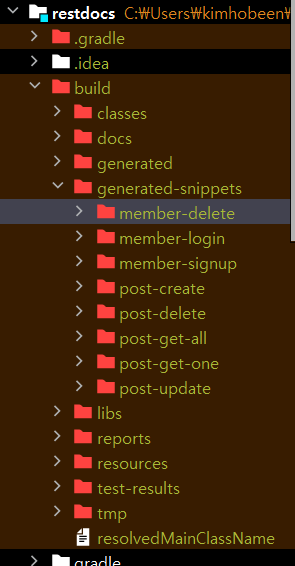
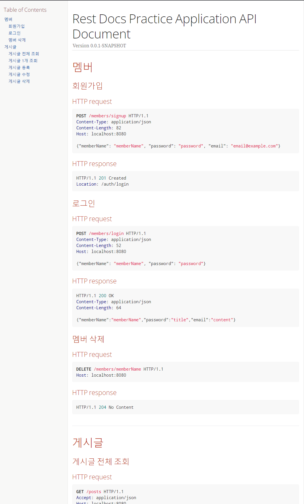
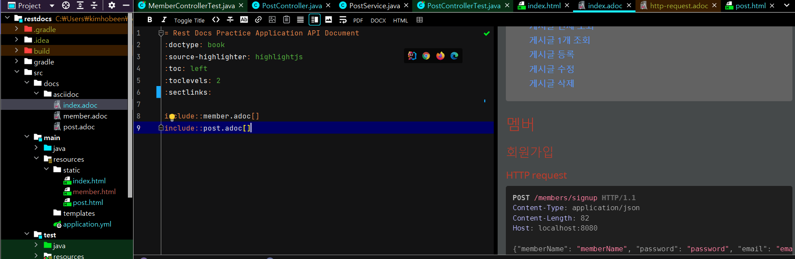
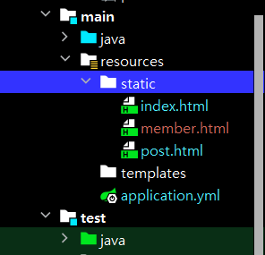
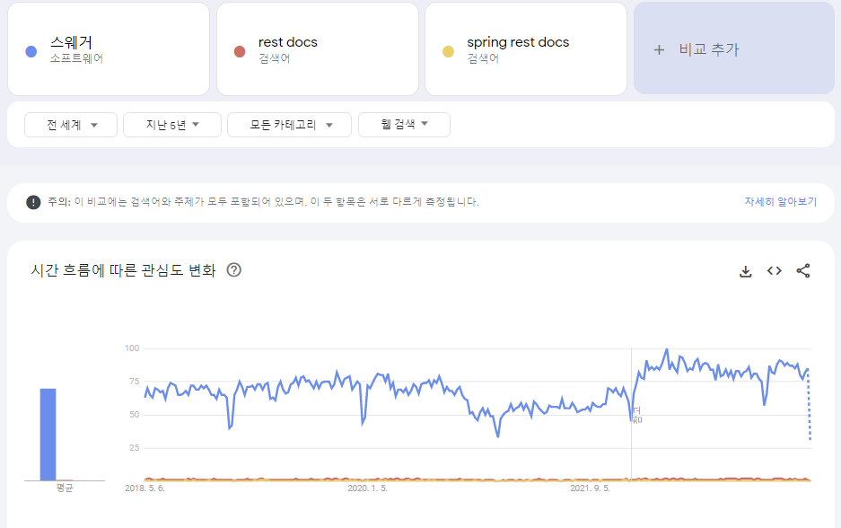

저번에 RestAPI 를 간략하게 정리하면서 제 토이프로젝트에는 REST API 가 제대로 적용되지 않았다는 걸 깨달았습니다. 제대로 공부하기 전까진 그냥 GET, POST 만 써서 uri 로 연결하면 되는 줄 알았거든요... 

> [[web\] restapi](https://hobeen-kim.github.io/web/WEB-RESTAPI/) 제가 RestAPI 에 대해 정리한 문서입니다.

그래서 API 를 리팩토링하는 겸, Spring REST Docs를 공부하고 함께 적용하기로 했습니다. 

툴은 Swagger 와 Spring REST Docs 중에 고민했었는데요. Spring REST Docs 가 깔끔해보여서... 마음이 가는대로 정했습니다. ㅎㅎ (실제 코드에 추가되는 코드가 없다는 게 끌렸습니다.) 아래 포스팅에서 간략히 비교해보겠습니다.

# Spring REST Docs

Spring Rest Docs 는 API 를 명세화하기 위한 툴입니다. 프로젝트를 진행하면서 API 를 만들고, 통합하고 사용할 때 API 의 명세화는 필수 입니다. 하지만 이러한 API 를 일일히 수동으로 문서화하는 것은 매우 힘든 작업이며, 프로젝트 핵심 로직에서 벗어난 일입니다.

예를 들어서 API 가 변경되었을 때 문서를 적시에 변경해주지 않으면 API 를 사용하는 입장에서는 API 문서대로 요청했음에도 제대로 된 응답을 받을 수 없게 됩니다.

따라서 API 명세화의 자동화가 필요한데 그를 위한 대표적인 툴 중 하나로 Spring Rest Docs 가 있습니다.

Rest Docs 는 테스트 코드를 기반으로 Asciidoctor 를 사용하여 Restful 문서를 생성하고 테스트로 생성된 snippet 을 사용하여 snippet 이 올바르지 않으면 생성된 테스트가 실패하여 정확성을 보장해줍니다.

## 특징

1. Test-driven documentation 입니다. 문서는 API 를 기반으로 한 테스트를 통해서 생성되며, 이를 통해 문서는 항상 최신화된 상태를 유지합니다. 따라서 테스트가 성공해야 문서가 작성되어 API 의 신뢰도를 높이고 테스트 코드 검증을 강제로 하게 합니다.
2. 프로덕션 코드와 분리되어 있어 실제 코드에 추가되는 코드가 없습니다. (제가 가장 마음에 들었던 부분입니다.)

## Swagger vs Spring REST Docs

위에서 서술한 것처럼 Swagger 와 Spring Rest Docs 중에 많은 고민을 했는데, 둘의 차이를 개략적으로 짚고 넘어가겠습니다.

|      | Spring Rest Docs                | Swagger                                     |
| :--- | :------------------------------ | :------------------------------------------ |
| 장점 | 제품코드에 영향 없다.           | API 를 테스트 해 볼수 있는 화면을 제공한다. |
|      | 테스트가 성공해야 문서작성된다. | 적용하기 쉽다.                              |
| 단점 | 적용하기 어렵다.                | 제품코드에 어노테이션 추가해야한다.         |
|      |                                 | 제품코드와 동기화가 안될수 있다.            |

# Spring REST Docs 사용

## gradle.build

Rest Docs 는 gradle 부터 난관입니다. gradle 문법은 다음에 따로 포스팅해보겠습니다.

먼저 Java17, SpringBoot 3.0.6, Gradle 7.6.1 을 사용했습니다. build 에서 간단한 건 주석, 설명이 필요한 건 주석에 번호를 달아서 아래에 적어보겠습니다.

```java
plugins {
	id 'java'
	id 'org.springframework.boot' version '3.0.6'
	id 'io.spring.dependency-management' version '1.1.0'
    //asciidoctor 파일을 컨버팅하고 build 폴더에 복사하기 위한 플러그인
	id 'org.asciidoctor.jvm.convert' version '3.3.2'
}

group = 'restapi'
version = '0.0.1-SNAPSHOT'
sourceCompatibility = '17'

configurations {
    //asciicodctorExt 를 configuration 으로 지정
	asciidoctorExt
	compileOnly {
		extendsFrom annotationProcessor
	}
}

...

dependencies {
	...
        
	//spring rest docs
    //adoc 파일에서 사용할 snippets 속성이 자동으로 build/generated-snippets 를 가리키게 함
	asciidoctorExt 'org.springframework.restdocs:spring-restdocs-asciidoctor'
	testImplementation 'org.springframework.restdocs:spring-restdocs-mockmvc:3.0.0'

	
}

...

ext {
    //snippets 파일이 저장될 경로를 snippetsDir 로 변수 설정
	snippetsDir = file('build/generated-snippets')
}

test {
	outputs.dir snippetsDir
    useJUnitPlatform()

}

asciidoctor {
    //Asciidoctor 에서 asciidoctorExt 설정을 사용하도록 함
	configurations 'asciidoctorExt'
    //1
	baseDirFollowsSourceFile()
    //input 디렉토리를 SnippetsDir 로 설정합니다.
	inputs.dir snippetsDir
    //2
	dependsOn test
}

asciidoctor.doFirst {
    //기존에 생성된 파일은 지운 후 새로운 파일을 만들 준비를 합니다.
	delete file('src/main/resources/static/docs')
}

//from 에 위치한 파일들은 into 로 복사하는 task
task createDocument(type: Copy) {
    
    //asciidoctor 실행 후 실행됨
	dependsOn asciidoctor
	from file("build/docs/asciidoc/")
	into file("src/main/resources/static")
}

//생성된 문서를 jar 파일에 패키징하는 설정
bootJar {
    //createDocument 이후 실행됨
	dependsOn createDocument
    //3
	from ("${asciidoctor.outputDir}") {
		into 'static/docs'
	}
}
```

1. .adoc 파일에서 다른 .adoc 파일을 include 하는 경우가 있습니다. 그 때 동일한 경로를 baseDir 로 설정하도록 합니다. gradle 6 에서는 자동으로 설정되었지만 gradle 7 부터 baseDir 을 각각 설정해야 한다고 합니다.
2. test 가 성공적으로 실행되어야만 asciidoctor 가 실행된다는 것을 명시한 코드입니다.
3. build 시 asciidoctor.outputDir 에 html 파일이 생깁니다. 해당 파일을 jar 안에 있는 /resources/static 폴더에 복사합니다.

## 예제 설정

예제는 Member 를 만드는 Member, MemberRepository, MemberService, MemberController, Dto 와 Post 를 만드는 Post, PostRepository, PostService, PostController, Dto 가 있습니다. 원래 다 올리려고 했는데 너무 길어질 것 같아 깃허브로 대체하겠습니다. [깃허브 이동](https://github.com/hobeen-kim/RestDocsEx)

src > main 디렉토리만 깃허브로 대체하겠습니다. 물론 restdocs 설정이나 gradle 도 있긴 합니다만 아래에서 설명하겠습니다.

혹시나 src > main 그대로 따라하시는 분들은 h2 사용하셔야 합니다.

## MockMvc 를 이용한 테스트 코드 작성

**Post**

이것도 주석으로 하나하나 달아보겠습니다. import 가 겹치는 게 많아 import 도 남겨놨습니다.

```java
package restapi.restdocs.controller;

import org.assertj.core.util.Lists;
import org.junit.jupiter.api.BeforeEach;
import org.junit.jupiter.api.Test;
import org.junit.jupiter.api.extension.ExtendWith;
import org.springframework.beans.factory.annotation.Autowired;
import org.springframework.boot.autoconfigure.SpringBootApplication;
import org.springframework.boot.test.context.SpringBootTest;
import org.springframework.boot.test.mock.mockito.MockBean;
import org.springframework.http.MediaType;
import org.springframework.restdocs.RestDocumentationContextProvider;
import org.springframework.restdocs.RestDocumentationExtension;
import org.springframework.test.context.junit.jupiter.SpringExtension;
import org.springframework.test.web.servlet.MockMvc;
import org.springframework.test.web.servlet.setup.MockMvcBuilders;
import org.springframework.web.context.WebApplicationContext;
import restapi.restdocs.dto.PostResponse;
import restapi.restdocs.service.PostService;
import java.util.List;
import static org.mockito.ArgumentMatchers.any;
import static org.mockito.ArgumentMatchers.anyLong;
import static org.mockito.Mockito.when;
import static org.springframework.restdocs.mockmvc.MockMvcRestDocumentation.document;
import static org.springframework.restdocs.mockmvc.MockMvcRestDocumentation.documentationConfiguration;
import static org.springframework.restdocs.mockmvc.RestDocumentationRequestBuilders.*;
import static org.springframework.restdocs.payload.PayloadDocumentation.*;
import static org.springframework.restdocs.request.RequestDocumentation.parameterWithName;
import static org.springframework.restdocs.request.RequestDocumentation.pathParameters;
import static org.springframework.test.web.servlet.result.MockMvcResultMatchers.status;

@ExtendWith({RestDocumentationExtension.class, SpringExtension.class})
@SpringBootTest
class PostControllerTest {

    private MockMvc mockMvc;

    @BeforeEach
    public void setUp(WebApplicationContext webApplicationContext,
                      RestDocumentationContextProvider restDocumentation) {
        this.mockMvc = MockMvcBuilders.webAppContextSetup(webApplicationContext)
            	//해당 설정을 통해 문서화를 할 수 있습니다.
                .apply(documentationConfiguration(restDocumentation))
                .build();
    }

    @MockBean
    private PostService postService;

    @Test
    void create() throws Exception {
        final PostResponse postResponse = new PostResponse(1L, "title", "content");
        when(postService.create(any())).thenReturn(postResponse);

        this.mockMvc.perform(post("/posts") //요청 방식을 선택합니다. 
                        .content("{\"title\": \"title\", \n\"content\": \"content\"}")  //보낼 데이터를 입력합니다.
                        .contentType(MediaType.APPLICATION_JSON)) //contentType 을 설정합니다.
                .andExpect(status().isCreated())  //정상 동작 시 응답 상태코드입니다.
                .andDo(document("post-create", //post-create 문서를 만듭니다.
                        requestFields(  //requestFields 를 만들어줍니다.
                                fieldWithPath("title").description("Post 제목"), //문서에 설정될 필드와 설명을 설정합니다.
                                fieldWithPath("content").description("Post 내용").optional() //null 일수도 있으므로 optional() 로 설정합니다.
                        )
                ));
    }

    @Test
    void findAll() throws Exception {
        List<PostResponse> postResponses = Lists.newArrayList(
                new PostResponse(1L, "title1", "content1"),
                new PostResponse(2L, "title2", "content2")
        );

        when(postService.findAll()).thenReturn(postResponses);

        this.mockMvc.perform(get("/posts")
                        .accept(MediaType.APPLICATION_JSON))
                .andExpect(status().isOk())
                .andDo(document("post-get-all",
                        responseFields( //responseFields 를 만들어줍니다.
                                fieldWithPath("[].id").description("Post Id"), //List 형식은 [].id 처럼 작성합니다.
                                fieldWithPath("[].title").description("Post 제목"),
                                fieldWithPath("[].content").description("Post 내용")
                        )
                ));
    }

    @Test
    void findById() throws Exception {
        PostResponse postResponse = new PostResponse(1L, "title", "content");
        when(postService.findById(anyLong())).thenReturn(postResponse);

        this.mockMvc.perform(get("/posts/{postId}", postResponse.getId())
                        .accept(MediaType.APPLICATION_JSON))
                .andExpect(status().isOk())
                .andDo(document("post-get-one",
                        pathParameters( //pathVariable 을 받을 때 명시해줍니다.
                                parameterWithName("postId").description("Post Id")
                        ),
                        responseFields(
                                fieldWithPath("id").description("Post Id"),
                                fieldWithPath("title").description("Post 제목"),
                                fieldWithPath("content").description("Post 내용")
                        )
                ));
    }

    @Test
    void update() throws Exception {
        this.mockMvc.perform(put("/posts/{postId}", 1L)
                        .content("{\"title\": \"turtle\", \n\"content\": \"context\"}")
                        .contentType(MediaType.APPLICATION_JSON))
                .andExpect(status().isOk())
                .andDo(document("post-update",
                        pathParameters(
                                parameterWithName("postId").description("Post Id")
                        ),
                        requestFields(
                                fieldWithPath("title").description("Post 제목"),
                                fieldWithPath("content").description("Post 내용")
                        )
                ));
    }

    @Test
    void remove() throws Exception {
        this.mockMvc.perform(delete("/posts/{postId}", 1L))
                .andExpect(status().isNoContent())
                .andDo(document("post-delete",
                        pathParameters(
                                parameterWithName("postId").description("Post Id")
                        )
                ));
    }
}
```

**Member**

member 와 post 는 겹치니까 주석을 별도로 달지 않겠습니다.

```java
package restapi.restdocs.controller;

@ExtendWith({RestDocumentationExtension.class, SpringExtension.class})
@SpringBootTest
class MemberControllerTest {

    private MockMvc mockMvc;

    @BeforeEach
    public void setUp(WebApplicationContext webApplicationContext,
                      RestDocumentationContextProvider restDocumentation) {
        this.mockMvc = MockMvcBuilders.webAppContextSetup(webApplicationContext)
                .apply(documentationConfiguration(restDocumentation))
                .build();
    }

    @MockBean
    private MemberService memberService;

    @Test
    void signUp() throws Exception {
        final MemberResponse memberResponse = new MemberResponse("memberName", "title", "content");
        when(memberService.signUp(any())).thenReturn(memberResponse);

        this.mockMvc.perform(post("/members/signup")
                        .content("{\"memberName\": \"memberName\", \"password\": \"password\", \"email\": \"email@example.com\"}") // Updated JSON payload
                        .contentType(MediaType.APPLICATION_JSON))
                .andExpect(status().isCreated())
                .andDo(document("member-signup",
                        requestFields(
                                fieldWithPath("memberName").description("Member memberName"),
                                fieldWithPath("password").description("Member password"),
                                fieldWithPath("email").description("Member email")
                        )
                ));
    }

    @Test
    void login() throws Exception {
        final MemberResponse memberResponse = new MemberResponse("memberName", "title", "content");
        when(memberService.login(any())).thenReturn(memberResponse);

        this.mockMvc.perform(post("/members/login")
                        .content("{\"memberName\": \"memberName\", \"password\": \"password\"}") // Updated JSON payload
                        .contentType(MediaType.APPLICATION_JSON))
                .andExpect(status().isOk())
                .andDo(document("member-login",
                        requestFields(
                                fieldWithPath("memberName").description("Member memberName"),
                                fieldWithPath("password").description("Member password")
                        )
                ));
    }

    @Test
    void remove() throws Exception {
        this.mockMvc.perform(delete("/members/{memberName}", "memberName"))
                .andExpect(status().isNoContent())
                .andDo(document("member-delete",
                        pathParameters(
                                parameterWithName("memberName").description("member memberName")
                        )
                ));
    }


```

## 문서화

`build` 를 하면 `build/generated-snippets` 에 다음과 같이 `.adoc` 파일이 생깁니다.



이제 이 파일들을 모아서 보여줄 수 있도록 문서화를 하겠습니다.

문서를 하기 위해선 src 디렉토리에 `docs/asciidoc` 디렉토리를 만들어야 합니다. 해당 디렉토리 하위에 만드는 `*.adoc` 파일이 `src/main/resources/static` 으로 문서화되어 이동합니다.

**src/docs/aciidoc/index.adoc**

모든 adoc 파일을 한번에 만들기 위해서 `index.adoc` 파일을 만들겠습니다.

```java
= Rest Docs Practice Application API Document
:doctype: book
:source-highlighter: highlightjs
:toc: left
:toclevels: 2
:sectlinks:

include::member.adoc[]
include::post.adoc[]
```

- `=` 은 h1 과 같습니다. `==` 는 h2, `===` 는 h3 입니다.

- `:source-highlighter: highlightjs` : http 에 구분 색을 넣어줍니다. 가독성을 올려줍니다.

- `:toc: left` : 왼쪽에 메뉴와 같은 toc 를 만들어줍니다.

- `:toclevels: 2` : toc level 을 2로 설정합니다. 하위 2개 level 까지 나타냅니다.

- `:sectlinks:` 해당 API 의 제목을 클릭하면 해당 API 로 이동할 수 있게 합니다.

- `include::member.adoc[]` : 같은 디렉토리에 있는 `member.adoc` 파일을 포함해서 문서화를 합니다.

  

  - 이런 식으로 만들어질겁니다. (현재 단계에서는 아니며, 아래 단계를 따라 member.adoc, post.adoc 을 만들고 build 를 해야 합니다.)

- AsciiDoc 플러그인을 사용하면 `.adoc` 에서 다음과 같이 보여집니다.

  

**member.adoc**

이제 `index.adoc` 에 들어갈 `member.adoc` 파일을 만들어보겠습니다.

```java
== 멤버

=== 회원가입
operation::member-signup[snippets='http-request,http-response']

=== 로그인
operation::member-login[snippets='http-request,http-response']

=== 멤버 삭제
operation::member-delete[snippets='http-request,http-response']
```

- `operation::member-signup[snippets='http-request,http-response']` : `build/generated-snippet` 에서 `member-signup` 폴더의 `http-request`, `http-response` adoc 파일을 가져옵니다. 나머지도 똑같습니다.

**post.adoc**

```java
== 게시글

=== 게시글 전체 조회
operation::post-get-all[snippets='http-request,http-response']

=== 게시글 1개 조회
operation::post-get-one[snippets='http-request,http-response']

=== 게시글 등록
operation::post-create[snippets='http-request,http-response']

=== 게시글 수정
operation::post-update[snippets='http-request,http-response']

=== 게시글 삭제
operation::post-delete[snippets='http-request,http-response']
```

- 위 `member.adoc` 과 똑같습니다. 이렇게 만들어진 `.adoc` 파일이 `index.adoc` 에서 함께 보여집니다.

## 빌드

이제 빌드를 해봅시다. `/gradlew build` 로 빌드를 하면 `main/resources/static` 에 index.html, member.html, post.html 문서가 생깁니다. 그 중 index.html 을 사용하면 됩니다.



# 마치며

잘 따라오시면 어렵지 않게 간단한 restDocs 를 구현하실 수 있을 것 같습니다. 물론 저도 test 에서나 .adoc 에서 완벽하게 만들었다고 할 수 없지만요. 새로운 툴을 사용하는 건 두려우면서도 재밌습니다.

다음에는 Swagger 를 포스팅해봐야겠습니다. 아무래도 사람들이 많이 사용하는 건 Swagger 인거같거든요. 



<center><i>그냥 swagger 쓸 걸 그랬습니다.</i></center>


또한 Rest Docs 를 openAPI Spec 으로 변환 후 swagger UI 를 사용할 수도 있다고 합니다. [github](https://github.com/ePages-de/restdocs-api-spec) 에서 확인할 수 있습니다.

# Ref.

[[10분 테코톡] 승팡, 케이의 REST Docs](https://youtu.be/BoVpTSsTuVQ)

[SpringRestDocs를 SpringBoot에 적용하기](https://taetaetae.github.io/2020/03/08/spring-rest-docs-in-spring-boot/)

[Spring Rest Docs 적용](https://techblog.woowahan.com/2597/)

[API 문서 자동화 - Spring REST Docs 팔아보겠습니다](https://tecoble.techcourse.co.kr/post/2020-08-18-spring-rest-docs/)

[공식 문서](https://docs.spring.io/spring-restdocs/docs/2.0.4.RELEASE/reference/html5/#getting-started-documentation-snippets-invoking-the-service)