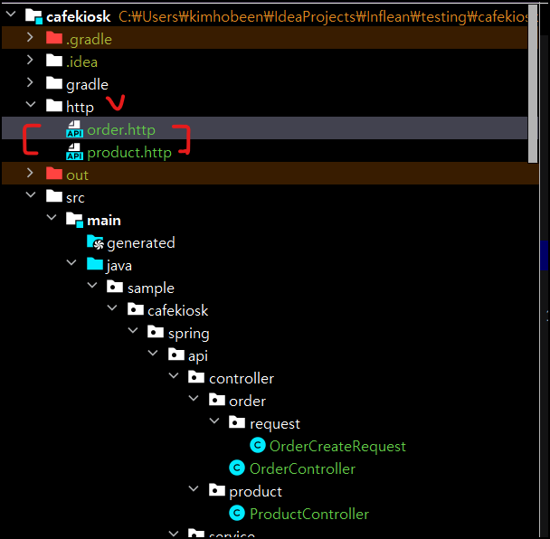
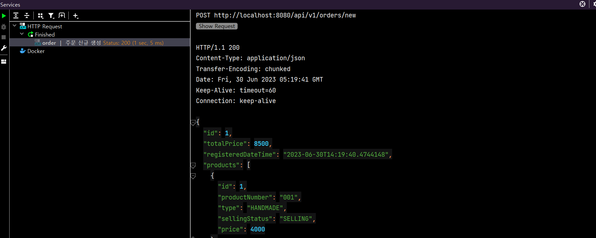

# HTTP 요청 보내기

백엔드에서 서버 개발 시 HTTP 요청은 주로 Postman 이나 웹서버를 직접 띄우는 등의, 다른 어플리케이션을 필요로 합니다. 하지만 IntelliJ 의 "Ultimate" 버전은 IDE 내에서 해당 기능을 제공합니다.

## http 파일 생성



최상위 레벨에서 http 디렉토리 생성 후 원하는 네이밍으로 `.http` 파일을 만들어줍니다.

## http 파일 작성

```http
### 주문 신규 생성
POST localhost:8080/api/v1/orders/new
Content-Type: application/json

{
  "productNumbers":[
    "001",
    "002"
  ]
}

### another
another request..
```

- `###` 으로 각 요청을 구분할 수 있습니다.
- `POST localhost:8080/api/v1/orders/new` : 보내는 HTTP Method 와 요청 url 을 지정합니다.
- 헤더와 한 칸 띄우고 바디값을 적습니다. http 요청양식 그대로입니다.

## 실행



실행시키면 위와 같이 잘 나옵니다.