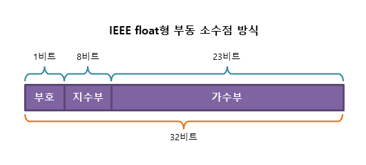

# 변수와 타입

## 변수

변수는 값이 변할 수 있는 데이터를 임시로 저장하기 위한 수단입니다.

`int num = 4` : 변수의 타입, 이름, 값을 할당합니다.

[자바 명명 규칙](https://www.oracle.com/java/technologies/javase/codeconventions-namingconventions.html)

자바 명명 규칙입니다. 저는 package 에도 중간에 capital letter 를 쓰는줄 알았는데요. 아니었습니다... ㅎ


## 상수

상수는 변수와 다르게 재할당이 금지됩니다.

상수는 final 을 사용하여 선언할 수 있으며 capital letter 에 underBar 를 넣어서 snake_case 로 사용합니다.

`final double CONSTANT_VALUE = 1;`

상수는 다음과 같은 이유로 사용합니다.

1. 프로그램이 실행되면서 값이 변하면 안되는 경우
2. 코드 가독성을 높을 때
3. 코드의 유지관리를 쉽게 하기 위해

## 타입

타입은 어떤 값의 유형 및 종류를 의미하며, 타입에 따라 **값이 차지하는 메모리 공간의 크기**와, **값이 저장되는 방식**이 결정됩니다.

**기본타입, 참조 타입**

기본타입

- 값을 저장할 때 데이터의 실제 값이 저장됩니다. 
- 정수 타입(byte, short, int, long), 실수 타입(float, double), 문자 타입(char), 논리 타입(boolean)

참조타입

- 값을 저장할 때, 데이터가 저장된 곳을 나타내는 **주소값**이 저장됩니다.
- 객체의 주소를 저장, 8개의 기본형을 제외한 나머지 타입

다음과 같이 확인할 수 있습니다.

```java
public class Main {
    public static void main(String[] args) {
        int primitive = 1;
        Object reference = new Object();

        System.out.println(primitive);
        System.out.println(reference);
    }
}

//output
/*
1
java.lang.Object@626b2d4a
*/
```

`primitive` 는 int 타입이므로 실제 값인 `1` 이 출력됩니다.

반면 `reference` 의 타입은 참조타입변수이므로 `new Object();` 의 주소인 `java.lang.Object@626b2d4a` 가 출력됩니다.


## 리터럴

리터럴이란 **문자가 가리키는 값 그 자체**를 의미합니다. 

```java
// 정수형 리터럴 20을 정수형 변수 currentAge에 할당
int currentAge = 20;

// 실수형 리터럴 3.14159를 실수형 변수 pi에 할당
double pi = 3.14159;

// 논리형 리터럴 true를 논리형 변수 boolean에 할당
boolean isGenius = true;

// 문자형 리터럴 'A'를 문자형 변수 firstAlphabet에 할당
char firstAlphabet = 'A';

// 문자열 리터럴 "CodeStates"를 문자열 타입 변수 learnedAt에 할당
String learnedAt = "CodeStates";
```

주의사항으로 float 타입에는 리터럴 뒤에 `f` 를, long 타입은 뒤에 `L` 을 붙여줘야 합니다.

## 정수타입

정수 타입은 숫자를 나타내는 타입으로, `byte`, `short`, `int`, `long`의 총 4개의 타입으로 분류됩니다. 각각 타입별로 차지하는 메모리 공간인 다음과 같습니다.

| 타입  | 메모리 | 표현 범위                                                    |
| ----- | ------ | ------------------------------------------------------------ |
| byte  | 1byte  | -128(-27) ~ 127(27 - 1)                                      |
| short | 2byte  | -32,768(-215) ~ 32,767(215 - 1)                              |
| int   | 4byte  | -2,147,483,648(-231) ~ 2,147,483,647(231 - 1)                |
| long  | 8byte  | -9,223,372,036,854,775,808(-263) ~ 9,223,372,036,854,775,807(263 - 1) |

타입의 범위를 넘어가면 overflow 가 발생합니다. 최대값을 넘어가면 해당 데이터 타입의 최소값으로 값이 순환합니다. 예를 들어 byte 형의 변수가 `127` 을 값으로 가질 때, `1`을 더하면 `128` 이 되는 게 아니라 `-128` 이 됩니다.

underflow 는 overflow 의 반대입니다.

## 실수타입

실수는 소수점을 가지는 값을 의미하며, `float`형과 `double`형으로 분류됩니다.

| 타입   | 메모리 | 표현 범위                                                    | 정밀도 |
| ------ | ------ | ------------------------------------------------------------ | ------ |
| float  | 4byte  | 음수 : -3.4 * 1038 ~ -1.4 * 10-45 양수 : 1.4 * 10-45 ~ 3.4 * 1038 | 7자리  |
| double | 8byte  | 음수 : -1.8 * 10308 ~ -4.9 * 10-324 양수 : 4.9 * 10-324 ~ 1.8 * 10308 | 15자리 |

실수타입의 표현 방식은 **부동 소수점(floating point) 방식**으로 어느정도 오차가 발생합니다.



부동 소수점 방식은 실수를 다음과 같은 형으로 저장한다. 
$$
±(1.가수부)×2^{지수부-127}
$$
즉, 0.1 조차 제대로 저장할 수 없습니다. ( 1/10 은 binary 로 표현할 수 없기 때문입니다.) 아래와 같이 0.1 을 1000번 더한다면 100 이 되어야 하지만 결과는 다릅니다.

```java
double num = 0.1;

for(int i = 0; i < 1000; i++) {

    num += 0.1;

}

System.out.print(num);

//output : 100.0999999999985
```

이렇듯 실수를 표현할 때에는 오차가 발생할 수도 있다는 것을 알아야 합니다.

## 문자타입

문자 타입은 2byte 크기의 `char`형 오직 하나만 있습니다.

문자형 리터럴을 작성할 때는 반드시 큰따옴표(`””`)가 아닌 작은따옴표(`’’`)를 사용하여야 합니다. 큰따옴표를 사용한 리터럴은 문자형 리터럴이 아니라 문자열 리터럴로 인식되기 때문입니다.

```java
char letter1 = 'a';
char letter2 = 'ab'; // 에러 : 단 하나의 문자만 할당할 수 있습니다. 
char letter3 = "a"   // 에러 : 작은따옴표를 사용해야 합니다. 
```


## 타입 변환

`boolean`을 제외한 기본 타입 7개는 서로 타입을 변환할 수 있으며, 자동으로 타입이 변환되는 경우도 있고, 수동으로 변환해주어야만 하는 경우도 있습니다. 

**자동 타입 변환**

다음과 같은 순서로 자동으로 타입이 변환될 수 있습니다.

`byte(1) -> short(2)/char(2) -> int(4) -> long(8) -> float(4) -> double(8)`

**수동 타입 변환**

차지하는 메모리 용량이 더 큰 타입에서 작은 타입으로는 자동으로 타입이 변환되지 않습니다. 이때 더 큰 데이터 타입을 작은 데이터 타입의 변수에 저장하기 위해서는 수동으로 타입을 변환해 주어야만 합니다. 이를 **캐스팅(casting)**이라고 합니다.

```java
//int 타입으로 선언된 변수 intValue를 더 작은 단위인 byte로 변환합니다.
int intValue = 128;
byte byteValue = (byte)intValue;

System.out.println(byteValue); // -128
```


# 문자열

 String 타입은 큰따옴표("")로 감싸진 문자열을 의미합니다.

다음과 같이 선언할 수 있습니다.

```java
// 문자열 리터럴을 String 타입의 변수 name에 할당하는 방법
String name1 = "Kim Coding";

// String 클래스의 인스턴스를 생성하는 방법
String name2 = new String("Kim Coding");
```

문자열 리터럴을 직접 할당하는 방식이든, String 클래스의 인스턴스를 생성하여 할당하는 방법이든 공통으로 참조 타입의 변수에 할당됩니다. 하지만 문자열을 출력하면 주소값이 아니라 문자열의 내용이 출력됩니다

이는 String 타입의 변수를 참조하면 String 클래스의 메서드인 **toString()`이 자동으로 호출되기 때문**입니다. 

두 방법의 차이에 대해 확인해보겠습니다.

- String 타입의 변수에 직접 할당 : 동일한 문자열 리터럴을 할당하는 경우, 두 변수는 같은 문자열의 참조값을 공유
-  String 클래스의 인스턴스를 생성 : 문자열의 내용이 같을지라도, 별개의 인스턴스가 따로 생성

이 차이를 생각하며 아래 예제를 보겠습니다.

```java
String name1 = "Kim Coding";
String name2 = "Kim Coding";

String name3 = new String("Kim Coding");
String name4 = new String("Kim Coding");

boolean comparison1 = name1 == "Kim Coding";      // true
boolean comparison2 = name1 == name2;             // true
boolean comparison3 = name1 == name3;             // false
boolean comparison4 = name3 == name4;             // false
boolean comparison5 = name1.equals("Kim Coding"); // true
boolean comparison6 = name1.equals(name3);        // true
boolean comparison7 = name3.equals(name4);        // true
```

참조값이 다른 인스턴스는 `==` 으로 비교할 때 `false` 를 반환합니다.

반면, `equals` 메서드는 내용이 같은지만을 비교합니다. 따라서 인스턴스 주소값이 다르더라도 내용이 같으면 `true`  반환합니다.

## String 클래스의 메서드

**charAt(int n)** : index n 에 해당하는 문자를 반환합니다. `str.charAt(0)`

**concat(String s)** : 해당 문자열 뒤에 인수로 전달된 문자열을 추가합니다. `str.concat("java")`

**indexOf(String s)** : 해당 문자열에서 특정 문자나 문자열이 처음으로 등장하는 위치의 인덱스를 반환합니다. 

- `str.indexOf("Java")` 와 같이 사용합니다.
- 해당 문자열에 전달된 문자나 문자열이 포함되어 있지 않으면 -1을 반환합니다.

**trim()** : 해당 문자열의 맨 앞과 맨 뒤에 포함된 모든 공백 문자를 제거해 줍니다.

**toUpperCase()와 toLowerCase()** : 해당 문자열의 모든 문자를 대소문자로 변환시켜 줍니다.


## StringTokenizer

StringTokenizer 클래스는 문자열을 우리가 지정한 구분자로 문자열을 쪼개주는 클래스입니다. 그렇게 쪼개어진 문자열을 토큰(token)이라고 부릅니다.

```java
public class Main {
	public static void main(String[] args){
		String str = "This is a string example using StringTokenizer";
		StringTokenizer tokenizer = new StringTokenizer(str);
		System.out.println(str);
		System.out.println();
		
		System.out.println("total tokens:"+tokenizer.countTokens());

		while(tokenizer.hasMoreTokens()){
			System.out.println(tokenizer.nextToken());
		}
		System.out.println("total tokens:"+tokenizer.countTokens());
	}
}
```

**int countTokens()**

- 남아있는 token의 개수를 반환합니다. 전체 token의 개수가 아닌 현재 남아있는 token 개수입니다.

**boolean hasMoreTokens()**

- 현재 위치 뒤에 있는 문자열에서 하나 이상의 토큰을 사용할 수 있는 경우 `true`를 반환하고 그렇지 않으면 `false`를 반환합니다.

**Object nextElement(), String nextToken()**

- 이 두 메서드는 다음의 토큰을 반환합니다. 두 가지 메서드는 같은 객체를 반환하는데 반환형은 다릅니다. nextElement는 Object를, nextToken은 String을 반환하고 있습니다.

## StringBuilder 

```java
public class Main {
    public static void main(String[] args) {
        
        StringBuilder stringBuilder = new StringBuilder();
        stringBuilder.append("문자열 ").append("연결");
        String str = stringBuilder.toString();
        System.out.println(stringBuilder);
        System.out.println(str);
        
    }
}
```

먼저 StringBuilder의 객체를 생성한 후, `append()`의 인자로 연결하고자 하는 문자열을 넣어서 StringBuilder의 객체를 통해 호출합니다. 또한, 문자열을 출력할 때, 그리고 변수에 문자열을 할당할 때는 `toString()` 메서드를 사용하면 됩니다.


## StringBuffer

StringBuffer 클래스의 인스턴스는 그 값을 변경할 수도 있고, 추가할 수도 있습니다. 이를 위해 StringBuffer 클래스는 내부적으로 버퍼(buffer)라고 하는 독립적인 공간을 가집니다.

**append()**

인수로 전달된 값을 문자열로 변환한 후, 해당 문자열의 마지막에 추가합니다. 이 메서드는 String 클래스의 `concat()` 메서드와 같은 결과를 반환하지만, 내부적인 처리 속도가 훨씬 빠릅니다.

`str.append(" programming")` 과 같이 사용합니다.

**capacity()**

StringBuffer 인스턴스의 현재 버퍼 크기를 반환합니다. 

```java
StringBuffer str01 = new StringBuffer();
StringBuffer str02 = new StringBuffer("Java");
System.out.println(str01.capacity()); //16
System.out.println(str02.capacity()); //20
```

길이가 4인 문자열로 StringBuffer 인스턴스를 생성하면, 기본적으로 생성되는 여유 버퍼 크기인 16에 문자의 길이인 4를 더한 **총 20개의 문자를 저장할 수 있는 버퍼가 생성**되는 것을 확인할 수 있습니다.

**delete()**

첫 번째 매개변수로 전달된 인덱스부터 두 번째 매개변수로 전달된 인덱스 바로 앞의 문자까지를 삭제합니다. 삭제 후 `StringBuffer.toString` 을 반환합니다. `deleteCharAt()` 메서드로 특정 위치의 문자 한 개만 제거할 수 있습니다.

```java
StringBuffer str = new StringBuffer("Java Oracle");
System.out.println("문자열 : " + str);
System.out.println(str.delete(4, 8)); //Javacle
System.out.println(str.deleteCharAt(1)); //Jvacle
System.out.println("deleteCharAt() 메소드 호출 후 문자열 : " + str);
```

**insert()**

인수로 전달된 값을 문자열로 변환한 후, 해당 문자열의 지정된 인덱스 위치에 추가합니다.

```java
StringBuffer str = new StringBuffer("Java Programming!!");
System.out.println("문자열 : " + str);
System.out.println(str.insert(4, "Script"));
System.out.println("insert() 메서드 호출 후 문자열 : " + str);
```

