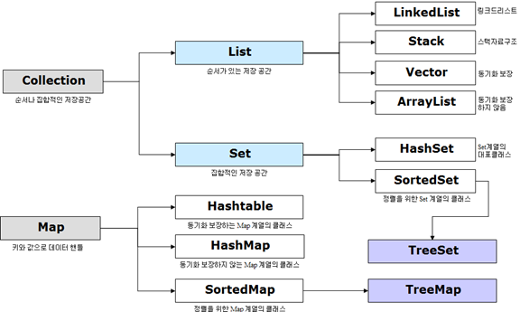
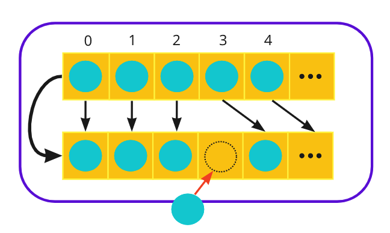
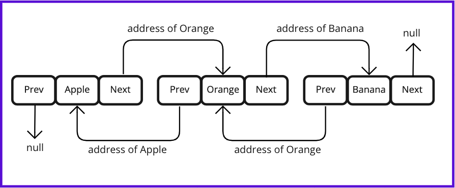
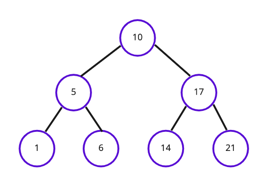

# 열거형(enumerated type)

**열거형(enum; enumerated type)**은 **여러 상수들을 보다 편리하게 선언**할 수 있도록 만들어진 자바의 문법요소입니다. 

다음과 같이 선언하여 사용합니다.

```java
enum Seasons { SPRING, SUMMER, FALL, WINTER }
enum Frameworks { DJANGO, SPRING, NEST, EXPRESS }

public class EnumExample {
    public static void main(String[] args) {
        Seasons favoriteSeason = Seasons.SPRING;
        System.out.println(favoriteSeason); // SPRING
    }
}
```

Enum 은 다음과 같은 메서드를 사용할 수 있습니다.

| 리턴 타입 | 메서드(매개변수)     | 설명                                                         |
| --------- | -------------------- | ------------------------------------------------------------ |
| String    | name()               | 열거 객체가 가지고 있는 문자열을 리턴하며, 리턴되는 문자열은 열거타입을 정의할 때 사용한 상수 이름과 동일합니다. |
| int       | ordinal()            | 열거 객체의 순번(0부터 시작)을 리턴합니다.                   |
| int       | compareTo(비교값)    | 주어진 매개 값과 비교해서 순번 차이를 리턴합니다.            |
| 열거 타입 | valueOf(String name) | 주어진 문자열의 열거 객체를 리턴합니다.                      |
| 열거 배열 | values()             | 모든 열거 객체들을 배열로 리턴합니다.                        |


# 제네릭 (Generic)

제네릭이란, 클래스나 메서드의 코드를 작성할 때, **타입을 구체적으로 지정하는 것이 아니라, 추후에 지정할 수 있도록 일반화해 두는 것**을 의미합니다. 즉, **작성한 클래스 또는 메서드의 코드가 특정 데이터 타입에 얽매이지 않게 해 둔 것을 의미합니다.**

다음과 같이 사용할 수 있습니다.

```java
class Basket<T> {
    private T item;

    public Basket(T item) {
        this.item = item;
    }

    public T getItem() {
        return item;
    }

    public void setItem(T item) {
        this.item = item;
    }
}
```

이렇게 제네릭이 사용된 클래스를 **제네릭 클래스**라고 합니다.

만약, 타입 매개변수를 여러 개 사용해야 한다면, 아래와 같이 선언하면 됩니다.

```java
class Basket<K, V> { ... }
```

> 주의사항
>
> 아래와 같이 **클래스 변수에는 타입 매개변수를 사용할 수 없습니다.**
>
> ```java
> class Basket<T> {
> 	private T item1; // O 
> 	static  T item2; // X 
> }
> ```

## 제네릭 클래스 사용

**타입 매개변수에 치환될 타입으로 기본 타입을 지정할 수 없습니다.** 만약, `int`, `double`과 같은 원시 타입을 지정해야 하는 맥락에서는 `Integer`, `Double`과 같은 래퍼 클래스를 활용합니다.

```java
Basket<String>  basket1 = new Basket<>("Hello");
Basket<Integer> basket2 = new Basket<>(10);
Basket<Double>  basket2 = new Basket<>(3.14);
```


## 제한된 제네릭 클래스

타입 매개변수를 선언할 때 아래와 같이 코드를 작성해 주면 **`Basket` 클래스를 인스턴스화할 때 타입으로 `Flower` 클래스의 하위 클래스만 지정하도록 제한됩니다.**

```java
class Flower { ... }
class Rose extends Flower { ... }
class RosePasta { ... }

class Basket<T extends Flower> {
    private T item;
	
		...
}

class Main {
    public static void main(String[] args) {
    
        // 인스턴스화 
        Basket<Rose> roseBasket = new Basket<>();
        Basket<RosePasta> rosePastaBasket = new Basket<>(); // 에러
    }
}
```

만약, 특정 클래스를 상속받으면서 동시에 특정 인터페이스를 구현한 클래스만 타입으로 지정할 수 있도록 제한하려면 아래와 같이 `&`를 사용하여 코드를 작성해 주면 됩니다.

다만, 이러한 경우에는 클래스를 인터페이스보다 앞에 위치시켜야 합니다. 

```java
interface Plant { ... }
class Flower implements Plant { ... }
class Rose extends Flower implements Plant { ... }

class Basket<T extends Flower & Plant> { // (1)
    private T item;
	
		...
}

class Main {
    public static void main(String[] args) {

        // 인스턴스화 
        Basket<Flower> flowerBasket = new Basket<>();
        Basket<Rose> roseBasket = new Basket<>();
    }
}
```


## 제네릭 메서드

클래스 전체를 제네릭으로 선언할 수도 있지만, 클래스 내부의 특정 메서드만 제네릭으로 선언할 수 있습니다. 이를 **제네릭 메서드**라고 합니다.

**제네릭 메서드의 타입 매개 변수는 제네릭 클래스의 타입 매개 변수와 별개의 것입니다.** 즉, 아래와 같이 동일하게 `T`라는 타입 매개 변수명을 사용한다고 하더라도, 같은 알파벳 문자를 이름으로 사용하는 것일 뿐, 서로 다른 타입 매개 변수로 간주됩니다.

```java
class Basket<T> {  // 1 : 여기에서 선언한 타입 매개 변수 T와 
		...
		public <T> void add(T element) { // 2 : 여기에서 선언한 타입 매개 변수 T는 서로 다른 것입니다.
				...
		}
}
```

이는 타입이 지정되는 시점이 서로 다르기 때문입니다. 즉, **클래스명 옆에서 선언한 타입 매개 변수는 클래스가 인스턴스화될 때 타입이 지정됩니다.** 그러나, **제네릭 메서드의 타입 지정은 메서드가 호출될 때 이루어집니다.** 제네릭 메서드를 호출할 때에는 아래와 같이 호출하며, 이때 제네릭 메서드에서 선언한 타입 매개 변수의 구체적인 타입이 지정됩니다.

```java
Basket<String> basket = new Bakset<>(); // 위 예제의 1의 T가 String으로 지정됩니다. 
basket.<Integer>add(10);                // 위 예제의 2의 T가 Integer로 지정됩니다. 
basket.add(10);                         // 타입 지정을 생략할 수도 있습니다. 
```

또한, 클래스 타입 매개 변수와 달리 **메서드 타입 매개 변수는 `static` 메서드에서도 선언하여 사용**할 수 있습니다.


# 예외 처리(Exception Handling)

## 컴파일 에러와 런타임 에러

컴파일 에러는 주로 미콜론 생략, 오탈자, 잘못된 자료형, 잘못된 포맷 등 문법적인 문제를 가리키는 신택스(syntax) 오류로부터 발생하기 때문에 신택스 에러(Systax Errors)라고 부르기도 합니다.

런타임 에러 코드를 실행하는 과정, 즉 **런타임 시에 발생하는 에러**를 가리킵니다. 즉, 프로그램이 실행될 때 만나게 되는 에러입니다.

**에러 vs 예외**

에러란 한번 발생하면 **복구하기 어려운 수준의 심각한 오류**를 의미하고, 대표적으로 메모리 부족(OutOfMemoryError)과 스택오버플로우(StackOverflowError) 등이 있습니다.

반면 **예외는 잘못된 사용 또는 코딩으로 인한 상대적으로 미약한 수준의 오류로서 코드 수정 등을 통해 수습이 가능한 오류**를 지칭합니다.

## 예외 클래스의 Inheritance Hierarchy Diagram


 Exception 은 checked Exception 과 unchecked Exception 으로 구분됩니다. Runtime Exception 은 컴파일러가 예외 처리 코드 여부를 검사하지 않는다는 의미에서 **unchecked Exception **라 부릅니다. 이외의 모든 Exception 은 checked Exception 입니다.

## try~ catch 문

자바에서 예외 처리는 `try - catch` 블록을 통해 구현할 수 있습니다. 그 기본적인 구조는 다음과 같습니다.

```java
try {
    // 예외가 발생할 가능성이 있는 코드를 삽입
} 
catch (ExceptionType1 e1) {
    // ExceptionType1 유형의 예외 발생 시 실행할 코드
} 
catch (ExceptionType2 e2) {
    // ExceptionType2 유형의 예외 발생 시 실행할 코드
} 
finally {
    // finally 블록은 optional
    // 예외 발생 여부와 상관없이 항상 실행
}
```

## throws

`try-catch` 문 외에 예외를 호출한 곳으로 다시 예외를 떠넘기는 방법도 있습니다.

이를 위해서는 메서드의 선언부 끝에 아래와 같이 `throws` 키워드와 발생할 수 있는 예외들을 쉼표로 구분하여서 나열해 주면 됩니다.

```java
반환타입 메서드명(매개변수, ...) throws 예외클래스1, 예외클래스2, ... {
	...
}
```


# Collection Framework

**컬렉션**이란 여러 데이터의 집합을 의미합니다. 즉, 여러 데이터를 그룹으로 묶어놓은 것을 컬렉션이라고 하며, 이러한 컬렉션을 다루는 데에 있어 편리한 메서드들을 미리 정의해 놓은 것을 **컬렉션 프레임워크**라고 합니다.



**List**

- List는 **데이터의 순서가 유지되며, 중복 저장이 가능**한 컬렉션을 구현하는 데에 사용됩니다.
- ArrayList, Vector, Stack, LinkedList 등이 List 인터페이스를 구현합니다.

**Set**

- Set은 **데이터의 순서가 유지되지 않으며, 중복 저장이 불가능**한 컬렉션을 구현하는 데에 사용됩니다.
- HashSet, TreeSet 등이 Set 인터페이스를 구현합니다.

**Map**

- Map은 **키(key)와 값(value)의 쌍으로 데이터를 저장**하는 컬렉션을 구현하는 데에 사용됩니다.
- **데이터의 순서가 유지되지 않으며, 키는 값을 식별하기 위해 사용되므로 중복 저장이 불가능하지만, 값은 중복 저장이 가능합니다.**
- HashMap, HashTable, TreeMap, Properties 등

이중 List, Set 은 Collection Interface 를 구현합니다.

## Collection 인터페이스

| 기능      | 리턴 타입 | 메서드                                         | 설명                                                         |
| --------- | --------- | ---------------------------------------------- | ------------------------------------------------------------ |
| 객체 추가 | boolean   | add(Object o) / addAll(Collection c)           | 주어진 객체 및 컬렉션의 객체들을 컬렉션에 추가합니다.        |
| 객체 검색 | boolean   | contains(Object o) / containsAll(Collection c) | 주어진 객체 및 컬렉션이 저장되어 있는지를 리턴합니다.        |
|           | Iterator  | iterator()                                     | 컬렉션의 iterator를 리턴합니다.                              |
|           | boolean   | equals(Object o)                               | 컬렉션이 동일한지 확인합니다.                                |
|           | boolean   | isEmpty()                                      | 컬렉션이 비어있는지를 확인합니다.                            |
|           | int       | size()                                         | 저장된 전체 객체 수를 리턴합니다.                            |
| 객체 삭제 | void      | clear()                                        | 컬렉션에 저장된 모든 객체를 삭제합니다.                      |
|           | boolean   | remove(Object o) / removeAll(Collection c)     | 주어진 객체 및 컬렉션을 삭제하고 성공 여부를 리턴합니다.     |
|           | boolean   | retainAll(Collection c)                        | 주어진 컬렉션을 제외한 모든 객체를 컬렉션에서 삭제하고, 컬렉션에 변화가 있는지를 리턴합니다. |
| 객체 변환 | Object[]  | toArray()                                      | 컬렉션에 저장된 객체를 객체배열(Object [])로 반환합니다.     |
|           | Object[]  | toArray(Object[] a)                            | 주어진 배열에 컬렉션의 객체를 저장해서 반환합니다.           |


# List

List 인터페이스는 **배열과 같이 객체를 일렬로 늘어놓은 구조**로 되어 있습니다. 

| 기능      | 리턴 타입    | 메서드                                    | 설명                                                         |
| --------- | ------------ | ----------------------------------------- | ------------------------------------------------------------ |
| 객체 추가 | void         | add(int index, Object element)            | 주어진 인덱스에 객체를 추가                                  |
|           | boolean      | addAll(int index, Collection c)           | 주어진 인덱스에 컬렉션을 추가                                |
|           | Object       | set(int index, Object element)            | 주어진 위치에 객체를 저장                                    |
| 객체 검색 | Object       | get(int index)                            | 주어진 인덱스에 저장된 객체를 반환                           |
|           | int          | indexOf(Object o) / lastIndexOf(Object o) | 순방향 / 역방향으로 탐색하여 주어진 객체의 위치를 반환       |
|           | ListIterator | listIterator() / listIterator(int index)  | List의 객체를 탐색할 수 있는 ListIterator 반환 / 주어진 index부터 탐색할 수 있는 ListIterator 반환 |
|           | List         | subList(int fromIndex, int toIndex)       | fromIndex부터 toIndex에 있는 객체를 반환                     |
| 객체 삭제 | Object       | remove(int index)                         | 주어진 인덱스에 저장된 객체를 삭제하고 삭제된 객체를 반환    |
|           | boolean      | remove(Object o)                          | 주어진 객체를 삭제                                           |
| 객체 정렬 | void         | sort(Comparator c)                        | 주어진 비교자(comparator)로 List를 정렬                      |

List 인터페이스를 구현한 클래스로는 ArrayList, Vector, LinkedList, Stack 등이 있습니다. 

## ArrayList

ArrayList에 객체를 추가하면 **객체가 인덱스로 관리된다**는 점에서는 배열과 유사합니다. 그러나 배열은 생성될 때 크기가 고정되며, 크기를 변경할 수 없는 반면, ArrayList는 저장 용량을 초과하여 객체들이 추가되면, **자동으로 저장용량이 늘어나게 됩니다**. 또한, 리스트 계열 자료구조의 특성을 이어받아 **데이터가 연속적으로 존재**합니다. 즉, 데이터의 순서를 유지합니다.



## LinkedList

**LinkedList 컬렉션은 데이터를 효율적으로 추가, 삭제, 변경하기 위해 사용합니다.** 배열에는 모든 데이터가 연속적으로 존재하지만, LinkedList에는 불연속적으로 존재하며, 이 데이터는 서로 연결(link)되어 있습니다.



## ArrayList vs LinkedList

데이터를 중간에 추가하거나 삭제하는 경우, LinkedList는 ArrayList보다 빠른 속도를 보여줍니다.

데이터를 순차적으로 추가하거나 삭제하는 경우, 데이터를 불러오는 경우 ArrayList 가 LinkedList 보다 빠릅니다.

# Set

Set은 **요소의 중복을 허용하지 않고, 저장 순서를 유지하지 않는 컬렉션입니다**. 대표적인 Set을 구현한 클래스에는 HashSet, TreeSet이 있습니다.

| 기능      | 리턴 타입 | 메서드             | 설명                                                         |
| --------- | --------- | ------------------ | ------------------------------------------------------------ |
| 객체 추가 | boolean   | add(Object o)      | 주어진 객체를 추가하고, 성공하면 true를, 중복 객체면 false를 반환합니다. |
| 객체 검색 | boolean   | contains(Object o) | 주어진 객체가 Set에 존재하는지 확인합니다.                   |
|           | boolean   | isEmpty()          | Set이 비어있는지 확인합니다.                                 |
|           | Iterator  | Iterator()         | 저장된 객체를 하나씩 읽어오는 반복자를 리턴합니다.           |
|           | int       | size()             | 저장된 전체 객체의 수를 리턴합니다.                          |
| 객체 삭제 | void      | clear()            | Set에 저장된 모든 객체를 삭제합니다.                         |
|           | boolean   | remove(Object o)   | 주어진 객체를 삭제합니다.                                    |

## HashSet

HashSet은 Set 인터페이스를 구현한 가장 대표적인 컬렉션 클래스입니다. 따라서, Set 인터페이스의 특성을 그대로 물려받으므로 **중복된 값을 허용하지 않으며, 저장 순서를 유지하지 않습니다.**

```java
import java.util.*;

public class Main {
    public static void main(String[] args) {

				// HashSet 생성
        HashSet<String > languages = new HashSet<String>();

				// HashSet에 객체 추가
        languages.add("Java"); 
        languages.add("Python");
        languages.add("Javascript");
        languages.add("C++");
        languages.add("Kotlin");
        languages.add("Ruby");
        languages.add("Java"); // 중복

				// 반복자 생성하여 it에 할당
        Iterator it = languages.iterator();

				// 반복자를 통해 HashSet을 순회하며 각 요소들을 출력
        while(it.hasNext()) {
            System.out.println(it.next());
        }
    }
}import java.util.*;

public class Main {
    public static void main(String[] args) {

				// HashSet 생성
        HashSet<String > languages = new HashSet<String>();

				// HashSet에 객체 추가
        languages.add("Java"); 
        languages.add("Python");
        languages.add("Javascript");
        languages.add("C++");
        languages.add("Kotlin");
        languages.add("Ruby");
        languages.add("Java"); // 중복

				// 반복자 생성하여 it에 할당
        Iterator it = languages.iterator();

				// 반복자를 통해 HashSet을 순회하며 각 요소들을 출력
        while(it.hasNext()) {
            System.out.println(it.next());
        }
    }
}
```

## TreeSet

TreeSet은 **이진 탐색 트리** 형태로 데이터를 저장합니다. **데이터의 중복 저장을 허용하지 않고 저장 순서를 유지하지 않는** Set 인터페이스의 특징은 그대로 유지됩니다.

이진 탐색 트리(Binary Search Tree)란 **하나의 부모 노드가 최대 두 개의 자식 노드와 연결되는 이진트리(Binary Tree)의 일종**으로, **정렬과 검색에 특화된 자료 구조**입니다.



```java
import java.util.TreeSet;

public class TreeSetExample {
    public static void main(String[] args) {

				// TreeSet 생성
        TreeSet<String> workers = new TreeSet<>();

				// TreeSet에 요소 추가
        workers.add("Lee Java");
        workers.add("Park Hacker");
        workers.add("Kim Coding");

        System.out.println(workers);
        System.out.println(workers.first());
        System.out.println(workers.last());
        System.out.println(workers.higher("Lee"));
        System.out.println(workers.subSet("Kim", "Park"));
    }
}
```

출력값을 확인해 보면, 요소를 추가하기만 했음에도 불구하고, **자동으로 사전 편찬 순에 따라 오름차순으로 정렬**된 것을 확인할 수 있습니다. 이는 **TreeSet의 기본 정렬 방식이 오름차순**이기 때문입니다. 

# Map

Map 인터페이스는 **키(key)와 값(value)으로 구성된 객체를 저장하는 구조**로 되어 있습니다. 여기서 이 객체를 **Entry 객체**라고 하는데, 이 **Entry 객체는 키와 값을 각각 Key 객체와 Value 객체로 저장**합니다.

이 때 키는 중복 저장될 수 없지만, 값은 중복 저장이 가능합니다. 만약 기존에 저장된 키와 같은 키로 값을 저장하면, **기존의 값이 새로운 값으로 대치**됩니다.

| 객체 추가 | Object     | put(Object key, Object value) | 주어진 키로 값을 저장합니다. 해당 키가 새로운 키일 경우 null을 리턴하지만, 같은 키가 있으면 기존의 값을 대체하고 대체되기 이전의 값을 리턴합니다. |
| --------- | ---------- | ----------------------------- | ------------------------------------------------------------ |
| 객체 검색 | boolean    | containsKey(Object key)       | 주어진 키가 있으면 true, 없으면 false를 리턴합니다.          |
|           | boolean    | containsValue(Object value)   | 주어진 값이 있으면 true, 없으면 false를 리턴합니다.          |
|           | Set        | entrySet()                    | 키와 값의 쌍으로 구성된 모든 Map.Entry 객체를 Set에 담아서 리턴합니다. |
|           | Object     | get(Object key)               | 주어진 키에 해당하는 값을 리턴합니다.                        |
|           | boolean    | isEmpty()                     | 컬렉션이 비어 있는지 확인합니다.                             |
|           | Set        | keySet()                      | 모든 키를 Set 객체에 담아서 리턴합니다.                      |
|           | int        | size()                        | 저장된 Entry 객체의 총 갯수를 리턴합니다.                    |
|           | Collection | values()                      | 저장된 모든 값을 Collection에 담아서 리턴합니다.             |
| 객체 삭제 | void       | clear()                       | 모든 Map.Entry(키와 값)을 삭제합니다.                        |
|           | Object     | remove(Object key)            | 주어진 키와 일치하는 Map.Entry를 삭제하고 값을 리턴합니다.   |

## HashMap

HashMap은 Map 인터페이스를 구현한 대표적인 클래스입니다. HashMap은 아래 그림과 같이 키와 값으로 구성된 객체를 저장하는데, 이 객체를 **Entry 객체**라고 합니다.

또한, HashMap의 개별 요소가 되는 Entry 객체는 Map 인터페이스의 내부 인터페이스인 Entry 인터페이스를 구현하며, Map.Entry 인터페이스에는 다음과 같은 메서드가 정의되어 있습니다.

| 리턴 타입 | 메서드                 | 설명                                                         |
| --------- | ---------------------- | ------------------------------------------------------------ |
| boolean   | equals(Object o)       | 동일한 Entry 객체인지 비교합니다.                            |
| Object    | getKey()               | Entry 객체의 Key 객체를 반환합니다.                          |
| Object    | getValue()             | Entry 객체의 Value 객체를 반환합니다.                        |
| int       | hashCode()             | Entry 객체의 해시코드를 반환합니다.                          |
| Object    | setValue(Object value) | Entry 객체의 Value 객체를 인자로 전달한 value 객체로 바꿉니다. |

```java
import java.util.*;

public class HashMapExample {
    public static void main(String[] args) {

	    // HashMap 생성
        HashMap<String, Integer> map = new HashMap<>();

        // Entry 객체 저장
        map.put("피카츄", 85);
        map.put("꼬부기", 95);
        map.put("야도란", 75);
        map.put("파이리", 65);
        map.put("피존투", 15);

        // 저장된 총 Entry 수 얻기
        System.out.println("총 entry 수: " + map.size());

        // 객체 찾기
        System.out.println("파이리 : " + map.get("파이리"));
				
        // key를 요소로 가지는 Set을 생성 -> 아래에서 순회하기 위해 필요합니다. 
        Set<String> keySet = map.keySet();

        // keySet을 순회하면서 value를 읽어옵니다. 
        Iterator<String> keyIterator = keySet.iterator();
        while(keyIterator.hasNext()) {
            String key = keyIterator.next();
            Integer value = map.get(key);
            System.out.println(key + " : " + value);
        }

        // 객체 삭제
        map.remove("피존투");

        System.out.println("총 entry 수: " + map.size());

        // Entry 객체를 요소로 가지는 Set을 생성 -> 아래에서 순회하기 위해 필요합니다. 
        Set<Map.Entry<String, Integer>> entrySet = map.entrySet();

        // entrySet을 순회하면서 value를 읽어옵니다. 
        Iterator<Map.Entry<String, Integer>> entryIterator = entrySet.iterator();
        while(entryIterator.hasNext()) {
            Map.Entry<String, Integer> entry = entryIterator.next();
            String key = entry.getKey(); // Map.Entry 인터페이스의 메서드
            Integer value = entry.getValue(); // Map.Entry 인터페이스의 메서드
            System.out.println(key + " : " + value);
        }

        // 객체 전체 삭제
        map.clear();
    }
}
```


# Iterator

Iterator는 직역하면 반복자라는 의미가 있으며, **컬렉션에 저장된 요소들을 순차적으로 읽어오는 역할**을 합니다.


다음은 Iterator 인터페이스에 정의된 메서드로, `iterator()`를 통해 만들어진 인스턴스는 아래의 메서드를 사용할 수 있습니다.

| 메서드    | 설명                                                         |
| --------- | ------------------------------------------------------------ |
| hasNext() | 읽어올 객체가 남아 있으면 true를 리턴하고, 없으면 false를 리턴합니다. |
| next()    | 컬렉션에서 하나의 객체를 읽어옵니다. 이때, next()를 호출하기 전에 hasNext()를 통해 읽어올 다음 요소가 있는지 먼저 확인해야 합니다. |
| remove()  | next()를 통해 읽어온 객체를 삭제합니다. next()를 호출한 다음에 remove()를 호출해야 합니다. |

다음과 같이 사용합니다.

```java
ArrayList<String> list = ...;
Iterator<String> iterator = list.iterator();

while(iterator.hasNext()) {     // 읽어올 다음 객체가 있다면 
	String str = iterator.next(); // next()를 통해 다음 객체를 읽어옵니다. 
	...
}
```

