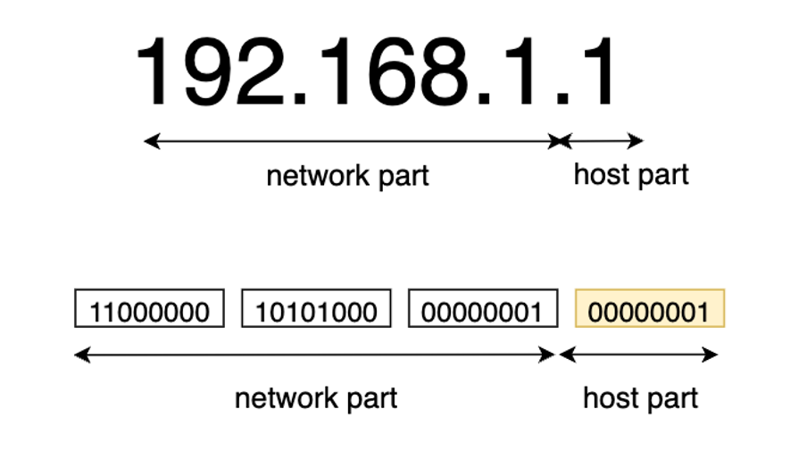
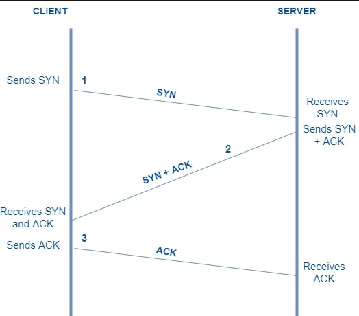
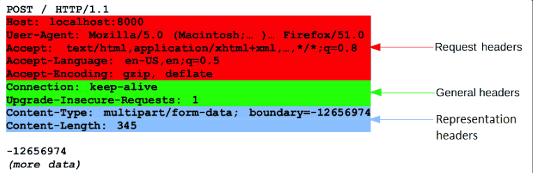
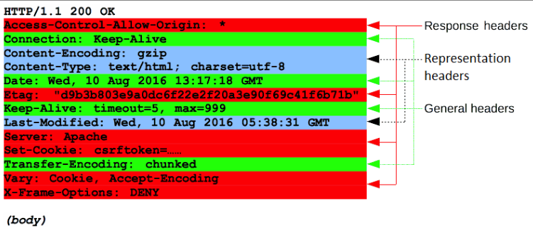

# 네트워크 기본 용어

**LAN/WAN**

좁은 범위에서 연결된 네트워크를 LAN(Local Area Network) 라고 하고, 수많은 LAN 이 모여 세계의 네트워크를 구성하는 WAN(Wide Area Network) 이 됩니다.

**Internetworking**

네트워크를 확장하는 방식에는 두 가지 방법이 있습니다. 한 네트워크를 확장하는 방법과 두 개 이상의 네트워크를 연결하는 방법입니다. 여기서 두 번째 방법을 internetworking 이라고 합니다. 그리고 전 세계적으로 하는 Internetworking 이 바로 인터넷(The Internet) 입니다.

**TCP/IP**

TCP/IP 는 인터넷이 처음 시작하던 시기에 정의되어 현재까지 표준으로 사용하고 있는 통신규약입니다. 

**MAC address**

MAC 은 제조사에서 할당하는 고유 시리얼 번호입니다. 같은 LAN에 속한 기기끼리 통신을 할 때는 우선 상대방의 MAC 주소를 파악하는 과정이 있게 됩니다.

**패킷**

​	패킷은 기기 간 통신을 위한 방식 중 하나입니다. 패킷 교환은 패킷 교환은 원본 데이터를 패킷(packet)이라고 하는 작은 단위로 나누고, 여러 회선을 공용해 통신을 주고받습니다. 하나의 패킷은 헤더와 페이로드로 구성되어 있고, 헤더에는 어떤 데이터의 몇 번째 데이터인지의 정보와 보내는 곳이나 최종 목적지에 대한 정보 등이 들어있습니다. 이렇게 주고받을 데이터를 작게 분할하여 전송하더라도, 도착한 곳에서 원래대로 복원이 가능합니다.

# IP

​	IP(Internet Protocol) 은 컴퓨터를 식별하기 위해 사용되는 주소로, 192.xxx.xxx.xxx 와 같은 형태를 가집니다. IP 주소는 네트워크부와 호스트부로 나뉘는데, 네트워크부는 어떤 네트워크인지를 알 수 있는 정보이고, 호스트부는 그 네트워크 안의 특정 컴퓨터를 지칭하는 정보입니다. 

​	그리고 IPv4 주소에서 네트워크부가 어디까지인지 나타내는 것이 **서브넷마스크**입니다. 예를 들어서 서브넷 마스크가 255.255.255.0 이라면 앞 12자리까지가 네트워크부라는 뜻입니다. 또한 각각의 바이트들을 **옥텟**이라고 부릅니다. IPv4 는 4개의 옥텟으로 이루어져있고, 앞에서부터 1옥텟, ..., 4옥텟 입니다.

​	IP 주소의 할당은 호스트부를 변경하면서 할당됩니다. 이때 호스트부가 0 으로 이루어진 것인 네트워크 주소로, 그 네트워크를 의미하며 1 로만 이루어진 것은 브로드캐스트 주소로 ARP와 같은 기능을 사용하기 위해 사용합니다. 따라서 할당 가능한 수는 0 과 255 를 제외한 입니다.

​	IP 사용 시 한계점으로 비연결성, 비신뢰성이 있습니다. 비연결성은 IP 를 통해 패킷을 보내도 패킷을 받을 대상이 없거나 서비스 불능 상태에 빠져도 상태 파악이 불가능한 문제입니다. 비신뢰성은 중간에 패킷이 사라지거나 순서가 보장되지 않는다는 문제입니다. 이러한 한계를 극복하기 위해 TCP, UDP 가 사용됩니다.

# TCP, UDP

TCP 와 UDP 는 둘다 3계층에서 동작하면서 IP 와 4계층의 어플리케이션을 중개합니다.

​	TCP 는 신뢰성을 높이기 위해 사용합니다. 웹애플리케이션에서 많이 사용하는 HTTP의 경우 모든 데이터를 제대로 송수신이 가능해야 하는 특성상, TCP를 사용합니다. TCP 는 3단계로 구성되는데, 1단계에서는 통신을 원하는 sender 가 receiver 에서 segment 를 SYN 과 보냅니다. 2단계에서 receiver  가 SYN/ACK 신호 세트로 응답합니다. 3단계에서 sender 는 받은 ACK 를 receiver 에게 전송하며 신뢰성 있는 연결이 되었음을 서로 알 수 있고, 이후 실제 데이터 전송이 시작됩니다.

​	UDP 는 신뢰성있는 연결이 보장되지 않는 대신 TCP 에 비해 더 빠르고 효율적입니다. 따라서 실시간 통신이 중요한 어플리케이션의 경우 UDP 를 사용합니다.

# URL, DNS

**URL**

​	URL(Uniform Resource Locator) 는 웹에 게시된 자원을 찾기 위해 브라우저에서 사용되는 메커니즘입니다. 다음과 같이 이루어져있습니다.

​	**Scheme** 는 브라우저가 리소스를 요청하는 데 사용해야 하는 프로토콜을 나타냅니다.

​	**Authority** 는 hosts 라고도 하는데, 도메인과 포트를 모두 포함합니다. 포트는 웹 서버의 리소스에 접근하는 데 사용되는 기술적인 "게이트"를 나타냅니다. 웹 서버가 리소스에 대한 액세스 권한을 부여하기 위해 HTTP 프로토콜의 표준 포트(HTTP의 경우 80, HTTPS의 경우 443)를 사용하는 경우엔 일반적으로 생략합니다. 그렇지 않으면 필수입니다.

​	**url-path** 는 웹 서버에 있는 리소스의 경로입니다. 웹 초기에는 이와 같은 경로가 웹 서버의 실제 파일 위치를 나타냈습니다. 요즘에는 대부분 물리적 실체가 없는 웹 서버가 추상적으로 처리합니다.

​	**parameter** 는 추가 매개변수이며, **Anchor** 는 리소스 내부에서 일종의 "책갈피" 역할을 하며, 브라우저에 해당 "책갈피" 지점의 콘텐츠를 표시하도록 지시합니다. 

​	여기서 URL 은 url-path 까지이며, URI(Uniform Resouce Identifier) 은 parameter, anchor 까지 포함하는 개념입니다.

**DNS**

​	DNS(Domain Name System) 은 도메인 이름과 IP 를 서로 연결해주는 DB 시스템입니다. 도메인을 등록하는 기관은 비영리 단체인 ICANN, 도메인 관리 기관인 Registry, 중개 등록업체은 Registrar 등이 있습니다.

​	도메인의 종류에는 gTLD(generic Top Level Domain) 과 ccTLD(country code Top Level Domain) 이 있는데요. gTLD 는 .com, .net 등 전 세계에서 등록가능한 도메인이고, ccTLD 는 각국에서 사용하는 도메인으로 .kr, .us 등이 있습니다.

​	

# 웹 어플리케이션과 아키텍처

​	웹 어플리케이션은 상호작용이 가능한 동적 페이지를 포함한 웹페이지입니다. 그리고 이러한 웹을 구성하는 클라이언트-서버 간 연결을 웹 어플리케이션 아키텍처라고 합니다. 아키텍처는 크게 3단계로 나누어 볼 수 있는데 Presentation Layer, Application Layer, Data Access Layer 입니다.

## SSR, CSR

SSR 은 Server Side Rendering 으로 서버에서 웹페이지를 렌더링해서 브라우저로 보냅니다. CSR 은 Client Side Rendering 으로 API 를 통해 데이터를 받으면 클라이언트 측에서 JS 파일을 통해 웹 페이지를 렌더링합니다. 각각 다음과 같은 경우에 사용합니다.

**SSR** 

- 웹페이지가 사용자와 상호작용이 적은 경우
- 웹 페이지의 첫 화면 렌더링이 빠르게 필요한 경우
- SEO(Search Engine Optimization, 검색 엔진 최적화)가 필요한 경우

**CSR** 

- 사이트에 많은 상호작용이 있는 경우
- 웹 어플리케이션을 제작하는 경우

SSR 은 어플리케이션 유지비용이 높다는 점과 일부 서드파티 자바스크립트 라이브러리의 경우 서버사이드 렌더링이 불가능할 수 있다는 점이 단점입니다. CSR 는 느린 렌더링 속도, 부하가 클라이언트 쪽에 집중되는 문제, 검색 엔진 노출이 안된다는 단점이 있습니다. 

# HTTP Messages

​	HTTP(HyperText Transfer Protocol) 는 문서 전송을 위한 프로토콜입니다. HTTP 는 Stateless 로 상태를 저장하지 않습니다. 다음과 같은 구조를 가집니다.

크게 startline, headers, body 로 구분되어있고, header 와 body 를 구분해주는 empty line 이 있습니다.

​	Request 에서 startline 에는 HTTP method 가 있으며 headers 에는 General headers, Request headers, Representation headers 가 있습니다. Representation headers 는 body에 담긴 리소스의 정보(콘텐츠 길이, MIME 타입 등)를 포함하는 헤더입니다.

​	Response 에서 startline 에는 프로토콜, status 가 있습니다.headers 에는 General headers, Reponse headers, Representation headers 가 있습니다.

 