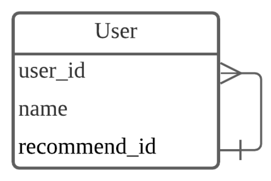

# DB 설계

​	구조화된 데이터는 하나의 테이블로 표현할 수 있으며 여러 테이블은 관계를 통해 묶이게 됩니다. 이러한 DB 를 관계형 DB(RDB) 라고 합니다.

​	관계의 종류는 1:1, 1:N, N:N 관계가 있습니다. 또한 **자기참조관계(self-referencing)** 도 있습니다. 예를 들어서 User 테이블에 추천인(recommend_id) 필드가 있습니다. 해당 필드에 들어갈 수 있는 값을 자기자신 테이블인 User 의 Id 입니다. 또한 한명의 유저는 여러 명의 추천인이 될 수 있으므로 1:N 관계와 유사합니다. 따라서 아래와 같은 자기참조관계가 만들어집니다.

