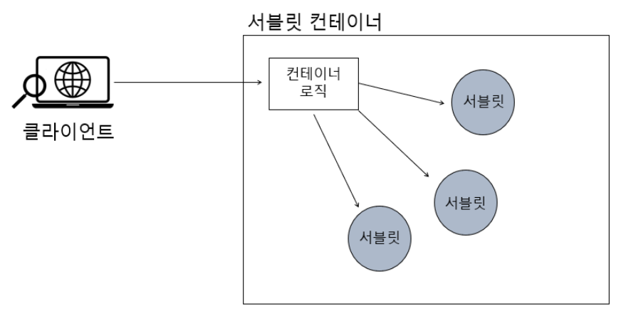
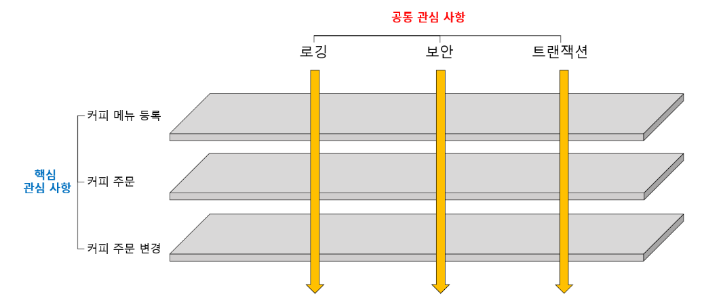
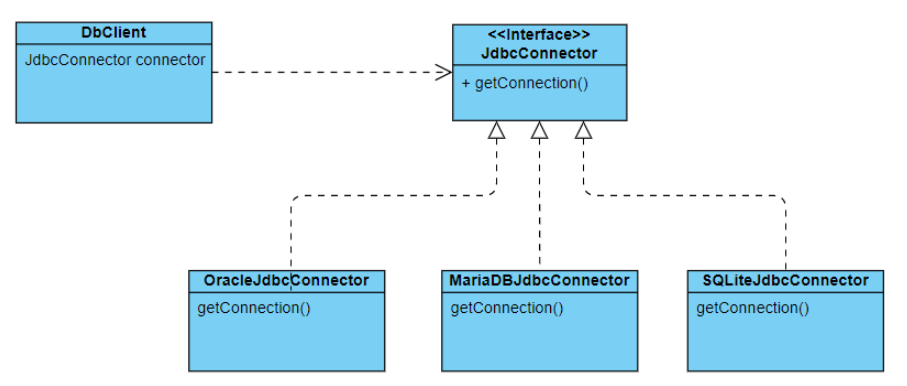

# Framework 란?

​	Frame 은 어떤 대상의 큰 틀이나 외형적인 구조를 의미합니다. 소프트웨어 관점에서의 Framework는 **어떠한 애플리케이션을 만들기 위한 틀 혹은 구조**입니다. 소프트웨어 개발 시 Framework 를 사용한다면 효율적으로 코드를 작성할 수 있고, 정해진 규약대로 관리할 수 있어 유지보수가 뛰어납니다. 하지만 자유롭고 유연한 개발이 어렵다는 단점도 있습니다.

## Framework 와 Library

​	Framework 가 뼈대라고 한다면 Library 는 부품입니다. 따라서 이미 선택된 Framework 는 변경하기 힘들지만 Library 는 쉽게 교체 가능하며 필요한 Library 들을 선택적으로 사용할 수 있습니다. 즉 두 개념의 차이는 **애플리케이션에 대한 제어권**에 있다고 표현할 수 있습니다.

# Spring Framework

​	그렇다면 많은 Framework 중 Spring 을 사용할까요? 다음과 같은 이점이 있습니다.

1. POJO(Plan Old Java Object) 기반의 구성
2. DI(Dependency Injection) 지원
3. AOP(Aspect Oriented Programming, 관점지향 프로그래밍) 지원
4. Java 언어를 사용함으로써 얻는 장점

또한 Spring 은 기업용 엔터프라이즈 시스템에 맞게 유지 보수를 용이하게 하고, 자원의 효율성, 보안성, 시스템 안전성이나 확장성 등에 이점이 있기 때문입니다.


# Spring 의 특징

## POJO

​	POJO Plain Old Java Object 의 약자입니다. 순수 자바 객체만을 사용해서 프로그래밍 코드를 작성하는 것입니다. 다음과 같은 두 가지 규칙이 지켜져야 합니다.

**Java나 Java의 스펙(사양)에 정의된 것 이외에는 다른 기술이나 규약에 얽매이지 않아야 합니다.**

​	코드를 작성하는 데 특정 기술이 사용되면 안됩니다. 특정 기술을 상속해서 코드를 작성하게 되면 나중에 애플리케이션의 요구사항이 변경돼서 다른 기술로 변경하려면 해당 길술을 명시적으로 사용했던 부분을 전부 다 일일이 제거하거나 수정해야 합니다.

**특정 환경에 종속적이지 않아야 합니다.**

​	예를 들어서 WAS 서버로 Tomcat 을 사용하고 있는데 jetty 로 바꿔야 한다고 생각해봅시다. 코드가 Tomcat 을 기반으로 짜여져있다면 해당 코드를 모두 변경해야겠죠.

​	스프링은 **IoC/DI, AOP, PSA** 를 통해 최대한 다른 환경이나 기술에 종속적이지 않도록 하고 있습니다.

## IoC

​	IoC 란 Inversion Of Control 로 제어의 역전이라고 합니다. 위에서 Framework 는 어플리케이션 흐름의 주도권이 바뀌는 거라고 했는데, 바로 이 IoC 때문입니다. Spring 에서 서블릿 컨테이너가 서블릿을 실행시키는 모습이 IoC 라고 볼 수 있습니다. 



​	**서블릿 컨테이너는 클라이언트로부터 요청이 들어올 때마다 서블릿 컨테이너 내의 컨테이너 로직(`service()` 메서드)이 서블릿을 직접 실행**시킵니다. 이 경우에는 서블릿 컨테이너가 서블릿을 제어하고 있기 때문에 애플리케이션의 주도권은 서블릿 컨테이너에 있습니다.

## DI

​	IoC 가 컨테이너, 디자인 패턴, 객체 지향 설계 등에 적용되는 일반적인 개념이라면 DI(Dependency Injection) 은 IoC 개념을 더 구체화시킨 것입니다. DI 는 말 그대로 의존성 주입입니다. 아래는 의존성 주입 예시입니다.

```java
public class CafeClient{
    public static void main(String[] args){
        MenuServiceMonk menuServiceMonk = new MenuService();
        MemuController controller = new MenuController(menuServiceMonk);
        List<Menu> menuList = controller.getMenu();
    }
}

public class MemuController{
    private MenuServiceMonk menuService;
    
    public MenuController(MenuServiceMonk menuService){
        this.menuService = menuService;
    }
    
    public List<Menu> getMenu(){
        return menuService.getMenuList();
    }
}

public class MenuServiceMonk{
    public List<Menu> getMenuList(){
        return List.of(
        	new Menu(1, "americano", 2500),
            new Menu(2, "caramel macchiato", 4500),
            new Menu(3, "vanilla latte", 4500)
        );
    }
}
```

위 예제에서 main 메서드에  `MenuServiceMonk` 를 선언한 뒤 `MemuController controller = new MenuController(menuServiceMonk);` 에 넣어서 객체를 전달하고 있습니다. 이처럼 생성자를 통해서 어떤 클래스의 객체를 전달받는 것을 ‘**의존성 주입**’이라고 합니다.

​	하지만 `MenuServiceMonk` 클래스를 사용한 곳이 수 백 군데인데, 이 클래스를 다른 클래스(`MenuServiceMonk2`) 로 변경해야 한다면 어떻게 할까요? 위와 같은 코드면 `MenuServiceMonk` 를 모두 `MenuServiceMonk2` 로 변경해줘야 합니다. 이렇게 `new` 키워드를 사용해서 의존 객체를 생성할 때, 클래스들 간에 **강하게 결합(Tight Coupling)**되어 있다고 합니다. 이러한 문제를 해결하기 위해 **느슨한 결합(Loose Coupling) 을 하는 방법**을 알아보겠습니다.

**느슨한 결합(Loose Coupling)**

​	느슨한 결합의 대표적인 방법은 인터페이스를 활용하는 겁니다.

```java
public class CafeClient{
    public static void main(String[] args){
        MenuService menuService = new MenuServiceMonk2();
        MemuController controller = new MenuController(MenuService);
        List<Menu> menuList = controller.getMenu();
    }
}

public class MemuController{
    private MenuService menuService;
    
    public MenuController(MenuService menuService){
        this.menuService = menuService;
    }
    
    public List<Menu> getMenu(){
        return menuService.getMenuList();
    }
}

public interface MenuService{
    List<Menu> getMenuList();
}

public class MenuServiceMonk implements MenuService{
    public List<Menu> getMenuList(){
        return List.of(
        	new Menu(1, "americano", 2500),
            new Menu(2, "caramel macchiato", 4500),
            new Menu(3, "vanilla latte", 4500)
        );
    }
}

public class MenuServiceMonk2 implements MenuService{
    public List<Menu> getMenuList(){
        return List.of(
        	new Menu(1, "latte", 3000),
            new Menu(2, "tea", 4000)
        );
    }
}
```

`MenuService` 인터페이스를 만들어주고 `MenuServiceMonk`, `MenuServiceMonk2` 클래스를 각각 만들어줍니다. 그리고 main 메서드를 보면 `MenuService menuService = new MenuServiceMonk2();` 에만 구현 클래스가 들어가고, 나머지의 main 메서드나 controller 에서는 구현체가 전혀 사용되지 않았습니다. **오직 `MenuService` 인터페이스만 사용됐을 뿐이죠.**

**그렇다면 Spring 에서는 DI 를 어떻게 구현할까요?**

main 메서드와 config 파일만 살펴보겠습니다. 먼저 config 파일입니다. config 파일은 말 그대로 구성(Configuration) 파일입니다. 어떤 빈을 등록할지, DI 는 어떤 걸 주입할지 등을 설정합니다.

```java
package com.codestates.config;

import com.codestates.controller.MenuController;
import com.codestates.service.MenuService;
import com.codestates.service.MenuServiceMonk;
import org.springframework.context.annotation.Bean;
import org.springframework.context.annotation.ComponentScan;
import org.springframework.context.annotation.Configuration;

@Configuration
public class Config {

    @Bean
    public MenuService menuService(){
        return new MenuServiceMonk();
    }

    @Bean
    public MenuController MenuController(MenuService menuService){
        return new MenuController(menuService);
    }
}

```

​	MenuService 를 생성할 때는 `MenuServiceMonk` 클래스를 주입합니다. 그리고 MenuController 를 생성하는 데는 항상 위에서 생성된 `MenuService` 를 주입합니다. 이 때 주입되는 건 `MenuServiceMonk` 클래스입니다. 

​	만약 `MenuServiceMonk` 를 `MenuServiceMonk2` 로 바꾸고 싶으면 `return new MenuServiceMonk2();` 로 변경하면 됩니다. 그럼 `MenuService` 빈을 사용하는 모든 구현체는 `MenuServiceMonk2` 이 됩니다.

이제 **main** 메서드를 보겠습니다.

```java
package com.codestates;

import com.codestates.config.Config;
import com.codestates.controller.MenuController;
import org.springframework.context.annotation.AnnotationConfigApplicationContext;
import org.springframework.context.support.GenericApplicationContext;

import java.util.Arrays;

public class CafeClient {
    public static void main(String[] args) {
        GenericApplicationContext context = new AnnotationConfigApplicationContext(Config.class);
        MenuController controller = context.getBean(MenuController.class);

        controller.getMenu().forEach(System.out::println);
    }
}
```

`new AnnotationConfigApplicationContext(Config.class);` 를 통해서 Config 파일을 빈으로 등록합니다. 거기서 `context.getBean(MenuController.class);` 를 통해서 등록된 빈 중 MenuController 를 꺼냅니다.

**이렇게 핵심 로직과 DI 를 분리하여 코드를 유연하게 구성할 수 있습니다.**

## AOP

​	AOP(Aspect Oriented Programming) 란 관심 지향 프로그래밍으로, 공통된 관심사를 처리하기 위한 프로그래밍입니다. 

​	관심사항은 **공통 관심 사항(Cross-cutting concern)**과 **핵심 관심 사항(Core concern)**으로 나뉩니다. 어플리케이션의 핵심 로직이 바로 핵심 관심 사항에 해당되고, 공통적으로 적용되는 기능(트랜잭션, 예외처리 등) 은 공통 관심 사항이 됩니다. 아래 그림과 같이 생각하면 됩니다.



​	**AOP 의 주 목적은 핵심 관심 사항에서 공통 관심 사항을 분리하는 것**입니다. 둘을 나누면 코드가 간결해지고, 핵심 로직에 좀 더 집중할 수 있으며 유지보수도 편해지겠죠. 또한 객체 지향 설계 원칙에 맞는 코드 구현할 수 있습니다.

## PSA

​	PSA(Portable Service Abstraction) 란 클라이언트가 **추상화된 상위 클래스를 일관되게 바라보며 하위 클래스의 기능을 사용하는 것**입니다. 간단히 말해 OOP 의 추상화라고도 볼 수 있습니다. 

PSA가 필요한 주된 이유는 **어떤 서비스를 이용하기 위한 접근 방식을 일관된 방식으로 유지함으로써 애플리케이션에서 사용하는 기술이 변경되더라도 최소한의 변경만으로 변경된 요구 사항을 반영하기 위함**입니다.

아래 코드는 추상화를 위한 Child 추상 클래스입니다.

```java
public abstract class Child {
    protected String childType;
    protected double height;
    protected double weight;
    protected String bloodType;
    protected int age;

    protected abstract void sleep();

    protected abstract void eat();
}
```

그리고 이를 확장한 하위 클래스 Infant 와 Toddler 가 있습니다.

```java
public class Infant extends Child {
    @Override
    protected void sleep() {
        System.out.println("영아부터는 밤에 잠을 자기 시작해요");
    }

    @Override
    protected void eat() {
        System.out.println("영아부터는 이유식을 시작해요");
    }
}

public class Toddler extends Child {
    @Override
    protected void sleep() {
        System.out.println("유아는 낮잠을 건너뛰고 밤잠만 자요");
    }

    @Override
    protected void eat() {
        System.out.println("유아는 딱딱한 걸 먹기 시작해요");
    }
}
```

해당 클래스들은 Child 에서 일반화시켜 놓은 아이의 동작을 구체화시켜 사용하고 있습니다. 이러한 추상화는 Spring DI 의 핵심으로 볼 수도 있습니다. 아래는 Jdbc 를 사용하기 위해 JdbcConnector 인터페이스로 커넥터들을 추상화한 예시입니다.

 

DbClient 입장에서는 어떤 JdbcConnector 구현체를 사용하더라도 Connection을 얻는 방식은 getConnection() 메서드를 사용해야 하기 때문에 동일합니다. 즉 **느슨한 결합**이라고 볼 수 있습니다.


# SpringBoot 를 사용해야 하는 이유

​	SpringBoot 는 Spring 의 복잡한 설정으로 겪는 문제점을 해결하기 위해 생겨난 Spring Project 중 하나입니다. Spring Boot을 사용해야 하는 이유는 다음과 같습니다.

- XML 기반의 복잡한 설계 방식 지양
- 의존 라이브러리의 자동 관리
- 애플리케이션 설정의 자동 구성
- 프로덕션급 애플리케이션의 손쉬운 빌드
- 내장된 WAS를 통한 손쉬운 배포

