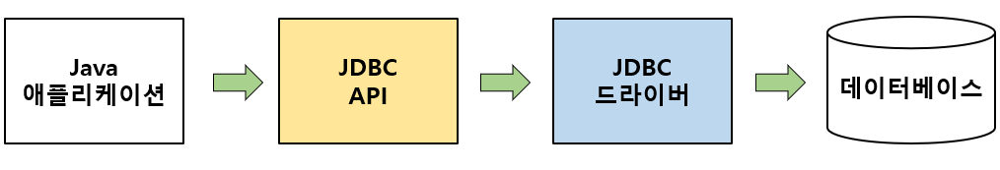

# JDBC

​	**JDBC(Java Database Connectivity)**는 Java 기반 애플리케이션의 코드 레벨에서 사용하는 데이터를 데이터베이스에 저장 및 업데이트하거나 반대로 데이터베이스에 저장된 데이터를 Java 코드 레벨에서 사용할 수 있도록 해주는 Java에서 제공하는 **표준 사양(또는 명세, Specification)**입니다.



​	JDBC 는 Java 애플리케이션 내에서 JDBC API를 사용하여 데이터베이스에 액세스하는 단순한 구조이기 때문에 JDBC 의 동작 흐름은 위 그림과 같이 매우 심플합니다.

​	이때 JDBC 드라이버는 DriverManager를 통해 데이터베이스와 연결되는 세션(Session)인 Connection 객체를 생성하는데, 데이터베이스와의 연결을 위한 Connection 객체를 생성하는 작업은 비용이 많이 드는 작업 중 하나입니다.

​	따라서 애플리케이션 로딩 시점에 **Connection 객체를 미리 생성**해 두고 애플리케이션에서 데이터베이스에 연결이 필요할 경우, Connection 객체를 새로 생성하는 것이 아니라 **미리 만들어 둔 Connection 객체를 사용**함으로써 애플리케이션의 성능을 향상할 수 있습니다.

이처럼 데이터베이스 Connection을 미리 만들어서 보관하고 애플리케이션이 필요할 때 이 Connection을 제공해 주는 역할을 하는 Connection 관리자를 바로 **Connection Pool**이라고 합니다.

# Spring Data JDBC

​	Spring Data JDBC 는 ORM 기술 중 하나입니다. 간단하게 동작 방식을 이해해보겠습니다.

## 의존성 추가

```
dependencies {
	...
	...
	implementation 'org.springframework.boot:spring-boot-starter-data-jdbc'
	runtimeOnly 'com.h2database:h2'
}
```

## application.yml 파일 설정

```yml
spring:
  h2:
    console:
      enabled: true
      path: /h2
  datasource:
    url: jdbc:h2:mem:test
```

데이터베이스는 h2 를 사용하고, 인메모리DB 를 사용하되 접근하기 용이하도록 path 를 지정합니다.

## Repository

```java
public interface MessageRepository extends CrudRepository<Message, Long> {
}
```

repository 는 CrudRepository 만 상속하면 끝납니다. CrudRepository 에서 여러가지 메서드를 사용하면 됩니다.

```java
@NoRepositoryBean
public interface CrudRepository<T, ID> extends Repository<T, ID> {

	<S extends T> S save(S entity);

	<S extends T> Iterable<S> saveAll(Iterable<S> entities);

	Optional<T> findById(ID id);

	boolean existsById(ID id);

	Iterable<T> findAll();

	Iterable<T> findAllById(Iterable<ID> ids);

	void deleteById(ID id);

	void delete(T entity);

	void deleteAllById(Iterable<? extends ID> ids);

	void deleteAll(Iterable<? extends T> entities);

	void deleteAll();
}

```

CrudRepository 는 위와 같은 메서드가 있습니다. 메서드명을 보면 어떤 역할인지 알 수 있습니다. save 는 저장, findById 는 Id 로 조회 등이겠죠.
