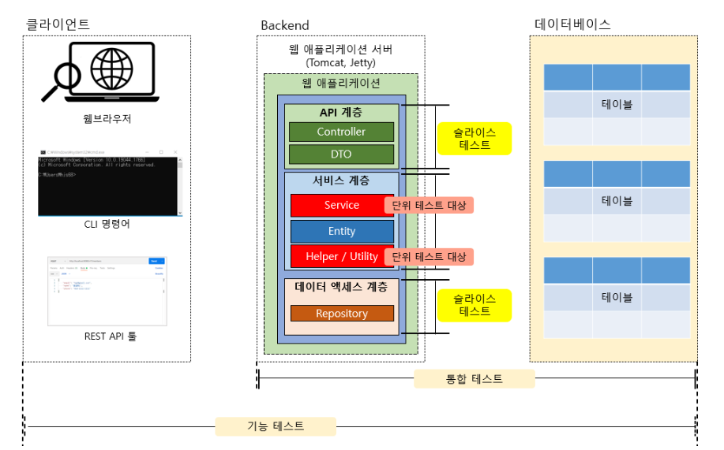

# 테스트의 종류



**기능 테스트** : 테스트 범위가 제일 급니다. 애플리케이션을 사용하는 사용자 입장에서 애플리케이션이 제공하는 기능이 올바르게 동작하는지를 테스트합니다.

**통합테스트** : 클라이언트 측 툴 없이 백엔드 개발자가 짜 놓은 테스트 코드를 실행시켜 이루어지는 테스트입니다. 

**슬라이스 테스트** : 애플리케이션을 특정 계층으로 쪼개어서 하는 테스트를 의미합니다.

**단위 테스트** : 비즈니스 로직에서 구현한 특정 메서드만 수행하는 테스트입니다.

# Junit5 기능 정리

*처음보는 부분만 정리했습니다.*

### assertDoesNotThrow

`assertThrows` 와 다르게 예외가 출력안될 때 성공합니다.

```java
@DisplayName("Test case 1")
@Test
public void beforeEachTest() {
    map.put("XRP", "Ripple");
    assertDoesNotThrow(() -> getCryptoCurrency("XRP"));
}
```

### @BeforeAll

`@BeforeEach`와 달리 클래스 레벨에서 테스트 케이스를 한꺼번에 실행시키면 테스트 케이스가 실행되기 전에 딱 한 번만 초기화 작업을 할 수 있도록 해주는 애너테이션입니다.

`@BeforeAll` 애너테이션을 추가한 메서드는 **정적 메서드(static method)** 여야 합니다.

```java
ublic class BeforeAllTest {
    private static Map<String, String> map;

    @BeforeAll
    public static void initAll() {
        map = new HashMap<>();
        map.put("BTC", "Bitcoin");
        map.put("ETH", "Ethereum");
        map.put("ADA", "ADA");
        map.put("POT", "Polkadot");
        map.put("XRP", "Ripple");

        System.out.println("initialize Crypto Currency map");
    }

    @DisplayName("Test case 1")
    @Test
    public void beforeEachTest() {
        assertDoesNotThrow(() -> getCryptoCurrency("XRP"));
    }

    @DisplayName("Test case 2")
    @Test
    public void beforeEachTest2() {
        assertDoesNotThrow(() -> getCryptoCurrency("ADA"));
    }

    private String getCryptoCurrency(String unit) {
        return map.get(unit).toUpperCase();
    }
}
```

### Assumption

​	JUnit 5의 Assumption 기능을 사용하면 특정 환경에만 테스트 케이스가 실행되도록 할 수 있습니다.

```java
public class AssumptionTest {
    @DisplayName("Assumption Test")
    @Test
    public void assumptionTest() {
        
        assumeTrue(System.getProperty("os.name").startsWith("Windows")); // (1)
//        assumeTrue(System.getProperty("os.name").startsWith("Linux")); // (2)
        System.out.println("execute?");
        assertTrue(processOnlyWindowsTask());
    }

    private boolean processOnlyWindowsTask() {
        return true;
    }
}
```

assumeTrue 의 값 (`os.name` 이 `Windows`) 이 `true` 이면 아래 로직을 실행합니다. 이처럼, `assumeTrue()`는 특정 OS 환경 등의 **특정 조건에서 선택적인 테스트가 필요하다면 유용하게 사용**할 수 있는 JUnit 5의 API입니다.

### @RepeatedTest(n)

테스트를 `n` 번 반복합니다.

```java
@DisplayName("실습 3: 랜덤 패스워드 생성 테스트")
@Test
@RepeatedTest(100)
public void generateTest() {
    //given
    int numOfUpperCase = getRandomInt(); //1 ~ 10
    int numOfLowerCase = getRandomInt();
    int numOfNumber = getRandomInt();
    int numOfSpecialChar = getRandomInt();

    ... //반복하고 싶은 테스트 코드
}

private int getRandomInt() {
    return (int) (Math.random() * 10 + 1);
}
```

`getRandomInt` 메서드는 1 ~ 10 사이의 정수를 반환합니다. 따라서 값에 따라 실패하는 케이스가 있을 수도 있으니 100번 반복할 수도 있습니다.

물론 그것보다는 경계값 테스트가 더 정확할 것 같습니다.