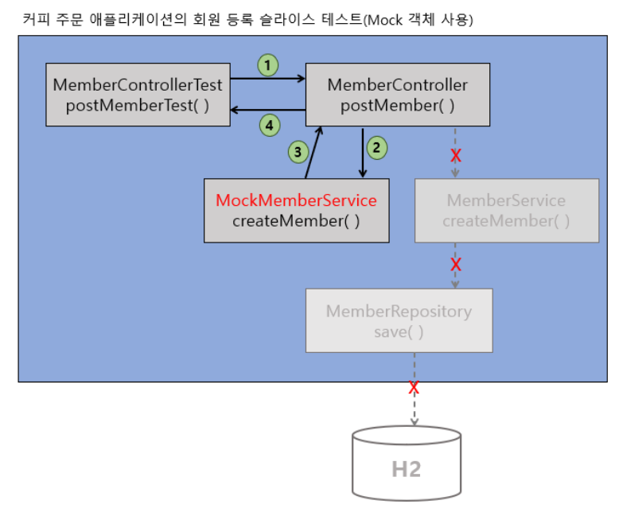

# Mock

​	**테스트 세계에서의 Mock은 바로 가짜 객체를 의미**합니다. 그리고 단위 테스트나 슬라이스 테스트 등에 Mock 객체를 사용하는 것을 바로 **Mocking**이라고 합니다. 슬라이스 테스트의 목적은 **해당 계층 영역에 대한 테스트에 집중하는 것이기 때문에 Mock 을 사용하는 것입니다.**



위 그림처럼 `MemberController` 의 `postMember()` 메서드를 테스트할 때 `MemberService` 의 `createMember()` 를 호출하게 됩니다. 하지만 `MemberController` 를 테스트를 할 때 `MemberService` 의 로직이 영향을 주면 안되겠죠. 그렇기 때문에 항상 일정한 값을 리턴하는 `Mock` 객체를 넣어서 사용하게 됩니다.

# Presentation 계층에서 Mockito 적용

​	Presentation 계층에서는 `@SpringBootTest`, `@AutoConfigureMockMvc`, `@MockBean` 등의 어노테이션을 사용합니다. 아래는 테스트 예시입니다.

```java
@SpringBootTest
@AutoConfigureMockMvc
class MemberControllerMockTest {
    @Autowired
    private MockMvc mockMvc;

    @Autowired
    private Gson gson;

    @MockBean
    private MemberService memberService;

    @Autowired
    private MemberMapper mapper;

    @Test
    void postMemberTest() throws Exception {
    
        // given
        MemberDto.Post post = new MemberDto.Post("hgd@gmail.com", "홍길동","010-1234-5678");
				
        Member member = mapper.memberPostToMember(post);
        member.setMemberId(1L);    

        given(memberService.createMember(Mockito.any(Member.class))).willReturn(member);

        String content = gson.toJson(post);

        // when
        ResultActions actions =
                mockMvc.perform(
                                    post("/v11/members")
                                        .accept(MediaType.APPLICATION_JSON)
                                        .contentType(MediaType.APPLICATION_JSON)
                                        .content(content)
                                );

        // then
       actions
                .andExpect(status().isCreated())
                .andExpect(header().string("Location", is(startsWith("/v11/members/"))));
    }
}
```

- `@MockBean` :  `Application Context` 에 등록되어 있는 `Bean` 에 대한 `Mockito Mock` 객체를 생성하고 주입해 주는 역할을 합니다.
- `given(...).willReturn(xxx)` : Mockito에서 stubbing 에 사용되는 메서드입니다. `...` 실행 시 `xxx` 결과를 무조건 리턴한다는 뜻입니다.

> `when` 과 `given` 은 모두 `Mockito` 에서 stubbing 에 사용되는 메서드입니다. `given` 은 BDD 스타일로 사용하기 위해 도입되었습니다. 아래 두 표현은 기능 상 차이가 없습니다.
>
> `when(mockObject.someMethod()).thenReturn(someValue);`
>
> `given(mockObject.someMethod()).willReturn(someValue);` 

## Business 계층에서 Mockito 적용

아래는 `Mockito` 를 적용할 `MemberService` 클래스입니다.

```java
@Transactional
@Service
public class MemberService {
    private final MemberRepository memberRepository;
    private final ApplicationEventPublisher publisher;

    public MemberService(MemberRepository memberRepository,
                         ApplicationEventPublisher publisher) {
        this.memberRepository = memberRepository;
        this.publisher = publisher;

    }

    public Member createMember(Member member) {
        verifyExistsEmail(member.getEmail());     // (1)
        Member savedMember = memberRepository.save(member);

        publisher.publishEvent(new MemberRegistrationApplicationEvent(this, savedMember));
        return savedMember;
    }

    ...
		...

    private void verifyExistsEmail(String email) {
        Optional<Member> member = memberRepository.findByEmail(email);  // (2)

        // (3)
        if (member.isPresent())
            throw new BusinessLogicException(ExceptionCode.MEMBER_EXISTS);
    }
}
```

`memberRepository.findByEmail(email)` 과 `memberRepository.save(member)` 가 Mocking 이 필요합니다.

아래는 `MemberRepository ` 를 Mock 객체로 생성한 테스트입니다.

```java
@ExtendWith(MockitoExtension.class)
public class MemberServiceMockTest {
    @Mock  
    private MemberRepository memberRepository;

    @InjectMocks    
    private MemberService memberService;

    @Test
    public void createMemberTest() {
        // given
        Member member = new Member("hgd@gmail.com", "홍길동", "010-1111-1111");

        given(memberRepository.findByEmail(Mockito.anyString())).willReturn(Optional.of(member));

				// when // then
        assertThrows(BusinessLogicException.class, () -> memberService.createMember(member));
    }
}
```

- `@ExtendWith(MockitoExtension.class)` : spring 을 사용하지 않고, `Junit` 에서 `Mockito` 의 기능을 사용하기 위해서 추가합니다.
- `@Mock` : 해당 필드의 객체를 Mock 객체로 생성합니다.
- `@InjectMocks`  : `@Mock` 을 통해 생성한 객체를 주입합니다. **memberService 객체는 주입받은 memberRepository Mock 객체를 포함하고 있습니다.**

