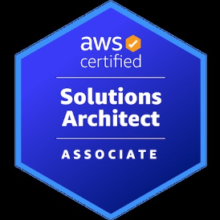

# 목표

완료(:white_check_mark:)  진행중(:warning:) 실패(:x: )

## 6월 목표 체크

### :white_check_mark: AWS SAA  자격증 취득

6.9 일자로 취득했습니다. >> [AWS SAA 합격 후기](https://hobeen-kim.github.io/review/Review-AWS-SAA-%ED%95%A9%EA%B2%A9-%ED%9B%84%EA%B8%B0/)

### :warning: spring basic 

기초가 가장 어렵다는 걸 알았습니다. 공부해도해도 끝이 없는 기분입니다. 애초에 목표설정없이 막연히 spring 의 기초를 끝내자라는 생각이었기 때문에 달성 여부도 알 수 없네요. 

### :white_check_mark: spring JPA 강의 듣기

​	영한님의 JPA 로드맵 완성이 목표였기 때문에 1차적으로 완료했습니다. 프로젝트에서 사용하는 건 별개의 문제겠지만 모르는 것을 모르는 단계를 넘어선 것 같습니다.

- [**자바 ORM 표준 JPA 프로그래밍 - 기본편** 시리즈 포스팅 바로가기](https://hobeen-kim.github.io/inflearn/Spring-JPA-JPA-%EA%B8%B0%EB%B3%B8%ED%8E%B8-Section-1.-JPA-%EC%86%8C%EA%B0%9C/)
- [**실전! 스프링 데이터 JPA** 시리즈 포스팅 바로가기](https://hobeen-kim.github.io/inflearn/Spring-JPA-%EC%8A%A4%ED%94%84%EB%A7%81-%EB%8D%B0%EC%9D%B4%ED%84%B0-JPA-Section4.-%EC%BF%BC%EB%A6%AC-%EB%A9%94%EC%84%9C%EB%93%9C-%EA%B8%B0%EB%8A%A5/)
- [**실전! Querydsl** 시리즈 포스팅 바로가기](https://hobeen-kim.github.io/inflearn/Querydsl-%EC%8B%A4%EC%A0%84!-Querydsl-Section-3.-%EA%B8%B0%EB%B3%B8%EB%AC%B8%EB%B2%95/)

### :warning: DB 공부

​	DB 공부는 현재 '[데이터베이스 개론과 실습](https://product.kyobobook.co.kr/detail/S000001743733)' 책으로 공부하고 있습니다. (약 50% 진도율) 

​	5월에 네트워크 공부(인프런 강의), 자료구조(쉽게 배우는 자료구조 with 자바), 컴퓨터구조 + 운영체제(혼자 공부하는 컴퓨터 구조 + 운영체제) 를 공부했었는데요. DB 는 다른 공부하느라고 눈에 안들어와서 한달째 절반밖에 못하고 있습니다. 7월의 저에게 마무리 부탁하겠습니다. (제발요)

### :warning: 기술 블로깅 6개

6월 동안 '열심히 고민해봤다' 라고 생각하는 주제에 대한 포스팅은 5개네요. 다른 포스팅도 있기는 하지만, 머리 아프게 고민한 부분은 아니라서 뺐습니다. 개수 채우는 데 연연할 건 아니지만 일주일에 하나는 좀... 적은데요.

- [Proxy 와 AOP 심화](https://hobeen-kim.github.io/spring/Spring-Proxy-%EC%99%80-AOP-%EC%8B%AC%ED%99%94/)
- [[web] 서블릿(sevlet)](https://hobeen-kim.github.io/web/WEB-%EC%84%9C%EB%B8%94%EB%A6%BF(Servlet)/)
- [[spring jpa\] merge 와 변경감지](https://hobeen-kim.github.io/springjpa/Spring-JPA-merge-와-변경감지/)
- [[Spring\] Hamcrest 과 custom Matcher](https://hobeen-kim.github.io/spring/Spring-Hamcrest/)
- [[Spring JPA\] 프록시 객체를 통한 EntityManager 동시성 문제 해결](https://hobeen-kim.github.io/springjpa/Spring-JPA-프록시-객체를-통한-EntityManager-동시성-문제-해결/)

### :white_check_mark: liquid & jekyll 로 블로그 꾸미기

[Jekyll 카테고리로 이동](https://hobeen-kim.github.io/jekyll/)

일단 1차적으로는 velog 비슷한 모양으로 꾸미는 데 성공했습니다. 더 필요한 기능은 없지만 자잘한 에러가 몇가지 있는데요. 그것만 해결하면 될 것 같습니다.

포트폴리오가 어느정도 완성되면 대문에 걸어놓기만 하면 됩니다. 나중에 시간되면 white/dark 모드 적용만 고민해봐야겠습니다. 사실 삐까번쩍한 네온사인 모드도 만들고 싶습니다. 디스토피아 느낌으로 배경도 "무차별 코딩로봇" 그림도 넣구요.

### :x: Oauth 기술 공부

​	7월에 ... Spring Security 공부하면서 해보겠습니다. 진짜로요.

## 7월 목표

​	글 작성시점에서 7월이 약 일주일 지났습니다. (23.07.06.)

### :page_with_curl: spring security

인프런에서 Spring Security 강의를 듣는 중입니다. 함께 OAuth 도 공부가 될 것 같습니다.

- [스프링 시큐리티 - Spring Boot 기반으로 개발하는 Spring Security](https://www.inflearn.com/course/%EC%BD%94%EC%96%B4-%EC%8A%A4%ED%94%84%EB%A7%81-%EC%8B%9C%ED%81%90%EB%A6%AC%ED%8B%B0/dashboard) - 약 30% 진도율 / 총 20시간
- [스프링 시큐리티 OAuth2 - Spring Boot 기반으로 개발하는 Spring Security OAuth2](https://www.inflearn.com/course/%EC%A0%95%EC%88%98%EC%9B%90-%EC%8A%A4%ED%94%84%EB%A7%81-%EC%8B%9C%ED%81%90%EB%A6%AC%ED%8B%B0) - 총 44시간

### :page_with_curl:DB 공부

​	계속 하고 있는 '[데이터베이스 개론과 실습](https://product.kyobobook.co.kr/detail/S000001743733)' 책을 마무리하겠습니다. (현재 약 50% 진도율) 

### :page_with_curl:docker, k8s

​	마찬가지로 강의를 통해 공부할 생각인데, 어떤 걸로 할지는 못정했습니다. 일단 제일 후순위 입니다. 아마 못할 듯 합니다...

### :page_with_curl:기술 블로깅

​	저는 공부를 비동기식으로 하는데요. 모르는 게 있으면 일단 메모장에 적어놓고 미래의 저라는 쓰레드에 맡깁니다. 리스트 중에 당장 눈에 들어오는 것만 적었습니다. (아직 1개도 못했습니다...)

- 도메인 모델 패턴 vs 트랜잭션 스크립트 패턴 (JPA)
- blocking IO, non-blocking IO asyn/syn IO 방식 정리
- 네트워크 흐름 정리 (요청에 따른 DNS 탐색부터 3 way handshaking, 패킷 전달, 4 way handshaking 까지 세부과정 분석 / 네트워크 중심)
- JPA lock 이란
- JTA 를 이용한 분산 트랜잭션 적용 (유어클래스)
- 스프링에서 비동기 처리 (@Async, 이벤트 리스너)
- CDN 과 GSLB

### :page_with_curl:toyProject

​	프론트 단을 변경하고 있어서 시간이 오래걸릴 거 같습니다. 7월 중에는 끝내는 게 목표입니다.

- 단위 테스트 코드 다 넣기
- 슬라이스 테스트, 통합 테스트 작성
- ERD 작성
- 코드 리팩토링

백엔드에서는 위에 내용만 수정하고 빨리 끝내고 싶은데 시간이 부족하네요.

### :page_with_curl:웹 개발자를 위한 웹보안

​	[**웹 개발자를 위한 웹 보안**](https://product.kyobobook.co.kr/detail/S000061404031) 은 여러가지 보안 취약점과 개발자가 할 수 있는 대응책을 소개하는 책입니다. CSRF, XSS 공격, SQL injection 등을 정리하고 싶어서 샀습니다. Spring Security 공부하면서 틈틈히 보려고 합니다. (진도율 10%)

# KPT

## Keep

​	나름 6월 목표를 어느정도 이뤘다는 점입니다. 근데 성격 상 뭘 잘하고 있다고 느껴지는 건 없네요. 앞으로도 계획을 잘 세우고 성취해나가야겠습니다.

## Problem

1. **하루를 초과하는 계획**

   ​	여기에는 몇 가지 문제가 있는데요. 첫 번째는 말 그대로 하루를 초과하는 계획이 계속 이어진다는 점입니다. 인프런 강의 시간이 1시간이라면 사실은 1시간 + 정리하는 시간 40분 정도로 1시간 40분이 필요한데, 시간 계획은 1시간 10~20분으로 반영되어있다는 겁니다. 두 번째는 중간중간 딴 짓을 많이 한다는 점입니다. 이건 뭐... 고칠 수도 없네요.

2. **늦게 자고 늦게 일어나는 패턴**

   ​	1번 사항에 따른 사이드 이펙트입니다. 추가적인 영향으로, 운동을 게을리하게 되었습니다.

3. **중요하지 않은 것에 집착하는 성격**

   ​	큰 줄기를 먼저 공부하고 곁 가지를 공부하는 게 우선인데, 그게 잘 안되는 것 같습니다. 테스트를 공부할 때도 Hamcrest 의 Custom Matcher 는 그만큼 시간을 쏟을 게 아니었다고 생각하는데, 하루를 꼬박 태웠다는거죠. 물론 언젠가 사용될 일이 있겠지만 그때와 지금은 기회비용이 다릅니다.

4. **미래를 위한 큰 그림 부재**

   하나하나 공부를 한다고 하더라도 목표가 없다면 방향을 잃을 거 같은 느낌이 듭니다. 미래를 위한 큰 그림이라고 말은 했지만, 결국은 중기 목표인 취업을 위한 그림이 없는 것 같습니다. 7월 한달 동안은 포트폴리오에 대한 고민을 하면서 어느 기업에 지원할지 고민해야 겠습니다.

## Try

1. **계획 세밀하게 짜기**

   Problem 의 1, 3번 사항은 계획을 세부적으로 짜면서 해결할 수 있습니다. 2번도요. 물론 그 계획을 따르는 의지도 있어야 합니다.

2. **1시 이전에 취침, 8시 이전에 일어나기**

   별 내용은 없습니다만 정신건강을 위해 1시 이전에는 자보도록 하겠습니다.

3. **Job Search**

   제 시간 계획에 Job Search 를 반영하겠습니다. 이제는 정말 준비하는 시간이 필요할 듯 합니다. 구체적인 기업을 20 ~ 30개 정도 검색하고 거기에 맞게 포트폴리오를 정리해봐야겠습니다. 또 공채나 상시 채용 일정도 봐야겠구요.

